# Първа Част - Ходене по мъките 

## Въведение

Много видях и преживях. Родих се и прекарах десет години от детството си в
царство България. Цели четиридесет и пет години преживях много страдания и
унижения през годините на комунистическия режим като „враг на народната власт“.
Вече повече от двадесет и осем години пък страдам и от непрокопсания
посткомунистически преход, моделиран от българската комунистическа партия и
нейната Държавна сигурност. Срещу мен бяха разработени специални „опорни точки“
въз основа на даденото Указание от Висшия съвет на БСП за „неутрализиране“ на
бившите „врагове на народната власт“.

С неизмерими трудности е изпълнен животът ми. Мои роднини и приятели, които
знаят за нерадостното ми минало, отдавна ме молят да седна и опиша всичко, което
съм преживял. Някогашният окръжен училищен инспектор Никола Пашов, моят
незабравим покровител в учителското ми поприще, ме посъветва да си водя дневник
и записвам в него всеки ден и час от моето ходене по мъките.

Като преподавател в Югозападния университет „Неофит Рилски“ най-близките ми
приятели, известни български учени, като научиха за моите патила и станаха живи
свидетели на постоянните атаки срещу мен, в един глас ми казаха: „Твоят живот
трябва да се опише.“

Най-настоятелен да опиша патилата си през комунистическия режим беше професор
Йордан Венедиков, с когото скрепихме незабравимо приятелство. И двамата сме
потомци на македонски войводи.

Децата и внуците ми разлистваха семейния архив, прочитаха всичко от него и с
топъл поглед ме молеха да опиша всичко, за да го четат и техните деца.

Не бързах да пиша, но всичко преживяно от миналото го кодирах в моите мисли,
които легнаха непоклатими в паметта ми. Имам и хубавия навик да пазя всички
документи, които илюстрират нагледно и убедително жизнения ми път. И така,
седнах и започнах да пиша. Възкръсваха дните и годините, през които животът ми
преминаваше.

## 1. Нерадостно, но вълнуващо детство

На 3 юни 1934 година майка ми и баща ми свиват семейно гнездо. Цялото село се
стича, за да участва в сватбеното тържество и да поздрави деветнадесетгодишния
син на своя войвода и дългогодишен кмет в Либяхово. Идват и бившите четници на
Атанас Попов от околните села, заедно с техните семейства. Кумът на младоженците
Лазар Иванов Малаков също събира цялата си рода. В осиротялата Попова къща
сватбарите се надпреварвали да донесат кой каквото може, за да подпомогне
младоженците.

Майка ми и баща ми заживяват щастливо, въпреки големите трудности, които срещат.
На 1 април 1935 година баща ми постъпва в казармата, за да отбие редовната си
военна служба. Майка ми е бременна и на 22 май се раждам в Поповата къща, в
стаята на войводата. Лазар Малаков и жена му ми дават името на дядо. Радостта в
семейството ни е голяма, защото съм първото дете на родителите си. Баща ми е
получил три дни домашен отпуск, за да види своята рожба. Вечерта в нашата къща
се събира цялата рода. Баба Серафимка и дядо Велик, които са родители на майка
ми, го посрещат първи с думите:

– Кръстьо, възкръсна името на свато Атанас. Вярвай, че синът ти ще бъде достоен
да носи неговото име. Баща ти оживява в него.

Татко се насълзил като чул тези думи. Минали седем години от разстрела на баща
му, но тежката буца в гърдите му още стояла. Радостта от първата му рожба
стопила голяма част от горчивата скръб.

През времето, когато татко отбивал военната си служба, цялата грижа за мен пада
върху майка ми. Помагали ѝ двете лели Стоянка и Мехалина, които са били –
първата на 12, а втората – на 9 години. Чичо Петър едва смогвал да върши мъжката
работа, затова с нея често натоварвал и сестрите си. По-малката му сестра
Мехалина ходила с воловарчетата, а леля Стоянка наглеждала женската работа в
семейството.

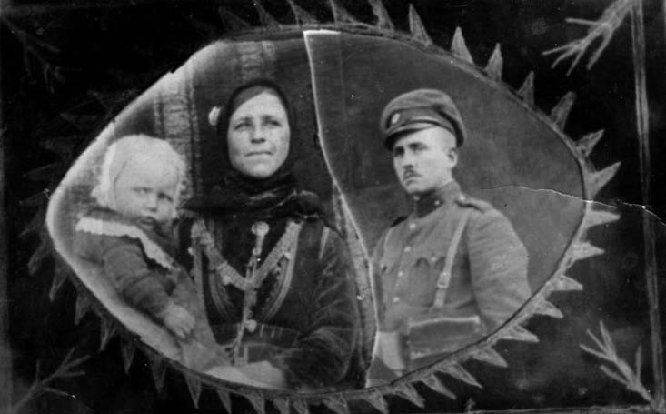

>   *В прегръдките на майка, когато татко е в казармата*

Когато съм навършвал втората си година, баща ми се завърнал от казармата и
започнал да помага на майка при отглеждането ми. Лелите ми казваха, че винаги ме
държал в дясната си ръка и ме подмятал нависоко, за да прокуди отрано страха у
мен. Учил ме как да стоя изправен и да крача като строен войник, какъвто бил
той. Майка пък ме криела винаги в скута си и ме киприла с чисти и спретнати
дрешки, които сама ушивала. В цялата рода тя била известна като голяма
чисточница. Като такава я помня и аз от детските си години. Винаги у нас беше
много чисто и подредено.

По-късно, когато станах на пет години, започнах да ходя по нивите, заедно с
майка, татко и лелите Стоянка и Мехалина. Татко се гордееше с двете си сестри,
които бяха едни от най-гиздавите и работливите в селото.

Никога няма да изтрия от паметта си гласът на лелите, които бяха известни
песнопойки. Пееха и тогава, когато им беше много трудно. С песента прокуждаха
мъката си. Понякога забелязвах сълзи на очите им, които извираха от изстрадалите
им сърца като кръгли сирачета.

Сутрин рано, преди да се зазори, татко ни събуждаше. Подвикваше и на чичо Петър:
„Бате, хайде, ставайте, че зората скоро ще се пукне.“

>   *Петгодишен, бос, заедно с Магда Малева*

Докато ние се подготвяхме, татко беше натоварил кошовете на магарето и тръгвахме
да берем тютюна, за да изпреварим зазоряването. Лелите и татко подхващаха по
един ред и кършеха сръчно листата, които поставяха на купчинки през един ред. Аз
ги събирах и нареждах в кошовете. Мълчанието на нашата и съседските ниви се
прекъсваше с песента на лелите: „Море, съмни, съмни, боже. Не съмнува“. Когато
зазоряваше, лелите сменяха песента. А щом слънцето показваше първите си лъчи,
започваха друга, с която го молеха да не бърза, а да изчака, за да не увяхнат
набраните листа и да напълним кошовете с тютюн, тогава да покаже горещото си
лицe.

Нивите ни бяха далеко от селото. Тютюн садихме най-много на местностите Моянско
поляне и Кълниката. Докато стигнем до вкъщи с напълнените кошове, слънцето се
издигаше високо над Градище.

Когато порасна и братчето ми Стоян, двете лели се омъжиха. При ниженето на
тютюна останахме ние с майка и татко. Леля Стоянка хареса калеко Георги Малев, а
леля Мехалина – калеко Димитър Божков. Новите им домове са само на няколко
разкрача от нашата къща, затова идваха почти всяка вечер на гости у нас.

В моята памет от детските години възкръсват и дните по време на жътва на
местността Киселичето, която е близо до границата с Гърция. Там идваха да ни
помагат някои от роднините. Обикновено тук майка разрязваше за първи път
стареца, който татко правеше от най-хубавото свинско месо. Не знам дали на друго
място се прави такъв вкусен деликатес като либяховския червен старец. Поради
далечното разстояние от селото обикновено спяхме на нивата под дъба, където
обядвахме и вечеряхме. Никога няма да забравя надпреварата по надпяване между
жените от съседните ниви. И тук, в най-големите горещини, работата не спираше.
Песните огласяха върховете на Байрямка, оттам се спускаха към българските села,
останали под гръцко владение.

Вършитбата беше по плевните. На нашето вършило впрягахме двете крави, с които
подкарвахме вършилника – голям конусовиден камък, който мачкаше ръжта докато
сламата не стане удобна за храна на добитъка през зимата. След един-два враха
разпрягахме воловете и децата от съседните плевни тръгвахме да напасем добитъка
към Вълканче или Кириндол. През това време майка и татко изнасяха житото на
Поляната, където духаше по-често вятър, който прочистваше ръжта от плявата.

Обикновено през летните месеци домашният добитък го наглеждахме ние, децата. В
празничните дни се събирахме по няколко и подкарвахме воловете и кравите към
Качолеца, Горни лъки или Чиркейци. Майка ми правеше ядене, което поставяше в
засрук (дървен съд). На обяд се събирахме на едно място повече говедарчета.
Най-често децата от нашата махала пладнувахме на Качулеца, до Каралазьовата
нива, където си правихме голям гьол, в който се събираше водата от дерето. Там
се къпехме. Ние с моя сватил Стойко Божков, съседите Кръстьо Бродев и Димитър
Гахов бяхме неразделни. С тях вечер ходехме и на паша. Подкарвахме мулетата и
магаретата към местности, където те пасяха през нощта, а ние завити в черги или
козунаци спяхме под открито небе. Това бяха едни от най-хубавите нощи, които съм
запомнил. Когато падаше дъжд през нощта, се криехме под по-големи дървета.

Все още сънувам нашето лозе, където заедно с братчето ми Стоян прекарахме много
дни от детството ни. Дядо Атанас беше създал едно от най-хубавото лозе в нашето
село, оградено с какви ли не овощни дървета (ябълки, сливи, зарзали, круши и
какво ли не още). Още през 1923 година, когато бил избран за втори път за кмет
на селото, поканил трима агрономи от Неврокоп, с които огледал местностите Кирин
дол, Габаре, Жилепица, Борчика и Отровата, където след две година израснали
китни лозя, оградени с овощни дръвчета. На нашето лозе най-голямо дърво беше
черешата, която украсяваше цялата овощна градина. Щом зазрееше, заедно с брат ми
Стоян се редувахме да я пазим. Направихме си колибка под нея, от която с поглед
пазехме цялото лозе. До една от ябълките имаше тунел, в който се криехме.
Понякога се решавахме да му намерим края, но не успявахме, защото ставаше
страшно. В тъмнината се чуваха какви ли не звуци, които ни стряскаха. И така, не
можахме да узнаем колко дълъг беше този тунел и кой го е направил. Старите хора
казваха, че през годините на турското робство в него се укривали онези мъже от
нашето село, които не прощавали за злодеянията на турците.

През есента, когато узряваше гроздето, цялото село се изнасяше, за да прибере
богатата реколта. Най-оживено беше около нашето лозе, където бяха и лозята на
Малакови (дядо Лазар и дядо Илия), Пашовото, Мангушевото, Радевото, Биларевото,
Главчевото, а под тях Икономовото и Дерменовото. На отсрещния баир, с поглед към
Градище, бяха Чипиловото, Бродевото, Пахунчевото, Бекяровото, Влаховото,
Халембаковото и още много други лозя.

Набраното грозде пренасяхме с кошове, които натоварвахме на магарета и мулета и
пренасяхме по домовете, в които бяха подготвени големите бъчви, в които се
изсипваше и мачкаше, след което кипваше хубаво пенливо вино. Дядо беше направил
голяма бъчва, която заемаше почти цялото избено помещение. През пролетта бъчвата
се изпразваше, ние с братчето ми Стоян се криехме в нея. По-късно, когато
комунистите дойдоха на власт и лозята бяха изоставени, тя се превърна в
скривалище на по-малките ми братчета Велик, Китан и Серафим.

След есента в нашето село лягаше тежка зима, която създаваше големи трудности,
защото снегът затрупваше улиците и площада. Ние, децата от нашата махала,
упорито си пробивахме път до Поляната или тясната уличка до Гърневата плевня,
където си правехме пързалка. Малко бяха онези, които имаха купени шейни. Татко
ни направи такава от дъбови дъски, която с братчетата ми използвахме заедно.
Понякога носехме дървени и гумени обувки, с които се пързаляхме като скиори.

От детските ми години съм запомнил и зимните вечери в моето село, когато се
правеха седянките. Те бяха своеобразни нощни театрални представления главно с
действащи лица момичетата и момчетата. Обикновено бяха свързани с калапясването
на тютюна или с плетенето на рогозки от царевична шума, които се използваха за
постели в стаите или коридорите. Ергените се събираха на групички и гостуваха на
седенкарките.

Преди да отидат при тях, пееха хубави песни и подвикваха, когато тропаха на
портите, че идват при момичетата. Домакинките ги посрещаха като истински гости.
Гощаваха ги със специално направена плакета (баница) или с лешници и орехи.
Някои от ергените се застояваха до след полунощ, за да изпратят своите изгори.

Мъчително тежко, но незабравимо за цял живот беше моето детство. То спохожда
често сънищата ми и ме прави по-щастлив отколкото в сегашната мрачна
действителност, която прелива от нови мъки и страдания.

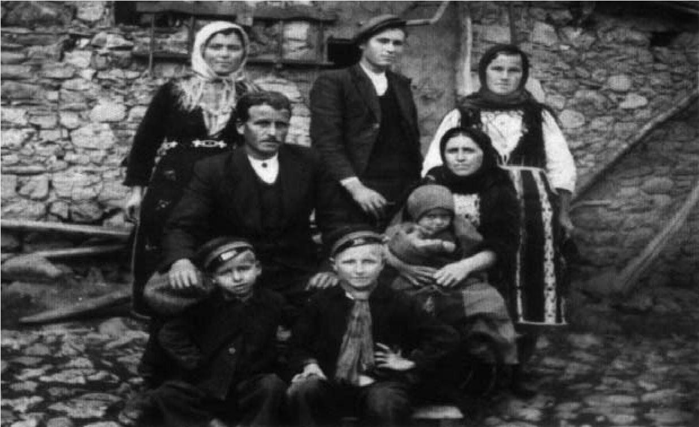

>   *Пред родната ми къща през 1944 година. Отпред са майка и татко, а в техните
>   скути сме с брат ми Стоян и малкото братче Велик. Отзад са двете ми лели
>   Стоянка и Мехалина, заедно с калеко Димитър Божков.*

## 2. Моето родно село Либяхово

И днес, когато се завръщам в родното си село, възкръсват детските ми спомени,
които са пълни с неизмерима любов към хората, земята и къщите, които крият все
още в своите дувари толкова много неразкрити истини, радости, страдания и
стенания.

Ето как по време на пътуванията си по долината на река Места Васил Кънчов е
описал хубостите на моето родно село:

„Либяхово е разположено на един малък приток на р.Буровица (Мътница). Има
прекрасен вид от върха, гдето бях аз. Над него по върха се виждат обработени
ниви, а надолу – ливади“ – пише изследователят на Македония.

Когато Кънчов е посетил моето село, то е наброявало 300 български къщи, в които
живеели „разбудени“ български семейства. Нямало нито едно турско, помашко,
влашко или циганско семейство. През това време цели четиридесет години
коджабашия (кмет) на селото е прадядо ми Иван Зимбилев (Коджабашията). Още от
1870 година либяховци имат българско училище. Те стоят в редовете на първите
борци в борбата за национална и църковна независимост в Пиринския край.

Помня от детските си години моето родно село като едно от най-красивите в полите
на Пъзлак, Стъргач, Градище и Байрямка. Нямаше педя земя, незасята с нещо. В
селото имаше много стада (кози и овце), които се местеха от нива на нива.
Наторяваха къра, където растеше буйна ръж. А полето се тореше с гюбрето от едрия
рогат добитък. Така и най-високите места в селото се обработваха. Най-много
стадата се застояваха покрай Бука, на Байрямка, Киселичето, Качюлеца, Моянско
поляне, Горни лъки, Кириндол и Дойчова кория.

Пукнеше ли пролет, всичко позеленяваше. Чуваше се весела гълчава навсякъде,
понякога прекъсвана от кучешки лай. Девойките и младите булки се надпяваха по
нивите. Песните им достигаха до върховете, които заграждаха целия синор, после
се връщаха отново, за да полеят с мелодията си равнините на Вълканче, Долни лъки
и Кирин дол. Орачите подвикваха на воловете, а овчарите засвирваха с кавалите и
пискуните си, направени саморъчно от самите тях.

Беше истинска народна веселба, когато се работеше. Затова нямаше умора. Песните
и подвикванията изпълваха сърцата с радост и доволство. Работливите селяни се
надпреварваха по нивите. Когато слънцето се скриваше зад Пъзлак и започваше да
се смрачава, копачки и орачи се прибираха в селото. Песнопойките се надпяваха
докато се приберат по домовете си. Доволни бяха всички от извършената работа.
Децата подскачаха пред майките и бащите си, които ги хвалеха за хубавата им
работа на нивата.

Много често отделните родове се събираха заедно, за да се редуват при прашитба
на нивите, засети с тютюн и мисир (царевица). Най-често се събираха по време на
жетварските дни, вършитбата и вечерите по плевните, когато се ронеше царевицата.
Така бе по-весело, и на нивата, и пред трапезите, които се правеха под някоя
дебела сянка на старо дърво.

В дъждовните дни през пролетта и лятото река Мътница (някои я наричат Буровица),
която извира от югоизточните поли на Али ботуш, полудяваше, когато минаваше
покрай нашето село. Тя събираше десетки приточета от югоизточните върхари на
Пирин, Стъргач и Папазчаир. Минаваше лудо през нашите местности Песците,
Кириндол, Вълканче, Борчика, след което се скриваше укротена в Клисурата. Но
когато излизаше от нея, отново разстилаше снага през полето на Долни лъки.
Нейният път продължаваше през Долна клисура, покрай село Петрелик и Долна
Сингартия, след което се вливаше успокоена в река Места.

Много често Мътница беше страшна, много страшна. Тогава тя помиташе дългия
дървен мост, който мъжете от селото издигаха от Долния Бунар до нашата нива на
отсрещния бряг, откъдето започваше пътя за местността Вълканче.

Един от притоците на р. Мътница идваше от Пазлак. Минаваше през Горната махала
на нашето село, свиваше снагата си покрай площада и вече, заприличал на малка
река, се вливаше в Скока. Това е дерето, което събираше водите и от другите
краища на селото и се вливаше при местността Менгенето в Мътница.

Когато имаше проливни дъждове, хората от нашата махала се събираха на Поляната,
откъдето с поглед се прегръщат не само къщите на цялото село, но и околните
върхове, някои от които бяха разделени с голяма болка на „наши“ и „гръцки“. Само
по-силните мъже не се страхуваха и отиваха до Долния бунар, където укротяваха
буйните вълни на придошлата река. А тя беше страшна, много страшна, защото
носеше всичко, което бе разкъртила и го поднасеше на река Места, която го
събираше в своите широки скути и носеше на Бяло море.

Беше трепетно време, което е легнало здраво в моята памет. Сега спомените за
него ме спохождат в сънищата, които ме връщат десетки години назад.

Мисля си, че ако не възкръсне миналото, преживяно от нас време, няма ли да
опасност да опустошеят и душите на нашите деца и внуци. Те трябва да знаят за
нашето детство, за младостта ни, за радостите и мечтите ни, за да не увехне
родовата им памет. Сегашното и идните поколения на моето родно село ще бъдат с
по-богати мисли и чувства, ако запазят спомените, разказани или написани от нас.
С тази родолюбива задача се захванах, когато започнах да пиша тази книга.

Бях малък, много малък, но помня, а и в сънищата ми възкръсва преживяното. Не
само семейството, но и родът ни беше осиротял след злодейското убийство на дядо
ми и неочакваната смърт на чичо ми Стефан, свързана с тежкото му преживяване.
Той не е могъл да понесе страшната истина, че братът на жена му става убиец на
баща му. Това могат да го направят само изчадия, какъвто е бил Димитър
Панчелиев, син на секретаря на комунистическата партия в нашето село.

Тежко, много тежко беше на всички ни в голямото, осиротяло семейство. Заедно с
нас, в къщата ни бяха и двете ми лели Стоянка и Мехалина, които като деца
загубили майка, баща и брат. Живеехме заедно и с чичо Петър. Баща ми, макар и
по-малък от чичо, беше наставник на всички. Той носеше не само хубостта, но и
чертите на дядо. Когато ни беше много трудно, татко ни милваше с поглед, а чичо
прокуждаше мъката ни с песни, които запявахме всички по време на работа.
Най-много пеехме при низане на тютюна. Отпявахме се до полунощ. Често ни
припяваха и съседите от Бродевия, Божковия, Гаховия, Ковачевия, Малаковия,
Халембаковия и Мангушевия двор. Започнеше ли някой да пее, захващаше цялата
махала. А песните бяха от хубави по-хубави. Грабваха веднага сърцата и мислите
ни. Имаше и такива песни, които с текста и мелодията си пълнеха очите ни със
сълзи. Разказвашесе за македонските комити, които са прекършили своята младост в
борбата с османлии, или пък с предателите на народа.

Често ни гостуваха сватовците дядо Петър Малев и дядо Нашко Божков. Понякога
заедно с тях идваха и техните съпруги, баба Матина и баба Мария. Покрай нашето
огнище, в комитската стая, се събираха на раздумка баща ми и двамата негови
сватовци, които тачеха революционното дело на дядо ми като войвода и разказваха
с възторг за него. И те се гневяха от онези, които наричаха нашето семейство
„фашистко“. Макар че дядо Петър Малев беше един от основателите на партийната
група в селото, а дядо Нашко негов симпатизант, никога не чух между тях и баща
ми да има „престрелка“с думи. Разговаряха като хора с различни идеи така, както
в наше време не разговарят псевдополитиците. Понякога говореха открито против
партията, която беше объркала техните мисли и чувства. Наричаха някои от нейните
членове „касапи“ заради жестокостите им.

У нас много често идваха и децата на дядо Георги Зимбилев, който е бил
най-добрият помощник на дядо ми като войвода. Братя Зимбилеви – Димитър и
Атанас, бяха неразделни с баща ми. Обръщаха се винаги един към друг с думата
„брачед“ (братовчед). Когато имаше селски веселби, тримата бяха сред най-добрите
хороводци. Спомням си, на един от великденските празници цялото село се беше
стекло на Поляната. Под големия бряст бяха се събрали бабите и дядовците, до тях
невестите, а в средата на поляната кандидатките за женитба, заедно с онези,
които се учеха от тях. На детската поляна, близо до Пашовата къща, пък играеха
децата. Татко беше повел хорото, а до него братя Зимбилеви. Пееха и играеха
всички. Не знам дали другаде можеше да се види такава красива веселба.

Друго място, където се събираше цялото село, бе Ширината, площада на селото. И
тук хората бяха на три места. Най-голямо бе хорото на кандидатите и кандидатките
за женитба. На него се харесваха бъдещите младоженци. До Малаковата къща пък
беше „семейното хоро“, където се събираха младите семейства. Пред портата на
Захариевата къща виеха своето хоро най-малките, децата на селото.

Понякога, в обикновените делнични вечери, веселбите се правеха по махали. Тогава
се надпреварваха с песните си момичетата и момчетата от Жабарската, Даскаловата
и Пъзлаканската махала. Дочуваха се и песните, които звучаха по-тихо от
местността Свети Атанас. Там, под големите дъбики, се събираха младите от
Гюровия, Воденовия,Чипиловия, Калайджиевия и близки до тях други родове.

През летните неделни дни младежите и девойките се събираха извън селото.
Широкият път на местността Башлейка беше място за разходки най-вече на
влюбените. Там се събираха на групички всички младежи и девойки от селото, които
се надпяваха. Покрай пътя, скупени на групички по широките ливади, се провикваха
най-палавите ергени и задяваха влюбените.

Друго място извън селото, където се събираха младите, беше Вълковица. Там
разходките започваха от училището и стигаха до Варницата, където имаше чешма с
два чучура.

Най-големият празник на Либяхово беше на местността Свети Илия. Сутринта, след
изгрев слънце, цялото село се стичаше към голямата поляна на Вълканската кория.
По пътеките от Садово на големи групи прииждаха и гостите от другите села, които
идваха да празнуват заедно със своите роднини и съседи.

Отделните родове и фамилии застилаха чисти шарени черги, наслагваха се вкусни и
разнообразни гозби, насядваха семейство до семейство, род до род, цялото село на
едно място, а сред всички – и гостите, които бяха на особена почит. Сладко беше
яденето сред толкова хора, но още по-сладки бяха раздумките между тях.
Необятната гледка на цялото землище на родното село сграбчваше очите, за да
покаже хубостта си.

На този хубав празник момите и ергените захващаха първи веселбата, завиваха
дълго хоро, на което се хващаха и млади, и стари. Който не можеше да играе, се
червеше от срам. Веселяха се всички до насита. Разбира се, имаше и сергии,
състезания и какво ли не още. Много неща се промениха оттогава. Промениха се и
хората. Немалко от тях се разпиляха през т.нар. години на „народната власт“ по
далечни краища на страната, но в мислите им остана неугасващият плам за родното
село, заело най-топлите кътчета в сърцата им. Останалите в него комунисти
преместиха събора от Вълканската кория на ливадите до Гьолевия дъб, където бяха
създали тяхната партия. Така разпиляха и разделиха хората и селото.

Ех, мое незабравимо, изстрадало минало !

Няма да те залича от моята памет. Но искам за теб да знаят и внуците ми, затова
те възстановявам в спомените си.

Не мога да отмина и Георгьовденския празник, когато едни оставаха на веселбите в
селото, на Поляната и Ширината, но други ставаха рано, преди изгрев слънце, и
през Горни лъки тръгваха за Горна Сингартия, където е манастира „Свети Георги
Победоносец“. След участието си в ритуалите на манастирския двор, поемаха
обратно по пътя си към село, за да не изпуснат тукашните веселби.

Кой казва,че нашето минало е било черно? Мисля си, че в миналото имаше повече
радост в душите на хората и светлина в очите им. Нищо, че понякога работата беше
непосилна. Тя ги каляваше и сплотяваше. В нея се съхранявахаонези нравствени
добродетели, които понякога сега не можем да срещнем даже и в роднинските
взаимоотношения, които са наранени от новото време на непрокопсания
посткомунистически преход.

Децата в моето родно село бяхме научени от родителите си да подхващаме отрано
всяка работа, която трябваше да се върши в семейството. Още от малък баща ми ме
научи на всичко, което той също още като дете бе усвоил. Изпращаше ме да бера
дърва от местността Бука. Не се страхувах, въпреки че това беше гората до самата
граница, откъдето се вглеждах в съседните български села, останали вече под
гръцко владение. При копаене на тютюна се нареждахме всички деца, заедно с
майка. Тя ни наставляваше как да копаем и да пазим стъблата на тютюна от
нараняване. Надпреварвахме се. Братчето ми Китан винаги водеше баша. Той не се
изправяше докато не изкара реда.

През тези години семейството беше първото училище, в което научавахме
най-важните правила в живота. Родителите ни бяха строги, но добри учители, от
които научавахме всичко, което определяше нашето мислене и поведение.  

## 3.Събития, които имаха съдбоносно значение за нашия народ

Като в ден днешен съм запаметил и деня, когато в родното ми село Либяхово, в
началото на месец април 1941 година, дойде многобройна германска войскова част,
която бе разположена от десния бряг на река Мътница до Гърневите ливади и близо
до нашата нива на местността Пехците. Войниците бяха контактни с местното
население, много дисциплинирани и спазваха завиден ред в тяхното поведение.
Понякога ни забавляваха и подаряваха бонбони и шоколади. На конете поднасяха
сухари в специални торби. Някои от моите приятели си вземаха част от дажбата на
кротките животни. Често войниците идваха на Ширината в селото, където си
купуваха яйца от местното население.

Друга германска войскова част се бе разположила на местността Долни лъки, където
бе започнато бързо строителство на голям мост над река Мътница. Беше направено и
укрепване на шосето от с. Садово до границата, по което германските войски
трябваше да тръгнат за Гърция.

На 6 април 1941 година цялото училище и младежите от нашето село се стекоха до
Фердинандовото ханче на Моянче, от дясната страна на шосето за Драма. Всички
носеха цветя, набрани от околните баири. На първите редици бяха подредени
най-красивите ученици и младежи. Най-гиздавата селска девойка държеше в ръцете
си голям букет, предназначен за генерала, който се очакваше да води начело
германската войска в Гърция.

Първа на Моянче пристигна моторизираната част, пред която беше модерният джип на
генерала. Сред насъбралото се множество изригна мощно „ура“. Чуха се призиви:

– Браво, юнаци! Искаме си Беломорието! Там са нашите братя и сестри.

След силен оръдеен изстрел откъм местността Долни лъки германската войска тръгна
към границата с Гърция, която премина без никаква съпротива от гръцките
граничари.

След около две седмици от навлизането на германците в Драмска околия, на 20
април 1941 година части от войските на Втора българска армия тръгнаха в
Беломорието. Радостта на населението от Либяхово беше голяма, защото се
говореше, че бежанците, които бяха в Неврокопския край, ще се върнат към родните
си места.

Още на 22 февруари през 1941 година баща ми беше повикан като запасняк в
граничното поделение в Либяхово, заедно с дядо Илия Пашов, вуйчо ми Кръстьо
Мангушев, Тодор Самаров и други.

>   *Баща ми / първият отляво / като граничар на пост № 9 Булаир.*

След навлизането на германските войски във Вардарска Македония татко беше
преместен в Скопие, където престоя до 30 май 1941 година. През това време
мъжката работа в нашата къща поеха майка ми и двете лели Стоянка и Мехалина. Ние
с четиригодишното ми братче Стоян им помагахме.

Една година по-късно, на 26 юни 1942 година, баща ми отново беше повикан като
запасняк в областния град Ксанти, където престоя до 31 декември 1942 година.
Когато се завърна, се омъжи леля Стоянка. Макар и много бедни, татко и чичо
Петър направиха хубава сватба, на която се стече цялата рода.

## 4. Първите ученически години

През учебната 1942-1943 година бях ученик в първо отделение. В училището ми беше
приятно и по-леко, защото учителите ме обичаха. Най-грижовен към мен беше
директорът Иван Икономов, който не скриваше голямата си привързаност към нашето
семейство. Често ме спираше и казваше:

&minus;Ти, Атанасе, трябва да бъдеш най-добрият ученик, защото от твоя род са
    най-будните хора от нашето село.

Тези думи на директора предадох на баща ми, който ми каза:

&minus;Вярно е. Прадядо ти поп Стоян и дядо ти Атанас са потомци на възрожденския
    Зимбилев род. Затова и двамата със Стоян трябва да сте будни и умни като
    тях.

Винаги, когато се връщах от училище, татко искаше да знае как съм се представил
в учебните часове, а вечер ме караше да му разказвам уроците, които съм
подготвил за следващия учебен ден. Майка се радваше, че разказвах увлекателно, а
братчето ми Стоян я гледаше кротко и я уверяваше, че и той ще бъде ученолюбив
като мен като стане ученик.

>   *Училището в родното ми село Либяхово, където завърших началното и основното
>   си образование*

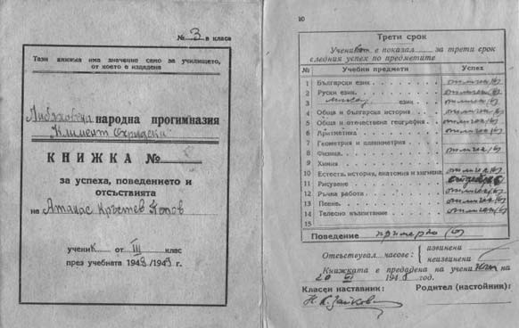

>   *Това е ученическата ми книжка от трети прогимназиален клас. След това
>   продължих да уча в елитната Неврокопска гимназия, която също завърших с
>   отличен успех.*

На 24 май 1943 година имаше голям училищен празник, посветен на братята Кирил и
Методи. По вече утвърдена традиция в нашето училище на този ден учениците
показваха своите знания, след което получаваха удостоверение за успеха, който са
получили през учебната година. След като директорът на училището Иван Икономов
съобщи, че преминавам от първи за втори клас с отличен успех, излязох на
специално изградената и украсена с много цветя трибуна и рецитирах
стихотворението „Аз съм българче“. Бях почти оглушен от силните възторжени
викове на празнуващите родители и ученици. Това беше първото ми кръщение като
рецитатор. След това като такъв участвах във всички училищни и селски
празненства.

А когато в стройни редици тръгвахме към площада, за да участваме в общоселския
празник за освобождението на България от турско робство, учителката по пеене се
провикваше :

&minus;Наско, дай тон !

Цялото училище запяваше в един глас „Тих бял Дунав се вълнува“. Никога не мога
да забравя и стройните ни редици, когато цялото училище тръгваше на молебен за
здраве към селската църква „Света Богородица“. Обикновено това ставаше в съботен
ден. Най-отпред бяха първокласниците, а в последните редици – седмокласниците. С
нас бяха учителите, които ни научиха да знаем наизуст християнските молитви.
Винаги преди да започне първият учебен час, дежурният в класа казваше наизуст
молитвата „Отче наш“, а останалите я повтаряхме след него. Когато в църквата
влизаха всички ученици, имаше тишина и завиден ред, който се спазваше от всички.
Много често към сладкопойните гласове на църковния хор се включваха и нашите
гласове, а най-напредналитеученицичетяха някои от молитвите.

Преди големите църковни празници често майка ме водеше с нея, за да преспя и аз
в църквата. През нощта сякаш бях в небесен свят сред всички светии и ангели.
Всичките тези преживявания са втъкани дълбоко в моята памет, които пазя като
свидни за цял живот.

Още като ученик, през пролетната и лятната ваканция, татко често ни караше с
братчето ми Стоян да се учим да орем. Помня, че за първи път държах ралото
здраво на нивата ни в местността Каровча, която беше близо до село Везмен.

&minus;Това е наша българска земя. Трябва да я пазим като очите си – казваше татко.
    Тази нива е от прадедите ни, когато Беломорието е било наше.

Така татко ни предаваше първите уроци по историята на родния край. От нашата
нива на Каровча се гледаха селата Везмен, Вълково и Зърнево, в които отново се
върнаха някои от роднините ни. Няколко пъти бяхме на гости при тях.

Стотици са страниците от моите детски спомени. Не мога да разтворя всичките,
защото някои от тях напълват очите ми със сълзи.

През 1944 година 39-и неврокопски полк тръгна към Гърция. На 7 април в
местността Моянче посрещнахме войниците. Няколко деца отидохме рано сутринта на
Кутелчето, за да ги посрещнем първи. Там срещнах бай Велик Мангушев и бай Васил
Икономов. Като ме видя, бай Васил се провикна:

&minus;Хей, Насе, ела да те видим!

Бай Велик се стресна и го попита:

&minus;Това наш Наско ли е? Насе, ела тук, за да ми разкажеш как се учиш!

Бай Велик ме разпитваше как се представям в училище и дали съм прочел всички
книги, които ми даде от неговата голяма библиотека.

## 5. Деветосептемврийската вакханалия в родното ми село Либяхово

Бях деветгодишен, когато комунистите екзалтирано ликуваха на девети септември
1944 година. В Либяхово дойдоха няколко „шумкари“, които престояха в гората по
eдин или два дни и ги нарекоха „партизани“. Към тях се присъединиха техните
съидейници, децата и внуците на по-старите комунисти, санданисти и оранжеви
земеделци, които ги наставляваха какво да правят, с кого да се разправят.

А тя, разправата на комунистите в моето родно село Либяхово, започна с нашия
род, от бащина и майчина линия, с близките и съратниците на дядо ми като пунктов
неврокопски войвода на ВМРО. Нарекоха ни „фашисти“– всички, и родителите ни, и
нас, децата, които не бяхме чували дотогава тази дума.

Новата власт обяви дясното крило на най-патриотичната българска организация ВМРО
за „терористична фашистка организация“, а лявата – ВМРО (обединена) и
Македонската федеративна организация като „прогресивни“. Така се започна отново
братоубийствената борба. Някога тя бе започната от Яне Сандански, а сега от
неговите идейни последователи.

Някои представители на левицата в Пиринския край започнаха свирепа касапница
срещу изтъкнати дейци на ВМРО. Тяхната жестокост оправдаваха обикновено с т.нар.
Дъбнишки събития. Комунистите изсипаха купчина лъжи, скриха истината, че в това
село „са наказвани не просто комунисти и демократи, а уличените в сътрудничество
с чуждите завоеватели и потисници в поробена Македония и в прояви против
националноосвободителната борба на ВМРО“ (вж. Александров, Иван. За ново мислене
и нов подход по някои въпроси от българската история. С, 1988 г., с.70). Някои
от убитите в Дъбница са били включени и в терористични групи, ръководени в този
край от убиеца на Борис Сарафов и Иван Гарванов – Тодор Паница, който подготвял
подведените от него за терористични действия в Неврокопския край, както и за
посрещане на гръцките войски, с помощта на които трябвало да бъде свалено
правителството и унищожена Вътрешната македонска революционна организация.

В една от септемврийските вечери на 1944 година Главинчев и неговите червени
отряди мародерстваха в страната, а съидейниците му от моето село обградиха
къщата ни. Майка и татко бяха на плевнята, където нощувахме докато не приберем
царевицата. Беше към девет часа. Подготвях се да излизам, взех един пишник хляб,
който трябваше да занеса на плевнята. Там майка готвеше вечерята на огнището,
което направи татко. Когато излязох на потуна и пристъпих към стълбището, се чу
силен дрезгав мъжки глас, който приличаше на пиянски:

&minus;Кръстьо, предай се ! Отиде си вашето фашистко време. Сега ще ти видим
    сметката!

Заканата към татко ме стресна. Спомних си това, което ми беше казал, че ние с
комунистите сме от два различни свята. Сега те го търсеха, за да му видят
сметката. Уплаших се, но бързо реших, че трябва да предупредя татко за хората,
които обградиха къщата, че носят пушки и са от онези, които той наричаше
комуняги, оранжевци и санданисти. С тихи стъпки слязох по дървената стълба,
открехнах вратата откъм съседната Бродева къща и през тясната уличка между нея и
нашата къща останах невидим за онези, които блокираха къщата ни. Тичешком, с
привеждане се добрах до плевнята. Вместо татко, ме посрещна майка. Тя държаше в
ръцето си едногодишното ми братче Велик, а в полите си криеше шестгодишното ми
братче Стоян, който плачеше за татко. Разбрах, че него го няма. Майка ми каза,
че е отишъл на Моянско поляне, за да натовари набраната царевица. После
научих,че той е бил сигурен, че ще го арестуват, затова се беше скрил в една
чужда плевня, която се намираше по-далеч от селото.

След половин час хората, които обградиха къщата ни, блокираха и плевнята. Майка
им каза, че татко е на Моянско поляне. Тази местност е до самата граница, затова
те се уплашиха и се втурнаха да го търсят там. Помислиха, че е тръгнал да
премине границата.

На следващата нощ търсачите на татко отново блокираха плевнята. Той се показа
пред тях спокоен, с познатия му строг поглед, който плашеше комунистите.
Прегърна ни – майка,братчетата, и ни каза:

&minus;Пазете се. Не се страхувйте за мен. Комунистите са страхливци. Ние сме
    по-силни от тях.

Татко се обърна към мен:

&minus;Насе, носиш името на дядо си. А той беше силен войвода. И ти си силен, нали?
    Пази майка ти, Стоян и Велик!

Майка се разплака. Татко ни целуна и се разделихме. Трима от помагачите на
новата власт насочиха пушките си към него и го подкараха към общината, където
бяха и другите арестувани – все от нашия род. Единият от тези, които подкараха
баща ми, беше роднина на убиеца на дядо ми.

Същата нощ вече бяха прибрали всички от рода ни, които бяха опасни за
комунистите. Не се посрамиха от годините на дядо Велик, бащата на майка ми.
Горкият, него го бяха посинили от бой, без жалост. През 1933 година
червено-оранжеви терористи разстреляха сина му Борис на улицата.

Занизаха се кървавите септемврийски, а след това и октомврийски дни и нощина
1944 година. Комунистите и оранжевите земеделци ликуваха, мародерстваха,
разстрелваха, погребваха живи или полуживи техните „врагове“, родолюбците, елита
на България. Саморазправата на червените отряди в селата и по-малките градове
беше още по-жестока, защото местните джелати сами решаваха кого да затрият или
потрошат от бой. Те се отличаваха по препасаните червени ленти на ръкавите или
войнишките кепета с петолъчки. Носеха заредени пушки на раменете, препасани
пистолети на коланите, наточени войнишки ножове или пък малки топори. С цялото
това снаряжение тръгнаха настървени срещу „враговете на народната власт“.
Скандираха „Смърт на фашизма“, а приличаха досущ на отрядите на Хитлер.

Такива видях и джелатите в моето родно село, които разплакаха жените, децата и
старите хора в нашия род. Освен от нашата къща, писъци се носеха от Мангушеви,
Зимбилеви, Главчеви, Канчеви, Солакови, Калайджиеви и всички останали семейства,
в които е имало четници на дядо ми. Никой не знаеше каква е съдбата на
подкараните и затворени в общината. Не се чуваха писъци, защото това бяха
най-коравите мъже на селото. Побойниците ги вързали, за да не буйстват. Дядо
Ангел Главчев не издържа жестокостите на един от оранжевите побойници и издъхна.

Близките и роднините оплакваха живи арестуваните. Майка ми покриваше лицата ни с
братчето Стоян с престилката си, за да не гледаме сълзите, които като малко
ручейче се стичаха от очите ѝ. Освен за татко, тя ридаеше и за дядо Велик и
вуйчовците ми. Споменаваше с голяма тъга и името на вуйчо Борис, убит от
санданисти и комунисти още през 1933 година.

След две седмици от ареста на татко, в една тъмна, непрогледна нощ мои близки го
донесоха прекършен от бой. Роднини дадоха овчи кожи, с които майка го обвиваше,
за да утихнат болките му. Никога няма да забравя погледа на татко, отправен към
мен и братчето ми Стоян. Очите му бяха влажни, но не пусна нито една сълза.
Мъжествеността му остана несломена. С нея той покоряваше всички ни, но и плашеше
враговете си.

Все още не вярвахме, че всички затворени в общината, с изпотрошени ребра от бой,
бяха разпуснати, защото в селото вече се знаеше, че за тях е подготвен гроб до
границата, където трябваше да бъдат захвърлени мъртви или полуживи. После
научихме,че новоназначеният кмет от комунистите, баща на един от побойниците,
проявил състрадание. Като чул жестоките удари със сопи и прикладите на пушките
по телата на арестуваните, влязъл при тях. Просъскал със зъби и казал на
побойниците:

&minus;Стига вече, малко ли кръв проляхме досега в този род ?

Така масовият гроб до границата, предназначен за мъжете от нашия род, както и за
хората от четата на дядо, остана празен, но след това „защитниците на народната
власт“ го изпълниха с трупове на млади хора, които искаха да преминат границата,
но намираха смъртта си до нея. Наричаха ги „диверсанти“, а бяха смелчаги, които
не се покоряваха на комунистическата власт. Измежду тях имаше и млади хора от
другите източноевропейски страни, които като екскурзианти използваха страната
ни, за да се спасят от комунистическия гнет в тяхната страна. Едни от тях
успяваха да преминат границата, но други оставяха костите си на нея.

Баща ми, чичо ми и останалите роднини се разминаха със смъртта, но техните
побойници и агентите на току-що създадената Държавна сигурност продължаваха да
държат в обръч къщите ни през нощите, изпълнени със страдания и свити сърца.
Понякога идваха и през деня, за да тършуват. Продължаваха да измъчват баща ми,
от когото искаха да предаде пистолета, пушката и войводската униформа на дядо
ми.

Никак не бе случайно това, че когато агентите на Държавна сигурност претърсваха
нашата къща, първо се нахвърлиха върху семейния архив, за да заличат следите от
миналото. Помня, че един от тях каза на другите:

&minus;Късайте, но след това всичко прибирайте в чувалите!

&minus;Ще ги хвърлим в дерето, нали ? – попита друг.

&minus;Не, ще ги запалим. Нека всичко тяхно изгори, за да не ги намерят децата и
    внуците им.

Ограбиха цели папки с документация, книги, списания, вестници и много снимки, в
които бе историята на нашия възрожденски род. Гледах онемял. Запомних
изкривените лица на онези, които питаха и мен за войводската униформа на дядо.
Искаха да знаят къде е скривалището му и дали има в него оръжие. Най-голям мерак
имаха за револвера на войводата. Но не го намериха. Всичко, от което се
страхуваха, искаха да го открият и да го унищожат, за да няма следи от него. Но
не можаха да изтрият паметта ни, която е жива и помага, за да разкажем всичко
преживяно от нас на нашите деца и внуци.

Червените джелати горяха снимките и документите на дядо пред очите ми. Сякаш се
страхуваха да не възкръсне. В един от стенните шкафове, който забравиха
търсачите, намерих неоткрити от тях, подвързани в две големи папки, грижливо
подредени двата вестника „Македонско огнище“ и „Македонска трибуна“. Баща ми
беше казал, че в тях имало публикации за жестокото убийство и панахидите,
устроени в памет на дядо ми. При едно от следващите претърсвания комунистите
откриха и прибраха двете папки. Казаха, че с тях ще подпалват по-лесно печката
на партийния клуб, в който се четеше само „Работническо дело“. Един от търсачите
прибираше в джобовете си някои от сребърните вилици и лъжици, с които дядо
посрещал най-скъпите си гости. Друг извади войнишки нож и го заби близо до
лицетоот снимката на дядо. Таткоскочи, изви ръката на неканениягост. Ножът
падна, „убиецът“ на портрета на дядо се изплаши и побегна. След този случай той
повече не идваше в дома ни. И до днес портретът на дядо стои окачен на стената в
една от стаите на родната ми къща в Либяхово. Следата от ножа е запазена, за да
се знае за разправата на неговите врагове и след убийството му.

>   *Всички четници на дядо бяха арестувани и затворени в мазето на общината,
>   където бяха пребивани по най-жесток начин.*

Никога няма да забравя, че един ден, когато майка и татко ги нямаше, един от
претърсвачите на нашия дом нахълта и се гмурна в тоалетната, която беше
направена вътре в къщата, чиста, спретната и с постоянно поддържана хигиена в
нея. Като го видях, изпищях, а той ми запуши устата и просъска:

– Брей, фашистите имат и нужник като стая, в която сигурно крият още нещо. Сега
не намерих нищо, но някой ден пак ще дойда. Кажи, какво криете още там ?

Понякога сънувам мрачните нощи, когато по улиците на моето село се мяркаха
сенките на няколкото доносници на Държавна сигурност. Имаше ги във всяка махала.
Но най-много бяха в нашата, която те наричаха „фашистката“. Те слухтяха около
къщите на обявените от тях „врагове на народната власт“. В нашето село имаше и
един пратеник от КГБ, който минаваше за техен началник. Той стана известен с
побоищата над най-непослушните. Казваше се Евлоги. Най-много пострада от него
непокорният бай Стоян Пандев. Пречупи му краката, след което в селото тихомълком
се тананикаше тъжната песен „Руснакът Евлоги чупи ноги, пазете се, хора“.

Помня и идването на двама руски войници в нашето село, които се бяха напили до
козирката. Без капка срам те се разхождаха с разпасани панталони и търсеха
хубави жени, за да се гаврят с тях. Аз бях пред читалището. Покрай мен минаха
две от учителките, които се прибираха от училище. Като ги видяха,
„освободителите“ руснаци се втурнаха към тях. Учителките побягнаха и се скриха в
къщата, където живееха. Руснаците започнаха да тропат по външната порта на
Траповата къща. Жените от махалата се уплашиха. Залостиха и техните порти.
Вдигна се голяма врява. Събраха се мъже, които обаче не смееха да кажат нищо на
„братушките“. По едно време видях моят първи братовчед бай Велик Мангушев,
заедно с още един войник. Те бяха запасняци и настанени в училището. Бай Велик
прояви учудваща за всички смелост. Свали автомата от рамото си и го насочи към
двамата руснаци. Предупреди ги, че са арестувани. Заедно с другия войник ги
подкараха към общината, където бяха затворени в една от стаите, докато не дойдат
от град Неврокоп, за да ги приберат в руското поделение, което беше отседнало в
село Баничан.

През тези години комунистите залостиха входната врата на църквата „Света
Богородица“. Преследваха се и онези, които посещаваха гробовете на своите
близки. В моето село има две черковни камбани – голямата и малката, които си
пригласят, когато ги слушаме за църковни празници. Комунистите заглушиха малката
камбана, а поставиха червена боя върху голямата. Тя се използваше винаги, когато
имаше „тревога“. Всяка вечер, а понякга и през деня, камбаната забиваше силно и
стряскаше цялото село. Комунистите и оранжевите земеделци се събираха пред
общината на групи, въоръжени с пушки, които държаха по домовете си. След като
научаваха къде е била нарушена пак границата от диверсанти, побягваха да
унищожават „изменниците на родината“.

Една вечер, заедно с моя съсед Димитър Гахов, тръгнахме на паша. Аз – с нашето
магаре, а той – с техния кон. Преди да стигнем до м. Качолеца, чухме разтърсващи
нощната тишина картечни изстрели. Когато стигнахме до Пахунчевото дере,
затрещяха изстрели и зад нас. Бяха ни взели за диверсанти в непрогледната
тъмнина. Скрихме се в дерето, което беше обградено с храсталаци. Цяла нощ
укротявахме магарето и коня, за да не ни открият. На разсъмване видяхме, че
дерето беше оградено от десетина преследвачи на диверсанти. Като ни видяха,
закрещяха и казаха, че ще ни арестуват. Един от тях обаче разкандардиса другите
и получихме наказание шамаросване, което остави синини по лицата ни. Помолиха ни
да не казваме на никого за случилото се.

Още от първите години на тяхната власт комунистите в нашето село успяха да
разделят хората на „наши“ и „врагове“. Разделиха и нас, децата. Често някои от
моите съученици ме наричаха „фашист“. Те бяха едни от най-посредствените, но
надъхани от родителите си, които членуваха в комунистическата партия или
оранжевия земеделски съюз. Измисляха си „героични“ истории на бащите и дедите
им. Разделението в нашето село беше страшно. То доведе до появата не само на
широките размери на доносничеството, но и до угодничеството, т.е. до
заслоняването на някои до силните на деня, на които слугуваха.

Партийните ръководители и техните измекяри в селото направиха профилактика и на
песните, които се пееха по време на семейните празници и седенките. Когато на
сватбата на бай Атанас Зимбилев неговите роднини Димитър и Атанас Зимбилеви,
заедно с баща ми и някои други мъже от нашия род, запяха песента за Тодор
Александров „Я излез, Гюрге“, къщата на младоженците беше обградена от
ченгетата. Те бяха потърсили помощ и от граничната застава, от която дойдоха
десетина граничари с набучени на пушките ножове. Арестуваха сватбарите, които
пееха и възхваляваха прославения в борбата за свободата на Македония Тодор
Александров. Прогониха и останалите сватбари от Зимбилевата къща. Като видях
татко, когото подкарваха към общината, застанах пред него, за да видя дали са го
били. Той ме прегърна, целуна ме и ми каза:

– Насе, не се страхувай ! Ти знаеш,че ние сме по-силни от комунистите. Иди при
майка ти в къщи и я успокой. Да не се страхува, аз ще се върна.

В нашето село заглъхна и църковната камбана. Комунистите забраниха религиозните
празници. Най-болезнено бе преживяна забраната на традиционния родов празник,
посветен на Света Богородица. Изоставени бяха и общоселските събори на
местностите Св. Илия и Св. Атанас. Създаден бе нов празничен календар, в който
се отбелязваха само събития, свързани с кървавите деяния на комунистическата
партия.

Когато по време на червените митинги на селския площад с неистови крясъци се
възхваляваха измислените герои, известни със своите злодеяния, ние всички от
рода се събирахме в нашата къща и свивахме сърцата си от болка. Там, пред
набързо издигнатия паметник, с изписаните на него имена на убийците на прадядо
ми свещеник Стоян Зимбилев, на дядо ми войводата Атанас Попов и на вуйчо Борис
Мангушев, комунистите възхваляваха истинските убийци, а хулеха достойните за
уважение и признание, които отдадоха живота си за свободата на Македония. Те
крещяха най-много срещу дядо ми, който е възстановил село Либяхово след
изпепеляването му от гръцките войски през 1913 г. (вж. Възрожденските корени на
моя род, с.67-207).

През 1947 година започна ускорено македонизиране на населението в Пиринския
край. Спомням се, че баща ми преживя болезнено този процес, защото както
прадядовците му Иван, Георги и Атанас Зимбилеви, така и дядо му Стоян Зимбилев и
баща му Атанас Попов са били ревностни защитници на българската кауза.

В нашето село дойде македонски учител, който преподаваше по македонски език и
македонска история. Помня,че жена му беше много красива и предизвикателна.
Мъжете от селото я заглеждаха, а жените я одумваха като „лека“, затова не я
обичаха. А той, учителят по „македонски език“, проучваше по-будните ученици.
Често се отбиваше покрай мен, сядаше на моя чин и започваше да ме хвали, че съм
бил „най-личен“ ученик. Усещах, че искаше да ме „превземе“, за да обикна
„македонския език“. Но това не се получи. Един ден потропа на нашата порта. Баща
ми я отвори и като го видя, му каза:

&minus;Ти, даскале, ако още не си научил, да знаеш, че този дом е българска
    крепост, която никой няма да превземе, защото е изграждана от прадедите и
    дедите ми. Ти също си българин. Не знаеш ли това?

При тези думи учителят по „македонски език“почервеня, намръщи се и си отиде.

От този ден той не се отбиваше покрай моя чин. Поглеждаше ме криво и
заплашително.

В едно от междучасията видях „македонеца“, качил се на малка стълба, да сваля
портрета на Иван Вазов. На негово място искаше да постави лика на Йосиф Броз
Тито. Прислужникът бай Тодор Дерменов ме погледна тъжно и ме попита какво да
прави с портрета на югославския вожд.

Намигнах му и казах:

&minus;Бай Тошо, какво ви пречи Вазов?

Размърдах стълбата, учителят се обърна назад, залитна и падна върху портрета на
своя „вожд“. Стана голяма дандания. За да се отърва от заканите на „македонеца“,
се гмурнах в учителската стая, където ме скри моят учител Пандо Воденов, с
когото имахме роднинска връзка.

Като ученик в прогимназията разбрах, че моята известност сред приятелите ми като
вече пишещ стихове и най-добрите свободни съчинения започна да притеснява
съучениците ми от групата на „нашите“ на тогавашната власт. Някои от учителите
ми се радваха много, но един-двама, които бяха „ушета“ на тогавашната власт,
започнаха да създават конфронтация между мен и децата на „хората на властта“.
Хубаво беше, че в нашия клас такива нямаше много.

Един ден учителката по български език и литература, която ми беше класна
ръководителка, дойде у нас. Бях се усамотил в комитската стая и довършвах
портрета на свато ми Атанас Божков. Едното му око на снимката беше затворено.
Жена му, баба Мария, искаше да го отворя като другото. Рисувах с молив, нямахме
пари за боички. Майка отвори неочаквано вратата, посочи учителката, която беше
зад нея, и каза:

&minus;Имаме си хубава гостенка, посрещни я и целуни ръката ѝ!

Станах и ги посрещнах малко притеснен, защото никой още не знаеше, че освен че
пиша стихове, които учителката ме молеше да ги изпратя за публикуване, рисувах
портрети и пейзажи. Не бях съгласен, защото в тогавашните детски вестници
детското стихоплетство също беше политизирано. Пишеха се стихове, които
възхваляваха Георги Димитров и Йосиф Сталин. А моите стихове разкриваха мъката в
душата ми, която причиняваха комунистите.

&minus;Наско, ама ти си бил и художник! – Възкликна учителката и ме прегърна. Взе
    снимката и току-що завършения портрет на бял картон. Съпостави ги, обърна се
    към майка и каза:

&minus;Лельо Кипро, вече бях уверена, че Наско ще е бъдещ мой колега по литература,
    но сега виждам, че той е и художник.

&minus;Ела, ела да видиш и неговия автопортрет в другата стая – похвали се майка.

След този ден вече и другите учители знаеха, че съм и художник. А когато баба
Мария дойде да си вземе портрета на свато Нашко, прегърна го и дълго плака. И до
ден днешен той стои в една от стаите на Божковата къща.

Не станах нито поет, нито художник, но по-късно продължих пътя на моята учителка
по български език и литература. Генетически в мен е била кодирана лобовта ми към
учителската професия от прадядо ми Георги Иванов Зимбилев, който създава едни от
първите новобългарски училища в Източна Македония.

## 6. Ученик в Неврокопската гимназия

След като завърших основното си образование, баща ми ме записа с последните си
пари в Неврокопската гимназия. Там открих и други, които имаха моята съдба на
преследвани от комунистите. Събирахме се в Тиганчевия хан, за да изплачем мъката
си. Тук отсядаше в пазарните дни и дядо ми Велик, който ме зареждаше с по някой
лев, за да оцелея. Той беше преброил годините на комунизма и ме уверяваше, че
ние ще доживеем другото време, заради което синът му Борис, брат на майка ми,
беше прострелян на улицата от комунист и оранжев земеделец, които са били
известни като „кокошкари“и продавачи на краден едър добитък в Гърция. През
годините на „народната“ власт синът на един от убийците на вуйчо ми, който беше
полуграмотен, беше кмет в родното ми село Либяхово. Той скалъпваше
характеристиките на младежите, които искаха да продължат образованието си или
пък да отбиват военната служба. На всеки млад човек от
„неблагонадеждните“семейства, смятани за „врагове на народната власт“, намираше
големи кусури, затова характеристиките им завършваха със заключението
„Отношението му към народната власт е отрицателно.“

Като ученик в гимназията през първата учебна година бях на квартира заедно с моя
свато Стойко Божков, който беше вече известен като талантлив поет сред своите
съученици и учителите. Живеехме при баба Елена Левтерова в една стая. Тя спеше
на едното легло, а ние двамата – на другото. Така заплащахме половината наем.
Беше ни тежко и неудобно, но какво да се прави. И двете наши семейства бяха
бедни.

През тази учебна година започнаха масовите изселвания на т.нар. „народни
врагове“. Една вечер в квартирата ни дойде наш съсед, който искаше да излезем
навън, за да ми каже нещо много важно. Когато отидохме на улицата, той ме хвана
за рамото и с наведени очи ми прошепна, сякаш се страхуваше,че и на улицата
някой може да ни подслушва:

&minus; Изпраща ме баща ти, защото той не може да дойде. Комунистите от селото не го
    изпускат от погледа си. Каза ми да ти предам неприятна вест, която обаче не
    бива да те плаши много. Ще ви изселят от село, заедно с още три други
    семейства. Ти знаеш защо, нали? Прибери си багажа, за да си готов. Като
    дойдат родителите ти тук, ще минат да те вземат. Ти трябва да ги чакаш пред
    Тиганчевия хан.

Тежка буца ми задави гърлото. Стана ми мъчно за майка. Как ли ще понесе това тя
като е толкова болна? Цяла нощ не заспах. Бях мигнал за малко и през тези минути
сънувах, че двама милиционери ми връзват ръцете и ме подкарват към затвора,
който беше до Тиганчевия хан. Там бяха майка, татко и братчетата ми Стоян и
Велик. Когато отворих очи, тях ги нямаше. Скочих бързо от леглото, облякох се и
побягнах навън. Видях два камиона, в които имаше натоварени две семейства от
нашата махала, които изселваха в Северна България. Жените и децата плачеха.
Тръгнах към Тиганчевия хан, откъдето трябваше и аз да пътувам с родителите си
като изселник. Чаках цял ден, но никой не дойде. По едно време видях дядо Велик
Мангушев да пришпорва мулето си към мен.

&minus;Насе, чедо! Ела, дядовото, идвам само заради теб. Нося ти радостна вест.
    Няма да ви изселват. За вас се е застъпила майката на кмета Борис Гърнев.
    Като деца те с дядо ти Атанас са били побратими. Тя сплашила сина си, че ако
    изселят и семейството на нейния побратим, ще тръгне с него. Изселиха само
    Зимбилевите братя, Георги Клайджиев и Димитър Трапов. Димитър и Атанас
    Зимбилеви бяха деца на четника Георги Зимбилев, пръв братовчед на дядо ми,
    войводата Атанас Попов. Георги Калайджиев е бил негов помощник.А другият
    изселен беше бай Димитър Трапов, известен бакалин в селото. При него се
    събираха мъжете на раздумка и чаша ракия. Той беше добър човек, помагаше на
    всички, но не обичаше новите властници.

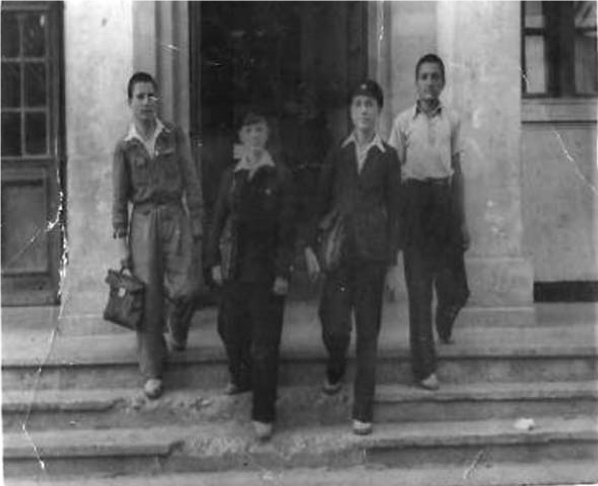

>	*Пред входа на гимназията в град Неврокоп (отпред, от лявата страна) между
>	Иван Малаков и Лазар Кимилев*

През следващата учебна година се преместих на квартира у Георги Вълчев, който
беше наскоро построил новата си къщичка. От нея се отваряше хубава гледка на
града. Съвсем наблизо беше Тиганчевия хан, на който отсядаха всички дошли от
нашето село през пазарните дни. Тук ми беше по-удобно да правя срещите си с дядо
Велик. Живеех заедно с Иван Малаков, син на моя кръстник Лазар Малаков, който
беше известен като един от най-кротките хора в нашето село. Такъв беше и Иван. С
него заживяхве заедно като истински братя.

Наемът за квартирата у хазаина ми Георги Вълчев се „изплащаше“ от татко с по два
чувала царевица, които натоварваше на магарето ни и ги даваше на хазаина всеки
месец. Когато хазайката разбираше, че нямаме храна, много често ни канеше на
вечеря, заедно с децата ѝ Димитър и Иван. Хазаинът изглеждаше строг, но беше
много добър човек.

Последната година бяхме заедно с брат ми Стоян на квартира у Стоил Бъчваров,
който е познавал лично дядо Атанас и често ми говореше за авторитета му като
неврокопски войвода. Веднъж ме повика, за да ми каже, че много приличам на дядо,
а братчето ми Стоят – на поп Стоян.

&minus;Аз бях от другото крило на ВМРО, но си останах привързан към Ст. Филипов и
    дядо ти Атанас, защото бяха почтени войводи. Не ми харесваха нашите
    санданисти, които прикриваха отначало големите пакости на Безим Яне, а след
    това на Тодор Паница и Иван Коемджиев. Те не бяха войводи, а разбойници,
    които поставиха началото на братоубийствата и в нашата околия. Та нали
    Коемджията разстреля не само прадядо ти поп Стоян по време на молитва, което
    може да извърши само един злодей, но преди това неговата банда разстреля и
    войводата Михаил Даев.

Слушах хазаина и запомних задълго всичко, което ми разказваше за дядо. Сближихме
се със сина му Георги, с когото запазихме добрите си взаимоотношения и до днес.
Една вечер Гошо влезе в нашата стая. Завари ни с брат ми Стоян, когато вечеряхме
с малко хляб и две ябълки, които ни беше дал дядо му Кръстьо.

&minus;Наско, това ли е вашата вечеря? Нямате ли друго за ядене!?

Братчето ми наведе глава и се изчерви. Аз се престраших и казах на Гошо, че от
два дни ядем само трахано с айрян, който вече приличаше на побеляла вода.
Очаквахме следващия ден да дойде татко и да ни донесе малко фасул.

Гошо сви вежди и излезе. След малко донесе една купичка с фасул, който беше
сготвила майка му.

Такъв беше нашият ученически живот в гимназията. Затова очаквахме нетърпеливо
всеки понеделник, когато идваше на пазар дядо Велик. С парите, които ни даваше,
можеше да си купим „купечки“ хляб и малко боза, която разреждахме, за да стигне
и на двамата с брат ми.

Много често, когато вече нямахме нищо за хапване, в съботния следобед поемахме
пеша към село. Тогава нямаше превозни средства до Либяхово. Поемахме по тесните
пътеки, които минаваха покрай Мосомище, Ляски, Копривлен и Садово. Най-трудно
беше изкачването на височината на м. Кендик. Обикновено тук правехме по няколко
почивки, след което се спускахме покрай Вълканската кория, за да стигнем до
реката, над която имаше голям дървен мост.

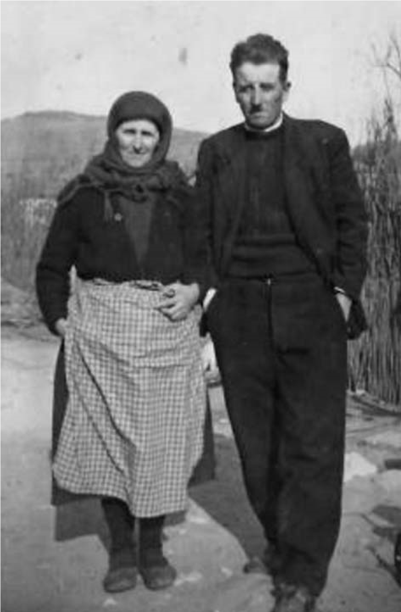

>   *Майка и татко винаги намираха сили в себе си, за да се грижат за нас с
>   много любов*

Родителите ни очакваха нетърпеливо. Майка приготвеше вечерята, а татко бързаше
да ни разпитва с брат ми Стоян как сме се представили през седмицата в училище.
Той искаше всичко да знае от нас. Оставаше доволен от това, което му разказвахме
за училищния ни живот и не забравяше да ни уверява, че един ден мъките ни ще
имат край.

Директорът на гимназията Иван Икономов никога не ме отминаваше, когато се
срещахме. Не забравяше да ме похвали за това, че съм много ученолюбив и скромен.
Веднъж ми каза, че ние сме повече от роднини, защото дядо ми Атанас и баща му
свещеник Атанас Икономов са били изключително близки приятели. От него научих,
че през 1926 година като кмет на селото дядо повикал баща му и заради неговата
богата музикална култура му предложил да кандидатства за овакантеното място на
свещеник Петков. След това двамата превръщат църквата „Света Богородица“ в
духовен храм, който спомага за обединяването на населението в Либяхово.

Моите съученици в Неврокопската гимназия ме познаваха като един от най-добрите
краснописци, затова често идваха да ги науча на красиво писане, което изискваше
и богата езикова култура. Както в прогимназията, така и в гимназията
литературата ми беше любим учебен предмет. Бях приятно изненадан, че известната
народна учителка по математика Спаска Фурнаджиева ме беше похвалила на директора
на гимназията. Поръчала по него да я потърся и да поговори с мен. Когато се
срещнахме, ме стисна здраво за ръката, задържа я, погледна ме в очите и ми каза:

– Атанасе, ти си възрожденско чедо, знаеш ли? Прадядо ти Георги Иванов Зимбилев
е бил учител на всички просветни дейци от Неврокопския и Драмския край. Радвам
се, че като негов правнук обичаш и ти науката. Така ще прославиш рода си, а след
теб децата и внуците ти ще продължат твоя път. Вярвам, че така ще бъде, защото
традициите в Зимбилевия род се предават от поколение на поколение.

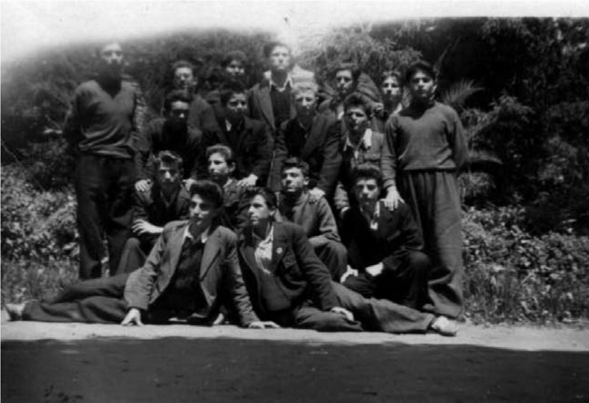

>   *С моите съученици в градската градина*

След тази среща с моята любима учителка често си мислех за моя род, който
комунистите не обичаха. Мислите ми за родовата памет станаха по-дълбоки и
трайни, когато и учителката Елена Бояджиева винаги изпращаше поздрави на
баща ми. При всяка среща с нея все ми говореше за него. Казваше, че били
съученици през първата година в гимназията. Отличавал се като един от
най-добрите в класа, който покорявал съучениците си с благия си характер и
несломимия си борчески дух. Убийството на баща му обаче попречило да
продължи образованието си.

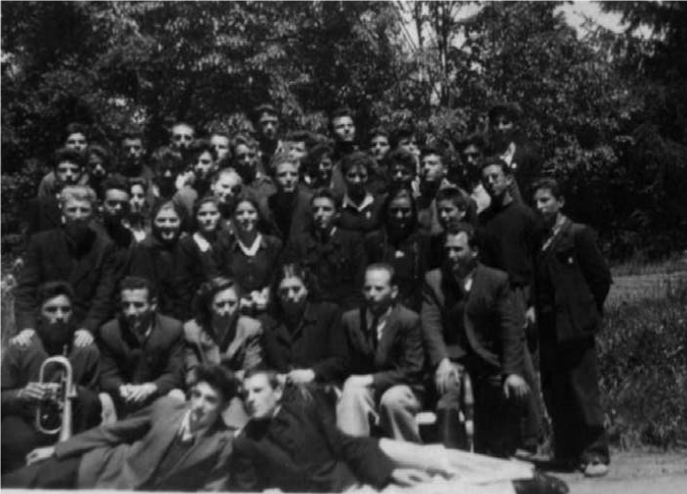

>   *Като ученик в 11 б клас, заедно с любимите учители и моите съученици в
>   навечерието на матурата, 14 май 1953 г.*

В Неврокопската гимназия бяхме разделени на две групи ученици. Едните бяха
привелигированите, синчета и щерки на комунистите и техните ортаци – оранжевите
земеделци, а другите бяхме деца на „враговете на народната власт“, потомци на
дейците на Вътрешната македонска революционна организация, осъдените от
„Народния съд“ и лежалите по затворите и лагерите на комунистическата власт. Още
от първата година станахме приятели с Костадин Гущанов, потомък на Крушевския
войвода Димитър Гущанов, който загива заедно с Гоце Делчев в с. Баница, Серско,
Асен Мълчанков от Огняново, потомък на Неврокопския войвода Стоян Мълчанков,
Кирил Малечков от с. Лъки, който пък е роднина на учителя

Тома Малечков, секретар на Иван Михайлов, прекарал 14 години в комунистически
затвори. Имах още няколко други приятели, потомци на македонски войводи.

Към другата група, известна като „червените“, бяха Димитър Пенков, Янка
Папалезова, Лиляна Гегова, Аспарух Папалезов, Костадин Гуцев и др. Те оглавяваха
комсомолската организация в гимназията и рядко се явяваха на учебни занятия.
Някои от преподавателите се страхуваха от тях, защото една от задачите им беше
да проверяват и тяхното минало. На това те бяха научени от известния в цялата
гимназия комсомолски ръководител Валентин Караманчев, който в името на своята
вярност към комунистическата партия бе решил да се откаже от баща си, поради
това, че бил „ религиозно настроен“.

Помня, че Пенков беше един от най-изостаналите ученици в нашата паралелка, но
как завърши гимнизията, не можах да разбера. След това обаче беше дълги години
председател на Общинския съвет в град Гоце Делчев. Янка Папалезова я наричаха
моите съученици „пройдоха“, която понякога съвсем не се вестяваше в класа. А
дали е завършила гимназията, това не можахме да разберем. Нейният роднина
Аспарух Папалезов беше наперен ученик, с голямо самочувствие за себе си като
„клонче“ от известния комунистически род Папалезови. Той не можа да се
дипломира, защото за учудване на всички нас учителят по история Витанов от с.
Делчево набра кураж и го скъса на изпита. Нямаше право да се явява на зрелостен
изпит. Но докато на нас, макар и дипломирани с висок успех, не ни разрешаваха да
продължим образованието си, „Папалеза“ беше заминал да се учи в Китай, макар и
недипломиран. След това като агент на Държавна сигурност става посланик в Китай
с агентурното име Мавър, където е бил до 1992 година.

В класа ни имаше и такива наши съученици, които не знаехме с кого са – с нас,
или с червените. Такъв се оказа Иван Куртев от с. Копривлен, който беше добър по
математика. По-късно обаче той сви семейно гнездо с Лиляна Гегова, която е от
известен комунистически род, една от най-активните в ученическия комитет на ДКМС
в гимназията. Спомням си, че на Куртевата порта в с. Копривлен имаше надпис
„Кулак, враг наш“, но след като Иван се ожени за Гегова, смени името си Куртев с
Димитров и „кулашкият син“ започна бързо да израства в кариерата си като
несменяем директор на няколко предприятия.

Такова беше червеното разделно време. Сегашното младо поколение не знае
подробности за него, когато разделението на „наши“ и „врагове“, както пише
Георги Марков в „Репортажи за България“, беше повод за подлагане на жестоко
изтезание на цял един народ, за разбиване и унищожаване на естествени човешки
връзки, за насъскване на „всеки срещувсеки“.

## 7. Първата голяма червена преграда в моя живот

Радвах се много, когато получих дипломата си за завършено средно образование с
отличен успех по петобалната система в елитната Неврокопска гимназия. Всички от
нашия род се гордееха с мен и настояваха да продължа образованието си. Майка ми
искаше да следвам медицина, а мене ме теглеше повече към учителската професия.
Корените ми бяха в нея. Зимбилевата къща винаги е била светилник на просвета. Не
исках този светилникът да угасне.

Исках повече от всичко да бъда студент. Нямах никакви съмнения в успеха на
кандидатстудентския изпит по литература, който се полагаше. Имаше и такива,
които ползваха привилегии, т.е. постъпваха в университета без да се явяват на
конкурсни изпити. Това бяха децата на партизаните, активните борци против
капитализма, партийните ръководители и сътрудниците на Държавна сигурност.

След като изпратих документите за кандидатстване в Софийския университет, които
първо минаваха през партийните комитети, очаквах с нетърпение отговора за
допускането ми на конкурсен изпит. Някои от моите съученици, които имаха нисък
успех в дипломите си, получиха много бързо писма, че са допуснати да продължат
образованието си. От всички, които бяха подали документи за кандидатстване, само
аз не получих отговор. Помислих, че писмото се бави по пощата, но след това
разбрах, че документите ми са задържани в общинския комитет на БКП в с.
Копривлен. Моите съученици, които не бяха молепсани като деца на „враговете на
народната власт“, заминаха да учат, а аз останах в село. Татко и майка ме
успокояваха. Отидох при Никола Гюров, тогавашен кмет на селото, за да го помоля
да ми помогне. Той ме изгледа гузно и каза :

&minus;Не мога да ти помогна. Ти не си „наш“. Партията не дава да получиш висше
    образование.

Тогава разбрах, че комунистите бяха вече разделили и децата на „наши“ и „чужди“.
Посъветваме ме да замина като строител в Димитровград. Там наистина заминаха
много млади хора на работа. Но аз исках да уча.

Попитах го защо не изпрати дъщеря си Николина да работи в Димитровград, която
вече беше записала да продължи образованието си. Тогава той се намръщи и ме
изгони от канцеларията си.

Все още майка мислеше, че сред управниците някой може да се смили над мен и да
ми разрешат да продължа образованието си. Послушах я да отида в Горна Джумая при
тогавашния първи секретар на БКП Кръстьо Тричков. Когато му казах откъде идвам и
кой съм, той ме изгледа от петите до главата и каза:

&minus;Знам, знам кой си! Твоят дядо е бил враг на комунистите. Ти не можеш да
    бъдеш друг. Затова вратата за нашите университети е вече затворена за такива
    като теб. Иди си и повече не се мяркай пред очите ми.

Тръшнах вратата така, че Тричков изкрещя:

&minus;Хей фашяга! По-кротко, за да не те изпратя там, където ще станеш кротък,
    много кротък.

По стълбището срещнах мой съученик, който бе ходил при секретаря по
идеологическите въпроси Съботин Генов. Каза ми, че той бил друг човек. Държал се
човешки с него. Реших и аз да отида при него. Наистина, погледът на заместника
на Кръстьо Тричкав поне не беше страшен. Здрависа се с мен и ме попита какво ме
води при него. Повторих това, което казах на Тричков. Не исках много. Желаех
само да продължа образованието си.

&minus;Това е хубаво, много хубаво. Кой ти пречи?

Оплаках се, че задържат документите ми в общинския комитет на БКП в Копривлен.
Генов взе слушалката и набра телефонния номер на партийния секретар Петър
Аврамов. Попита го пред мен :

&minus;Тук е Атанас Попов. Защо му задържате документите?

Дочух, че Петър Аврамов назова името на дядо ми. Нарече го „фашистки войвода“.
Съботин Генов ме изгледа, вдигна рамене и ме попита:

&minus;Какъв е бил дядо ти? Секретарят на партията в Копривлен го нарече „фашистки
    войвода“. Някои от нашите вече не знаят какво говорят. Аз не съм от вашия
    край и не ми харесват тези „кръщелни имена“, които се дават на македонските
    войводи. Но не мога да ти помогна, защото тези въпроси се решават от
    местните партийни ръководители. Надявам се някой ден да не бъде така. Който
    иска да учи, нека да учи, а не да му се пречи.

Съботин Генов протегна ръка за довиждане. Подадох му и аз моята, защото разбрах,
че този човек има в сърцето си човешка топлина, която може би ще изчезне, ако
продължава да е един от партийните ръководители. Но, ако я запази, сигурно ще
бъде един от „враговете“ с партиен билет.

През тези години мечтите бяха едно, а времето, в което живеехме – друго. Скриха
ми документите. Върху тях беше завинаги поставено клеймото „Неблагонадежден.
Отношението му към народната власт е отрицателно“.

Къде ли не ходих, за да изплача мъката си. За първи път разбрах, че според
комунистите ние сме от друг свят и не бива да имаме високо образование. Те
разделиха един цял народ на „свои“ и „чужди“. Цялото ми семейство беше
разтревожено. Моите учители недоумяваха, че останах в село. Един от тях ме
попита:

&minus;Насе, защо не отиде да се учиш в София? Ако баща ти няма пари, имаш толкова
    голяма рода, която няма да те остави гладен.

Не му казвах истината, че партийните ръководители не са съгласни да продължа
образованието си. Един от учителите обаче, за когото всички знаеха, че е уше на
Държавна сигурност, ми каза, че „кръвта вода не става“, затова ми нямат доверие.
Не се знаело какъв мога да стана, ако получа висше образование. Та аз не исках
тяхното доверие. Милеех само да продължа образованието си.

По-будните младежи от селото не ме оставиха сам. Сприятелих се с тях и
прекарвахме заедно есенните и зимни вечери. Ходехме по седенки. Към нашата група
се включиха и някои от учителките с техните приятелки в селото, които често
идваха да помагат на майка ми в къщи при калъпясването на тютюна. Никога няма да
забравя приятелските чувства към мен на учителката Любка Тимчева от град
Неврокоп. Тя не се страхуваше да изразява явно възмущението си от онези, които
ми попречиха да продължа образованието си. Смятаха ме като най-будното момче в
селото, но всички вече знаеха, че изкупвам „вината“ на дядо ми като македонски
войвода.

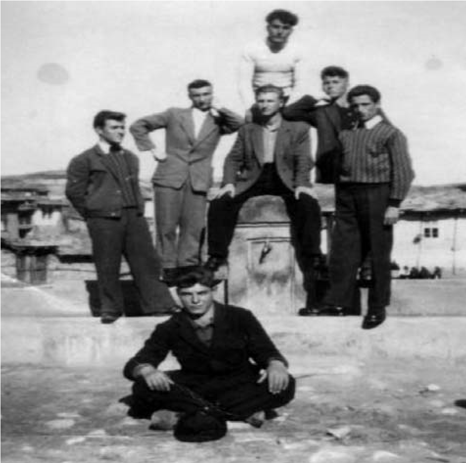

>   *С тези, които не ме оставяха сам. В средата, между тях съм на чешмата на
>   селския площад Ширината*

През тези години комунистите зомбираха младото поколение чрез създадената
организация ДКМС. В нашето село имаше две дружества. Някои от младежите се
надпреварваха да сервилничат пред комсомолските секретари. Гледах и се чудех на
тяхното тотално нравствено деформиране, което предизвика „народната власт“.
Когато един ден екзалтирана комсомолска група излизаше от читалището след
прожекцията на филма „Млада гвардия“, ми стана тъжно не само за младежите, но и
за девойките, които се държаха като „героините“ от филма. Прибрах се в къщи и
написах една от първите си статии, която изпратих във вестник „Пиринско дело“.
Заглавието беше „Непрокопсани младежи“. Описах екзалтираното поведение на
опиянените от героизма на младогвардейците, но не споменавах, че то е било
предизвикано и свързано с гледането на филма.

В деня, когато излезе публикацията ми, отидох в град Неврокоп. Бяхме събрали
пари, за да си купим най-после и ние като хората радиопарат. Вечерта се върнах в
къщи радостен. Слязох от магарето, свалих радиоапрата и се провикнах, за да ме
чуе татко. Той дойде да ме посрещне, но в погледа му не прочетох радост, а
някакъв гняв, който извираше от очите му. Втренчи се в мен и каза:

&minus;Аз ще кача радиоапарата горе, но теб те чакат в общината. Цял ден те търсят.
    Витан Кимилев и Кольо Кутрев са побеснели от статията ти. Ще дойда и аз. Не
    се плаши!

Когато наближих общината, видях на стълбите двамата, единият беше партиен, а
другият комсомолски секретар. Гледаха ме изпод вежди и ме вкараха в една от
стаите. Започнаха поредните заплахи, че няма да видя бял ден, докато нося този
акъл в главата си. Единият от тях просъска:

&minus;Не се сърди, че те наричаме „фашист“. Такива сте всички от вашия род, затова
    ще има да си патите.

Двамата крещяха неистово. През същото време татко ме чакаше вън в коридора. С
него бяха и двамата калековци Георги Малев и Димитър Божков. Когато в стаята
вече стана много напрегнато, на вратата се показа татко. Погледът му беше суров.
Тръгна към мен, хвана ме за ръката и каза на двамата:

&minus;Не измъчвайте повече сина ми. Малко ли ви е това, че не му давате да
    продължи образованието си?

Изведнъж моите „екзекутори“ се стреснаха и уплашено погледнаха татко. Те
познаваха неговата решителност да излезе и на двубой с тях.

Провикнаха се и двамата калековци:

&minus;Какво искате от наш Наско? Оставете го най-после на мира!

В стаята на общината останаха двамата „големци“ на селото, които сякаш онемяха,
но ми се заканиха с мракобесен поглед.

През следващата година отново не получих разрешение да продължа образованието
си. Наши близки от рода ме убеждаваха, че като дете на „фашисти“ (така наричаха
родителите ми) комунистите никога няма да ми разрешат да следвам във висше
учебно заведение. Някои от тях ме посъветваха да емигрирам в Гърция, а от там да
замина в Америка, за да продължа там образованието си. Това споделих с баща ми,
който, заедно с майка, преживяваше по-болезнено от мен отказа на комунистите да
се уча в университет. Той ме прегърна и каза:

&minus;Да не бързаме! Ще помислим мъдро заедно какво да правим.

Една нощ се затворих сам в комитската стая. Срещнах погледите на поп Стоян и
дядо Атанас. Те ме гледаха от портретите си, които украсяваха една от стените.
Сякаш бяха живи. Неусетно тежката дървена врата се отвори. Показа се татко,
снажен, красив като войводата. И мъдър като него. Седна при мен, прегърна ме и
попита :

&minus;Сине, Насе, защо си тъжен? Не бива! Тежко ще ни бъде на всички. Комунистите
    няма да ни оставят на мира, най-много теб, защото носиш името на дядо си. Но
    ти си силен като него, нали?

Татко се съгласи да емигрирам в Гърция. Увери ме, че най-лесно ще бъде да
премина границата през местността „Каровча“, до 5-и пост, където той е служил
като граничар и познава добре пътеките. Не допуснахме обаче, че майка е
подслушвала разговора ни и изведнъж вратата се отвори с трясък.

&minus;Кръстьо, Насе! Не бива да правите това! Комунистите ще запалят къщата! Ще
    изтрият всички ни!

Майка ме прегръщаше и трепереше. Стана ми жално за нея, затова ѝ обещах да я
послушам.

&minus;Няма, няма никъде да ходя! Ще си остана тук, до теб, до татко и братчетата
    ми.

Успокоявах майка и бършех сълзите ѝ.

На следващия ден, рано сутринта у дома дойде дядо Велик Мангушев, бащата на
майка ми. Показа ми незарасналите белези, получени от побоищата на комунистите,
и ме предупреди:

&minus;Те са жестоки хора. Ако избягаш, целият ни род ще изтрият. Само това и
    чакат. Опази Поповата къща, дядовото. Нашето време ще се върне. А за него
    трябват хора като теб. Вярвам, че ти ще ги победиш, защото носиш кръвта на
    най-силните от вашия род.

Така пропадна идеята за бягството ми в чужбина. Стана ми много тъжно, когато
майка каза, че трябва да мисля и за братчетата ми. Почувствах се виновен, че
наистина изпуснахме с баща ми да помислим за тяхната съдба след евентуалното ми
емигриране в Гърция. Стоян беше предпоследна година в Неврокопската гимназия, а
Велик, Китан и Серафим бяха още съвсем малки.

Взех твърдо решение да помагам на родителите си. Послушах майка и дядо
Велик. Те вече бяха обмислили всичко, зада ми вдъхнат някаква вяра, че все
пак ще продължа образованието си. Без да зная написали чернова на писмо до
Вълко Червенков, в което изразяваха голямото ми желание да се уча още. И
питаха в него защо местните партийни ръководители ми задържат документите.
Бяха ме и похвалили като един от най-добрите ученици в Неврокопската
гимназия. Скрили за будния ми дух, но написали, че съм скромно и добро
момче. Когато прочетох писмото, се обърнах към майка:

&minus;Майко, ние сме белязани като „врагове на „народната власт“. Не знам дали
    това писмо ще помогне.

Не възразих да изпратят писмото, заради напълнените очи на майка със сълзи,
които се стичаха по съсухреното ѝ лице. Съвсем наскоро прочетох подобно писмо,
изпратено от талантливия български артист и режисьор Любен Гройс до Вълко
Червенков, на когото баща му е бил разстрeлян от комунистите.  

## 8. С майсторите в Светиврачко

За да помогна на родителите си, заминах с майсторите от нашето село в Дамяница,
Светиврачко. Водеха ме като калджия. Работата ми беше да подготвям варов разтвор
и да го доставям на майсторите. Скоро бях преместен в Левуново, където през
лятото имаше по-малко комари. Работехме от ранна сутрин до късна вечер. Първите
нощи не заспивах от умора. Когато чувах гласа на майстора „Дай вар!“, аз вече
бях при него. После разбрах, че задължението ми е било да доставям вар само на
моите майстори, които бяха двама – дядо Лазар Духов и калеко Митьо Божков. Някои
от другите калджии хитруваха, намигваха си, когато носех вар и на техните
майстори. Като научи за тази тяхна хитрост, бай Кольо Гахов, който беше „баш
майстор“, ги наказа, но след това отмени наказанието по мое настояване.

Имах само средно образование, но майсторите ми викаха „даскале“. Друг калджия
среднист в групата на строителите нямаше, затова бях на почит и уважение. Имаха
ме за представително лице в строителната група. На скелето понаучих и
майсторския език, който обаче веднъж ми причини малка неприятност. Дядо Лазар
Духов ме подведе да се обърна към жената, която минаваше покрай строежа, с
няколко майсторски думи, една от които не беше прилична. Не познавах нейното
значение. Жената изненадано ми даде отговор с две тухли, отправени към мен и
дядо Лазар.

Готвачка на строителната група беше баба Елена. Тя готвеше хубаво, но яденето
никога не стигаше, затова през нощите някои от калджиите ставаха скришом и
превземаха лозето, което беше само на няколко метра от нашата барака. Наричаха
го „чекмедже“, от което можеха да си вземат всичко. Гроздето беше десертно,
едро. Понякога обаче в торбите си носеха откраднато грозде и от мелнишкия сорт,
смачкаваха го във войнишките си канчета, с които специално се бяха снабдили, за
да си правят вино за пиене. Напиваха се, за да забравят умората, която ги беше
съсухрила. Сърдеха ми се, че не бях като тях.

В Левуново рано узряваха и дините. Застъпваха се с ранното грозде. Една вечер
калджиите превзеха и нивата, на която имаше едри дини и пъпеши. Някои от тях
донесоха в палатката. Като ги видяха, бай Кольо Гахов и калеко Митьо Божков
наказаха цялата група. Не простиха и на мен.

С всеки изминат ден ми ставаше все по-мъчно за родителите и братчетата ми. Двама
от майсторите ме попитаха дали няма да си тръгна с тях за село. Наближаваше
есента. Единият ми каза:

&minus;Даскале, нашето място не е за теб. Ела с нас да си отидем в село. Ние ще се
    върнем, а ти трябва да си избереш друг път. Защо не продължиш да се учиш?

Една привечер тръгнахме пеша за родното ми село Либяхово. Беше далеко, много
далеко. Не знам, може би имаше повече от 100 километра. Минахме през няколко
Светиврачки села. Когато стигнахме до Голешево, един от майсторите като видя
полусрутена плевня, каза:

&minus;Нека поспим в тази плевня един-два часа, за да съберем сили.

Така и направихме. Не усетих как и кога съм заспал. Но когато чух „Ставай!“,
скочих и в бързината забравих в плевнята войнишкото кепе, което ми беше подарил
един от майсторите.

На следващия ден, към обяд, наближихме нашия балкан Пъзлак. Покрай него кротко
извиваше снага река Мътница. От десния ѝ бряг беше нашата нива на Песците.
Седнахме под една от върбите, където обикновено пладнувахме, когато работехме
тук. Нивата ни още не беше разорана. Моите спътници ме погледнаха и ме
подсетиха:

&minus;Тебе чака вашата нива. Можеш ли да ореш? Не трябва да остане стърнище през
    зимата.

&minus;Мога. И то как? Нали татко ме е научил на всичко.

Когато се прибрах вкъщи, научих, че писмото на майка и дядо, изпратено до Вълко
Червенков, било препратено до Окръжния отдел „Народна просвета“ в Горна Джумая.
Началникът го предал на училищния инспектор Никола Пашов „за проверка и мнение“.
Така се появи моят покровител, който ми помогна да тръгна по учителския път.

## 9. Моят покровител

В един празничен ден бях в с. Копривлен, където имаше преглед на самодейните
колективи. До мен се доближи мой приятел от самодейците и ми прошепна на ухото:

&minus;Наско, бях в пощата по работа. Казаха ми, че се обадил баща ти и поръчал
    веднага да си отидеш в село. Дошъл някой „големец“ за проверка по твоя
    случай.

Сърцето ми трепна. Прекръстих се скришом, за да ми върви на хубаво, и побягнах
към село. Извървях цели осем километра на бежешком.

Запъхтян ме посрещна майка и каза:

&minus;Сине, имал си късмет. Синът на дядо Георги Пашов е дошъл да проучи защо не
    ти дават нашите големци да се учиш. Вярвам, че той ще помогне, защото
    някога, преди да се заселят в Св. Врач, бяхме добри съседи. Дядо ти Атанас
    му помогна да се спаси от явна смърт.

Срещата ни с окръжния училищния инспектор Никола Пашов стана в шивалнята на чичо
Илия Пашов, брат на баща му. Когато отворих вратата на шивашкото ателие, гостът
стана от един стол и се отправи към мен.

&minus;Хей, войводо! Защо не препаса пищова на дядо ти, за да уплашиш тукашните
    управници. Не ти, а някои от тях са фашисти.

Слушах зашеметен думите на госта. Чичо Илия Пашов, на когото по-късно станах
зет, се усмихна, погледна ме с вечно благата си усмивка и допълни:

&minus;Насе, запомни тези думи от батьо ти Кольо. Нашите комунисти се страхуват от
    теб като внук на известен македонски войвода, който не само че създаде това
    хубаво село след опожаряването му от гръцките войници, но и помиряваше
    хората. Другите бяха убийци.

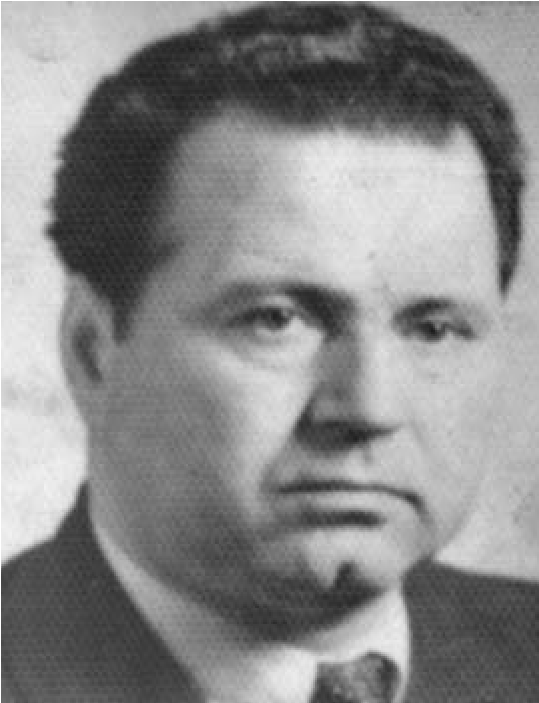

>  *Училищният окръжен инспектор Никола Пашов*

След като чух това, което каза училищният инспектор Никола Пашов и допълни
известният в цялото село със своето благородство, скромност и готовност да
помогне на всички шивач Илия Пашов, дойде и моят ред да кажа нещо. Погледнах
госта в големите му хубави очи, които ме покориха с техния блясък. Леката му
усмивка не слизаше от лицето, което издаваше душевната му красота. Тя ме
вдъхнови, за да бъда по-смел и откровен. Разказах му къде съм ходил и как са ме
посрещали. Навсякъде ме гледаха с други очи, не като неговите. Никола Пашов
постави ръката си върху рамото ми и каза:

&minus;Наско, ще се борим срещу невежеството и ще го победим. От сега нататък ще
    имаш друг път, но първо трябва да вразумя някои от тукашните управници.

Вечерта инспекторът Никола Пашов беше събрал партийния секретар на селото
учителя Георги Кираджиев и двамата комсомолски секретари. И тримата били
единодушни, че нямат нищо против да продължа образованието си. Всичко обаче
зависело от общинския комитет на БКП в Копривлен, където секретарят Петър
Аврамов решавал сам не само моята, но и съдбата на много други деца на
„враговете на народната власт“.

За всеки случай инспекторът запазил за себе си писменото съгласие на „малките
ръководители“ от Либяхово да не се задържат документите ми за кандидатстване в
университета. И въпреки това не бил сигурен, че общинският комитет на БКП ще се
съобрази с мнението на тримата от родното ми село. Затова замислил и друго да
направи през главата на вироглавите партийни ръководители, за което научих
по-късно.

След като отново не бях допуснат да кандидатствам във висше учебно заведение,
Никола Пашов ме посъветва да напиша молба до началника на отдел „Народна
просвета“ в Неврокоп Георги Бекяров за назначаването ми като волнонаемен учител.
Разговарял с него като с подчинен и му казал:

&minus;Като не му разрешават да кандидатства в университета, нека да му помогнем да
    бъде в полувисш институт, затова трябва да го назначим за волнонаемен
    учител. И без това има толкова много свободни учителски места в Родопите. Ти
    познаваш Наско, нали? Бил си негов учител в Либяхаво. А е и отличник на
    гимназията. При проверката, която направих, всички бяха единодушни, че е
    изключително ученолюбиво момче. Протегни му и ти своята учителска ръка.
    Твоят колега Георги Кираджиев вече направи това. Директорът на гимназията
    Иван Икономов пък е възмутен от партийния секретар в Копривлен Петър
    Аврамов. Каза ми, че иска да се срещне с теб. Според него непростим грях ще
    бъде като учители на Атанас да не му помогнете.

Георги Бекяров нямало как да не се съобрази с настояването на окръжния инспектор
Никола Пашов, а след това и на Иван Икономов, директор на Неврокопската
гимназия. И тримата решили да бъда назначен като волнонаемен учител в
с.Петрелик, което е до самата граница. Била издаденаи заповедта. Но, когато
назначаването трябвало да се съгласува и с Изпълнителния комтет на Околийския
народен съвет, отново всичко се закучило. Г. Бекяров проявява своята двойствена
роля. На въпроса, който му поставят: „Наше ли момче е?“, той свил вечно мрачните
си вежди и отговорил, че съм внук на войводата Атанас Попов. Това вбесило някои
от околийската управа. Заповедта била отменена

Минаха два месеца в очакване да получа заповедта за назначаване. Научих, че съм
назначен в Петрелик, но как да отида там като нямах черно на бяло. Не знаех за
отмяната на заповедта. Този път не аз, а баща ми замина на гурбет с майсторите в
Светиврачка околия. На мене се падна да изора някои от нивите с двете ни
изнемощели кравички и да ги посадя с ръж и пшеница. Преди това татко ме научи
как се хвърля семето „през крачка“. Последната нива, която засадих, беше на
местността Петрелицко. Този ден по пътеката, която водеше към с. Петрелик, се
показа Димитър Праматаров, инструктор към околийския комитет на БКП. Като ме
видя, се провикна:

&minus;Хей, даскале! Защо не си при децата, а си хванал ралото? Аз съм тръгнал към
    твоето училище, за да те поздравя, а те виждам тук.

Оказа се, че и той знаеше за назначаването ми като нередовен учител в
с.Петрелик, но не бе научил за отмяната на заповедта. Когато дойде при мен, му
казах :

&minus;Митко, разбрах, че не е лесно да се живее под ръководството на вашата
    партия. Душата ми вадят някои от твоите съпартийци, зарад името, което нося
    на дядо ми.

&minus;Наско, хубаво, че тук няма кой да ни подслушва. Но те моля друг път да не
    говориш против партията, защото някои донасят за твоите изказвания против
    нея.

Митко Праматаров беше друг човек. Той не приличаше на онези, които ме наричаха
„фашист“. Някога баща му беше приел съвета на дядо ми да се скрие, за да оцелее
след атентата в църквата „Св.Неделя“. Заедно с Илия Полянов се бяха спасили в
Гърция, след което се завърнали в село.

Минаваха месец след месец в очакване да бъда назначен в някое от другите
родопски села за нередовен учител. Изчезваше надеждата ми да придобия право като
волнонаемен учител да кандидатствам този път в полувисше учебно заведение. Майка
ми отново ме назори да отида да попитам някои от околийската управа.

Началникът на „Народна просвета“ Г. Бекяров ме посрещна със суров поглед и каза:

&minus;Не мога нищо да направя. Иди при ресорния секретар на Изпълнителния комитет
    на Околийския народен съвет Васил Урдев. Поговори с него. Той ще ти каже
    всичко.

И Урдев ме посрещна с крив поглед. Когато го попитах какво става с моя случай,
той стана, изправи се зад бюрото си и с креслив глас ми заяви:

&minus;Нашата партия има отношение към враговете на народната власт и няма да
    допусне децата им да ни изпреварват по образование. Ти си от комитско
    семейство, нали? Дядо ти е бил войвода от бандата на Тодор Александров. А
    носиш и неговото име. Няма да ти разрешим нито да кандидатстваш в
    университет, нито пък да те назначаваме за нередовен учител, за да използваш
    правото да кандидатстваш в полувисше учебно заведение.

Иди си и повече не се мяркай пред нас!

Сърцето ми се сви от гняв. В устата ми напираше отговора, който исках да дам на
този, който ме гонеше от кабинета си. Но в този миг вратата се отвори и на нея
се показа Никола Пашов. Сякаш господ го изпрати именно в този момент, когато
сърцето ми биеше неудържимо бързо. Той ми се усмихна, впери големите си очи в
моите и попита:

&minus;Наско, защо си тук? Не си ли на работа ?

Гледах го, но не му казах нищо, защото бях като онемял от думите на Васил Урдев.
Никола Пашов не знаеше за случилото се с мен. Никой не го беше уведомил, че
издадената заповед по негово настояване за назначаването ми в с.Петрелик е била
отменена.

Урдев се учуди от нежния поглед, с който продължаваше да ме гледа окръжният
училищен инспектор. Сякаш, за да оправдае себе си каза:

&minus;Изпълкомът отмени назначаването на Попов. Той произхожда от семейство, което
    е чуждо на народната власт.

Погледът на Пашов се отмести от мен и отправи към Урдев, когото попита:

&minus;Как можахте да направите тази глупост. Това момче е гордостта на неговото
    село. Засрамете се!

Пашов се доближи до мен, опря ръката си на рамото ми и каза на Урдев:

&minus;На моя отговорност той ще бъде назначен, въпреки вашето “партизанско“
    мислене. Нито дядо му, нито той и баща му са „фашисти“. Фашистите са други.
    Някои от тях сега дерибействат и не знаят какви ги вършат.

Урдев го гледаше и слушаше като изумен. Никога няма да забравя взаимните
погледи, които си отправиха. Това беше своеобразна престрелка с очи, която Пашов
прекъсна. Хвана дръжката на вратата, открехна я и ми каза тихо:

&minus;Остави ни двамата да си кажем всичко за теб. Отивай си спокоен. Ти си роден
    за учител и ще бъдеш такъв. Поздрави майка ти, баща ти и чичо Илия.

## 10. Учител в родопските села

Въпреки че учебната година беше почти на привършване, неочаквано за мен и
родителите ми на 5 май 1955 г. получих заповед за назначаването ми като
волнонаемен учител в родопското село Вълкосел. Майка ми стегна багажа в голяма
торба, в която имаше шарена черга за постеля, бельо, една чиния, лъжица и
вилица. Рейсът, който тръгна от Неврокоп, ме стовари в с. Абланица, а от там до
Вълкосел се изкачвах по тясна пътека. Пристигнах късно през нощта. Очакваха ме
директорът на училището Иван Панчев и колегата Иван Шиндов, с когото заживяхме
заедно в една от стаите на училището. На следващия ден при мен дойде учителското
семейство Гелемерови, Кипра и Петър, които са били прокудени тук в това далечно
родопско село като „врагове на народната власт“.

Бързо се сприятелих с колегите, които недоумяваха защо ме назначават в края на
учебната година. Знаеше само директорът на училището, който ми издаде документ,
с който вече можех да кандидатствам в полувисшия институт за прогимназиални
учители в Ст. Загора. Такава беше идеята на моя покровител Никола Пашов, който
не можа да се пребори със защитниците на „народната власт“, за да ми се разреши
да кандидатствам в Софийския университет.

Във Вълкосел за първи път се срещнах с изстрадалите родопски хора през годините
на робството, когато им била отнета само религията, а всичко останало си е
българско. Най-голямо впечатление в това село, сгушило се в пазвите на Родопите,
ми направиха чисто българските названия на местностите. Когато някой от колегите
искаше да отидем донякъде на разходка, не се притесняваше да каже:

&minus;Сега искам да се поразходим из местността Свети Георги, откъдето ще видиш и
    гръцките села.

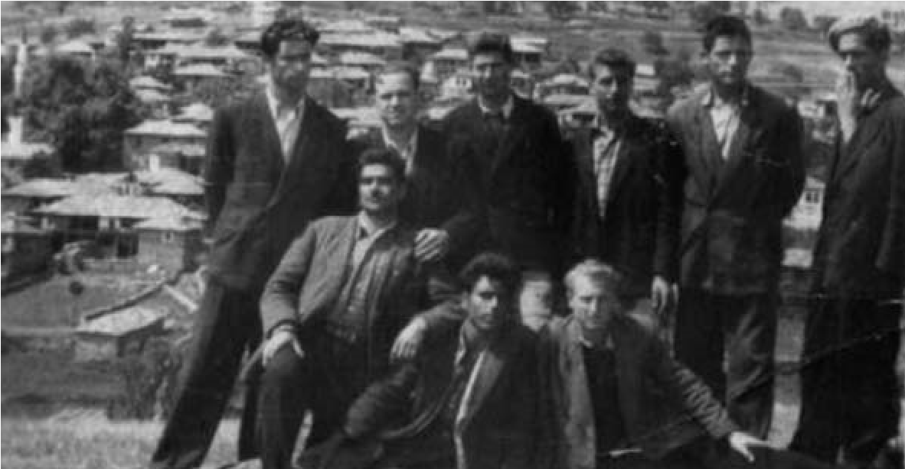

>  *С някои от колегите от Вълкосел на излет до м. „ Свети Георги“/ първият,
>  седнал от дясно /.*

Това беше хубава местност, до която понякога водехме на разходка и учениците.
Село Вълкосел е едно от най-големите села в Западните Родопи и се намира в
т.нар. област Чеч.

Не ми беше лесно през първите дни във Вълкосел. Там има две джамии, едната в
Мишовата, а другата във Вълковата махала. Когато наставаха часовете за молитва,
двамата ходжи започваха да се надпяват. Слушах ги и си мислех за историята на
селото, когато османлиите са населили това хубаво, китно село с вярата за Аллах.
По улиците срещах възрастни мъже и жени, които отначало ме гледаха като
чужденец, но след това ме спираха и питаха:

&minus;А ти, даскале, откъде си ?

&minus;От Либяхово съм. Ей му най-високия баир, Пъзлак, под Алиботуш.

&minus;Значи ти си наше чедо, от нашия край. Добре дошел в нашето село!

Един ден бащата на мой ученик дойде в училище и ме покани на гости. Видя ми се
отворен човек. Вечерта ме чакаше пред джамията. Заедно с жена му ме посрещнаха
като скъп гост. След богатата вечеря, на която имаше и хубава баклава, домакинът
започна да ми разказва историята на селото. Изненадата ми бе голяма, когато го
слушах да разказва увлекателно за двете махали в селото, Мишовата и Вълковата.
Баба Айше се сгуши до нас и допълваше разказваното от сина си.

&minus;Даскале, помня разказа на прабаба ми, която беше на 101 години. В нашето
    село живеели двамата братя Вълко и Мишо, които си разделили двете махали по
    равно. Живеели мирно и спокойно. Имали си хубава черква, на която ходели да
    се молят и от двете махали. Но дошло другото време.

Като каза „другото време“, гласът на баба Айше пресекна, смигна с очи и ме
помоли да ме заведе в съседната стая. Станахме и тръгнахме само двамата. Тя спря
до шарен дървен сандък и ми каза:

&minus;Тук е заспало нашето минало.

Като вдигна капака на сандъка, видях шарени, китни женски дрехи, каквито пазеше
и майка ми.

Баба Айше навлажни очите си и прошепна:

&minus;Не знам на коя от нашите баби са, но са тяхна прикя.

Разглеждах извезените с тънки пръсти шарила по клашника, ихрама и дългите ризи.

&minus;Нови са, каза баба Айше, защото са носени само по големите празници в нашето
    село.

Гледах накитите в украсения дървен сандък и потънах в размисли, които никога
няма да забравя. Представях си баба Айше, облечена в тази премяна. Каква
хубавица може да изглежда с тях.

Когато се върнахме в гостната стая, разказът тръгна пак в посока към
миналото. Но този път го водеше бай Ибраим, синът на баба Айше. Той
разказваше за двамата братя Мишо и Вълко.

&minus;Не е лъжа, а истина, даскале, която ходжите в нашето село не искат да знаят.
    Когато чуждоземците дошли в селото, обградили и двете махали. Мишо и Вълко
    събрали най-смелите мъже и бранели селото. Напънът бил силен. Мишо бил
    заловен и хвърлен в пещ. Изгорели го жив. Писъци на жени и деца се чували от
    неговата махала. Чуждоземците потурчили всички. Вълко направил крепости пред
    своята махала и издържал още няколко години, но и той бил пленен и покорена
    цялата му махала. От тогава селото ни носи неговото име, даскале. Да знаеш!
    И на децата да казваш.

След тази вечер често излизах извън селото, за да оглеждам двете махали, които
са разделени от дълбоко дере. Сядах под сянката на голям дъб и се взирах далеко,
за да прегърна с поглед и четири планини – Родопите, Боздаг, Пирин и Алиботуш. В
тези часове се чувствах честит и потъвах в сладки размисли за моя роден край и
неговото минало.

Когато тръгнах от Вълкосел за конкурсния изпит в Ст. Загора, пътувах заедно с
няколко други кандидати, които носеха препоръки от околийския комитет на БКП в
Неврокоп. Това бяха „деца на партията“. За тях конкурсният изпит беше
формалност. След три дни окачиха резултатите от писмения изпит. Открих себе си
на едно от първите места. Техните имена ги нямаше, но след това, за мое
учудване, бяха заедно с нас на очните занятия.

Още не вярвах, че пътят ми към учителската професия е отворен. Не знам как е
протекъл разговорът между моя покровител НиколаПашов и Васил Урдев, но всичко се
преобърна неочаквано за мен.

След като приключи учебната година, на 20 август 1955 г. бях преназначен за
учител в граничното село Туховище, което се намира на два километра до границата
с Гърция. За голяма изненада след това получих и заповед за директор на
училището. Недоумявах, до вчера не ми даваха да продължа образованието, а сега
вече бях директор на училище. Не ми беше лесно, защото заварих разбит учителски
колектив, в който е имало скандали между обособилите се враждуващи групи.
Техните водачи бяха комунисти които се карали кой да води колектива. Помислих,
че някои очакваха да се проваля, за да останат доволни недоброжелателите ми. За
кратко време обаче животът в учителския колектив изцяло се промени. Събирахме се
често заедно с някои от колегите в съседните села Годешово и Слащен. Прекарвахме
празничните дни при взаимни гостувания.

Училищната сграда в село Туховище беше строена отдавна от местното население.
Знаех откъде най-много скърца, защото живеех в нея. Затова се реших на нещо,
което предишните директори не смееха да направят. Вместо да се извърши основен
ремонт, за какъвто ни бяха отпуснати средства, заедно с пълномощника на селото
се споразумяхме да се построи нова сграда. Преместихме учениците в
пълномощничеството, където превзехме всички стаи.

Когато майсторите събаряха грохналата стара сграда на училището, ги помолих да
пазят гроба на първия учител Никола Маринов, който се намираше в двора под голям
орех. Един ден заедно с учениците и учителите почистихме гроба и оттогава на
това място винаги се поставяха цветя.

След събарянето на старата училищна сграда се вдигна голям шум. Бях извикан при
Васил Урдев в околийския съвет, за да отговарям за решението ми да съборя
старата сграда на училището.Този път обаче Урдев ме посрещна не така, както
някога.

&minus;Ние не те приемахме за учител, а ти като директор се оказа по-смел и от нас.
    Защо събори училищната сграда ? – ме попита Урдев.

&minus;За да спася учениците и учителите от най-страшното, което ги грозеше всеки
    ден. Покривът се бе надвесил над главите им, а стените бяха разцепени,
    готови да се срутят. Аз живея в директорската стая и всяка вечер слушам
    скърцането на покрива и стените.

Като казах защо се реших да започне строителството на нова училищна сграда,
Урдев се вторачи в мен и каза:

&minus;Атанасе, ти наистина си роден само за учител. Не мога да си простя, че преди
    една година те посрещнах като враг в кабинета си. Инспекторът Пашов беше
    прав. Хубаво, че се застъпи така ревностно за теб. Чувам и други хубави
    неща. Няма ги кавгите във вашето училище, учениците идват редовно на учебни
    занятия. Похвалиха ми се от теб училищните инспектори Иван Керезиев и
    Костадин Папанов. Преди в Туховище имаше и неприбрани деца, а сега сами са
    се върнали, защото сте променили учебния процес, направили сте го
    привлекателен за тях. Този път не само Пашов, но и аз заставам зад теб. В
    градската библиотека прочетох хубави неща за Зимбилевия род, от който са ти
    корените. Прадядовците ти са били изтъкнати просветни дейци и революционери.
    Защо не ми каза за тях, когато те гледах с други очи, като наш враг ?

На този въпрос отговор не дадох, защото сърцето ме болеше, когато комунистите ме
наричаха „враг на народа“. В досието ми не забравяха да пишат, че съм „вражески
настроен“.

Този път Урдев стана от бюрото си и вежливо ме изпрати като не забрави да ми
каже, че ако срещна трудности, да му се обадя.

През април 1956 година и в далечното родопско село Туховище отекнаха новините,
свързани с проведения Априлски пленум на ЦК на БКП, на който по указание на
Никита Хрушчов партийният и държавен глава Вълко Червенков беше заменен с Тодор
Живков. Започна осъществяването на т.нар. Априлска линия на комунистическата
партия.

В Туховище получих закалката си не само като учител, но и като лич-
ност с обществено призвание. Тогава продължаваше тероризирането на местното
население. Спомням си, че една нощ бяха затворили в една от стаите на
пълномощничеството „непокорните“. Пазеше ги Офето (така наричаха един от
активистите на Отечествения фронт). Жената на един от затворените дойде и ме
помоли да помогна за освобождаването на мъжа ѝ, който бил болен.

Отидох при Офето и му казах да отвори вратата. Той не ме послуша и се закани, че
ще ме предаде на Сотир Сораджиев, който беше отговорникът от Държавна сигурност
за този район. Не се уплаших от заканата. Разбих вратата и освободих
непокорните, някои от които започнаха да ми целуват ръка.

На следващия ден Сораджията дойде в Туховище откъм Марулево и поръчал на
прислужника на училището Хасан да отида при него.Той обаче ме изпревари и дойде
в канцеларията ми. Още щом отвори вратата с треперящ глас ме попита:

&minus;Защо си направил това? Знаеш ли, че не само моята, но и твоята служба ще
    изгори.

&minus;Нека изгори службата ми, Сотире. Само хорицата да не изгорят живи. Защо ги
    карате насила да се наричат македонци. Така вие горите българските им
    корени, които някога турците не са успели да изгорят.

Тези думи промениха лицето на Сораджията. Той ме погледна, огледа се да не би
онези, които вървяха след него, да ни слушат, и тихо ми прошумоли:

&minus;Даскале, между нас да си остане. И аз мисля като тебе. Но какво да правя
    като такава е заповедта на моите началници. Вече разбирам, че тръгнахме през
    просото. А докъде ще стигнем, не знам.

След няколко години Сотир Сораджиев ми призна, че е трябвало да знае всичко за
мен, затова вербувал двама души, един от които мой колега, който беше член на
комунистическата партия. Но това, което съм му казал за македонизирането,
споделил с баща си, а той му отвърнал:

&minus;Не посягайте към това момче. Помня дядо му. Той помиряваше
    българомохамеданите. Някои от тях тръгнаха след него и създадоха български
    чети, а вие сега ги разчеквате. Старите хора от Абланица обичаха войводата
    Атанас Попов. Той идваше и в нашето село, за да да пази българщината, а вие
    сега преследвате внука му. Свали ръцете си от него, Сотире!

Когато тръгнах на очните ми занятия в учителския институт в Ст. Загора, оставих
колежката Божана Мудева да ме замества. Поръчах ѝ да не се включва в акцията за
македонизирането на мохамеданите в селото. Но хората от службите на Държавна
сигурност я изнудили да им помага. Отишли в къщата на ходжата, който живееше до
училището, и го заплашвали, че трябва да промени народността си, той не се
стърпял и посрещнал неканените гости със стар калъч, който пазел на потайно
място за отбрана. Божана се уплашила и побягнала. Отказала се да участвува в
поредното македонизиране на тези хора, които познават само българския език.
Запазили са едни от най-старите думи като „мисер“, „кликам“ и много други.
Тачеха ревностно и старите български обичаи.

Щом се върнах от очни занятия, Божана ми разказа всичко, което се беше случило.
Каза ми, че хората ме търсили, за да им помогна. Не скри, че капитан Илиев от
военното разузнаване, който беше в комендатурата на Гранични войски в с. Слащен,
я ухажвал и заплашвал, ако не помогне за „вразумяването“ на „помаците“, както
той наричаше тукашните хора. Тази дума я нямаше в моя речник, защото младите от
селото я приемаха като обидна и им причиняваше страдание. Мъничък на ръст,
разведчикът Илиев яздеше едър кон, от който гледаше високомерно и плашеше с
поглед всеки, който не прави това, което той искаше. Веднъж се опита и мене да
сплаши като ми намекна, че копие от моето досие има и при него. Не се страхувах
вече от лошите неща, които ми причиняваха такива като него, защото разбрах, че
те ще ме придружават докато комунистите са на власт.

След тази неприятна среща с капитан Илиев се гледахме винаги накриво. Един от
офицерите в граничното поделение, което се намираше на горния край на селото, ми
довери, че пийнал до козирката, „черният капитан“ се заканил да ми види
сметката. Не се страхувах, защото той имаше немалко врагове и сред колегите си,
на които беше причинил безброй неприятности. Обикновените хора в селото го
наричаха “плашилото“. Когато граничарите и техните помощници, все хора на
капитан Илиев, залавяха някой „диверсант“ (така наричаха онези, които се
решаваха да преминат границата и емигрират в Гърция), ги водеха завързани към
щаба в Слащен, където някои не оцеляваха. Други пък още на границата бяха
разстрелвани.

Една късна вечер се почука силно на външната врата на училището. Канцеларията ми
беше на втория етаж. Събудих се. Началникът на заставата майор Миндов, който бе
съпруг на една от колежките в нашето училище, ме помоли да им помогна. Няколко
семейства бяха натоварили багажа си и се запътили към границата. Решили да
емигрират.

&minus;Теб те обичат и ще те послушат . Ела с нас !

Нямало как граничарите да се справят с тези семейства, защото заплашвали да се
отбраняват, заедно с децата си. Когато стигнахме близо до Годешово, Миндов се
провикна:

&minus;Директорът на училището иска да ви каже нещо.

Миндов ме освети с газов фенер, за да се уверят, че съм дошъл заради тях.
Помолих ги да се върнат като обещах, че повече няма да ги тормозят за вярата и
имената, които носят. За моя радост те върнаха мулетата и магаретата и
сеструпаха около мен. С тях серазбирах много добре. Взаимно се уважавахме.

Учителският колектив в Туховище спечели уважението не само на учениците, но и на
местното население. Най-осезателно се почувства това, когато моите колеги
започнаха да свързват класноурочната си работа с извънучилищни дейности.
Условията за това бяха повече от благоприятни. Спомням си, че на едно от
заседанията на педагогическия колектив предложих да се проведат специални
родителски срещи, на които да се поиска помощта на майките, бащите, бабите и
дядовците за проучване особеностите на говора в селото, на неговите обичаи, на
топонимията му. Създаде се необикновен интерес към тази дейност. Дадоха се
предложения да се създаде специална консултантска група от по-будните познавачи
в тези области от живота на селото. Учителите планираха специални форми за
възпитание, в които учениците бяха основните организатори. Те се надпреварваха
при тяхното привлекателно реализиране.

Един ден в канцеларията ми влезе момиче, което се отличаваше от другите. То бе
по-едро, облечено като девойка, която е кандидатка за женитба. След нея влезе
баща ѝ, който беше един от ходжите в селото. Момичето започна да ми обяснява как
напуснала училището, защото не ѝ било интересно в него. Бащата продължи да се
извинява вместо дъщеря си. Помолиха ме да запиша Джамиле в класа, който беше
прекъснала. Увлякла се и помагала на някои от учениците в тяхната махала, които
проучвали обичаите и песните. Това беше последната ученичка, която не беше
прибрана в училище. Нейните съученици я наричаха „майката“ на класа не само
заради това, че беше по-голяма от тях, но повече заради усилията, с които
бързаше да навакса усвояването на учебното съдържание по всички дисциплини.
Джамиле започна да изпреварва другите и помагаше на изоставащите.

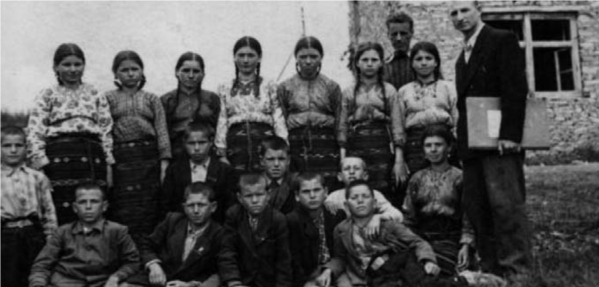

>   *Пред старата сграда на училището в Туховище с учениците от седми клас и
>   прислужника Асан*

Туховище е в пазвите на Родопите. То е далеко, много далеко от родното ми село
Илинден, което пък е полегнало под връх Пъзлак до Алиботуш. Но мислите ми бягаха
винаги към него. Там оставих момичето, което обичах още от ученическите си
години, дъщерята на шивача Илия Пашов. Тя беше учителка по математика. Още от
гимназията се отличаваше като най-добрата по тази учебна дисциплина.

Като подразбрал, че ухажвам дъщеря му, бащата на моята избраница ѝ подхвърлил:

– Мария, Наско е добро момче и има хубаво бъдеще, носи дарбите на дядовците си.
Комунистите не го обичат, но те няма да векуват. Омъжи се за него. Ще се радвам
много на брака ви.

Чичо Илия още не знаеше,че ние с дъщеря му вече бяхме решили да зарадваме него и
майка ми, която пък обичаше много бъдещата ми жена.

През есента на 1956 г. с учителката Мария Пашова създадохме нашето учителско
семейство. След женитбата ми пътувах често през почивните дни от Туховище до
Илинден. Прекосявах баирите през селата Слащен, Беслен, Теплен и Петрелик, за да
стигна до семейното ми огнище. Често пътуването беше много рисковано. Веднъж
едва не ме повлякоха буйните води на Места. Преминах я по две въжета, едното за
ръцете, а другото за краката. Друг път паднах от моста над р. Мътница при с.
Петрелик. Тичешком извървях десетина километра, защото бях мокър. Когато стигнах
в село, дрехите ми бяха вече изсъхнали.

В един зимен ден снегът, навалял през нощта, не ме спря, за да тръгна към
Туховище. Към местността Длъга Мара се разминах с глутница вълци. А през
пролетта между Беслен и Теплен пред нас с пощенския куриер се изпречи мечка,
която ни изгледа връждебно, но си тръгна по своя път. Близо до Беслен има
припек, през който минаваше пътеката за Теплен. През пролетта и лятото на нея се
излежаваха и препичаха какви ли не змии. Трябваше на пръсти да минавам, за да не
ги разсърдя. И с тях сякаш се сприятелихме, затова оцелявах ненападнат.

Често, когато трябваше да ходя на съвещания или конференции в околийския град,
пътят ми минаваше през с. Сатовча, от където шофьори на товарни камиони се
смиляваха и ни превозваха до Неврокоп. А на връщане от Сатовча граничарите,
които бяха довели своите офицери с коне, отстъпваха някой свободен кон и за мен.
С тях преминавахме покрай селата Жижево и Фъргово, изкачвахме по стръмните
пътеки на Погорник и след това по нанадолнището бързо пристигахме в Туховище.

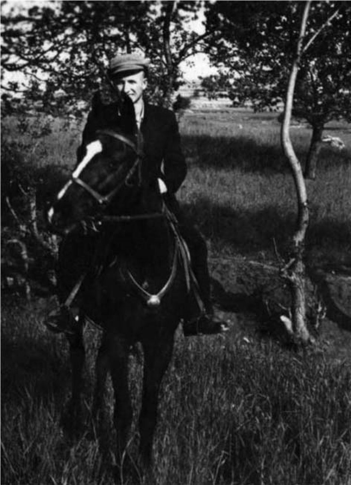

>   *На път от Сатовча за Туховище*

Какво ли не видях и преживях през двете ми учителски години в с. Туховище.
Подлъгаха ме, че ще ме вземат в казармата. Напуснах училището за няколко дни, но
след това се оказа, че не ме искат да служа в „народната армия“. Върнах се
отново, но подадох молба да бъда преместен през следващата учебна година
по-близо до жена ми. От околийския народен съвет ме помолиха да остана още
една-две години. Похвалиха ме, че не само съм променил климата в учителския
колектив, но и съм подобрил учебния процес. Започна и изграждането на новото
училище в селото, което скоро щеше да издигне снага.

Когато научиха колегите ми, че ще се разделяме, ми подготвиха изпращане, на
което присъстваха и офицерите от граничното поделение, които осигуряваха хляба,
който бях уредил да купуваме от тях. Беше незабравима вечер. Някои ми посветиха
стихове, а други изпяха любимите ми песни, с които правехме вълнуващо нашето
ежедневие. На другата сутрин баща ми дойде с мулето на дядо Велик. Натоварихме
багажа ми и казахме сбогом на Туховище.

Събрахме се заедно с жена ми, но нямах още ново назначение. Последните две
години бяха неспокойни. След унгарските събития закриха учителския институт в
Ст. Загора и ни преместиха в Бургас, където завърших полувисшето си образование.

Като дипломиран прогимназиален учител по български език и литература очаквах да
ме назначат по-близо до жена ми, която продължаваше да учителства в родното ми
село Либяхово. Толкова много ми се искаше да уча децата в него, но
новоназначеният кмет Манол Джагълов, син на убиеца на вуйчо ми Борис, не даваше
и дума да се обели да бъда учител в родното ми село.

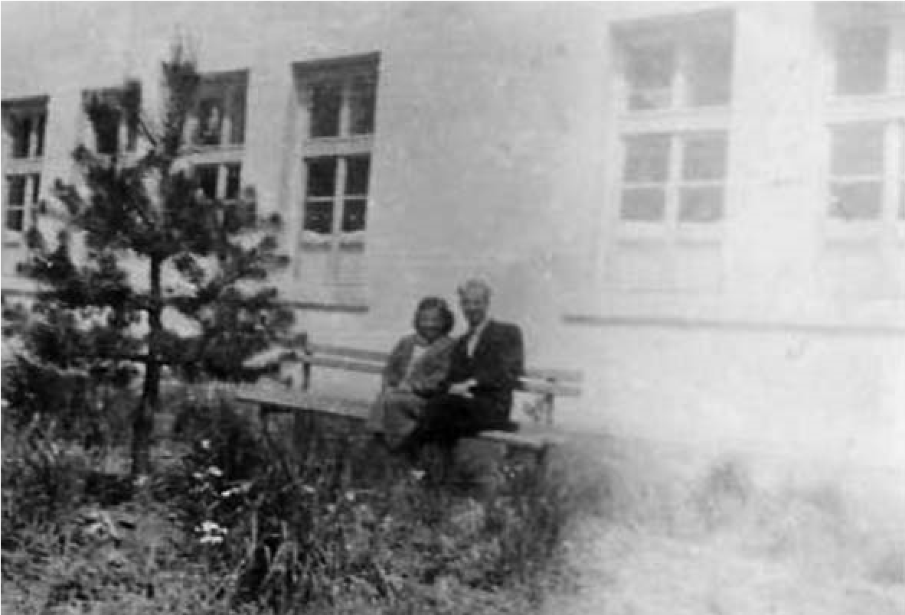

>   *Често пъти отивах да посрещна жена ми, която се връщаше от училище. Мечтаех
>   и аз да бъда нейн колега, но като „враг на народната власт“ можех само да
>   мечтая да бъда учител в родното ми село, където дедите и прадедите ми са
>   отдали всичко за него*

Така беше през годините на комунистическия режим. Потомците на видни български
фамили бяха недолюбвани в родните им села и градове. Повечето от нас ни наричаха
„фашисти“. Спомням си, че когато големият български артист Кръстьо Сарафов дойде
в родното си село, за да му се нарадва, комунистите не го посрещнаха като наша
национална гордост в театъра, защото бил „фашист“. А името на брат му Борис
Сарафов на техните митинги се споменаваше, заедно с името на дядо ми, като враг
на „народната власт“.

## 11. Учител в пиринското село Тешово

През учебната 1957/1958 година бях назначен за учител по български език и
литература в с. Тешово, което е полегнало между красивия връх Моторок на Пирин и
още по-красивия на Алиботуш – Гоцев връх. Не остана пътека в Родопския и
Пиринския край, която да не познавам.

Тешово беше голямо село, известно със своите революционни традиции. Тук доскоро
се беше укривал Дафков, последният въоръжен противник на „народната власт“ в
Пиринския край. И в това село хората бяха разделени на „наши“ и „чужди“. Затова
в него Държавна сигурност беше изпратила едни от най-страшните свои служители
Рашков и Маджиров, които плашеха враговете на „народната власт“с кръвясалите си
очи и мечешки лапи. Техният началник Костадин Кюлюмов от съседното село
Гайтаниново беше вече известен като убиец на немалко от онези, които първи
надигнаха глава срещу комунистическата власт.

Злодеят Кюлюмов се прослави като един от най-страшните убийци на „враговете на
народната власт „ в целия Неврокопския край. Той беше известен с това, че е
танцувал върху гробовете на разстреляните, за да се подравни пръстта.

Помня, когато Катя, наричана „Лудата“, дойде от Гайтаниниво в нашето село и
разказваше на всички как Кюлюмов разстрелял Борис Григоров и след това покрил
трупа му с камъни. Това научих и от сина му Григор, с когото бяхме приятели.
Костадин Кюлюмов участваше активно в преследването и разгромяването на горяните
в Пиринския край. Тук, в Тешово, научих подробности как е подготвил и извършил
убийството на Герасим Тодоров и десетки други „врагове“ на комунистическата
власт от горянското движение.

Никога няма да забравя, когато през една късна нощ Кюлюмов ме притисна в една от
тесните улици на Тешово и с кръвясали очи ми каза:

&minus;Ей, фашяга, спри да говориш против партията, защото като те хвана за гушата,
    ще си останеш тук и няма кой да те прибере.

Този път ми се размина, но след няколко дни на друга от тесните улици на Тешово,
близо до селската кръчма, пред мен се изпречи Рашков. Бях само слушал за него.
За първи път се срещнаха погледите ни. Изгледа ме заплашително и просъска:

&minus;Зная кой си, чий си. И внимавай. Отваряй си очите, когато решиш да правиш
    нещо. Ако не знаеш кой е Рашков, попитай потрошените от мен.

Гледах го и недоумявах за какво ме предупреждава този човек, който и той като
Кюлюмов беше наплашил хората от всички околни села. Отминах го и тръгнах към
Хрисимови, където се бях настанил на квартира.

Хазаинът ме покани у тях на вечера. Споделих с него кого съм срещнал, а той не
скри, че Кюлюмов, Рашков и Маджиров вече са разговарели с него и му поставили
задачата да ме следи къде ходя, с кого се събирам и какво правя. Хазаинът се
усмихна и сякаш искаше да ме успокои като ме увери, че „уше“ на двамата
побойници няма да стане.

След тези срещи с двамата червени екзакутори повече не излизах през вечерните
часове по тесните улици на Тешово. Вече и през деня не се откъсвах от колегите,
с които винаги излизах заедно.

След няколко дни директорът на училището Никола Пелтеков, който беше и партиен
секретар в селото, поиска да се видим „насаме“. Посрещна ме любезно в
директорската канцелария, почерпи ме с бонбони и попита дали ми харесва
учителския колектив. Не скрих, че колегите ме посрещнаха на тяхна гощавка и си
допаднахме много по време на разговорите. Бяха все добри учители, които обичаха
работата си и учениците. Най-бързо се сприятелихме с Аспарух Терзиев, жена му
Катерина и Тодор Богатинов, който беше директор на училището. Местните учители
започнаха да ме канят на гости. Като споделях с Пелтеков добрите си впечатления
от колегите, в един момент той протегна ръката си, опря се на рамото ми и каза,
че и те ме приели много радушно. Научил, че учениците бързо се привързали към
мен. Но след това ме погледна право в очите и допълни:

&minus;Само едно ме притеснява, колега Попов.

&minus;Какво ? – попитах директора.

&minus;Може би знаеш, че нас всички ни наблюдават, защото партията иска народната
    власт да бъде спокойна. Вчера при мене бяха хора от Държавна сигурност и ми
    казаха, че вашият кмет от Илинден ги информирал подробно за миналото на
    вашия род. Казал им, че си от фашистко семейство. И нещо друго. Ходил си на
    гости у Панайотови в нашето село. Може би не знаеш, но те бяха помагачите на
    бандата на Дафков.

Наистина бях на гости у Панайотови. Като научили, че съм назначен за учител в
тяхното село, някои от оцелелите все още съратници на дядо ми поискаха да се
видим. Те го знаеха като пунктовия войвода. Когато бях у Панайтови, един от
мъжете се разплака, прегърна ме и каза:

&minus;Господи, войводата е жив, щом му носи името това будно момче.

След като чух това, което ми рече директорът Никола Пелтеков, на свой ред се
обърнах към него и му казах:

&minus;Никой от моя род не е бил фашист. Всички са родолюбци. Такъв съм и аз.
    Такива искам да бъдат и учениците ми. Ако ме приемате като такъв, ще остана
    при вас. Ако смятате, че съм „фашист“, да се разделим още отсега.

Директорът Пелтеков стана, доближи се до мен и ме увери, че няма да позволи
хората от Държавна сигурност да ме тровят и да ме притесняват в учителската
ми работа.

Това беше първият и последен разговор насаме с Никола Пелтеков. И аз, и той го
забравихме, защото захласнати в учителската ни работа, нямахме време, нито пък
желание да го повторим.

Занизаха се незабравими дни, прекарани заедно с моите колеги от Тешово. Понякога
излизахме заедно на поход из дебрите на Пирин планина. В празнични дни на нашите
тържества често идваше старият учител Караджов. Винаги сядаше до мен и
разговаряхме като много близки колеги. На една от нашите срещи той ме прегърна и
каза :

&minus;Насе, от всички колеги най-много уважавам теб.

&minus;Защо ?

Побързах да го попитам.

&minus;Защото си от Попово коляно. Прадядо ти свещеник Стоян Зимбилев е бил
    най-добрият божи служител в Неврокопския край. Зная всичко за него. Проклет
    да е и на онзи свят Иван Куюмджиев, който го е разстрелял по време на
    молитва! В книжата на нашата църква на няколко места е вписано неговото име.
    Ти знаеш, че аз съм религиозен и се моля винаги в църквата за доброто на
    всички християни. Затова тукашните комунисти не ме обичат. А някои от тях,
    които са най-близки на безбожника Рашков, ме заплашват, че ще ме изселят. За
    дядо ти Атанас като пунктов войвода ми разказваха хубави, незабравими
    спомени неговите съратници от нашето село, които често се събират у
    Панайотови .

Ей, затова когато идвам в училището, където прекарах най-хубавите си години, се
отбивам при теб. Ти не ми се сърдиш, нали?

&minus;Учителю, колега! И аз затова те уважавам много. Защото не се страхуваш да
    браниш през тези тежки години божията вяра. Комунистите извършват в наши дни
    най-голямото престъпление срещу младото поколение. Направиха от повечето
    учители безбожници, които насаждат атеизма у децата.

Тези мои думи напълниха със сълзи очите на учителя Караджов, който ме хвана под
ръка и тръгнахме към Хрисимови, където бях на квартира.

>   *С колегите в Тешово под връх Моторок*
>   *(в средата, с протегната ръка към небето над Пирин)*

През първите дни на 1958 година, след създаването на ТКЗС в полските райони,
започна ускорено коопериране на земята и в планинските села. Почти всеки ден в
Тешово идваха някои от ръководителите на Околийския комитет на БКП, които
привикваха т.нар. „народни врагове“ да разговарят с тях и да ги заплашват да не
пречат за създаването на ТКЗС в тяхното село. Същите тези създатели на
„българските колхози“ виждах и в моето родно село Либяхово, когато през
почивните дни отивах там, за да видя едногодишния си син и майка му. Една вечер
разсилният на общината извика и баща ми да отиде при „големците“, които бяха
дошли от града. Татко ме погледна в очите и ми каза:

&minus;Насе, комунистите унищожиха скотовъдството, а сега искат да опустее и
    земеделието. А те, скотовъдството и земеделието в нашето село от памти века
    са неразделни, не могат да виреят едно без друго. Земята храни животните, а
    животните я торят, за да ражда богато.

Когато се върна вкъщи, баща ми каза, че били „привикани“ пак „опасните“, от
които комунистите се страхуваха. Предупредили ги, че ако пречат за създаването
на ТКЗС в нашето село, ще ги изселят. Заплашили баща ми, че могат да ни уволнят
заедно с жена ми като учители. Като чу това, майка се разплака и каза:

&minus;Тогава какво ще правим, Кръстьо? Ще ни вземат, и без да им я даваме, земята,
    и ще ни прокудят от родното село.

Татко казал на партийните „другари“, че това е лудост в планинските села да се
създава ТКЗС. Те го изгледали кръвнишки и му напомнили за недовършената от тях
работа с него на 10 септември 1944 година, когато беше жестоко пребит пак тук, в
общината, но долу, в мазето.

След около един месец, на 19 февруари 1958 г., точно в деня от обесването на
Васил Левски, в моето родно село на специално подготвено общоселско събрание,
при присъствието на партийни ръководители от Околийския комитет на БКП, се
създава ТКЗС, в което влизат 254 семейства. Извън него остават 20
семейства,наречени от комунистите „кулаци“ и „фашисти“. Нашето беше едно от тях,
но след непоносими заплахи баща ми и майка ми кандисаха и те да станат
„текезесари“.

Още от първите години създателите на ТКЗС изсякоха всички отдавна посадени
орехи, круши и сливи по полето и къра. Запустяха и лозята, които някога, когато
дядо ми е бил кмет на селото, са били засадени. Не се чуваха вече и някогашните
звънци на стадата и кавалите на овчарите. Отнети бяха големите стада от овце и
кози от техните стопани, както и всичкия работен добитък, волове, крави, коне,
мулета и магарета и прехвърлени в специално създадени животновъдни ферми.  

## 12. В Тешово като учител ми бе открито оператвно дело по линия „враждебна интелигенция“

След създаването на ТКЗС и в Тешово, няколко пъти жена ми, заедно с първородния
ми син Красимир, който беше само на една година, идваше в Тешово, където
прекарвахме някои от празниците в селото. Неусетно учебната година завърши.
Вместо да бъда вече преназначен като дипломиран учител, бях освободен и изпратен
в родопското село Годешово. Казаха ми, че преместването ми е било работа на
Кюлюмов и Рашков, които се страхували от моето присъствие в разбуненото от
Дафков село Тешово, в което настроението на много хора към „народната власт“
беше вече опасно.

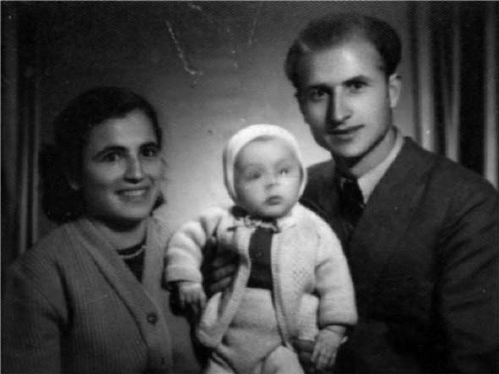

>   *Когато бяхме тримата заедно, се чувствахме щастливи, но Държавна сигурност
>   стопяваше радостта ни, когато ни разделяше*

Трябваше пак да се върна близо до Туховище, но този път съвсем до самата
граница. Не приех назначението ми в Годешово. Вестих се там само да уведомя
директора, че не мога да оставя сама жена ми с малкия Красимир, когото обичахме
силно като първородно дете. Три месеца бях без работа. За 10 дни замествах
учителка в с. Баничан.

На 13 януари 1959 г. бях назначен отново в Тешово. И двамата с жена ми се
зарадвахме, че ще бъдем наблизо един до друг. Казаха ми, че мои колеги и
родители изпратили писмо до Окръжния отдел на Народна просвета, които поискали
връщането ми като учител в селото.

Не знаех обаче, че Държавна сигурност е планирала нещо друго, за да бъда
отдалечен още повече от жена ми. През времето, което прекарах отново в Тешово, е
била допълнително събирана за мен информация от Държавна сигурност и открито
оперативно дело по линия „враждебна интелигенция“ по повод на това, че съм бил
„вражески настроен“.

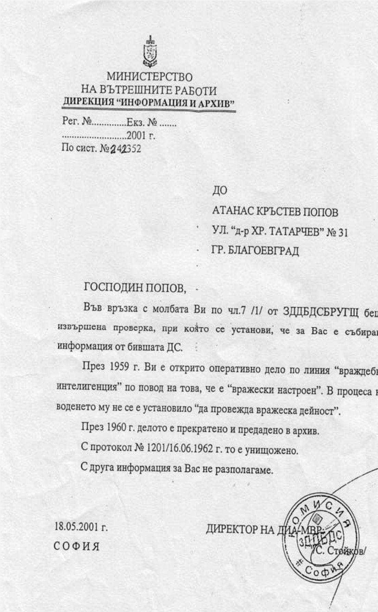

>   *Факсимиле на писмо, изпратено от Министерството на вътрешните работи по
>   сист. № 242352 от 2001 година*

## 13. А ние бяхме в Люти дол

През 1959 година комунистите в България откриха най-зловещите лагери за
„враговете на народната власт“. Доносниците на Държавна сигурност се умножиха,
за да се открият всички онези, които бяха опасни за укрепването на политиката на
комунистическата партия при изграждането на социализма. Някои от тях си бяха
свършили работата и за мен. Все още не зная точно кои са изпълнили личното ми
дело с доноси за моята „вражеска“ дейност. Не бях отбил военната си служба.
Всяка година наборняците подготвяха своите празнични вечери преди заминаването
им в казармата. Включваха и мен, но повиквателна заповед не получавах.
Отсрочваха ме по неизвестни за мене причини. Стана ми ясно обаче, че комунистите
както се страхуваха от приемането ми в университет, още повече ги беше страх от
постъпването ми в тяхната „народна“ казарма. Бях опасен навсякъде за тях.

Един ден се реших да попитам заместник-началника на военното окръжие в Неврокоп
полковник Никола Донков защо не ме приемат поне в Трудова повинност, за да отбия
най-после военната си служба. Той ме изгледа подозрително и попита:

&minus;А ти не знаеш ли защо?

Каза ми да почакам и влезе в стаята, където бяха документите на донаборниците.
Когато излезе, погледът му беше мрачен.

&minus;Колега, защо не ми каза, че си внук на войводата Атанас Попов. Аз бях учител
    във вашето село и квартирувах у вас. Но не мога да ти помогна, защото си
    лошо белязан, заради дядо ти. Прочетох характеристиката. Пише, че си от
    фашистко семейство и отношението ти към народната власт е отрицателно. Не
    мога да те пратя нито във военно поделение, нито в Трудова повинност, защото
    си в друг, опасен списък. Вярвам, че това, което ти казвам, ще запазиш само
    за себе си.

&minus;Какво ще ни правите тези, които сме в „опасния“ списък? – попитах Донков.

&minus;И аз не зная, но опитай да ти направят нова характеристика от общината във
    вашето село. Макар че познавам добре Манол Джегълов, който е натопил не само
    теб. Но, ако има малко акъл, няма да те изпраща там, където не се знае какво
    може да се случи с теб.

Вечерта се прибрах в село и споделих с жена ми това, което ми каза полковник
Донков. Тя преживяваше понякога още по-болезнено от мен това, което ми
причиняваха комунистите. Без да зная, споделила с баща си това, което ѝ казах.
Дядо Илия отишъл при Манол и му рекъл право в очите:

&minus;А бре Маноле, ти искаш дъщеря ми да остане вдовица ли?

&minus;Защо, бай Илия – отвърнал Манол.

&minus;Какво си написал за моя зет? Как можа да го очерниш толкова много.

&minus;Не съм аз, бай Илия. Сигурно Витан е направил това – отговорил Манол.

Витан Кемилев беше партийният секретар на селото. При него и Манол често бяха
идвали Кюлюмов и Рашков от Държавна сигурност.

По настояване на жена ми отидох в общината, за да получа „новата“ характеристика
от Манол Джегълов. От същия, който беше подписал и предишната. Чаках повече от
два часа. Полуграмотният пълномощник на съвета чукаше на машината като първолак,
който срича и пише. Най-после се показа, подаде ми бял плик, който беше целият
покрит с червен восък и каза:

&minus;Написах най-хубавите думи за теб, даскале. Скрих, че си от фашистко
    семейство. Полковник Донков трябва да те изпрати във военно поделение, а не
    в Трудова повинност и на друго по-опасно място.

Не исках да повярвам на Манол, защото негови близки ми бяха казали, че ако се
наложи и на децата си да направи характеристика, и тях ще „наклепа“. Но и този
път послушах жена ми. Отидох при полковник Донков и му подадох писмото на Манол.
Той се учуди, че Манол е дал писмото в ръцете ми, за да му го донеса лично.

&minus;Почакай ! Ако тази характеристика е добра, ще „забравим“ другата. И ще мога
    да те спася.

Седнах пред кабинета на Донков. След около петнадесет минути той се показа и
втренчи очите си в моите.

&minus;Не го е срам. Това, което е написал Манол, е още по-страшно от това, което
    имаме. Не мога да ти помогна, но ще кажа нещо, което не бива да забравяш.
    След две седмици ще получиш повикателна заповед. Но не за армията или
    Трудова повинност, а за друго място, където няма да ти бъде лесно. За да
    оцелееш, ще трябва да мълчиш, а това, което ще видиш и преживееш, е само за
    мъжка издържливост.

Не се уплаших от това, което ми каза полковник Донков. Но недоумявах за неговото
състрадание към това, което ми предстоеше да преживея и откровеността в
разговора ни.

&minus;Не мога да забравя това, което научих за вашия род, когато бях учител във
    вашето училище. Та аз бях на квартира у вас. Живеех в стаята на войводата.
    Не разбирам откъде извира омразата на управниците към най-будните хора,
    каквито са били твоите дядовци. А сега и към теб. Пази се!

Не след две, както ми каза Донков, а след една седмица получих повиквателна
заповед, в която бе упоменато само мястото, където трябваше да се явя в град
Неврокоп. Когато напуснах Тешово, колегите недоумяваха, че ме викат да
отбивам „военната“ си служба по никое време, през месец април. Брат ми Стоян
дойде да пренесем багажа ми. Помогнаха ми колегите Аспарух Терзиев и Георги
Стоянов.

> *Така се премествах от село на село като учител. Колегите Георги Стоянов и
> Аспарух Терзиев, заедно с брат ми Стоян, натовариха багажа ми от с.Тешово,
> когато Държавна сигурност ме изпращаше в лагера в с. Люти Дол, Врачанско*

Директорът на училището Тодор Богатинов ме попита:

&minus;Къде те изпращат да служиш? Нали през пролетта не вземат набор в казармата.
    А тези за Трудова повинност ги вече прибраха преди един месец. Сигурно ще
    бъдеш в някои „специални“ части.

Само баща ми и брат ми Стоян знаеха какво ме очакваше. Те бяха мълчаливи, затова
се доверих на тях. На майка и жена ми казах, че отивам в казармата.

На 20 април 1959 година с камиони, покрити с брезентови платнища, ни извозиха от
Гоце Делчев до село Добринище. Там ни натовариха като подгонено стадо в
мотрисата, която беше стоварена на гарата. В специално подготвените купета ни
чакаха няколко офицери и цивилни, които ни оглеждаха подозрително. Офицерът в
нашето купе седна до мен и не се откъсна до пристигането ни на гара Мездра. След
като си пийна малко повечко, се разприказва „поверително“.

&minus;Учителю, не мога да разбера как си попаднал сред тази сган от фашистки
    копелета. Кой те насоли пред нашите хора?

&minus;Такива като теб, които и на мен казват, че съм“фашист“.

Офицерът се намръщи, погледна ме със свити очи и каза:

&minus;Аз съм друг човек, не съм от тези, които те изпращат на заколение. Докараха
    ме при вас след едно наказание, заради женска история. Сигурно няма да
    остана дълго, защото като ви гледам, не знам дали ще мога и аз да изтрая
    страданията, които ще изживеете.

Повярвах за наказанието на офицера, който започна да ми се изповядва, защото
беше висок, красив и сигурно е покорявал немалко женски сърца. Попитах го:

&minus;Защо наричаш „фашисти“ тези, с които и аз отивам на заколение?

&minus;Защото всички сте синчета или внуци на враговете на народната власт- беше
    неговият отговор.

&minus;Какви врагове са циганчетата и тези момчета, които наричаш помаци?

Двата въпроса, които зададох, учудиха офицера, който вече беше напълно превзет
от алкохола. За да ме увери, че е прав, започна да обяснява, че циганчетата и
помачетата са деца на непокорни на „народната власт“ цигани и вироглави помаци
от Родопския край. А другите като мен сме били потомци на осъдени от „Народния
съд“ и дейци на „фашистката“ организация ВМРО.

И аз бях от синовете и внуците на най-опасните врагове на комунизма в България.
“Народният съд“ осъди на смърт вече разстреляния от комунистите ми дядо
войводата Атанас Попов повече от двадесет години. Сега се страхуваха от баща ми,
който мина през ада на комунистическата вакханалия през 1944 година, но по чудо
оцеля.

На 21 април, сутринта, пристигнахме на гара Мездра. Натовариха ни на камиони,
които ни стовариха над село Люти дол от дясната страна на голяма клисура, от
която се виждаше само къс от небето. Тук бяха опънати брезентови палатки, в
които ни вкараха като животни. Още през нощта ни раздадоха по два ката дрехи.
Едните бях ужким войнишка лятна униформа, а другите – стари войнишки куртки,
шапки, шинели и панталони, едни – носени от войници през Балканската, а другите
– през Междусъюзническата или пък през Първата световна война. Казаха ни, че
лятната униформа е само за празнични дни, а другата за всеки ден. На моята
куртка личаха три дупки, направени от куршуми. Няколко съсирени петна от кръв от
годините се бяха така втвърдили, че не можах да ги измия или изтрия.

Цяла нощ никой не мигна. В палатките се чуваше шушукане. Питахме се един друг
какви сме: войници, трудоваци или лагеристи.

По всичко вече личеше, че не сме войници, дори и от най-мизерните поделения,
наричани „кечове“. Не бяхме и трудоваци, защото униформата ни не беше такава.

На път за Люти дол научих от офицера, който пътуваше заедно с нас, че наблизо е
село Скравена, където след няколко месеца откриха лагер, предназначен за жени,
обявени като опасни за народната власт. Когато се разделихме, той ми каза, че
тук ще правим нов път в родния край на Тодор Живков, от Мездра до Ботевград.

В една палатка бяхме шестима души. До мен беше Ангел Солаков, син на един от
четниците на дядо ми, а до него Атанас Панчелиев, брат на емигрирал младеж в
Гърция, за да намери лекарства против туберкулозата, която го измъчвала няколко
години. От другата страна на палатката бяха Димитър Тодоров от Копривлен, който
с погледа си плашеше защитниците на „народната власт“, Петър Калайджиев от
с.Лъки, син на осъден от „Народния съд“ полицай и разстрелян в град Неврокоп, и
Георги Къшев, син на „враг на текезесето“ в същото село.

В съседство до нашата палатка бяха момчетата от с.Тешово, все синове и внуци на
бунтари срещу „народната власт“ от четата на Дафков, наричана от комунистите
„михайловистка терористическа банда“, зверски унищожена през м. юни 1947 година.
В другите палатки бяха Стойчо Гугулев, Тодор Джамбазки (Чори), Костадин Гущанов
и други, все синове и внуци на „врагове на народната власт“ от Неврокоп. От
Горноджумайската група се познавах с Георги Делвински и Аргир Манасиев, потомци
на изтъкнати дейци на ВМРО. От такова потекло бяха и лагеристите от
Светиврачкия, Петричкия и Разложкия край.

Когато първата сутрин ни изведоха строени, не можахме да се познаем. Приличахме
на клошари, събрани на едно място, но въоръжени със строго зачислени кирки,
лопати, лостове и колички. Разделиха ни по отделения, на които определиха
обектите от пътя, който трябваше да построим. За отговорници на отделенията бяха
изпратени младши сержанти от специални части, които разпределяха обектите за
работа на всеки един поотделно и ни наблюдаваха внимателно. За всичко казано от
нас беше докладвано директно на заместник-командирите по политическата част, а
те на полковник Петков от Държавна сигурност. В нашата рота имаше три взвода с
няколко отделения. Ротният командир беше капитан Грозев, а на нашия взвод
капитан Тодоров. Най-жестокият от взводните командири беше капитан Йорданов. Не
знам кой ме беше наклепал пред него, но една вечер той дойде пиян до нашата
палатка и изкрещя, като се хвана за кобура на пистолета си:

&minus;Дайте ми тоя даскал да му светя маслото. Той е от много опасно фашистко
    семейство, което трябва да изтребим. Той ли ще ми казва кой и какъв съм аз?

Пияният офицер разтвори предната част на платнището на палатката, залюля се
и падна. Вътре беше тъмно. Бях сам. Още когато чух гласа му, метнах трите
одеяла върху мен. Той ококори пияните си очи и просъска:

&minus;Няма го, а! Ще го намеря. Ей сега ще го намеря.

И тръгна да ме търси другаде. После научих, че често се заканвал и на други като
мен в лагера. Не казах на никой за случилото се, защото разбрах, че всякога,
когато се напивал, капитанът издавал смъртни присъди, които обаче не
изпълняваше, защото не го обичаха и началниците му.

Още от първите дни разбрах, че трябва да не забравям както препоръката на
полковник Донков от военното окръжие в Неврокоп, така и думите на офицера, който
ни придружаваше до Люти дол:

&minus;Ако искаш да оцелееш, не трябва да си отваряш устата. Ще мълчиш и тогава,
    когато е нетърпимо да слушаш закани и ругатни.

А те, заканите и ругатните, бяха ежедневни. Най-много ги чувах от гейчето, така
наричахме младши сержант Георгиев, който за всичко донасяше на политическия
офицер. Винаги ми определяше трудни обекти за работа. Постоянно си бях на
скалата, от която трябваше да отронвам с лост и кирка по пет-шест кубика камъни,
които да извозвам на около петдесет метра. Колкото и да се мъчех да изпълня
нормата си, никога не успявах. Затова обикновено ме задържаха да довърша
работата си и през нощта. Често не получавах и храната за вечеря. А и през деня
понякога не посягах към канчето, което ми пълнеха почти всеки ден със свинска
супа. Един ден Стойчо Гугулев ми каза, че тлъстината в нея е от угоени прасета,
които са били хранени с човешки трупове. Не исках да повярвам, но това се
твърдеше и от други, които вече знаеха и за лагера в Ловеч, където изчезвали
безследно много от лагеристите.

Често пъти, когато понякога почивахме в неделни дни, което беше много рядко, се
усамотявах в палатката и размишлявах. Питах се що за социализъм строи нашият
народ, когато има толкова много невинни като нас в различни лагери. Не исках да
повярвам,че може да има такава демагогия в страната, която се твърдеше, че върви
към „сияйните върхове на комунизма“.

Когато в палатката ставаше тясно и шумно, излизах навън и се скривах в
храсталака над нея, за да опиша това, което преживявах. Написах няколко очерка и
есета, които обаче при проверката, която правеха при наше отсъствие, изчезнаха
безследно.

Един ден реших да опиша условията, при които работехме, и отношението към нас,
които бяха унизителни. Подготвих писмо, което се чудех на кого да предам, за да
го изпрати до мой близък приятел, който не само да знае къде съм, но и с молба
да направи нещо, за да се знае и извън страната какво е отношението на
комунистическата власт към потомците на обявените за нейни „врагове“. Намерих
удобен момент да проведа разговор с момиче от Люти дол, което минаваше покрай
нашия обект. Доверих му се и то взе писмото, което изпратило в Мездра. Приятелят
ми получил писмото почти разтворено, след което е бил постоянно под наблюдение.
А мене разпитваха двама офицери, които ме заплашваха, че ако се осмеля още
веднъж да описвам условията, при които работим, ще ми се случи най-страшното.
Взеха ми фотоапарата „Смяна“, който укривах, но с него бях вече направил немалко
снимки.

След този случай дните и нощите ми в Люти дол наистина станаха още по-черни. Не
се откъсвах от голямата скала, която се мъчех да разбивам малко по малко, за да
изкарвам определената ми норма. Понякога ме преместваха и на друг обект, който
трябваше да се довършва, но пак тук, в клисурата на Люти дол. Бях отслабнал
много. Почти не се хранех.

Една вечер отново останахме на обекта, за да довършим работата си. Нямах сили да
продължа. Другите ме гледаха жално, но не можеха да ми помогнат. Неочаквано до
мен се приближи капитан Тодоров, който отговаряше за нашето отделение. Той се
вестяваше само когато работата беше много напрегната. Направи ми впечатление, че
и той беше прерамчил торба. Това означаваше, че ще остане и през нощта при нас.
Капитанът ме хвана за рамото, погледна ме и каза:

&minus;Учителю, ти не си добре. Седни да си починеш малко.

При опита да седна, се залюлях и паднах. Капитан Тодоров ме прихвана, повдигна
ме и с миловиден глас тихо ми прошепна:

&minus;Съвземи се малко и след това ще те заведе в лагера, но гледай да не ни видят
    другите.

Недоумявах. Това беше първият от офицерите, който се смили над мен. Бях слушал,
че се различава от другите, поради което лагеристите го уважаваха. В най-удобния
момент капитан Тодоров ме подхвана за ръка и тръгнахме към лагера. На няколко
места сядах, за да си поема дъх. Нямах сили да продължа. Най-после се добрахме
до лагера. Беше тихо. Нямаше никой. Всички останаха на обекта през цялата нощ.
Когато доближихме моята палатка, се чу строгият глас на караула:

&minus;Стой, горе ръцете!

Капитанът се ядоса и му каза:

&minus;Свали пушката бе, хлапак. Не виждаш ли,че съм аз.

&minus;Но не сте сам, нали другарю капитан. Кой е с вас?

&minus;Това не е твоя работа с кого съм. Прибирай се! – ядоса се капитан Тодоров.

Караулът гузен се обърна с гръб към нас и изчезна. Двамата влязохме в палатката.
Капитанът ми помогна да легна. Събра одеялата и на другите и ме покри с тях.
Заприказва ме и поиска да узнае защо след като съм учител, са ме изпратили тук.
Когато се успокоих, разказах за моя произход и премеждията ми като учител по
родопските села. Той се намръщи и каза:

&minus;Няма ли да свършат тези безумия. Искам да захвърля тази униформа и да не
    гледам повече такива като теб. Вие тук сте изпратени нито като войници, нито
    като трудоваци. Не бива да ви лъжат. Тук сте лагеристи. Ти заслужаваш да ти
    кажа истината, но те моля не казвай на другите. Ще се опитам да те преместят
    в здравния пункт, където да помагаш на лекаря. Страхувам се за теб.

След този разговор капитан Тодоров отвори торбата си, извади една кутия рибена
консерва. Раздели хляба на две и едната половина остави на мен. Попита ме дали
имам вода. В торбата му имаше манерка с вода . Остави и нея.

&minus;Няма да ставаш от тук. Ще си почиваш докато се съвземеш. Утре ще намина да
    те видя, но сега, няма как, ще повикам караула да те наглежда.

Караулът дойде. Беше мой земляк от неврокопското село Садово. Само че бяхме от
два различни свята. Изпратили го на „отговорна“ служба, да пази децата и внуците
на „враговете“. Капитан Тодоров го предупреди да проверява състоянието ми.

Заспах и се събудих чак на следващия ден след обяд. Отворих консервената кутия,
оставена от капитана, и поставих няколко залъка в устата си. Никой от другите в
лагера не се прибра. Всички бяха още на обекта. Надвечер при мен отново дойде
капитан Тодоров, който беше разговарял със свой колега от щаба, за да бъда
преместен, но след направената справка в досието ми се оказало, че
предназначението било да бъда поставен на тежка физическа работа.

Въпреки хуманния жест на капитан Тодоров, службите на Държавна сигурност ме
оставиха да продължа да се боря със скалите, които разбивах, за да ми „дойде
акълът“ като „враг на народната власт“. С всеки изминал ден силите ми
намаляваха. Чувствах се изнемощял до крайност. Вече почти не се вестяваше на
обекта и капитан Тодоров. Взаимоотношенията ни с младши сержант Георгиев се
изостриха. Той си мислеше, че нарочно не изпълнявам нормата си, за да се забави
изпълнението на поставените му задачи за предсрочно завършване на обекта,
определен на нашето отделение. Не бях вече само аз от изоставащите, затова на
няколко пъти ме нарече „саботьор“. Заплаши ме, че ще си платя за „вражеската
дейност“.

През една вечер, след като отново ме оставиха да си изпълня нормата, до мен се
доближи „новият“, който беше зачислен в нашето отделение като отговорник за
компресора.

&minus;Даскале, внимавай ! Лошо са ти вдигнали мерника. Пази се!

Попитах го кой е и как попадна при нас. Както и откъде знае, че са ми вдигнали
„мерника“.

„Новият“ се огледа наоколо и след като се увери, че наблизо до нас няма никой,
каза:

&minus;Ако ти кажа всичко за мен, ще се уплашиш и няма да искаш да ме гледаш в
    очите.

Наистина очите му бяха страшни, а лицето скулесто. Имаше вид на човек, който е
преживял много страдания. По челото и гърдите му личаха позараснали дълбоки
рани. Гледах го направо в очите, не се уплаших, но поисках да узная повече за
него.

&minus;Казвам се Аксийски. Името ми подсказва какъв съм, нали?

&minus;Аксия значи сербез човек, който е остър в отношенията към другите – поясних
    съдържанието на думата.

&minus;Остър и несломим само в борбата ми към комунистите, които ме вкараха в
    политическия затвор в Пазарджик, където ми разклатиха здравето.

Сега, когато вече не съм човек като другите, ме докараха при вас.

&minus;Има ли и други като теб ? – попитах Аксийски.

&minus;Сигурно, но няма да ги познаете, защото те вече са преобразени. Има и
    такива, които не издържаха мъченията в затвора и станаха агенти на Държавна
    сигурност. Затова отваряй си очите на четири и по-хубаво е да си зашиеш
    устата. Иначе не се знае дали ще оцелееш. Не гледай мен. Аз вече не се
    страхувам от смъртта. На няколко пъти се срещах и разминавах с нея.

Като стана дума за Държавна сигурност, си спомних за онези, които вървяха след
мен и преди мен навсякъде в родопските и пирински села, където учителствах.
Познавах ги и се пазех от тях. Но тук все още не знаех кой от офицерите е от
тези служби. Аксийски сякаш прочете мислите ми.

&minus;Пази се от полковника, който минава понякога по пътеката над храсталаците,
    където е твоят обект. Ще го познаеш лесно, гледа като палач, който ако те
    привика, свършено е с теб.

&minus;Сетих се за кого става дума. Веднъж същият полковник седна на пътеката, за
    която говореше Аксийски, изгледа ме кръвнишки и ми се закани с клатене на
    глава. Но след това тръгна към групата, която работеше до мен. А там беше
    Стойчо Гугулев. Полковникът клекна над трапа, на няколко разкрача до него.

Да си призная, след срещата си с Аксийски бях като зашеметен. Не знаех вече с
кого да разговарям, на кого да се доверявам. Един от моите близки приятели ме
помоли да не вярвам и на Аксийски. Някои се пазеха от него. Имаха го за човек на
Държавна сигурност. Но все още си мисля, че той беше искрен с мен, защото това,
което ми каза за „палача“от Държавна сигурност в лагера, се оказа истина.

До скалата, която пробивах, имаше малка къщурка, която беше последната на горния
край на село Люти дол. В нея живееха мъж и жена, които често се отбиваха при мен
и изразяваха възмущението си от страданията, на които бяхме подлагани. Добротата
им извираше от погледа, с който ме прегръщаха. Един ден се реших да споделя с
леля Яна това, за което настояваше жена ми в едно от последните писма.
Разтревожена от разклатеното ми здраве, тя ми питаше не може ли да дойде да ме
види. Все още непознатата за мен жена възкликна:

&minus;Нека дойде, даскале, ще бъде у нас. Тук ще се срещате, без да разбере никой.

Така и стана. Жена ми пристигна без да разбере никой. През деня ме гледаше от
прозорчето на малката стая на леля Яна как се мъча, а вечер, останал, за да
довърша несвършената работа, се отбивах за един или два часа при нея. Това бяха
три дни, през които и жена ми се чувстваше като лагеристка в Люти дол. Последият
ден беше дошла и жената на Аксийски, с която преживяваха заедно видяното в
лагера на техните мъже.

>   *Жена ми,заедно с леля Яна пред вратата на тяхната ниска къща в Люти дол,
>   където беше приютена*

В навечерието на деветосептемврийския празник Аксийски дойде при мен и задъхан
ми каза:

&minus;Нямам време. Но не бива да ни виждат. Затова чуй какво ще ти кажа. Има
    донесение за теб, че настройваш другите против партията и властта. Казвал
    си, че времето на социализма си отива. Полковникът е бесен. Пази се от него.
    Не оставай сам на обекта. Гледай до теб да има и други. Днес сигурно ще те
    навести.

По всичко личеше, че Аксийски казва истината. Гледаше ме уплашен и побърза да се
скрие. Този ден продължихме да разбиваме голямата скала, която се ронеше, но
бавно. И пистолетите, които помагаха за разбиването ѝ, не вършеха голяма работа.

Същият ден, след обяд, лютидолската клисура се покри от тежки и мрачни облаци.
Загърмя и остри светкавици разцепваха малкия къс от небето. Зашуртя проливен
дъжд. Всички се юрнаха към запустялата воденица, която беше до близкото дере.
Останах сам на обекта. Чувах виковете:

&minus;Даскале, идвай бързо, ще се накиснеш до кости. Няма къде да изсушиш дрехите
    си.

Показваха се един по един от входа на воденицата най-близките ми приятели и ме
молеха да отида при тях. Но в ушите ми още бучаха думите на Аксийски, че днес
„спецът“ ще ме следи.

Бях вече мокър до кости, но не напусках обекта. По една време застудя и ченето
ми затрепери. Опитах се да запея. Гласът ми се кършеше накриво. Исках да се
уверя в това, което ми каза Аксийски. Мина почти половин час в очакване да се
покаже полковникът от Държавна сигурност. Когато се наканих да се подпра на
скалата, която бе продупчена от нашите удари с лостове, от крушата, която беше
до малката къщурка на леля Яна, той се показа. Не се боеше от дъжда, защото беше
покрит в чисто нова пелерина. Само лицето му се показваше, за да се уверя, че е
той. За малко дъждът поутихна. Отново чух викове от воденицата:

&minus;Даскале, защо не идваш? Кой ще те изсуши сега? Ти си жива вода. Ела, ще се
    разболееш!

Но когато един от приятелите ми зърна полковника, побърза да се скрие отново и
повече никой не ме повика. А той пое по пътеката над храсталаците и когато се
изпречи точно срещу мен, приклекна на един камък, втренчи мрачните си очи в
моите и ме попита:

-Кой те предупреди? Кажи! Защо не си при другите? Насъска ги да зарежат обекта,
а ти остана, нали? Скъпо ще ни платиш за всичко. Ще се видим отново, но на друго
място. Няма да ти се размине. И повече да не си посмял да пишеш на жена си колко
ти е тежко тук и как те унизяваме.

Той ме плашеше с поглед и думи, а аз го гледах без да му отговарям. Това го
вбесяваше. Изведнъж бурята отмина. От воденицата се показаха пет-шест от нашето
отделение, опазили се от дъжда и тръгнаха към мен. Като ги видя, полковникът
стана и си тръгна по своята пътека в храсталака, която му служеше като
наблюдателница за „враговете на народната власт“в лагера.

Вечерта, както след всеки дъждовен ден, отново бе накладен голям огън пред
палатките, на който си сушахме мокрите дрехи така, както са на телата ни.
Най-буйните отново запяха песента „Огин го гори Брезово“. Подхванахме я всички.
Някои пееха, но и плачеха, защото бяха мокри до костите като мен. Други се
провикваха от време на време, за да изразят гнева си. Чуваха се и псувни. Никой
от офицерите и караула не се доближаваше до нас. Не се знаеше какво може да се
случи. На следващия ден доносниците си бяха свършили работата. Един по един
„най-буйните“ бяхме привиквани и разпитвани за „водачите“. Отново е било
споменато името ми по повод „демонстрацията“ на обекта. И този път заканите
срещу мен отправи отново капитан Йорданов, който пак беше пиян, но това му дало
кураж да каже:

– Даскалът е под специално наблюдение. За него има заведено оперативно дело за
провеждане на вражеска дейност.

През нощта вдигнах висока температура. Нямаше на кого да се оплача. В лагера
имаше фелдшер, но и той се вестяваше от дъжд на вятър. Не го познавахме.
Мълчанието, търпението и тихото, безшумно стенене беше в такива случаи нашето
сигурно лекарство. Сульо, така наричахме Ангел Солаков, синът на дядовия четник
от нашето село, ме сграбчи с едрите си лапи и ми направи разтривка, която
възвърна силите ми.

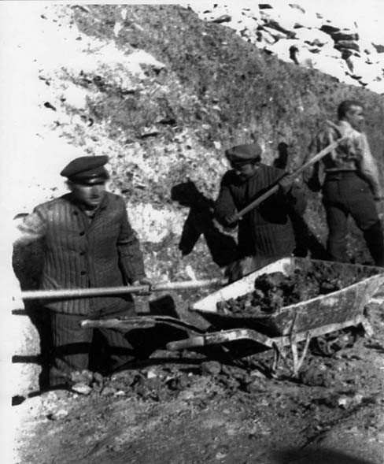

>   *Пред скалата, която разбивах с лост или кирка, а след това натрошените
>   парчета от нея изсипвах с количката в близкото дере*

На разсъмване отново бяхме на обекта. Към обяд времето отново се намръщи. Този
път и аз се скрих във воденицата, но вече беше късно. От силното простудяване
през предишния ден отново вдигнах висока температура. Изведнъж се почувствах
много зле. След това не помня какво се бе случило. Бях изгубил съзнание. Няколко
души ме грабнали и полужив понесли към здравния пункт, който се намираше в Люти
дол. Дойдох на себе си в болницата в Мездра.

Когато медицинската сестра ми помагаше да се разсъблека, за да облека болничните
дрехи, ме гледаше уплашена.

&minus;Ти от кои си ? Сигурно си от Люти дол, нали ?

&minus;Да! – отговорих кратко.

&minus;Вярно ли е, че сте затворници? Били сте много опасни. Как и защо те докараха
    тук? Няма ли друга болница за вас? Къде да оставя сега тези дрехи, които са
    като на просяк? – продължи да ме отрупва с въпроси сестрата.

Лекарят, който се доближаваше до нас, дочу част от въпросите на сестрата.
Намръщи се и каза:

&minus;Заведи болния в стаята, която съм определил, и повече не го разпитвай, а си
    гледай работата!

Погледът на лекаря ме стопли. Постави ръката си върху челото ми и каза:

&minus;Не се страхувайте. Идвате съвсем навреме. Ще прекъснем заболяването.
    Обещавам ви да бъда до вас. Шофьорът ми каза, че сте учител. Знам защо сте в
    Люти дол. Но за това не казвайте на никого в болницата.

След тези думи лекарят стисна палци и с това даде знак да разбера, че ще се
грижи за мен. Бях предубеден, че не е от червените доктори. Настаниха ме в стая,
където имаше още двама болни. Сестрата, която дойде да ми постави инжекция, беше
друга. За разлика от онази, която ме отрупа с въпроси, тази беше любезна. Личеше
си, че беше човек на доктора.

На следващия ден единият от болните в нашата стая беше изписан. На неговото
легло настаниха друг, който не изглеждаше болен. Когато той излезе, за да
изпрати близките си, които го докараха, лекарят се показа на вратата, огледа се
и като видя, че другият болен беше заспал, приближи се до мен и ми прошепна:

&minus;От новия болен ще се пазиш. Няма да му казваш откъде те докараха и кой си,
    защото сигурно и той е изпращал такива като теб в лагери и черни роти.

Благодарих на доктора и го помолих да ми каже какво е заболяването ми.

&minus;Ще прекъснем пневмонията, но има и друго, което трябва да предотвратим.
    Строшили са ти тялото от тежка физическа работа.

Вратата се отвори и новият болен се похвали на доктора:

&minus;От окръжния комитет ми се обадиха да оздравявам бързо, защото имаме важни
    партийни дела. Казах им, че попаднах на най-добрия лекар. Похвалих те,
    докторе.

Вече стана ясно кой е моят съсед по болнично легло. Докторът беше прав. Трябваше
да мълча и да не казвам нищо за себе си. Но той още като се изтегна на леглото,
започна да ме разпитва. Престорих се, че не го чувам. Казах му, че не се
чувствам добре и ми е трудно да говоря. Затова пък той започна да се хвали кой
е, какви са заслугите му към партията и народната власт. Ама късмет! Стана ми
неприятно, че до мене лежеше един от тези, които бяха от нашите екзекутори.

&minus;Хей, момче ! Ти не можеш да говориш, но слушаш, нали? От мен, бай ти Христо,
    ще научиш как създавахме и укрепвахме народната власт във Врачанско.
    Разбрах, че не си от нашия край.

Съгласих се да науча за „приноса“ на врачанския партиен функционер за
укрепването на народната власт, въпреки че болките ми не стихваха. Ето
най-важните неща, които ми разказа през вечерните часове в продължение на три
дни представилия се за „бай Христо“, на когото не научих фамилията.

По нищо не личеше, че врачанският „строител на народната власт“ беше болен,
защото през първата вечер с въодушевление разказваше за ремсистките си години.
Още през 1943 година бил приет в РМС и по време на съпротивителната борба е бил
помагач на партизаните. Не скриваше обаче, че за да им занесе храна е бил
принуждаван да краде от по-богатите хора в някои от селата. Често заделял от
краденото и за себе си. А когато откраднатото е било повече, бохемствал заедно с
шумкарите. На някои от тях е уреждал и срещи с „леки“, но красиви жени. Понякога
и той е вкусвал от сладострастието им.

С най-пламенно чувство за гордост ятакът „бай Христо“ разказваше за участието си
при установяването на народната власт на 8 и 9 септември 1944 година, а и след
това.

&minus;Ще ти кажа,момче, точно какво правехме. Няма да се плашиш, нали? Партията
    нареждаше, а ние изпълнявахме. Още не беше готов законът за „Народния“ съд,
    затова по нареждане на Г. Димитров от Москва трябваше да се извърши негласна
    ликвидация на най-злостните „врагове на народа“. А те не бяха малко.
    Повечето ги изчистихме. Но останаха децата и внуците им, с които тепърва ще
    трябва да се справяме. Не зная дали си научил, но за голяма част от тях
    създадохме лагер, където ще им изстискаме здравето. Ако ти падне път от Люти
    дол до Скравена, ще ги видиш какви плашила са. Повечето са от Пиринския
    край. Тяхната майка македонска!

Сърцето ми кипна и подскочих. Ораторът на партията се сепна и каза:

&minus;Какво ти е, момче? Да повикам сестрата? Тя е мой човек. Дъщеря е на наш
    другар.

Тази вечер беше онази сестра, която ме посрещна и се уплаши от мен, защото с
окъсаните дрехи приличах наистина на плашило. Но тя разбра, че идвам от Люти
дол, затова отново помолих разказвача на „подвизите“ си да не ѝ звъни.

&minus;Не, не! Нищо ми няма. Разказвай по-нататък. Сигурно има още какво да ми
    кажеш.

Ятакът на партизаните се вдъхнови и продължи:

&minus;Аз участвах при изтребването на фашягите в селата Койнаре, Чомаковци, Еница,
    Лазарово, Бреница и Глава. Понякога не ги разстрелвахме, пестяхме патроните,
    затова използвахме топори и войнишки ножове. А в с. Долна Кремена ги зарихме
    направо живи в ямата за умрели животни. Пречукахме ги с колове.

Последната вечер не изтраях. Когато сатрапът започна да разказва, че при някои
от убийствата на нарочените жертви са присъствали и най-близките им, почти
изкрещях и се провикнах:

&minus;Как не се смилихте! Това е ужасно! Вие деца имате ли?

&minus;Не, момче, трябваше да ги изчистим, за да укрепим народната власт. Някои от
    тях оцеляха и докато ги има, ще ги преследваме един по един.

Покрих лицето си с одеялото, обърнах се на другата страна, за да не срещам очите
на убиеца. Той продължаваше да разказва за своя героизъм при прочистване на
„враговете на народната власт“. След това се похвали, че е приет като
димитровски набор в партията през 1947 година. Заемал е все ръководни длъжности.
Бил е секретар на РМС, а после и партиен секретар. Сега е член на ГК на БКП и
съветник.

Когато на следващата вечер екзекуторът на „враговете на народната власт“ поиска
пак да ни разказва, другият болен от трето легло не се стърпя и каза:

&minus;Спри, бе ! Ти не си човек, а изрод. Теб господ ще те накаже. Не съм мигнал
    от ужасиите, за които ни разказваш.

Двамата се сграбчиха. Врявата събуди болните от съседните стаи. Някои от тях
дойдоха и ги разтърваха. Дежурният лекар и сестрата се намесиха. Поискаха
болният от трето легло да се премести в друга стая. Тогава се обадих и аз.
Помолих ги да преместят и мен, но докторът ми каза, че засега съм неподвижен и
не бива да сменям леглото си. Няма как, преместиха касапина на „враговете на
народната власт“ в друга, самостоятелна стая. Въпреки това не заспах цяла нощ.
Сънувах го как убива хора.

След шест дни се съвзех и ми казаха,че ще бъда изписан от болницата. 
Докторът, който ме посрещна първия ден, ми издаде болничен лист с препоръка
за 20 дни домашен отпуск. Дойдоха двама от караула на лагера. Върнаха ме отново
в Люти дол. Не ми разрешиха домашен отпуск, а ме изпратиха направо на обекта.
Уплашиха се, че ако ме пуснат в родния ми край, ще избягам в Гърция.

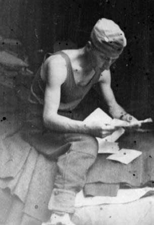

>   *Макар и болен, често се усамотявах, за да довърша записките си за
>   преживянето в болницата в Мездра*

Занизаха се отново напрегнати дни, свързани с ускореното, предсрочно завършване
на пътя. Преместваха ни от обект на обект за извършване на довършителни работи.
Есента дойде със студени дни. Отначало заваляха дъждове. След това започна да
навява и сняг. А ние бяхме на палатки. Студът ни сковаваше най-много през
дългите нощи.

Една сутрин заваля силен дъжд, премесен с едри парцали от сняг. Беше студено,
много студено, затова не ни изведоха на обекта. Покрай нашата палатка мина
младеж, който ми се видя като познат. Той също се загледа в мен и се провикна:

&minus;Бай Атанасе, и ти ли си в нашата рота? Защо не се обаждаш? Научих за теб, но
    те търсих в другата рота?

Беше Цено Калчев от Северна България. Преди две години го заварих като
медицински фелдшер в моето село. Отскоро го изпратили при нас, защото заболелите
вече станали много. Заприказвахме се, но от горните палатки се мярна капитан
Йорданов. Цено се наведе и ми каза:

&minus;Този не бива да ни вижда двамата. Пази се от него! Вашият капитан

е друг човек, но не го виждам отдавна. Добрите не ги оставят тук. Бързо ги
изселват на друго място.

Ставаше дума за капитан Тодоров, на когото и ние загубихме дирите. А питахме
често за него, защото не беше като другите офицери. Всички казваха,че е от майка
роден и страдаше заедно с нас, когато работата ни беше непосилна. Понякога
хващаше кирката и помагаше, но се оглеждаше да не го видят неговите началници.

Цено ме попита как съм със здравето. Научил за случилото се на воденицата и
пребиваването ми в болницата в Мездра. И в другата рота научили за мен, но само
той знаел защо съм тук. Помоли ме, когато имам нужда, да се отбивам през
неговата палатка, която беше на височината, от която се гледаше целия лагер. Но
не скри, че обикновено при него отсядали офицерите не да се лекуват, а да ни
наблюдават по-лесно. От тях научил, че се говорело за закриване не само на
нашия, но и на другите лагери в страната. Чуждите радиостанции вдигнали голям
шум.

Слухът за закриването на нашия лагер, в който бяхме изпратени като деца и внуци
на „враговете на народната власт“, се разнесе навсякъде. Скритата радост ни
стопли, затова започнахме да броим дните до неизвестната дата за напускането на
клисурата на Люти дол, която беше превърната в затвор на открито. Някои
казваха,че месеците, които прекарахме тук, ще се признаят за отбиване на военна
служба. Но други пък чули от ротния командир, че ще ни разпръснат в страната по
различни трудови поделения, за да ни изстискат така, че да нямаме повече сили, с
които да плашим „народната власт“.

След две седмици, когато снегът вече беше покрил лагера и правехме пътеки, за да
отидем до обекта, една вечер командирът на ротата ни строи и каза, че поделение
95950 се разформирова. Това беше номерът на нашия лагер. С такива номера бяха
белязани и другите лагери в страната.

Някои ни лъжеха, че сме войници. Какви войници бяхме ние като тези, които ни
изпратиха в Люти дол, не ни дадоха пушки, а ни въоръжиха с кирки и лопати. И
защо не ни показаха поне веднъж като представители на Българската “народна“
армия, облечени с продупчените от куршуми и окървавени дрехи на истинските
войници от Балканската и Междусъюзническата война, а ни криеха в Лютидолската
клисура. Вече се знаеше както в бившите източноевропейски страни, така и в
западните, че в социалистическа България има специално създаден лагер, в който
децата и внуците на „враговете на народната власт“ изкупват „вината“на своите
деди и бащи. Такива лагери бяха създавани само в тогавашния Съветски съюз,
където изчезваха безследно децата на враговете на съветската власт.

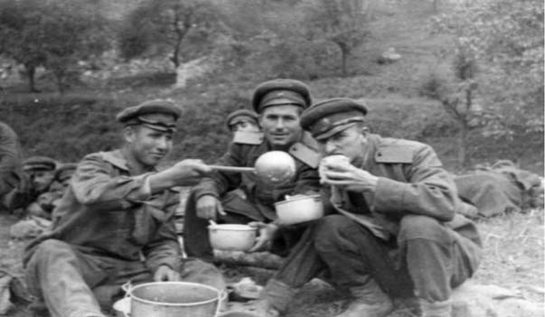

>   *Ангел Солаков сипва в канчетата ми от тлъстата свинска супа, за която
>   казваха че е била приготвена от месо на прасета, които се хранили с човешки
>   трупове*

Не мога да подбера думи, с които да опиша преживяванията ни, когато на 21
ноември 1959 г. най-после наистина напуснахме лагера в Люти дол. Оставихме
недовършен пътя, който изграждахме по специалната поръчение на Тодор Живков.
Стигнахме само до село Скравена, където беше лагерът на „непокорните“ жени в
България. Те знаеха за нас, както и ние за тях, че имаме еднаква съдба. Но може
би тяхната беше по-жестока, защото там злодеите стреляха направо, а в Люти дол
ни взеха здравето на каменните кариери, които прокопавахме.

След няколко години пред Комитета за култура се срещнахме очи в очи с командира
на нашата рота в Люти дол майор Грозев.

Той се втренчи в мен и извика на глас:

&minus;Хей, даскале! Ти ли си? Ела да те почерпя и да ти кажа някои неща за Люти
    дол, които там не можах, защото и аз бях с вързани уста. Да знаеш, че на
    няколко пъти съм те спасявал от най-страшното.

Погледнах Грозев направо в очите. Някога той беше винаги намръщен, когато
неговите началници не бяха доволни от него. Приех поканата му да седнем в една
от сладкарниците, която беше наблизо.

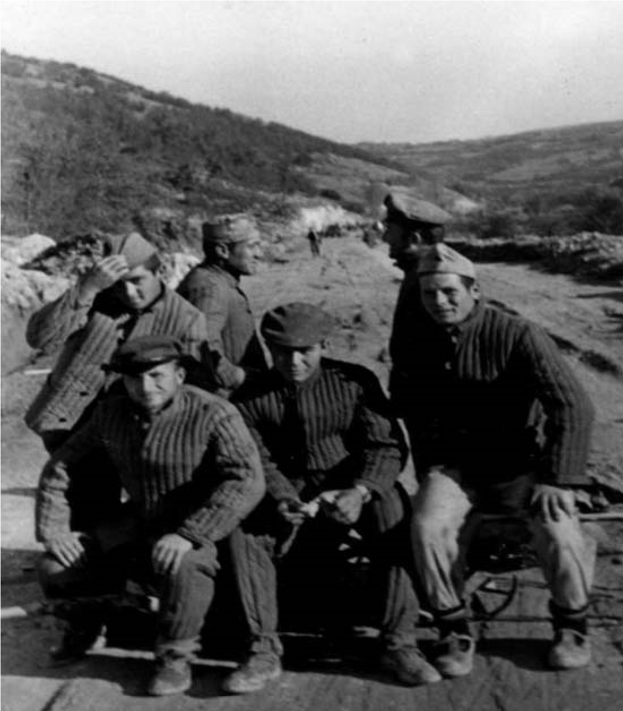

>   *Последният ден на пътя, който правехме от Мездра до Скравена*

Майор Грозев си призна, че бил готов, под напора на Държавна сигурност, да бъда
„изцеден докрай“ с тежък, каторжен труд, но моят взводен командир капитан
Тодоров му казал:

&minus;Ще те прокълна, ако „умориш“ даскала. Той е хубав и умен човек.

И той бил подложен на небивал натиск от полковника на Държавна сигурност да бъда
„смазан“, но все се отлагала „гилотината“ над мен.

След това майор Грозев ми каза, че нашият лагер е бил закрит под големия натиск
на международното обществено мнение. Оказа се, че аз знаех повече от него за
предназначението на така наречения трудово-възпитателен лагер в Люти дол, който
беше създаден през същата 1959 година, когато беше открит и лагерът в Ловеч.
Комунистите искаха да ни изчистят чак до девето коляно. У нас се копираше
моделът на Сталин за трудово-възпитателните лагери. Сред нас имаше и затворници,
които доизлежаваха присъдата си в Люти дол.

## 14. Трудовашки премеждия

След Люти дол ни разпределиха в различни поделения на Трудова повинност в цялата
страна, които бяха известни като най-трудните за оцеляване от тежката физическа
работа, която се извършваше в тях. Не искаха да сме на едно място, защото всички
заедно бяхме вече много по-опасни за „народната власт“. В тях прекарахме до 1962
година, когато беше закрит и последният комунистически лагер на смъртта в Ловеч.

Аз бях изпратен в поделение 1692, което се намираше на Гара Искър, близо до
гарата. Строиха ни в двора на поделението и започнаха да ни извикват един по
един. Разпределиха ни по различни обекти. На едни от тях се правеха пътни
съоръжения, на други се прокопаваха канали, а някои от обектите бяха „секретни“.

Когато се събра нашата група, при мен дойде старшина Наум Наумов. Вече се
знаеше,че той е с македонски корени, затова може би повече внимание обърна на
нас, които бяхме от Пиринския край. Даде ми знак да го доближа.

&minus;Ти си даскала, нали ?

&minus;Да! – отговорих на старшината.

&minus;Ще заминеш за село Курило, което е в началото на Искърското дефиле, но след
    това ще те изтегля в щаба на поделението. Тук ни трябва образовано момче,
    което да пише на машина. Видях, че твоята автобиография е написана на машина
    „Марица“. А и красиво пишеш, нали ? Старши лейтенант Ганчев от техническата
    служба отдавна търси машинописец. А и ние нямаме човек, който да ни чисти
    стаята и взема пощата.

Гледах старшина Наумов, който сигурно не беше научил още всичко за мен.

&minus;Но освен автобиографията, видяхте ли и характеристиката ми? Не си създавайте
    неприятности заради мен!

Отговорникът за групата от Курило извика, че тръгваме. Разделих се със
старшината, който ми каза :

&minus;Очаквам те! Ще изпратим човек да те вземе.

В Курило ни натъпкаха в едно помещение, където имаше нарове на два етажа. Бяхме
повече от четиридесет човека. Срещу нашата ниска сграда, която беше на брега на
Искър, се виждаше лудницата. Още от първия ден се чуха взаимни провиквания между
лудите и някои от нашите. Делеше ни само реката. Един от тези, с когото бяхме
заедно в Люти дол, се провикна:

&minus;И тук ме вредиха, пак до жени. В Скравена бяха „хулиганки“, ама не приличаха
    на такива, а тук са луди, но говорят свястно. Дали наистина са луди ?

&minus;Кой знае? Колкото ние сме „фашисти“, толкова и скравенченки бяха
    „хулиганки“, а курилченки „луди“ – отговорих на поставения въпрос на моя
    лютидолски състрадалец.

> Когато ми дадоха самоличната книжка като трудовак в Нови Искър беше вписано
> само името ми. След това старшина Наумов ме помоли да си добавя датата, годината
> на раждане и домашния ми адрес. Видял,че пиша красиво, поради което след това за
> малко време бях преместен в шаба на поделението,но бързо прокуден от службите на
> Държавна сигурност, които вървяха винаги по стъпките ми*

В Курило копаехме канали за напояване. Нормата ни и тук беше непоносима. Вечер
се връщахме съсипани от умора. Някои лягаха и си вземаха дрямка до вечерна
проверка, когато започваше гаврата с онези, които не си бяха изпълнили нормата
през деня. И тук имаше “слушалки“, които преиначаваха казаното на обекта. Затова
всеки се пазеше от онези, които се навъртаха около началниците.

В трудовото поделение беше тежко, много тежко, но не беше толкова убийствено
тежко като в Люти дол. Тук изпълнявах нормата си с помощта на някои приятели,
които преди да си тръгнат, минаваха покрай мен. Една вечер командирът на
поделението майор Павлов влезе в помещението и попита:

&minus;Кой е учителят Попов ?

Вместо аз да отговоря, приятелите ми се обадиха хорово:

&minus;Ето го на втория етаж. Нещо пише, както винаги, вместо да щурее като нас.

&minus;Учителю, ела при мен в канцеларията. Чакам те!

Пак някой те е насолил – ми каза един от тези, който ми помогна да си изкарам
нормата през деня.

Помислих си, че някоя „слушалка“ е видяла, когато ми помагаха. Канцеларията на
майор Павлов беше в самостоятелна сграда, сгушена между няколко тополи, на самия
бряг на река Искър. Когато почуках на вратата, майорът побърза да ме посрещне.

&minus;Нямаш време, долу те чака кола от щаба. Преместват те там. Прибери си багажа
    и ще пътуваме заедно.

Не исках да повярвам, че старшина Наумов е изпълнил македонската си дума. Влязох
в помещението, за да си взема довиждане с другите. Те вече бяха научили от
шофьора, който дойде да ме вземе, и беше посъбрал част от багажа ми. Стана ми
мъчно, вместо да се радвам, затова мълчаливо си стиснах ръка с всеки поотделно.
А на един от най-близките ми приятели от Люти дол казах:

&minus;Сигурно няма да е за дълго. Ще ме държат там, докато не ме подбере отново
    някой от Държавна сигурност .

&minus;Пази се, малко ли те мачкаха в Люти дол. Ние се уплашихме там за теб. Дано
    тук най-после бъдат по-милостиви към разклатеното ти здраве – ми каза
    приятелят и се разделихме.

В гара Искър, пред щаба на поделението, ме чакаше старшина Наум Наумов. Не зная
как е попаднал в Трудова повинност човек с такава благородна душа. Прегърна ме и
каза:

&minus;Не беше лесно, но успях да те изтегля при мен. Ще работим заедно.

На следващия ден бях запознат със задълженията ми, които се свеждаха до
следното: да чистя канцеларията, сутрин да паля печката, и най-важното – да
изпълнявам поръчките за писане на пишеща машина от техническия отдел, където
работеха повече цивилни мъже и жени. Отговорник беше старши лейтенант Ганчев,
строителен техник, който веднага ме отрупа с какви ли не отчети за строителните
обекти, които трябваше да препиша на пишеща машина.

Бяхме в една стая със старшина Наумов. Често си говорехме за Македония. Той за
Вардарска, а аз – за Пиринска. Вече знаеше за дедите ми. Когато бяхме съвсем
сами, ме разпитваше за жестокото убийство на поп Стоян и дядо ми войводата
Атанас Попов. Предупреди ме с друг да не обелвам нито дума за произхода ми.
Сподели, че се е погрижил да скрие новата характеристика, изпратена от общината,
в която отново било написано: „Отношението му към народната власт е отрицателно
и е вражески настроен“.

Лекарят в щаба на поделението беше старши лейтенант Митов. Един ден той ме
повика в кабинета си и ми каза:

&minus;Ти не идваш при мен, а трябва да се погрижиш повече за здравето си. В Люти
    дол си го разклатил немалко. Трябва да се лекуваш. Учителят трябва да бъде
    жизнерадостен пред децата.

&minus;Разчекнаха ме от работа, другарю старши лейтенант. Затова още не мога да се
    съвзема – отговорих без да се притеснявам.

&minus;Дано поне тук те оставят на мира. Ти не си за тежка работа. Пази левия си
    крак. Може би ще се наложи да те правим операция.

Бях трогнат от специалното внимание на старши лейтенант Митов към мен.
Неочаквано той сам ми призна,че е партиен секретар на служителите в щаба.
Погледнах го в очите. Бях вече свикнал по тях да разпознавам онези, които
минаваха за благодетели, а после правеха доноси. Докторът не беше от тях. Но,
интересно, не забрави да ме попита какво съм направил, та съм попаднал отначало
в черната рота, а сега в трудова повинност.

&minus;Имахме заседание на партийния комитет. Стана дума за теб. И при нас
    пристигат доноси, че имаш отрицателно отношение към народната власт. Говориш
    ли пред учениците против нея ?

&minus;Те сами разбират някои неща, другарю старши лейтенант – отговорих лаконично.
&minus;Какво ?

&minus;Ами това, че ги разделят на „наши“ и „чужди „.“Нашите“ са децата на вашите
    съпартийци, а „чуждите“ – на безпартийните.

&minus;Е, ако е така, и аз не съм съгласен да делим децата ни. Но, хайде да не
    говорим за тези неща, защото и стените имат уши.

Разбрах, че и старши лейтенант Митов не е от ортодоксалните комунисти, затова
може би бяха неразделни със старши лейтенант Ганчев и старшина Наумов.

Зимата на 1960 година дойде люта и ветровита. Вътрешно бях доволен, че не съм на
открит обект, където бяха другите. Но нощем често сънувах приятелите си, които
останаха в Курило. Мъчно ми беше за тях, затова често се събуждах след полунощ и
до сутринта не заспивах.

&minus;Какво става с теб ? – попита ме една сутрин старшина Наумов. Защо си толкова
    замислен през деня? Да не си болен?

&minus;Не съм болен, но мисля за тези, които работят на открито в тези мразовити
    дни. Не е човешко отношението към тях, другарю старшина. Защо не кажете на
    полковник Илиев да ги пусне в отпуск? Вън камъкът се пука, а те са хора.
    Познавам ги, всички са от лагера в Люти дол и са с разклатено здраве.

&minus;Знам, Атанасе, така е. Но и от него не зависи нищо. Знаеш, че и той не е лош
    човек. Над него има други, които не мислят като нас с теб. Вчера един от тях
    ме разпитваше. Разговорът ни беше труден. Изглежда,че твоите доносници са
    научили адреса му.

Сетихсе, че става дума за полковника от Държавна сигурност. Той вече знаеше
всичко за мен и беше попитал командира защо ме държат в щаба.

В началото на февруари в щаба станаха промени. Полковник Илиев беше преместен.
На негово място дойде полковник Георги Бучков, заедно със своя писар. Като ме
видя, той ме попита:

&minus;А ти какво правиш тук? Аз си идвам със свои хора. Имам си писар и куриер.
    Трима сте много.

Куриерът на поделението беше син на Стоян Караджов от ЦК на БКП. Вестяваше се от
дъжд на вятър. Куриерската му работа се вършеше повече от писаря, който също
беше дете на човек от висшите партийни етажи.

Една сутрин старшина Наумов подрани. Дойде при мен и ми каза:

&minus;Атанасе, едвам оцеля. Оставаш в щаба. Новият командир се оказа твой земляк.
    Той е от Разлог. Дръж се добре с него.

Полковник Бучков беше откровен. Не скри, че още когато го повикали в Главното
управление на Трудова повинност, му казали да ме „разкара“, защото не съм бил
„техен“ човек. Но не се бяха минали две седмици от разговора ни с него, една
сутрин телефонът прозвъня продължително. Този звук ми беше познат. Знаех, че
така звънят онези, които не ме оставяха на мира. Вдигнах слушалката. Познах
гласа на полковника от Държавна сигурност.

&minus;Ти ли си, бе ? Още ли си в щаба? – попита ме той.

В този момент полковник Бучков отваряше вратата. Подадох му слушалката и тръгнах
навън. Той ме спря и ми даде знак да почакам. Искаше и аз да чуя разговора.
Започна кавга по телефона. Командирът ме защитаваше. Уверяваше полковника от
Държавна сигурност, че съм „добро момче“.

&minus;Поемам цялата отговорност за него, другарю полковник. Нека да остане поне
    през зимата тук. Здравето му не е добро.

Сърцето ми вече биеше неспокойно. Чух всичко с ушите си. Нареждането бе веднага
да бъда „изхвърлен“ от щаба и изпратен отново в Курило.

Накрая на словесната кавга полковник Георги Бучков ме погледна с почервенели от
яд очи и каза:

&minus;Някой иска да те душмани! Не мога да те спася. Ако не изпълня заповедта,
    друг ще те изгони, защото сигурно и аз няма да бъда тук.

Вече бях почти изтръпнал. Помолих командира да не рискува заради мен. Той обаче
излезе ядосан от стаята, потърси старши лейтенант Митов. Какво си бяха казали не
разбрах, но след десетина минути целият коридор в щаба се изпълни от всички
служители. Шумно говореха:

&minus;Не го пускаме. Даскалът е част от нас. Без него работата ни ще спре.

Навън беше студено, много студено. Вятърът режеше като бръснач. Събрах набързо
багажа си и тръгнах към джипа, който ме чакаше на портала. Пред мен за раздяла
се наредиха всички служители. Някои от жените не скриваха сълзите си. Една от
счетоводителките, без да се страхува, се провикна:

&minus;Кой е този, на когото и сянката не познаваме? Той не е човек! Какво му е
    направил даскалът?

Да, наистина, това бе пак сянката на Държавна сигурност, която ме преследваше
навсякъде.

Шофьорът, който ме возеше, караше предпазливо колата, защото пътят до Курило
приличаше на заледена пързалка. Когато наближихме селото, настигнахме група
трудоваци, които бяха преметнали върху раменете си кирки, лостове и лопати.
Спряхме до тях, за да качим в колата колко може да събере. Но младши сержантът,
който беше сигурно „уше“ на тези, които ме връщаха при него, не разреши.

В Курило ме посрещна майор Павлов, който беше висок, красив мъж, който излъчваше
благородство. Представих му се и казах,че ме връщат отново на обекта при него.
Той не повярва. Помоли ме да отида в канцеларията му и да го почакам там докато
посрещне връщащите се от обекта трудоваци, за да приеме рапорта за извършената
от тях работа през деня.

Командирът се върна в канцеларията и започна да ме разпитва. Искаше да знае
причината за връщането ми на обекта. Потърсили го по спешност от щаба, но той
бил в селото. Очакваше пак да го потърсят. Казах му, че и аз не зная, но не
скрих, че полковник Бучков е разговарял с офицер от Главно управление на
строителни войски, който е от Държавна сигурност. Майор Павлов присви устни и ме
погледна плахо. Разбрах, че и с него ще се води такъв разговор, който бе
направен с полковник Бучков. Помоли ме да не знае друг за срещата ни, но ме
увери, че след време ще ме изпрати на по-лека работа.

&minus;Засега не мога да ти помогна. Нека почакаме този от Главното управление,
    който те изпраща при нас, да те забрави, макар че тези като него са
    злопаметни.

&minus;Не искам заради мен да имате неприятности. Затова от утре за вас ще бъда
    един от всички, които тук изпращате в най-страшния студ да копаят. Преживял
    съм и по-мъчителни дни в Люти дол – казах на майор Павлов.

В този момент телефонът иззвъня силно. Командирът отвори широко очи в
недоумение. През това време, толкова късно, никой не му бе звънял.

Вдигна слушалката, притаи дъх и изчака отсрещния глас.

&minus;Павлов, ти ли си ?

&minus;Аз съм, а вие кой сте?

&minus;Не ме ли позна ? – чу се строг глас.

Лицето на майор Павлов се смръщи, но събра кураж и отговори:

&minus;Днес ми е тежък ден, прощавайте, не можах да ви позная гласа. Заповядайте,
    другарю полковник.

&minus;Даскала от щаба дойде, нали?

&minus;Тъй вярно, другарю полковник.

&minus;Искам го на обекта. С по-голяма норма за деня, за да се кали на студа.
    Заповядвам! Чули ли?

Майор Павлов съвсем смрази погледа си. Погледна ме с изумени от възмущение очи.
Отсреща отново се чу наставническият глас:

&minus;Чу ли, Павлов?

&minus;Тъй вярно, другарю полковник!

Командирът стоеше като смразен. Сякаш вътре в кабинета му имаше по-голям студ от
външния, който беше подгонил и кучетата, които лаеха покрай брега на Искър.

И двамата стояхме прави. Гледахме се един в друг. Аз вече бях изтръпнал от гласа
на „черната сянка“ още на гара Искър, но майор Павлов сякаш онемя, когато чу
нейния глас.

&minus;И така, другарю майор. От утре тръгвам с другите. Няма как! Съдбата ни с тях
    е една и съща. Не приемам предложението ви да остана в канцеларията. Не си
    навличайте беля, заради мен. Лека нощ!

Напуснах канцеларията, в която майор Павлов остана сам. Когато затварях вратата,
чух да прошепва:

&minus;Боже, колко жестоки хора има! Защо ли стоя още при тях? Страданията на тези
    молепсани момчета са и мои страдания. До кога ли ще продължава този ад?

Тръгнах към спалното помещение, в което нетърпеливо и с нескрито любопитство ме
очакваше цялото отделение. Някои от тях не вярваха, че се връщам отново на
обекта. Доверих се на моите земляци от Неврокопския край. Казах им истината. Те
знаеха още от Люти дол за произхода ми и постоянното преследване на рода ни от
комунистическата власт. Един от тях се доближи до мене и прошумоли в ушите ми:

&minus;Даскале, болшевиките не прощават. Те сякаш са родени, за да бъдат
    злосторници за цял живот. Запомни от мен, че страхът им от теб е голям,
    затова ще те преследват завинаги. Ти си най-умен от всички ни, но приеми и
    не забравяй съвета ми. Отваряй си очите, когато разговаряш и с „нашите“,
    защото комунистите имат няколко доносници тук. Не виждаш ли, че някои от
    отделението не ходят на тежка работа. Така беше и в Люти дол, нали?

Вярно е, така беше и в Люти дол. И там имаше „ушета“, т.е.сътрудници на Държавна
сигурност, които подстрекаваха наивните да говорят срещу партията и народната
власт, след което бяха изпращани на най-тежкия обект за работа. Там ги знаех кои
са, но тук още не можех да ги разпозная, затова бях мълчалив.

Занизаха се тежки, непоносими дни и в Курило. И тук не смогвах да изпълнявам
трудовата си норма, особено през зимните дни. Когато се запролети, ни
изпращаха на групи по съседните села на Курило, където правехме напоителни
канали. Няколко дни оставах на обекта и през нощните часове, за да си
изкарам нормата. Един ден майор Павлов ме извика при него. Погледна ме и
съчувствено ми каза:

&minus;Този „дървен шоп“ – имаше предвид младши сержанта, който ни водеше на 
обекта – ще ти вземе здравето. Пази се от него!

Знаех какво искаше да ми каже командирът. И той се страхуваше от него. Говореше
се сред моите приятели, че „шопът“ бил „уше“ на Главното управление. Въпреки
това майор Павлов ме премести на обекта, където се строеше голямо водно
съоръжение. Там работата беше пак тежка, но все пак поносима. Тук работеха и
цивилни. Един от тях висеше по цял ден без работа. Предупредиха ме да се пазя от
него. По всичко личеше, че е ченге. Навсякъде ги имаше.

Скоро на обекта в Курило се появи строен, висок инженер, когото наричаха и него
„македонеца“. Една сутрин застана пред строя, заедно с командира. Не отместваше
погледа си от мен. Когато започна разпределянето за работа по обектите, той се
доближи и ми каза:

&minus;Даскале, много ти поздрави от старшина Наумов. От днес ще бъдеш с мен.
    Трябва ми човек, който да води точни бележки за проектирането на новите
    канали, които ще се строят. Нали сме македончета, трябва да се пазим!

Бях с „македонеца“ през месец август. Обикаляхме софийското поле. Разнасях
инструментите, с които той измерваше мястото, където трябваше се направят водни
съоръжения.

Към края на месец септември през 1960 г. отново здравето ми се разклати съвсем.
Чудех се от кое заболяване да се плаша най-много. Събраха се на едно място
онези, които получих в Люти дол и Курило. Не само сърцето, но и краката вече не
ме слушаха. С благословията на д-р Митов от щаба на поделението в гара Искър,
пред когото се застъпвали за мен македонските ми приятели, постъпих във военната
болница. Започна се операция на левия ми крак, а след това и възстановяване на
сърдечната ми дейност. Цели три месеца ме местеха от болница в болница.

Бях изгубил надежда, че ще оздравея. Зарадвах се, когато научих, че излязло
Разпореждане № 30 още през 1960 година на ГУТП, с което учителите трудоваци
могат да довършват остатъка от службата си само през летните месеци, за да могат
през останалото време да упражняват професията си.

## 15. Бях трудовак и на Червенково море

В началото на септември през 1961 година, според специалната заповед на ГУТП бях
пуснат в няколкомесечен отпуск като учител за започване на новата учебна година.
След това дослужвах през летните месеци, през които бях изпращан в различни
поделения. Първото лято бях на Четвърти километър, където нашето отделение
участваше в строителството на военни блокове.

През следващото лято бях в поделението в Панчарево, където продължихме да копаем
Софийския плавателен канал, който наричахме Червенково море, защото бил мечтата
на партийния вожд Вълко Червенков. Идеята му била софиянци да имат голям
корабоплавателен канал от Павлово до Панчарево.

Преди нас, по време на почивните дни, а понякога и в работно време, тук бяха
започнали да копаят жителите на София и околните села Драгалевци, Симеоново и
Дървеница, но каналът си останал недовършен. В „Задочни репортажи за България“
Георги Марков пише, че строежът на канала е бил използван за тероризиране и
провокиране на населението. Най-страшно обаче беше тероризирането срещу нас,
трудоваците, струпани тук от няколко поделения, за да се ускори постигане
мечтата на тогавашната власт да има пристанище в Павлово. Нормите ни бяха много
тежки. И тук ни оставяха и през нощите, за да ги изкараме. Спомням си, че един
мой приятел дойде при мен и ми каза:

– Даскале, утре, в неделя, ще дойдеш с мен, нали? Ще отидем в манастирчето
„Св.Пророк Илия“. Ще запалим свещ и помолим господ да не се построи Червенково
море, защото много като нас ще си съсипят здравето тук.

Манастирчето беше съвсем близо до обекта, където работихме. Незабелязани от
никого, заедно с още трима от нашето отделение бяхме посрещнати от един от
монасите, който ни разведе навсякъде вътре в манастира. Преди да излезем, той ни
даде свещи, които запалихме и заедно с другите пожелания не забравихме и
пожеланието да се провали изграждането на Червенково море. Пазехме в дълбока
тайна посещението в манастирчето, защото ако се знаеше от началниците ни,
сигурно щеше да бъдем изпратени в ареста, или пък в т.нар. „ дисциплинарна
дупка“, от която сигурно нямаше да излезем.

Сякаш господ ни помогна и до ден днешен там няма канал, но много трудоваци след
това си съсипаха здравето на Червенково море. Увяхнаха и някогашните мечти на
партийните велможи да се разхождат с корабчета от София до Панчарево

През лятото на 1962 г. отново заболях тежко. Наложи се да бъда правен операция
за втори път, след което пак с помощта на моите покровители от щаба на
поделението бях изпратен на лечение в балнеосаниториума в с. Ягода,
Старозагорски окръг. От тогава все още сънувам, че не съм си отслужил редовната
служба като трудовак. И сънищата ми са неспокойни, защото в тях се срещам с
онези, които ми причинаха толкова много незаслужени страдания.

Който не е мачкан в черната рота в Люти дол и в трудовашките катакомби, само той
не знае как непосилната работа разрушава бързо здравето и на най-силните. Ние,
които бяхме молепсани като „врагове на народната власт“, носим за цял живот
своите непоносими душевни и физически болки. Децата и внуците ни често ни молят
да им разкажем за виновниците, които ни осакатиха.  

## 16. Отново в пазвите на Родопите

За една учебна година бях назначен за учител по български език и литература в
планинското село Ковачевица, което все още беше многолюдно. Само няколко
семейства се бяха преселили във Велинград. Харесаха ми калдаръмените улици и
къщите, съградени само от камък и покрити с тикли (каменни плочи). Всяка една от
ковачевските къщи си имаше свое лице. Хората от селото бяха много будни,
ученолюбиви. След училище винаги се отбивах в селското читалище „Светлина“ с
някои от моите колеги. А то имаше богат книжен фонд. В читалнята срещах много
читатели – и стари, и млади. Често там заварвах и моите ученици, които веднага
идваха при мен, за да ми кажат какво са прочели. Запомних Вангелия Мавродиева,
която беше най-добрата моя ученичка. Тя винаги държеше нова книга в ръцете си и
бързаше да се похвали, че е опознала някакъв нов свят.

Най-близки в учителския колектив бяхме със стария учител Ангел Джигрев, който ме
запозна с всички по-известни родове от селото. В старото училище кипеше богата и
разнообразна учебно-възпитателна дейност. Учениците ме обикнаха и често заедно с
тях опознавах забележителните местности на селото. Направихме няколко екскурзии
из страната, за които и сега си спомнят моите вече много пораснали ученици.

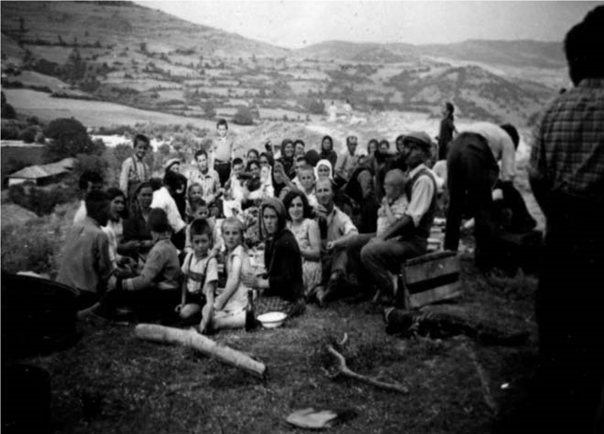

>   *Макар и прокуден от моето родно село, често се завръщах в него, за да се
>   видя с малкия ми син, жената и родителите ми. Тук съм на курбан, който се
>   правеше от махалата, която комунистите наричаха „фашистка“*

Само една, но незабравима беше учебната ми година в Ковачевица. В повечето
почивни дни прекосвах лещенските баири на път за родното ми село Либяхово,
където все още учителстваше жена ми. Понякога слизах по пряката пътека до така
наречените Градски бани, а от там през Заграде, Барото, покрай Мосомище, през
Копривлен и по нанагорнището до Кендик. Тук винаги спирах, както и през
ученическите ми години, за да прегърна с поглед родните баири. Най-много се
радвах на Бука, Пъзлак и Градище. В село пристигах след пет или шест часа
непрекъснато пътуване. Трудно ми беше при всяко идване при родителите, жена ми и
сина ми Красимир, но без тях не можех да се застоя в Ковачевица.

> *На път от Ковачевица за родното ми село С учениците под водопада в Ковачевица*

Ковачевица ми плени сърцето и мислите с будните, но много мирни хора, които не
знаеха що е умора. Както те, така и техните деца, моите ученици, бяха втъкали в
себе си хубостта на Родопите.

Директорът на училището Никола Копралев ме помоли да остана още една-две години
в училището. Взаимно се превързахме с колегите, повечето от които бяха местни. С
Ангел Джигрев през свободните часове бяхме неразделни. От него научих цялата
история на Ковачевица, която е откърмила толкова много просветни дейци и
войводи.

## 17.Учител в Дъбница

През следващата учебна година, най-после с помощта пак на окръжния инспектор
Никола Пашов, ни преместиха близо един до друг с жена ми – мен в Дъбница, а нея
в Гърмен. Зарадвахме се, защото селата бяха само на три километра едно от друго.
Намерихме квартира в Гърмен при дядо Илия Тошев, който имаше къща с голям двор в
центъра на селото.

Една цяла учебна година, всяка сутрин, рано, преди изгрев слънце, се отправях по
прекия път от Гърмен за Дъбница. Отначало пътувах пеша, но след това си купих
малък мотор“ Симсон“, с който ми беше по-лесно за отиване и връщане. Радвахме се
с жена ми,че след толкова години раздяла сме заедно със сина ни Красимир. Много
често при нас идваше дядо Илия, за да погали детето ни. Понякога го оставяхме
при него, за да му се радва, защото дядо Илия беше вече разпилял родата си и
живееше сам в голямата къща.

Селата Гърмен и Дъбница бяха самостоятелни общински центрове. Училищата им се
отличаваха с будни ученици и авторитетни учители. Директорът на училището в
Гърмен беше Крум Топалов, който имаше славата на човек, който не се подичинява
на управниците, защото се смяташе за „заслужил за народната власт“. Затова не
позволяваше други да командват в училището му. Знаеше за моето минало, което
оценяваше по-различно от другите комунисти. Смятаха го за „реформатор“ в
неговата партия. При няколко срещи ме уверяваше, че ако се съглася да се
преместя в Гърмен, никой няма да ми създава тези неприятности, които ме
съпровождаха навсякъде. Жена му се сближи с моята и много често са обсъждали
нашата орис.

Директорът на училището в Дъбница не даваше и дума да се продума за
преместването ми в Гърмен, за да бъдем заедно с жена ми. Предложиха ми да стане
обратното – тя да бъде назначена в дъбнишкото училище. На следващата учебна
година така и стана. Жена ми беше преместена за възпитателка в Дъбница.
Най-после след толкова години разделени се събрахме в едно училище.

>   *В класната стая с учениците, които никога няма да забрава, заради тяхното
>   ученолюбие и възпитание*

Аспарух Тиганчев беше известен като един от най-добрите директори на училище в
Неврокопския край. Беше красив, снажен и рядко интелигентен. Сближихме се много,
защото и семействата ни някога са били близки. Познавах баща му, дядо Георги,
който е бил един от съратниците на дядо ми. Често разговаряхме за неговото и
моето минало. Комунистите не го обичаха много, защото беше безпартиен. Но нямаше
друг, който да управлява така добре училищните дела в Дъбница. Окръжният
инспектор Никола Пашов беше и негов защитник. На няколко пъти общинският комитет
на БКП в Дъбница вземаше решение за подмяната му, но тогавашните просветни
ръководители Георги Стоянов и Никола Пашов осуетяваха изпълнението на решението.

Един ден при нас дойде малкото ми братче Китан, който беше силно привързан към
сина ми Красимир и дъщеря ми Снежана, която се роди в Дъбница. Тя беше само на
една година. Решихме брат ми да остане да се учи при нас. Така улеснихме майка и
татко, които едва смогваха да издържат другите ми братчета. Беше голяма радост
за цялото ми семейство След като завърши основното си образование, Китанчо
продължи да се учи в Неврокопската гимназия.

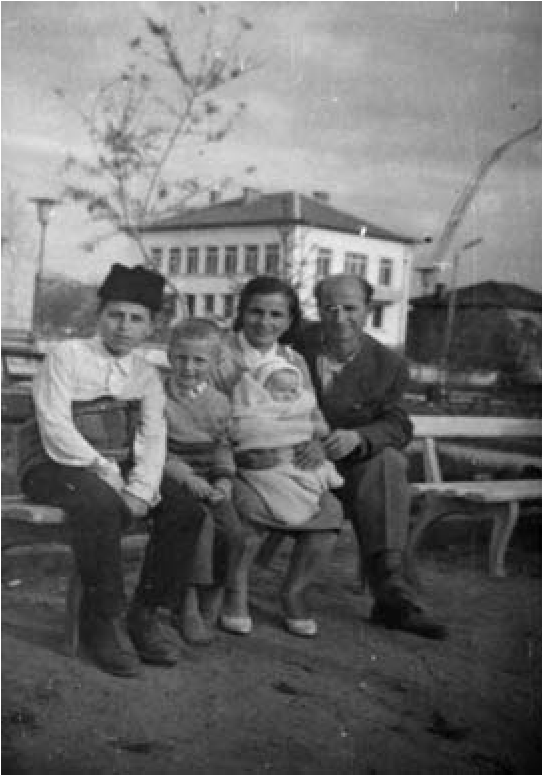

>   *Дъбница. С братчето ми Китан, синът ми Красимир и жена ми, която държи в
>   скута дъщеря ни Снежана, която е само на няколко месеца*

Още от първата година в Дъбница няколко учители по основните учебни дисциплини
създадохме здраво ядро, което бе в основата на богатата и разнообразна учебна и
възпитателна дейност с учениците. Всеки от нас беше един от водещите по своята
научна специалност в бившата Неврокопска околия. Моите ученици, немалка част от
тях турчета и българомохамеданчета, обикнаха дисциплините, които преподавах.
Създадох клуб „Млад литератор“, в който участвуваха 20 ученици, които имаха ярко
изразени творчески интереси към литературата. С това название издавахме и
вестник, в който се публикуваха най-добрите техни творби.

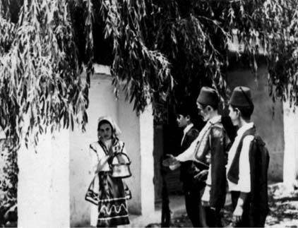

>   *Театрализация на „Изворът на Белоногата“ от П.Р.Славейков*

При обучението по български език и литература създадох неразривно единство
между класно-урочните, извънкласните и извъучилищните форми за обучение и
възпитание на учениците, което създаде изключително голям интерес и сред
моите колеги от училищата в Неврокопския край. На няколко пъти в Дъбница се
провеждаха семинари по тези проблеми, които бяха свързани и с подготвени от
моите ученици извънкласни и извънучилищни форми за възпитание. С особено
голям интерес бе посрещната театрализацията на поемата „Изворът на
Белоногата“ пред чешмата в селския парк. Ролята на Гергана изпълняваше
Офелия Гаджева, а на Везира – Рушан Талипов.

Повечето от моите ученици станаха и добри краснописци. Инспекторите по български
език и литература дойдоха няколко пъти да проучват опита ми, който беше
популяризиран в окръга. Един ден на посещение в нашето училище дойде и
инспекторката Иванка Тодорова от Министерството на просветата, която беше
известна като изключително строга и взискателна. Когато влезе в учителската
стая, бях останал само аз от учителите по български език и литература. Другите
мои колеги я бяха забелязали и се гмурнали по-рано в класните стаи, за да не
влезе при тях. Инспекторката Тодорова ме попита как се казвам. Представих се и я
поканих да ме посети на урок в седми клас.

&minus;За вас вече научих много хубави неща от училищния инспектор Борислав
    Владиков. Искам да посетя първо някои от другите твои колеги.

&minus;Те са вече в класните стаи. Неудобно е да влезем след тях – каза директорът
    Аспарух Тиганчев.

&minus;Добре ! -съгласи се Тодорова.

&minus;Когато влязохме в класната стая на седми „а“ клас, Тодорова първо огледа
    украсените стени и кътове, на които с красиви букви бяха извезани мисли на
    изтъкнати наши възрожденски поети. След това поздрави децата.

Урокът мина при активното участие на учениците, които не се притесняваха от
присъствието на гостите. Това даде повод на Тодорова да започне непринуден
разговор с тях, от който остана много доволна.

При влизане в кабинета на директора, за да направи анализ на изнесения от мен
урок, Тодорова ме попита:

&minus;Колега, кога си завършили университета?

Вместо аз, директорът даде отговор на този въпрос.

&minus;Той е прогимназиален учител. Няма все още висше образование.

&minus;А защо?

&minus;Попитайте колегата Попов. Но той сигурно няма да ви каже всичко. Не му
    разрешават да кандидатства в университета, защото е внук на известен войвода
    от нашия край. Пътят му и като прогимназиален учител е мъчително труден –
    каза директорът на инспекторката Тодорова.

Вместо да посети следващия колега, инспекторката остана да проучи подробно
причините за пречките, които ми създаваха управляващите да продължа
образованието си.

На следващия ден, когато Иванка Тодорова си тръгна за София, поиска да се видим.
Увери ме, че ще има специален разговор в окръжния отдел на „Народна просвета“ за
това повече да не ми се пречи да продължа образованието си. Имала среща с
инспекторите Борислав Владиков, Атанас Хаджиев и Никола Пашов, пред които
изразила впечатленията си от моето представяне в Дъбница. Единият от тях ѝ се
похвалил, че съм редовен лектор на семинарите с учителите по български език и
литература в окръга, които се провеждаха в град Банско. На последната сбирка
докладът ми „За творческо възприемане на художествената творба“ предизвика голям
интерес и у представителите от Министерството на народната просвета, които
настояваха да се разпространи във всички училища на страната.

През 1964 година за първи път не срещнах трудности при кандидатстването ми за
задочно обучение в Софийския университет, в който бях приет втори в списъка.
Отначало новоприетите студенти бяхме по-малко, но след това станахме много
повече. В нашия курс се появиха хора, които бяха записани като студенти с
някакви привилегии, които ползваха като щатни комсомолски секретари, деца на
активни борци против капитализма и партийни деятели. Измежду тях имаше и
офицери, които не скриваха оръжието, което носеха и по време на лекциите, на
които присъстваха от дъжд на вятър, а на изпити въобще не се явяваха заедно с
нас.

С неописуеми финансови затруднения следвах висшето си образование. Когато бях на
очни занятия, едва смогвах да заплащам леглото в хотелските стаи, където
отсядах. Често се отбивах при братовчед ми Тодор Мангушев, който беше миньор в
с. Бухово. В голямата таванска стая, където живееха с невястата Иванка и двете
им деца Борис и Иванка, се намираше място и за мен. Много често с батко не
заспивахме, защото започвахме тъжните разговори за убийството на баща му от
комунистите в селото.

Като учител в Дъбница станах очевидец на втория етап от възродителния процес в
родопския край, в който бяха включени и някои от учителите комунисти. Измежду
тях имаше турци, които обаче запазиха своите имена, а участваха в подмяна на
имената на българомохамеданите. Със сигурност двама от тях бяха доносници на
Държавна сигурност. Те създадоха разкола, който започна да се проявява в живота
на учителския колектив. За тях написах епиграмата: „На лицето им – захарнонежна
усмивка, леко потупват по рамо. Но пази се, това е преструвка, с която подкупват
те само“. По-късно трима от учителите по турски език се преселиха в Турция. Там
бяха проявили своя ярко изразен турски фанатизъм. Похвалили се, че въртели на
малкото си пръстче учителите “гяури“ в Дъбница и успели да ги разцепят на две
групички.

>   *Понякога батко ми Тодор Мангушев идваше заедно с мен да слуша някои лекции
>   на мои преподаватели в университета*

Наистина, за съжаление, двама от моите колеги се включиха в тяхната интригантска
игра, поради което първоначалното силно ядро от водещи учители вече го нямаше.
Тогава общинският комитет на БКП направи и кадрови рокади. Вината бе стоварена
върху директора Аспарух Тиганчев, който беше преместен в с. Блатска. На негово
място бе назначена потомка на известния комунистически род Папалезови, която
изпълняваше стриктно указанията на Общинския комитет на БКП за всичко, което
трябваше да става в учителския колектив. Оттогава започна да вехне спечелената
слава на дъбнишкото училище.

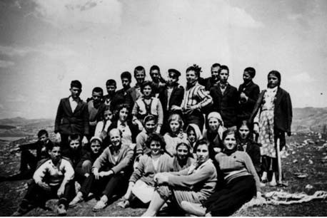

>   *И в Дъбница бях винаги заедно учениците*

На един от дъбнишките събори дойдоха и някои от близките на арестуваните и
разпитвани тук комунисти от нашето село, които са участвали в подготовката на
преврат срещу правителството през 1925 година. Заедно с тях беше и един от
агентите на Държавна сигурност, който пишеше доносите срещу мен като лагерист в
Люти дол, а след това и като трудовак в Курило. Той беше имал специална среща
със секретаря на общинския комитет на БКП Тома Спириев. Разказал му всичко за
моя род като „фашистки“. Оттогава първенците в селото ме гледаха като техен
„враг“. Разровили се в досието ми, представено от Държавна сигурност. Разбрах,
че тук ще ми бъде вече много трудно. След един разпит, на който бях подложен в
кабинета на секретаря на общинския кмет на БКП, взех решение да напусна Дъбница,
макар че бях силно привързан към учениците. А и те към мен. Споделих това с
инспектора Никола Пашов, който ми обеща да ми помогне да отида колкото се може
по-далеко от тези, които ме преследваха на всяка крачка.

Една вечер срещнах съседа ми Манол Джаджев, който беше председател на ТКЗС-то в
селото. Той имаше конфликт с общинския секретар на БКП и председателя на съвета,
не се погаждаше с тях. Попитах го дали може да ми осигури камион, с който да си
преместя багажа от селото. Той ме погледна учудено и каза:

– Ако и ти напуснеш училището, вече няма да имаме добри учители. Но е вярно и
това, че вече атмосферата в училището е непоносима с новия ви директор, която е
протеже на общинския комитет на партията, която вече не е моя. Затова не мога да
те посъветвам да останеш.

## 18. В Банско и Разлог

Напуснахме с жена ми Дъбница, заедно с двете ми деца Красимир и Снежана. От
Окръжния отдел на Народна просвета ми предложиха учителско място в Разлог или
Банско. Избрах града в пазвите на Тодорка и Вихрен. Настаних се в старата
възрожденска къща на Георги Бенин.

Когато седнахме да уговаряме наема, хазаинът и хазайката ме погледнаха и ми
казаха едновременно и двамата:

&minus;Пари не искаме. Стига ни това, че ще поддържате старата къща.

Тогава Банско беше тихо градче, което ме покори със своята хубост като
възрожденско огнище. Управата на града беше от инициативни родолюбци, които
приемаха т.нар. „приоданци“, т.е. придошлите в града, като свои. Искаха да имат
повече интелигентни хора. Още в самото начало към мен се отнасяха със специално
внимание, защото бързо се включих в културния живот, който беше свързан с
героичното възрожденско минало на тази крепост на българския дух. Не мога да
забравя хубавите предавания, които подготвяше Снежана Йопева като ръководител на
местната радоуредба. В тях нямаше политика, а народни песни, предания и разкази
за самобитния духовен живот на банскалии.

Банскалии тачеха своите богати народни традиции. Вечер по улиците на града се
чуваха хубавите мелодични песни на гласовити мъже. Някои от ръководителите ме
помолиха да остана в града, защото някои от Окръжния съвет на просветата им бяха
казали, че след като завърша висшето си образование, ще бъда преместен където си
поискам, защото като учител по български и литература вече бях оценяван като
един от най-добрите в окръга.

Един ден Никола Янчовичин ме спря пред сградата на общината и ми каза:

&minus;Даскале, харесва ли ти Банско?

&minus;Много – отговорих съвсем кратко.

&minus;Тогава не е лошо да си подбереш хубаво място и за къща, която да си направиш
    тук. Поразшетай се из града и кажи къде ти харесва най-много. Ще ти разрешим
    да си купиш хубав парцел. Ти заслужаш. В Банско трябва да има повече като
    теб, за да се пазят неговите просветни и културни традиции.

Вечерта споделих с жена ми предложението, което ми направи Янчовичин. Тя обаче
сви вежди и каза:

&minus;Тук ли искаш да останем?

&minus;Защо не?

&minus;Решавай, ти си глава на семейството. Това е твоя грижа.

&minus;Но двамата ще изберем мястото за къща, нали?

&minus;Хубаво – съгласи се жена ми.

Научих къде е най-романтичното място. Отидох на Йоневото блато, където се
простираха зелени ливади, но мястото вече беше включено в регулацията на града.
Опънах се на една от ливадите и се вгледах във върховете на Пирин. Наблизо чух
шепота на изворче. Станах и отидох до него. Пих от бистрата като сълза вода,
прегърнах с поглед Вихрен и Тодорка и си казах:

&minus;Тук ще бъде моят дом!

При мен дойде д-р Аврамов, който беше вече издигнал хубава къща и ме попита:

&minus;Учителю, харесва ли ти Банско? Защо не ми станеш съсед? Ако не знаеш, чуй
    какво ще ти кажа. Ние с теб сме от комитски родове. И моят баща е бил деец
    на Вътрешната македонска революционна организация. Аз зная всичко за твоя
    род. Дядо ти и баща ми са били добри приятели. Е, мене комунистите ме
    прокудиха от Горна Джумая като комитски син, а теб от Либяхово като внук на
    комита. Нека пък ние да заживеем като съседи в комитско Банско.

Думите на доктора бетонираха решението ми да бъда негов съсед. Уреждането на
документацията за закупуване на парцела продължи няколко месеца. Банскалии вече
ме имаха като истински техен съгражданин. Намерих много приятели, които ме
уверяваха, че в техния град повече няма да бъда преследван от Държавна
сигурност. И това беше така. Един ден техният отговорник от Държавна сигурност
Никола Йопев ме спря пред къщата на Никола Вапцаров.

&minus;Учителю, сигурно знаеш, че през нас минават всички справки за такива като
    теб. Но трябва да бъдеш спокоен. Моята жена те уважава много. Искам и ние
    взаимно да се уважаваме. Ние, банскалии, пазим децата и внуците на
    войводите. Не сме като онези, които им създават незаслужени страдания,
    каквито ти си преживял много.

Тези думи на служителя от Държавна сигурност ме стоплиха. Бях сигурен, че той
няма да ме преследва като Рашков. Когато се преместих в Банско, такъв разговор с
мен направиха Никола Янчовичин и Райна Балева. Те посрещнали с радост
назначаването ми в техния град, защото вече ме познаваха от семинарите с
учителите от окръга, които минаваха в Горския техникум. При тях отишъл и бай
Цани Глушков, за когото вече бях публикувал очерка „Ти имаш две сърце“, и им
казал:

&minus;На нашия град трябват такива като учителя Попов, които да разтварят
    страниците на нашето героично минало.

Тогава по мой сценарий се направи инсценировката, свързана с освобождаването на
Банско от четата на Яворов и българската армия.

Когато бях в Банско, завършвах висшето си образование в Софийския университет.
Нямах много свободно време, защото правех задълбочено научно изследване на
говора в родното ми село Илинден, където пребивавах често. Това беше темата на
дипломната ми работа, към която проявиха изключително голям интерес не само
научният ми ръководител проф. Стойко Стойков, но и неговите колеги академик
Владимир Георгиев, проф. Кирил Мирчев и проф. Петър Динеков.

>   *Бях денонощно над машината,когато разработвах дипломната ми работа за
>   говора на моето родно село Либяхово*

През 1968 година една вечер, преди да започне новата учебна година, връщайки се
от последния изпит в Университета в София, жена ми ме посрещна с новината, че и
двамата сме преместени в Разлог. Тя беше радостна, но тази новина отначало ме
притесни, защото банскалии очакваха нетърпеливо да се дипломирам, след което
искаха да бъда преместен в най-авторитетно им учебно заведение. Недоумявах как е
станало това без мое знание и съгласие. На следващия ден бях потърсен от
началника на отдел „Народна просвета“ в Благоевград, който ми каза, че в град
Разлог се открива елитно ново средно училище, за което се търсят авторитетни
учители, които да му поставят хубаво начало. Първият назначен учител бях аз,
заедно с бъдещият директор на училището Илия Чолев, известен със своите завидни
умения да подготвя хубаво начало на всяка нова работа, която е започвал. С това
той вече беше известен като директор на училище в град Неврокоп, а след това и
като директор на Комбината за хранителна промишленост в град Разлог.

Назначаването ми за учител в Разлог ядоса някои от ръководителите на Банско.
Райна Балева отишла веднага в Благоевград, за да възрази за неочакваното ми
преместване в Разлог. Когато се завърна, ме потърси и каза:

&minus;Язък, изпуснахме те! Началниците ми забраниха да правя официално възражение,
    защото, както ми казаха, нямало да ме огрее, каквото и да правя. Сгрешихме,
    трябваше още когато дойде в Банско да те назначим за директор на някое
    училище, независимо от това, че си безпартиен.

В Разлог бях посрещнат изключително любезно от Илия Чолев, директор на
новоткритото СПТУ по лесотехническа и целулозна промишленост, сега Професионална
гимназия по туризъм и хранителни технологии. На първата среща дойде и директорът
на комбината инж. Атанас Татарски, който е създател на Завода за дрожди в град
Разлог. Той ни прегърна с поглед и каза:

&minus;Радвам се, че в нашето училище директорът и първоназначеният учител са
    земляци, известни с новаторските си дела в своята благородна и отговорна
    професия. Пожелавам ви високи успехи, които да прославят новото училище.
    Търсете моята помощ. Ще ви я давам много щедро!

Когато се преместих в Разлог, и двамата с жена ми се привързахме към този град,
който е само на 5 километра от Банско, където остана мечтата ми да си направя
своя къща.

Учителските ми години в Разлог бяха изпълнени с ентусиазъм. Нашият техникум беше
настанен в сградата на гимназията. Отначало бяхме заедно с колегите от
гимназията в една учителска стая. Сприятелих се с много от тях. В почивните дни
излизахме заедно с двамата директори Рачев и Чолев из планината покрай Бачево.
Водеше ни колегата Попов, преподавател по история, който беше от същото село.
След разрастването на нашия колектив заживяхме сплотено както в педагогическата
работа, така и през свободните дни, които много често прекарвахме в м. Катарино,
или пък се изкачвахме до Даутов връх.

Учениците в техникума бяха будни, много будни. Голяма част от тях имаха
подчертан интерес към художествената самодейност. Създадох състав, който още от
първата година се прослави в града по време на традиционните тържества. В това
отношение директорът Илия Чолев ме подпомагаше и стимулираше учениците. В града
вече се признаваше, че учениците от техникума са несравними в своята богата и
разнообразна самодейност.

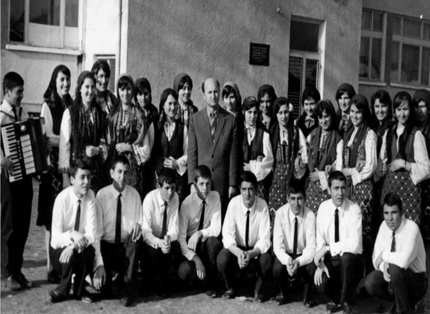

>   *Художественият състав, който създадох в професионалната гимназия в Разлог*

И в Разлог създадох голяма любов на учениците към учебната дисциплина, коята
преподавах. На повечето от тях литературата има стана любим учебен предмет.
Породиха се прекрасни взаимотношения между мен и тях. Много често някои от моите
ученици идваха в дома ми, където любезно ги посрещаше съпругата, която беше
учителка по математика. Понякога заедно с тях идваха и ученици от гимназията, в
която преподавател по български език и литература беше моят добър приятел поетът
Благо Прангов. Веднъж той ми каза:

– Приятелю, ти какво направи? Нашите и вашите ученици се побратимиха. И те си
създадоха добри приятелски взаимоотношения, каквито са нашите. Хубаво е, че
подражават и на нас.

Това побратимяване между учениците от двете училища стана още по-голямо след
като в продължение на няколко месеца преподавах и в гимназията. Замествах една
от колежките. Никога няма да забравя и будните ученици на колегите от
гимназията. Един от тях беше и сегашният д-р Велев. Директорите на двете учебни
заведения Рачев и Чолев спомогнаха много за добрата атмосфера в сградата, която
ползвахме заедно. А учителските колективи бяха като един.

Разлог е град, който е известен с ревнивото съхраняване на старите празници,
обреди и ритуали. А това богато поле на нашата душевност си остана един от
основните терени на моята научноизследователска дейност още като учител.
Участниците в самодейния колектив, който създадох, бяха моите най-добри
помощници в това отношение. С тях отбелязвахме с богати програми и онези
празници, които тогавашната комунистическа власт не тачеше, защото някои от тях
имаха ярко изразен религиозен характер. Нямаше празник в Разлог, на който
учениците от тогавашния техникум, а сега професионална гимназия, да не участват
със завидно подготвени рецитали и художествени програми.

Никога няма да забравя всеотдайността на директора Илия Чолев, който ръководеше
умело нашия сплотен учителски колектив и хубавия ред в цялостната му работа.
Само за една година се създаде богата материална база, която беше най-важното
условие за професионалната подготовка на учениците. Разбира се, неговият
помощник за постигане на всичко това беше Атанас Татарски, с когото бяха
неразделни. Оттогава се създаде и взаимната връзка и голямо уважение между мен и
двамата, с които запазихме нашите добри спомени.

Като учител в Разлог пак бях ухажван от училищните инспектори, които настояваха
за повече мои открити уроци, които да посещават колеги от различни училище в
окръга. Най-упорит в това отношение беше инспекторът Атанас Хаджиев, с когото
много често пътувахме заедно в окръга, за да проучваме и популяризираме опита и
на другите най-добри учители по български език и литература. Тези срещи бяха
изключително полезни за повишаване качеството на учебния процес.

Когато бях в Разлог, моят научен ръководител на дипломната ми работа проф.
Стойко Стойков на няколко пъти разговаряше с мен и ми предлагаше да стана негов
асистент в Софийския университет. По време на защитата проф. Владимир Георгиев,
проф.Кирил Мирчев и проф. Петър Динеков останаха удивени от изследването ми за
говора в родното ми село Либяхово. Те също ми казаха, че трябва да бъда готов за
вече откритото асистентско място при проф. Стойков. Беше ми неудобно да
кандидатствам, защото в Разлог бях посрещнат изключително любезно от директора
Илия Чолев и с голяма надежда да работим заедно за утвърждаването на новото
учебно заведение в този град. След това отново на няколко пъти бях подсещан от
научния ми ръководител да си подам документите за обявения конкурс. Не се реших
да направя тази стъпка и заради това, че при всяко подаване на документи се
правеше подробна справка за произхода ми. А нашето семейство беше вече молепсано
от комунистическата власт. Нямах сили повече да понасям нови незаслужени обиди и
страдания. Когато споделих с жена ми за отправената ми покана за асистент в
Софийския университет, тя не се съгласи. Беше ѝ вече натежало преместването ни
от едно на друго място. И тя се страхуваше, че Държавна сигурност пак ще тръгне
по стъпките ми. След няколко дни научих тъжната вест, че внезапно е починал моят
любим професор Стойко Стойков.

Всяка сутрин, преди да влезем в учителската стая, минавахме покрай канцеларията
на директора, който ни посрещаше с усмивка и не забравяше да ни пожелае
ползотворен ден. Така посрещаше той всеки учител и служител. С мъдрия му поглед
и благите думи ни зареждаше за ползотворна работа през учебния ден.

Една сутрин погледът на директора беше друг. Нещо го измъчваше и той се издаде:

&minus;Наско, ела да си поговорим в кабинета ми. Искам нещо да те попитам.

Бях сигурен, че Държавна сигурност не ме е забравила и е опънала ушите на
директора за съвсем явната негова закрила в цялостната ми дейност като учител.

Директорът се постара да скрие истината, но след това ми призна, че секретарят
Петър Бонков му показал цяла папка срещу мен, изпратена до него от районното
управление на Държавна сигурност. Той ме хвана за рамото и каза:

&minus;Едни работят със сърце, за да растат децата ни умни и спокойни, а други
    нямат сърца и разум и правят какво ли не, за да враждуваме помежду си.

И в Разлог беше изпратена от Държавна сигурност папката, в която на челно място
е било оперативното дело срещу мен като „вражески настроен“.

>   Погледнах директора в смутените му очи и казах:

&minus;Щом и тук Рашковци са решили да ми пречат на учителската работа, ще се
    разделим, за да си нямате неприятности с тях.

Директорът изпусна яда си и ми каза:

&minus;Това няма да стане. Тези ограничени хора този път ще си имат работа с мен.
    Имам сили да се преборя с тях. Освен това и от Градския комитет не приемат
    техните действия за разумни.

&minus;Не ми се сърдете, но сигурно не познавате тяхната жестокост и упоритост,
    когато преследват жертвите си – казах на директора.

Вечерта споделих с жена ми това, което научих от директора Илия Чолев. Тя
погледна децата и ми каза:

&minus;Горките, дали те някога ще научат колко проклети са тези, които винаги
    вървят по стъпките ни, за да ни измъчват.

Синът ми Красимир сякаш подразбра нещо и попита:

&minus;Тате, защо сте тъжни с майка?

А дъщеря ми Снежана се гушна в скута ѝ.

&minus;Няма нищо тъжно, сине. С майка ти говорим за къщата, която ще строим в
    Банско. Утре ще отидем да гасим вар и ще огледаме реката за хубав пясък.

Тези мои думи успокоиха децата и те легнаха да спят. А ние с жената продължихме
да умуваме как да се отървем от нашите вечни душмани, както ги нарече жена ми.

На следващия ден прочетох във вестник „Пиринско дело“, че в Благоевград се
открива Полувисш институт за подготовка на културно-просветни кадри. Имаше и
обява за преподаватели. Като поднесох вестника на жена ми, тя се усмихна и каза:

&minus;Този път те пускам да кандидатстваш. Дано в Благоевград нашите душмани не ни
    забележат.

Прочетох обявата, в която пишеше, че институтът подготвя кадри за народните
читалища като организатори на културно-просветната работа, ръководители на
самодейни колективи и библиотекари. Зарадвах се, защото още от ученик в моето
родно село читалището беше като мой втори дом. Там участвах и в театралните
представления, подготвени от моите учители. Обикновено на мен те даваха детските
роли, които според тях съм изпълнявал по-добре от самите тях.

След няколко дни споделих с директора, че съм подготвил документите да
кандидатствам в открития нов институт в Благоевград. Отначало той реагира остро,
като и този път не пощади с пиперливи думи хората от Държавна сигурност.
Уговорихме се, ако спечеля конкурса, да не ми пречи, а да ме освободи, въпреки
неговото уверение, че този път ще направи така, че моите душмани да мирясат.

Когато подготвях документите си, директорът ме повика в канцеларията си, подаде
ми подготвената от него характеристика и ми каза:

&minus;В нея съм написал това, което си направил за укрепване авторитета на нашето
    учебно заведение. Това е истината, а лъжите ги пишат само онези, които и аз
    никак не ги обичам.

Конкурсът в Благоевград мина успешно. От всички кандидати за обявеното място за
преподавател по Теория и методика на културно-просветната работа само аз бях
допуснат до втория кръг, на който се представих с отличен успех.

Когато колегите в Разлог научили, че ще ги напускам, започнаха да идват един по
един при мен. Питаха ме дали е вярно. Някои от тях бяха ходили при директора, за
да ме убеждава да си остана. Той беше казал за решението ми да напусна Разлог на
секретаря на ГК на БКП Петър Бонков И той се ядосал на онези, които без негово
знание се ровят в миналото на всеки „враг на народната власт“. Поиска да отида в
кабинета му, където беше и неговият заместник Никола Жегов. И двамата ме
уверяваха, че няма да позволят повече на никой да ми трови живота и работата.
Уверяваха ме още, че ще ми предоставят апартамент в новостроящия се блок до р.
Язо, близо до читалището.

След тази среща двамата партийни ръководители на Разлог бяха много любезни към
мен и не преставаха да ме убеждават, че няма да позволят на никого да се рови в
миналото на моя род. Една привечер Бонков ме срещна на площада в града и пред
придружаващите го ми каза:

&minus;Атанасе, де и аз да имам такъв род като твоя. Научих всичко за него. Гордей
    се, че си негов потомък. Остави ги нашите простаци от Държавна сигурност. Не
    им се ядосвай, когато пишат за теб, че си „вражески настроен“.

След това Бонков се откъсна от неговата група и сподели с мен, че като правел и
своя справка за моята „вражеска дейност“, разбрал, че повечето доноси срещу мен
идвали и от двама братя Кутреви от нашето село, които бяха „важни клечки“ в МВР.
Оказало се, че самият той имал далечна роднинска връзка с жената на техен чичо,
която обаче била според него добра жена. Тя пък имала роднински корени с прадядо
ми поп Стоян.

Преди да напусна Разлог, целият учителски колектив ми направи вълнуващо
изпращане на м. Предел, при Татарската чешма. Никога няма да забравя топлите
думи на тези, с които поставихме основите на Професионалната гимназия в Разлог.
Прегръщахме се и пълнехме очите си с чисти сълзи. Отрупаха ме със сувенири, а с
подарения от всички колеги хубав плат дядо Илия ми уши нов костюм, с който се
явих на първия учебен ден в Полувисшия институт за културно-просветни кадри в
Благоевград.

## 19. В Института за подготовка на културно-просветни кадри

Когато се преместихме в окръжния град, двете ми деца Красимир и Снежана, които
бяха ученици, се зарадваха много, макар че отначало цяла година живеехме на
квартира в горния край на града в една стая у семейство Стоицови, близо до река
Бистрица. След няколко месеца жена ми роди третото ми дете Николай. И тук ни
беше трудно, защото отначало цялото семейство издържах само аз, но в семейството
ни имаше много топлина, която ни правеше щастливи.

В Полувисшия институт имаше специалности за ръководители на културно-просветната
работа, театралната, музикалната и хореографската самодейност, както и по
библиотечното дело. Бях в Катедрата по културно-просветна дейност като старши
преподавател по основната дисциплина „Теория и методика на културно-просветната
работа“. Студентите в отделните специалности бяха все младежи и девойки, които
имаха изявено творческо отношение към проблемите на културата и просветата. С
тях се работеше прекрасно. Бях курсов ръководител на студентите от театралния
профил. Само за една година спомогнахме за разнообразяването и обогатяването на
културната дейност в Благоевград. Опитът ми като учител, свързан с провеждането
на театрализирани форми за възпитание с учениците, ми помогна. На сцената в
градското читалище, а много често и на сцената на градския театър, представяхме
пред гражданите рецитали, театрализирани тематични вечери и инсценировки,
свързани с важни събития от историята на България. Театрализираната тематична
вечер портрет „Аз не живея, аз горя“, посветена на Пейо Яворов, беше представена
няколко пъти заради изключително големия интерес на горноджумайци към великия
български поет и участник в македонските революционни борби.

>   *Със студентите от театралния профил в Полувисшия институт за
>   културно-просветни кадри в Благоевград отворихме нова страница в културния
>   живот на града. На снимката отляво е Пламена Гетова, известната българска
>   артистка, която беше моя студентка*

На 16.10.1971 година се проведе заседание на Катедрата по културно-просветна
работа за определяне на преподавател, който да бъде изпратен на специализация в
Института по културата в Санкт Петербург. Бях приятно изненадан от това, че
всички колеги предложиха мен, заради моята активна и задълбочена преподавателска
работа. Колегата Иван Кантуров, след като ме подкрепи, шеговито каза:

&minus;Вярвам, че колегата Попов може да „специализира“ по-добре своите руски
    колеги със своя натрупан опит в нашия институт.

    Партийният секретар го погледна със свити очи и почти просъска:

&minus;Никой не може да бъде по-добър от съветските колеги.

След дълго проучване чак през 1975 година бях изпратен за 10 месеца на
специализация в Петербургския институт по културата, заедно с колежката Росица
Йорданова от Варненския институт за подготовка на културно-просветни кадри. И
двамата бяхме безпартийни, но ни смятаха за най-добрите преподаватели, които ще
се представят достойно в чужбина.

## 20. В Петербург научих истината за прехвалената съветска действителност 

Никога няма да забравя, че когато самолетът закръжа над Петербург, една от
пътничките се просълзи и възкликна:

&minus;Мой чуден Петербург, кой ти смени хубавото име?

И запя песен, с която възхваляваше старата столица на Русия. Запяха и някои от
другите по-възрастни пътници. Гледах просълзените им очи и се зарекох и аз да
назовавам града със старото му име, който е бил винаги културен център на Русия.

Настаних се в хотел „Ладога“, където прекарах две седмици. Всяка сутрин тръгвах
към института, където имах срещи с колеги от различните специалности и посещавах
техни лекции. Всички бяха много любезни и бързаха да ме поканят на гости. Имах и
час за „усъвършенстване“ на руския език, който обаче много често отминавах,
заради което младата преподавателка ми се разсърди. Веднъж поспорихме за руската
азбука, която според мен е заимствана от нашата като вариант на кирилицата.
Колежката отначало не се съгласи, но след това „под сурдинка“ ми призна:

&minus;Баща ми е академик. Той е езиковед. И той твърди същото, но аз не мога да го
    кажа официално, защото може да ми изстине мястото.

Преди да дойда в Петербург, вече работех още преди една година по темата ми за
кандидатска дисертация. С нея бяха свързани и някои от публикуваните от мен
студии и статии. Към тях руските колеги проявиха голям интерес. Една сутрин
телефонът ми в хотел „Ладога“ прозвъня и чух непознат глас:

&minus;Вие ли сте другарят Попов?

&minus;Аз съм, а Вие кой сте? – попитах непознатия.

&minus;Безпокои ви ректорът на Института по култура проф. Зазерский. Вие имате
    научи разработки с много прецизно използвани термини, които внасят яснота
    както в теорията, така и в практиката на културно-просветната дейност. Искам
    да се срещнем и поговорим за съвместната ни работа. Изпращам лека кола, за
    да ви вземе. Очаквам ви в кабинета си. Разбрахме се, нали?

&minus;Ще дойда ! – отговорих.

В кабинета на ректора заварих и неговите заместници. Там бяха и проф. Димитрий
Генкин, ръководител на Катедрата за масови представления на открито, както и
ръководителят на Катедрата по културно-просветна работа проф. Абрам Соломоник.
Професор Генкин, известен като един от водещите руски специалисти по масовите
театрализирани форми, ме похвали, че моите анализи са задълбочени и подкрепени с
убедителни научни тези. Предложиха ми да бъда зачислен на свободна аспирантура.
Професор Светлана Иконникова, която завеждаше Катедрата по естетика, настояваше
да бъда зачислен към тяхната катедра, но професор Генкин прояви по-голяма
упоритост и останах в катедрите по масови представления на открито и
културно-просветна работа.

След срещата в кабинета на ректора, професор Иконникова ме хвана под ръка и ми
каза:

&minus;Ела утре в моя кабинет, за да те запозная с големите учени на Петербург.
    Някои от тях вече знаят за теб все хубави неща от нас.

През следващия ден се запознах с професорите Моис Каган, Лев Н.Коган, В.К.
Скатерщиков, А.И. Новиков и други изтъкнати руски учени в областта на
философията, естетиката, психологията, социологията и други науки. Често
присъствах на техните ползотворни за мен срещи, на които се дискутираха актуални
проблеми в областта на науките, на които те бяха водещи личности. Направи ми
впечатление, че някои от тях бяха крититични към тогавашната тяхна
социалистическа действителност, която пък в България се възхваляваше навсякъде.

Преместих се в хотел „Смольнинская“, където имаше добри условия за работа,
свързана с подготовката на дисертацията ми. Вече не бях задължен като
специализант да посещавам лекции при колегите и да си губя времето при
преподавателката по руски език. Двата дни сряда и петък бяха определени за
творчески разговори с моя научен ръководител проф. Генкин и други преподаватели
от катедрите по културно-просветна работа, естетика и режисура на масовите
представления. Хубави срещи имах и с водещи университетски преподаватели от
Литва и Естония, които често идваха в Петербург.

Направи ми прятно впечатление, че колегите от Петербургския институт по
културата проявиха изключително голям интерес към българските читалища, за които
обичаха да им разказвам. Когато научиха от мен, че те са създадени още от
времето на турското робство като самобитна българска институция, която е
изпълнявала учебно-просветителска и самодейна функция, и че в читалищата е имало
библиотеки и различни самодейни състави, помолиха ме да изляза с лекция пред
студентите от няколко специалности. Никога няма да забравя с какъв интерес ме
слушаха студентите и колко много въпроси ми поставяха, с които искаха да научат
всичко за богатата и разнообразна дейност на българските читалища, за които
слушаха за първи път.

След няколко дни бях повикан в Ректората и помолен да подготвя още няколко
лекции пред студентите за традиционната българска празнично-обредна система. С
неописуемо голямо внимание и вълнение студентите от тетралния, хореографския и
музикалния факултет слушаха лекциите ми за старинните български календарни и
семейно-битови празници, чрез които нашият народ е развивал и обогатявал своята
възпитателна и културна дейност.

След внимателно проучване и представяне на всички мои публикации в България,
ръководството на Института по културата ме зачисли на свободна аспирантура. След
това се явих на кандидатския минимум, който взех с отличен успех.

Един ден, заедно с доц. Лидия Сургинене, преподавател в Клайпеда, при мен
дойдоха и всички студенти от Литва, които се учеха в Петербургския институт.
Срещата, която беше в една от институтските зали, остана незабравима за мен.
Студентите ме поздравиха с незабравими литовски песни. Оттогава винаги, когато
Лидия идваше в Петербург, не забравяше да води със себе си и моите приятели
студенти. На една от следващите срещи те не скриха пред мен, че Литва недолюбва
Съветския съюз, а и обратно. Това научих и от Лидия, която на една вечеря,
заедно и с други колеги, вдигна наздравица за мое здраве и пред всички каза:

&minus;Обикнахме се с нашия приятел от България, защото той е истински български
    патриот, от когото научихме много за хубостите на неговата страна и нейната
    печална, но славна история. Той винаги вдига наздравица за нея, а не за
    „Съветско-българската дружба“, както правят някои от другите „гости“ от
    България.

Тези думи не смразиха погледите на другите, а забелязах задоволителна усмивка по
лицата им. Радвах се, че попадам сред „свои“ в Петербург. Такива се оказаха и
приятелите ми от Естония, които събра веднъж в квартирата си моята колежка Клара
Лехмус. Първия тост те вдигнаха в памет на братчето ми Китан, който загина при
тежка катастрофа в Благоевград. За моята тъга бяха научили от Клара. Отново
разговорите ни не бяха за „великия“ Съветски съюз, а за съдбата на България,
Естония и някои от другите република, от които бяха гостите. Майката на Клара,
която беше подготвила вечерята, се доближи до мен и разтвори голям пакет.
Поднесе ми като подарък чуден самовар от Талин, в който продължавам да си правя
чай и досега.

Веднъж Клара Лехмус ме попита:

&minus;Атанасе, ти познаваш ли Марко Семов?

Признах на Клара, че не зная всичко за него. Бях слушал, че е човек „пенкелер“,
т.е. специалист по всичко, но знаех със сигурност, че от „висшите етажи на
властта“. Бил е личен секретар на Пеко Таков, редактор на отдел „Пропаганда“ на
в.“Работническо дело“, а след това и заместник главен редактор на печатния орган
на БКП и главен редактор на Българската телевизия.

&minus;Пази се от него! Вие двамата сте много различни – ми каза Клара.

Когато се прибирах в хотела, все решавах да се откъсна напълно от гостуванията,
които ми предлагаха моите приятели в Петербург. Приемах само онези, които ми
отнемаха съвсем кратко време през деня. А вечер, до късно през нощта се
усамотявах в стаята и отново станахме неразделни с пишещата ми машина, която си
носех от България. Продължавах задълбочено да работя върху кандидатската си
дисертация. Директорът на хотела разказваше на всички, че по цели нощи щракам на
машината и не приемам никакви гости. Така беше наистина, не приемах гости в
хотелската стая, защото ми беше казано, че в нея всичко се подслушва и заснема
от хората на КГБ.

Тогава българската Държавна сигурност не оставяше на мира всеки, който пътуваше
в чужбина. Вървяха по стъпките ни навсякъде, едни върбуваха, а други като мен
навсякъде преследваха като „врагове на народната власт“. Нас не ни допускаха на
Запад, защото се страхуваха да не останем там, но не ми се искаше да повярвам,
че и когато сме в т.нар. социалистически страни могат да вървят по стъпките ни.

Тези размисли ме натежаваха и понякога възпираха устрема ми в работата, свързана
с окончателното завършване на дисертацията ми. Една привечер бяха прекъснати от
телефонния звън в стаята ми. Чудех се дали да вдигна слушалката. Вече имах обица
на ухото си, че трябва да внимавам с кого разговарям и какво споделям с него.
Беше гласът на проф. Светлана Иконникова. Успокоих се.

&minus;Атанасе, Вадим ще намине да те вземат с колата от хотела. Направила съм
    хубава вечеря. Искам да бъдем заедно и да си поговорим.

Още бяха зашеметен от тъжните размисли и забавих отговора.

&minus;Чуваш ли ме, Атанас? – повторно ме попита Светлана.

Престраших се и отговорих:

&minus;Благодаря за поканата, но...?

&minus;Какво но? Идваш, нали?

&minus;Добре, ще го чакам! – взех окончателно решение.

Проф. Светлана Иконникова, освен всепризнат петербургски учен, беше и прекрасна
домакиня. По време на вечерята тя ми каза, че към моето изследване проявяват
голям интерес колеги и от нейната катедра по естетика, които искат да се
срещнем. После разговорът ни продължи за естетическите възможности на
българските традиционни празници, каквито според нея не се открояват в руската
празнично-обредна система.

&minus;Духовно богат народ сте, Атанасе, но защо все някой ви тъпче. Не знаете как
    да се браните. Много сте послушни и на нашите партийни ръководители.
    По-послушни сте даже от самите нас.

Като чух това от Светлана, погледнах към Вадим. Той кимна с глава и тихо каза:

&minus;Така е, не се сърди! Светлана казва истината.

Искаше ми се да изригна и да разкажа повече за тази послушност на българските
партийни ръководители, на които като залък в устата им беше винаги „братската
любов“ към КПСС. Преглътнах страшните думи, които напираха да излязат от устата
ми. Макар и при създадена много топла атмосфера от домакините, все още не можах
да се откъсна от това, което научих същия ден, че и моята стая в хотела е
окичена с подслушвателни и наблюдателни уреди.

По едно време Светлана разбра, че мислите ми бягат и на друго място. Сякаш ги
прочете, защото ме помоли да ѝ кажа каква е обстановката в хотела и как се
отнася персоналът към мен. Неволно погледнах към тавана, а след това отместих
погледа си към една от стените на холската стая, на която забелязах същата малка
желязна кутийка, каквато имаше и в моята стая в хотела. Вадим се сети защо
поглеждам натам и ми махна да си мълча.

През това време Светлана излезе, за да донесе вечерята, която постави на масата.
Помолих я да поставим в грамофона плочата, която им бях донесъл като подарък. В
нея бяха записани песните на ансамбъл „Пирин“. Всичко у мен изведнъж се промени
и запях. Вадим ме прегърна и започна да припява, доколкото можеше. Светлана
сияеше от радост и доволство, че в нейния дом се слушат най-хубавите пирински и
родопски песни.

Преди да си тръгна, Вадим ми каза:

&minus;Ще те изпратя до хотела, но пешком. Искам да се разходим.

Хотелът беше близо до улица „Московска“, където живееше семейство Иконникови.
Когато излязохме навън, Вадим ме прегърна през рамото и тихо ми прошепна:

&minus;Е, тук вече е напълно безопасно. Няма кой да ни подслушва. Сега можем да си
    кажем всичко. Ти за твоята страна, която скоро ще стане наша република, а аз
    – за нашия „велик“ Съветски съюз.

Разбрах подтекста в думите на Вадим, но премълчах да му го кажа. Той обаче
започна направо.

&minus;Атанасе, да си призная пред теб, ще бъда напълно откровен, защото вече със
    Светлана те познаваме. А и нещо друго – ти не си член на вашата
    комунистическа партия, което ни харесва много, защото не си обременен от
    нея.

Седнахме на една пейка и Вадим разтвори сърцето си, за да ми каже това, което не
бях слушал от руснак.

Започна с разказа за баща му, който е изчезнал безследно през години-

те на сталинския режим. Каза ми, че и до ден днешен той не зная къде и как е
разстрелян. В градчето им дошла черна камионетка с голяма червена петолъчка. В
нея прибрали най-будните. Измежду тях бил и баща му. След смъртта на Сталин го
реабилитирали, но болката останала неизлечима. Оттогава и Вадим тръгнал по новия
си път.

След този разказ за семейната трагедия на Вадим, чух и за първи път думи за
Брежнев, за които в България, ако бяха изречени, можеше да се изчезне безследно,
или пък да се гние я в затвора, а и да те изпратят в някой от още незакритите
лагери. Според моя приятел държавният и партиен ръководител на „великия“
Съветски съюз бил вече неадекватен не само заради влошеното му здравословно
състояние, но и заради страха от това, което клокочеше отдавна във
взаимоотношенията между 15-те съветски републики.

Исках да попитам Вадим дали знае, че още при Никита Хрушчов през 1963 г. Тодор
Живков открито му предложи България да стане 16-а република на Съветския съюз, а
само преди две години отправи същата молба и към вече „неадекватния“ Леонид
Брежнев. Моят руски приятел обаче ме изпревари и ми каза:

&minus;Зная и за мераците на вашите партийни ръководители да се напълно побратимим
    като станете наша съставна съветска република. Що за непредведливост? Когато
    ние вече започваме да се разрушаваме, вие искате да дойдете при нас. Тодор
    Живков иска да бъдете нашата нова съветска република.

Гледах Вадим направо в очите и не исках да повярвам в това, което слушах. Но той
отново постави ръката си върху моето рамо и отсече:

&minus;Атанасе, този мерак на Тодор Живков е пагубен за България! Време е не да се
    слеете с нас, а да избягате от нас.

Сега вече напълно разбрах защо Вадим настояваше да ме изпрати пешком до хотела.
Тук на пейката в градинката, където беше безлюдно, нямаше кой да ни подслушва
или записва.

## 21. На гости при сина на осетинеца Дудар Караев участник в Руско-турската война

Една сутрин, беше през ноември 1975 г., телефонът в стаята ми позвъня
продължително дълго. Бях тръгнал към института, но се върнах. Чух глас, който
беше респектиращ:

&minus;Добро утро, Атанасе! Аз съм писателят Георги Николаевич Караев, син съм на
    Дудар Караев, участник в Руско-турската война. Каня те довечера на гости,
    искам да си поговорим. Ще приемеш ли поканата ми? Ще дойдат да те вземат от
    хотела.

Бях приятно изненадан. Приех поканата без колебание.

Вечерта Георги Николаевич ме посрещна в подредения си кабинет, заедно с Елена
Николаевна, която беше немалко по-млада от него. А той беше надминал вече своята
седемдесетгодишнина. Когато оставих букета с рози върху масата, помоли Елена да
ги постави на мястото на вече увехналите, които бяха във вазата на голямата маса
с луксозни столове, между които моят беше най-висок. Такъв бил осетинският
обичай, гостът да бъда на по-високо място на масата от домакините. Георги
Николаевич взе вазата с увехналите рози и ми каза:

&minus;Тези рози са от твоята родина, от България. Пазя ги, защото са расли на
    богата земя, от бога дадена.

И започна да ми разказва познатата притча за това как господ отначало ни
забравил, но после събрал всичко най-хубаво от раздаденото на другите и го
изсипал на българска земя.

&minus;Добре дошъл от хубава България и наздраве за теб и твоето семейство!

С тези думи започна първия ни тост Георги Николаевич, който сякаш искаше още
нещо да ми каже, но строгите му очи изведнъж овлажняха. Стана, приближи се до
голямата библиотека, която опасваше двете стени на хола, и извади от лавицата
дебела книга със зелени корици. Под заглавието „На войне Дунайской“ бе
отпечатана цветна снимка на величествения паметник на връх Шипка. В тази
документална книга, написана от М. Цаллагов, е публикуван очеркът „Охотник Дудар
(Николай) Караев“. Георги Николаевич намери плик между страниците на книгата,
разтвори го и ми подаде молбата на баща му до генерал Столетов, която е получена
на 28. 04.1877 г. и заведена под № 150. На нея прочетох следното: „Желаю
поступить в число охотников, Вашему превосходителство, болгарских дружин. Имею
чест покорнейше просить, Вашего превосходительство, об зачислении меня в число
токовых. Осетин Караев„

След изпращането на молбата Дудар стяга коня си, препасал двата кинжала на
пояса, и се отправя към Кишинев. Тук постъпва в ядрото на българското
опълчение. На 18 май 1877 г. на лагерния площад покрай Плоещ, заедно с близо
8000 българи, повечето от които са бивши ратаи, орачи, копачи, занаятчии,
народни учители, хора без подслон и покрив, под Самарското знаме е и младия
осетинец Дудар Караев. От този ден той тръгва по огнения и кървав път на
борбата за освобождението на България. Отначало обикновен войник, а след
това е произведен с първия офицерски чин пропорчик. Участва като герой в 82
атаки срещу турските войски. За проявен необикновен героизъм е награден два
пъти с Георгиевския кръст. Получил е и почетното оръжие – шашка – сабя,
която след това се запазва в историческия музей в София.

Синът на осетинския герой започна своя разказ за подвизите на баща си по време
на Руско-турската война. На няколко пъти той е раняван. Конят му не тръгвал на
бой без него. Затова осетинецът бързал да оздравее. И отново да се хвърли в люта
схватка с врага. Минал е през огъня на толкова страшни битки и накрая оцелял, за
да разказва дълго на децата си за страшната война в България. Още веднъж
погледнах към портрета. Георги Николаевич сякаш прочете недоумението ми и каза:

&minus;Не всичко преживяно от баща ми е описано в книгата. Често ми разказваше
    случки от войната, които тук са отразени. Една от тях никога няма да
    забравя, защото при нея баща ми за десети път се разминал със смъртта. За
    тази случка ми напомня често пистолетът, който е окачен под портрета.

И синът на Дудар започна да разказва следния епизод от бойния път на баща си.
След боя при Стара Загора руските части започнали да се оттеглят на север към
Казанлък. Настъпващият неприятел се отдава на грабеж и безчинства. Женските
писъци и издигащите се пламъци във въздуха свили сърцето на осетинеца. Пришпорил
коня си и се върнал невидимо от турците назад. В горния край на селото, което
било подпалено и се топяло в горещите пламъци, Дудар забелязал уплашено до смърт
момченце, което показвало с треперещата си ръка сестра си. Разпасан башибозук,
след като се гаврил с нея, късал косите ѝ. Притъмняло пред очите му. Опънал
юздите на коня си, извадил сабята и само след миг турчинът лежал съсечен на
земята. Заобиколилите го други турски войници завайкали от страх и побягнали. В
същото време от съседната горяща къща изскочил друг башибозук, който се примерил
и стрелял. Но конят на осетинеца изпреварил – куршумът минал покрай дясното ухо
на Дудар. Турчинът побягнал и завикал за помощ. Осетинецът не го изпуснал от
очите си. Настигнал го и и забил сабята си в гърдите му. Навел се от коня и
успял да вземе пистолета, който още димял от изстреляния куршум.

Същият пистолет сега висеше покорно под портрета на Дудар Караев, който
завещал на сина си да го пази, за да му напомня за геройството му при
спасяването на младата руса българка.

Бяхме вече към края на разговора, когато Георгий Николаевич запя тиха осетинска
народна песен. В нея се разказваше за смелия и юначен Дудар.

Преди смъртта си Дудар Караев поръчва на сина си:

&minus;Георги, сине! Не забравяй България. Тази хубава страна заслужава дълбок
    поклон. Там всяка педя земя е свято място, напоено с много сълзи и пролята
    кръв.

След като чух тези думи, хвърлих поглед към някогашната опълченска униформа на
Дудар Караев, заедно с бойното му снаряжение. Тук видях и пистолета му. Не се
стърпях и попитах дали мога да ги разгледам отблизо.

Генералът постави ръката си върху моето рамо и каза:

&minus;Ела, ела да пипнеш с ръцете си униформата на баща ми, който винаги ми
    говореше с любов за България.

На стената беше закачен и кинжалът на Дудар Караев, към който погледнах, а синът
му побърза да ми каже:

&minus;Шашката вече подарих на вашия исторически музей. Тя му е дадена като подарък
    от генерал Столетов, който бил началник на българското опълчение при боевете
    на Шипка. Сигурно ще подаря и тези бойни реликви преди да усетя, че свършват
    дните ми, но засега не мога без тях. Те са нашата семейна гордост.

Мисълта на сина на Дудар Караев беше ясна, а думите му покоряващи със своята
строгост, от която извираше скрита топлина.

Бях впрегнал съсредоточено мислите си, когато слушах следващите епизоди от
разказа на сина на Дудар Караев, който в боя при Шипка бил със собствения си
кон. Веднъж той го дава на своя командир Н. Калитин, който бил ранен. За да го
спаси от турците, които се нахвърлили върху него, Дудар извадил шашката и
кинжала и посякъл шестима от турските войници. С такава храброст Дудар спасил и
селянка от старозагорските села. Турските войници искали да я изнасилят пред
малкото ѝ дете, но безстрашният осетинец извадил сабята и ги посякъл.

Когато отново седнахме на вече подредената за вечеря маса от Елена Николаевна,
синът на Дудар не забрави да ми разкаже и за познанаството на баща му с капитан
Петко войвода и участието му в Сръбско-турската война през 1876 г. А след хубаво
подготвената осетинска гозба, заедно разгледахме богатата библиотека, на която в
специални рафтове бяха подредени книгите, които беше публикувал синът на Дудар
Караев, неговите научни публикации, някои от които са посветени на
Руско-турската война, както и написаните от него повести и разкази.

Изведнъж Георгий Николаевич се сепна за нещо. Порови по библиотеката и намери
стар албум от снимки.

&minus;Атанасе, ето, виж тази снимка! Баща ми казваше, че е от селата под връх
    Шипка.

Наистина снимката беше на едно от селата в подножието на планината, покрай
Казанлък. На нея се виждаха запазени от войната с турците хубави къщички с
широки дворове. Направил я военен руски фотограф.

&minus;Баща ми разказваше колко хубави села е видял, изоставени от своите стопани,
    подплашени от войната – продължи разказа си Георгий Караев.

Дудар често споделял със своя син недоумението за това, че действителността в
тогавашна България е била представена от руското правителство и петербургския
печат като ужасяваща, а той я видял съвсем друга. Той не е срещнал бедни като
руските мужици, а спретнати и работливи селяни, които не посрещали руските
войници като освободители, а като виновници са нарушване на техния спокоен
живот, за разрушаване на хубавите им къщички, за опустошаването на посевите по
грижливо наглежданите ниви и градинки. Ограбването на всичко, което имал
предостатъчно българският селянин, започнало след войната, която Дудар наричал
разорителна. Тогава започнали и жестоките убийства от турската армия.

&minus;Атанасе, баща ми казваше, че нито те тогава, а нито и ние сега знаем цялата
    истина за политиката на руското правителство по време на войната с
    османската империя. Но за това нашата партия не иска да се говори, защото ще
    прегазим „българо-съветската дружба“.

Това, което чух от сина на Дудар за „разорителната Руско-турска война“ го бях
чувал още като дете и от баща ми, който ми разказваше много за вината на Русия и
някои от нашите страдания по-късно. За първи път научих от татко, че през 1913
година тя е насъскала Гърция и Сърбия и заптисала българското правителство,
поради което държавата ни загуби Беломорието, Вардарска Македония и Тракия.

Когато се прибрах в хотела, съпроводен от Георий Караев и Елена, мислите ми още
шетаха в далечното минало, свързано с Руско-турската война, в която осетинецът
Дудай е видял хубостите на България, заедно с ужасите от войната, но сигурно все
още не е проумявал каква е била истинската политика на руските управници.

Зимата в Петербург дойде през началото на месец декември с дълбока снежна
покривка. Затворих се в хотелската стая и продължих работата си върху
дисертацията. Приятелите обаче продължаваха да ми звънят и настояваха да ми
покажат и зимната премяна на града. Оправдавах се с неотложните ми
научно-изследователски задачи. Но един ден моят приятел Володя Аксьонов
настояваше упорито да му отида на гости, за да ме води след това през нощта на
риболов по Нева. Не му повярвах, че през зимата може да се ловува, затова се
съгласих. След хубавата вечеря, която беше подготвила жена му, известна лекарка
в града, Володя ме погледна и каза:

&minus;А сега тръгваме, нали? Подготвил съм ти екип и въдица.

Все още мислех, че се шегува, но на вратата се позвъня и се показаха двама от
неговите приятели, които държаха в ръцете си въдици. Тръгнахме по никое време
през нощта. Реката бе закована с дебел лед, който обаче Володя и двамата му
приятели разбиваха, за да се направи дупка, под която щеше да пуснат въдиците.
Ококорих очи, когато видях, че една след друга се поставяха едри риби в
кошницата. Върнахме се в апартамента на Володя по никое време. Докторицата ни
чакаше. Беше подготвила тигана за пържене на рибата. Нямаше как, тази нощ
останах да преспя у Володя.

От следващия ден вече стриктно изпълнявах програмата, която си бях подготвил за
седмицата. През повечето дни бях още от рано сутринта в централната библиотека
М.Е Салтиков-Щедрин, основана през 1795 по указание на руската имперетрица
Екатерина Втора. Тук закусвах, обядвах, а понякога и вечерях, защото бяха
създадени условия за работа и отдих на читателите.

Моите търсения в богатия книжен фонд на централната библиотека М.Е.
Салтиков-Щедрин бяха свързвани с изследвания на традиционната руска култура,
по-специално на празнично-обредната система. Вечер преглеждах всичко, което бях
донесъл от България, свързано с дисертацията ми, която подготвях и съпоставях
нашите с руските празници, обреди и ритуали. И двете страни си имат своята
оригинална, специфична празнично-обредна система. Нашата обаче се оказа
по-богата по отношение на нейните познавателни, възпитателни и развлекателни
възможности.

В това се убедиха от доклада ми и колегите от Института по културата на тяхната
научна конференция през март 1976 г., където анализирах неповторимите средства,
методи и форми, използвани в традиционната българска празнично-обредна сстема.

На конференцията присъстваха изкуствоведи и етнографи и от Москва, които
поискаха специална среща с мен, а след няколко дни получих покана за научна
конференция в Москва. Не можах да присъствам на нея поради това, че трябваше по
спешност да се прибера в България поради заболяване на съпругата ми.

## 22. Неуспешно предложение да защитя кандидатската ми дисертация в Петербург

След конференцията ректорът на Института по култура проф. Е.Я. Зазерски,
придружаван от проф. Светлана Иконникова и проф. Димитрий Генкин, ме поканиха на
разговор, при който отново настоятелно ме помолиха да се съглася защитата на
кандидатската ми дисертация да бъде при тях, а не в България.

Светлана Иконникова ми каза направо:

– Атанасе, скоро бях в твоята страна и ми направи неприятно впечатление, че
вашите изкуствоведи са далеко от педагогиката. Но педагозите ви пък са отлъчили
тяхната наука от изкуството. Те са започнали да подготвят пионерски и дружинни
ръководители, но стоят далеко от всички процеси в областта на изкуството и
социалния живот, които имат ярко изразени възпитателни възможности.

Съгласих се, защото наистина у нас педагогическата подготовка на студентите в
тогавашния Софийски университет беше съвсем ограничена преди всичко в областта
на дидактиката и новите специалности за пионерски и комсомолски ръководители. В
едно от писмата, което получих от проф. Стефан Чернев, той също ме уверяваше, че
от педагогическия факултет няма да се намери рецензент на дисертацията ми,
защото тя изисква по-широки знания както в областта на изкуството, така и по
етнографските науки. През тези години силното политизиране на подготовката на
педагогическите кадри попречи да се обхване дейността в нашите читалища, която
има ярко изразен педагогически характер. Повечето от тогавашни педагози бяха
отписали нейните образователни и възпитателни аспекти. Именно този пропуск в
обекта и предмета на педагогическата наука ми даде основание да кандидатствам за
преподавател в Института за подготовка на културно-просветни кадри.

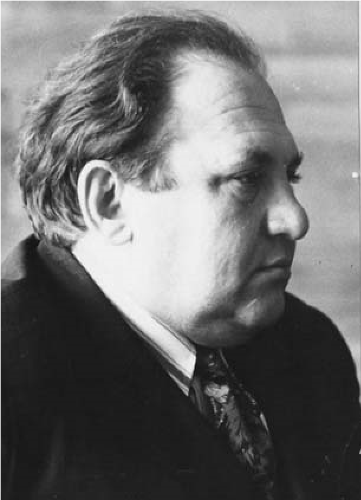

>   *Проф. д-р Димитрий Генкин, ръководител на Катедрата по културно-просветна
>   работа в Института по културата в Петербург*

През пролетта на 1976 година започнах усилена подготовка за кандидатския минимум
и завършване на дисертацията. Тези задачи бяха определени от ръководството на
Института по културата като основни в програмата ми. От 4 до 15 юни се явих на
изпити по философия, педагогика и културно-просветна работа, които взех с
отличен успех (вж. Удостоверение № 912 1 1976 г.) На 25 юни на обединено
заседание на катедрите по културно-просветна работа и масови представления бе
обсъдена кандидатската ми дисертация на тема „Мястото и ролята на
театрализираните форми при възпитанието“. Заседанието се ръководеше от проф.
А.Г.К.Соломоник. След моята концепция за изследването и основните резултати от
него бяха прочетени реценции от проф.А.И. Новиков, доц. Маргарита Кузмина и доц.
Володя Аксенов, които дадоха висока оценка на дисертацията ми. Научният ми
ръкодител проф. Д.М. Генкин подчерта, че дисертацията ми е оригинално научно
изследване, което има комплексен характер с ярко изразени научни приноси не само
в педагогическата наука, но и в областта на културата. След направените други
изказвания от участници в заседанието беше прието решение, в което е написано:
„Научната новост в изследването и актуалността на изследвания проблем;
репрезантивността на данните и добрата разработка на методиката, в резултат на
което е налице достоверност и обоснованост на направените изводи и практическото
значение на дисертацията за подобряване на възпитателната работа (вж. Протокол №
16 от 25 юни 1976 г.).

Направено бе предложение да бъда допуснат до защита на кандидатската дисертация.

По официален ред ръководството на Института по културата изпрати писмо до
Председателя на Комитета за изкуство и култура и директора на Института за
културно-просветни кадри в Благоевград, в което се прави висока оценка на
специализацията ми и предаването на моя богат личен опит като педагог, който бе
внимателно проучен и използван от моите руски колеги. „Считая, что программа
стажировки ст.преподавателя А.К.Попова полностью вьполнена, кафедри специално
отметили високий уровень ответственности А.К.Попова, показавшего себя опитни
културопросветчиком, ерудированним иследователем, хорошим организатором (вж.
Писмо № д 77 от 5 юли 1976 г.).

Още на 8 април 1976 г. зам.-председателят на Комитета за изкуство и култура
Любен Василев изпрати писмо до Президиума на Висшата атестационна комисия, в
което пише: „ Като имаме предвид, че в България няма научен съвет по тази
специалност (става дума за културно-просветната работа), а нуждата от
високоспециализирани преподавателски кадри и специалисти за културно-просветната
дейност и за институтите, които подготвят кадри е особено осезателна, Комитетът
за изкуство и култура Ви моли настоятелно да направите необходимото за
зачисляване на свободна аспирантура и защита на научната степен „кандидат на
педагогическите науки“ в Ленинградския държавен институт по културата“.

С писмо № А – 68 – 725 от 14 април 1976 г. председателят на Висшата атестационна
комисия акад. Л. Илиев дава следния отговор на молбата на зам.-председателя на
Комитета за изкуство и култура Любен Василев: „Съобщаваме Ви, че въпросите
относно зачисляването на български граждани за аспиранти в СССР са от
компетентността на Комитета за науката, технически прогрес и висше образование“.

Ето пък отговора на Комитета за науката, техническия прогрес и висше
образованието, даден на 21 април 1976 г.: „Др. Попов може да разработи
дисертация по интересуващите го проблеми по самостоятелен път, но за да защити,
е необходимо да поиска разрешение от ВАК при МС на НР България“.

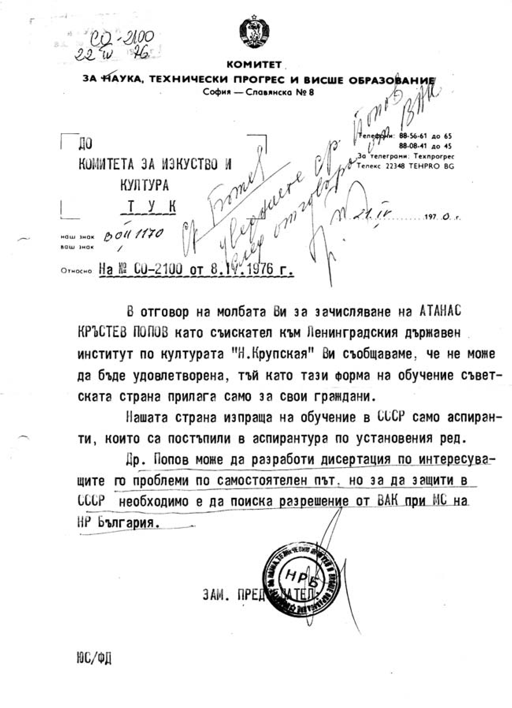

От взаимно изключващите се отговори на двете институции става ясно, че те нe
решават този въпрос, защото тяхната дейност се ръководи и контролира от висшите
партийни органи, където са списъците на онези, които безприпятствено могат да
защитават дисертации, където си поискат.

Ректорът на Института по културата проф. Е.Я Зазерский изпрати писмо до
председателя на Висшата атестационна комисия в България, в което предлага
защитата на кандидатската ми дисертация да бъде направена в Специализирания
научен съвет, който функционира в института и има право да дава научната степен
кандидат на педагогическите науки по специалност 130005 „Културно-просветна
работа“ (вж. Писмо № Д 76/5 юли 1976 г.). Комунизираната Висша атестационна
комисия не отговори на молбата на ректора на Инсттута по културата в Петербург
проф. Е.Я. Зазерский. Основната причина за това е, че аз съм безпартиен и не съм
включен в списъка на превелигированите номенклатурни кадри на ЦК на БКП, които
се зачисляваха формално като дисертанти в бившия Съветски съюз и защитаваха „за
бог да прости“ кандидатски дисертации.

Бях повикан на разговор от ректора на Института по културата, който беше
възмутен от българските институции, които според него са разделили кадрите в
страната на „свои“ и „чужди“. На „чуждите“ като мен, които бяхме определени като
„неблагонадеждни“, не се даваше възможност да защитават кандидатски дисертации
извън страната.

Ректорът на Института по културата беше учуден от това, че аз спокойно за
пореден път посрещнах „специалното“ отношение на комунистическата власт в
България към мен като неин „враг“. Благодарих му за голямото внимание на всички
колеги от Института по културата, проявено към мен, и го помолих да не
задействат процедурата за защитата на кандидатската ми дисертация при тях. Това
мое решение го учуди и ми каза:

– Атанасе, това е сталински подход към кадрите, какъвто у нас вече не се
използва. Изглежда, че в България нищо не се е променило.

Тези думи на ректора Зазерский не ме изненадаха, защото ги бях слушал вече от
проф. Генкин и проф. Иконникова. Отново го помолих да не откриват процедура за
защита на дисертацията ми при тях. Казах му, че ще опитам в Софийския
университет, където някои от педагозите бяха далеч от тези истински
педагогически проблеми, но вярвах, че дисертацията ми не може да не грабне
вниманието им.

## 23. Семейството ми получи покана да гостува в Петербург

Преди да изляза от кабинета на проф. Зазерский, той ме погледна и като разбра,
че понасям спокойно поредната преграда пред научната ми кариера от българските
власти, ме попита дали са ми идвали тук на гости жената и децата. Усмихнах се и
му казах:

&minus;Какви гости мога да посрещам при това напрегнато ежедневие, което имах при
    Вас? Освен това, не бях сигурен, че семейството ми ще получи разрешение от
    българските власти да ми гостува.

Проф. Зазерескй ме хвана под ръка и ме заведе при секретарката му. Още от
вратата ѝ нареди:

&minus;Напиши покана от мое име до жената и децата на нашия прекрасен приятел от
    България!

Това беше за мен неочаквана приятна изненада. Секретарката записа трите имена на
жена ми и двете деца. След няколко дни научих, че те се зарадвали много и се
подготвели да пътуват за Петербург.

След като моите колеги от Института по култуарата разбраха, че българските
власти не разрешават на безпартийните да защитават дисертации дори и в
„братския“ ни „велик“ Съветски съюз, те започнаха да ме търсят непрекъснато, за
да изразят възмущението си от прилагания сталински класово-партиен подход в
България. Те не знаеха, че при всяка стъпка в жизнения ми и професионален път
техните български „братя“ изправяха бариера, която ми пречеше да вървя напред.
Да си призная, вътрешно бях удовлетворен, защото у нас вече имаше формирано
отрицателно отношение към партийните и комсомолски кадри, които получаваха „за
бог да прости“ научни степени и звания в Москва.

Мислите ми вече бяха в очакване на семейството ми, което за първи път щеше да
пътува извън България. В деня, когато жена ми, синът ми Красимир, който беше
студент, и дъщеря ми Снежана, ученичка в гимназията, пристигнаха с влака през
Москва в Петербург, един след друг ми се обаждаха по телефона най-добрите ми
приятели от Института по културата. Те настояваха да им гостуваме. Проф. Д.
Генкин, проф. Иконникова и доц. М. Кузмина ги изпревариха. Те бяха вече поръчали
места в ресторанта на хотела, в който бях настанен, за да посрещнат семейството
ми.

Вечерта на посрещането беше неизмеримо вълнуваща. Моите приятели обсипаха
семейството ми с цветя и подаръци. Започна непринуден разговор за хубава
България, а след това и за още непознатия за семейството ми Петербург. Проф.
Иконникова и Карина, съпругата на проф. Генкин, забелязаха, че дъщеря ми е
уморена от дългото пътуване, и я попитаха:

&minus;Снежана, ти искаш ли сладолед, за да те разведри?

Повикаха сервитьорката, но се оказа, че в ресторанта нямаше от сладоледа, който
те харесваха. Станаха двете и Светлана каза на Карина:

&minus;Ну сдавай, Снежана хочет марожоное!

За наше учудване те излязоха от ресторанта и след около 15 минути се върнаха с
разноцветен сладолед. Оттогава това обръщение към дъщеря ми стана парола между
нас и моите приятели, с която трябваше да преодоляваме всяка трудност, която
срещахме при решаването на някои проблеми.

Почти всеки ден някой от приятелите ми от Института по културата ми звъняха по
телефона и настояваха да им гостуваме със семейството ми. Вечер се връщахме
уморени от посещенията, които правехме на най-красивите и забележителни места в
Петербург, които вече познавах, защото много често в почивните дни по време на
специализацията ми моите приятели продължаваха да ме запознават с историческите
и културни забележителности на този град, който ме омайваше със своята красота.
В Ермитажа ходех най-често сам, защото беше до самата сграда на Института по
културата. На излизане се разхождах по брега на Нева, а преди да си тръгна,
минавах през Марсово поле с вечния огън. А след това покрай Зимния дворец, та
чак до Невский проспект, главната улица на града.

Все още пазя поканата, която получих за официалното откриване на фонтаните в
Петерховския дворец. Когато бях там, мислите ми потъваха в друго време. Любимо
място за разходка ми беше и Павловския парк. С часове разглеждах Екатерининския
дворец с неговата кехлибарена стая и ненагледния дворцов парк. Не забравях да се
разходя и покрай Петропавловската крепост, но най-чести бяха разходките ми
покрай златния купол на Исакиевската катедрала.

Къде ли не бях, какво ли не видях в Петербург? Преживях романтиката и на белите
нощи, но усетих и непоносимия студ на зимните вечери. Сега запознавах милото ми
семейство с всички тези забележителности на най-красивия град в Русия.

Професор Иконникова и съпругът ѝ Вадим дойдоха един ден в хотела и поискаха да
ни разходят из Петербург. След това обаче разбрахме, че целта им е била да им
гостуваме в хубавия дом на ул. „Московска“. Светлана се привърза много силно към
семейството ми. Назоваваше с неизмерима топлина малките имена на всички ни. Не
криеше, че за първи път е обикнала толкова силно приятелско семейство от
България. В дома ѝ ни разтвори всичко, за да покаже и нейното семейство, към
което и ние отвърнахме с голяма привързаност. Когато разглеждахме семейния албум
и филма, направен на сватбата им с Вадим, видяхме най-голямата красавица на
Петербург, която става и една от водещите учени не само в родния ѝ град, но и в
цяла Русия. При разходката ни из Петербург Светлана държеше здраво с двете си
ръце жена ми и дъщеря ми и не изпускаше да им покаже всичко, което още не знаеха
за красивия град.

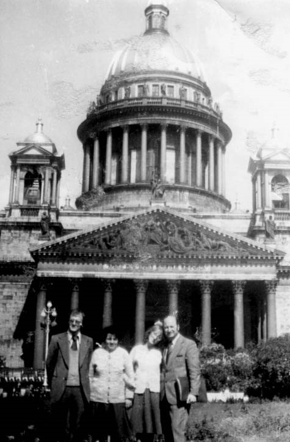

>   *Пред Исакиевската катедрала със семейството ми*

Дните по време на гостуването на семейството ми в Петербург минаваха бързо и
неусетно, защото не остана забележително място, което да не бяхме видели заедно.
Там, където бях минал вече аз, минахме заедно с жена ми и децата, които се
завръщаха в хотела, изпълнили душите си с радост и доволство от видяното и
преживяното. Понякога съжалявахме, че не дойде в Петербург и малкият ми син
Николай, който беше на 5 години. Руските приятели ни уверяваха, че за него щеше
да се погрижат по-специално като му намерят връстници, с които да си създаде
трайни връзки и взаимоотношения.

Изпращането на семейството ми от Петербуг беше подготвено от семейство Генкини.
Вечерта беше неописуемо вълнуваща. Карина, съпругата на проф. Д.Генкин, показа
своите домакински способности да посреща и изпраща гости, както това са правили
някога в известния ѝ богат род в Петербург.

>   *Пред Ермитажа в Петербург*

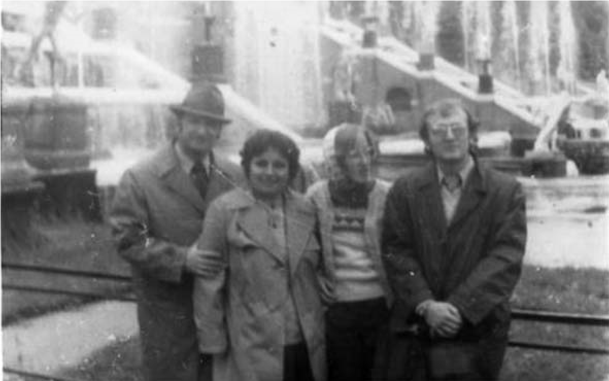

>   *Пред фонтаните на Петерховския дворец*

По време на вечерята се чуваха старите руски наздравици и пожелания, на които
ние отговаряхме с български. Отново бяхме с двете семейства Генкини и
Иконникови, но сред нас бяха и едни от водещите преподаватели от Института по
култура. Никога няма да забравя шегите, разказвани с голямо майсторство от
режисьора Е.В. Вершковски.

Преди да си тръгнем от дома на Генкини, забелязахме, че синът им Павлик и моя
син Красимир ги няма. Отначало се притеснихме, но след това разбрахме, че Павлик
е поискал да покаже на сина ми истината за нощния живот по улиците на Петербург.

След като се върнах от специалзация в Петербург, предложих дисертацията ми в
Специализирания научен съвет по педагогика в Софийския университет. Оказа се, че
проф. Стефан Чернев беше прав, когато ми каза, че българските педагози са твърде
ограничени в своята научна област. Техните изследвания бяха насочени най-вече
към проблемите на възпитателната работа в четите „Чавдарче“, ДПО „Септемврийче“
и ДКМС. На тази тематика някои от тях защитиха дисертациите си. За тях нямаше
никаква преграда, защото имената им бяха в списъците на партийните и комсомолски
номенклатурни кадри, които утвърждаваха сталинската политика на Българската
комунистическа партия в педагогическата наука.

И така, у нас не се намериха рецензенти от педагозите за моята кандидатска
дисертация, в която се анализират възпитателните аспекти на тетрализирани форми,
широко използвани от нашия народ и през най-тежките години на турското
потисничество. Изключение в това отношение правеше проф. Жечо Атанасов, който
прояви голям интерес към дисертацията ми. Той оцени високо нейните научни
достойнства и недоумяваше защо не ми бе разрешено да я защитя в Института по
културата в Петербург. Като председател на Специализирания научен съвет предложи
за рецензенти директора на Института по културата при БАН проф. д-р Елит Николов
и доц. Вяра Михайлова от Философския институт.

## 24. Наказанието ми за „подронване авторитета на партийното и държавно ръководство“, наложено преди защитата на кандидатската ми дисертация

През учебната 1977 година в Института за културно-просветни кадри в Благоевград
се очертаваха две основни групи преподаватели. Едните бяхме в областта на
професионалната подготовка на студентите, а другите бяха по идеологическите
дисциплини. Моите научни интереси бяха много близки с тези на колегите Любен
Лазаров, Златко Коцев и Иван Кантуров, с които се сближихме много. И понеже ние
бяхме безпартийни, партийното ръководство на института ни гледаше под око.
Правеше ни неприятно впечатление, че някои от преподавателите комунисти нямаха
подчертани професионални интереси в областта на културно-просветната работа.
Един от тях беше известно време секретар на партийната група и проявяваше съвсем
открито своята посредственост в преподавателската си работа. След моето
завръщане от Петербург и той замина на специалишзация, но поради слабото му
представяне се завърна далеч преди изтичане на определения срок. За него вече се
знаеше и говореше, че колегите от Института по културата в Петербург недоумявали
за непростимата му посредственост като преподавател по културно-просветна
работа.

На държавните изпити бяхме в една комисия с „прогонения специализант“. При
оценяването на студентите беше крайно субективен и нанасяше незаслужени обиди на
някои от студентите. Спомням си, че когато една от най-талантливите студентки в
института Пролет Николова, която беше поетеса, говореше за народните традиции в
областта на културата, той като партиен секретар ѝ постави въпрос за ролята на
Българската комунистическа партия при тяхното осъвременяване. Студентката ме
погледна и каза:

&minus;Мога ли да кажа това, което мисля? Но това няма да се хареса на вашия колега
    и се страхувам не само за себе си.

&minus;Кажи, кажи! – настояваше партийният секретар.

&minus;Добре! Ще кажа! Вашата партия, другарю партиен секретар, опошли някои от
    най-красивите културни традиции като ги политизира.

&minus;Стига! Двойка! Свободна си. Ще се явиш на поправителен!

&minus;Колега, как така, двойка? – попитах побеснелия от гняв партиен секретар.

Обърнах се към Пролет и ѝ казах:

&minus;Колежке, продължи да говориш по втория въпрос, но спокойно, без да се
    притесняваш.

Стана голям скандал. Партийният секретар, който е бил тракторист преди да
завърши висшето си образование, си нямаше хабер от проблемите на
културно-просветната работа, ме погледна заплашително и излезе.

На следващия ден ръководството на партийната организация е провело специално
заседание за обсъждане на моето поведение. Бях обвинен, че се опитвам „открито
да руша авторитета на други преподаватели и създавам конфликти, ръководейки се
от неправилни, крайно субективистични мнения и оценки“ и „пряко или косвено руша
и авторитета на партийното и държавно ръководство в Института“ и че всичко това
е в прониворечие с моите задължения в учебното заведение.

Предишният партиен секретар добавил и случаят, свързан с нарушаването, което съм
допуснал за неспазване указанията на партийното ръководстово по време на
преименуването на студентите българомохамедани. Наистина, тогава не спазих
партийното изискване да не се изпитват тези студенти, докато не си сменят
имената. Тогава при мен дойде студентът Асан Газиев от с. Абланица, който беше
член на партийната група, и ми каза:

&minus;Чудя ви се! Не се ли страхувате? Има решение на партийната организация
    докато не си сменим имената, да не ни изпитвате, а само вие не го спазвате.

Погледнах Газиев и му отговорих:

&minus;Не искам преподавателската ми работа да бъде зависима от вашите партийни
    решения. Колко пъти вече партията ви сменя или връща имената? Това съм го
    преживял, когато бях учител в Туховище и Дъбница.

Получих заповедта за наказание, която посрещнах с голяма изненада. Един от
колегите ме посъветва да не се заяждам с партийния секретар, защото мога и да
„изгоря като нищо“.

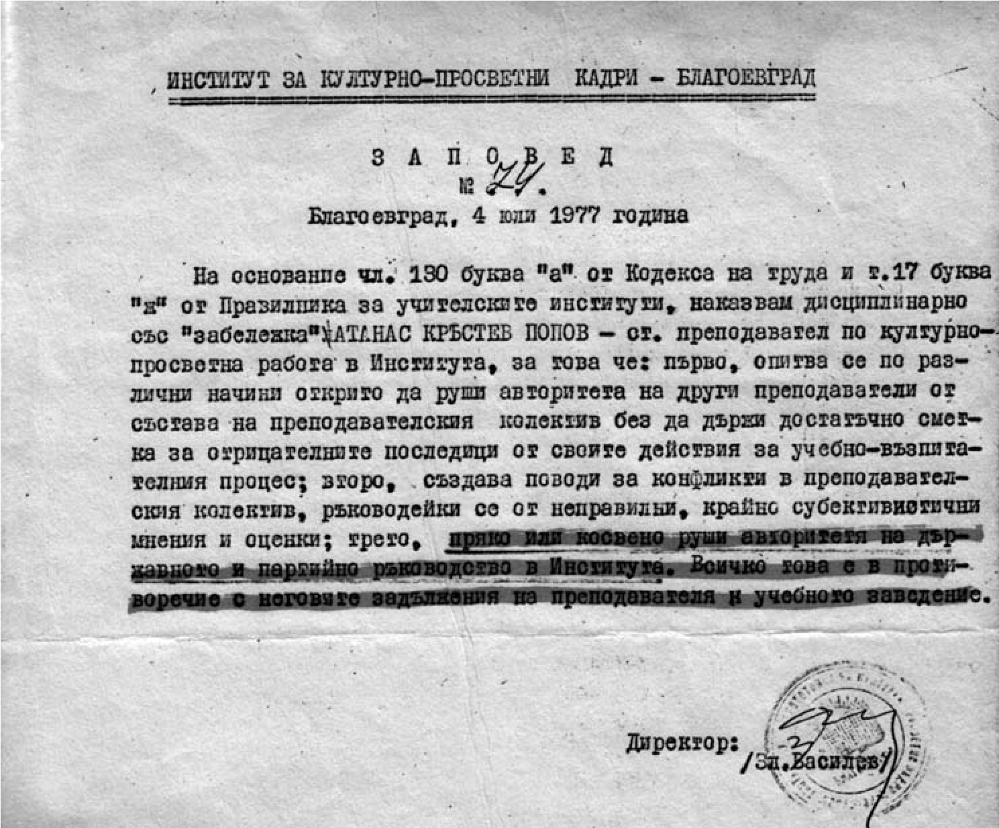

Цяла нощ не заспах. Четох няколко пъти заповедта за наказание и си казах:

&minus;Те, комунистите, навсякъде са от една и съща нечовешка порода. От тях
    спасение няма. Нищо, така ми е било писано. Но няма да им се предам.

Реших да подам молба за напускане на института, която изпратих до Комитета за
изкуство и култура. Колегата Любен Лазаров дойде при мен и ме помоли да си
оттегля молбата, защото ми предстоеше и защита на дисертацията, която бях
подготвил.

&minus;Наско, ще ти попречат. Ти да не мислиш, че издаването на тази заповед е
    случайно.

&minus;Не мога, Любе. Ти сам им яде попарата. Нали и ти не наведе гръб на Кръстьо
    Горанов, който ти попречи да защитиш дисертацията си?

Когато в Комитета за култура и изкуство получили молбата ми за напускане,
зам.-председателят Василев извикал началника на отделя Христо Бабиков и неговия
заместник Ботьо Ботев и им казал:

&minus;Е, тази няма да стане. Всеобщо е нашето признание, че старши преподавателят
    Атанас Попов е единственият от трите института, който се занимава с
    научно-изследователска дейност в областта на културно-просветната работа.
    Нито във Варненския, нито в Хасковския институт имаме такъв преподавател в
    тази област. Негов е и първият учебник по тази учебна дисциплина. Ако Попов
    напусне института, ще се надигнат и студентите. Неговите публикации в нашия
    методически кабинет се ползват като указания за работата в читалищата и
    другите културно-просветни учреждения. Без него ще пострада и работата ни в
    националния методически център. Не е случайно, че напоследък както
    Министерството на образованието, така също и Централният съвет на
    профсъюзите го използват за обучение на техните кадри. Ако уважим молбата
    му, те ще го привлекат веднага на работа при тях.

Един ден Ботев ми се обади по домашния телефон и ми предаде поздрави от всички в
техния отдел, към който се водеха полувисшите институти за културно-просветна
работа. Каза ми:

&minus;Утре идваме цяла комисия да проверим дали е вярно, че подронваш авторитета
    на партийното и държавно ръководство. Дори и да е така, нека това
    ръководство помисли за своя стил на работа, който и ние не харесваме.

Цялото партийно бюро се беше подготвило за тази среща с комисията от Комитет за
изкуство и култура. На мен ми каза последния час секретарката, че трябва да бъда
в института.

Членовете на партийното бюро бяха разпределили ролите и местата си, които
трябваше да заемат, за да посрещнат комисията. Предварително бяха направили опит
да настроят и безпартийните колеги срещу мен.

Разговорът започна неочаквано неприятно за партийното ръководство. Молбата ми за
напускане не е била приета и критиката не беше отправена към мен, а към онези,
които бяха скалъпили обвиненията срещу мен. Смела защита ми направиха и моите
колеги Любен Лазаров, Златко Коцев и Иван Кантуров. Бях приятно изненадан и от
колежката Росица Червилова, която не приемаше решението на нейното партийно
ръководство за наказанието ми. Колегата Йордан Йорданов също недоумяваше от
наложеното наказание срещу мен. Обвинителите замълчаха като разбраха, че
Комитетът за изкуство и култура застава твърдо зад мен. Група студенти бяха
научили за наказанието ми и изчакваха членовете на комисията, за да изразят
своето недоволството от нелепо издадената заповед.

Помолен настоятелно от членовете на комисията, не напуснах института. Така се
успокои и семейството ми. Започнах усилена подготовка за защитата на
дисертацията ми в Софийския университет.

През тези трудни дни при мен често идваха най-добрите ми приятели Любен Лазаров
и Златко Коцев, който е истинският създател на ансамбъл

„Пирин“. Тримата бяхме недолюбвани от партийното ръководство, но винаги търсени
от студентите, които не скриваха своята привързаност към нас. След юбилейното
честване, което с Любчо подготвихме на Златко, неговата жена Цветанка му
предложила да ни поразходи с колата му в Македония. Къде ли не ходихме, какво ли
не видяхме, но най-много се задържахме на Охридското езеро, където престояхме
няколко дни.

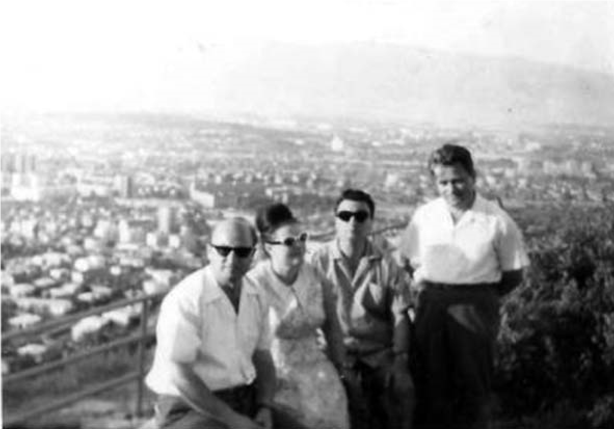

>   *В Скопие се качихме на високия хълм, от който с поглед прегръщахме града,
>   който още страдаше от страшното тогавашно земетресение*

Когато подадох документите в Специализирания научен съвет по педагогика в
Софийския университет за защита на кандидатската ми дисертация, не представих
характеристика от ръководството, защото не ми беше дадена такава. Някои от
колегите ме посъветваха да се помиря с директора и партийния секретар и да ги
помоля да не ми пречат, за да защитя кандидатската си дисертация. Те бяха
уверени, че без характеристика няма да се състои защитата. Не приех техният
съвет, защото забелязах голям интерес от известни български учени към
кандидатската ми дисертация и свързаните с нея мои публикации.

## 25. Защита на кандидатската ми дисертация

Датата вече беше определена от Научния съвет по педагогика и психология с
председател проф. д-р Жечо Атанасов. Темата „Мястото и ролята на
театрализираните форми за възпитанието“ предизвика голям интерес сред
педагозите, философите, психолозите, етнографите, социолозите и изкуствоведите
не само в университета, но и в някои от научните институти в Българската
академия на науките. Директорът на Етнографския институт академик Веселин
Хаджиниколов и проф. Стоян Генчев ме потърсиха по телефона в Благоевград, за да
ми кажат, че ще присъстват на защитата. Много често бях използван от тях като
лектор по проблемите на традиционната народна култура в цялата страна. Мои
публикации излизаха в тяхното списание „Българска етнография“. Студията ми
“Проблеми на приемствеността в традиционната празнично-обредната система“,
публикувана в списанието, беше изпратена от института в цялата страна за
използване от дейците на културата.

Един ден преди защитата проф. Жечо Атанасов поиска да се срещнем.

&minus;Атанасе, не открих сред документите характеристиката ти от института.
    Забравил си да я представиш.

&minus;Нямам характеристика, а имам заповед за наказание.

Разтворих чантата и подадох заповедта на професора, който се втренчи в нея. И
след като я прочете, на един дъх ми каза:

&minus;Как може преди защитата на дисертацията да бъдеш наказван? Това е безумие.
    Кой извърши това коварство? Този, който е издал тази заповед, е лош човек.
    Кой е той, какъв е? Сигурно е бивш партизанин или активен борец. Само такива
    могат сега да пречат на талантливите млади хора като теб.

&minus;Познахте, директорът е активен борец против капитализма, но истинският
    виновник е бивш тракторист, а сега партиен секретар на института.

&minus;Ясно, тези хора се страхуват от теб и искат да ти провалят бъдещето. Но това
    няма да стане. Аз ще те представя пред Научния съвет по написаното в
    автобиографията ти. Ти си почтен човек. Вярвам, че в нея си написал истината
    за себе си.

Преди да започне защитата, в заседателната зала дойдоха синът ми Красимир, брат
ми Стоян и колегата Любен Лазаров, които ми помогнаха да разположим по стените
схемите и таблиците, с които нагледно показваха най-важните мои научни тези.
Когато започнаха да идват членовете на Специализирания научен съвет и гостите,
които бяха от различни научни институти, Комитета за изкуство и култура,
Министерството на образованието, както и мои колеги, те не бързаха да седнат на
местата си, а започнаха да разглеждат с голям интерес нагледните средства, които
бяха подредени в голямата зала.

Моите рецензенти ст.н.с. Елит Николов, директор на Института по култура, и доц.
Вяра Михайлова дойдоха при мен. Проф. Жечо Атанасов им бе казал за наказанието
ми. Елит Николов стисна здраво ръката ми и каза:

&minus;Направил си блестяща кандидатска дисертация. Докажи чрез защитата си, че
    никой не може да попречи на пътя ти, който си поел в науката.

А доц. Вяра Михайлова прошепна на ухото ми:

&minus;Да си призная, трябваше много специализирана литература да прочета, за да
    рецензирам вярно и точно прекрасната ти кандидатска дисертация.

Казаното от двамата рецензенти за дисертацията ме вдъхнови по време на
встъпителното ми слово. През това време вратата на заседателната зала се
открехна и в нея влезе Борис Аврамов, който проявяваше голям интерес към моята
преподавателска и научно-изследователска работа. А малко след него се показа
гузен и директорът на Института за културно-просветни кадри Златко Василев,
който беше подписал заповедта за наказанието ми.

След прочетените рецензии започнаха изказванията на членовете на Специализирания
научен съвет, в които се подчертаваха научните приноси в нея. Педагозите
отбелязваха ефективното възпитателно въздействие на театрализираните форми.
Социолозите и психолозите оценяваха разглеждането им като социалнопсихологическо
явление, което се изследваше за първи път у нас. Изкуствоведите пък анализираха
значението на театрализираните форми като специфично синтетично изкуство, в
което органически се свързват и взаимно обогатяват художествените и
документалните изразни средства. Силно прозвучаха и изказванията, в които се
подчертаваха приносите ми за решаването на някои проблеми в етнографската наука.
Както рецензентите, така също и изказващите се определяха като най-голям научен
принос в дисертацията ми използуването на комплексно-интегративния подход при
изясняване същността и спецификата на театрализираните форми.

Когато обявиха резултата от избора, в залата се чуха възгласи, които ме накараха
да изтръпна от неописуемо вълнение. Единодушно бях избран за кандидат на
педагогическите наука, без нито една отрицателна или бяла бюлетина. Видях как
присъстващите поздравяваха и семейството ми, жена ми Мария, сина ми Красимир,
дъщеря ми Снежана и брат ми Стоян. Радостта ни беше неизмерима, защото тя беше
изстрадана.

Тогава имаше хубава традиция. След успешните избори в Специализирания научен
съвет да се канят присъстващите на почерпка. Дъщеря ми Снежана и синът ми
Красимир бяха разтворили вече големи шоколадови кутии. Рецензентът ми Елит
Николов покани от мое име всички присъстващи на вечеря в ресторант „Операта“,
където продължиха да се леят хубавите думи за дисертацията и преподавателската
ми работа. Поетът Йордан ЙордановТонев, вдъхновен от всички изказвания, които чу
за мен, и най-вече от преките му впечетления от работата ни като негов колега,
ми посвети акростих.

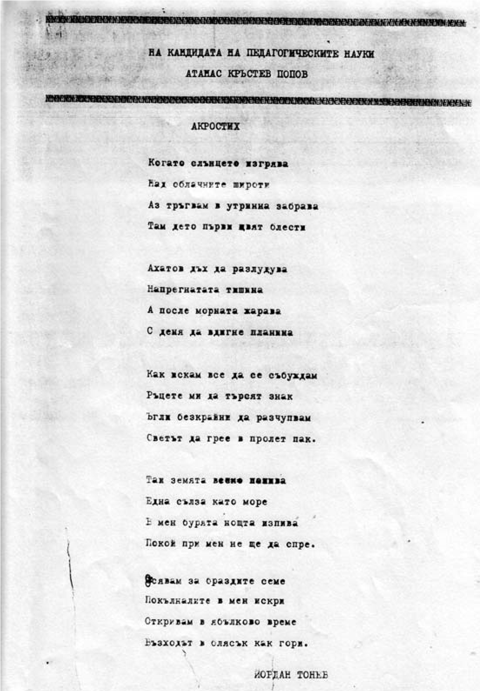

Това, което написа за мен поетът Йорданов, ми напомни за разговорите ми с някои
известни големи личности в областта на изкуството. Когато големият български
артист Боби Симеонов изпълняваше ролята на Аспарух в театрализираната тематична
вечер хроника „Българийо, бъди благословена“, осъществена по мой сценарий, след
нестихващите аплодисментите на публиката в Шумен дойде при мене и ми каза:

&minus;За първи път усетих такава спойка и взаимна обусловеност между документалния
    и художествения материал, който използвате във вашия сценарий. Те взаимно
    допълват и обогатяват своите възпитателни възможности. Разбрах, че това е
    една от най-важните теоретични тези в кандидатската ви дисертация, която сте
    защитили. Хубаво е, когато научните изследвания, каквото е вашето, отварят
    нов път в съответната научна област, но и спомагат за обогатяване на
    културния живот с нови средства и форми.

През тези години в страната се провеждаха национални тържества, свързани с
честване 1300 години от създаването на България. По моите сценарий „Ида от
древността“ и „Българийо, бъди благословена“ няколко други драматични театри,
освен Шуменския, също няколкократно представяха на сцените си театрализирани
представления, в които чрез внимателно подбран и органически свързан и
синхронизиран документален и художествен материал оживяваха страниците от нашата
история. Освен това, ръководители на големи ансамбли в страната започнаха да
използват театрализираните елементи в техните програми. Спомням си, че Кирил
Ралев, режисьор от Благоевград, поиска специална среща с мен. Заварих го с
разтворената ми книга „Театрализираните форми“, в която беше подчертал взаимното
влияние между художествения и документален материал. За спецификата на
драматургията на театрализираните форми за възпитание, която реазработих в една
от студиите ми, интересни разговори съм имал с ръководителя на ансамбъл „Пирин“
проф. Кирил Стефанов, който призна, че е заимствал някои от моите идеи за
театрализацията, застъпени в концертите на ансамбъла, който ръководеше. С видния
български учен-фолклорист, диригент и композитор Михаил Букурущлиев бяхме
няколко дни заедно в град Силистра, където и той подчерта значението на някои от
моите научни разработки за обогатяване на културната дейност.

Две седмици след защитата на кандидатската ми дисертация отидох във Висшата
атестационна комисия да си взема дипломата за придобитата научна степен.
Секретарката ме посрещна много любезно и каза, че няколко от членовете на
комисията се изказали много ласкаво за моята кандидатска дисертация, след което
всички гласували единодушно. Това според нея много рядко се случвало във Висшата
атестационна комисия. Когато тръгнах към вратата, на нея се показа академик
Илиев. Секретарката се обърна към него и му каза:

&minus;Това е Атанас Попов от Благоевград.

&minus;Хубаво, че се виждаме с теб, очи в очи. Искам да не ми се сърдиш, че не ти
    разрешихме да защитиш кандидатската си дисертация в Петербург. Вината не е
    наша, а на други. Ти знаеш къде се решават тези въпроси, нали?

&minus;Знам, но по-хубаво, че стана така, за да съпоставя оценките на дисертацията
    ми от руските колеги и нашите учени. Оказа се, че са еднакви, което ме
    радва.

Акад. Илиев протегна ръка и ми пожела успехи в по-нататъшната ми преподавателска
и научно-изследователска дейност.

Бях приятно изненадан, че непосредствено след защитата на кандидатската ми
дисертация зачестиха обажданията от Комитета за изкуство и култура и
Министерството за наука и висше образование. По разработена от мен програма
започна обучение на културно-просветните кадри в читалищата и другите домове на
културата, по която след изнесени от мен лекции и провежданите различни форми на
културно-просветна работа започваха творческите разговори. Немалко от окръжните
съвети за народна просвета пък настояваха упорито за обучение на учителите по
проблемите, свързани с извънкласните и извънучилищни форми за възпитание на
учениците. Дирекцията „Народна просвета“ в Благоевград издаде книгата ми
„Комплексни форми за възпитание на учениците“, която се преиздаваше и в други
окръзи на страната.

През тези години в областта на културата до голяма степен се преодоля ярко
изразеното преди това политизиране на културната дейност в страната. Именно
затова приех предложението от Комитета за култура да участвам като научен
ръководител на курсове за професионалната подготовка на дейците в системата на
културно-просветните учреждения. Нямаше окръг в страната, в който да не съм
обучавал тези кадри, с които разнообразихме дейността им. Мои най-добри
помощници бяха завършилите Института за културно-просветни кадри, които бяха
назначавани в домове на културата, библиотеки, музеи и галерии. Те не забравяха
моята препоръка като техен преподавател да не допускат политизиране на дейността
им. Много често някои от тях ми се оплакваха от вмешателството на партийни
ръководители в планирането на различните форми на културно-просветна дейност,
които те искаха да бъдат свързани със задачите на комунистическата партия.

През тези години се породи идеята за обединяване на полувсшите институти за
културно-просветни кадри с Библиотечния институт и други учебни заведения в
областта на изкуството за създаването на Университет по културата, в структурата
на който те да бъдат отделни факултети. Бях включен в работната комисия, която
уточняваше неговия статут. След това тази идея беше изоставена.

В Благоевград мирясаха моите врагове, които ми скалъпиха наказанието за
„подронване авторитета на партийното и държавно ръководство“. Студентите
забелязаха това и вече открито не приемаха наставленията на партийното
ръководство тяхната дейност да бъде съобразявана с „повелята“ на
комунистическата партия. Научните ми публикации, свързани с проучане и
използване на възпитателните аспекти на традиционната българска
празнично-обредна система у нас грабнаха вниманието на най-будните студенти.
Когато предложих създаването на спецкурс за тяхното запознаване със старите
празници, обреди и ритуали, някои от преподавателите комунисти се понамръщиха.
Един от тях стана и каза:

&minus;Това ми намирисва на връщане към миналото. Трябва да се изучават и
    утвърждават само социалистическите празници.

Не се стърпях и му казах:

&minus;Нищо ново не се създава на пусто място. Традиционната българска
    празнично-обредна система е опазила нашата национална идентичност и през
    най-тежките години.

Спецкурсът беше приет за обучение на студентите от специалността „Теория и
методика на културно-просветната работа“. В програмата включих проучване на
религиозните празници и анализиране на тяхното възпитателно въздействие. Когато
студентите научиха „под сурдинка“ от мен за посещението, което трябваше да
направим в едни от най-големите манастири и църкви в страната, се зарадваха
много. Тогава това беше забранено.

Така наречената „учебна“ екскурзия беше за 7 дни в градовете София, Плевен,
Горна Оряховица, Варна, Пловдив и Пазарджик.

От Благоевград тръгнахме за Рилския манастир, където „крадешком“ разгледахме две
от залите, едната за кръщаване на децата, а другата за венчаване на
младоженците. Когато започнахме разговор с игумена за най-важните християнски
празници, които са били отбелязвани в манастира преди девети септември 1944 г.,
при нас дойде офицер от милицията, който ни раздели, като каза:

&minus;Разкарайте се, забранено да се срещате тук!

На път за София студентите коментираха помежду си впечатленията си от светата
обител на Неофит Рилски. Питаха ме кога най-после ще отпадне забраната да
посещават църквите и манастирите, които са най-светите места на нашата
духовност. Така беше тогава. Всеки, който прекрачи прага на молитвените храмове,
вече беше на прицел от Държавна сигурност.

Бях се уговорил с мой приятел свещеник да ни посрещне близо до входа на църквата
„Света Неделя“. Когато я наближихме обаче, той вдигна ръка и ми даде знак да не
тръгваме към него. След това разбрах, че щял да стане голям скандал, ако бяхме
влезнали в нея. Тук охраната е била най-сигурна за тогавашната власт. Някои от
студентите ме попитаха защо тази църквасе охранява от толкова много милиционери,
които я бяхаоградили от всички страни. По-късно им разказах за атентата, който е
извършен в нея през 1925. Те ме слушаха онемели. Една от студентките не се
стърпя и просъска:

&minus;Проклети да са убийците !

Тръгнахме към храма „Александър Невски“, но моят приятел свещеник успя да ни
настигне и предупреди;

&minus;Не отивайте в храма „Александър Невски“. Там охраната е още по-голяма! Ще си
    навлечеш голяма беля.

Тръгнахме за Пловдив, откъдето направо се отправихме към Бачковския манастир,
който беше на „скришно място“. Тук уредих и преспиването на студентите, които
бяха настанени „потайно“. Преди това обаче отидохме на вечеря в близък
ресторант. Когато се върнахме в манастира, вратите му бяха затворени. Бяхме
закъснели. Студентите се притесниха. Някои от тях започнаха да тропат, но никой
не отваряше. Една от студентките се беше взряла през една от тесните дупки на
вратата и забелязала нова „Чайка“ в двора на манастира. Тогава това бяха
правителствените коли, с които се движеха само хората на Тодор Живков. Това
стресна студентите и започнаха да ме питат какво ще правим. Успокоих ги. Казах
им, че щом са дошли в манастира хора с такава кола, те няма да останат да
нощуват в него, а имат друга задача.

Така и стана. Когато вратите на манастира се разтвориха широко, се показа
лъскавата „Чайка“. Ние се скрихме до оградата на манастира. Баба Елена се показа
и тихо, много тихо се чу гласът ѝ:

&minus;Деца, влизайте бързо и се настанявайте! Хубаво, че не ви завариха тук
    големците, които понякога идват, за да ни проверяват.

Късно през нощта разгледахме всичко в манастира. Нямаше вече кой да ни види.
Баба Елена разказваше на студентите къде и как се правят религиозните празници и
обреди Те я отрупваха с въпроси, но тя беше много доволна, че за първи път от
толкова години вижда млади хора в манастира.

На следващия ден вече бяхме във Варна. Но този път тук разглеждахме новата
ритуална зала, в която се извършваха гражданските обреди. Вярно е, че тя беше
красиво подредена, но моите студентите я съпоставяха със залите в манастирите,
които посетихме, и ми казваха:

&minus;Тук не се вълнуваме, а в манастирите и църквите настръхвахме от трепетни
    вълнения.

Когато обсъждахме ритуала „Сключване на граждански брак“, студентите го
съпоставяха с християнския ритуал „Венчаване“, за който им разказвах
подробности, когато бяхме в специалната за него зала в Бачковския манастир.

По време на обсъждането при мен дойде един от инспекторите в Окръжния съвет
за култура във Варна. Той ме помоли да изляза навън, за да ми каже нещо, за
което другите не бива да знаят. Обадил се от Комитета за култура Ботьо Ботев
и му казал, че на връщане трябва да мина през София, заедно със студентите.
Там ме чакали за разговор, свързан с обиколката ни из страната.

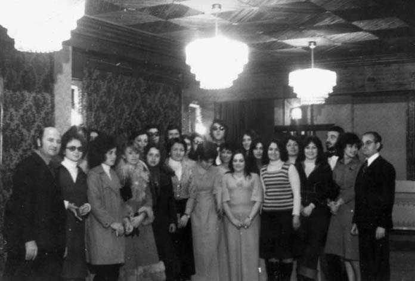

>   *С участниците в спецкурса за традиционине празници и обреди в град Варна*

На следващия ден поведох студентите към една от залите на Комитета за култура,
която беше осигурена от инспектора Ботьо Ботев. Там ни чакаше заместник
председателят Любен Василев, който посрещна студентите с доволна усмивка. Той
беше класирал нашите студенти на първо място по отношение на тяхната
разнообразна новаторска културно-просветна дейност в читалищата и другите
културно-просветни институти в страната.

&minus;Как е колеги, доволни ли сте от учебната обиколка из страната?

Студентите вкупом отговориха:

&minus;Много, много !

&minus;Имате ли препоръки към Комитета за култура за подобряване на вашата
    професионална подготовка?

Една от най-будните студенти се обърна към мен и с погледа си сякаш искаше
разрешение да отговори. Дадох го с отправена усмивка към нея.

&minus;Искаме да се разтворят залостените врати на българските църкви и манастири,
    за да се влиза свободно в тях. Там нашият народ е формирал и запазил в
    най-трудните времена своята идентичност. Голяма роля в това отношение имат
    религиозните празници и обреди, които сега са забранени. Защо?

Този въпрос сепна Ботьо Ботев, който погледна към заместник-председателя.

&minus;Труден въпрос, с още по-труден отговор, на който за съжаление и аз не мога
    да отговаря, защото нямам това право.

Тези думи на Любен Василев поставиха началото на дискусията, която започна и
продължи повече от един час. Радвах се на моите студенти, които разкриваха
убедително възпитателното значение на българските молитвени храмове и
провежданите в тях християнски празници и обреди.

След срещата със студентите беше и моята лична среща с началниците ми. От тях
разбрах, че още от първите дни е имало до тях две донесения. Едното за
посещението ни в Рилския манастир, а другото за преспиването в Бачковския
манастир. Началникът на отдела за нашите институти ме помоли да предупредя
студентите като се върнат в Благоевград да не споделят с никого къде са били и
какво са разглеждали. Той вече познаваше някои от доносниците в нашия институт и
се страхуваше да не направят донесение до висшите партийни органи за създадения
от мен спецкурс, в който се отделяше специално внимание на нашата традиционна
празнично-обредна система, част от която са и религиозните празници и обреди.

В продължение на две години моите научни изследвания бяха свързани с
приемствеността в традиционната празнично-обредна система. Интересът към
публикуваните мои студии и статии беше изключително голям. В някои градове на
страната, след специално организираните научни конференции на тази тема от мен,
започнаха да се възстановяват старите празници. В тази за тогавашното време
„опасна“ културно-просветна дейност моите студенти бяха основните организатори.
Окръжният съвет за култура в Михайловград издаде книгата ми „Нашата традиционна
празнично-обредна система“, която се разпространяваше като „нелегална“
литература. Почти от цялата страна търсеха публикациите ми на тази тема.
Непрекъснато получавах покани за обучение на културно-просветните кадри. Намирах
време да кръстосвам във всички по-големи градове, където вече без страх се
възстановяваха красивите семейно-битови и календарни обреди и ритуали.

Запомнил съм като най-вълнуващи специално организираните научно-практически
конференции под мое ръководство във Варна, Бургас, Пловдив, Велико Търново,
Шумен, Видин, Русе, Габрово и други градове в страната. Един от тези спомени
обаче е неприятен, защото по-късно, след две години, когато вече бях
преподавател във Висшия педагогически институт, на конференцията в Плевен,
където почти всички участници спонтанно изразиха изключително подкрепата си за
възстановяването на традиционната българска празнично обредна система и съвсем
явно изразиха негативното си отношение към някои от така наречените
„социалистически празници“. Един от участниците в конференцията, вероятно
сътрудник на Държавна сигурност, беше информирал „светкавично“ Кръстьо Тричков и
новия председател на Комитета за култура и изкуство Георги Йорданов за някои
неща, казани от мен по адрес на Тодор Живков и неговия син Владимир.

На следващия ден бях потърсен от партийния секретар на института и заплашен, че
ще бъда уволнен. Не отидох при него. Беше под достойнството ми да отида в
кабината на този фалшив историк, който получи своята „научна“ степен и звание
„доцент“ за хвалебствията му към комунистическата партия и нейната борба срещу
„опозицията“. Бях готов да напусна института, но тогава се появиха първите
признаци на „перестройката“, които ме спасиха от уволнение.  

## Кратко размишление вместо заключение

Видяното и преживяното през годините на комунстичекия режим е силно кодирано в
моите мисли и чувства. То все още населява сънищата ми, които са страшни. Няма
да скрия, че сънувам и сега всички трудности, които съм преживял, защото са
свързани със злодеянията на онези, които винаги държаха в обръч къщата ни като
„врагове на народната власт“. Често скачам в съня си, когато ме наричат
„фашист“. Най-незабравими са дните и нощите, когато бях в лагера в Люти дол и
Трудова повинност. Сънищата за тях са своеобразно продължание на тези черни дни
от моя живот. Не по-малко са онези сънища, които ме връщат в годините, когато
тръгнах по учителския път. Той беше изпълнен с много бариери, които трябваше да
събарям.

Признателен съм на моите родители, които ни научиха да бъдем издържливи в
нестихващата битка с посредствеността и жестокостта на комунистите, на агентите
и служителите на тяхната Държавна сигурност, които следяха всяка наша крачка и
казаното от нас за прехвалената им „народна власт“.

Ако не бяха възрожденските ми корени, сигурно нямаше да издържа. Освен това
родителите ми, които бяха минали през комунистическия ад, ни каляваха всеки ден,
за да издържим ужасите на тогавашното време.

Все още в сънищата си пътувам по родопските и пиринските пътеки, където бях
учител, преместван от село на село. Трябваше да ги извървя, за да прегърна макар
и за малко малкия ми син и любимата жена, които тъгуваха за мен.

С неизмерими усилия направих и моите пътеки в преподавателската ми работа в
Полувисшия институт за подготовка на културно-просветни кадри. И тук не свих
рамене пред онези, които бяха некадърни, но го управляваха. Понесох ударите им
като „враг“, който подронва авторитета на партийното и държавно ръководство.

Реших видяното и преживяното от мен в навечерието и през годините на
посткомунизма да отразя във втората част на книгата ми, за да се очертаят
по-ярко неговите прилики и разлики от годините на комунистическия режим. Оказа
се обаче, че техните модератори са едни и същи. Малката разлика се изразява в
това, че след девети септември 1944 г., както в никоя друга европейска страна,
българските комунисти, които бяха полуграмотни, унищожиха целия елит на нацията
по най-жесток начин, а след 10 ноември 1989 година техните деца и внуци ограбиха
безмилостно нашия народ и му създадоха нови, непоносими страдания.

От изложеното дотук е видно, че българските комунисти, наставлявани пряко от
техния „вожд и учител“ Георги Димитров, още от първите години на тяхната
„народна власт“ разделиха нашия народ на „наши“ и „чужди“.

Чуждите бяхме ние, така наречените „врагове на народната власт“ .

Още от детските ми години пред всяка моя крачка се изпречваше червена преграда,
която трябваше да премахвам или прескачам с големи усилия на разум, талант и
воля за постигане на моята съкровена мечта – да не се прекъсват просветните и
революционни традиции, предавани от поколение в моя род. Щастлив съм, че по този
път тръгнах не само аз, а и моите деца и внуци, с които пазим ревниво родовата
памет и истинския български дух.

# Втора Част - ПРЕМЪЛЧАНИ ИСТИНИ

## Въведение

Наслушах се на хвалебствия и нереални самооценки на някои доскоро неизвестни или
самовлюбени в себе си „строители“ на Югозападния университет „Неофит Рилски“,
които проявиха своята къса памет за паметни години от неговото съдаване,
развитие и утвърждаване.

Съвсем основателно е да смятаме, че академичната памет е по-гъвкава и трайна,
защото е прието да се твърди, че нейни субекти са хора с повече знания и здрав
морал. Но това, което се прояви в дейносттта на някои преподаватели и
ръководители в нашия университет през последните 20 години, не потвърди тази
теза. Това показва, че има нещо гнило в душите, мислите, чувствата и поведението
на онези, които нямат истински академичен облик. Оказа се, че това е всеобщо
заболяване в сегашните български университети, където се подготвят специалисти
за всички сфери в нашия живот.

Няма да изневеря на себе си и ще споделя това, което видях, направих и преживях
като преподавател, ръководител на катедра, заместник-декан, заместник-ректор,
председател на Научния съвет по педагогика и психология и член на Комисията по
обществени науки към ВАК при Министерския съвет. Това бяха едни от най-трудните
години от развитието на нашия университет.

Когато бях назначен в Катедрата по начална училищна педагогика, а по-късно бях и
неин ръководител повече от десет години, тя беше най-голямата във Висшия
педагогически институт, затова я наричаха негова „майка“. Факултетът по начална
училищна педагогика също беше основен в структурата му. Именно в него се
моделираха някои от новите специалности, които след това пък станаха ядра за
създаване на новите специалности и факултети. Тогава бях и заместник-декан по
научноизследователската работа. Именно през тези трудни години отдавах всичко от
себе си за развитието на Висшия педагогически институт, а след това вече с
дадения му статут като Югозападен университет „Неофит Рилски“. За тях искам да
разкажа в тази книга.

Мълчах досега, отминавах със скрита болка това, което преживявах, но повече не
мога. Истината трябва да се каже.

## 1. Моите покровители

Висшето учебно заведение в Благоевград премина през три етапа в своето досегашно
развитие. Първият е свързан с неговото създаване като филиал на Софийския
университет „Св. Климент Охридски“, вторият – с утвърждаването му като
самостоятелен Висш педагогически институт, и третият – с приемането на статут на
Югозападен университет „Неофит Рилски“.

През 1983 г. Висшият педагогически институт в Благоевград беше все още
единственият в страната, който подготвяше педагози за началното училище и
предучилищните заведения с висше образование. През следващата година такива
факултети бяха открити в София, Пловдив и Шумен.

Още през 1977 г. бях хоноруван асистент по Теория на естетическото възпитание
при професор Жечо Атанасов. Много бързо студентите се привързаха към мен, но и
аз към тях, защото бяха много будни. Семинарните упражнения се превърнаха в
разгорещени разговори и дискусии по проблемите в естетическото възпитание, които
бяха предизвикани от свързването им с комунистическите идеи, пронизали
съдържанието на почти всички научни дисциплини. Спомням си, че студентите
роптаеха много срещу някои преподаватели по идеологическите дисциплини, които
въобще не позволявали да се дискутира по време на техните лекции и семинарни
упражнения.

Когато през 1982 година кандидатствах за обявения конкурс по Теория на
възпитанието, вече като кандидат на педагогическите науки, партийното бюро и
кадровата комисия бяха отклонили документите ми, въпреки това, че бях включен от
няма и как в предложение до Съвета за висше образование да бъда допуснат до
конкурса заедно с директора на Полувисшия институт за културно-просветни кадри
Златко Василев и с Йордан Смилянов. Те не срещнаха никаква трудност, защото
единият беше активен борец против капитализма, а другият – партиен секретар. Но
пред мен отново се изпречи червената преграда.

Един от тогавашните преподаватели, член на кадровата комисия, ми каза с тревога
тази неприятна новина. Нямах препоръка от директора и партийния секретар на
Полувисшия институт за културно-просветни кадри. За мен остана заповед № 74/4
юли 1977 година, която ми стъкмиха за наказание поради „системно нарушаване на
авторитета на партийното и държавно ръководство“. Освен това при справката,
направена в Държавна сигурност, се установи, че още през 1959 година ми е
открито оперативно дело по линия „враждебна интелигенция“ по повод на това, че
съм „вражески настроен“. Братя Кутреви, които бяха на отговорни длъжности в
Окръжното управление на Министерството на вътрешните работи в Благоевград, също
вземат участие при отхвърляне на кандидатурата ми за обявения конкурс, като
убеждават председателя на кадровата комисия, че произхождам от „фашистко
семейство“. Така наричаха онези семейства, които бяха определяни от тогавашната
власт като нейни врагове.

Проф. Дечо Денев, ръководител на Катедрата по начална училищна педагогика, и
проф. Жечо Атанасов, като научили за това решение на партийното бюро, поискали
среща с ректора доцент Павел Драганов, след което бил даден ход на задържаните
мои документи. Една вечер ме помолиха да се срещнем в сладкарницата на „Ален
мак“. Проф. Атанасов се обърна към проф. Денев:

&minus;Аз черпя, защото искам да дам някои съвети на Атанас, които трябва да
    приеме.

&minus;А аз ще ги допълня, нали Жечо? – обади се проф. Денев.

Подразбрах, че двамата се бяха уговорили за нещо. Разговорът ни беше за това,
което са споделили и с ректора на института. Стана дума за автобиографията ми,
която са чели. Според тях тя трябва да се преработи, да не ми пречи повече в
научната кариера и в нея да се впишат някои неща, без които няма как да бъда
допуснат до конкурс и одобрен за редовен преподавател.

&minus;Атанасе, твоята автобиография е суха, щом в нея няма вписани неща, на които
    нашите партийни ръководители държат много и по тях вземат своите съдбоносни
    решения. Ти бил ли си чавдарче ? А след това пионерче и комсомолец?

&minus;Чавдарче не съм бил. Когато учих, през тези години такива чети нямаше.
    Вашата партия още не беше на власт. Бях пионерче, защото всички ни водеха
    такива. Не ни питаха дали искаме, или не. А когато бях в гимназията, пак
    всички ни записаха вкупом във вече преименувания Съюз на народната младеж
    като Димитровски.

&minus;Тогава защо не послъжеш малко, за да ти е по-лесно да вървиш по пътя, който
    си избрал? Помисли и за други благородни лъжи, които можеш да впишеш в
    автобиографията си. Така ще спасиш не само себе си, а и семейството си. И
    най-важното – ще продължиш просветното дело на твоите прадеди и деди.

Проф. Денев ме погледна и допълни:

&minus;Това трябва да го направиш. Не е толкова опасно. Страшното е другото, че
    произхождаш от семейството, което нашите са кръстили като „фашистко“.

Разбрах намека на моите съветници как мога да се отърва от враговете ми, които
ме преследваха на всяка крачка. Спомних си, че такъв съвет ми даваше и моят
спасител Никола Пашов, окръжен училищен инспектор. Именно затова приех
препоръките на проф. Жечо Атанасов и проф. Дечо Денев какво да излъжа в новата
ми автобиография. Никога не съм бил в дружинен съвет и член на комсомолско
ръководство, но в новата автобиография според двамата това трябва да се впише.
Тази вечер те уточниха и другите „благородни лъжи“, без които нямаше да бъда
техен колега.

И така, бях посъветван не само да хвърля пепел в очите на червените плъхове чрез
новата ми автобиография, но да се науча да цитирам в научните ми публикации и
партийните документи.

&minus;Знам, че ги презираш, но ще ги цитираш, защото иначе няма да пътуваш
    спокойно в научната си кариера – каза проф. Жечо Атанасов.

Цяла нощ не можах да заспя, когато съчинявах новата автобиография, в която
допълних и „благородната лъжа“, че родителите ми са едни от първите, които са
влезли в ТКЗС. Ако беше така, сигурно нямаше да ми бъде открито оперативно дело
от Държавна сигурност като „вражески настроен“ и „отношението му към народната
власт е отрицателно“. Както и, ако бях в дружинен съвет и комсомолски активист,
също нямаше да ми задържат документите в общинския комитет на БКП в село
Копривлен цели три години и да не ми се разреши да продължа образованието си в
Софийския университет.

Оказа се, че съветите на двамата професори бяха „благородни“, защото след това
трудностите, които срещах, не бяха толкова страшни, а преодолими с неимоверните
мои усилия.

Проф.Жечо Атанасов и проф.Дечо Денев познаваха моята научна продукция, която
представих при защитата на кандидатската ми дисертация. Често ми напомняха, че в
Специализирания научен съвет по педагогика и психология е нямало такава защита
на кандидатска дисертация, при която да е имало толкова много положителни
изказвания и представени отзиви, след което всички членове на Научния съвет да
гласуват единодушно за избирането ми за кандидат на педагогическите науки. Вече
имах издадени четири монографии, няколко студии и публикации, в които за първи
път правя опит да разширя обекта и предмета на педагогическата наука. И двамата
изтъкнати български учени бяха силно впечатлени и от това, че при защитата на
кандидатската ми дисертация присъстваха, освен членовете на Специализирания
научен съвет по педагогика и психология, и авторитетни учени от Българската
академия на науките, представители на Министерството на образованието и Комитета
за изкуство и култура.

По-късно научих, че офицерът от Държавна сигурност, който отговаряше за нашия
институт в Благоевград, и след като представих новата автобиография, настоявал
упорито да не бъда допуснат до конкурса заради наказанието ми през 1977 за
„подронване авторитетана партийното и държавно ръководство“ и оперативното дело
срещу мен по линия „вражеска интелигенция“, открито още през1959 година.

Преди да постъпя на работа във Висшия педагогически институт в Благоевград, бях
сигурен, че онези, които правеха кариерата си заради комсомолската и партийната
си активност, няма да ме оставят на мира. Винаги те се изпречваха пред мен, за
да спрат моето спокойно пътуване в живота.

Най-после, когато получих заповедта за назначаването, телефонът ми позвъня. Чух
гласът на проф.Дечо Денев :

&minus;Атанасе! Честито! Чакам те в моя кабинет.

След около половин час бях при професор Дечо Денев, който беше пак заедно с
проф. Жечо Атанасов. Двамата ме посрещнаха изключително любезно.

&minus;И този път се пребори и победи, с наша помощ, нали? – каза проф.

Атанасов.

Той ми стисна ръката и продължи:

&minus;Здрави корени имаш, Атанасе. Никога няма да забравя, че когато защитаваше
    кандидатската си дисертация, прозряхме таланта ти, който е онаследен от
    вашите възрожденски прадеди и деди. Именно затова аз премълчах наказанието
    ти за „подронване авторитета на партийното и държавно ръководство“.

В разговора ни с проф.Дечо Денев и проф.Жечо Атанасов стана дума и за другите
преподаватели в катедрата, някои от които според тях нямат необходимия опит в
образователната система. Това притесняваше проф. Дечо Денев, който каза:

&minus;Който не е носил учителски дневник, не може да бъде добър учен в нашата
    педагогическа наука. Това е най-добрият път, по който се върви към научна
    кариера.

След това разказа за своя богат учителски опит, въз основа на който е създал и
голяма част от научните си трудове. В това отношение подчерта и някои от моите
успехи в публикациите ми, които са тясно свързани с педагогическата ми практика.

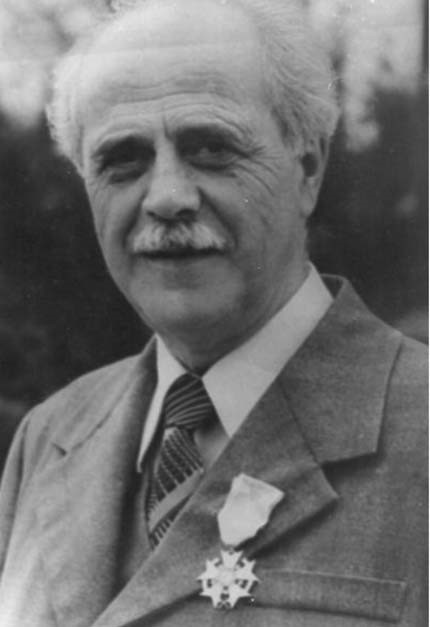
>   *Проф. Дечо Денев*

Проф. Дечо Денев посочи бюрото, което беше пред него, и ми каза:

&minus;От днес твоето работно място ще бъде тук. Ще бъдем заедно, един до друг, за
    да си спомняме по-често за учителските години, които са закваската на нашата
    сегашна университетска преподавателска дейност.

Останах приятно изненадан, но не знаех как ще посрещнат това останалите
преподаватели от катедрата, които бяха в съседната стая. Проф. Жечо Атанасов се
оплака, че в Софийския университет през последните няколко години са нахълтали
повече „специалисти“ по работата в четите „Чавдарче“, ДПО „Септемврийче“ и
Димитровския комунистически младежки съюз, каквито имало най-много в научния
институт „Тодор Самодумов“. Според тези „специалисти“ възпитателната работа в
тези организации трябвало да бъде основна в българското училище, защото чрез нея
се реализирали комунистическите идеи в образователната система. Именно тази
тенденция, застъпена и в университета от комсомолски и партийни деятели,
стеснявала обекта и предмета на педагогическата наука. В това отношение проф.
Жечо Атанасов спомена името на доц. Людмил Станоев, гл. редактор на сп.
„Проблеми на комунистическотовъзпитание“, орган на ЦК на ДКМС, както и неговото
обкръжение, което съвсем ненужно политизирало подготовката на педагогическите
кадри.

>   Проф. Жечо Атанасов се обърна към мен и ми каза:

&minus;Атанасе, твоите публикации разчупват тези рамки. Обхващат и извънучилищната
    сфера на възпитателната работа, която има непреходен характер. Съвсем
    правилно анализираш особеностите на възпитателната работа в извънучилищните
    институции. Затова интересът към тях на моите колеги, които са истински
    педагози, е голям. Продължавай тази насока в твоята научна работа, защото тя
    е занемерена в педагогическата наука.

През 1983 година излезе от печат книгата ми „Комплексни форми за възпитание на
учениците“, която се посрещна с изключително голям интерес от учителите в
страната. Студентите я имаха като настолна при подготовката си за
педагогическата практика.

Един ден партийният секретар в института ме срещна по коридорите и ме попита:

&minus;Защо в книгата ти липсва определението „комунистическо“? Това какво означава
    ?

Погледнах го и му отговорих с насмешка:

&minus;Възпитанието няма кръщелно за това название. То има дълбоки и далечни корени
    в историята на нашия народ.

През тези години определението „комунистическо“ присъстваше и в названието по
учебника, по който студентите се подготвяха за изпит. Тогава и учебните
дисциплини по естетика и етика също бяха прекръстени като марксистко-ленинска
естетика и марксистко-ленинска етика. В тях, както и в тогавашния учебник по
теория на комунистическото възпитание, всичко беше пронизано и свързано с
партийната политика на Българската комунистическа партия за утвърждаване на
марксистко-ленинските идеи.

Това, което ми каза проф. Жечо Атанасов за достойнствата на моите издадени
книги, ми даде кураж. Той ме помоли да му изпратя в София книгата ми „Комплексни
форми за възпитание на учениците“.Няколко дни след това получих следното писмо :

„Случи се тъй, че като получих книгите Ви, бях на легло. Но това пък ми
осигуряваше доста време да се запозная по-подробно с тях. Хубаво е, че имате
свой собствен терен за изследователска дейност. Това Ви дава предимство над
много „педагози въобще“, които са „специалисти по всичко“, а не умеят да се
вглъбяват. Вашата позиция Ви дава несъмнено предимство. Можете да се занимавате
с много съпътстващи и дори с по-странични въпроси, но изяснената гледна точка и
определеността на изследователското търсене дават възможност да изяснявате
неизяснени страни на всеки разглеждан проблем. Това постигате особено сполучливо
в постановката за комплексните форми за възпитание на учениците.“

*С поздрав: Ж.Атанасов*

Когато получих писмото, към него хвърли поглед и Петър Петров. Поиска да го
прочете, след което каза:

&minus;Дай да го публикуваме в списание „Педагогика“. Нека всички педагози знаят за
    твоите оригинални изследвания в педагогическата наука.

Още тогава Петър Петров беше несменяем заместник главен редактор на
комунизираното списание „Педагогика“. Той беше „безпартиен“, но зет на активен
борец против капитализма. Не се съгласих да публикува писмото на проф. Атанасов,
защото бях уверен, че неговата оценка за труда ми щеше да породи нова завист,
която може да ми попречи.

Така и стана след това. Заредиха се немалко опити за възпиране на устрема ми в
научната и преподавателската работа. Тогава се попитах:

&minus;Що за педагози са онези, които са завършили само педагогическия факултет в
    Софийския университет ?

През последните години от тоталитарния режим някои от тях бяха подготвяни
наистина, както каза проф. Жечо Атанасов, за педагози въобще, т. е. специалисти
по нищо. Истинските педагози имат и друга научна специалност. Може би аз бях
единственият от педагозите, който имаше завършено първо филологическо
образование с допълнителна специалност „Педагогика“. Така беше дори и в
тогавашния Съветски съюз. А у нас голяма част от тях бяха бивши комсомолски
деятели, затова във факултета по педагогика в Софийския университет се
подготвяха повече кадри като дружинни ръководители и комсомолски организатори.

Веднъж, минавайки през Свети Врач, заедно с проф. Денев, съпругата му проф.
Петрова и моя син Красимир, се отбихме за малко през брат ми Стоян, който също
избра просветния път на нашия прадядо Георги Зимбилев. На път за Благоевград
професорът не скри възторга си от него и ми каза:

&minus;Атанасе, брат ти има благ поглед и мъдра душа. На кого прилича?

&minus;На този, на когото носи името. Прадядо ми Стоян, който е бил свещеник, е
    известен като най-обичания в моето село заради кротката му и благородна душа
    – отговорих на проф.Денев .

&minus;А ти на кого приличаш?

&minus;Казват, че и аз приличам на дядо ми, на когото нося името. Той е бил
    македонски войвода.

&minus;Ето откъде идва твоята революционна жилка. Но внимавай, защото на няколко
    пъти ме питаха от някои служби как се държиш. Разбрах, че не те гледат с
    хубаво око и се сърдят, че си преподавател в института.

## 2. Хубаво начало

Благородството на проф. Дечо Денев спомогна за създаването на творческа
атмосфера в катедрата, която запази и доц. Мария Белова. След това, когато беше
избрана за зам.-ректор на института, тя настояваше и аз приех да бъда
заместник-ръководител на катедрата. Заедно започнахме да работим за
по-ускореното научно израстване на по-младите преподаватели в катедрата.

През м. септември 1984 г. деканът на Факултета за подготовка на начални учители
доц. Славчо Петков, който бе спечелил уважението и признателността на всички
преподаватели, изненадващо напусна института, но остави неизличими спомени за
своя професионализъм и хуманизъм. Със заповед на ректора бе възложено на доц.
Георги Стоянов да изпълнява длъжността декан, а на мястото на доц. Иван Киров,
който не издържа на игрите против него от тогавашния партиен секретар на
факултета Кирил Костов, бях назначен временно за зам.-декан до 1987, след което
преизбран на Общото събрание на факултета като такъв до м. ноември 1989 г.

Като зам.-декан по научно-изследователската работа съсредоточих усилията си към
разнообразяване и обогатяване по съдържание на изследователската дейност във
факултета и тясното ѝ свързване с по-качествената и ефективна подготовка на
учителските кадри.

За първи път в страната създадох курс за педагогическа преквалификация на
назначени учители, които имаха друга специалност, но нямаха педагогическа
правоспособност. Тогавашният главен секретар на Министерството на образованието
доц. Тодор Ангелов, който беше в нашия институт преподавател по съвместителство,
беше впечатлен от тази моя идея, която след това се прие и беше използвана в
цялата страна. Все още срещам първите участници в този курс, на които по тяхно
настояване станах ръководител. Те се изявиха като едни от най-добрите учители в
професионалните средни училища.

Още оттогава не приемах названието на т.нар. Инженерно- педагогически факултет,
открит от някогашния учител по ръчен труд Николай Божков, който беше израснал
скоростно под грижите на червения академик Сава Гановски. Самото название
предполагаше и изискваше основните дисциплини, които трябваше да се изучават от
студентите, да бъдат инженерни, а след това, за да се получи педагогическа
подготовка, да се изучават и педагогическите, от които най-много отделните
методики за преподаване. Но това не беше извършено във факултета.

През тези години започна да се изгражда новата академична структура на Факултета
за подготовка на начални учители под умелото ръководство на декана доц. Георги
Стоянов. Освен съществуващите катедри (начална училищна педагогика, теория и
методика на физическото възпитание, български език и литература,
словесно-изпълнителско изкуство, анатомия физиология и хигиена), бяха създадени
и нови (дефектология, чужди езици и история). Техни ръководители станаха
известните български учени проф. Любомир Тимчев, проф. Кирил Влахов и проф.
Маргарита Тачева.

Факултетът за подготовка на начални учители се утвърди като основно звено в
структурата на Висшия педагогически институт. Някои от катедрите в него
поставиха основите на бъдещите нови факултети (Историко-филологически,
Медико-педагогически и др.). Именно тогава започна и обявяването на конкурси за
преподаватели в онези факултети, чрез които се очертаваше бъдещата нова
структура на Висшия педагогически институт като предстоящ университет.

Като зам.-декан по научната работа едно от моите задължения беше подготовката и
провеждането на конкурсите. Няма да скрия, че една от основните ми задачи в това
отношение беше привличането на млади кадри от Пиринския край. Дотогава ми
правеше впечатление, че немалко от асистентите във Факултета за подготовка на
начални учители бяха от далечните окръзи на страната, които след това напускаха
или пък се преместваха в други висши училища.  

## 3. Първите удари под кръста

Когато в Катедрата по начална училищна педагогика бе открит конкурс за доцент по
теория на възпитанието, онези, които все още криеха своята завист към мен за
научното ми израстване, се чудеха как да възпрат избора ми. Неочаквано за всички
от катедрата и факултета излезе скроеният компромат „Първи срещи с
педагогиката“, публикуван на 26.04.1985 г. неслучайно във вестник, който беше
орган на ЦК на БКП. Намерен бе подходящ негов автор, който да изпълни поръчката
смело, без страх. Той произхождаше от ортодоксално комунистическо семейство. В
пасквила се твърдеше, че съм заплашвал студентите със страшния ден на изпита, че
конспектът, по който съм ги изпитвал, е бил различен от предварително
раздадения, че съм имал негативно отношение към онези студенти, които са деца на
партийни функционери.

Тези клевети бяха определени като чудатости в моята работа като преподавател. С
тази публикация злосторниците очакваха да бъде провалена кандидатурата ми за
доцент. Пасквилът се посрещна с недоумение от моите колеги във факултета. На
извънредно заседание на катедрата колегите отхвърлиха обвиненията от журналиста
срещу мен като неверни и тенденциозни твърдения (вж. протокол № 15 от 14.05.1985
г.).

– Защо точно сега, когато гл.ас. Попов е пред избор за доцент, излиза тази
нелепа публикация? Не е ли това преднамерена клевета срещу него?

Тези въпроси бяха поставени от няколко колеги, след което катедрата взе следното
решение:

„Катедрата по начална училищна училищна педагогика не приема оценката в
статията, характеризираща и окачествяваща работата на гл.ас. Попов като
преподавател. Проявите, които са посочени, не са характерни за него, не са негов
стил на работа“.

Факултетното и ректорското ръководство потвърдиха оценките на катедрата. В
специално изпратеното писмо от ректора до Председателя на Съвета за висше
образование пише:

„В институтския колектив материалът се схваща и като клевета, която цели п о л и
т и ч е с к и ефект“.

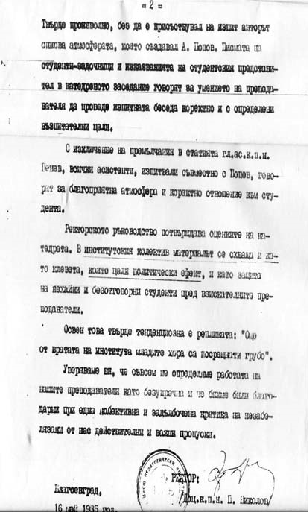

> *Писмото на ректора на Югозападния университет, изпратено до Председателя на
> Съвета за висше образование за публикацията срещу мен в орган на ЦК на БКП, с
> която се целеше да бъде прекъсната процедурата ми за доцент и уволнен като
> преподавател.*

Стана съвсем ясно защо именно преди избора ми за доцент клеветниците са
фабрикували пасквила. И този път се разминах със специално подготвен срещу мен
политически удар, какъвто получих и преди защитата на кандидатската ми
дисертация в Института за културно-просветни кадри.

По повод на публикуваната клевета срещу мен беше направена анкета със
студентите, резултатите от която ми бяха представени, за да се уверя, че те са
много доволни от моята преподавателска дейност. Когато заставах пред тях по
време на лекциите, те ме слушаха винаги с изключително голямо внимание. А по
време на почивките ме отрупваха с въпроси, свързани с възмущението им от
публикацията. От тях научих, че съпругът на една от колежките, който беше
журналист в местен червен вестник, често се явявал неканен при тях и ги
уверявал, че ще помогне на друг негов колега от централен вестник да се „удари“
съперникът на съпругата му, която беше моя колежка и е трябвало специално само
за нея да се открие процедура за доцент. В катедрата обаче се носеше слух, че е
обвинена в плагиатство, което след това се доказа и беше уволнена дисциплинарно
по предложение на ръководителя на катедрата доц. Мария Белова.

> *Това са част от отговорите на въпросите, поставени в анкетата към студентите,
> които подчертават спокойната атмосфера при изнасяне на лекциите и провеждането
> на изпита*

На 21 ноември 1985 г. бях избран с пълно мнозинство от Висшата атестационна
комисия за доцент по педагогика. Двамата с доц. Мария Белова (сега професор), тя
– като ръководител, аз – като зам.-ръководител, създадохме спокойна и творческа
атмосфера в катедрата. Като основна грижа имахме да се осигурят необходимите
академични условия за по-ускореното научно израстване на асистентите в
катедрата, някои от които бяха изостанали в своето развитие. Едни бяха зачислени
в аспирантура, а на други се ускори изборът им за кандидати на науките и
доценти. Бях заличил спомените за създаваните ми неприятности. Основната ми
грижа беше да укрепя авторитета на катедрата, която съвсем основателно се
определяше като „майка на института“, защото през нея минаха най-авторитетните
учени и от нея поетапно се създаваха новите специалности, които след това се
обособиха като самостоятелни факултети.

На 28 май 1986 г. от 17 часа в препълнената от колеги, студенти и гости от града
201 аудитория изнесох встъпителна лекция на тема: „Същност, специфика и
класификация на формите за възпитание“. Деканът на факултета доц. Георги Стоянов
произнесе вълнуващо слово, в което проследи жизнения ми и преподавателски път.
Казаното от него няма да забравя никога, защото бяха конкретизирани както
големите трудности, които срещнах в моя живот, така и успехите в научната и
преподавателската ми работа.

## 4. Тодор Живков на посещение във Висшия педагогически институт

През 1986 година, когато във Висшия педагогически институт вече се говореше
упорито за създаване на новата му структура по университетски образец, бяхме
изненадани от посещението на Тодор Живков, който беше заведен в новооткрития
Инжинерно-педагогически факултет, обявен за „образцов“.

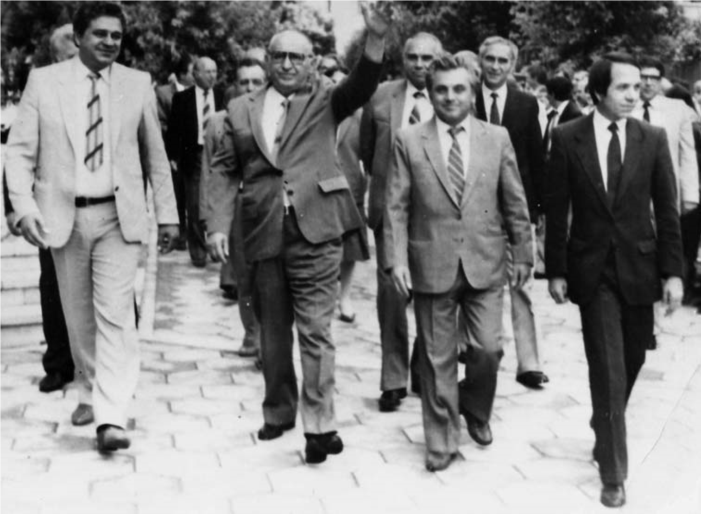

>   *Тодор Живков, Лазар Причкапов, проф. Петър Николов и доц. Николай Божков на
>   излизане от Инжинерно-педагогическия факултет*

Главен „герой“ при това посещение беше доц. Николай Божков, който заблуди не
само нас, но и тогавашните партийни ръководители, че е създал модерен факултет,
с нови, непознати дотогава специалности. Тодор Живков заяви тогава, че не бива
да се напъваме да правим университет, а стига ни това да подготвяме само детски
и начални учители и специалисти в Инженерно-педагогическия факултет. Тези негови
думи се посрещнаха с огорчение от нас, които имахме в мислите си вече новата
структура на института. Същата година на студентския празник във Висшия
педагогически институт пристигна и Милко Балев, който отговаряше в Политбюро на
ЦК на БКП за науката и образованието. След словото му пред студентите в
спортната зала раздаде дипломите на новоизбраните хабилитирани преподаватели в
института.

До 10 ноември 1989 г. голям плакат, направен по тази снимка с Тодор Живков,
стоеше окачен пред входа на Инжинерно-педагогическия факултет, където
продължаваха да идват все „отбрани“ партийни и държавни ръководители.

След специално подготвеното посещение на Тодор Живков в Инжинерно-педагогическия
факултет, започна съвсем осезателно, скоростно израстване на Николай Божков като
„несравним новатор“ в развитието на Висшия педагогически институт. Той вече се
чувстваше като непоклатим, на когото бе разрешено всичко. Това, което
пожелаваше, го имаше. За кратко време сградата на неговия факултет беше
препълнена с модерни материално-технически средства, повечето от които си
останаха неизползвани, а след това изчезнаха безследно, поради което тогавашният
партиен и държавен контрол направи няколко проверки, които бяха обаче стопирани,
защото галеникът на академик Сава Гановски беше недосегаем.  

## 5. Неочакваното преместване на гл.ас. Йордан Колев в Катедрата по начална училищна педагогика

На 05.06.1986 година на заседание на Катедрата по начална училищна педагогика
деканът на факултета доц. Георги Стоянов ни изненада, че ректорското ръководство
настоявало да се обяви „спешно“ конкурс за доцент на Йордан Колев от Катедрата
по предучилищна педагогика, която беше към друг факултет. В катедрата имаше само
42 часа упражнения, които бяха в повече, но за лекции нямаше часове, за да се
открие конкурс за доцент. При това положение един от тримата преподаватели по
история на педагогиката трябваше да бъде освободен. Забелязах разочарование от
декана на факултета доц. Георги Стоянов от кадровата политика в института, която
се направляваше от Окръжния комитет на БКП. Катедрата ни беше неприятно
изненадана от потайния напън на Йордан Колев „по спешност“ да нахълта в нашия
факултет. През това време гл. ас. Невена Филипова, преподавателка по история на
педагогиката, беше пред защита на кандидатска дисертация. Затова някои от
колегите смятаха, че напънът на Йордан Колев да се открие специално за него
конкурс е неоснователен. Доц. Мария Белова подчерта, че във Факултета по
предучилищна педагогика не се изучава дисциплината „История на педагогиката“,
т.е. Йордан Колев няма основание да пренебрегва вече натрупаната практическа
подготовка на двете асистентки по история на педагогиката в Катедрата по начална
училищна педагогика – гл.ас. Невена Филипова и Милка Терзийска. На това
заседание катедрата единодушно реши:

„Тъй като сега няма часове по история на педагогиката, няма нужда да се обявява
конкурс за доцент“.

Въпреки това решение на катедрата Йордан Колев тръгна, за да постигне целта си.
Аз бях силно изненадан от този подход на непознатия за мен Колев в неговата
научна кариера. Един от колегите ме уверяваше, че ако той нахълта в катедрата,
ще поведе напориста борба за заемане и на ръководни длъжности във факултета.
Разбрах, че както деканът доц. Георги Стоянов, така и ръководителят на катедрата
доц. Мария Белова подозираха какво може да се случи в катедрата, ако Йордан
Колев бъде преместен в нея. Може би затова те изпревариха с два-три месеца
незаконното му прехвърляне от Катедрата по предучилищна педагогика в Катедрата
по начална училищна педагогика и напуснаха Висшия педагогически институт.

Един ден доц. Георги Стоянов ми каза направо в очите:

– Пази се от него, Атанасе!

Той го познаваше и от него научих, че не е бил съгласен с тогаваш-
ното окръжно партийно ръководство, което е проявило авторитарно действие в
противовес с академичната автономия на Висшия педагогически институт.

След напускането на доц. Мария Белова бях избран за ръководител на катедрата, но
факултетният комитет на БКП задържаше издаването на заповедта за назначаването
ми. Така, без издадена заповед, изпълнявах длъжността ръководител на катедра в
продължение на три години. Може би една от подготвените ръководни длъжности за
Колев е била именно тази.

През октомври 1987 г. гл. ас. Йордан Колев по разпореждане на ректорското
ръководство, в нарушение на Закона за висше образование и Правилника за неговото
прилагане, беше прехвърлен в Катедрата по начална училищна педагогика за
преподавател по история на педагогиката и българското образование. Новият декан
на факултетът доц. Васил Стамов изпрати докладна записка за допуснатото
нарушение до ректора, но отговор не беше получен в продължение на две години.
През това време, без решение на катедрата, беше открита и процедура за доцентура
на известния тогавашен секретар по идеологическите въпроси на вузовския комитет
на БКП Йордан Колев.

Взаимоотношенията между преподавателите в катедрата, на която бях ръководител,
бяха спокойни до появяването на гл.ас. Йордан Колев. Преди това на заседание на
катерата бе обсъдено както неправилното преместване на Колев, така и откритата
му процедура за доцент. Нямаше решение нито на Катедрата по предучилищна
педагогика, нито и на Катедрата по начална училищна педагогика, както и на
факултетните съвети. По-късно тогавашният ръководител на първата катедра доц. Ф.
Даскалова в специално писмо от 31.03.1993 г. до ректора на университета даде
следния официален отговор:

„Катедра „Предучилищна педагогика“ не е обявявала никакъв конкурс (към датата на
издаване на заповедта). Никъде и никога катедрата не е заявявала – нито
официално, нито неофициално, необходимостта от назначаване на преподавател по
история на педагогиката към катедрата. Всъщност членовете на катедрата са
убедени, че обявяването на конкурса за доцент по история на педагогика в ДВ, бр.
23 от 24.03.1987 г. е направено по предложение на Катедрата по педагогика по
изричното настояване на проф. Белова и доц. Стоянов“.

От писмото на доц. Ф. Даскалова става съвсем ясно, че процедурата на Й. Колев не
е била открита и в Катедрата по предучилищна педагогика. Съвсем неоснователно тя
твърди обаче, че процедурата е открита в Катедрата по начална училищна
педагогика, защото на заседание на Катедрата по педагогикана 05.06.1986 г.,
както вече бе подчертано, бевзето следното решение:

„Тъй като сега няма часове по история на педагогиката, няма нужда да се обявява
конкурс за доцент“ (вж. протокол № 11 от 05.06.1986 г.), подписан от
протоколчика ас. Траян Попкочев, сегашен приятел на Колев от най-близкото му
обкръжение.

Това бе едно от поредните закононарушения, което е свързано с научната кариера
на секретаря по идеологическите въпроси във ВК на БКП Й. Колев, за което се
споменава в следните две докладни записки на декана на Факултета за начална
училищна педагогика доц. Васил Стамов.

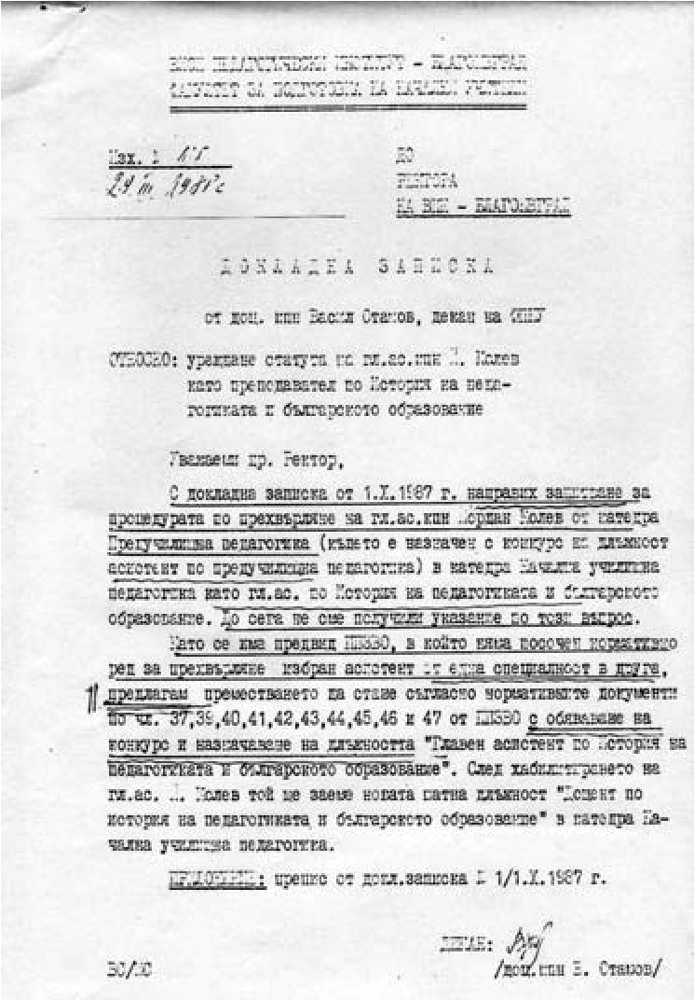

Заедно с незаконното прехвърляне на Й. Колев в катедрата, неочаквано за мен, от
НИИО „Тодор Самодумов“ бе спусната пак с партийно поръчение и н. с. Лиляна
Тодорова, известна като „специалист“ по теория и методика на ДПО „Септемврийче“
и четите „Чавдарче“. И за нея нямаше решение както на катедрата, така и на
факултетския съвет. През декември 1986 г. тя беше избрана от Катедрата по
начална училищна педагогика само като лектор по съществуващата тогава дисциплина
„Работа с четите „Чавдарче“.

Вече представил се на някои колеги в катедрата като секретар по идеологическите
въпроси на ВК на БКП във Висшия педагогически институт, Йордан Колеввъобще не се
вестяваше в катедрата. Когато гопопитах защо не идва на заседанията в катедрата,
той ми отговори високомерно:

&minus;Ти знаеш ли с кого разговаряш? Скоро ще разбереш. И тогава тежко и горко ти!

&minus;Е, кой си? – попитах го.

&minus;Направиха ми две предложения. Едното е свързано с борбата, която водя в
    партийното бюро срещу Никола Лазаров. Ще победя и ще бъда първи секретар на
    ВК на БКП в института. Така че внимавай как се държиш с мен. Не приемам да
    ми бъдат поставяни задачи. Такива аз ще поставям.

В института всички знаеха за тежката война за лидерското място във ВК на БКП
между Йордан Колев и Никола Лазаров. За да ги помирят, бяха дошли Хр. Христов и
Начо Папазов от ЦК на БКП. Никола Лазаров не издържа и заболя.

&minus;Кое е другото предложение? – попитах Колев.

&minus;То е още по-отговорно. Директорът на политическия затвор в Пазарджик Ангел
    Топорчев е повишен. Изпращат го в Централния затвор. Предлагат ми да заема
    неговото място.

Като чух за намеренията на Колев да стане директор на един от най-свирепите
политически затвори у нас, онемях. Разбрах, че до мен стои човек, с когото сме
от два различни свята. По-късно той отрече, че е споделил това с мен . На едно
от съдебните дела, което водеше срещу мен, представи удостоверение № 1363 от
22.10.1992 г. от затвора в Пазарджик, в което е написано, че „няма данни Йордан
Колев да е подавал документи за постъпване на работа в затвора за длъжността
директор на Пазарджишкия затвор“. По-нататък в писмото обаче се казва, че
назначаването на директорите на затворите се е извършвало от Главно управление
на местата за лишаване от свобода към Министерството на вътрешните работи,
поради което могат да се изискат данни от отдел „Кадри“ на ГУМЛС в София.

Та кой комунист в миналото представяше молба, за да заеме определено ръководно
място? Нали БКП изпращаше своите кадри там със специално поръчение.

По-късно в своя критичен материал „Врагове на демокрацията“ Кристина Илиева (в.
Век 21) направи анализ на публикациите на Й. Колев, отпечатани във в.“Съвремие“,
издание на общинския съвет на БСП в Благоевград. В една от тях (“О, времена, о,
нрави“), нахвърляйки се срещу страдалците от лагерите и затворите, Колев се
обръща към тях с думите: „Вие сте срам за човешкия род и трябва да изчезнете не
само от политическия живот“. Авторката възкликва: „И тази закана е изречена от
„учен“, който е призван да подготвя педагогически кадри! Ами ако наистина беше
станал някога директор на политическия затвор в Пазарджик, сигурно в човешкото
страдание щеше да има още един черен кръст „.

Най-после, неочаквано, Йордан Колев се появи на едно от заседанията на
катедрата. Когато другите колеги отчитаха своята дейност, вирналият надменно
глава мераклия за първи секретар на ВК на БКП, или пък за директор на
политическия затвор в Пазарджик, започна да се оправдава за несвършената работа,
свързана с изоставения кабинет по педагогика. Нахвърли се срещу ст. ас. Милка
Терзийска. По същия начин постъпи и с другата си колежка гл. ас.Невeна Филипова.
Когато някои колеги, без да се страхуват, му отправиха някои критични бележки,
той започна да говори за борбите, които води с негови колеги от партийния
комитет за първото място, което се гласеше да поеме там. Намесих се в техния
разговор и казах на Колев:

&minus;Не е необходимо да се правят изявления за водене на борби и за победи.
    Умолявам ви в Катедрата по педагогика да не водите подобни борби и да не
    настройвате хората, да не им давате лоши съвети, а да помогнете за
    сплотяването им (вж.протокол №12 от 06.12.1988 г. на катедра Начална
    училищна педагогика).

След това Колев премести неистовата борба от партийния комитет, за да стане
първи секретар на ВК на БКП, в катедрата. Започна потайно, както партията го
беше научила, да настройва някои от колегите срещу мен, да ги съветва какво да
се направи, за да се извърши преврат във факултета. Може би това е било и
поръчението на партията на Колев в навечерието на посткомунистическия преход,
който вече беше моделиран от неговите създатели. Към него се присъединиха
партийният секретар на Факултетният комитет на БКП Кирил Костов и някои от
членовете на партийното бюро. Направи ми впечатление, че Колев вече не плашеше
като евентуален директор на Пазарджишкия затвор, за ужасите в който научих много
от моя състрадалец Аксийски, когато бях в черната рота в Люти дол, Врачанско, а
се подготвяше за превземането на деканския престол във факултета.

И така, в катедрата, на която бях ръководител, се събраха двамата несменяеми
комсомолски и партийни деятели Й. Колев и Л. Тодорова. Не ми беше лесно да се
сработвам с тях. На когото не му се е случвало да работи заедно с бивши партийни
и комсомолски секретари, той нищо не знае за непоносимото тоталитарно време.

След като кацна в катедрата, няколко пъти Колев идваше в кабинета ми. Отначало
ми се оплака, че проф. Жечо Атанасов отказал категорично да му бъде рецензент.
Когато се срещнах с професора, той ми каза шеговито:

&minus;От Колев може да стане монтьор, но не и учен, защото в неговата дисертация,
    както и в няколкото му публикации, прави монтаж на чужди мисли и идеи, а
    няма свои.

Професор Атанасов ми напомни за отрицателната рецензия на проф. Вера Бойчева за
кандидатската дисертация на Йордан Колев, след което е бил специално назначен за
негов рецензент проф. Ангел Въков от Академията за обществени науки.

Приех молбата на Колев един от рецензентите му да бъде ст.н.с. Димитър Дончев,
за когото той настояваше, поради отказа на проф. Ж. Атанасов. Другият рецензент
проф.Елка Петрова вече беше подготвена от семейство Колеви. На няколко пъти
Дончев се срещна с мен и ме умоляваше да се помогне на Колев. Не знам как и по
какъв начин, но и той вече беше превзет.

Цели две години Йордан Колев бе почти „мъртва душа“ в живота на катедрата.
Оживяваше само тогава, когато се беше наканил да се заяде за нещо или да
подстрекава някого срещу мен.

Все още си остават неизвестни кукловодите на кадровите промени във Висшия
педагогически институт през годината на вътрешния преврат, който извърши
комунистическата партия в страната. Спомням си какво оживление имаше сред
партийния актив в института при организацията и подготовката на Общото събрание.
Гузни заради предишния си партиен актив, някои от тях се представяха за
перестройчици, т.е. за новите „демократи“. Именно те вече бяха подготовили
списъците на преподавателите, които трябваше да бъдат в новите ръководства на
института. Под достойнството ни беше да правим това, което те вършеха пред очите
ни за предстоящите избори. Гледах и не исках да повярвам, че университетски
преподаватели могат да имат такова поведение пред очите на студентите, които
обучават.

През тези трудни години имаше нещо, което ме вдъхновяваше в цялостното развитие
на Висшия педагогически институт. То беше тясно свързано с вече покълналите идеи
за прерастването му в университет. В това отношение ректорът проф. Петър Николов
безшумно беше впрегнал мислите си за разширяването на специалностите и
факултетите, които по-нататък станаха и основата за изграждането на
университетската структура на института. Още от тогава той приемаше с голям
интерес всяка идея в това отношение. Спомням си, че когато му изпратих моето
предложение за създаване на факултет по изкуствата, в който да се използва
постигнатото до тогава в Полувисшия институт за подготовка на
културно-просветгни кадри, той прояви изключително голям интерес към тази моя
идея и я подкрепи ревностно. Бях изненадан, че ректорът на няколко пъти
изпращаше писма, адресирани до него, но бяха предавани на мен, за да дам аз
отговор.

Това споделих с мой близък колега, който ми каза, че така ректорът проучвал
онези, които той търсил като заместник-ректори. Такова желание нямах при
създадената атмосфера в института.

Скоро по партийна линия се намери за зам.-ректор гл.асистент Димитър Милиев. Той
стана известен с „блокадното време“ в своя кабинет. Никой нямаше право да чука
на вратата му, за да не го безпокоят. Разнесоха се зли слухове за онези, които
се редували със специален пропуск да нарушават „блокадното време“. Все още пазя
оплакването на студентката Василка Лилова на цели две страници, която е
преживяла много неприятни изпитни терзания в кабинета с „блокадно време“.

Същият този зам.-ректор, който имаше „блокадно време“ в кабинета, се включи
активно в червените атаки срещу мен, заедно с жена му, която беше журналистка.  

## 6. Висшият педагогически институт имаше договорни взаимоотношения в чужбина само с педагогическите факултети на университетите в Москва и Петербург

През 1986 година беше завършено строителството на основната част на първия
корпус, където беше преместено ректорското ръководство. Някои недоумяваха и
обвиняваха неоснователно ректора Петър Николов, че бърза да се настани в новата
сграда преди да бъде преместен там някой от факултетите. След това обаче, когато
се поставиха основите и на другите сгради в този корпус, стана ясно, че ректорът
има голямата грижа за тяхното по-бързо изграждане, където да се преместят
факултетите.

Както още от създаването на Висшия педагогически институт, така също и след 1986
година продължиха взаимните посещения на преподаватели от нашия и сродните
педагогически факултети в Петербург и Москва. Бях приятно изненадан от
признанието на колегите от чужбина, че дадоха висока оценка на някои от моите
монографии, в които за първи път в педагогическата наука изяснявах конкретно
основните компоненти в структурата на възпитателния процес, както и техните
връзки и взаимоотношения. Никой дотогава не бе изследвал, например, същността,
спецификата и жанровото разнообразие на формите за възпитание, чрез които се
оказва конкретното възпитателно въздействие .

През началото на 1987 година постъпи предложение от Педагогическия факултет на
Петербургския университет за обмяна на моя опит, свързан с последните ми научни
изследвания. Със заповед на Министъра на народната просвета проф. Димитър Бучков
бях изпратен за 45 дни в Педагогическия институт „Херцен“. Получи се парадоксът,
че се водех на специализация по темата „Формата за възпитание като педагогическа
категория“, а руските колеги все още нямаха задълбочени изследвания в тази
област. Именно затова вместо аз да проучвам техния опит, те се запознаваха с
моя.

Един ден проф. Зинаида Василева, ръководител на Катедрата по педагогика, ми
каза, че т.нар. „страшилище“ в педагогическата наука академик Г.И.Щукина е
научила за някои от моите научни изследвания и иска да се срещнем. Когато
започна разговорът ми с нея, я попитах:

&minus;Академик Щукина, а защо все още и вие бъркате, а понякога и неправилно
    уеднаквявате някои от компонентите на възпитателния процес, каквито са
    средствата, методите и формите, които имат относително самостоятелно място в
    структурата на възпитателния процес и специфично семантично значение.

    Щукина сви вежди. Професор Зинаида Василева погледна към мен и повдигна
    ремене като знак на учудване. Разбрах, че трябва и двете да ги убедя, че
    тези понятия не бива да се уеднаквяват. Дадох конкретен пример. Казах, че
    художественото слово е средство, а един от начините на неговото използване е
    рецитирането, което е метод, а рециталът е формата на възпитателно
    въздействие, която ги включва в своята структура.

След този пример, който дадох академик Щукина промени погледа си.

Стана, приближи се до мен и ми каза:

&minus;Много сте точен и убедителен. Вие сте филолог, нали ?

&minus;Да, първо завърших българска филология, а след това педагогика.

&minus;За всеки истински педагог това е най-доброто съчетание – каза Щукина, след
    което продължи да ме разпитва за последните ми научни изследвания.

Показах ѝ ръкописа на монографията, която подготвях за печат. Помоли ме да я
оставя, за да я разгледа по-задълбочено. Прочете на глас заглавието
„Комплексно-интегративният подход във възпитанието“ и се обърна към проф.
Зинаида Василева. Поклати глава и каза:

&minus;Василева, Атанас и тук търси разликата в семантиката на понятията, които ние
    понякога бъркаме. И не само ние, а и някои от другите наши колеги.

Наистина, тогава, според мен, неправилно се уеднаквяваха определенията
„комплексен“ и „интегративен“. Затова по-късно моите рецензенти високо оцениха
научните стойности на монографията ми „Комплексно-интегративният подход във
възпитанието“.

През пролетта на 1988 година по инициатива на Катедрата по педагогика и
Министерството на народната просвета подготвихме и проведохме научно-практическа
конференция, посветена на проблемите на подготовката на бъдещите учители, които
се очертаваха съвсем явно при условията на започналите промени и в
общественополитическия живот у нас. Участваха и преподаватели от сродни висши
институти от бившите социалистически страни Чехия, Унгария, Германската
демократична република и някои от съветските републики. На тази конференция се
прокраднаха и идеите за промяна на силно политизираната педагогическа подготвка
на студентие, която се осъществяваше от преподавателите по идеологически
дисциплини. В нашата катедра пристигна като гост проф. А. Габронидзе от
Батумския държавен педагогически институт. Тогава беше изляза монографията ми
„Форми за възпитание“. На бюрото имах само сигналната първа бройка. Гостът ми се
вторачи в нея и ми каза:

&minus;Даваш не даваш, вземам я! Такъв научен труд у нас все още няма!

На следващия ден на научната конференция пред всички участници той призна, че е
извършил „кражба“ от моя кабинет като взел сигналния брой на монографията ми.
Гостът подчерта, че „в теорията на обучението е известно, че основната форма на
обучение е урокът, но в теорията на възпитанието такова изследване за формите на
възпитание не е направено“.

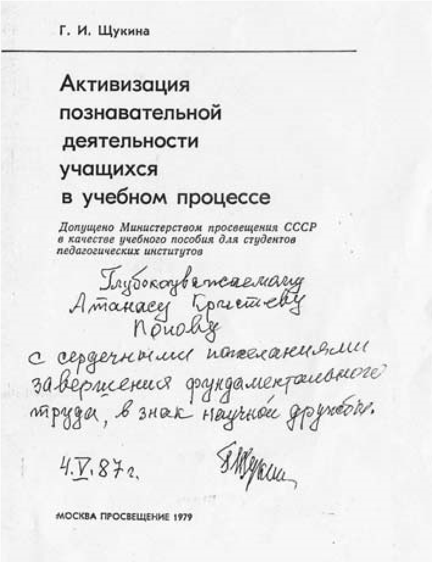

>   *В автографа, който ми даде на своята книга, Г.И.Щукина определи моногрфията
>   ми „Комплексно-интегративният подход във възпитанието“ като фундаментален
>   труд в педагогическата наука*

След конференцята проф. Габронидзе ме попита не се ли страхувам, че съм
„захвърлил“, както каза той, определението „комунистическо“ в заглавието на
монографията ми „Форми за възпитание“. Усмихнах се, защото бях вече дал отговор
на този въпрос на партийния секретар в нашия факултет. Той ме хвана за рамото и
прошумоли в ухото ми:

&minus;Смелчага си ти, колега! И все пак, пази се!

След това в сп. „Народное образование“ от 28.06.1988 г. в своя публикация проф.
Гобронидзе пише: „На протяжении прошедших 70-ти лет можно было сделать гораздо
больше. Например, в теории обучения известно, что основной формой обучение
является урок, но в теории воспитания такое еще не установлено и были
интересными, в етом плане, поиска болгарского ученого доцента Атанаса Попова,
каторый работает как раз над этими актуальными проблемами“.

През следващата година бях поканен, заедно с проф. Марин Андреев и доц. Тодор
Ангелов, на международна научна конференция в Москва, където се представих с
доклад на тема: „Възпитанието като обществено явление“. И тук за моя приятна
изненада бях посрещнат с изключително внимание от всички участници в
конференцията, които бяха представители от различни европейски страни. Тогава
вече перестройката в Русия беше започната и смело се споделяха новите идеи,
свързани с проблемите на възпитанието. Моят доклад беше след основния доклад на
конференцията. В него разглеждах интегративните връзки и взаимодействия на
възпитанието като обществено явление с политиката, правото, морала, религията и
изкуството. Бях отрупан с въпроси, предизвикани от решителността ми да разкрия
пакостното свързване на възпитателния процес в бившите социалистически страни
единствено с политиката на комунистическите партии.

След разгорещените разисквания трима от руските колеги ме помолиха да се срещнем
през следващия ден, за да продължим разговора по предизвикателната тема на
„сигурно място“. При мен дойде тогавашният гл.секретар на Министерството на
просветата доц. Тодор Ангелов и ми каза:

&minus;Моля те, внимавай, защото и тук ги има такива като тези, които в България те
    дебнат непрекъснато!

Това беше времето на т.нар „гласност“ и „перестройка“ в бившия Съветски съюз,
когато след дългогодишната цензура и ограничаване свободата на словото вече
можеше да се изразява свободно собствено мение. У нас обаче Държавна сигурност и
партийната номенклатура продължаваха да преследват „враговете на народната
власт“, които изразяваха собствено мнение в това отношение. Като такъв бях
вписан в техните оператавни дела и списъци.

Забелязаните промени в Русия ми даваха все по-голям кураж в преподавателската ми
работа. Правех съпоставка на това, което видях там, и това, което продължаваше у
нас. Никога няма да забравя това, което ми се случи при едно от следващите ми
посещения в Москва по покана на Московския държавен педагогически институт,
когато с проф. Димитриев подготвяхме съвместния научен сборник „Формиране на
социалноактивна личност в начална училищна възраст“, публикуван по-късно през
1993 година.

Един ден, привечер, проф. Димитриев ме заведе в центъра на Москва, западно от
Кремъл, където беше „бунтарската“ улица на московчани „Арбат“. Там се струпваха
много хора, недоволни от съветската власт. Гледах тези „непокорници“, слушах
гневния им глас и си мислех за все още непокътнатия режим на Тодор Живков в
България. Не се сдържах и на чист български език се провикнах:

&minus;Защо? Защо и у нас няма още улица „Арбат“?

Един телевизионен екип тръгна към мен и камерата на оператора се изпречи
пред лицето ми. Професор Димитриев свали шлифера си и ме покри с него. Скри
ме и уплашен ми каза:

&minus;Атанасе, пази се! Като бях при вас в Благоевград, научих, че вашите партийни
    ръководители не те обичат. Някои ми казаха да не ти се доверявам много,
    защото не си бил „наш човек“.

Проф. Димитриев беше напълно прав. Съвсем явно наруших строгото изискване на
партийното ръководство да съгласувам дейността си с него.

През 1988 и началото на 1989 година забелязах уплах от промените в страната у
някои от секретарите и членовете на ВК на БКП в университета, партийните бюра
във факултетите и т.нар. групови отговорници в отделните катедри.

На 9.10.1989 г. преселеният с партийно поръчение в нашата катедра Йордан Колев
подаде молба до ректора на университета за издаване на служебна характеристика
за участие в конкурс във факултета за начална училищна педагогика в София. Някои
от колегите в катедрата дойдоха при мен и ми казаха, че той се уплашил като
доскорошен секретар по иделогическите въпроси във ВК на БКП в университета от
промените в страната и е решил да се скрие в София при някои от неговите
приятели.

Презтова време Окръжният комитет на партията беше привикал своите кадри от
университета и ги беше уверил, че промените в страната пак ще ги направи
партията майка. Тогава Колев се успокои и се отказа от конкурса за преместването
му в София. Двамата със секретаря на партийната организация във педагогическия
факултет Кирил Костов получиха конкретни задачи, свързани с кадровите промени в
университета, които започнаха да изпълняват заедно с първия секретар на
вузовския комитет на партията Димитър Стоилов и Николай Божков, които след това
поведоха специално подготвени студентски групи на протестни шествия като
перестройчици.  

## 7. Червеното лице на „перестройката“ във Висшия педагогически институт

Началото на новата учебна 1988-1989 година започна в напрегнато очакване на
промените, които се извършваха в цялостния живот в страната. В нашия институт
поутихнаха партийните боричкания за първото място във Вузовския комитет на БКП.
Перестройката сепна членовете на партията и те често се събираха, за да обсъждат
новите директиви, според които те трябваше да изпълняват вече ролята им,
свързана с преоценка на „развитото социалистическо общество“ и поемане пътя към
демокрацията, но моделиран пак от тяхната партия.

Цялата учебна година мина неспокойна във Висшия педагогически институт.
Партийните и комсомолските организации изпълняваха повече новите задачи,
поставени от ЦК на БКП, отколкото актуалните проблеми в образователния и научен
процес. Те подготвяха своето ново място в управлението на института, но вече
като „перестройчици“.

Борбата на комунистите и комсомолците в института за превземането на ръководните
места в катедрите, факултетите и ректората започна с ускорени темпове. През м.
октомври 1989 г. се проведе в 201 зала Общото събрание на Висшия педагогически
институт. Градският комитет на БКП взе активно участие в неговата подготовка за
избор на ново ректорско ръководство. Ректорът проф. Петър Николов направи
задълбочен анализ на учебната, научната дейност и на започнатото разширяване на
материалната база на института.

Анализът в доклада на ректора даде основание да се обсъждат перспективите в
развитието на Висшия педагогичски институт. В това отношение се очертаха две
основни становища.

Едното бе свързано със запазването на педагогическия профил, а другото – със
създаването и утвърждаването на нови специалности и факултети, които да оформят
университетския облик на института. Първото становище поддържаха повечето
преподаватели, които бяха завършили специалност „Педагогика“ в Софийския
университет, а другото – онези, които имаха получено друго висше образование и
бяха с по-широк поглед в образователната система. Моето становище беше вече
изразено в подкрепа на онези колеги, които бяха за създаване на университетска
структура на Висшия педагогическия институт. Завършилите само педагогическия
факултет в Софийския университет, който подготвяше и „специалисти“ като
ръководители на четите „Чавдарче“, ДПО „Септемврийче и комсомолски организатори
шумно и напористо защитаваха единствено педагогичските специалности.

На това Общо събрание бяхме един до друг с проф. Илия Конев, който беше отскоро
назначен за преподавател в специалността „Български език и литература“. Често
разговаряхме с него за прадядо ми Георги Иванов Зимбилев. Като изявен
изследовател на Възраждането в България Конев познаваше неговото просветно дело
в Източна Македония, където създава първите новобългарски училища.

Когато започна изборът за Академичен съвет, споделих с него, че няма да бъдем
избрани няколко преподаватели, от които „перестройчиците“ от партийния актив се
страхуваха. Техните „десетари“ вече бяха манипулирали по-голямата част от
преподавателите. Той не искаше да повярва. Но след като съобщиха резултатите от
избора, ме погледна и попита : – Как може? Това е безумие!

Не му дадох отговор, защото трябваше да му призная, че предусещах обезличаването
на академизма от онези, които партията на комунистите смяташе за свои верни
синова и дъщери. На нас, безпартийните, тя гледаше като на врагове, без които
обаче все пак не можеше.

Наистина, в Академичния съвет не бяха избрани едни от най-изтъкнатите
преподаватели в института, които не членуваха в комунистическата партия, измежду
които чл.кор. Евгени Головински, проф. Трифон Трифонов и други изтъкнати учени.
Един от неизбраните бях и аз. Проф. Конев ме погледна с недоумение и прошепна:

&minus;Кой направи тази чистка?

Той още не искаше да повярва, че „перестройчиците“ грижливо подготвиха всичко.
Те бяха кукловодите на прехода в института.

Познавах проф. Конев като изтъкнат български учен, известен и в чужбина. Освен
това се отличаваше със завидна нравствена култура. Затова го помолих да се
изкаже. Той се притесни и ми каза, че чувства неудобство, заради това, че все
още е непознат. Но все пак се реши и направи мъдро изказване, в което наблегна
на необходимостта от превръщането на педагогическия институт в университет.

На първото Общо събрание на Висшия педагогически институт бяха предложени
кандидати за ректор от ОК на БКП, но те не бяха избрани. Тогава няколко колеги,
незабелязано от „перестройчиците“, издигнахме кандидатурата за ректор на проф.
Илия Конев, но без одобрението и съгласието на ОК на БКП това не можеше да
стане. Именно затова Общото събрание се отложи, след което присъстващият
секретар на Общинския комитет на БКП Йордан Топалов започна проучването за проф.
Илия Конев.

На 8 ноември 1989 г. професор Илия Конев беше избран единодушно за ректор от
повторно проведеното Общо събрание. Първите дни на новото ректорско ръководство
на Висшия педагогически институт съвпаднаха с големите промени в страната,
моделирани предварително от БКП, които се определят като началото на прехода от
тоталитарно към демократично развитие на страната. Този „преход“ в нашия
институт беше подготвен от бивши партийни и комсомолски секретари.

Още през първите дни като ректор проф. Илия Конев предизвика необходимата
проверка на материалното имущество на Висшия педагогически институт. Отдавна се
говореше за присвоени и пренесени в апартаментите на някои преподаватели битови
предмети и ценна апаратура, която новият ректор настояваше да бъде върната. Но
това нареждане не беше изпълнено. То обедини засегнатите, които тръгнаха на
„поход“ срещу новия ректор.

Когато проф.Илия Конев започна истинската подготовка за откриване на нови
факултети и обновяването на някои специалности, което беше изключително важно
условие за превръщането на Висшия педагогически институт в университет, т.нар.
„педагози въобще“ открито се обявяваха против тази идея и заявяваха, че е
по-добре да си останем като педагогически институт. С такъв призив скандираха и
заблудени студенти, които бяха зомбирани от несменяемия декан на
Инженерно-педагогическия факултет доц. Николай Божков, който понякога ги
подкрепяше с пържоли, банички, цигари и бира. Галеничето на Сава Гановски
опъваше двата си пръста и беше водач на студентските и преподавателски походи в
Благоевград срещу комунистите, на които вярно и предано служеше само допреди
няколко месеца.

Един ден проф. Конев дойде при мен и скришом ме вкара в неговия кабинет, защото
перестройчиците го дебнеха на всяка крачка.

&minus;Атанасе, липсваш ми! Трябват ми такива преподаватели като теб, с които да
    направя пътя към университетската структура на Висшия педагогически
    институт. Сега разбирам защо те отхвърлиха от състава на Академичния съвет.
    Те се уплашиха, че ще те направя един от моите заместници. Ти си силен и
    имаш възрожденска закваса, каквато сега ни е толкова необходима. Няма да
    скрия, че мисля как да го направя това и сега.

Слушах проф. Конев и се взирах в уплашения му поглед. Той беше с вързани ръце и
прикована мисъл. Какво можеше да направи, за да осъществи хубавите си идеи,
когато срещу него всеки ден започнаха да се публикуват пасквили в местния
периодичен печат. Перестройчиците превзеха и студентския вестник „Обектив“, на
който главен редактор стана Никола Стоянов, политически сътрудник на секретаря
на ОК на БКП Лазар Причкапов. В редакционната колегия беше секретарят по
идеологическите въпроси към ВК на БКП Йордан Колев, както и някои други
комунисти. В една от поредните публикации срещу ректора в студентския вестник се
използваха тежки, непоносими обидни квалификации. Злосторниците стигнаха до там,
че смениха фамилното му име Конев с „Магарев“.

Въпреки големите трудности проф. Илия Конев успя да проправи пътя за създаването
на Югозападния университет. Направи предложение пред Министерството на науката и
висшето образование за обявяване на решение за университетска структура.
Прескочи се обаче предвидената в закона процедура, която изискваше решение на
Народното събрание за признаване на Висшия педагогически институт като
университет.

Когато проф. Конев изпрати писмото до Министъра на науката и висшето образование
проф. Георги Фотев с молба да предложи на Президенството, Великото народно
събрание или Министерския съвет да бъде издаден Указ за утвърждаването на
Югозападния университет, ми донесе копие от писмото. Разгледах го и му казах:

&minus;Професоре, според мен само Народното събрание може да вземе решение за
    утвърждаване статута на нашия университет. А сега там още не ни разпознават
    като сериозни кандидати. Трябва да се търси сигурно лоби.

Проф. Конев ме хвана за рамото, погледна ме в очите и отново ме помоли да му
помогна, да се съглася да се заема с тази нелека задача. Уверих го, че заради
мен червените ще настръхнат и ще го провалят като ректор.

&minus;Атанасе, кажи на кого да се опра? Всички са настръхнали срещу мен. Трябват
    ми истински помощници, за да довършим хубавото дело докрай.

През есента на 1990 г. проф. Илия Конев предложи на обсъждане наименованието и
патрона на бъдещия университет. Постъпиха различни предложения, но най-подходящо
се оказа становището на ректора и на двамата специалисти по история на
педагогиката доц. Георги Стоянов и проф. Вера Бойчева, които твърдяха
убедително, че патрон на Югозападния университет трябва да бъде патриархът на
българската просвета и образование Неофит Рилски, роден в град Банско.

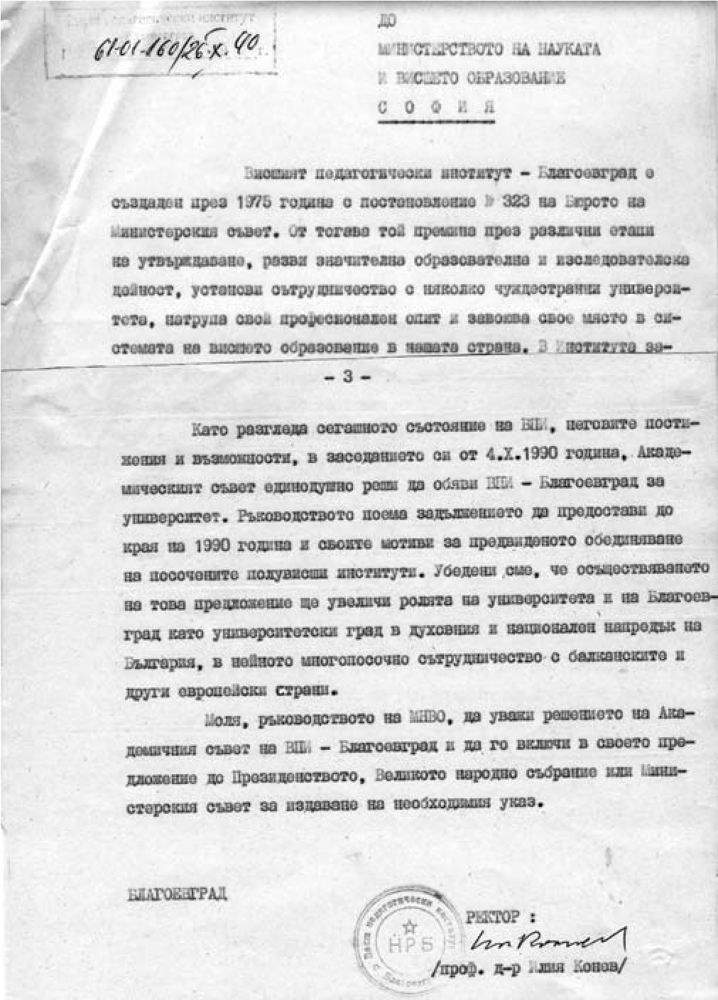

> *Писмото, което изпрати проф. Илия Конев до Министерството на науката и висшето
> образование с предложение да се уважи решението на Академичния съвет за
> обявяване на Висшия педагогически институт за университет*

И така, през 1990 година Академичният съвет гласува единодушно по предложение на
ректора Илия Конев наименованието „Югозападен университет „Неофит Рилски“.

## 8. Превратът, организиран от комунистите в Педагогическия факултет

На 29 ноември през 1989 г. се проведе Общото събрание на Факултета за подготовка
на начални учители. То бе специално подготвено от Факултетния комитет на БКП. В
навечерието на събранието беше направена анкета сред преподавателите от
факултета, в която трябваше да се даде отговор на въпроса: „Кой според вас
трябва да бъде избран за декан на факултета?“ Моето име посочиха най-голям
процент от анкетираните преподаватели и студенти. Това постави в тревога
факултетния комитет на БКП, който разработи подробен сценарий, по който трябваше
да се извърши подготовка за избор на декан от комунистите във факултета.

В отчетния доклада на декана доц. Васил Стамов бяха отразени някои сериозни
нарушения на академичната атмосфера във факултета от преподаватели, между които
имаше и членове на бюрото на факултетния комитет на БКП. Специално място беше
отделено на незаконното прехвърляне на Йордан Колев от специалност „Предучилищна
педагогика“ в специалност „Начална училищна педагогика“, което беше в нарушение
на Закона за висше образование и Правилника за неговото спазване. Отчетено бе,
че в продължение на две години той не е заемал работното си място в катедрата.

По време на Общото събрание секретарят на ФК на БКП Кирил Костов прескачаше от
човек на човек, за да подготви избора на техния кандидат за декан. Йордан Колев
се появи една-две минути преди закриването на събранието, когато вече беше
постъпило предложение да се прекъснат изказванията. Специално подбраният водещ
на събранието от факултетния комитет на БКП проф. Ал. Маджаров, известен като
номенклатурен кадър на ЦК на БКП, имаше определена роля по сценария, възложена
му от партийното бюро на факултета. Той често поглеждаше към входната врата.
Личеше, че е неспокоен. Най-после се появи този, когото видимо очакваше.

Йордан Колев се доближи до проф. Маджаров и му прошепна нещо, което никой не
разбра. Но всичко стана ясно, когато беше дадена думата на секретаря по
идеологическите въпроси на Вузовския комитет на БКП. Всички чуха необузданото
слово на мераклията за декан на Педагогическия факултет.

Колев започна словото си с думите:

&minus;Колеги, аз изчаках да свършат градивните изказвания и затова закъснях,
    защото вие ще разберете от изказването ми, че не мога да бъда градивен...
    (вж.стенограмата от заседанието на Общото събрание на ФПНУ, състояло се на
    29.11.1989 г.).

Подготвените да направят преврат във факултета вече постигнаха първия си успех
още на Общото събрание на университета, на което в резулатат на изключително
активната им дейност аз и другите от предишното деканско ръководство не бяхаме
избрани в Академичния съвет.

По-нататък „ораторът“ Колев специално продължи цял час своето екзалтирано
изказване, което преливаше от жлъчни, нечестиви, неприсъщи за университетски
преподавател думи и изрази. Отправи клевети и лъжи срещу цялото деканско
ръководство и някои други колеги от факултета. Слушах го спокоен и си спомних
казаното от проф. Ж. Атанасов, че “от него не става учен, а само монтьор или пък
партиен пропагандист“. Сетих се и за думите на един от моите колеги, че след
като Колев стане доцент, ще забрави как е хленчил за помощ и ще започне неистова
война срещу мен. Жлъчното, арогантно и свадливо слово на Колев завърши с
призива:“Вашето време изтече! Внимавайте, колеги. Аз имам платформа!“

В своето „партийно“ слово ораторът се издаде, че партията му е подготвила
„шамара“, който сме получили с изолирането ни от Академичния съвет. Не отмина
обаче оспорваната и определена като неправилна процедура, свързана с неговото
прехвърляне от една спецалност в един факултет в друга специалност в друг
факултет. Издаде се, че това е било „партийно поръчение“ и заяви с гордост:

&minus;Това е линия на ОК на БКП. Четиринадесет човека бяхме поканени главни
    асистенти, кандидати на науките, с цел да ни се даде възможност по-бързо да
    се хабилитираме, за да заемем ръководни длъжности.

Партийният лидер Колев се оплака, че аз не съм уважавал нито партийното бюро на
факултета, нито партийната група на катедрата и не съм се отзовавал на техните
покани за разговори, с което съм явно изразявал моята антипартийна линия в
работата ми като зам.-декан и ръководител на катедра.

Нужни са истински нравствени ценности и утвърдена, проверена академична култура
на поведение, за да се издържи пред подобни необуздани хули и клевети.
Изказването на Колев беше жлъчно, арогантно, свадливо. Слушах го и оживяваха в
паметта ми онези минути, когато Колев идваше често при мен съвсем друг –
подгърбен и с тих, кадифен глас, но с издаващи своята хитрост очи, ме молеше за
помощ. Мълчах и си мислех за морала на комуниста Колев.

Партийната организация във факултета беше вдигнала на крак всички нейни членове.
С помощта на специално подготвеното екзалтирано слово на Йордан Колев тя
постигна „пирова победа“. В състава на Факултетния съвет не бе избран нито един
от предишното деканско ръководство. Мечтата на Колев се сбъдна. Той беше уверен,
че ще бъде новият декан на факултета.

На следващата сутрин, след проведеното бурно Общо събрание, превзето от
комунистите във факултета, в кабинета ми дойде колежка, която като ме погледна,
се разплака и ми каза:

&minus;Страхувам се, че ако Йорда Колев бъде избран за декан, ще превърне факултета
    ни в червена крепост. Вие сте силен, много силен, щом издържахте на ударите
    на комунистите. Другите от деканското ръководство ги няма, а вие сте на
    работното си място, както винаги пръв и спокоен.

&minus;Имам закалка, колежке! Те друго не могат, освен да нанасят удари срещу своя
    враг. На това ги е научила партията им. Техните удари обаче не ме плашат,
    защото знам, че се страхуват от мен.

На 27.10.1989 г. от 14 часа след обяд се провежда второто по ред заседание на
Факултетния съвет за избор на декан. Заседанието се ръководи не от който и да е,
а от дясната ръка на Йордан Колев – доц. Лиляна Тодорова, която преди да бъде
назначена в нашия институт, беше известна като комсомолски деятел и специалист
по проблемите в ДПО „Септемврийче“ и четите „Чавдарче“.

Доц. Иван Кадийски напомня за другата точка, вписана в поканата, свързана с
докладната на бившето деканско ръководство за закононарушения, фалшификации и
дисциплинарни нарушения на преподаватели от мандатния период, които се отнасят
за онези, които сега вече превзеха Факултетния съвет и очакват да оглавят
неговото ръководство. Ректорът проф. Илия Конев потвърждава, че е получена в
ректората такава докладна записка и е решено да се сформира комисия, която да
провери за достоверността на изнесеното в нея. Но след това всичко се покрива.
На предишното заседание кандидатурата на Йордан Колев за декан, по негово
признание, е била издигната от обществените организации, т.е. от партийния
комитет на факултета, но въпреки това не бил избран.

На последното заседание на факултетния съвет са предложени няколко кандидати за
декани (проф. М.Тачева, гл.ас. Виолета Боянова и др.), но те си дават отвод. Не
си дават отвод само бившите комсомолски и партийни деятели Йордан Колев и Лиляна
Тодорова, които се надпреварват за деканското място. Какъв парадокс! Това са
онези, за които се подчертаваше в доклада на предишното деканско ръководство за
допуснати груби нарушения при тяхното незаконно прехвърляне в този факултет и
закононарушения при научното им израстване.

По подготвения сценарий от факултетното партийно ръководство Йордан Колев е
избран за декан, а Лиляна Тодорова, гл.ас. Михо Михов и гл.ас. Кристина Попова –
за зам.-декани.

Това бяха дните, когато се постави началото на вече подготвения от ЦК на БКП и
Държавна сигурност посткомунистически преход в България. Комунистите и
комсомолците започнаха да окупират катедрените, деканските и ректорското
ръководство на нашия университет.

Още при незаконното преместване на Йордан Колев от Факултета за предучилищна
педагогика в Педагогическия факултет някои преподаватели напуснаха Катедрата по
педагогика. Доц. Мария Белова и доц. Георги Стоянов се преместиха в Софийския
университет. След това, когато новият декан и партийният секретар се развихриха
като победители в битката за овладяване на ръководството на Педагогическия
факултет, трима колеги от Катедрата по физическо възпитание също напуснаха
преподавателската си работа. Неочаквано две от колежките, асистентки по история
на педагогиката от нашата катедра, ги последваха. Изчезнаха и някои
преподаватели от Педагогическия факултет, които бяха на трудов договор. Един от
тях дойде при мен и ми каза:

&minus;Доц. Попов, очаквайте ново попълнение във вашата катедра, което е от
    червения цвят. Новият декан вече го е подбрал.

С участието на общинския съвет на БСП в Благоевград Йордан Колев фабрикуваше
фалшификати срещу мен и завеждаше съдебни дела, които се проваляха едно след
друго. Това бяха двете „опорни точки“ по които се водеше борбата от червените
срещу мен. Един от тогавашните съдии ме попита:

&minus;Защо не го съдите? Той ви нанесе толкова тежки, незаслужени обиди и клевети,
    заради които може да получи немалка заслужена присъда.

И мои добри приятели ми даваха този съвет, но аз не го приемах, защото беше под
достойнството ми да съдя един школуван от комунистическата партия несменяем
партиен секретар. Като такъв Колев се определя сам в своята автобиография.

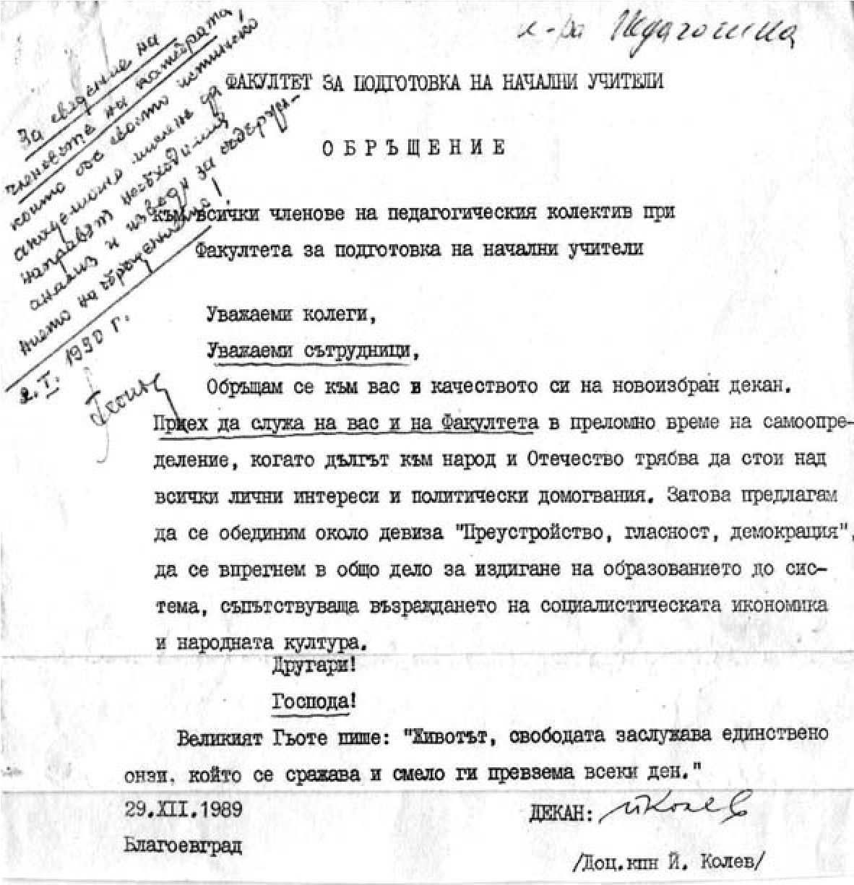

> *Още от първите дни жадуващият за деканския престол Йордан Колен излезе с
> обръщение към всички членове на педагогическия колектив при Факултута за
> подготовка на начални учители, в което ги призова „за издигане на образованието
> до система, съответстваща възраждането на с о ц и а л и с т и ч е с к а т а
> икономика и народната култура“. На първо място в обръщението се обърна към
> своите „другари“.*

## 9. Неистова борба за новото ректорско място

През тези тежки, непоносими от напрежение дни ректорът проф. Конев продължаваше
да настоява упорито да приема предложението му да бъда назначен за негов
заместник, въпреки че не бях вече член на Академичния съвет. Веднъж той изпрати
секретарката си, за да поговорим в кабинета му. Една от вечно слухтящите от
ръководството на факултетния комитет на БКП почти изкрещя:

– Ректорът пак го вика в кабинета си! Той сигурно ще му даде някаква ръководна
длъжност.

Когато обаче разбра, че отказах поканата на ректора, тя се успокои и побягна към
събралите се наблизо членове на партийното ръководство, за да успокои и тях.

Въпреки поставеното хубаво начало от новия ректор, фронталните атаки срещу него
не престанаха. Техни инициатори бяха перестройчиците и няколко „бойни“
студентски групи, подготвени от тях. По тяхно настояване през м. декември 1990
година проф. Илия Конев беше освободен като ректор, но и след това не престанаха
отправените към него хули и клевети.

През м. март 1991 година се проведоха три поредни Общи събрания за избор на нов
ректор. Последното бе на 20 март в зала „Владимир Поптомов“ на бившия Партиен
дом. Доц. Илия Гюдженов ръководеше Общото събрание, на което имаше двама
кандидати за ректор – проф. Кирил Чимев и проф. Николай Божков. След изслушване
на техните платформи чл.кор. Евгений Головински прочете декларация от група
хабилитирани преподаватели, които възразяваха против кандидатурата на доц.
Николай Божков. Специално подготвените негови привърженици надигнаха остър вой.
След дадената почивка бе извършено гласуването, при което проф. Кирил Чимев беше
избран за ректор на Висшия педагогически институт. Възмутени от създадената от
„перестройчиците“ атмосфера в института, проф. Илия Конев и проф. Милчо Лалков
си направиха отвод като избрани членове на Академичния съвет.

Противниците на проф.Чимев, обединени от бивши партийни и комсомолски секретари,
започнаха да го атакуват и пречат на дейността му. Цяла година продължиха
опитите на неговите противници в университета за подмяна на ректорското
ръководство. В израз на протест срещу ректора, Йордан Колев напусна деканското
място, за да предизвика оставката му. Разбира се, това не стана. След това се
върна пак като декан на Факултета по педагогика.

При създадената тежка обстановка се беше стигнало дотам, че заседанията на
Ректорския съвет се проваляли едно след друго. Редакторът на студентския
вестник Никола Стоянов се вживяваше като властелин и понякога плашеше с
пръст онези, които не го подкрепяха. Негови послушници бяха всички, с които
той подготвяше пасквилите в студентския вестник. Най-потаен и неузнаваем
през това време беше зам.-ректорът по учебната част Илия Гюдженов. Беше
невидим и неоткриваем, не само заради ниския му ръст, но най-вече заради
гробното му мълчание, а може би и заради друго. Той остана недокоснат от
групата на хулниците, отначало на проф. Конев, а след това и на проф. Чимев.

Един ден проф. Конев с възмущение сподели с мен :

– Това невзрачно момче от с. Ляски няма капка домашно възпитание и елементарно
чувство на признателност за това, което съм направил за него.  

## 10. Нова червена топлина в Катедрата по педагогика

Когато Колев се върна отново като декан във факултета, в Катедрата по педагогика
се направи кадрова рокада, която започна с мен като нейн ръководител. Партийната
група издигна кандидатурата на доц. Мария Йотова, съпруга на активен борец
против капитализма. След това беше закрита и Лабораторията по теория на
възпитанието, която бях създал.

На няколко пъти Йордан Колев събираше и редакционата колегия във факултета, за
да отхвърлят и подготвения под мое ръководство първи нов учебник по теория на
възпитанието с участието на проф. Жечо Атанасов и Стефан Чернев. На някои от
тези заседания присъстваше и партийният секретар във факултета Кирил Костов, за
да подсили атаката срещу мен. Той беше най-настоятелен да не се отпечатва
учебникът. Такова беше специалното поръчение, което му постави Йордан Колев.

Въпреки усилията на вече известната като „червена група“ преподаватели в
педагогическия факултет да провали издаването на учебника, през 1992 година той
излезе от печат в София. В новия учебник по теория на възпитанието за първи път
беше преодоляно политизирането на проблемите на възпитанието от годините на
тоталитарния комунистически режим.

През преломната за повечето университети 1992 година, когато бяха закрити в
педагогическите факултети специалностите за подготовка на ръководители на четите
„Чавдарче“ и ДПО „Септемврийче“ комунистът Йордан Колев се погрижи за уволнените
преподаватели по тези дисциплини в Софийския университет и ги приюти в неговия
факултет, който беше известен като „червената крепост“ на Висшия педагогически
институт.

На 24.6.1992 г. в Катедрата по педагогика бяха избрани от партийната група за
хонорувани преподаватели доц. Людмил Станоев, главен редактор на списание
„Проблеми на комунистическото възпитание“, орган на ЦК на ДКМС, гл.ас. Нели
Владинска и гл. ас. Нели Петрова. И тримата бяха известни преподаватели по
теория и методика на ДПО „ Септемврийче“ и четите „Чавдарче“. За тях бяха
скалъпени набързо нови учебни дисциплини: съвременни теории за възпитанието;
въведение в подготовката на социални работници; история и теория на социалната
педагогика; възрастова социална педагогика.

Спомням си, че при мен идваха най-будните студенти, които роптаеха открито
против скоро назначените техни преподаватели по новите „чудновати“ дисциплини. И
те, както и наричаната от тях „Чавдарка“ доц. Лиляна Тодорова, прославяли по
време на лекциите си доскорошната тяхна любима дисциплина теория и методика на
работата в четите „Чавдарче“ и ДПО „Септемврийче“. На няколко пъти мои колеги от
Софийския университет се обаждаха и питаха дали наистина прокудените от техния
факултет „специалисти по всичко“ са приютени и съгряни с червена топлина от
известния като „червен декан“ Йордан Колев. В печата излязоха няколко публикации
за тяхното грижливо посрещане от него. А в града ни вече се знаеше, че
общинският съвет на БСП закриля грижливо пазарджишкото семейство Йордан и
Маргарита Колеви, на които родителите им имали големи заслуги към
партията-майка. Затова бяха специално обгрижвани в града, който носи името на
създателя на тяхната партия.

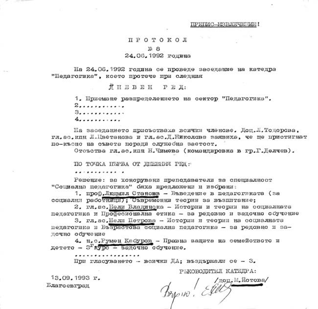

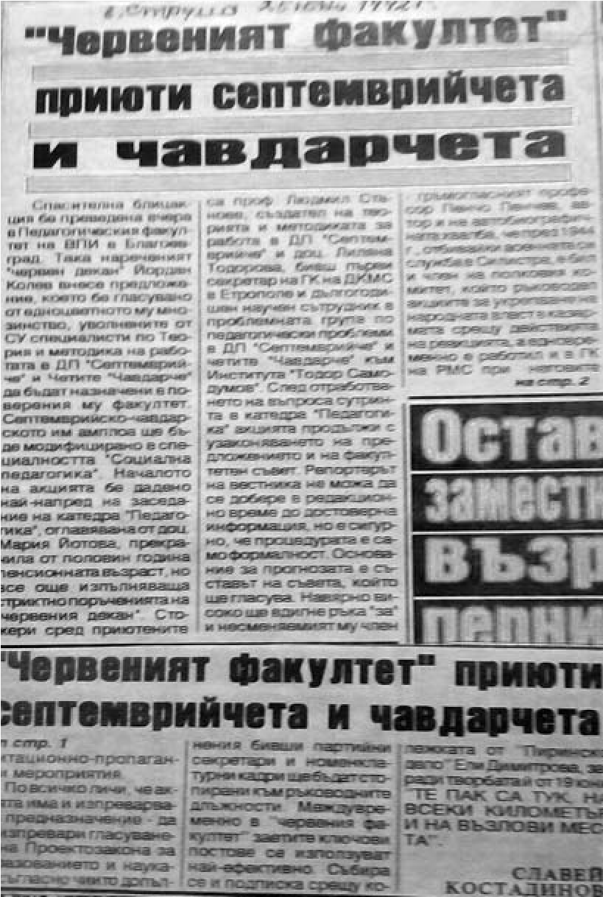

Червеният декан, както наричаха Йордан Колев, и неговата заместничка Лиляна
Тодорова бяха неразделни навсякъде, за да стреснат както преподавателите, така и
студентите, че тяхното комунистическо време не си е отишло. Напереният декан
обичаше да произнася пламенни слова пред студентите даже и тогава, когато
изнасяше лекции, или пък се провеждаха изпити.

Преди да започне държавният изпит със студентите в най-голямата 201 зала на
института зам.-деканката Лиляна Тодорова започна да плаши студентите, за да не
преписват. След това пред тях се изпъчи горд деканът Йордан Колев. И този път
той произнесе дълга реч. Започна да говори за хуманизма, за бъдещата мисия на
сегашните студенти като учители в началното училище, където се формира
мирогледът. Най-пламенни бяха думите му, когато започна да говори за борбата със
злото, за което често пишеше в местния вестник „Съвремие“. Студентите разбираха
намека, защото те вече бяха чели неговите публикации, в които определяше като
носители на злото реставраторите на „допотопния капитализъм“ у нас, който той
ненавиждаше.

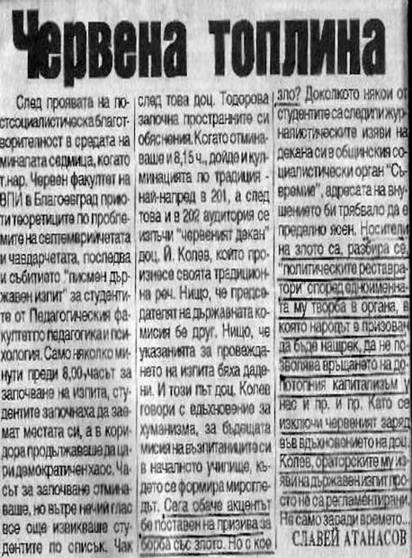

> *В тази публикация е отразена речта на Йордан Колев преди започване на писмения
> държавен изпит на студентите от специалност „ Педагогика“, в която ги призовава
> да не се позволява връщането на „допотопния капитализъм“*

По-будните студенти от Факултета за начална училищна педагогика реагираха остро
срещу силно политизираните лекции на червените преподаватели. Някои от тях
предложиха да се четат паралелни лекции и студентите сами да избират
преподавателите, които да ги посещават. Тяхното предложение беше прието, но
когато се оказа, че студентите въобще не посещават лекиите на някои от червените
преподаватели, най-вече на доц. Тодорова, а идваха да слушат моите лекции, вече
познатите майстори на клеветите набързо скалъпиха пак компроматна публикация от
името на неподписали се студенти от втори курс Начална училищна педагогика,
която публикуваха във все още издавания червен институтски вестник с главен
редактор Никола Стоянов, бивш политически сътрудник на първия секретар на
окръжния комитет на БКП Лазар Причкапов.

Когато студентите прочели клеветническата публикация, изпратили протестно писмо
до ректора на университета, в което се бяха подписали.

Ето съдържанието на писмото.

> Господин Ректор,
> 
> Дълбоко сме огорчени от факта, че Вие допускате да се хулят и клеветят едни от
> най-добрите ни преподаватели по страниците на вестника, орган на Университета, а
> се укриват слабите, неспособните.
> 
> Материалът „Паралелни лекции, паралелни мърсотии“, който е публикуван във
> вестник „ Обектив“ на 17.04.1992 г., е пример за това. Това е клевета срещу
> уважавания от нас доц. Атанас Попов.
> 
> Ние, долуподписаните студенти от 2 курс Начална училищна педагогика, отхвърляме
> категорично написаното в него, като се защитаваме с подписите си и настояваме да
> се разобличи истинският автор на писмото.
> Благоевград, 14.05.1992 г.
> 
> Подписи : приложение – 5 листа с подписи от студентите по групи.

Студентите искаха да знаят истинския автор на анонимното писмо. Те не подозираха
обаче, че това бяха някои техни червени преподаватели, които изпращаха такива
анонимни писма къде ли не, за да разрушават авторитета ми, който съм изграждал с
много труд и всеотдайност.  

## 11. Неочаквано предложение от проф. Кирил Чимев

Една вечер професор Кирил Чимев дойде в дома ми. Предложи ми да бъда назначен за
временно изпълняващ длъжността зам.-ректор. Същият ден беше публикувана във в.
„Струма“ на цяла страница остро написана критична статия против ректорското
ръководство. Най-тежките удари бяха нанесени на ректора. Не се съгласих, защото
бях уморен от все още нестихващите атаки на червените групи в университета,
които бяха погнали и него. Предложи ми да продължим разговора, защото вече е
било непоносимо да се работи в ректорския съвет. Попитах го защо е толкова
настоятелен. Ректорът ме погледна с очи, от които разбрах, че наистина е много
уморен от нестихващите конфликти, и каза:

&minus;Атанасе, ти знаеш как да тръгнат спокойно работите в университета. Имаш
    наследствена дарба за това от дедите ти, които са били изтъкнати просветни
    дейци. Знам, че всичко, което правиш, е успешно.

Бях сигурен, че ако приема предложението на проф. Чимев, ударите ще се стоварят
още по-силно и върху мен. Ректорът ми предложи да отидем извън града през
почивните дни, за да ми разкрие по-конкретно причините, заради които бе толкова
настоятелен. Съгласих се. Отидохме в село Добринище на хижа „Гоце Делчев“. Там
имахме достатъчно време, за да науча какво беше накарало професор Чимев да бъде
толкова разтревожен и настоятелен да ме назначи за временно изпълняващ
длъжността зам.-ректор. Той ми разказа подробости за напъните от една страна да
бъде превърнат нашият университет в Славянски университет, а от друга – да си
остане само като Институт за подготовка на педагогически кадри. На връщане за
Благоевград, когато видях в очите на ректора сълзи, го попитах:

&minus;Професоре, защо се страхуваш, че университетът ни ще стане стане крепост на
    славянофилите?

Той спря колата пред тунела до Симитли и ми каза:

&minus;Защото те си свършиха вече работата и аз повече нищо не мога да направя.
    Изнудиха ме и взехме решение на Академичния съвет, което предстои да се
    приеме и от Общото събрание, за превръщането на университета ни в Славянски
    университет.

Като чух това, изтръпнах. Разбрах защо професор Чимев вече не сдържа и сълзите
си, за да настоява толкова много да бъда назначен за негов заместник като
временно изпълняващ тази длъжност. Прегърнах го и му дадох най-после очаквания
от него отговор:

&minus;Съгласен съм. Няма да позволим това, нали?

Професорът си избърса сълзите и видях усмивка на лицето му.

## 12. Къса памет за паметни години

Поради това, че третото начало в развитието на Висшия педагогически институт и
превръщането му в Югозападен университет „Неофит Рилски“ беше едно от
най-трудните, ще се позова на конкретни факти и доказателства. Смятам, че това
време не бива да се забравя никога от сегашните и бъдещите преподаватели и
студенти.

Със заповед № 30 от 26.08.1992 бях назначен за временно изпълняващ длъжността
зам.-ректор. Трябваше да отговарям за Отделението за следдипломна квалификация,
което се изцяло изостави и занемери от зам.-ректора Илия Гюдженов. Беше се
стигнало до там, че всеки, който пожелаеше, можеше да си открие курс за
квалификация и преквалификация на педагогическите кадри. Не бяха малко
нехабилитираните преподаватели, които ръководеха такива курсове в отделните
факултети.

Тежки, много тежки и разнообразни бяха и проблемите, свързани с цялостната
организация и провеждане на учебния процес. Доц Илия Гюдженов се беше отдал
изцяло най-вече на грижата за решаване на неговите лични проблеми в семейството.
Пазеше своеобразен неутралитет и по отношение на нестихващите скандали при
провеждане на заседанията на ректорските и академичните съвети, на които
присъстваха и лица като редактора на все още червения студентски вестник.

След назначаването ми за временно изпълняващ длъжността зам.– ректор бившите
партийни и комсомолски секретари в университета, които бяха създали организирана
атака срещу проф. Кирил Чимев, се уплашиха. Техният медиен глашатай Люба
Спириева, снаха на секретаря на ОК на БКП Тома Спириев, веднага публикува
материал във в. „Струма“, с който плашеше колегите, че след моето назначение за
зам.-ректор ще започне тяхното уволнение.

На първото заседание на Академичния съвет, на което присъствах като зам.-ректор,
се взе единодушно официално решение, според което освен за Отделението за
следдипломна квалификация ми бе възложено да отговарям и за:

&minus;създаването на новата академична структура на университета, свързана с
    откриването на нови факултети и специалности;

&minus;подготовката за приемане статута на университета в Народното събрание и
    свързаната с това цялостна дейност за неговото утвърждаване като научен и
    просветен център в Югозападна България.

Докато гузните виновници за създадения хаос в университета сипеха безброй хули и
клевети, много бързо започнах да преустройвам и ръководя дейността, която беше
тясно свързана с даване статут за университета.

Някои членове от ректорския съвет обаче продължаваха да се страхуват от онези,
които създаваха разкола в университета.

На един от ректорските съвети предложих да прекратим издаването на студентския
вестник, който беше трибуна, от която открито се воюваше както срещу проф. Илия
Конев, така също и срещу новия ректор проф. Кирил Чимев. Спомням си, че това мое
предложение стресна някои от членовете на ректорския съвет. Двама се въздържаха
при гласуването. Реших, че трябва да поговоря и с някои от ръководителите на
сандикатите в университета.

Първата ми среща беше с гл.ас. (сега професор) Антони Стоилов. За разлика от
другите, той се отличаваше с прозорливост по отношение на създадената тежка
обстановка в ректората. След тази среща колегата Стоилов застана твърдо в
подкрепа на ректорското ръководство за решаването на актуалните задачи, свързани
с цялостната дейност в университета. Най-активно беше неговото пряко участие при
подготовката за приемане статута на университета в Народното събрание.

За кратко време бе изцяло преустроена и дейността в Отделението за следипломна
квалификация. Тя бе съобразена с конкретните нужди за получаване на нови
специалности и преквалификация на педагогическите кадри. За ръководители на
отделните курсове бяха назначени водещи преподаватели в своите научни области.

Като видяха, че се извършиха немалко промени в цялостната дейност на
университета, много мои колеги, ръководители на катедри и факултети, започнаха
да идват при мен и да търсят помощта ми за какво ли не. Това понякога ме
уморяваше, но нямаше как, авторитетът на университета трябваше да се укрепва и
да се спаси от идеята на славянофилите да го превърнат в своя крепост.

След като видях, че моят колега доц. Гюдженов беше занемерил и дейността на
Отделението за работа със студентите от чужбина, предложих да бъде назначен за
негов ръководител гл.ас. Антони Стоилов, който бързо съумя да активизира
дейността му и преодолее допуснатите сериозни слабости. За първи път бяха приети
немалко студенти от Македония, с които се извършваше не само активна академична,
но и ползотворна възпитателна дейност.

В началото на новата 1992-1993 учебна година на няколко пъти посетих Народното
събрание и имах срещи с депутати от Съюза на демократичните сили. Два пъти бяхме
заедно с тогавашния областен управител Любен Пранджев и кметицата на Благоевград
Ели Масева. Най-чести бяха срещите ми с депутата от СДС д-р Ивайло Ловджиев, с
когото създадохме т.нар. синьо депутатско лоби в парламента в защита на
Югозападния университет. С нас беше и зам.-председателят на Народното събрание
Снежана Ботушарова, която ми оказваше голяма помощ при формирането на
положително отношение сред депутатите към нашия университет.

Моят добър приятел от Софийския университет проф. Йордан Венедиков прояви голям
интерес към съдбата на нашия университет, защото неговите родословни корени са
от Пиринския край. Прадедите му са от разложкото село Баня. С него споделих за
някои от опасностите, които заплашваха оцеляването на университета ни. Няколко
пъти бяхме заедно с проф. Венедиков при Председателя на Народното събрание
Стефан Савов, който ни увери, че парламентарната група на СДС ще подкрепи
единодушно нашето предложение за даване статут на университета ни. Такава
готовност имаше и проф. Елка Константинова, която по-късно стана един от
най-ревностните защитници на Югозападния университет. Специална среща поискаха с
мен и двамата депутати от ДПС Кадир Кадиров, зам.-председател на Народното
събрание, и Шерифе Мустафа, които ме уверяваха, че и тяхната парламентарна група
ще подкрепи статута на нашия университет.

За да се проучи отношението на всички депутатите към нашия университет, помолих
директора на НЦИОМ доц. д-р Асен Йосифов (сега професор) да направи специална
анкета сред тях. Резултатите от нея показаха пълна подкрепа за приемане статута
на Югозападния университет.

Почти една година представеният проект за решение за даване статут на
университет на Висшия педагогически институт не беше внесен за обсъждане в
Народното събрание. През това време социалистите в парламента все още упорито
настояваха да се създаде Славянски университет в Благоевград. Тази тяхна идея
беше опасна за оцеляването на Югозападния университет.

Поисках среща с новия председател на Народното събрание Александър Йорданов. С
него се уговорихме д-р Ивайло Ловджиев да внесе нов проект за даване статут
„Югозападен университет „Неофит Рилски“ на Висшия педагогически институт, който
след това лично занесох и се заведе с № 102-33-548 от 21 .10. 1993 г.

>   *Това е списъкът на депутатите, които първи подкрепиха предложението за
>   даване статут на Висшия педагогически институт в Благоевград като
>   университет*

И така, за първи път в залата на Народното събрание беше внесено нашето
предложение за гласуване статута на Югозападния университет. Все още нямаше нито
едно друго висше училища, което да се кандидатира за промяна на своя статут.

След това разбрах, че социалистите бяха поискали към нашето предложение за
даване статут на университета да се добави и на бързо скалъпения Варненски
свободен университет „Черноризец Храбър“. Това беше коварен ход на социалистите,
за да забавят приемането статута на нашия университет. Когато за това
предложение научиха някои от депутатите на СДС, те се обявиха решително против
т.нар. от тях „червен“ университет. При следващите мои посещения в парламента
при мен често идваше зам.-ректорът на Варненският свободен университет доц.
Павел Павлов, който упорито настояваше нашите университети да бъдат обсъждани
едновременно в залата на Народното събрание, въпреки че нямаше разработени
мотиви, каквито ние на няколко пъти представихме. Той беше включен за гласуване,
което не се приемаше от депутатите в СДС. След това този университет стана
препъни камък при утвърждаване статута на нашия университет, защото комунистите
искаха да го закрият и превърнат в с л а в я н с к и университет като руска
крепост в Бъгария, което като зам.-ректор не допуснах да се случи.

Още на първото заседание на Народното събрание след това всички, които взеха
участие при обсъждането, подкрепиха преобразуването на Висшия педагогически
институт в Югозападен университет „Неофит Рилски“. На два пъти се стигна до
гласуване. Преживявах с голямо вълнение тези заседания. Първия път, преди самото
гласуване, се поиска почивка от член на една от новите парламентарни групи. А
след това, когато бях сигурен, че предложението вече ще се гласува, и то
единодушно в наша полза, неочаквано проф. Марков от групата на т.нар.“мравки“ от
СДС предложи да се отсрочи гласуването. Наблюдавах гласуването от балкона над
заседателната зала. Забелязах недоволството на повечето депутати, но нямаше
какво да се направи. Такъв е бил редът, уточнен в правилника на парламента.
Заседанието се ръководеше от председателя на Народното събрание Александър
Йорданов, който отправи поглед към балкона, където бях седнал, вдигна рамене в
знак на недоумение от предложението на професора „мравка“.

Заедно с шофьора ми Димитър Димитров се върнахме чак след полунощ в Благоевград.
И след това първо разминаване за приемане на статут на университета ни не стихна
упоритата ми дейност, свързана с неговото приемане в Народното събрание, което
се затрудняваше от социалистите.

## 13. Първият сблъсък с Американския университет

Освен интригите на някои от „перестройчиците“, трудностите дойдоха и от друго
място. Въз основа на подписано споразумение на 5 септември 1990 година между ИК
на Общинския народен съвет, Висшия педагогически институт, представители на
политическите партии и Синдиката на българските учители учебен корпус №1 беше
предоставен за нуждите на Математическата и на Езиковата гимназия. Съгласно това
споразумение, на Висшия педагогически институт бяха представени двадесет зали от
втория и третия етаж в сградата на бившия партиен дом до построяването на
учебните блокове Б и В. След настаняването на Американския университет в същата
сграда бяха освободени половината от предоставените помещения на него. След това
последвали писма от ръководството на Американския университет да се освободят и
останалите помещения, т.е. Висшият педагогически институт да освободи изцяло
сградата на бившия партиен дом. За съжаление тогавашното ректорско ръководство
бе обещало от 1992 година да се освободи изцяло сградата, но все още блок В не
беше изграден. Президентът на Американския университет Левърти беше изпратил
няколко писма, с които искаше напускането на нашите студенти и преподаватели от
сградата. Най-настоятелни бяха Уайът Кутеманш и зам.-ректорът Бил Портър.
Последният беше изпратил предупредително писмо на 6.04.1992 година до тогавашния
зам.-ректор на ВПИ Илия Гюдженов като завеждащ учебната част, който обаче не
беше предприел никакви мерки за отхвърляне на това неоснователно искане.

През тези месеци т.нар. „перестройчици“ отново бяха засилили застрашително
своята дейност срещу тогавашното ректорско ръководство. Някои от членовете на
ректорския съвет се бяха скрили и не предприемаха нищо за преодоляването на
създадената тежка атмосфера във Висшия педагогически институт. Гледаха само да
останат незасегнати от ударите и запазят своите ръководни места. Един от тях
беше и доц. Илия Гюдженов, който се страхуваше да заеме страна в тази битка.

Заедно с проф. Чимев се чудехме с какво да се захванем по-напред, с утихване на
конфликтите в университета или пък с преодоляване на трудностите, които
създаваше и ръководството на Американския университет. За съжаление с писмо №
04-00-6 / 24 април 1992 г., изпратено до Министъра на финансите Иван Костов, се
обещаваше, че ако бъдат осигурени целево средства за изграждане на блок „В“,
институтът би могъл от следващата учебна година да освободи изцяло сградата,
която се ползваше заедно с Американския университет.

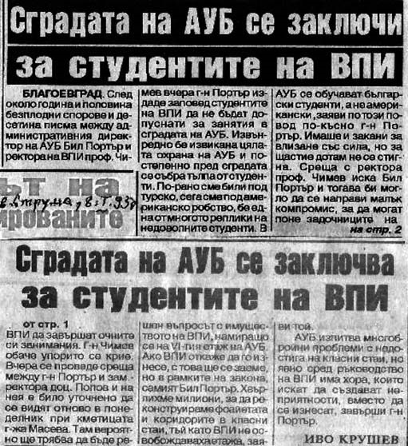

>   *Публикацията, която отразява срещата ми с г-н Портър, когато не бяха
>   допуснати нашите студенти до залите, в които провеждаха учебните им занятия*

През м. януари 1993 г. неочаквано служители от Американския университет
направиха опит да се самонастанят в залите и канцелариите на Педагогическия
факултет. Някои преподаватели бяха решили да протестират като нощуват в
сградата, което нямаше да реши проблема. Разбира се, това не бе начинът за
запазване на нашата учебна база. Неприятно впечатление направи това, че както
ректорът проф. Чимев, така и зам.-ректорът по учебната дейност доц. Илия
Гюдженов отново се скриха. Трябваше пак аз да укротя г-н Бил Портър,
административен директор на Американския университет. На срещата с него се
уговорихме да продължим преговорите в кабинета на кмета на града Илиана Масева
през следващия ден. При спешната ми среща с г-жа Масева двамата решихме да бъдем
неотстъпчиви по отношение напора на ръководството на Американския университет.
Поискахме и навременната намеса на Министерството на образованието,
благодарението на което беше избегната и своеобразна саморазправа между
преподаватели и студенти. Отстъпени бяха само някои зали на Американския
университет.

## 14. Прилагане на „Закона Панев“ в Югозападния университет „Неофит Рилски“

На 9 декември 1992 г. 36-ото Народно събрание прие т.нар. „Закон Панев“ (на
името на неговия вносител Георги Панев, депутат от СДС, председател на Комисията
по образование). След неговото утвърждаване от президента Жельо Желев с Указ №
301 от 22 декември и публикуването му в бр.104 от 24 декември 1992 г. на
„Държавен вестник“, започна да се прилага във висшите училища. Ръководството на
Висшия педагогически институт беше задължено да го спази. Въпреки това, бе
направено допълнително запитване до Министъра на образованието и науката, който
определи крайния срок за неговото прилагане.

Разпоредбите на „Закона Панев“ се отнасяха до ръководствата и академичните,
факултетните и научните съвети на висшите училища, до ръководствата и научните
съвети на научните звена в системата на БАН, както и до ръководствата и научните
съвети на всички научни организации, извън упоменатите, на които им е дадено
правомощия да обявяват конкурси, процедури и да избират научни и преподавателски
кадри. Разпоредбите на този закон се отнасяха и до Висшата атестационна комисия
и специализираните научни съвети.

„Законът Панев“ засегна номенклатурните кадри, които бяха на отчет в ЦК на БКП,
щатните и доброволни сътрудници на Държавна сигурност, участниците във
възродителния процес и секретарите на партийни комитети на БКП във висшите
училища и академии.

Започна подготовката на Общо събрание в нашия университет на което да се
предприемат мерки за прилагане на „Закона Панев“. Сам се предложи да го ръководи
представящият се за „антикомунист“ проф. Николай Божков, който е бил комсомолски
секретар в родния му град Сопот, но скри, че е бил такъв и попълни фалшива
декларация. Деканът на Правния факултет Траян Лялев пък направи обосновка в
своето изказване за необходимостта от неговото спазване. Част от онези
преподаватели, които бяха засегнати от този закон, не присъстваха на това Общо
събрание.

Уплашен от прилагането на „Закона Панев“, деканът на Педагогическия факултет
Йордан Колев стегна партийната група в катедрата. Проведоха специално заседание,
за да защитят освободения по съвместителство професор Петър Петров, когото
представяха като уволнен, въпреки че беше на постоянна месторабота във факултета
за Начална и предучилищна педагогика в Софийския университет.

Министерството на образованието, науката и културата постави срок за
провеждането на Общите събрания на факултетните, както и на катедрените съвети,
на които на мястото на засегнатите от „Закона Панев“ да бъдат заменени от други
преподаватели. Природо-математическият факултет беше първият, който проведе
своето събрание на 25 .02. 1993 г. От 29-те членове на този факултет бяха
засегнати само трима. На 1 март същата година се проведе Общото събрание на
Факултета по психология и предучилищна педагогика. От неговите 30 членове
засегнатите от закона бяха 12 преподаватели. Филологическият факултет проведе
своето Общо събрание на 4 март 1993 г. От 17 членове на този факултет засегнат
от закона беше само 1 преподавател. На 10 март се проведе Общото събрание на
Медико-педагогическия факултет, от който засегнатите от закона бяха 3
преподаватели. На следващия ден, 11 март 1993 г., се проведе Общото събрание на
Инжинерно-педагогическия факултет. От неговия 35 членен състав засегнат от
закона беше само един преподавател, но от департаментите към него – още двама
преподаватели. На 23.03.1993 г. се проведе Общото събрание на Юридическия
факултет. От неговия 25 членен състав неподписали декларации, т.е. засегнати от
закона, бяха 7 преподаватели.

Стачниците от Педагогическия факултет, организирани и ръководени от декана
Йордан Колев, забавяха и провеждането на Общото събрание за прилагане на „Закона
Панев“. Проведоха се три поредни събрания, предизвикани от подготвени
преподаватели, които създадоха тежка неприятна атмосфера, създадена най-вече от
специално изпратени от засегнатите от закона.

Най-после на 24 .03. 1993 г. на поредното Общо събрание на Педагогическия
факултет от 31 негови члена бяха освободени 8, засегнати от закона. Проф. Пенчо
Пенчев не беше подал необходимата декларация, защото беше гузен да я подпише.
Ето какво е написал сам той в своята автобиография: „През 1944 г. като войник в
Силистра бях в полковия комитет, който ръководеше акцията за укрепване на
народната власт в казармата срещу действията на реакцията. В ГК на РМС участвах
в неговите агитационно-пропагандни мероприятия...“ За тези големи заслуги към
народната власт по-късно Пенчо Пенчев става артист, а след това и професор.

Оказа се, че най-много засегнати от „Закона Панев“ имаше в Педагогическия
факултет и във Факултета по психология и предучилищна педагогика, следвани от
Юридическия факултет. Научният съвет по педагогика и психология в университета
проведе своето заседание на 12 май 1993 г., на което от 25 членове 8 бяха
новоизбрани на мястото на засегнатите от закона.

След прилагането на „Закона Панев“ цялостната работа в Югозападния университет
продължи спокойно за укрепване на променените състави на факултетните и
катедрените съвети. Неспокойна беше само създадената група около бившия секретар
по идеологическата дейност на Вузовския комитет на БКП Йордан Колев, която
продължи своята яростна борба срещу ректорското ръководство чрез публикуване на
пасквили в местния и централния печат. Тогава ВС на БСП разработи специални
„опорни точки“ за компромати и водене на съдебни дела срещу т.нар. от
комунистите „декомунизатори“.  

## 15.Компроматната война продължи по опорните точки в Указанието на ВС на БСП

Последните дни от своето деканство Йордан Колев пишеше и служебни писма до
различни вестници, с които молеше да се ускори публикуването на скалъпения
компромат от Петър Петров „Всемогъщият властелин и неговият покровител“ (вж.
Педагогически факултет, изх. № 12 от 03.02. 1993 г.). В писмо № 13.03.1993 г. е
написан шаблонен текст, който беше предназначен за няколко главни редактори на
централни и местни вестници. Писмото завършва така: „Уверяваме Ви, че познаваме
съдържанието на статията и го намираме за достоверно. Предварително благодарим!“
Следва подписът на декана.

Дясната ръка на Йордан Колев тогава беше зам.-деканът Лиляна Тодорова, която е
завършила техникум като Йордан Колев, но докато той е получил специалност като
електротехник, тя е била счетоводителка. И тя като него е завършила червения
педагогически факултет в Софийския университет. След това е и щатен ученически
комсомолски организатор. Тогава имаше такава длъжност, която беше равна на
комсомолски секретар. Счетоводителката обаче бързо израства по комсомолска линия
и става първи секретар на ГК на ДКМС в град Етрополе. За специални заслуги през
1968 година е изпратена на специален едногодишен курс в Централната школа при ЦК
на ВЛКМС в Москва, където по-късно защитава кандидатска дисертация на тема:
„Воспитание общественой активност млаших школников“, т.е. преведено на български
заглавието е „Възпитаване на обществена активност в четите „Чавдарче“. Оттогава
Тодорова получи прозвището „Чавдарката“. Като сътрудник в НИИОО „Тодор
Самодумов“ в секция „Комунистическо възпитание“ основен неин „научен“ проблем е
възпитателната работа с чавдарчетата в училище.

Преди да бъдат изпратени компроматите срещу мен и проф. Чимев, техният автор
Петър Петров поиска няколко пъти среща с нас и се заканваше, че ако не бъде
възстановен като преподавател, ще публикува скалъпения компромат в десетина
вестника. Един ден нахълтал в аудитория на Лесотехническия университет, където
проф. Кирил Чимев чел своята лекция. Показал му компромата и го заплашил като му
казал:

– Или ме връщаш отново като преподавател на половин щат, или утре ще четеш за
теб страшни неща в няколко вестника.

Професор Кирил Чимев го изгледал учуден и го изхвърлил от залата, което
изненадало студентите.

Колективно написаният компромат „Властелинът и неговият покровител“ беше
публикуван последователно в три вестника – „Струма“, „Югозападни вести“ и
„Учителско дело“.

Защо П. Петров вдигна с него шум до небесата? Въпреки че си имаше постоянна
месторабота във Факултета за детски и начални учители в Софийския университет,
той лъжеше, че е „уволнен“. Истината беше, че се скъса неговата голяма
печелбарска торба. Научихме, че шета на „гурбет“ и в Пловдив, и в Ст.Загора, и в
Русе, и къде ли не още. За него нашият университет беше финансова Мека. За
няколко часа пребиваване само в един ден от седмицата получаваше далеч по-голямо
възнаграждение от редовните преподаватели. Партийната група във Факултета по
педагогика го избираше за зам.-декан и ръководител на катедрата.

През учебната 1992-1993 година беше отказано на Петър Петров да бъде подписан
договор за съвместителство с него, заради оплаквания и на студенти, които
превозвал срещу високо заплащане от автогарата в София до Благоевград в
собствената си кола. Те го наричаха „професор таксиметров шофьор“. В столичния
вестник „Нов ден“ от 18 октомври 1992 г., бр. 40, излезе силно критична статия
„Професор таксиметров шофьор“. В него бе публикувано писмото на студента, който
възмутен пише :

„Когато пристигнахме в Благоевград, господинът, когото приехме за таксиметров
шофьор, ни взе по 25 лева. След няколко дни срещнахме същия този „таксиметров
шофьор“ в коридорите на университета. От обръщението на студентите към него
разбрахме, че това е проф. Петър Петров. Останахме смаяни. Не е ли обидно за
студентите такъв човек да ни бъде преподавател? Явно господин професорът не
държи на своя авторитет, нито и на авторитета на учебното заведение“.

Както вече беше подчертано, цели две-три години, стимулиран отпартийната група
във факултета, Петър Петров водеше дела срещу ръководството на университета,
които той загуби, поради което беше освободен от съставите на всички ръководни
органи – катедра, факултет и академичен съвет. Въпреки това, той продължаваше да
присъства на техните заседания и внасяше голям смут в работата им.

Когато една от колежките на заседание на Академичния съвет избухна от възмущение
и му каза, че той е психическо увреден, на следващото заседание пред всеки от
нас стоеше извадено от него удостоверение, че е психически здрав, подписано от
лекар с неговото фамилно име.

Освен отговора със заглавие„Клеветникът Петър Петров на гурбет в Благоевград“,
който аз дадох в посочените вестници по повод на клеветническата публикация,
излезе и публикация на журналист от в. „Пиринско дело“, в която се описваше
подробно организираната борба от бившите партийни ръководители във Висшия
педагогически институт срещу мен (вж. „Червена шайка прави безхаберничка
отличничка, за да наклепа доц. Попов“). Прекъсналата два пъти поради слаб успех
студентка, комсомолска деятелка, на която била дадена ролята на Мата Хари,
въобще не познавах. При направената справка в учебния отдел се оказа, че тя не е
била моя студентка и не е изпитвана от мен. Пазя препис от личното ѝ дело, от
което е видно, че средният ѝ успех по време на седемгодишното следване е под
среден 3. Молбата ѝ, за да запише в 5 курс условно, с два неположени изпита, е
подписана на 22.10.1991 от декана Йордан Колев. Така е даден началният тласък за
нейното скорошно дипломиране в академичната пирамида Инжинерно-педагогически
факултет, вместо във Факултета за начална училищна педагогика, където научен
ръководител ѝ става първият секретар на ВК на БКП проф. Димитър Стоилов, който ѝ
осигурява готов, чужд текст за дипломната работа. Не бяха малко и другите
студенти, които бяха известни като комсомолски дейци, дипломирани по този
скоростен начин с помощта на партийните ръководители в университета.

Вдъхновителят и съучастник в клеветническата кампания срещу мен Йордан Колев,
уплашен от започналото прилагане на закона „Панев“, само няколко дни преди
освобождаването му като декан на Педагогическия факултет, публикува статия във
в. „Дума“, орган на ЦС на БСП, в която се оплакваше, че законът го засяга и
изсипа отнова куп лъжи за „уволнявани преподаватели“, което не беше вярно (вж.в.
„Дума“, бр. № 44 / 23.02.1993 г). По-късно, на 9.03.1993 г. със заповед № 71-а
ректорът проф. Кирил Чимев върна доц. Йордан Колев в Катедрата по предучилища
педагогика, където беше спечелил конкурс и назначен, а след това е открита
неоснователно и процедурата му за доцент. Неговото оставане в Катедрата по
педагогика вече стана нетърпимо, но както някога при неправилното му прехвърляне
в нея, така и сега след връщането му не беше заемал работното си място и по
сведение на ръководителя на катедрата доц. Димитър Димитров не е изпълнявал
поставените му задачи.

Не знам дали всеки може да издържи на ударите от изпечени и минали през школите
на комунизма комсомолски и партийни секретари, каквито се сипеха срещу мен. Но
аз издържах, защото по-малко мислех за тях, отколкото за мисията ми да помогна
за укрепване на Югозападния университет. Е, вярно, че имах много неспокойни
мигове, но те се стопяваха в напрегнатата ми дейност.

## 16. Потайната борба на фондация „Славяни“ за създаването на Славянски университет в Благоевград

През 1993 година започна упоритата борба за приемане най-после статута на
Югозападния университет. Когато започнах разработването на мотиви за
необходимостта от утвърждаването на статут на университета, научих, че преди
моето назначаване за зам.-ректор, с ръководството на университета е имало
няколко срещи и е разговаряно с проф. Захари Захариев, председател на
Федерацията за приятелство с народите на Русия и ОНД, на фондация „Славяни“ и
сдружението „Славянски университет“ и е било взето решение Академичният съвет да
предложи на Общото събрание Югозападният университет „Неофит Рилски“ да се
развие като Международен славянски университет. Както вече подчертах, когато
научих за това от проф. Чимев, когато настояваше да ме назначи за временно
изпълняващ длъжността зам.-ректор реших да приема предложението му, за да спася
университета от това нелепо решение.

Не исках да повярвам, че някои от моите колеги са прогнозирали такова развитие
на нашия университет в Югозападна България. В писмото, което бе изпратено от
председателя на сдружение „Славянски университет“ проф. З. Захариев до ректора
на университета и Общото събрание, се споменава, че „сдружението упълномощава
доц. Марек Тасев да внесе горното предложение пред ръководните органи на
Югозападния университет». Предварително уточнено е и решението, което е трябвало
да вземе Общото събрание на университета за разработване на необходимата
документация за развитието на Югозападния университет като Международен
славянски университет в Благоевград и нейното внасяне за утвърждаване в
Народното събрание.

Не се мина много време и проф. Захариев отново дойде в университета, за да
настоява взетото решение на Академичния съвет да се внесе в Общото събрание. Той
вече знаеше за моята остра реакция по отношение на неговото предложение. За
съжаление зам.-ректорът по учебната работа доц. Илия Гюдженов потайно подкрепяше
създаването на Славянски университет. Когато проф. Захариев отново се появи в
университетта, му казах повече да не се намесва в работата на ректорското
ръководство и да спре да решава съдбата на Югозападния университет. Той ме
изгледа намръщен и ми каза с тих глас, за да не го чуят другите:

– Знам, че Вие сте най-големият противник на нашата идея за преобразуването на
вашия университет в Славянския университет. Аз не вярвам, че ще успеете да
получите статут на университет в Народното събрание дори и да утвърдите нови
факултети. Предложението, което сте направили, няма да мине. Нашите депутати от
БСП си знаят работата, за да не стане това.

След като чух това от проф. Захариев, имах среща с проф. Илия Конев, когото
подготвяха за ректор на Славянския университет. Той беше тежко наранен от
„перестройчиците“ в нашия университет, които изсипваха срещу него грамади от
неоснователни клевети и лъжи, но не приемаше предложението и на неговия колега
проф. Захариев, защото вече беше известен като „кръстникът“ на Югозападния
университет, който направи много за неговото утвърждаване. След това обаче стана
първи ректор на Славянския университет в София, където се водеха схватки за
неговото управление и през 1999 г. беше закрит от Народното събрание.

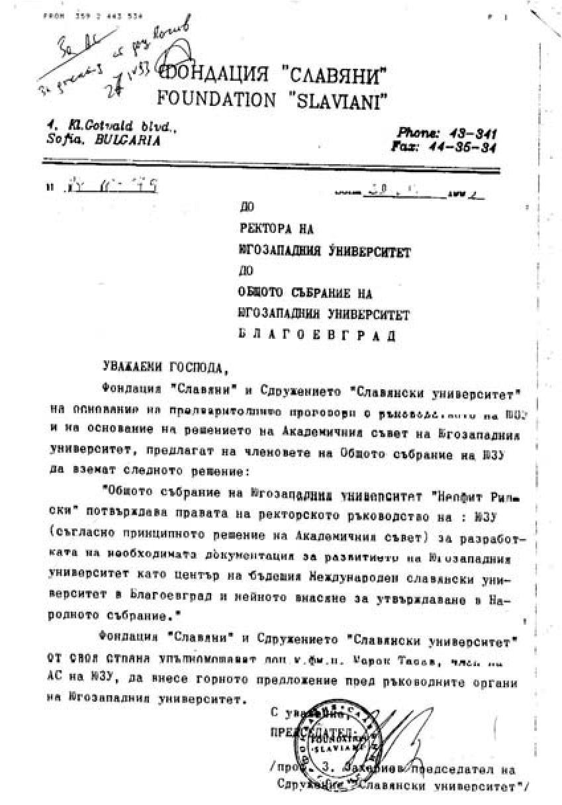

> *Писмото на проф. З.Захариев, председател на Сдружение „Славянски университет“
> до ректора на Югозападния университет и неговото Общо събрание за развитието му
> като център на бъдещия Международен славянски университет*

Възложено ми бе от проф. Чимев да докладвам за моето становище пред Академичния
съвет. Когато се обявих категорично против вече взетото предишно решение и
обосновах моите доводи, членовете на Академичния съвет замълчаха. Никой не се
реши да ми възрази, защото се убедиха, че това опасно предложение на проф.
Захариев застрашаваше бъдещото развитие на университета. Но за него вече бяха
научили някои от депутатите в Народното събрание. Особено остра, съвсем
основателна, бе реакцията на парламентарната група от Съюза на демократичните
сили. Когато споделих със Стефан Савов за моя категоричен отказ като зам.-ректор
на направеното предложение от проф. Захариев и промяната, която постигнах в това
отношение на предишното решение на Академичния съвет, той се зарадва и ми обеща,
въпреки че не беше вече председ ател на Народното събрание след подадената от
него оставка, да преодолее създаденото недоволство на някои от сините депутати.
Оказа се обаче, че отделни депутати от парламентарната група на БСП, с активното
участие на преподаватели комунисти от нашия универстет, подкрепяха предложението
за утвърждаване статут на Славянския университет в нашия град на мястото на
Висшия педагогически институт. Тази надежда на инициаторите за създаването на
Славянски университет в Благоевград изгасна през 1994 г., когато набързо той
беше утвърден от Народното събрание със седалище в София. За негов ректор беше
избран отначало проф. д-р Илия Конев, а след него – проф. Захариев. Както вече
подчертах, след това този университет беше закрит. Такава щеше да бъде съдбата и
на Югозападния университет, ако не беше упоритата ми дейност, свързана с
неговото запазване и утвърждаване. Тази истина все още се укрива от онези, които
потайно мечтаеха за „славянска академична крепост“, която да съхранява руските
интереси в България.

След приемането на „Закона Панев“ борбата срещу новото ректорско ръководство
продължи. В нея се включи и народният представител Емил Костадинов от БСП. В
неговото питане до Министъра на образованието и науката Марко Тодоров се
намекваше даже за необходимостта от свикване на Общото събрание на университета,
както и за „подбора на научния и преподавателския състав“ (вж. в. Югозападен
университет „Много питащ депутат получи сконфузващ отговор“, бр.1, март, 1994
г.).

Който не е бил в люта битка с комунистите в Югозападния университет, той не знае
нищо за техния морал и неадекватното им поведение. Всеки ден, всеки час те
воюваха открито срещу новото ректорско ръководство. Най-жестока беше битката им
срещу мен.

Надигна се цялата студентска организация, която излезе със специална декларация
в защита на ректорското ръководство. Студентите не се страхуваха да разкрият
нестихващата борба на комунистите за „вечна власт“ в университета. Подготвяха
преврат по опорните точки, които им бяха дадени от ЦС на БСП. Като разбраха
това, надигнаха се и синдикатите в защита на новите ръководства в катедрите,
факултетите и ректората. И те излязоха с декларация в защита на ректорското
ръководство.

В тези трудни, много трудни дни за университета зад ректорското ръководство
застана и студентската организация, ръководена от най-будните студенти. Никога
няма да забравя помощта, която ни оказваха някои от нейните ръководители като
Стефан Иванов, студент от Историческия факултет, който се ползваше с
изключително голям авторитет сред преподавателите и студентите.

*Декларация от ръководството на студентската организация против клеветническата
кампания на организираната червена група в Югозападния университет*

*Студентът Стефан Иванов беше най-ревностният помощник на ректорското
ръководство при преодоляване на трудностите, които създаваха бившите партийни и
комсомолски ръководители за прилагането на „Закона Панев“ в Югозападния
университет „Неофит Рилски“*

## 17.Нов сблъсък с Американския университет

В края на учебната 1993 г. административният директор на Американския
университет Бил Портър залости отново вратите на бившата сграда на партийния дом
и не допускаше нашите студенти и преподаватели, които останаха да студуват
навън. Някои от тях бяха звънели на доц. Гюдженов като зам.-ректор по учебната
част, за да дойде в сградата, но той отказал и ги насочил към проф.Чимев, който
отсъстваше от града. Позвъниха на мен. Набързо тръгнах там, където имаше повече
от 200 студенти, които не бяха допускани от охраната на Американския
университет. При моето появяване двамата охранители направиха път и ме пуснаха.

Намерих Портър в офиса му. Разговорът ни беше твърде тежък, защото нашите
студенти и преподаватели очакваха да продължи нормално учебния процес в
аудиториите. Доц. Н. Филипова, която беше с мен, ме попита не се ли страхувам.
Напуснах сградата. Навън ме очакваха студентите и колегите. Казах им, че само за
този ден преместваме занятията им във втори и четвърти корпус. Поради това, че
проф. Кирил Чимев го нямаше в града, спешно събрах членовете на Ректорския съвет
и изпратих телеграма до Министъра на образованието. Насрочих пресконференция за
следващия ден, когато се завърна и проф. Чимев. Подадох сигнал до прокуратурата
в Благоевград за неадекватното поведение на Портър, свързано с проявите на
своеобразно самоуправство по отношение на студентите и преподавателите.

На пресконференцията в Общината присъстваха много журналисти, зам.-министърът на
образованието Кючуков и други представители на Министерството на образованието,
общинския съвет, както и на политическите партии. Кметицата на Благоевград
Елиана Масева застана на страната на Югозападния университет. Тогава господин
Портър от Американския университет дойде при мен и започна да ми се извинява за
постъпката си предишния ден. След като видя нашето твърдо отстояване за
запазване на учебните зали и канцелариите ни в бившата сграда на окръжния
комитет на БКП, ме помоли да се помирим. Прие се единодушно решение да запазим
използваната от нас материална база. Отстъпени бяха само две зали на
Американския университет.

След около половин година, един ден, когато отсъствах от Благоевград и бях
отново в Народното събрание за уреждане статута на университета, в резултат на
упоритото настояване на ръководството на Американския университет ректорът проф.
Кирил Чимев се беше съгласил да се освободят използваните от нашия университет
зали и канцеларии. На следващия ден, на път за университета, близо до хотел
„Ален мак“ видях наши коли с натоварени маси и столове. Попитах домакина Методи
Дуров и помощник-ректора Йордан Тозев откъде се извозва това имущество. Казаха
ми, че започва освобождаването на нашите зали от сградата на бившия партиен дом.
Помолих ги да върнат имуществото обратно. Ядосан за прибързаното решение на
ректора, отидох в кабинета му, където той ми каза, че бил заплашен да направи
това. Предложих му да свика заседание на Ректорския съвет, който да вземе друго
решение. На това заседание предложих да преместим Педагогическия факултет в
първи корпус, а там да бъде настанен вече създаденият Факултет по право. Така и
направихме. След това често в кабинета ми идваше проф. Траян Лялев, заедно с
други преподаватели, които помолих да бранят ревностно своето ново
местонахождение.

След като ръководството на Американския университет разбра, че няма да допуснем
освобождаването на етажа от сградата, в която се обучаваха и техните студенти,
поискаха помощта и на посланика Мокнамари. На срещата с него в кабинета на
ректора го помолих повече да не създават ненужно напрежение между двата
университета.

&minus;Ако искате да разширявате базата на вашия университет, не създавайте пречки
    на нашия, който никога няма да напусне сградата, която искате да се отнеме
    изцяло. Ние трябва да работим заедно за утвърждаването на нашия град като
    университетски център – казах на Мокнамари.

Посланикът ме погледна, замълча и каза:

&minus;Подкрепям вашето предложение за съвместна работа между двата университета.

След срещата с посланик Мокнамари, взаимоотношенията между двата университета се
промениха. Новоназначената ректорка на Американския университет Джулия Уоткинс
не забравяше да ни кани на техни академични прояви. От друга страна, същото
правехме и ние.

След няколко години обаче новото ръководството на Американския университет
продължи да настоява да обсеби базата на Правно-историческия факултет, но
благодарение на убедителната упоритост и авторитета на декана проф.
Ал.Воденичаров пред кметството и общинския съвет в Благоевград това не се
допусна.

Сега в центъра на нашия град се намира непокътната базата на Правно-историческия
факултет. Всеки, който посети града, вече с гордост чете до надписа на
Американския университет и надписа „Югозападен университет „Неофит Рилски“ –
Правно-исторически факултет.

## 18. Истината с факти и документи

В интервюта, дадени от доц. Илия Гюдженов, ректор от 1999 до 2007 година, по
повод юбилейна годишнина на Югозападния университет „Неофит Рилски“, на въпроса
на журналистката Димитрина Асенова дали е било силно лобито, свързано с даване
статут на университета, той скри истината (вж.в. „Струма „, декември, 2006 г.,
с. 9 и „Университетски преглед“, бр. 2, 2006 г., с. 53). Съвсем ясно изпъкна
съзнателното подценяване на безспорния принос на конкретни лица – университетски
ръководители, преподаватели, депутати и държавници, които положиха големи усилия
за преобразуването на Висшия педагогически институт в университет.

За пореден път пролича самоизтъкването му като „строител“ на Югозападния
университет. Той беше вече забравил тези години, когато негова основна грижа
като зам.-ректор бе да се премества от един в друг държавен апартамент, за да се
добере в самия център на града, докато някои негови колеги от ректорското
ръководство ежедневно лобираха къде ли не за утвърждаване статута на Югозападния
университет.

Спомням си, че доц. Илия Гюдженов през една от тези по-далечни години, забравени
от него, ме помоли да се застъпя пред зам.-кмета Георги Пашов да разшири
апартамента си със съседна гарсониера, която е била свободна. Скри обаче, че
вече беше нахълтал в гарсониерата. Когато се срещнах със зам.-кмета, той ме
погледна учудено и ми каза:

– Нима не знаеш, че вашият колега ще бъде съден за това, което е извършил?

Помолих го да не се завежда дело. Така и стана. По-късно меракът на доц.
Гюдженов мина, когато се премести точно на пъпа в Благоевград в жилищния блок
„Лирата“.

И така, жалко, че някогашният мой колега доц. Гюдженов като някогашен
зам.-ректор е забравил, или пък не иска другите да знаят, как беше създаден
статутът на нашия университет. Затова сега ще му припомня истината за това
трудно време.

Първо. Не „покрай другите учебни заведения нашият университет получи статут“, а
другите заради него, т.е. покрай нашия други получиха прибързано през 1995
година незаслужено такъв. Именно затова тези университети са му по своеобразен
начин задължени, а не той на тях.

Второ. Цялостната работа, свързана с подготовката за даване статут на
университет на бившия Падагогически институт в Благоевграде, е най-ползотворната
в неговата история, защото е тясно свързана с разширяване и утвърждаване на
неговата съвременна структура.

>   През тези трудни години зам.-ректорът по учебната част доц. Илия Гюдженов се
>   криеше в някаква дълбока сянка, или пък се оплакваше от здровословни
>   проблеми, които след това обаче бързо изчезнаха.

Какво направих аз като зам.-ректор, който понякога изпълнявах задълженията и на
други мои колеги от ректорското ръководство? Неудобно е, но трябва да се даде
отговор на този въпрос, защото паметта на някои се оказа много къса.

Разработих в 6 страници основните мотиви за даване статут на университет на
Висшия педагогически институт, които за първи път дадох да прегледа гл. ас.
(сега професор) Антони Стоилов. След обсъждане и утвърждаването им от
ректорското ръководство ги предадох на 21 октомври 1993 г. на председателя на
Народното събрание Александър Йорданов, който внесе проект за решение за даване
статут на Югозападния университет. Предложението беше подкрепено и от 17 други
вносители от различни партии, повечето от които от Благоевградски окръг (Ивайло
Ловджиев, Иван Будимов, Емил Костадинов, Емил Юруков, Стефан Продев, Александър
Маринов, Георги Марков, Маргарит Мицев, Емил Бучков, Иван Куртев, Николай
Добрев, Владимир Джаферов, Александър Праматарски, Йордан Ройнев, Филип Боков,
Георги Пирински и Тошо Пейков).

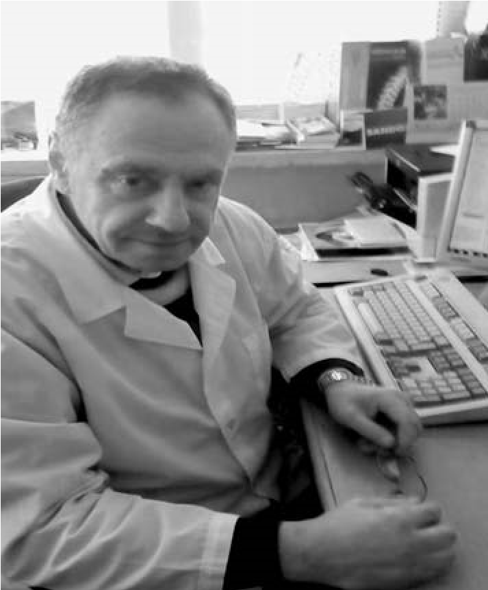

>   *Д-р Ивайло Ловджиев е първият вносител на проекта в Народното събрание за
>   даване статут на университет на Висшия педагогически институт*

Нито веднъж някои от моите колеги от ректорското ръководство не пожелаха да
дойдат заедно с мен в Народното събрание, за да помогнат при подготовката за
даване статут на университета. Те предпочитаха да си наглеждат грижливо личните
дела. След назначаването на доц. Магдалена Глушкова за зам.-ректор тя прие
присърце задачите, които ѝ поставях за подготовката на юбилейния концерт в
София, на който присъстваха много депутати и посланици. Често с мен бяха гл.ас.
Антони Стоилов и студентът Стефан Иванов, които ми помагаха всеотдайно. Не мога
да отмина шофьорът Димитър Димитров, който е живият свидетел на моите постоянни
контакти с депутати и политици за утвърждаване статута на университета.

Заедно с д-р Ивайло Ловджиев създадохме т.нар. депутатско лоби в парламента в
защита на Югозападния университет. Голяма част от останалите депутати
подготвяхме за предстоящото активно участие при гласуването на предложението.

През тази година добра помощ в парламента ми оказваше доц. Александър
Воденичаров, който беше парламентарен секретар. Уговорихме се с него да следи
дневния ред на заседанията и да ме уведомява за всичко, което е свързано с
нашето предложение за утвърждаване на статута на университета.

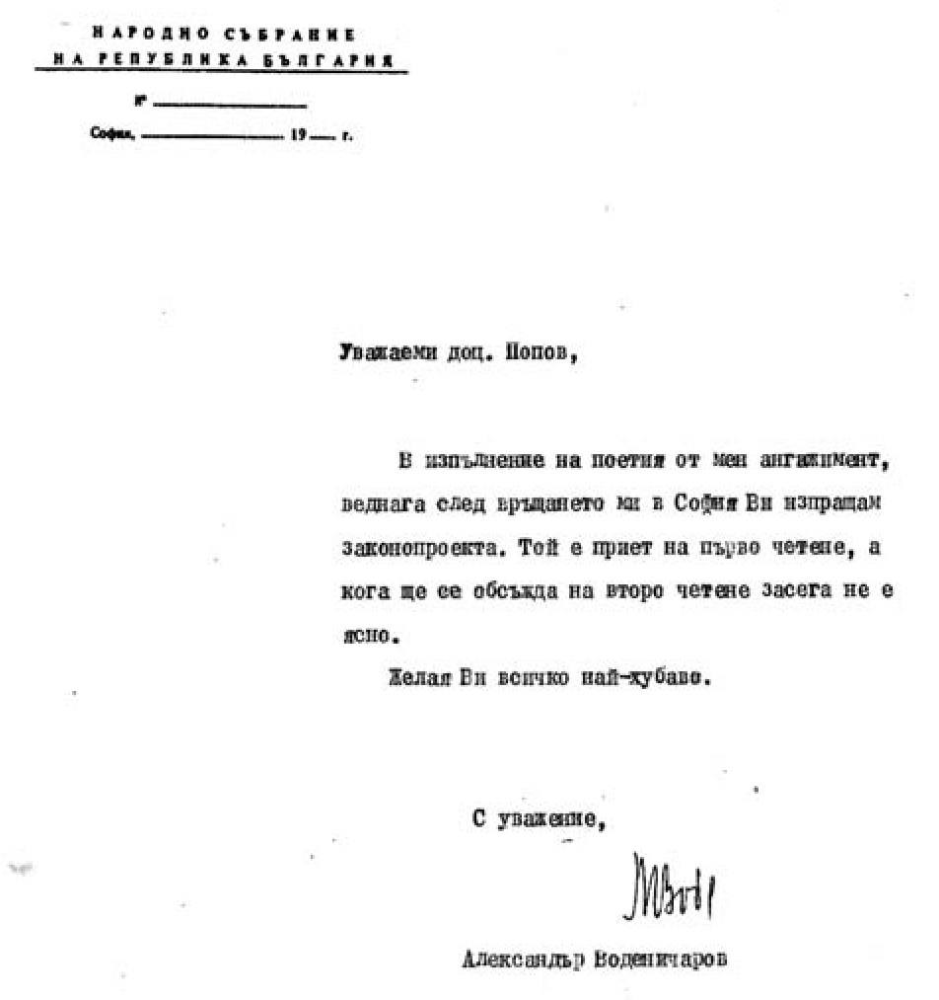

>   *Уважаеми доц. Попов,*

>   *В изпълнение на поетия от мен ангажимент, веднага след връщането ми в София
>   Ви изпращам законопроекта. Той е приет на първо четене, кога ще се обсъжда
>   на второ четене засега не е ясно.*

>   *Желая Ви всичко най-хубаво.*

>   *С уважение:*

>   *Алексанадър Воденичаров*

За първи път в залата на Народното събрание беше внесено нашето предложение за
гласуване статута на Югозападния университет. Все още нямаше други висши
училища, кандидати за промяна на техния статут.

Още на първото заседание всички, които взеха участие при обсъжданетоq подкрепиха
преобразуването на Висшия педагогически институт в Югозападен университет
„Неофит Рилски“. На два пъти се стигна до гласуване. Преживявах с голямо
вълнение тези заседания. Първият път, преди самото гласуване, се поиска почивка
от член на една от новите парламентарни групи. А вторият път, когато бях
сигурен, че предложението вече ще се гласува, и то единодушно в наша полза,
неочаквано проф. Марков от групата на т.нар.“мравки“ от СДС предложи да се
отсрочи гласуването. Наблюдавах цялата зала, защото бях на един от балконите.
Забелязах недоволството на повечето депутати, но нямаше какво да се
направи.Такъв е бил редът, уточнен в правилника на парламента. Заедно с шофьора
ми Димитър Димитров се върнахме чак след полунощ в Благоевград.

По-нататъшните препятствия, свързани със забавяне гласуването в парламента за
даване статут на Югозападния университет, бяха свързани с разработените критерии
от Министъра на образованието Марко Тодоров за промяната в статута на висшите
училища. Основното изискване в тях беше осигуряването на необходимия брой
хабилитирани преподаватели (професори и доценти), които да са на постоянна
месторабота. Говореше се и за приемане на нов закон за висшето образование.

Усилената подготовка за даване статут на университет на Висшия педагогически
институт бе тясно свързано с:

&minus;привличане на хабилитирани преподаватели, което изискваше да се използват
    стимули (по-високи заплати, осигуряване на квартири и др.)

&minus;откриване на процедури за хабилитиране

&minus;обявяване на конкурси за докторанти

&minus;създаване на нови специалности и факултети, както и на по-тесни връзки с
    висши учебни заведения в чужбина и др.

На 19 май 1993 г. Академичният съвет, след проведено тайно гласуване, единодушно
ме избра за зам.-ректор. Дотогава бях временно изпълняващ длъжността. Никога
няма да забравя, че колегите от Академичния съвет ме подкрепяха ревностно във
всяка една стъпка, която правeх за приемане статута на Югозападния унивреситет и
утвърждаване на неговата нова структура.

## 19. Първото повишаване на заплатите на преподавателите и служителите

През м. юни 1993 г. по моя инициатива се създаде организационен комитет, в който
бяха включени представители на сандикатите. Подготвихме проект за нови
индивидуални заплати, съобразени с нормативните документи. През това време
ректорът отново беше извън страната. Поканих лично министъра на социалните грижи
проф. Шопов и зам.-министъра Горан Банков, за да съгласуваме нашето решение. На
вечерята в ресторант „Ален мак“ те ми казаха, че проектът за новите индивидуални
заплати заслужава специално внимание, защото такава смела стъпка не беше
направил никой от другите университети, в които заплатите бяха чувствително
по-ниски. Тази т.нар от „смела стъпка“ от тях обаче ни беше необходима, за да
привлечем ярко изявени университетски преподаватели в нашия университет.

Няма да скрия, че през това време някои от моите колеги, дори и от ректорското
ръководство, бяха пощурели да правят някакъв бизнес или пък да печелят пари по
„потаен“ начин. Ако стане нужда ще разкажа и за всичко това. Захласнат в
упоритата борба за утвърждаване авторитета на университета и създаване на
условия за разрастване на неговата структура, не обърнах внимание на здравето
си, както и на нестихващата, програмирана атака срещу мен от бившите партийни и
комсомолски секретари и техните протежета.

При завръщането си от чужбина проф. Кирил Чимев също изрази опасение от
подготвеното увеличение на заплатите, но у мен такова нямаше, затова на 30 юли
1993 г. подписах вместо него заповед № 459 на основание 71 ПМС от 1993 г. и факс
на Министерството на науката, културата и образованието, с която се разрешаваше
да се изплати на служителите и на научнопреподавателския персонал в Университета
авансово увеличение от 30 % върху щатната заплата, считано от 1 март 1993 г.
Спомням си, че някои от колегите се страхуваха да получат новите си заплати.
Мислеха, че след време ще трябва да връщат увеличението. Същият ден подготвих и
подписах и другата заповед № 461/ 30 юли 1993 г., в която определих в срок до 20
август 1993 г. комисията за определяне на работната заплата, назначена със
заповед № 370 от 15 юни 1993 г., да подготви проект за нови индивидуални
заплати, съобразени със съответните нормативни документи.

През това време все още разчиствах авгиевите обори, които бяха създадени в
Отделението за повишаване квалификацията на кадрите. Издадох специална заповед,
с която прекратих произволно откриваните курсове за специализация и
преквалификация на педагогическите кадри към отделните центрове за
научноизследвателска и приложна дейност, без знанието и под контрола на
Отделението за повишаване на квалификацията на кадрите. Наредих издаваните
документи (уверения и свидетелства, дипломи и други) да се считат за
недействителни, ако не са регистрирани и получени от Отделението за повишаване
квалификацията на кадрите.

>   *И под тези изключително важни документи, свързани с повишаване заплатите на
>   преподавателите и служителите стоеше пак моят подпис*

Новината за повишените заплати в Благоевградския университет се разнесе бързо.
Не е тайна, че това решение стимулира изтъкнати български учени да се ориентират
към нашия университет, които бяха назначени на постоянна месторабота или по
съвместителство.

Въпреки създадената спокойна атмосфера за истинска академична дейност в
университета, все още онези, които бяха засегнати от „Закона Панев“ и вече не
бяха на ръководни места в университета, продължаваха да разнасят слухове, че за
развитието му има две верни посоки, едната да си остане само като педагогически
институт, а другата – да се развива като бъдещ Славянски университет. За да
разбия тези неверни прогнози, продължавах упорито да търся привърженици за
приемане статута на Югозападния университет и сред някои от ректорите на вече
утвърдените университети у нас. В това отношение ревностна подкрепа получих от
ректора на Софийския университет проф. Иван Лалов, който беше и председател на
Съвета на ректорите. Много често той ме канеше на техни тържества и намираше
повод да подчертава, че Югозападният университет изгражда оригинална академична
структура, от която трябва да се поучи и Софийският университет. С него вече бях
споделил идеята си за създаването и утвърждаването на Факултет по изкуствата,
какъвто нямаше в Софийския университет.

При едно от следващите ми посещения в Народното събрание разбрах, че
председателят на Комисията по образвание Димитър Сепетлиев не е бил съгласен да
се даде статут на нашия университет. При срещата ми с него той се държеше като
обиден, защото беше кандидатствал за професор във вече известната академична
пирамида Инжинерно-педагогически факултет, но по неизвестни причини молбата му
не е била уважена. Казах му, че личната обида не бива да бъде основание, за да
се отправят закани, явно декларирани срещу утвърждаване статута на университета.
Той обаче твърдеше, че има изключително неприятни впечатление от този факултет и
каза, че неговият декан Николай Божков е истински Остап Бендер.

&minus;Ако и другите ви факултети, колега Попов, са такива пирамиди, какъв
    университет ще правите от тях?

След това, което чух от Сепетлиев, замълчах. Защото той назоваваше самата истина
за т. нар. „Божков факултет“. Уверих го, че другите факултети вече са утвърдили
своя авторитет, а новите се изграждат успешно.

При този разговор с проф. Сепетлиев близо до нас беше шофоьорът ми Димитър
Димитров, който се обърна към мен и ме попита: – Какво да правя?

Бяхме се уговорили с него да отиде да вземе с колата проф. Йордан Венедиков, а
след това да мине през парламента и да си тръгнем за Благоевград. Но проф.
Сепетлиев разбра съвсем иначе въпроса на Митко, който наистина го гледаше
намръщен и заплашително като чу разговора ни.

&minus;Ако и в парламента кажа тези неща, които зная за Остап Бендер и други като
    него, сигурно ще проваля приемането на статута му. Но с вас се уговаряме, че
    ще пазя неутралитет, нали?

Нямаше как, приех уговорката с проф. Сепетлиев и му казах, че отсега нататък ще
разговарям със зам.-предсдетаеля на Комисията по образование проф. Захари
Райков, а той да пази неутралитет.

След няколко дни се срещнах в парламента с проф. д-р Захари Райков, с когото се
разбрахме да посети Югозападния университет, за да придобие преки впечатления от
него. Не се минаха повече от десет дни, когато той пристигна и разгледа цялата
материална база. Не познаваше нашия край, затова направихме обиколка в няколко
града, с които университетът бе създал прекрасни академични взаимоотношения. На
тръгване той не скри вълнението си от посещението и каза:

&minus;Колега Попов, вашият край е най-подходящото място за един от най-силните
    български университети. Аз ще бъда ваш ревностен защитник в тази национална
    кауза.

Така и стана. Димитър Сепетлиев повече не се обявяваше открито против статута на
нашия университет. С проф. Захари Райков станахме добри приятели и всякога,
когато ходех в Народното събрание, се срещахме с него, за да преодоляваме заедно
трудностите, които създаваха неприятелите на Югозападния университет. Той беше
широкоскроена личност и истински учен в неговата научна област.  

## 20. Председателят на Народното събрание Александър Йорданов в Благоевград

В началото на учебната 1993 – 1994 г. се срещнах с председателя на Народното
събрание Александър Йорданов. Разговорът ни беше продължителен. Настоявах за
по-бързото приемане статута на нашия университет. Предложих му да дойде в
Югозападния университет, за да се увери и той, че висшето ни училище отговаря на
всички изисквания за даване статут на университет. От друга страна вярвах, че
неговото посещение ще разсее слуховете, които разпространяваха все още
провържениците за създаване на Славянски университет в Благоевград.

За съжаление, в това напрегнато време, свързано с по-нататъшната съдба на нашия
университет, някои мои колеги от ректорското ръководство обичаха повече своите
„околосветски пътувания“. Те нямаха никакъв конкретен принос за развитието на
университета като научно и просветно средище в Югозападна България. След това
обаче, както вече подчертах, започнаха да си приписват съвсем неоснователно
някакви заслуги, каквито нямат.

На 30 септември Александър Йорданов пристигна в Югозападния университет заедно
със съветника си доц. Румен Кънчев. На срещата, която подготвих с него, беше с
разширения Академичен съвет при присъствието на гости, между които имаше и
депутати. Тук бяха и областният управител Любими Пранжев и кметицата на
Благоевград Елиана Масева.

Отначало запознах гостите с актуалната тема “Състояние и перспективи в
развитието на Югозападния университет“. За съжаление и този път отсъстваше проф.
Кирил Чимев, ректор на университета, когото преди това упорито умолявах да
отложи пътуването си в чужбина, което не беше от особена важност. Във всички
изказвания по време на тази среща с Александър Йорданов се подчертаваше
необходимостта от по-бързото приемане статута на университета. Председателят на
Народното събрание не скри, че преди идването си в Благоевград се е посъветвал
със зам.-председателя на Парламентарната комисия по образованието проф. Захари
Райков, с ректора на Софийския университет Иван Лалов и с министъра на
образованието Марко Тодоров. Това негово признание ме успокои, защото аз вече
бях направил срещите си с тях, на които разговаряхме надълго за нашата цялостна
готовност Висшият педагогически институт да получи официално статут на
университет.

След задълбочения ни разговор за статута на университета в залата на Академичня
съвет, Александър Йорданов се срещна и със студентите в зала „П. К. Яворов“,
пред които изнесе лекция за проблемите в образователната система.

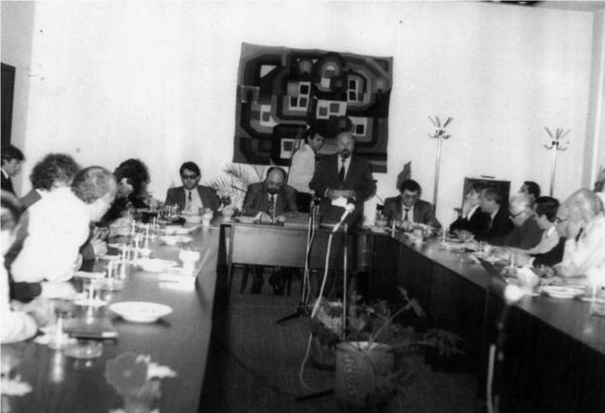

>   *Посещението на Председателя на Народното събрание Александър Йорданов в
>   Югозападния университет*

Когато след посещението на проф. Захари Райков и на председателя на Народното
събрание Александър Йорданов изчезна наклажданото негативно отношение на някои
депутати към нашия университет, депутатът от БСП Емил Костадинов, който е от
Благоевград, изпрати писмено донесение до парламента и министъра на
образованието, в което пише, че „качествата на членовете на академичното
ръководство и недоверието към равнището на учебния процес, което имало сериозно
основание да се предполага, че моментното състояние на института можело да
минира неговото бъдеще“ (вж.в.“Струма“, 14 .12. 1993 г., с.2).

Не беше тайна кои бяха истинските автори на този донос на депутата от БСП. Някои
от неговите приятели съпартийци се страхуваха да не би педагогическият факултет,
в който имаше немалко бивши комсомолски и партийни дейци да остане в дълбока
сянка при моделирането на новата структура на университета. Точно в тези
напрегнати месеци за бъдещето развитие на университета не само този насъскан
депутат, но и специално натоварени журналисти във вестник „Струма“ хулеха
непрекъснато университета и неговото ръководство.

## 21. Нобеловите лауреати на посещение в Югозападния университет

След структурнте промени, които започнахме в университета, вниманието към него
се засили не само в страната, но и в чужбина. След посещението на Ал.Йорданов,
към нашия университет беше проявен голям интерес и от нобелистите от Пагуошкото
движение, основано от Айнщайн и Ръсел. Въпреки тяхната натоварена програма в
България, по изключение, през първата половина на м.октомври 1993 г. направиха
своята незабравима визита в нашия универстет.

В моето встъпително слово запознах президента Йозеф Ротблан и нобелистите с
оригиналната структура и специфичното академично функционално предназначение на
Югозападния университет. Започна ползотворен разговор, в който участваха не само
нобелистите, но и депутатите, които дойдоха с тях.

По време на почивката, която направихме, на терасата пред заседателната зала
посочих на гостите върховете на Рила, Пирин, Беласица и другите планини, които
те прегръщаха захласнати с поглед и искаха да научат повече както за
университета, така и за богатите културни и просветни традиции в Пиринския край.

За доброто посрещане на гостите на университета изключително голяма помощ ни
оказа известният деец на културата в Благоевград композиторът Кирил Икономов,
който подготви специална художествена програма за тях. След тази наша
незабравима среща с нобелистите започнах да получавам от някои от тях покани за
посещение в страните, в които живееха. Те настояваха упорито да им изпратя мои
публикации, които бяха свързани с актуалните проблеми в нашата образователна
система.

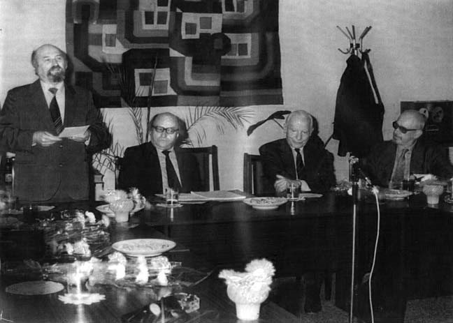

>   *Нобелистите изслушаха с изключително голям интерес доклада ми за
>   състоянието и перспективите в развитието на Югозападния университет „Неофит
>   Рилски“*

>   *След няколко месеца с двама от нобелистите се срещнах на международна
>   конференция на университета в Ексетер (Великобритания). Те споделяха своите
>   прекрасни впечатления от нашия университет с другите участници в симпозиума*

През есента на 1993 г. ускорихме подготовката за създаването на още два
факултета в структурата на Югозападния университет. И този път цялата дейност,
свързана с тяхното утвърждаване, трябваше да поема като зам.-ректор.

През средата на м. октомври зам.-ректорът доц. Гергина Енева, за която имам
спомени като тиха и задълбочена в работата си колежка, си подаде оставка и на
нейно място беше избрана доц. Магдалена Глушкова, коята още от първите дни се
отдаде всеотдайно на работата си.

## 22. Тържествено събрание в Народния дворец на културата

На 11 ноември 1993 г. по повод 200-годищнината от рождението на патрона на нашия
университет Неофит Рилски, в зала № 2 на НДК се проведе тържествен концерт
спектакъл, подготвен от ансамбъл „Пирин“, на който присъстваха много посланици и
депутати. Поради постъпването ми в болница, при подготовката идваха около
болничното ми легло колеги, с които съставихме програмата. Най-активна в това
отношение беше доц. Магдалена Глушкова, която помолих да поеме ръководството на
организационния комитет, настанил се в хотел „Хемус“.

Вечерта, към 19 часа, без разрешение на лекуващия лекар, напуснах Трета болница
в София, за да произнеса тържественото слово за Неофит Рилски, което подготвих
на болничното легло. На тържеството присъстваха кметът на Благоевград Елиана
Масева и областният управител Любим Пранжев, които подпомогнаха организарането
на юбилейното честване. Ансамбъл „Пирин“ изнесе вълнуващ концерт, който беше
посрещнат с възторг от присъстващите гости.

След това тържество в НДК, посланиците от много страни проявиха траен интерес
към нашия университет. Често те бяха наши гости. Срещаха се с преподавателите и
студентите. Така се разшириха взаимоотношенията на Югозападния университет с
университетите в някои от другите европейски страни.

След тържественото събрание в Народния дворец на културата винаги, когато ходех
в Народното събрание, при мен идваха онези депутати, които присъстваха на него.
Те бяха силно впечатлени от моето слово, в което подчертавах изключително
важното място и роля на нашия университет за обновяване и осъвременяване на
просветните и културните традиции в този край на България. Някои от тях бяха
проучили вече моите възрожденски корени. Често ме разпитваха за тях и
недоумяваха защо и от къде извира злобата на онези, които водеха битката срещу
мен и необходимостта от утвърждаване на статут на университета. При една от тези
срещи депутатът Лучников даде най-точният отговор:

– Господин Попов е потомък на известни просветни и революционни дейци, които са
жертви на комунистическия режим, а враговете му са все комунисти, комсомолски и
партийни секретари. Те се страхуват от него.

## 23. Идеята на министър Марко Тодоров за окрупняване на университетите

Когато все още противниците на утвърждаващия се Югозападен университет не се
бяха отказали от превръщането му в Славянски университет, в Министерството на
науката и образованието някои се бяха активизирали, за да окрупнят висшите
учебни заведения на регионална основа. Тази идея още повече застрашаваше нашия
университет. С писмо № 21-00-56 от 3 януари 1994 г. министърът Марко Тодоров
настояваше да получи и нашето становище. Ректорът възложи пак на мен да подготвя
отговор на писмото, въпреки че беше адресирано и до доц. Илия Гюдженов, който
когато трябваше да се решават такива важни въпроси, свързани със съдбата на
Югозападния университет, свиваше рамене и се скриваше. Реших да се срещна очи в
очи пак с министъра. Така и направих. Казах му, че нашият университет има вече
международно признание. Извадих от чантата си разработените от мен мотиви и
внесеното предложение в Народното събрание за утвърждаването му и казах на
министър Тодоров:

&minus;Нашият отговор на вашето писмо за окрупняването на висшите училища се
    съдържа в тези мотиви, господин министър.

Дотогава висшето училище в неговия роден град Русе, където беше и ректор, нямаше
предложение за утвърждаването му като университет. Изразих категоричното
становище на нашето ректорско ръководство, че няма да приемем идеята за
окрупняването на нашия университет с друго учебно заведение. Министърът ме
гледаше учуден от отговора ми. Призна обаче, че все още е във възторг от
тържеството, което отбелязахме в Народния дворец на културата.

&minus;И така, друг отговор на вашето писмо от нас няма да получите, господин
    министър. Нашият отговор е в тези мотиви, които съвсем ясно и категорично
    потвърждават необходимостта от утвърждаването на Югозападния университет в
    този край, който винаги е бил огнище на просвета и култура. Тук е неговото
    родилно място.

Станах и си тръгнах от кабинета на министъра, но той ме задържа за малко и ми
каза:

&minus;От днес и аз ще помисля за самостоятелната съдба на Русенския университет.
    Ще си помагаме, нали?

Усмихнах се и казах:

&minus;Но напишете и вашите мотиви, както ние сме направили това, за да се знае
    ясно как и кога се прави университет.

Все още при някои от тези срещи с министър Тодоров не знаех, че той е агент
Базов от Държавна сигурност, който е бил вербуван в Първо управление. Усещах
обаче неговата скрита гузност при разговорите ни, когато открито изразявах
подозрението ми, че той потайно подържа линията на правителството на Беров,
което се подкрепяше от парламентарните групи на ДПС и БСП.  

## 24. На посещение в ЮНЕСКО по покана на отдела за Висше образование

Особено ползотворна за укрепване авторитета на Югозападния университет се оказа
специалната покана, която получих от Отдела за висше образование на Юнеско за
десетдневна проучвателна визита.

По време на посещението ми в Париж през м.февруари 1994 г. имах прекрасната
възможност да се срещна и разговаряме обстойно за нашия университет с Колин
Пауър – зам.-генерален директор на Юнеско, Антонио Диас, директор на Отдела за
висше образвание, както и с неговите колеги от сектор „Образование“. По време на
срещите ни обсъждахме възможността за включване на Югозпадния университет в
мрежата на висшите учебни заведения, в които вече имаше създадени катедри „
Юнеско“, както и актулни въпроси, свързани с реформиране на учебните програми и
учебници, с подготовката на преподавателите, които да отговарят на новите
изисквания .

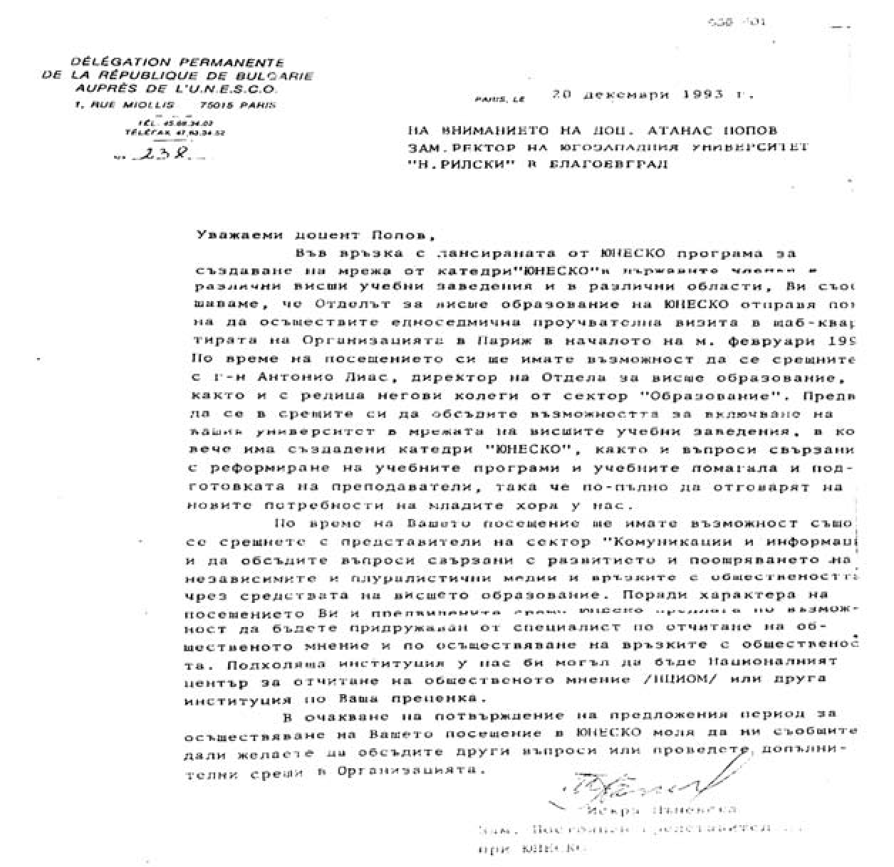

>   *Поканата, която получих от отдела за Висше образование на Юнеска за
>   десетдневна проучвателна визата*

Направи ми впечатление, че до моето идване в Юнеско името на нашия университет
не се срещаше никъде в справочните документи на световната организация. Истината
е, че в близо 20-годишната история на университета посещението ми бе първят опит
да се установи контакт с нея. Създаденият Американски университет в Благоевград
бе потърсил контакти веднага с Юнеско, затова много често по време на срещите ми
беше поставен въпросът какво е моето отношение към него. Тогава този университет
бе направил първите си стъпки, но специалистите от направление „Висше
образование“ вече знаеха всичко за все още нерешените проблеми в него.

Когато научиха от мен за геополитическото място, структурата и специалностите на
нашия университет, те го оценяваха като много значим за развитието на висшето
образование на Балканите, поради което отделиха специално внимание и грижи за
развитието му. Изключително голям интерес проявиха към филологическия,
историческия и новосъздаващия се факултет по изкуствата. Разбира се, с интерес
посрещнаха и информацията ми за другите факултети (природо-математическия,
икономическия и правния). Когато подчертавах, че в педагогическия факултет имаме
солидни традиции и е водещ в страната за подготовка на начални учители, А. Диас,
директор на направление „Висше образование“, прояви изключително голям интерес
към него. Той ми каза, че нашият опит в това отношение заслужава да бъде проучен
по-задълбочено от Юнеско и използван и в други европейски страни.

Много ползотворни бяха срещите ми с Д. Читоран, шеф на секцията за проекта
„Юнитуин“ и катедри Юнеско и неговите колеги Д. Беридж и И. Седлак. С тях
обсъдихме създаването на катедра Юнеско и в нашия университет. Не мина много
време след завръщането ми от Юнеско такава бе създадена, но вместо във факултета
по изкуствата, каквато бе уговорката ни в Париж, някои самоволно я откриха във
Факултета по философия, където не беше по предназначение (повече информация за
посещението ми в Юнеско вж.: в.“Югозападен университет“, Юнеско и
Благоевградския университет си протягат ръце, март 1994 г., с.1 и 3; в.
“Пиринско дело“, 18 февруари 1994 г., с.1 и 4; в. “Струма“: Доц Ат. Попов
поканен в Париж, Юнеско съдейства на ВПИ.1994 г.).

Голяма заслуга за ползотворното ми посещение в Юнеско и съставената програма,
свързана с осъществяването на десетдневната ми проучвателна визита в
щаб-квартирата на Организацията, имаше зам.-постоянният представител на Юнеско в
Париж Искра Пъневска.

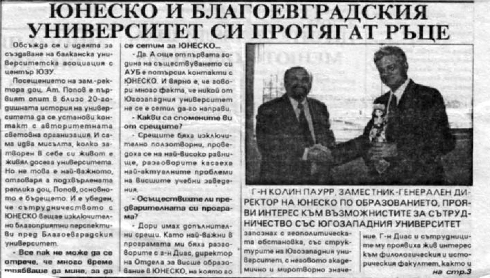

*След срещата-разговор с Д. Читоран, Д. Берадж и И. Седлак .*

## 25. Още две трепетни очаквания за гласуване статута на Югозападния университет

Няколко дни след завръщането ми от Юнеско в Париж, отидох в Народното събрание,
за да ускоря внасянето на предложението за приемане статута на университета ни.
Отново бяха представени разработените мотиви, които се обсъждаха от депутатите.
Получих уверение от председателя на Народното събрание след 20 април да включи в
дневния ред гласуването на статута на Югозападния университет. Бях отново на
балкона над заседателната зала по време обсъждането. Вълнувах се много. Вярвах,
че този път ще се върна в Благоевград с хубава новина.

Когато започна гласуването, забелязах, че групата на социалистите беше оредяла.
Депутатите от СДС спазиха решението си да гласуват единодушно за предложението
Югозападният университет да получи своя статут. Само десет депутати от БСП
гласуваха за приемане на проекта. Бях дълбоко възмутен, когато измежду тях не
видях както депутата от Благоевград Емил Костадинов, така и някои други депутати
от неговата партия, които имат корени от Пиринския край. Вече стана съвсем ясно,
че те казваха едно пред мен, а правеха друго, което им бяха поръчали техните
съпартийци от Висшия педагогически институт, които бяха против утвърждаването му
като университет (вж. БСП провали проекта на ЮЗУ, поборникът Ем. Костадинов се
скри, СДС е единодушно „за“ – в-к „Струма“, 23.04.1994 г.).

Вече и на цялата общественост в Благоевград стана съвсем ясно кой е „за“ и кой е
„против“ утвърждаване статута на Югозападния университет. Направи ми
впечатление, че противниците на нашето предложение в Народното събрание се
радваха много на случилото се в парламента. Те вече бяха сигурни, че Висшият
педагогически институт ще възкръсне и неговите предишни партийни и комсомолски
ръководни кадри ще се върнат на бял кон.

След една седмица доц. Снежана Ботушарова, зам.-председател на Народното
събрание, ми се обади, че за 12 май е насрочено ново заседание на Народното
събрание, на което отново ще се обсъжда и гласува решение за даване статут на
нашия университет и на Варненския свободен университет. И този ден бях пак на
вече познатото мое място на балкона, над заседателната зала на Народното
събрание.

Заседанието на Народното събрание започна следобяд. За пореден път по т. първа
беше внесено постъпилото проекторешение от Александър Джеров и Йордан
Школагерски.

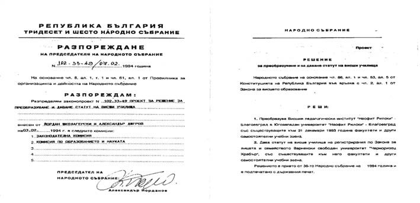

Депутатът от Благоевград д-р Ивайло Ловджиев поиска думата за изказване. Той
напомни, че е вносител на предложение, което се отнася само за Югозападния
университет и съвсем основателно настояваше да се гласува поотделно за двете
висши училища. Не беше тайна, както заяви д-р Ловджиев, че немалко депутати
изразяваха съмнение относно необходимостта тези две висши учебни заведения да се
поставят на една и съща плоскост. Социалистите искаха техният вече известен като
„червен“ университет да мине заедно с нашия. Много убедително прозвучаха
мотивите, които бях подготвил, прочетени от д-р Ловджиев, който каза:

– Подновявам моето процедурно предложение като предлагам двата университета да
бъдат гласувани поотделно.

Тези думи стреснаха депутатите от БСП, някои от които станаха и излязоха от
залата.

Тогава председателят на Народното събрание, в подкрепа на процедурното
предложение на д-р Ловджиев, каза, че двата университета трябва да бъдат
гласувани поотделно, тъй като не могат да се поставят на едно и също място един
хуманитарен с един чисто икономически ВУЗ.

Обиденият на Югозападния университет проф. Д. Сепетлиев побърза да вземе думата
и каза, че Комисията по образование е била притеснена от това, че след внесеното
искане от Югозападния университет напоследък имало голям натиск и от други висши
учебни заведения да променят своя статут. Сепетлиев не спомена обаче истината,
че нито едно от тях нямаше разработени мотиви както тези на нашия университет.
Той подчерта, че се подготвя нов Закон за висшето образование и чак след
приемането му могат да се обсъждат такива законопроекти, както днешния.

И така, да напомня пак на самозвания „строител“ на Югозападния университет доц.
Илия Гюдженов, че другите тръгнаха след нас, а ние не минахме „покрай тях“,
както заявяваше той. Така е, който не си е мръднал пръста в тази няколкогодишна
борба за утвърждаване статута на Югозападния университет, той не знае колко
трудна беше тя.

Проф. Д. Сепетлиев се обърна към Министъра на науката и образованието Марко
Тодоров, за да получи неговата подкрепа. Министърът изрази и мнението на Съвета
на ректорите, който този ден беше взел следното решение: “Съветът на ректорите
възразява срещу промяната на статута на съществуващите университети и висши
училища, както и срещу откриването на нови университети, което трябва да бъде
отложено до приемането на нова законова уредба за акредитация на висшите
училища“.

Това Решение на Съвета на ректорите е било подписано от всички ректори.
Министърът каза, че е подписано и от онези ректори, които имат искане в
Народното събрание за преименуване на университетите или приемане на техен
статут.

Тогава се запитах:

– Къде ли е бил нашият ректор проф. Чимев, когато се е обсъждал този въпрос в
Съвета на ректорите?

Министърът на образованието Марко Тодоров отклони разговорите по разглежданото
предложение за статута на нашия унверситет. Той каза, че ще внесе проект до края
на м. юни за окрупняване на висшите училища и промяна на тяхното наименование,
за да се подготвят и другите висши училища за такава промяна. Убеден бях, че
този министър също изпълняваше някакво указание на комунистите в парламента.
Тогава още не се знаеше, но след това цъфна новината, че е бил сътрудник на
Първо управление на Държавна сигурност с агентурното име „Базов“ и е имал
специално поставена задача за изпълнение на директивите на БСП в системата на
образованието.

След казаното от Марко Тодоров, ревностна защита на Югозападния университет
направи проф. Елка Константинова, която подчерта, че не бива да се отлага
приемане статута на Югозападния университет. Когато тя заподозря, че отлагането
на това гласуване има връзка с „измисления Славянски у ниверситет“, който също
беше внесъл своето предложение за утвърждаване в Народното събрание, проф.
Захари Захариев стана и произнесе своята „пламенна“ реч за голямата необходимост
от неговото утвърждаване.

Проф. Елка Константинова настояваше упорито да се премине към гласуване статута
на Югозападния университет, но за мое учудване депутатът от СДС Стоян Райчовски
предложи да се отложи разискването по тази точка от дневния ред на Народното
събрание. Бързо на това предложение възрази моят добър приятел депутатът Иван
Будимов от СДС, който предложи да се гласува по т. 1 предложенето за статута на
Югозападния университет, а по т. 2 за Свободния университет във Варна. Той
предложи на друго заседание да се обсъжда утвърждаването на други висши училища.

Предложението на Райчовски за прекратяване на обсъжданията по този въпрос до
представянето на проект от министър Марко Тодоров за нов Закон за висшето
образование не се прие, но след това депутатите от БСП като Мими Виткова, Румяна
Куртева и други, отклониха гласуването и заседанието на Народното събрание беше
отложено за следващия ден.

И през този мъчително труден за мен ден разбрах отново за големите „игри“, които
се правеха в българското Народно събрание. Техни майстори бяха червените
депутати и агентите на тяхната Държавна сигурност, някои от които бяха превзели
и Министерството на образованието и науката.

След това „отсрочено“ приемане статута на Югозападния университет, БСП започна
ускорено създаване на своите „червени университетски крепости“ в системата на
образованието. Кадрите им вече бяха подбрани. Оставаше само денят за тяхното
„вкупом“ утвърждаване след като превземе властта. Стана ясно, че Любен-Беровото
правителство беше тяхно от 1992 до 1994 г. с повечето „независими министри“,
стъкмени от Ахмед Доган.

След около половин месец, на 27 май 1994 г., заедно с доц.Славчо Щраков и
зам.-ректора Магдалена Глушкова, заминахме на научна конференция в град Орадея,
Румъния, свързана с международното сътрудничество между университетите. Първият
въпрос, който ми постави ректорът на университета в този град, беше дали вече
сме получили статут на университет. Казах му, че предстои ново гласуване, което
очакваме. След конференцията заедно с доц. Магдалена Глушкова отпътувахме във
Виена, където трябваше да доуточним с представители на нашето посолство
създаването на по-тесни връзки с някои от университетите в Австрия.

## 26. Нова червена атака

През тези напрегнати дни в моята работа бившите партийни и комсомолски секретари
в университета продължаваха атаката срещу мен. Следваха нови удари под кръста.
Измислеха се какви ли не скудоумни писания, които разгневиха студентите и
синдикатите в университета и отново излязоха в моя защита.

*Декларации на сандикатите в подкрепа на усилията ми за даване статут на
университета ни от Народното събрание и утвърждаване на неговата нова структура*

## 27. На международна конференция в Англия на тема: „Европейски перспективи в променяща се Европа“

След посещенето ми в Румъния намерих в кабинета ми около десет покани за участие
в международни научни конференции, които все още пазя в личния си архив. Реших
да приема поканата за международната конференция на тема „Европейски перспективи
в променяща се Европа“ в град Екситър, Великобритания.

В Екситър пристигнах на 27.06.1994 година. Бях приятно изненадан, че там ме
посрещна един от нобелистите, с когото се запознахме при посещението му в нашия
университет. И на него първият въпрос беше:

>   – Какво стана? Получихте ли статут на университета?

Още през първия ден в Екситър бях поканен от зам.-ректора на университета, за да
се запозная с неговата структура и специалностите, по които се подготвят
студентите. Бях удивен от това, което видях.

До учебните корпуси на университета бяха студентските общежития, а в централната
част, до ректората, се извисяваха Студентският дом на културата и Библиотеката,
където кипеше разнообразна научна и културна дейност. Наблизо се извисяваше и
черквата, от която излизаха преподаватели и студенти. Притворих очи и си
замечтах и нашият университет да има това, което поглъщах с погледа си.

На научната конференция имаше университетски преподаватели от всички европейски
страни, разпределени по секции. Преди да бъде обявен моят доклад, бях уведомен,
че към него проявяват интерес и участниците в конференцията от другите секции.
Попитаха ме дали ще се съглася да се изслуша и от тях. Тази изненада за мен беше
приятна, но и много задължаваща. Моята тема беше: „Комплексно-интегративният
подход при подготовката на педагогическите кадри“.

Разискванията по доклада бяха задълбочени и осмислени. Това беше проблемът,
който изследвах от няколко години въз основа на моя дълъг учителски и
преподавателски опит в нашия университет.

Проф. Теодор Зандер поиска препис от доклада и ми каза, че ще го изпрати веднага
в Брюксел, за да бъде публикуван в подготвения за печат сборник, който
представяше най-авангардните научни трудове на източноевропейските учени, въз
основа на които трябваше да се изгради нов модел за подготовка на
педагогическите кадри, залегнал при осъществяване реформите в Източна Европа.

По време на конференцията се сприятелих с много мои колеги, учени от цяла
Европа. Последният ден бях зарадван, че ръководството на Екситърския университет
е настоявало да остана още 3 дни, т.е. до 7 юли, за да се срещна с повече техни
преподаватели. Това бяха наистина незабравими дни, през които се запознах с
видни английски учени и най-добрите преподаватели от университета. Поканен бях
на специална вечеря от кмета на града, на която присъстваше елита на града и
ръководството на университета.

>   *Докладът ми, изнесен в Ексетър беше веднага изпратен и публикуван в
>   сборник, който се издава в Брюксел*

След посещението ми в Екситър бях включен в Британския съвет, осигуряващ
културно и образователно сътрудничество с другите страни. Получих десетки покани
за участие в международни конференции и семинари. Приятно бях изненадан, че
докладите ми бяха изпращани и в други секции на международните симпозиуми на
т.нар. Верига Compare – te, в която се обсъждаха актуалните проблеми в системата
на образованието.

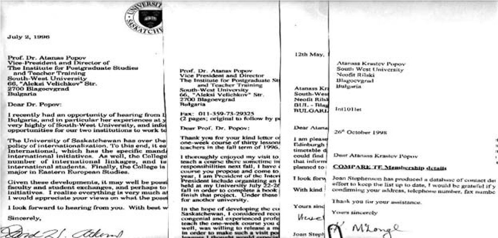

>   *Това са малка част от поканите, които получавах за участие в международни
>   симпозиуми*

> *Писмо, което получих от Университета във Финландия, в което проф. Хану Рьоти
> пише: „Уважаеми проф. Попов, щастлив съм да Ви информирам, че съм изпратил вашия
> доклад на другите участници в сесията, посветена на училищната реформа“*

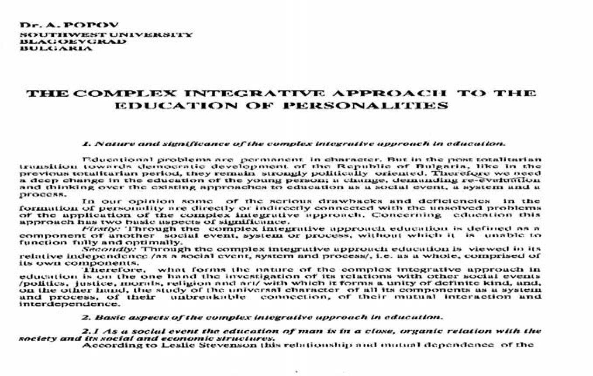

> *Ето и първата от десетте страници на доклада, който изнесох на международната
> конференция за комплексно-интегративния подход при подготовката на
> педагогическите кадри*

Едни от най-известните световни учени в областта на обществените науки както от
западните, така и от източните страни, проявиха изключително голям интерес към
научните ми разработки, свързани със същността и основните аспекти на
комплексно-интегративния подход във възпитанието. И когато някои от тях
настоятелно искаха да се срещаме по-често, „червената агитка“, поощрявана от
разработените опорни точки от ВС на БСП, продължаваше битката срещу мен.

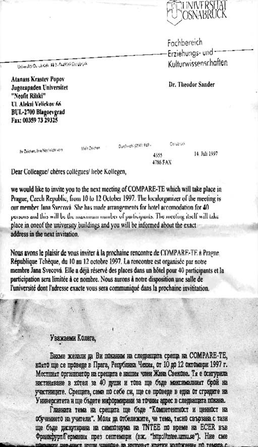

На 28 юли 1994 г. беше отново внесено предложението за гласуване статута на
Югозападния унверситет от Александър Джеров. Той подчерта, че много пъти се
преминава към гласуване на това предложение, но по някакви технически или
процедурни причини се преписва в дневния ред. Той изрази отново становище, че
трябва да се гласува поотделно за всяко предложение. Отново се предлага за
гласуване само на двата университета. Това е първото решение, което се предлага.
Александър Маринов постави въпроса за отговорността за досегшните проваляния на
гласуването. Взаимно се обвиняват отделните парламентарни групи. Николай Христов
този път даде да се разбере, че сега отсъстващите от СДС ги няма заради това, че
след гласуването за Югозападния университет се подготвя и внасянето за
Славянския университет, с което те не са съгласни.  

## 28. Създаване на Факултета по изкуствата

Още при назначаването ми като гл. асистент във Висшия педагогически институт в
разговор с проф. Жечо Атанасов и тогавашния ректор Павел Драганов предложих
разпилените специалности по изкуствата в различните факултети да бъда събрани в
един факултет. Споделих моя опит като преподавател в Полувисшия институт за
подготовка на културно-просветни кадри, където те функционираха много успешно.
Ректорът предложи названието на този факултет да бъде „Извънучилищна
педагогика“. Не се съгласих. Проф. Жечо Атанасов му каза:

– Павле, идеята на Атанас е друга. Той иска да се подготвят кадри за сферата на
културата, в която педагогическите аспекти на тази дйност са все още неизяснени.
Вземи и прочети монографията му „Основи на културно-просветаната дейност“ и ще
разбереш каква иска да се направи.

Ректорът Павел Драганов беше един от онези български педагози, които се бяха
отдали изцяло на изследавателска дейност, свързани с пионерските и комсомолските
организации. Кандидатската му дисертация е на тема: „Пионерският актив и
изграждането на дееспособен ученически актив“.

Когато през следващата 1983 година беше назначен за ректор доцент Петър Николов
(сега професор), поисках среща и с него, за да споделя убеждението ми за
необходимостта от педагогизиране на подготовката на студентите от художествените
специалности и тяхното обединяване в един факултет. За разлика от предишния
ректор, Петър Николов прие моята идея и ме помоли да му подготвя текст за
докладна записка, която изпрати до министъра на народната просвета Александър
Фол. Тя беше одобрена. В нея обаче беше отминато предложението ми за обединяване
на художествените специалности в един факултет, което ме изненада. Тогава все
още и немалко от преподавателите по тези специалности не бяха убедени в тази
изключително голяма необходимост.

Вече като зам.-ректор на нашия университет една от първите задачи, която си
поставих за решаване, беше обединяване на специалностите по изкуствата в един
факултет. Докато някои от бившите партийни и комсомолски дейци във Висшия
педагогически факултет отрупваха тогавашния вестник „Струма“ с клеветнически
материали, най-вече срещу проф. Кирил Чимев и мен, ние продължавахме упорито да
изграждаме новата структура на университета.

Най-упорита беше подготовката за създаването и утвърждаването на Факултета по
изкуствата през 1994 г. Спецалностите в тази област бяха разпилени в няколко
факултета, поради което между тях не се осъществяваше необходимата координация и
съгласуваност. Някои от преподавателите в специалностите по изкуствата вече бяха
направили опити да интегрират тези специалности, но все още едни от тях си
останаха във Факултета по предучилищна педагогика, а други във Факултета за
начална училищна педагогика. Обединих усилията в това отношение на проф. Христо
Арищиров, доц. Златко Павлов, доц. Йордан Гошев, доц. Николина Огненска, доц.
Мария Горанова, доц. Георги Драчев, доц. Стефан Стоянов, доц. Илия Куков и други
преподаватели от художествените специалности.

Още през 1991 г. беше взето решение от Академичния съвет за откриване на
факултет с наименование Факултет по педагогика на изкуствата, но на
учредителното събрание през 1992 г. някои от преподавателите по тези дисциплини
провалиха тази хубава идея.

Сега бяха необходими немалко усилия, за да бъдат убедени всички преподаватели от
посочените специалности за нуждата от създаването на този факултет. Вече бяха
привлечени и водещи учени в областта на изкуствата, с които имах няколко срещи.
Зад моето твърдо решение да проведем Общо събрание за създаването на факултета
застанаха отново предишните инициатори. Професор Арищиров настояваше събранието
да се ръководи от мен, защото се очакваше съпротива пак от онези, които бяха
против откриването на този факултет. И понеже имаше вече привлечени изтъкнати
хабилитирани преподаватели, те се страхуваха, че ще бъдат освободени от работа
поради това, че някои от тях нямаха още научни степени и звания.

Цели четири часа продължи събранието, на което предишните противници на този
факултет създаваха тежка атмосфера. Уверявах колегите, че новите хабилитирани
преподаватели, които бяха привлечени, за да четат лекции, ще им помогнат за
тяхното по-бързо научно израстване, както и стана след това.

На събранието присъстваше и известният български учен проф. Атанас Натев. Когато
успях да укротя т.нар. „опозиция“, той се доближи до мен и ми прошепна:

&minus;Поздравявам те! Аз никога не бих издържал на такова напрежение.

Най-после на 13 ноември 1994 г. Академичният съвет гласува с мнозинство решение
за откриване на Факултета по изкуствата. За декан беше избран проф. Христо
Арищиров, а за зам.-декан гл. ас. Златко Павлов. Бях избран за член на
Факултетния съвет, за да подпомагам новоизбраното ръководство.

Никога няма да забравя, че деканът и неговият заместник бяха постоянни гости в
кабинета ми, където заедно обсъждахме по-нататъшното развитие на факултета, в
който бяха назначени изтъкнати български учени в областта на изобразителното,
музикалното, театралното, хореографското изкуство и известни културолози. Заедно
с вече споменатите първи инициатори за създаването на факултета по изкуството не
мога да отмина и заслугата на създателите на специалността „Културология“ проф.
Влъчко Кунчев, проф. Елит Николов, проф. Атанас Натев и проф. Неделчо Милев,
които бяха създатели на проекта на това ново направление в структурата на
Факултета по изкуствата. Много силно беще присъствето на изтъкнати български
учени и в другите специалности. Незабравими си останаха моите много чести срещи
с тях.

Някога бях и един от инициаторите за обединяването на създадените в България три
института за подготовка на културно-просветни кадри – в Благоевград, Варна и
Хасково, с другите полувисши институти в областта на изкуството (музикален,
хореографски и библиотечен). Тогавашната ми мечта се осъществи по своеобразен
начин в Югозападния университет.

Когато се срещаха трудности в работата на новосъздадения Факултут по изкуствата,
при мен много често идваха както неговите ръководители, така също и отделни
преподаватели, за да решим тяхното преодоляване. Тези срещи останаха незабравими
в моята памет.

Още през първите години от създаването на Факултета по изкуствата, започна да се
проектира и създаването на съвсем нови специалности в този факултет. Именно
затова си спомням, че вече привлечените изтъкнати учени в областта на
изобразителното изкуство, заедно с все още младите тогава преподаватели
настояваха упорито да се промени названието „Факултет по педагогика на
изкуствата“ с „Факултет по изкуствата“. На 17.04.1995 г. официално беше внесено
това предложение до членовете на Факултетния съвет, което се одобри и утвърди
сегашното название на Факултета по изкуствата.

Създаденият Факултет по изкуството от една страна обогати и разнообрази
културната дейност в Благоевград, а от друга – създаде много тесни връзки и
взаимоотношение с културните институти в Благоевград – Държавния театър „Н.
Вапцаров“, Държавния ансамбъл за народни песни и танци „Пирин“, Камерната опера
– Благоевград, Дружеството на художниците, Радио Благоевград, а по-късно и със
студиото на Българската национална телевизия.

Радвам се, че сегашното ръководство на Факултета по изкуствата постигна много за
неговото утвърждаване като един от най- привлекателните факултети в структурата
на Югозападния университет. Винаги, когато се срещам с неговия декан проф.
Йордан Гошев, се вълнувам и му стискам здраво ръката за постигнатите успехи на
преподавателите и студентите.

## 29. Хубаво начало и на Философския факултет

След утвърждаването на Факултета по изкуствата, като отговарящ от ректорското
ръководство за създаването на новата структура на Югозападния университет,
ускорих подготовката за създаване и на Философския факултет. Бях убеден, че без
него новата структура на Югозападния университет няма да бъде пълна. Този път
потърсих помощта на проф. Йордан Венедиков от Софийския университет, с когото
вече бяхме в много близки приятелски взаимоотношения. Както вече подчертах,
неговите родословни корени са от разложкото село Баня и произхожда от видно
възрожденски семейство. Той е син на проф. Петко Венедиков, внук на героя от
Преображенското въстание ген. Йордан Венедиков, потомък на Алеко Константинов.
Още от първите ни срещи с него взаимно споделяхме тезата, че най-важните фактори
за формирането на личността са семейството и наследствеността. Той често ми
казваше:

&minus;Атанасе, твоето прекрасно семейство, възрожденският ти род и наследеното от
    него са те направили издържлив на ударите от „червените“, които са все деца
    на онези, които слугуваха на комунистическия режим. И все пак, кажи ми, не
    се ли страхуваш от тях?

&minus;Данчо, страхът от тези хора изчезна още през детските ми години, когато
    арестуваха и пребиха от бой баща ми, който, обвит в овчи кожи, за да олекнат
    болките му, ми каза: „Насе, стискай зъби и набирай сили, когато те боли от
    техните удари! Комунистите ги е страх от нас, затова вървят по стъпките ни
    навсякъде“.

Кога ли не, къде ли не те вървяха по мен като побеснели псета и фабрикуваха лъжи
и клевети, някога за родата ми, а сега за мен. Това е тяхната храна, с която
водят своя скотски живот.

Когато подготовката за създаването на Философския факултет беше вече към своя
край, на 18.01.1995 година Академичният съвет взе решение за неговото
утвърждаване в структурата на Югозападния университет. На 30 март издадох
заповед за свикване на Общо събрание, което се проведе на 14 април 1995 г. в
заседателната зала на ректората.

Престоеше ни да осигурим необходимия брой от хабилитирани преподаватели. На
поканата ни се отзоваха изтъкнати български учени в областта на обществените
науки като проф. Ради Радев, проф. Иван Стефанов, проф. Йордан Венедиков, проф.
Иван Денев, проф. Славчо Вълчанов, ст.н.с. Петко Божиков, ст.н.с. Пепка
Бояджиева, доц. Витан Стефанов, доц. Александър Рангелов, доц. Валери Динев,
доц. Димитър Киров и др. Посочените университетски преподаватели бяха и членове
на първия Факултетен съвет, заедно с някои изтъкнати учени и от другите
факултети на университета. Един от тях беше и моят добър приятел проф. Милчо
Лалков. По настояване на колегите, за да бъдем по-близо до тях и да помагаме за
утвърждаването на факултета, бяхме избрани и двамата с проф. Кирил Чимев.

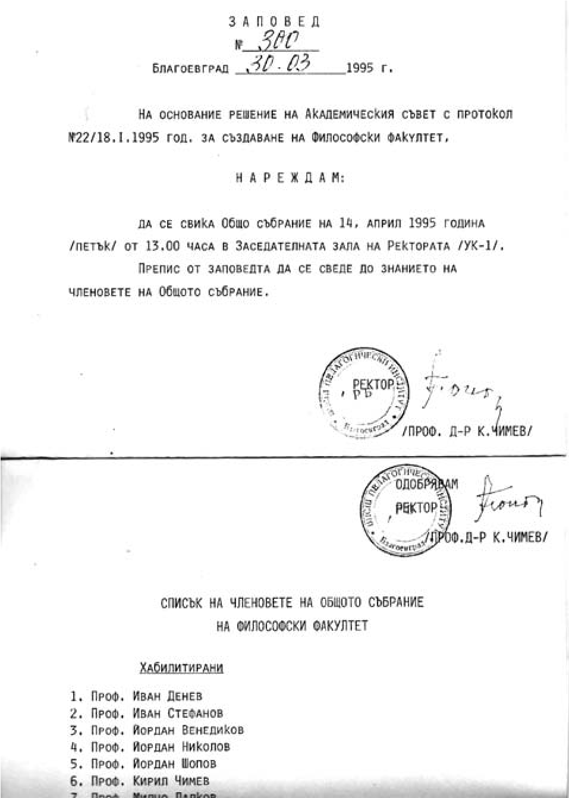

Отначало във Факултета по философия бяха открити специалностите „Теология и
философия“ и „Социология“, а от следващата година и специалност „ Политология“,
по които беше извършен прием на студенти.

Никога няма да забравя декана на Философския факултет проф. Иван Стефанов, който
с тиха стъпка често идваше в кабинета ми, за да споделя някои от проблемите,
които трябваше да решаваме заедно. Приятни спомени имам и за тогавашните
преподаватели проф. Александър Рангелов, доц. Лазар Копринаров, доц. Георги
Апостолов, доц. Мария Серафимова и други. Свой дял за укрепване на факултета има
проф. Витан Стефанов, който беше и негов декан. Още в самото начало той идваше
на срещите ни с проф. Йордан Венедиков и моя съученик от Неврокопската елитна
гимнзия проф. Петко Божиков, който се радваше на всичко, което постепенно
израстваше в нашия университет.

Помня първата международна научна конференция, която беше посветена на
православното богословие, организирана от Философския факултет. Беше в Рилския
манастир. Имаше много учени от други страни. Все още пазя моето встъпително
слово на конференцията, в което анализирах взаимната връзка и обусловеността
между православното християнство и възпитанието. След всеки доклад имаше оживени
разисквания, а след това незабравими разходки из Рилската обител.

Сега, когато срещна професор Борис Манов, декан на Философския факултет, винаги
възкръсват спомените ми за онези, с които го създадохме с немалко трудности.
Радвам се, че сегашното деканско ръководство създава истинска академична
атмосфера във факултета, която укрепва и авторитета на университета.  

## 30. Университетът при правителството на Жан Виденов

На 25 януари 1995 г. бе съставено правителството на Жан Виденов. На следващия
ден ме пресрещна един от комунистите от университета, на когото баща му беше
известен като един от най-жестоките някогашни служители в Държавна сигурност. До
вчерашния ден той висеше в кабинета ми, за да се моли за какво ли не. Не крия,
че съм правил и компромиси за решаването на неговите вечни проблеми, свързани с
оплаквания от студентите от неприличното му поведение.

– Ха сега, де! Твоята свърши. Ще ти падне главата като на яре! Дойде нашето
време, а ние не обичаме враговете си – ми каза довчерашният червен подмазвач.

Гледах го и се чудех на скоростното премятане на отношението му към мен. С
изкривени погледи срещах и онези двама-трима, които водеха нестихващата война
срещу мен. И този път запазих самообладание. Отминавах ги и не променях нито за
миг темпото на напрегнатата ми работа, свързана с дейността ми като зам.-ректор.

Една от основните ми грижи си оставаше приемане статута на университета в
Народното събрание. Разбрах, че правителството на Жан Виденов набързо е стъкмило
съвсем нов списък за:

1. Създаване на нови висши училища.
2. Преобразуване в академии.
3. Преобразуване в университети.
4. Даване статут на висши училища.

В този нов „червен“ списък Югозападният университет го нямаше. Скалъпената от
министъра на образованието и науката проф. Илчо Димитров комисия беше подходила
съвсем субективно и землячески при съставянето на новия списък. И понеже
повечето нейни членове бяха само депутати от БСП, всеки един от тях бранеше
висшето училище в неговия роден край.

Възмутен от този подход при съставянето на новия списък, изпратих писмо до
председателя на Комисията по образование и наука в Народното събрание Юрий
Борисов. Разговарях и с някои членове на комисията. Едни вдигаха гузни рамене, а
други ми казваха, че е имало предложение първо да се гласува за висшите училища,
които са от Източна България, а след това за тези, които са от Югозападна. Тази
нова червена хитрост ме възмути. Зам.-председателят на комисия пък искаше да ме
увери, че основният мотив за отпадане на нашия университет от новия списък е бил
свързан с това, че сме нямали необходимия брой професори и доценти, което не
беше вярно.

Нито един от т. нар. „нови“ университети нямаше представени мотиви в Народното
събрание за необходимостта от даване на статут за такива, каквито имаше
Югозападният университет.

Коя беше истината, за да не бъде включен в списъка ?

Още от 1993 г., когато беше приложен Законът „Панев“ за лустрация, нашият
университет беше известен като „най-синият“ в страната. Комунистите имаха уплах
от него, защото и през 1995 година техните ръководни кадри бяха извън
ректорското, факултетните и катедрените ръководства. Другата причина беше
свързана с вече подчертаното намерение на депутатите от БСП той да бъде
преустроен като Славянски университет.

Реших да присъствам на последното заседание на комисията, което се проведе в
сградата на бившия партиен дом. Помолих да дойде с мен и проф. Кирил Чимев,
който ме гледаше с уплашени очи. Страхуваше се да не загуби ректорското си място
при предстоящите избори на новото ръководство в Югозападния университет. След
като представих за пореден път вече публикуваните от мен разработени мотиви за
даване статут на Югозападния университет, членовете на комисията започнаха да се
споглеждат гузно и тогава беше включен в т. нар. „Илчов“ списък и нашият
университет.

Бях неприятно изненадан от невярното твърдение на проф.Чимев, че и неговият
състудент и приятел проф. Сендов помогнал за включването ни в новия списък.
Никога той не е вземал отношение при решаването на този проблем. Как тогава той
допусна такава спънка, която трябваше да преодолея с толкова големи усилия?

Като председател на Народното събрание акад. Сендов отмина с безразличие
изчезването на нашия университет от първоначалия списък на БСП за даване на
неговия статут. Та нали още на 11 април 1995 г. отново изпратих мотивите за
даване на статут на нашия университет. Някогашното галениче на Тодор Живков,
наричащ себе си „първоосновател“ на Филиала на Софийския университет в
Благоевград, както винаги, така и този път послушно изпълняваше поставените му
задачи от БСП. Една от тях сега беше свързана с потайно замисленото създаване на
Славянския университет в Благоевград.

Помня, че един наш бивш студент от театралния профил на вече създадения Факултет
по изкуствата, както и Веселин Иванов, студент от бившия Институт за
културно-просветни кадри, ме намериха в една от парламентарните зали, за да
споделят и те с мен възмущението си от потайните игри на БСП, свързани с
изчезването на нашия университет от списъка за утвърждаване статута на вече
набелязаните „червени“ университети.

Най-после на 15 юни 1995 година в предложеното Решение за създа-

ване и преобразуване на висши училища от председателя на Комисията по
образование и наука Юрий Борисов беше вписан и нашия университет, но вече не на
първо място, което заемаше досега, а след Висшето техническо училище „Ангел
Кънчев“ в Русе и Висшия педагогически институт „Константин Преславски“ в град
Шумен. Няколко дни след това, на 21.07. 1995 г., „по комунистически“, вкупом
мина общото гласуване в Народното събрание списъка за създаването на нови
университети, академии и даване статут на висши училища, сред които беше и
Югозападният университет „Неофит Рилски“.

В наши дни, когато се говори за многото висши училища, университети и академии в
България и девалвираното в тях обучение и възпитание на студентите, не бива да
се забравя, че те се създадоха като червени крепости на Българската
социалистическа партия при правителството на Жан Виденов, с благословията и на
председателя на Народното събрание Благовест Сендов, известен и с т.нар.
„Сендовска система“ в образованието, според която учениците до пети клас не се
писмено оценяваха, т.е. обедняваха своята писмена култура. Освен това бяха
обединени част от изучаваните предмети в една дисциплина и се създаде истинска
каламбура в учебния процес, която се отрече от преподавателите като изключително
опасна за качеството на обучението и възпитанието на учениците.

„Най-значителна“ беше тогава ролята на министъра на образованието и науката
проф. Илчо Димитров при утвърждаването на тези сегашни своеобразни крепости на
незатихващия комунизъм. Като бивш член на ЦК на БКП и зав. отдел „Идеология и
агитация“, агент на Държавна сигурност, работил за 1-о ГУ, Илчо Димитров
изпълняваше „успешно“ новите си партийни задачи.

На една от срещата ми с него в университета той мълча, когато споменах за
спънките, които ни създаваха неговите съпартийци в развитието на нашия
университет. Погледна ме намръщен, когато му казах и за трудностите, които
срещаме от червеното правителство.

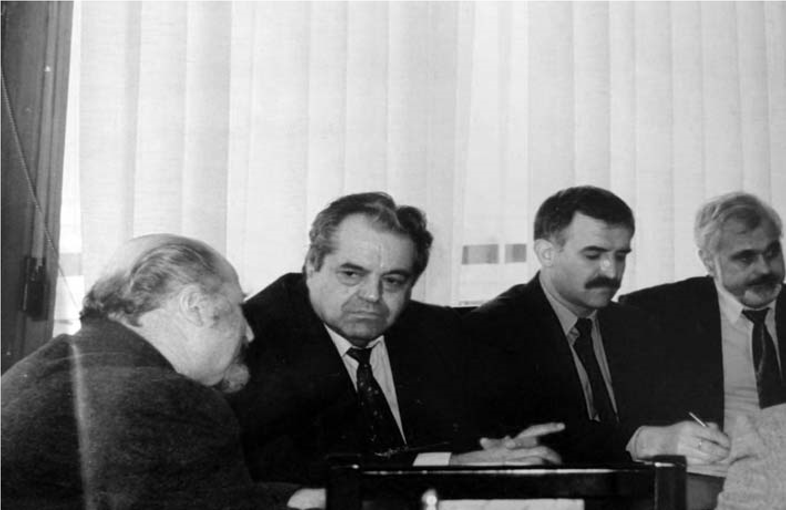

>   *Веднага след назначаването на проф. Илчо Димитров за министър на
>   образованието и науката пристигна в нашия университет. Искаше да прекъснем
>   прилагането*

>   *на „Закона Панев“, което не допуснах да се случи*  
>   

## 31. Пропиляна памет

Сега, когато прелиствам страниците на издадения през 2004 г. сборник „Началото“
от спомени за създаването на Югозападния университет „Неофит Рилски“, съставен
от онези, които се представят като негови „строители“, се учудвам на тяхното
самохвалство. Единствен проф. д-р Илия Конев не отминава някои от страшните
истини, с които е свързано подронването на авторитета на университета от някои
несменяеми предишни ръководители, протежирани лично от тогавашното партийно
ръководство.

Съвсем правдиво звучи написаното от проф. Магдалена Глушкова: „Жалко, че
академичната общност на ЮЗУ „ Неофит Рилски“ много малко знае за собствената си
история и за приноса на основните, т.е. най-важните личности – двигатели на
развитието на университета. Надяваме се някой ден историята да бъде написана и
от заслужилите личности – почетени, според заслугите им“.

Досега премълчавах самохвалството и на проф. Кирил Чимев за личния му принос за
утвърждаване статута на Югозападния университет. Но ще бъде грехота, ако отмина
истината, че когато трябваше конкретно да се решават някои от проблемите в това
отношение, той обичаше да пътешествува, за да опознае света. В интервю пред
Бетина Апостолова на поставения от нея въпрос:

&minus;Чии са заслугите за постигането на университетския статут?

Той отговаря:

&minus;Най-вече на преподавателите и строителите. Беше невъзможно да се изгради
    материалната база и университетската структура без тях. На последно място
    поставям хвърлената енергия от ръководството, което многократно и
    последователно преследваше тази цел (вж. Пиринско дело, 8.09.1995 г., проф.
    Чимев счита мисията си за изпълнена).

И таз добра! Според ректора „най-вече и строителите“ имали заслуга за постигане
на университетския статут. А може би и онези, които ръсеха комисиони и се
пазаряха с някои при строителството на новите корпуси, спортната зала, или пък
новата сграда на ректората.

Оказа се, че и паметта на проф. Чимев му изневеряваше, когато трябваше да се
казва истината. И той забрави, че приемането на статута на университета и
създаването на новата му структура са двете основни задачи, които ми бяха
поставени от Академичния съвет като зам.-ректор и изпълнявах с неимоверни
усилия. Много лесно е да се направи справка за това от решенията на Академичния
съвет, които са потънали в дълбока забрава.

И нещо друго забрави проф. Чимев. Когато дойде в къщи, за да ме моли да бъда
назначен служебно за негов заместник, бунтът срещу него беше опасен. Ако бях
отказал, той сигурно нямаше да бъде повече ректор. Този бунт се появи и след
това, когато попадна изцяло под влиянието на Николай Божков и някои други, които
подронваха безжалостно авторитета на Югозападния университет.

По време на организираните чествания, свързани с годишнините на Югозападния
университет, някои наистина заслужили личности за неговото развитие не бяха даже
и поканени да присъстват на тържествата. Никой не потърси първият вносител на
законопроекта за даване на статут на университет на Висшия педагогически
институт д-р Ивайло Ловджиев. Заедно с дежурните „партийни велможи“ на БКП като
„главни герои“ на тези тържества бяха онези, които се криеха, когато трябваше да
се преодоляват големите трудности. Сега някои от тях продължават да се
самоопределят като „строители“ на Югозападния университет и се кичат с какви ли
не „почетни“ звания и медали.

Правителството на Жан Виденов побърза да отмени „Закона Панев“, но не можа да
комунизира напълно всички университетски ръководства. Спомням си какво голямо
оживление имаше сред бившите партийни и комсомолски ръководители, когато дойде
правителството на Жан Виденов. Започна набързо отново прилагането на
класово-партийния подход при съставянето на специализираните научни съвети и
комисиите във ВАК.

Един ден в София се видяхме с проф. д-р Емил Митев, който беше член на
Президиума на ВАК и отговаряше за обществените науки. Попита ме дали съм получил
заповедта като избран член на Специализирания научен съвет по педагогика с
утвърдено решение на ПВАК от 7 юни 1995 г. Казах му, че за първи път слушам от
него тази новина за мен. Той се изненада и ми каза :

– Как може? Това е безумие! Кой е скрил решението на ВАК?

Той ме хвана под ръка и ме поведе към офиса му, извади утвърдения списък на
членовете на Специализирания съвет от ВАК и ми даде един екземпляр от него.
Наистина, аз съм в него като представител на ВПИ в Благоевград, но и така не
разбрах кой и защо с червения химикал ме беше задраскал и не бях канен на
заседанията на Специализирания научен съвет.

*От този списък беше зачеркнато името ми с червен химикал все още като „враг на
народната власт“. В него останаха повече имена на бивши партийни и комсомолски
секретари, агенти и служители на Държавна сигурност*  

## 32. Нови атаки срещу мен от червените преди избора ми за професор**

След като беше открита процедурата ми за професор, Йордан Колев и Петър Петров
започнаха поредната фронтална атака срещу мен в стила на Държавна сигурност.
Този път техните скудоумни писания бяха свързани с поставената им задача да се
провали избирането ми за професор от Висшата атестационна комисия. Потърсиха и
подкрепление от активния борец против капитализма проф. Иван Марев, който беше
вече кръстен в едно от тогавашните списания като „умствено изостанал“. На него
беше поставена отговорната задача да публикува критичен материал за
хабилитационния ми труд „Комплексно-интергативният подход във възпитанието“ в
червеното списание „Педагогика“, на което главен редактор беше неговият приятел
Петър Петров. Хулниците си затвориха очите и не прочетоха рецензиите за труда ми
от такива известни учени като проф. д.п.н. Марин Андреев, проф. д.п.н. Петър
Николов, проф. д-р Трифон Трифонов, проф. д-р Стефан Чернев, проф. д-р Доно
Василев, проф. д-р Константин Костов, проф. д-р Влъчко Кунчев, проф. Теодор
Сандер и др.

Йордан Колев и Петър Петров разчитаха на партийната подкрепа за проваляне на
процедурата ми от тогавашния премиер Жан Виденов и на председателя на Президиума
на ВАК акад. Никола Попов, активен борец против капитализма. Именно затова
изпратиха до тях своите „възражения“, в които бяха включили всичките им
скудоумни предишни писания срещу мен.

Преди това част от тези донесения, които напомнят за доносите на агентите на
Държавна сигурност, бяха изпратени до председателя на Президиума на Висшата
атестационна комисия акад. Никола Попов и председателя на Специализирания научен
съвет по педагогика проф. д-р Димитър Павлов от името на измисления от тях
журналист Мирослав Петров. Ето писмото, изпратено до председателя на Президиума
на висшата атестационна комисия по повод на този фалшификат от зам. гл. редактор
на в-к „Струма“ Анелия Десподова, в което пише:

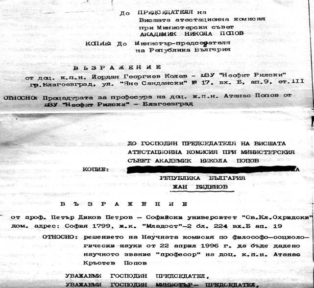

„В редакцията на в. Струма не работи лицето Мирослав Петров, предполагаме, че
някой от ЮЗУ – Благоевград си е позволил да праща писма от името на редакцията.“

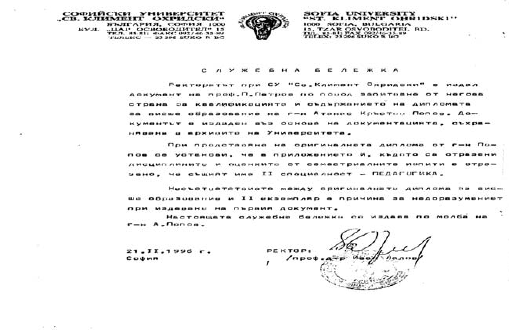

*Петър Петров беше подвел служител от Софийски университет да му издадат
служебна бележка, че нямам придобита втора специалност „Педагогика“. След това
ректорът проф. Иван Лалов трябваше да оспори тази поредна лъжа*

По-късно такива фалшификати срещу мен бяха изпращани и до други вестници. Главен
редактор на в.„Солидарност“, орган на българската работническа социалистическа
партия, беше самообявилият се за „професор“ бивш криминален престъпник, минал
през затвора като такъв, Лилян Ганчев, на когото изстрадалата от него съпруга се
хвърлила от 13-ия етаж на жилищния им блок. Той изпълни партийното поръчение да
препише пасквилите, публикувани от основните мои хулници.

Боже мой! Никога не съм допускал, че и в научната общност може да има толкова
много лъжци и клеветници, които да нараняват до непоносима болка, да
дезинформират и деформират мислите, чувствата и поведението на онези, които не
ги познават. През целия ми живот те се изпречваха пред пътя ми всеки ден, всеки
час. Понякога се чудя как издържах. Наистина, възрожденските ми корени се
оказаха много здрави.

След като Комисията по обществени науки от ВАК избра официално докладчикът за
даване на научното ми звание професор, Йордан Колев и Петър Петров изпаднаха в
психически стрес. Отново сглобиха всички писано от тях срещу мен и изпратиха
поотделно свои дълги (около 25-30 – страници) писма не само до председателя на
Президиума на ВАК проф. Никола Попов, но и до техния любим премиер Жан Виденов.
Тогава проф. Георги Ангушев, член на ВАК, поиска среща с мен, на която ме
попита:

&minus;Колега Попов, защо не заведеш съдебно дело срещу тези клеветници, които са
    вече затрили човешкия си образ? Ние от Комисията по обществени науки сме
    всички възмутени от техните неадекватни действия.

&minus;Та те водят няколко дела за нищо срещу мен, които губят едно по едно. Сега
    надеждата им е с помощта на премиера Жан Виденов да не бъда избран за
    професор – отговорих на проф. Ангушев.

Проф. Ангушев продлъжи:

&minus;Аз и моите колеги сме възторгнати от твоята научна продукция, която има ярко
    изразен новаторски характер. Това са проблеми, които досега не са били
    изследвани въобще в областта на педагогическата наука. Като декан на
    Факултета по предучилищна и училищна педагогика в Софийския университет не
    познавам мой колега, който да се е докосвал до тях. Срамувам се от Петър
    Петров, на когото четох доноса срещу вас, че е преподавател в нашия
    факултет. Та той, неизвестно и за мен, се чудя как стана професор с един
    набързо скалъпен учебник по дидактика, който е издадена във вашия
    университет. Сега обикаля няколко университета, в които се представя за
    голям учен.

След тази среща с проф. Ангушев разбрах, че Президиумът на ВАК е разглеждал
доносите на моите клеветници, свързани с тяхното неистово желание да бъде
провалена цялостно процедурата ми за даване на научното звание „Професор“. На
това заседание обаче някои от членовете обсъждали повече неадекватните действия
на Колев и Петров, отколкото моите научни приноси, свързани със званието
„Професор“, които според тях били съвсем очевидни и безспорни. Един от членовете
на Президиума на ВАК избухнал, наругал моите клеветници и казал, че такива като
тях нямат място в университета и не заслужават научните степени и звания, които
са получили.

## 33. Преизбирането ми за зам.-ректор, ръководител на катедра и председател на Научния съвет по педагогика и психология в Югозападния университет

В началото на учебната 1995-1996 година правителството на Жан Виденов издаде
Закон за отмяна на Закона за временно въвеждане на някои допълнителни изисквания
към членовете на ръководствата на научните организации и ВАК с названието
„Закона Панев“.

Въз основа на този закон трябваше да се проведат нови избори на ректори, декани
на факултети и ръководители на катедри. През м. октомври 1995 г. на заседание на
Катедрата по педагогика бях избран отново единодушно от колегите за ръководител
на катедрата. След това на основание решение на ФС при Факултета по педагогика с
протокол №1 от 25 октомври 1995 г. ми беше издадена заповед за ръководител на
най-голямата катедра в Югозападния университет. Моите хулници се скриха гузни и
недоволни.

На 30 октомври 1995 година се проведе Общо събрание на Югозападния университет,
на което проф. Кирил Чимев беше преизбран за ректор. Предстоеше заседание на
Академичния съвет за избирането на зам.-ректори. Една от познатите „червени
групички“, в която имаше две- три пияндета, започна активна дейност, за да не
бъда преизбран за зам.-ректор. Вечно пътуващият в чужбина Николай Божков,
създател на немалко академични пирамиди, любимец на Тодор Живков и Сава
Гановски, беше обещал на червените властващи в Благоевград, че с помощта на
негови верни хора ще осуети избора ми за зам.-ректор.

Меракът на сборната група от бивши партийни и комсомолски секретари угасна,
когато разбраха, че на 8.11.1995 г. бях отново избран за зам.-ректор на
Югозападния университет.

На 22 февруари 1995 година излезе публикация във в. „Струма“ със заглавие
„Деканът на ИПФ Божков обвинен в крупни далавери от служители“. В нея се
твърдеше, че „над 2 милиона лева от платеното обучение профукал на ротативка
професорът във ВПИ-Благоевград Николай Божков, дето закон не го лови“. И още, че
„Божков ще влезе в аналите на ВПИ със страстта си към комара, белите костюми,
четенето на неразбираеми доклади и титуловане на професори“.

Обвиненията в тази публикация бяха много и тежки, за които тогава се говореше в
целия град. Често и мен спираха граждани, за да изразят възмущението си от
неговото постоянно посещение в покер клубовете, където прахосвал много пари с
незнаен произход.

В местни и централни вестници постоянно се появяваха остро написани критични
материали за неадекватните за академичната общност действия на известния и в
някои от съседните държави (Македония, Турция и Гърция) професор Николай Божков,
които подронваха авторитета на Югозападния университет (вж. Тъмни балкански
професори продават студентски места, в-к 168 часа, 2-8 октомври 1995 г.,с.29-30;
ЮЗУ на път да забърка България в международен скандал, в-к „ Струма, 31 юли 1996
г., с.6 ; Полицията разследва зам.-ректора Божков, в. Струма, 25-01.1995 г.,

с. 1 и др.). В някои от тези публикации се обвиняваше новоназначеният като първи
зам.-ректор в крупни далавери и присвоявания от платеното обучение, както и при
създаването на неговата Балканска научно-изследователска асоциация.

След създаването на новата структура на Югозападния университет очаквах, че
всички от ректорското ръководство ще насочим усилията си за утвърждаването му
като най-авторитетно научно, просветно и културно огнище в Югозападна България.
Но още от първите месеци след като проф. Кирил Чимев учудващо посочи проф.
Николай Божков като първи зам.-ректор разбрах, че това няма да стане.

Не само аз, а всички мои колеги знаеха кой е Николай Божков, но никой от тях, с
изключение на проф. Илия Конев, не се осмели да каже поне малка част от истината
за него. Напротив, той беше издигнат в култ като недосегаем от никого. Затова
правеше каквото си поиска. Някогашният т.нар. партиен и държавен контрол го
проверяваше като декан на Инженерно-педагогически факултет. Прочу се и като
пропиляващ много пари. Носеха се легенди за него и бившия партиен секретар
Димитър Стоилов като комарджиите на града. Не исках да повярвам за тази им
неадекватна дейност, но един ден дойдоха двама полицаи в кабинета ми, които ми
казаха, че търсят Божков, но не могат да го открият никъде. Казаха ми, че имали
нареждане да го заведат в полицята за някакъв разпит. Точно тогава предстоеше
гласуването в парламента за даване статут на университета. Помолих ги да не
споделят това с други, защото тази вест бързо щеше достигне и до депутатие в
Народното събрание. Поисках среща с Божков, на която той се кълнеше, че няма
пари и не е вярно, че кисне по цели нощи в игралните заведения.

Неизвестно си остана и изчезването на комбайна и скъпия струг, които се водеха
като имущество на факултета, който оглавяваше Николай Божков. По сигнал на доц.
Койчев вече имаше проверка от прокуратурата за „крупни далавери и присвоявания“,
за постоянните му командировки в чужбина, за „крупни присвоявания от платеното
обучение и при създадената от него Балканска научна образователна асоциация“ и
т.н.

Много от документите, които ми се носеха в кабинета от очевидците на онези,
които рушеха авторитета на университета, запазих. Все още не всичко от тях
споделям в тази книга, защото са опасни дори и за четене.

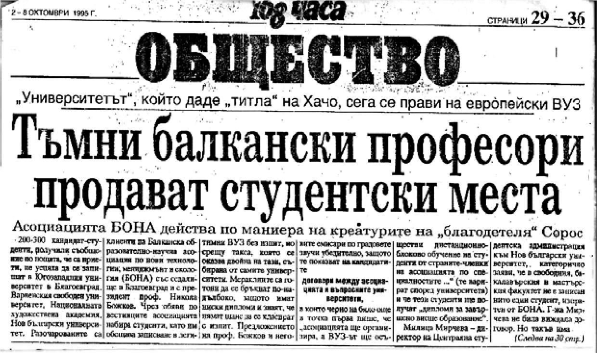

Моята изненада с назначаването на Божков за първи зам.-ректор не беше случайна.
Стана съвсем ясно, че Жан-Виденовото правителство не забравя своите някогашни
комсомолски кадри. Сега се отвориха още по-широко вратите за неговата чудновата
„академична дейност“. Нищо, че именно в това време се разпадаше създадения от
него Инженерно-педагогически факултет, който студентите напускаха или се
пренасочваха към други факултети.

И някои от централните вестници вече бяха публикували немалко материали за
академичните пирамиди на Николай Божков, с които стана известен в цялата страна
и в чужбина.

Първото нещо, което направи особено голямо впечатление на всички колеги от
университета, бе че новият зам.-ректор Николай Божков започна веднага своето
„околосветско пътуване“, при което продължи дейност си, свързана със създаването
на фалшиви академични структури. Този път обаче най-голямата му грижа беше
реализирането на не знам как, кога и къде подписан договор на Югозападния
университет и „Фитила“ за откриване на филиал в град Патра.

Силно притеснен от създаването на нови академични пирамиди в Югозападния
университет, поисках няколо пъти среща, както с проф. Кирил Чимев, така също и
със зам.-ректора по учебната работа доц. Илия Гюдженов. Направи ми неприятно
впечатление, че те отбягваха да се говори за тази дейност на Божков.

## 34. Направих хубаво предложение за изнесено обучение в Банско

След създаването на факултета по изкуствата, реших да се противопоставя на
неадекватните действия на Николай Божков за създаване на новите академични
пирамиди с предложението, което направих в Общинския съвет в град Банско за
изнесено обучение на студентите от художествените специалности в Югозападния
университет. Когато споделих това с проф. Кирил Чимев и доц. Илия Гюдженов, те
свиха вежди и ме попитаха дали знае за него Николай Божков. Бях учуден от това,
че Гюдженов беше вече предоставил някои от своите задължения по учебната работа
на Божков, който управляваше лично създадените от него академични пирамиди.

На 18 август 1995 г., след внесеното от мен предложение, Общинският съвет в град
Банско взе решение под № 33, според което дава съгласието си да бъде открито
изнесено обучение на ЮЗУ „Неофит Рилски“ в Благоевград. За нуждите на
университета се предостави недвижим имот – сграда и парцел по експертна оценка
за 9500000 лева за безвъзмездно ползване и управление до съществуването на
структурата на ЮЗУ „Неофит Рилски“. Освен това Общинският съвет се задължи да
осигури в рамките на сградите, които са собственост на общината (читалище,
музеи, училища и др.) възможности за ползване за нуждите на учебния процес. Пое
се и задължението да се съдейства за използването на материалната база на
останалите учебни заведения в града, които не са общинска собественост за
нуждите на учебния процес на студентите.

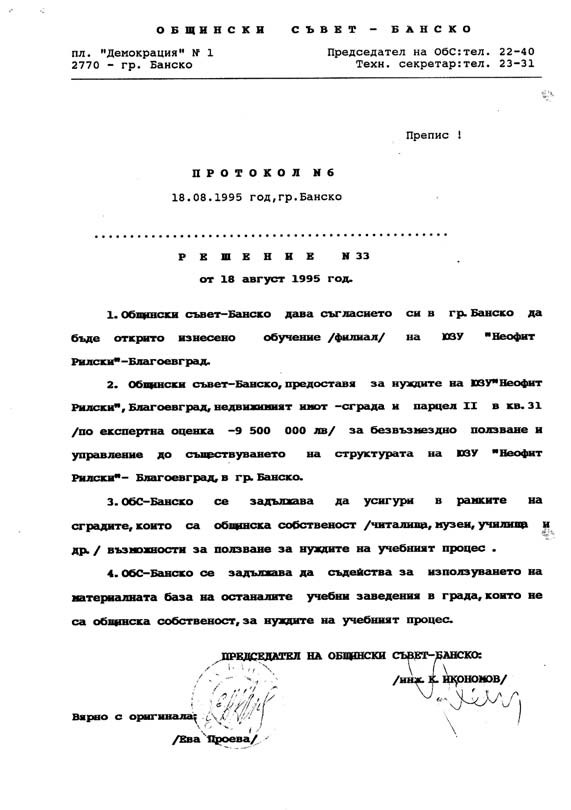

При предоставената богата материална база в Банско студентите от Факултета по
изкуствата имаха възможност да обогатят своята професионална поготовка в града,
който е огнище на просвета и художествена култура.

Това решение на Общинския съвет в Банско стресна създателя на пирамидите в
Югозападния университет Николай Божков. Той се свърза с номенклатурното
семейство Балеви и потайно действаха не за създаване на изнесено обучение на
студентите от Югозападния университет, а за създаване на колеж по туризъм. Това
беше през времето на правителството на Жан Виденов. Т.нар. Божков колеж по
туризъм беше новата пирамида, която след това се преместваше от град в град.

Докато по отношение на предложението за изнесено обучение на студентите от
художествените специалност в Банско проф. Чимев и зам.-ректора Гюдженов запазиха
гробно мълчание, след това, когато Божков създаде пирамидата в Патра, Гърция, те
се включиха активно за нейното утвърждаване, защото от нея имаше голяма
финансова изгода не за университета, а за онези, които я създадоха и подкрепяха.  

## 35. Новата академична пирамида в Патра

И така, на 18.10 1996 г. Николай Божков издава заповед, разбира се, не без
знанието и участието на проф. Чимев и доц. Гюдженов, за записване на студенти в
град Патра в първи курс по следните специалности: Право, Кинезитерапия и
физиотерапия, Икономика и Логотерапия.

Ето с какъв ръкописен протокол са обявени резултатите за „академичната“
1966-1997 година от обучението на тези студенти, които не знаеха български език.

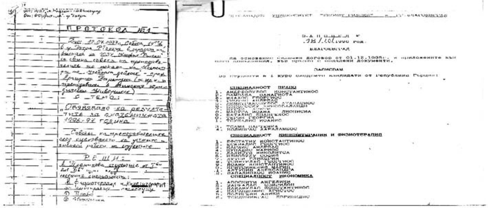

Когато министърът на образованието при правителството на Стефан Софиянски проф.
Иван Лалов научи за всичко, което се върши от Николай Божков, нарече нашият
университет „пирамида“, която се разрушава.

Един ден проф. Йордан Венедиков ми се обади по телефона и ми каза, че министърът
на образованието проф. Иван Лалов ни се е заканил лошо и иска среща с
ръководството. Бях останал пак сам. Нямаше го нито ректора, нито неговия първи
земестник, а зам.-ректорът по учебната работа и този път беше неоткриваем.

Заминах по спешност в София. Пред Министерството на образованието ме очакваше
проф. Йордан Венедиков, близък приятел на проф. Иван Лалов, който искаше да ни
помогне и този път, за да не станем пак за смях с неспирното създаване на
академични пирамиди.

Проф. Иван Лалов ни посрещна в кабинета си ядосан. Никога не го бях виждал
такъв.

&minus;Проф. Попов, защо си пак сам? Къде са твоите колеги от ректорския съвет?

Опитах се да го успокоя, но той стана прав, обърна се към нас двамата с проф.
Венедиков и каза:

&minus;Ако не знаех колко много направихте вие двамата за приемане стату-

та на Югозападния университет, сигурно нямаше да уважа молбата ви да си премълча
за безобразията на онези, на които мястото не им е там.

Изключително голяма отговорност за всички нарушения, свързани със създаването на
т.нар. „пирамиди“ на Югозападния университет, носеше и доц. Илия Гюдженов, който
беше несменяем зам.-ректор по учебната дейност. Но той се правеше на „нито лук
ял, нито лук мирисал“. Всеизвестна обществена тайна, както пишеше един вестник,
беше личното му приятелство със студента Христо Иванов, наричан Ицо Кмета, който
осъществяваше нерагламентираните връзки студент-преподавател в нашия унивреситет
(вж. в-к Струма, Спецкомисия „Анти-Струма“ сформира най-корумпираният ВУЗ в
България, 13. 02.1998 г., с.1- 4). Не исках да повярвам, че това е истина докато
не се уверих с очите, че „слуховете“ бяха верни.

Един ден заварих т.нар. Ицо Кмета в кабинета на Гюдженов, който разговаряше по
неговия телефон. Под мищницата си държеше дебела папка със студентски книжки. Не
знам как ги бях погледнал, но и двамата изчезнаха гузни. Вън ги беше засякъл
журналист от в. Струма, който отрази поредната им среща.

Не друг, а доц. Гюдженов носеше лична отговорност като завеждащ учебната част за
хаоса в учебния процес, от който постоянно се оплакваха не само студентите, но и
техните родители. Неговите основни грижи през тези години обаче продължаваха да
бъдат свързани с преместванията му от едно в друго жилище.

При създаването на академичната пирамида в Патра, Министерството на
образованието, науката и технологиите чрез посланика на България направи
запитване до Министерството на националното образование и вероизповеденията в
Гърция, което даде отговор, че „този тип школи не подлежат към никоя от държавно
признатите степени на обучение в Гърция, издаваните от тях документи не подлежат
на приравняване и признаване от компетентните органи. В Гърция строго се спазва
изричното изискване при издаване и признаване на дипломи за завършено
университетско образование целията курс на обучение да бъде преминат в учебно
заведение със статут на университет. Ако обучението или част от него е преминато
в школа за свободно обучение е категорично в позицията си да „не признава
документа за образование, независимо, че той може да е издаден в крайна сметка
от утвърдено и признато учебно заведение“.

В този отговор на гръцкото Министерството на образованието и вероизповеданията
до Министерството на образованието, науката и технологиите в България се
подчертава съвсем ясно, че „получените по този начин документи за завършено
образование не се признават за имащи университетско образование. Техните
носители не могат да бъдат назначавани на длъжности в държавни учреждения, за
които се изисква висше образование.“

В това писмо отговор се казва категорично, че при съществуващото законодателство
и практика в Гърция „няма да бъдат признати издаваните от Югозападния
университет академични документи за образование“.

Този документ се укриваше от Николай Божков със знанието на ректора проф. Чимев
и зам.-ректора доц. Илия Гюдженов. Тримата имаха и други „дълбоки тайни“,
свързани с взаимоотношенията им с ръководителя на организацията „Фитила“, който
често ги канеше на богати трапези както в България, така и в Гърция.

*Създателите на академичната пирамида в Патра Николай Божков и Георгиус Фитилас
бяха винаги на маса, на която пресмятаха доходите си от пирамидата, която
създадоха*

Когато Фитилас разбра, че съм категорично против пирамидата, която създадоха с
Божков, поиска да се срещнем. По време на разговора ни той ми призна, че е бил
подведен от Николай Божков, който го излъгал, че всичко свързано със създаването
на изнесеното обучение в Патра е било съгласувано с Министерството на
образованието, науката и технологиите в България. След тази среща Фитилас
започна да се отдалечава от Божков, който обаче продължаваше да пребивава в
Патра и да води там разгулен живот.

Безспорно е, че през тези години зам.ректорът по учебната част доц. Илия
Гюдженов беше „тайнственият“ съучастник в чудноватите „академични“ прояви на
Николай Божков. Та нали това беше неговият ресор в дейността на Югозападния
университет. Той и Божков не дадоха отговор и на писмото под № 04-03-573 от
13.01.1997 г. на Министерството на образованието, науката и технологиите, в
което се твърди, че според становището на компетентните власти в Гърция
договорът, подписан между Образователната организация „Фитила“ и Югозападния
университет, е невалиден за гръцката страна. Освен това в същото писмо за
пореден път се подчертава, че „функциониращата в Търговище Академия за славянско
изкуство, която по неофициална, но достоверна информация е създадена от БОНА, и
Киевският държавен университет е създадена в нарушение на допълнителните
разпоредби на Закона за висшето образование“.

Не ми е позната поне една дейност на някогашния учител по ръчен труд Николай
Божков, която да не е била в нарушение на българския Закон за висшето
образование. Десетки са „професорите“, произведени от него в цялата страна, едни
от него като президент на асоциацията БОНА, а другите, получили благословията му
като „дежурен“ рецензент по всички научни дисциплини, защото беше „специалист по
всичко“, а не само по ръчен труд, т.е „всестранно развита личност“ като
някогашен комсомолски секретар.

Никога в моя труден живот не съм се страхувал да казвам истината за онези, които
живеят и работят непочтено, защото те са истинските виновници за човешките
страдания, каквито и аз съм преживявал, причинени от тях. Така съм възпитан в
моето известно със своите възрожденски традиции семейство.

Когато след приемане статута на Югозападния университет „Неофит Рилски“ трябваше
да се утвърждава неговият авторитет като истински духовен храм, някои започнаха
да подкопават онова, което други трудно изграждаха. Като член на Академичния
съвет и зам.-ректор не се страхувах да назовавам имената на тези „дребни душици“
с немалък риск да започне нова злостна атака срещу мен от тях. На едно от
заседанията на Академичния съвет през 1996 година станах и споменах поименно
виновниците за хаоса, който създаваха в цялостната дейност на университета (вж.
в. Струма, Проф.Попов обяви война на мафията в ЮЗУ, 1996 г., с. 1-4). Не ми беше
лесно да кажа пред очите на виновниците, че в университета трябва да работят
само личности с нравствени добродетели и академичен облик.

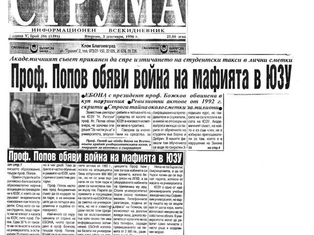

На това заседание на Академичния съвет назовах конкретно далаверите, които се
извършваха в създадените академични пирамиди. Поисках да си декларират доходите
онези, които бяха съучастници в тяхната дейност.

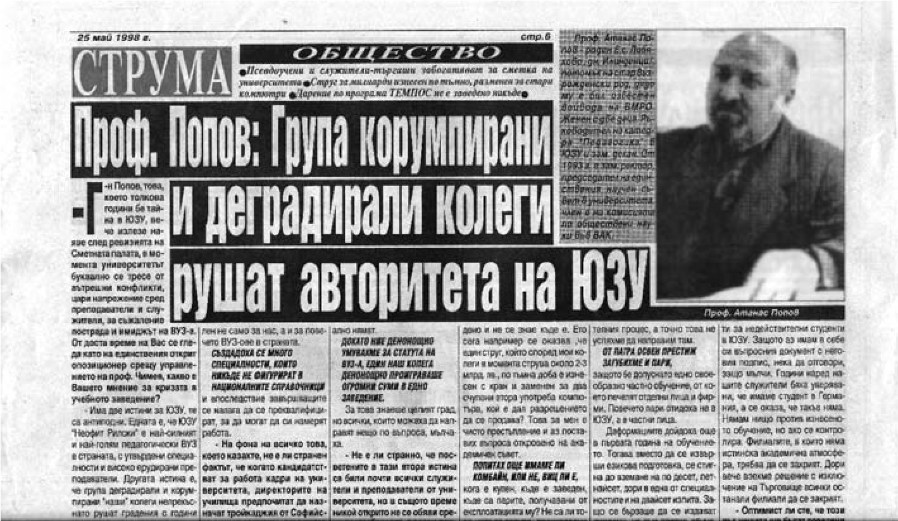

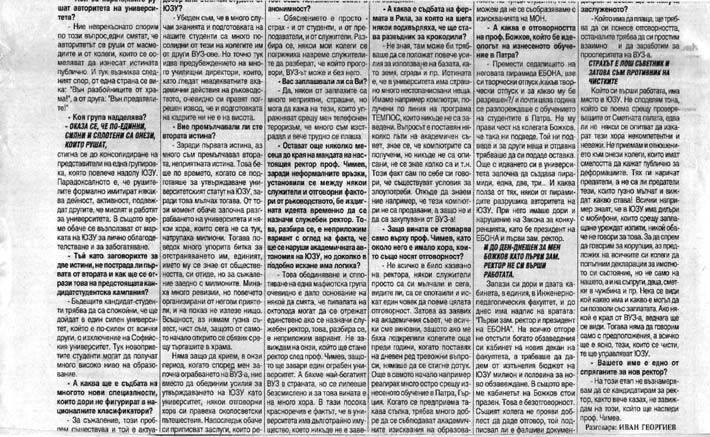

*Преживявах болезнено всичко онова, което рушеше авторитета на Югозападния
университет, защото положих големи, неизмерими усилия за утвърждаване на неговия
статут и съвременната му структура*  

## 36. Моите хулници продължаваха да воюват срещу мен и със съдебни дела

И така, въпреки усилията на онези, които се радваха на правителството на Жан
Виденов и очакваха тоталното ми изолиране от доскорошните ръководни длъжности,
които заемах в университета, през 1995 година останах да бъда не само
зам.-ректор, председател на Научния съвет по педагогика, но бях и отново
преизбран за ръководител на Катедрата по педагогика. Неподкупните мои колеги от
университета оценяваха приноса ми за неговото развитие и ми дадоха своето
доверие да продължа дейността си като един от новоизбраните негови ръководители.

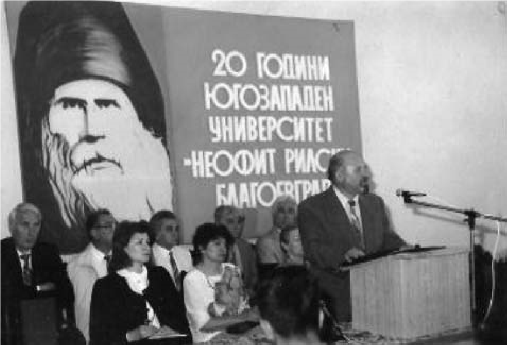

>   *Научната конференция във Факултета по педагогика по случай 20-та годишнина
>   на Югозападния университет „Неофит Рилски“*

В Катедрата по педагогика се възстанови изцяло спокойната атмосфера, която даде
възможност на колегите да ускорят своето научно израстване и развитие. В нея
обаче все още се мяркаше от време на време Йордан Колев, за да им напомня, че е
дошло неговото време, т.е. че „червените“ са отново на власт. Колегите от
катедрата и факултета не приемаха нестихващите негови действия срещу мен. Някои
от тях се спираха пред вратата, на която беше закачен седмичния му разпис за
зимния семестър през учебната 1996- 1997 г. В него беше записал:

„Понеделник – ден за катедрени съвети и за съдебни дела против Атанас Кръстев
Попов“.

Един колега от друг университет беше прочел закачения разпис. Дойде при мен и ме
попита :

&minus;Този Колев полудял ли е?

&minus;Защо? – попитах го аз.

Той ме погледна в очите и отговори:

&minus;Защото нормален човек, особено университетски преподавател, не би написал
    това, което чета.

Воденето на непрекъснати съдебни дела срещу мен с искове за много пари също беше
неадекватно действие от бившия секретар по идеологическите въпроси на ВК на БКП
Йордан Колев и т.нар. от студентите „професор таксиметров шофьор“ Петър Петров,
зет на активен борец против капитализма, за да ме психически затормозяват.

На едно от заседанията в съда се явиха и партийният секретар на Педагогическия
факултет, известен с прозвището „Киро Певеца“ и съпругата на Петър Петров. И тук
моите хулници ставаха за смях, защото искаха да превърнат съдебните заседания в
партийни, на които да бъда наказан като доскорошен враг на „народната власт“. За
тяхно дълбоко огорчение загубиха всички започнати съдебни дела срещу мен, от
които искаха да натрупат немалко пари.

Адвокатката на Йордан Колев беше социалистка. Един ден ме спря пред съда и ми
каза:

&minus;Професоре, сгреших, че се съгласих да бъда адвокат на Колев. Прощавай! Днес
    се отказах да го защитавам, защото обвиненията срещу вас са неоснователни.

Съдийката на едно от заседанията, което ръководеше, разгневена каза:

&minus;Вие митинг ли ще правите в съда?

След това се обърна към мен и ме попита:

&minus;Господин Попов, защо вие не заведете дело срещу двамата? От всичко, което
    прочетох е видно, че те имат за цел да ви съкрушат. Клеветниците са те, а не
    вие.

Йордан Колев скочи и изкрещя:

&minus;Снемам доверието си от вас. Ще искам друг съдия.

След това се оказа, че никой друг съдия не беше пожелал да поеме делото, което
водеха срещу мен двамата мои хулници.

Както в Катедрата по предучилищна педагогика, където беше върнат със заповед №
71 /09.03.1993 г. на Ректора на университета, така и в Катедрата по педагогика
Йордан Колев продължаваше да не участва редовно на заседанията. Опита се отново
да възстанови тягостна атмосфера, но не успя. Учудващо подаде молба до ректора
да бъде върнат отново в Катедрата по предучилищна педагогика, в която пише:

>   *„Уважаеми господин Ректор,*

>   *За да не смущавам творческия дух и добрия климат в катедрата по педагогика,
>   МОЛЯ ВИ да бъда преместен в катедрата по предучилищна педагогика към
>   факултета по психология и предучилищна педагогика.*

>   *Надявам се молбата ми да бъде удовлетворена.*

>   *2.10. 1996 г.*

>   *Благоевград*

> *С уважение : / подпис /*

Някои от колегите недоумяваха от написаното в молбата на Колев, но след това
разбраха, че той отново хитрува с цел да минат по-лесно по-нататъшните му
процедури за получаване на нови „научни“ степени и звания в Катедрата по
предучилищна педагогика, която нямаше това право, защото само Катедрата по
педагогика обслужваше дисциплината „История на педагогиката“.

Не помня за нито една от получените „научни“ степени, както и званията на Йордан
Колев да е била откривана процедури и да са правени обсъждания в Катедрата по
педагогика. Това е продължение на предишните закононарушения, извършвани в
Катедрата по предучилищна педагогика, свързани с откриване на процедура за
даване на научното му звание „Доцент“.

Един ден доц. Георги Стоянов, бивш декан на Педагогическия факултет, който
напусна катедрата след внедряването на Йордан Колев в нея, дойде при мен и ми
каза, че е написал всичко черно на бяло, свързано с „научната“ кариера на моя
хулник. Разтвори чантата и ми подаде това, което е саморъчно написано.

>   *„...* Фактите обаче не говорят в полза на г-н Колев.

1.  Йордан Колев е зачислен за аспирант на самостоятелна подготовка, въпреки
    отрицателна рецензия върху предложения материал за зачисляване (В архивите
    на катедрата и ФП да се види и направи справка с рецензията).

2.  Хабилитационният труд на Й. Колев също беше приет от катедрата в отсъствието
    и на двамата рецензенти (проф. Елка Петрова и ст.н.с. Димитър Дончев). Виж
    протокола от обсъждането. Това е сериозно закононарушение!

3.  Конкурсът за доцент на Йордан Колев беше обявен от друг факултет, а не от
    Факултета по начална педагогика, който водеше обучението по история на
    педагогиката и българското образование в педагогическия институт в
    Благоевград.

4.  Решението на Катедрата по теория и история на педагогиката при СУ „Св.
    Климент Охридски“, която обсъждаше тогава дисертационния труд на Й.Колев,
    беше, че трудът не е готов още за защита и аспирантът трябва да работи върху
    него за усъвършенстването му.За голяма изненада защитата беше обявена.
    Когато единият от рецензентите (проф. В. Бойчева) оповести, че рецензията ѝ
    е отрицателна, тя беше автоматично сменена с друг.

...Що се отнася до закона ЗНСНЗ и правилника, свързан с него, н я м а научна
степен и научно звание, присъдени на колегата Колев досега, при които да не е
извършвано сериозно закононарушение.

Ако се направи една строга и точна законова проверка от съответните научни и
юридически органи, тези звания и степени трябва да бъдат обявени за н е л е г и
т и м н и! А такава проверка е съвсем наложителна и възможна, тъй като всички
документи, свързани с посочените нарушения, се пазят в архивите на ВПИ (сега
ЮЗУ) в Благоевград, СУ „ Свети Клмент Охридски „ – Факултет по педагогика, и
решенията на СНС по педагогика.

В течение съм на горепосочените закононарушения, тъй като бях преподавател и
декан на ФП към ВПИ през горепосочения период в Благоевград.“

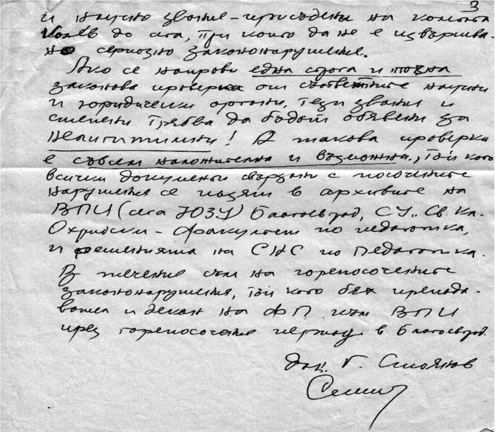

Наистина, всички научни степени и звания на някогашния асистент по предучилищна
педагогика Йордан Колев, а сега проф., доктор на педагогическите науки по
история на педагогиката и българското образование, са обсъждани и получавани
там, където не им е мястото. Тяхното родилно гнездо не беше Катедрата по
педагогика, която е „майка“ на научните дисциплини, по които преподава Йордан
Колев, а Катедрата по предучилищна педагогика, където е преподавател и жена му.
Там всичко ставаше по-лесно за получаването им. Това твърдя като дъбгогодишен
ръководител на Катедрата по педагогика в Педагогическия факултет на Югозападния
университет, където не е обсъждана нито една от научните степени, както и
званията на Йордан Колев. Никак не бяха случайни неговите чести премятания в
Катедрата по предучилищна педагогика, когато трябваше да се получават тези
звания и степени.

При едно от учудващото за някои доброволно напускане на Катедрата по педагогика
от Йордан Колев някои колеги се успокоиха, но не разбраха обаче, че това беше
неговият пореден хитър ход за по-спокойно получаване на последното му научно
звание пак в Катедрата „родилка“ на другите му научни степени и звания, която
беше в друг факултет.

След напускането на Йордан Колев от Катедрата по педагогика се създаде истинска
творческа атмосфера, която спомогна за ускореното научно израстване на
преподавателите. Само за по-малко от 2 години бяха избрани 2 професори, 5
доценти и 1 доктор на науките. Зачислихме на свободна аспирантура 4 асистенти, а
трима от тях бяха повишени. На хонорар и по съвместителство в катедрата бяха
привлечени някои от първите създатели на университета като проф.д-р Марин
Андреев, доц. Жулиета Савова, проф. Стефан Чернев, проф. Доньо Василев и др.
Нямаше друга катедра от бившите педагогически институти в страната с толкова
много хабилитирани преподаватели, което даде сериозно отражение на качеството
при подготовката на студентите. Това се признаваше и от другите университети, в
които имаше такива факултети. Оказвал съм конкретна помощ на всеки преподавател
при неговото научно израстване. Спомням си случаи, които никога няма да забравя.
Повечето от тях бяха свързани с преодоляване на нелеки трудности за получаване
на научни звания и степени.  

## 37. През 1997 г. напрежението в Югозападния университет продължаваше да расте

Безотговорното отношение на някои от моите колеги от ректорското ръководство към
истинските проблеми на университета продължаваше. Те бяха почти изоставили
преките си задължения и се захващаха с дейности, свързани с лични облаги. Т.нар.
от някои „околосветски пътешествия“ продължаваха. Инициаторът за тях пак беше
Николай Божков. Жалко, много жалко, че проф. Кирил Чимев се хвана на неговата
въдица. А потайният, своеобразен техен съдружник зам.-ректорът по учебната част
доц. Илия Гюдженов се правеше на нито „лук ял,нито лук мирисал“, когато в цялата
страна се носеше „славата“ им като създатели на академични пирамиди в страната и
чужбина. Получаваха се писма от Министерството на образованието, науката и
технологиите, на които отговор не се даваше.

С това писмо от Министерството на образованието се предупреждава ректорът на
университета проф. Кирил Чимев за неправилното откриване на филиала на
Югозападния университет в Патра, Гърция, където Николай Божков се „изсели“ за
една година. Водеше се в творчески отпуск, получаваше заплата от университета,
но парите от пирамидата бяха още по-тлъсти. В същото време продължаваше да
функционира другата пирамида на Божков в Търговище, която носеше гръмкото
название „Академия за славянско изкуство“, която беше създадена пак от другата
пирамида БОНА и Киевския държавен университет. В приложеното писмо от
Министерството на образованието се подчертава, че „учебното заведение е
създадено в нарушение на допълнителните разпоредби на Закона за висшето
образование“.

В средата на месец март 1997 г. Югозападният университет се тресеше вече от
тежки скандали. Повечето преподаватели и студенти поискаха оставка на
ректорското ръководство. Беше създаден стачен комитет, който обяви ефективни
действия от 13 .03. 1997 година. Моите колеги от ректорското ръководство, с
изключение на доц. Ангелина Манова, започнаха да не се вестяват на работа. Една
сутрин ректорът проф. Кирил Чимев дойде в кабинета ми уплашен. Започна да ме
убеждава, че трябва да поема ръководството на университета поради това, че срещу
мене нямаше никакви обвинения. Така щели да утихнат протестите, след което идва
лятото. А от новата учебна година щели да „мирясат“ протестиращите. Не се
съгласих. След около две седмици той отново ме помоли и ми каза, че имал
намерение да си подаде оставката. Това означаваше да се насрочи Общо събрание,
на което да се избере ново ректорско ръководство. Това мое предложение той не
приемаше, поиска само да го замествам поне за един месец. Предложих му да
назначи колегата Илия Гюдженов да го замества. Той ме погледна и каза:

– Ти добре го познаваш, нали? Той нищо не може да направи. Нали вечно се
оплаква, че е болен.

Спомних си, че когато доц. Гюдженов беше съвсем занемарил задълженията си като
завеждащ учебната дейност в университета, проф. Чимев имаше намерение да му
предложи да се оттегли от тази длъжност. Но тогава той пак се оплака, че не е
добре със здравето.

Като имах предвид вече създадената непоносима обстановка в университета, се
съгласих да замествам ректора за един месец. Имах предвид това, че ще се
постарая да спомогна за преодоляването на създалия се непоносим конфликт с
преподавателите, служителите и студентите.

На 5 май получих заповед № 3-98, издадена предварително от ректора още на
24.04.1997 г., според която трябваше да го замествам до 30 май 1997 г. На
следващия ден насрочих среща със създадения инициативен комитет от
преподаватели, служители и студенти. Разговорът ни протече спокойно. Обсъдихме
конкретно техните искания, които бяха съвсем основателни. Настояваше се за
цялостна проверка на всички известни вече закононарушения в университета, които
подронваха неговия авторитет. Подходих съвсем отговорно и се съгласих държавните
органи да се включат за разкриване на истината. Наложи се да проверя и вече
изпратените оплаквания до Министерството на образованието и науката,
Министерството на финансите, Окръжния прокурор и директора на РДВР в
Благоевград.

На няколко пъти създаденият инициативен комитет от протестиращите преподаватели,
служители и студенти идваше при мен. Бях удовлетворен от това, че напрежението в
университета изчезна, защото тяхното искане за необходимата проверка започна. За
моя изненада обаче на 14 май проф. Кирил Чимев прекрати заповедта за
заместването. Стана съвсем ясно, че онези, към които бяха отправени обвиненията,
се уплашиха от моя съвсем принципен подход за удовлетворяване исканията на
протестиращите. Този техен ход се оказа хитър, защото през двете седмици, когато
замествах ректора, в университета се възстанови нормалната учебно-научна
дейност, а след това предстоеше приключването на учебната година и стачните
действия бяха отложени.

## 38. Въпреки големите трудности никога не се отклонявах от моята пътека

На 2 октомври 1997 година със заповед № КВ – 907 на министър – председателя на
Република България, на основание чл. 33 от Закона за научните степени и научните
звания, бях назначен за член на Научната комисия по обществени науки на Висшата
атестационна комисия.

За първи път в този висш орган бяха включени изтъкнати български учени, които
бяха потомци на родове, преследвани от комунистическата власт, като проф. Йордан
Венедиков, проф. Сийка Пенчева, проф. Енчо Герганов, доц. Тодор Чипев и други.

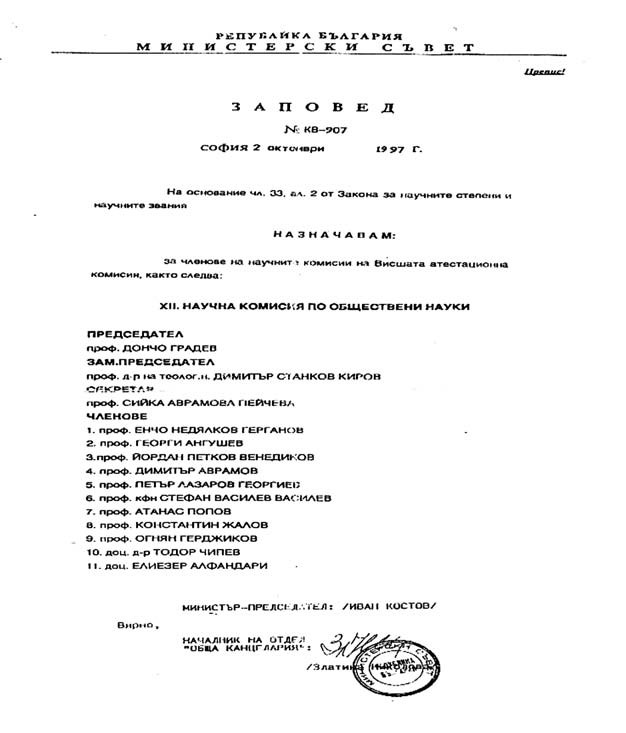

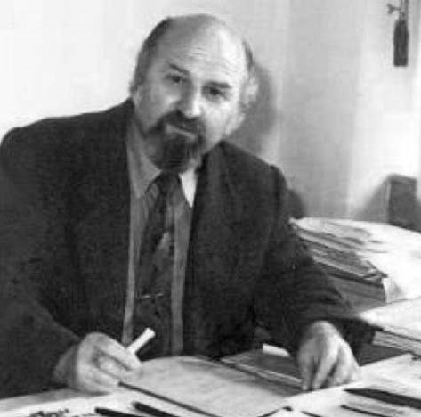

>   *Кабинетът ми като зам.-ректор беше достъпен за всеки, който искаше моята
>   помощ*

Понякога времето през деня не ми достигаше, за да изпълня всички задачи, които
имах като ръководител на катедрата, зам.-ректор, председател на Научния съвет по
педагогика и член на Комисията по обществени науки във ВАК. Именно затова често
превръщах вечерните часове в работни. Бях доволен обаче, защото не допусках
изоставане на пряката ми работа, свързана с големите академични отговорности. Не
ми оставаше време да мисля за продължаващите от време на време доноси и клевети
на моите дежурни хулници.

Всичко, което успях да направя с много усилия в продължение на немалко години в
Югозападния университет, се знаеше не само от моите добросъвестни колеги, но и
от цялата общественост в Благоевград. Именно затова в навечерието на
предстоящите избори за народни представители в Народното събрание през 1997
година беше издигната кандидатурата ми за депутат от Националния клуб за
демокрация, други политически организации, присъдружни на СДС, както и няколко
клубове на СДС (вж. Проф. Попов на предварителен вот в І мажоритарен район, в.
Струма, 14 март 1997 г. с.1 -2).

Както навсякъде, така и в политическите партии децата и внуците на партийни
секретари и активни борци против капитализма бяха научили уроците на своите
червени родственици как се спечелват избори. Така например решението на
Националния изпълнителен съвет на СДС за включването ми във вътрешния вот на
изборите беше умишлено прикривано и бе обявено едва един ден преди провеждането
на изборите.

В деня на изборите бяха констатирани от моите застъпници редица предумишлени
действия, най-важните от които бяха :

&minus;невключване в комисиите на секциите на представители на политическите
    организации, които издигнаха моята кандидатура;

&minus;в секциите се подаваше парола към избирателите за кого да гласуват;

&minus;пред входа на повечето секции, специално подготвени роднини на другите
    кандидати, най-вече на Илиян Попов, внук на активен борец против
    капитализма, агитираха идващите да не гласуват за мен, повечето от които
    бяха членове на бившата комунистическа партия;

&minus;при проверката на бюлетините с оказа, че в някои от тях имената са вписвани
    с един и същи почерк;

&minus;в една от комисиите са допълнително вписвани фиктивни гласоподаватели и т.н.

Извършените нарушения и манипулации по време на изборите не ме притесняваха
толкова, колкото това, което ставаше в университета. Той беше постоянно в моите
мисли, затова не отделях необходимото време за спечелването на избора ми за
народен представител, колкото за преодоляване на хаоса в университета. Въпреки
това за мен гласуваха 35 % от гражданите в Благоевград, предимно интелектуалци.
И по време на изборите борбата срещу мен се водеше пак от комунистите и техните
деца и внуци.

Когато през 1997 година някои от моите „колеги“ от ректорското ръководство се
бяха отдали отново на пътешествия по създадените пирамиди, ние с зам.-ректорката
доц. Ангелина Манова, зав. научно-изследователската дейност, продължавахме да
бъдем далеко от никнещите като гъби академични пирамиди.

В тези трудни години, за да не се разклаща академизмът в университета, често
имах срещи с някои от деканите в най-авторитетните факултети. Радвах се, когато
идваха в кабинета ми и споделяха моите идеи за укрепването на Югозападния
университет. Тези мои колеги бяха антиподи на създателите на академичните
пирамиди. Никога няма да забравя, че някои от тях постоянно ме информираха за
хубавите промени, които извършвахме заедно. Не забравяха да ме информират и за
привлечените нови авторитетни преподаватели, които в същност запазиха
Югозападния университет. Незабравими ще останат срещите ми за съдбата на
факултетите в университета с проф. Христо Арищиров, проф. Иван Стефанов, проф.
Йордан Шопов, доц. Антони Стоилов (сега професор), проф. Енчо Мутафов, доц.
Магдалена Глушкови (сега професор), доц. Александър Воденичаров (сега професор),
доц. Славчо Щраков и други.

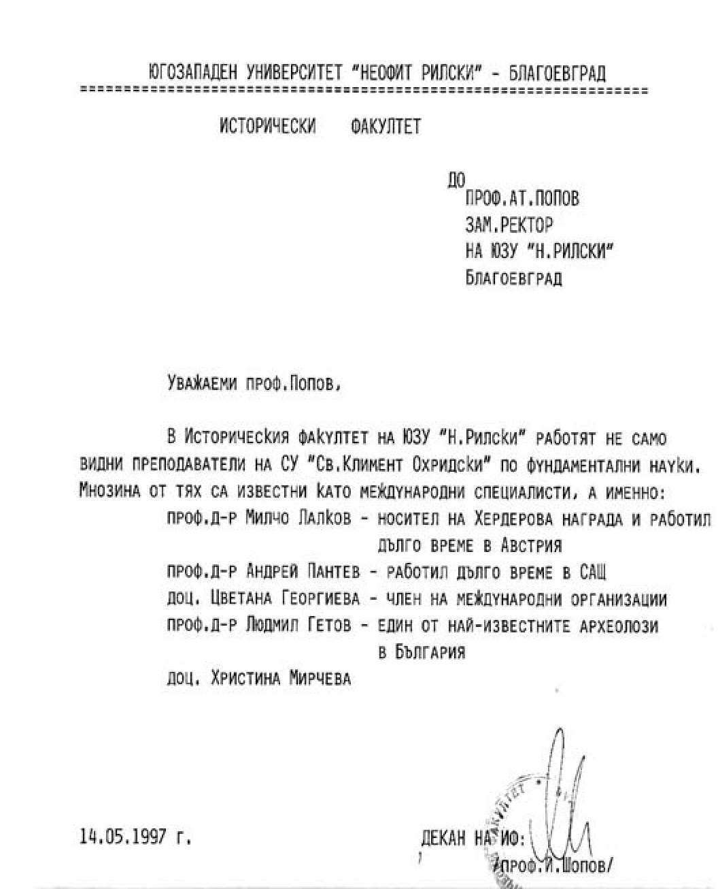

>   *Такива справки за изтъкнати преподаватели получавах и от другите факултети
>   в университета*

Без да ги задължавам, посочените декани постоянно ме информираха за
новоизбраните преподаватели в техните факултети. Всъщност като зам.-ректор често
изпълнявах и функциите на онези мои колеги, които се бяха отдали изцяло на
„ползотворната“ за тях дейност в академичните пирамиди. През това време като
член на Комисията по обществени науки във ВАК спомогнах немалко за научното
израстване на някои преподаватели в университета. Имаше няколко неприятни
случаи, свързани опити да се попречи при научното израстване на някои колеги,
които успях да преодолея. Е, някои забравиха за това, но какво да се прави?
Важното е, че се постарах да помогна за увеличаване на хабилитираните
преподаватели в университета и получаването на заслужени научни степени и
звания.

Представящите се за „строители“ на Югозападния университет се срещаха със своите
посредници, за да скалъпят висше образование на някои, или пък да накичат други
с фалшиви професорски звания. Тогава те живееха ден за ден и разрушаваха това,
което другите изграждаха. Когато кабинетите им бяха затворени, гостите на
университета идваха винаги при мен, защото моят кабинет беше винаги отворен.

Спомням си, че колегата Пламен Граматиков от Природо-математическия факултет,
когото съм запомнил като енергичен и всеотдаен в своята преподавателска дейност
и връзките му с известни учени от чужбина, ме помоли да приема в кабинета си
колеги от Битолския университет. Разговорът ни беше свързан провеждането на
съвместна международна конференция в град Банско. Там събрахаме учени от цяла
Европа. На нея присъстваха и някои от министрите на образованието в тези страни.

Един ден приятелят ми проф. Милчо Лалков поиска с мен „разговор насаме“. Първо
ме попита защо не нося фамилното име Зимбилев.

&minus;Ти си правнук на създателя на първите новобългарски училища в Източна
    Македония Георги Иванов Зимбилев, който открива цяла просветна школа, през
    която са минали много дейци на възраждането от Неврокопско, Серско и
    Мелнишко.

След това Милчо ме хвана за рамото и продължи:

&minus;Зная всичко за твоя възрожденски род. И за трите жертви от него – прадядото
    Стоян, дядо ти Атанас и вуйчо ти Борис. Затова комунистите ги е страх от
    теб.

Когато се опитах да дам отговор на Милчо защо нашата фамилия от Зимбилева е
преименувана на Попова, той ме прекъсна и каза:

&minus;И това знам. След жестокото убийство на прадядо ти свещ. Стоян Зимбилев по
    време на молитва, в негова памет приемате новото фамилно име Попови.

След това разговорът ни с Милчо продължи за хубавите му идеи, свързани с
подговената от него международна конференция в историческия факултет.

Кой ли и за какво ли не е идвал при мен за наистина ползотворни разговори
тогава, когато университетът продължаваше да се тресе от безобразията на онези,
които го бяха почти забравили. Проф. Иван Стефанов, декан на Философския
факултет, и проф. Ради Радев леко чукаха на вратата и тихо влизаха в кабинета
ми. По това познавах, че са те. По-припрян беше проф. Христо Арищиров, декан на
Факултета по изкуствата, който беше пламнал от енергията, с която заедно с
неговия заместник Златко Павлов сплотяваха онези, които доскоро бяха разделени в
отделни факултети.

Стигна се до там, че през тези години кой каквато трудност срещаше, идваше при
мен, за да я споделя. Някои от другите мои колеги от Ректората нямаха време за
това. Те имаха своите постоянни грижи за решаване на личните си проблеми.Имаше и
немалко неприятни случаи, свързани с изглаждане на междуличностни отношения в
някои от факултетите.

За мен тези напрегнати години, когато истинските строители на Югозападния
университет не познаваха умората си, останаха незабравими. Забравиха ги само
онези, които имат къса памет и бяха се отдали на друга, а не на истинска
академична дейност.

## 39. Започналата цялостна проверка на Сметната палата в Югозападния университет приключи на 17.03. 1998 г.

Въпреки опитите за прикриване на неприятните резултати от проверката на Смената
палата, те станаха известни. Констатираните тежки нарушения обаче бяха само за
една година, другите останаха в дълбока тайна. Това събра отново протестиращите
студенти, преподаватели и служители.

Недоволни от това, че и аз исках да се разкрие цялата истина за всички нарушения
в университета, които бяха извършени през последните няколко години и се знаеше
за тях в цялата страна, една „червена“ група от Академичния съвет беше
подготвила старателно свалянето ми като зам.-ректор. Те ме смятаха за конкурент
на проф. Чимев при евентуални избори за ново ректорско ръководство. Превратаджии
бяха замислили закриването на Института за повишаване на квалификацията, за
който отговарях като зам.-ректор. Искаха неговите функции да се прехвърлят към
факултетите, което щеше да внесе истински хаос при подготовката на тези кадри. А
на моите „врагове“ такъв хаос им беше много необходим.

Когато беше направено предложението за гласуване да се закрие Института за
повишаване на квалификацията, аз напуснах заседанието на Академичния съвет, за
да не попреча на инициаторите за свалянето ми. После се оказа, че с изключение
на тях всички останали членове на Академичния съвет отхвърлили направеното от
тях предложение, което посрещнали ужасени.

През м. април същата година Министърът на образованието и науката Веселин
Методиев изпрати комисия, която да проучва състоянието на университета въз
основа на констатациите, направени от Сметната палата. Ректорът и заместникът му
Илия Гюдженов бяха пак на „пътешествие“, за което не знаехме. Изненадващо се
появи Николай Божков, който беше посрещнат с възгласа „Вън разбойниците от
храма“.

През тези тежки години за Югозападния университет никога не напусках двете си
работни места – студентската аудитория, където изнасях редовно лекциите си, и
кабинета ми като зам.-ректор, където изпълнявах задълженията си като такъв.
Винаги бюрото ми беше отрупано с документи и писма, които очакваха отговор от
мен.

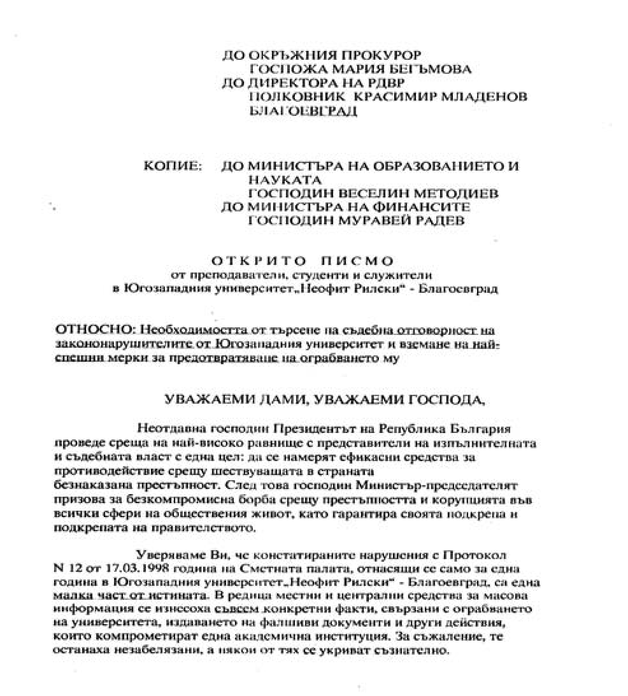

Тогава направих необходимото и за включването на Техническия колеж в структурата
на Югозападния университет. На няколко пъти имах срещи с ръководството на
колежа, с което обсъждахме всички проблеми от академичен, финансов и структурен
аспект. След това ръководството на колежа стана член на академичния съвет с
право да участва в общото събрание на университета (вж. Техническият колеж влиза
в състава на ЮЗУ, в. Струма, 7 април 1997 г.).

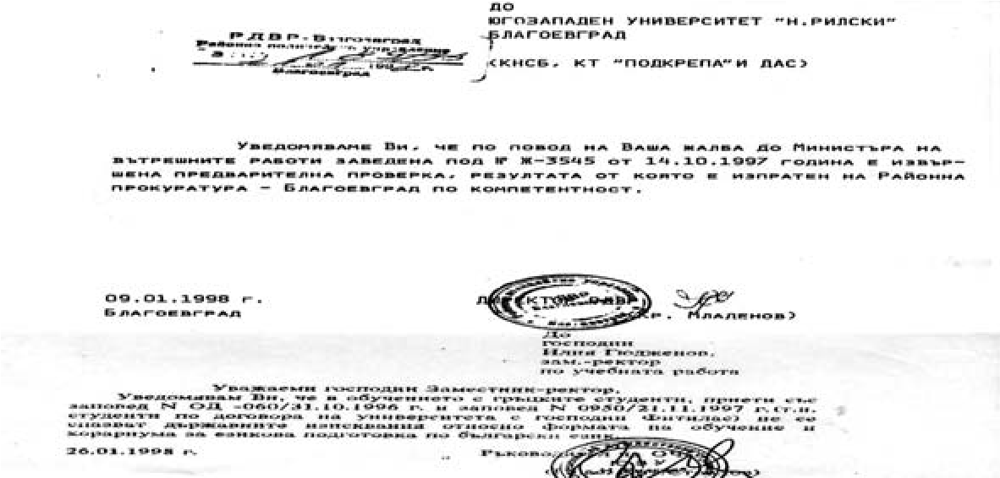

## 40. Неуморните хулници

Неприятностите, които се редуваха едни след други в работата на университета,
свиваха сърцето ми от болка, която ме измъчваше, защото знаех много повече неща
за хаоса, който създаваха онези, които се криеха, когато трябваше да се води
упорита борба за утвърждаване статута на университета, а когато воюваха срещу
мен като оцелял „враг на народната власт“ се събираха на тумби и бяха много
активни. Те спазваха стриктно специално разработваните указания от ВС на БСП, в
които бяха конкретизирани всички опорни точки за нестихваща борба срещу
„опасните“, които трябва да бъдат уморени от доноси и клевети.

>   *Указания на ВС на БСП към членовете и симпатизантите си за по-нататъшната
>   работа на общинските и местни партийни организации на БСП и клубовете*

Наедрялата червена група в университета все отбрани верни на „партията майка“
разпространяваше казаното от А.Луканов: „И когато губим, ние пак печелим“, което
много вдъхновяваше моите хулници.

Най-активираните „опорни точки“ в Указанието на ВС на БСП срещу мен бяха:

&minus;да се използват всички възможности за компроментиране

&minus;да се образуват съдебни дела срещу лицата, водили борба срещу БКП – да бъдат
    разпространявани слухове за тези лица в негативен порядък

&minus;да се направи всичко възможно за подронване на обществения им авторитет.

Йордан Колев продължаваше своята клеветническа битка срещу мен, съгласувана с
общинския съвет на БСП. Стигна се дотам, че ми беше фабрикувано фалшиво
удостоверение за награждаването ми с орден „40 години комунистическа власт“.

Силно възмутени от тази клевета бяха някогашният ректор на университета проф.
Петър Николов и деканът на Педагогиечския факултет доц. Георги Стоянов, които
със специално представени удостоверения отхвърлиха поредния фалшификат на автора
на скодоумните писания срещу мен.

Спомням си, че когато Педагогическият факултет се премести в бившата сграда на
Партийния дом в Благоевград, в кабинета ми като ръководител на катедрата
секретарката намери цели купища готови удостоверения, подписани и подпечатани,
но без вписани имена на наградените. Едно от тях е било заделено за мен, за да
бъда компроментиран.

И този път обаче не изостана от Йордан Колев и Петър Петров, който пък като
спохождаше редовно Русенския университет, беше дал обещание на асистента Пенев,
че ще го „уреди“ по-лесно за доцент, ако скалъпи някаква лъжа срещу мен, че съм
го тормозил като асистент при нас. Жертва на подстракателя на Пенев стана и друг
негов колега от същия университет, съфамилник на Петров, който пък е бил
уверяван, че по-лесно ще бъде „уреден“ да получи научна степен, ако напише
статия срещу мен, свързана с току-що издадена моя книга.

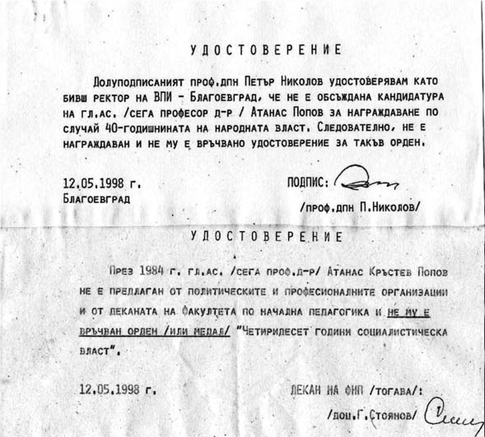

*Удостоверенията от ректора на университета проф.Петър Николов и декана на
Факултета по педагогика доц. Георги Стоянов, от които е видно, че не съм
награждаван по случай 40-годишнината на народната власт*

Който няма закалка от ужасите през годините на комунистическия режим, той
сигурно не може да издържи на такива удари като тези, които получавах аз през
повечето от годините на скроения посткомунизъм. Но след всеки удар срещу мен не
падах, а се изправях по-високо, за да набера повече сили и да разкрия истинския
образ на червените отрочета, които се страхуваха от възмездие.

## 41. Ректорът Илия Гюдженов и неговото обкръжение

През учебната 1998 – 1999 година започна усилена подготовка по опорните точки на
Указанието на ВС на БСП за избор на нов ректор на Югозападния университет.
Според тях трябваше да бъде непременно комунист. Най-подходящ според опорните
точки в червеното указание се оказа Илия Гюдженов. Много по-рано от предстоящите
избори той вече се чувстваше като ректор и пред персонала на университета се
представяше като такъв. Няколко служителки идваха при мен, за да ми се оплакват,
че ги заплашвал с уволнение, ако не слушат.

Най-после дойде мечтаният ден от Илия Гюдженов. На 10.10.1999 година 201
аудитория на университета беше препълнена не само от членовете на Общото
събрание, но и от някои непознати „гости“. Другият кандидат за ректор беше
проф.Енчо Мутафов, от когото комунистите в университета се страхуваха, защото
беше известен като „седесар“.

Когато излязох на трибуната и направих моето изказване, подчертах необходимостта
да се преодолеят онези слабости, които подронваха авторитета на университета.
Между другото споменах и за явлението „посредничество“. Точно в този момент
вратата на зала 201 се отвори и се показа Ицо Кмета, посредникът, когото изгоних
от кабинета на Гюдженов. Понеже той беше известен в университета, цялата зала
гръмна. Не знаех, че в подготовката за ректор са взели учестие и такива като Ицо
Кмета, които след това се събраха пред входа на залата.

След моето изказване на трибуната побърза да застане един от „вътрешните“
посредници, който беше член на Общото събрание и заемаше важна длъжност в
администрацията на университета. Той започна да величае кандидатурата на
Гюдженов като най-подходяща и безспорна.

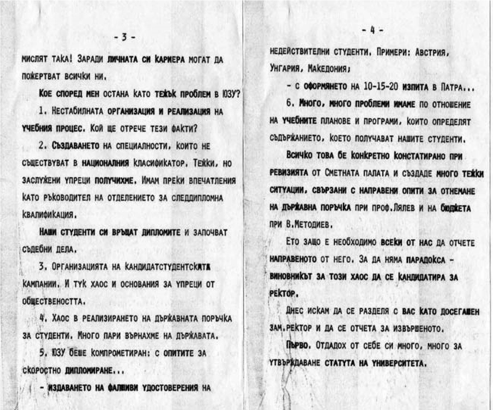

Не знам защо, но след избора на Гюдженов за ректор той дойде при мен гузен и ме
помоли да се видим в кабинета му. Страхуваше се да не излязат на бял свят
неприятните истини, които знаех за него. Предложи ми да приема някаква длъжност
в ректората. Отказах и продължих работата си като преподавател, ръководител на
Катедрата по педагогика и председател на Научния съвет по педагогика и
психология.

Новото ректорско ръководство, което беше стъкмено с помощта на ГК на БКП в
Благоевград, изработи специална стратегия за отстраняване от ръководни длъжности
във факултетите и катедрите на онези, които бяха белязани като „опасни“. Един от
тях бях и аз. Тази задача изпълни тогавашният председател на Контролния съвет в
университета, който през годините на тоталитарния режим беше един от
най-близките приятели на главния цензор в държавата Валентин Караманчев,
кандидат член на ЦК на БКП, директор на издателство „Народна младеж“, на
Партиздат, както и генерален директор на ДСО „Книгоиздаване“ и председател на
Държавно творческо и стопанско обединение „Българска книга и печат“. Този нов
кадровик в Югозападния университет изпрати писмо до декана на факултета да бъда
освободен като ръководител на Катедрата по педагогика поради това, че съм
наближавал годините за пенсиониране. Посрещнах спокойно това партийно нареждане.

За ръководител на Катедрата по педагогика беше избран доц. Димитър Димитров, с
когото бяхме в много добри колегиални взаимоотношения. Той прояви мъдрост,
каквато нямаха някои от другите, които се подготвяха от партийната група да
заемат тази длъжност. Получи се добра приемственост в работата на катедрата.
След това обаче той беше белязан от кадровиците във факултета като неподходящ за
по-нататъшно научно израстване и няколко пъти беше провалена кандидатулрата му
за научното звание „Професор“ от специално подбрани рецензенти.

Новият ректор на университета доц. Илия Гюдженов започна промените в
университета първо със закупуването на нова, луксозна лека кола. Старата „Лада“
на него не му прилягаше. В печата се сочеше сумата 36 хиледи лева. Не му
прилягаше и остарелия кабинет на предишните ректори. Искаше непременно да има
специална сграда за ректорат. Нагледа се на недовършената сграда, която беше по
план за Културен дом на студентите. Някога зам.министърът на финансите Горан
Банков по мое упорито настояване ни осигури 8 милиона лева за неговото
построяване, но и така след това не разбрах къде се прахосаха тези пари.

Новият ректор запази и предишния си просторен кабинет, където пък се настани
като ръководител на лаборатория по дидактика, психология и управление на висшето
образование. Та той не е нито дидактик, нито психолог или пък специалист по
управление на образованието.

Привика около себе си все подбрани съветници. Неразделен беше с бившия секретар
на вузовския комитет на БКП Никола Лазаров, заздрави връзките си и с неговия
заместник по идеологическите въпроси Йордан Колев. Взаимоотношенията на Илия
Гюдженов и Никола Лазаров останаха неразгадана тайна, но „академичната“ му
дружба с Йордан Колев беше съвсем явна и свързана със спазването на уговорката
за взаимна помощ „ти на мене, аз на тебе“. Става дума за тяхната взаимна
подкрепа. Гюдженов предложи Колев в състава на СНС по педагогика, а след това
същият пък му върна услугата при избирането на Гюдженов за професор с
осигуряването на подходящи рецензенти, каквито бяха Петър Петров и проф.

Марга Георгиева.

Ректорът посети специално няколко пъти Председателя на ВАК Георги Марков, за да
го убеди, че Колев трябва да стане „голям“ доктор. Тогава бях още член на
Комисията за обществени науки към ВАК, която три пъти отхвърляше избора на
Колев, но с благословията на Гюдженов мечтата му се сбъдна. Така е, комунистът
не забравя своя събрат, когато изпадне в нужда. След това Илия Гюдженов потърси
помощта и на създателя на академичните пирамиди Николай Божков, с когото
действаха заедно за тяхното укрепване, както и на Петър Балкански, бивш зав.
отдел ДПО „ Септемврийче“ и четите „ Чавдарче“ към ЦК на ДКМС, известен като
агент Байкушев. Те му помогнаха да разработи „знаменитото“ изследване
„Референтна рамка за организацията на образователния процес във висшето
училище“, с което получи научното звание „Професор“. За тази голяма услуга
Гюдженов прикри публикацията на Славей Костадинов от 21 април 2005 г. „Проф.
Балкански от Югозападния университет, обвинен в търговия с дипломни работи“, в
която черно на бяло се показват две едни и същи дипломни работи, на които научен
ръководител е Петър Балкански. Имаше оплаквания от студенти, че за всяка
подарена готова дипломна работа „научният ръководител“ е получавал тлъста сума
пари. Разбра се, че Гюдженов не беше забравил опита на онези, които правеха
скоростно научната си кариера.

Един месец след скандала за продажбата на дипломни работи от Петър Балкански,
Катедрата по педагогика и Факултетният съвет ме предложиха в Академичния съвет
за „почетен професор“. Цялата група от бивши партийни и комсомолски секретари се
вдигнала на крак, за да провали избора. С дяволски мимики и жестове Гюдженов
давал знак как да се гласува против. Не прочел обоснованото предложение от
катедрата, не обелил и нито дума за съвместната ни работа като зам.-ректори.
Тогавашният зам.-ректор Димитър Димитров разбира сговора на моите неприятели и
предлага да се отсрочи гласуването на следващото заседание. Но след това
калените от „партията-майка“ се подготвят още по-активно за провала на избора ми
за „почетен професор“. Някои от тях напомняли на новите членове на Академичния
съвет, които не ме познаваха, че съм приложил „Закона Панев „ за лустрирането им
през 1993 г.

Единственият предложен, но неизбран „почетен професор“ от Югозападния
университет, на който посветих цели 25 години, съм аз. Така е, когато червените
те захапят лошо. Горките, те не знаеха, че аз нямаше да приема тяхната червена
диплома за „почетен професор“, така както не приех и значката на университета,
когато научих, че тя ще се дава на коктейл, подготвен от една мутра, която имаше
близки взаимоотношения с някои от новото ръководство.

Не се мина много време и последва нов удар срещу мен. Бях създал дисциплината
„Етнопедагогика“, към която студентите проявявах небивал интерес. Но секретарят
по идеологическите въпроси във ВК на БКП Йордан Колев и отговорникът на
партийната група в Катедрата по педагогика Траян Попкочев отидоха при Гюдженов и
след това часовете по тази дисциплина бяха дадени на Йордан Колев. Тогава
двамата неразделни приятели бяха вече известни с „научното откритие“, че няма
термин „възпитание“, а само термин „образование“. Бях твърдо убеден, че Колев не
познаваше семантиката и на термина „етнопедагогика“. Като научили за това,
десетина студенти дойдоха в апартамента ми, за да изразят възмущението си. Цели
три месеца студентите не посещаваха лекции при Колев, който си нямаше хабер от
тази научна дисциплина. Тогава категорично реших, че трябва да се разделя с
бившите партийни и комсомолски секретари, които вече бяха превзели
педагогическия факултет.  

## 42. Партийните и комсомолските секретари от Педагогическия факултет се върнаха отново на власт и превзеха ръководните длъжности в него ?

Това са онези, които водеха явна, а и потайна, нестихваща война срещу мен като
„враг на народната власт“, който имаше смелостта да приложи в универстета Закона
„Панев“ през 1993 г.

В различните катедри на Педагогическия факултет се бяха залостили все ярко
изявени бивши комсомолски и партийни секретари, дошли от къде ли не. И все на
отговорни места. Сред тях беше и бившият секретар на ОК на ДКМС в Горна Джумая
Стоян Иванов.

Спомням си, че когато бях зам.-ректор, един от неговите колеги ми донесе две
големи папки, в които бяха събрани конкретни доказателства за незаконното му
връщане като предишен асистент в университета. Отначало беше гузен за това, но
когато започнаха промените, надигна високо глава и участваше активно и той в
борбата срещу мен за отстраняването ми даже и от факултетния съвет. След това се
стресна, когато Законът „Панев“ му попречи да заема жадувано от него ръководно
място в унивреситета. За мое голямо учудване и той през последните няколко
години набързо се накичи с научна степен и званието професор. А когато се
създаде новият факултет в университета с чудноватото название „Обществено
здраве, здравни грижи и спорт“ през 2009 г., мечтата му се сбъдна и стана негов
декан.

Верен приятел на комсомолския секретар Стоян Иванов отдавна е дългогодишният
секретар на партийната организация в Педагогическия факултет Кирил Костов. Той
пък през 2007 година стана зам.-ректор. След това през 2011 година, когато се
гласеше за втори мандат, във в. Струма излязоха публикации, от които станаха
най-после известни някои от неговите далавери, за които се говореше отдавна.В
една от тези публикации се твърдеше, че синът му е взел 2500 лева от студента
Иван Миков за прехвърлянето му в нова специалност в университета с помощта на
баща му. Стана голям скандал и несменяемият дългогодишен партиен секретар си
подаде оставка като зам.-ректор. След това бившият партиен секретар продължи
отново да сплотява партийната група във факултетния съвет, заедно с неговия
приятел Йордан Колев.

През 2010 година неочаквано почина деканът на Педагогическия факултет доц. Руси
Русев. Комунистите от факултета отново се сплотиха и решиха на негово място да
изберат съпругата на Йордан Колев, която има големи заслуги като завеждащ
организационен отдел в РК на ДКМС в град Кнежа, след което се записва като
студентка в педагогическия факултет на Софийския университет (детски профил).
След една година Маргарита Колева е преизбрана за цял мандат като декан, а за
председател на Общото събрание комунистите стъкмяват своя бивш секретар на
партийната организация във факултета доц. Кирил Костов, най-близкият приятел на
семейство Колеви.

И така, коя е Маргарита Колева, съпругата на най-войнствения борец против
прилагането на Закона „Панев“ през 1993 година?

Отговор на този въпрос се дава в специално изпратената ѝ характеристика от
секретаря на градския комитет на БКП в град Койнаре.

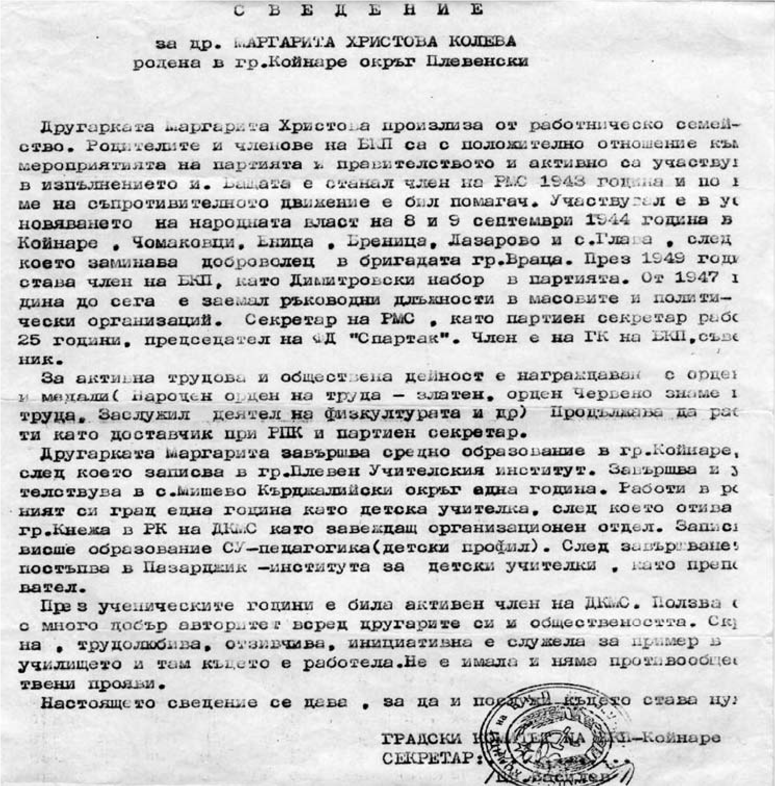

Нейният баща е станал член на РМС още през 1943 година и като такъв по време на
съпротивителното движение е бил помагач. И нещо страшно, много страшно в
произхода на «другарката» на Йордан Колев. Баща ѝ е „участвувал в установяването
на народната власт на 8 и 9 септември 1944 година в Койнаре, Чомаковци, Еница,
Бреница, Лазарово и с. Глава“. Това са най-страшните и кървави дни, през които
без съд и присъда създадените по указание на Георги Димитров от Москва въоръжени
групи от комунисти и ремсисти разстрелват невинни хора. Ето какво научаваме от
книгата на Христо Троански за някои от жестокостите именно в едно от селата на
този край, където е бил бащата на деканката на Педагогическия факултет в
Югозападния университет Маргарита Колева:

„Пребиват тамошните революционери с колове четирима местни жители и хвърлят
труповете им в ямата за умрели от заразни болести домашни животни. Сетне – още
четирима, докарани от съседното село. Подир някой и друг ден играещите наблизо
деца ужасени изпищяват и тичат да разказват у дома какво са видели“ (вж.
Троански, Хр. Убийствено червено. С., 2003 г., с.198).

Сигурно някогашният секретар на РМС, а след това 25 години партиен секретар и
член на ГК на БКП е разказвал на дъщеря си Маргарита и на зетя Йордан за
геройските си дела при установяването на народната власт. Закърмена с неговия
дух.

Най-младият от комунистите в Педагогическия факултет доц. Траян Попокочев беше
избиран за зам.-ректор два мандата от 2007 до 2014 г. Това учуди много
преподаватели в университета, но властта в него беше вече отново червена, а
„несменяемият“ бивш комсомолски секретар даде много от младежките си години за
нея.

Кой е т.нар. от студентите „наперен“ преподавател с прозвището „Белязаният“, при
когото повечето студенти вземаха изпита си много трудно?

Това е сегашният декан на Педагогическия факултет и ръководител на Катедрата по
педагогика. Спомням си, че някога един от моите колеги, известен български
професор от Софийския университет, който беше хоноруван преподавател при нас, ми
каза:

– Атанасе, този наперен асистент има самочувствие, което е фалшиво. От него
преподавател по педагогика не става.

Все още пазя десетките оплаквания на студенти, изпращани до мен като ръководител
на катедрата. Не смея да ги разлистя, защото там се описват неща, от които някои
ще настръхнат. Никога няма да забравя гнева и плача на дъщерята на един от моите
някогашни колеги в град Разлог, която беше принудена да напусне нашия
университет и се премести във Факултета за предучилищна и начална училищна
педагогика в Софийския университет. Този случай беше много неприятен и известен
както на ректората, така също и на студентите. Но нека и този път премълча за
него.

И така кой е „несменяемият“ комсомолски секретар навсякъде, където
и да е бил, а след това и групов партиен отговорник на Катедрата по педагогика?

Спомням си като ръководител на катедрата, че той винаги беше с неизмеримо високо
партийно вдъхновение. Недоумявах откъде идваше то, но веднъж ми представи
автобиографията си и разбрах, че той наистина беше много верен син на „партията
майка.

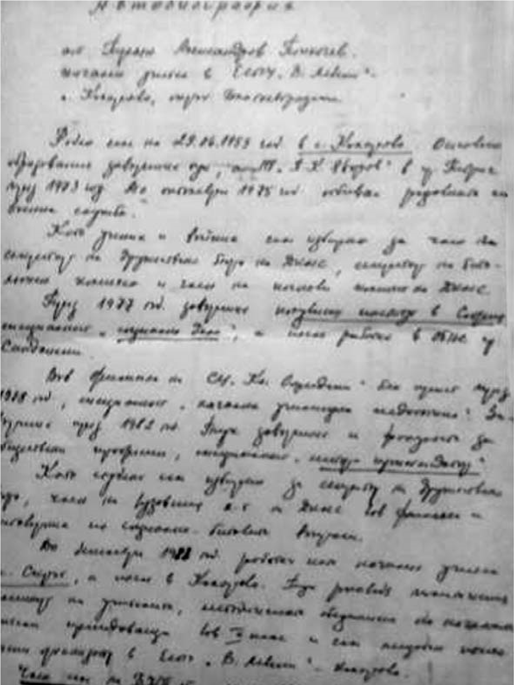

*Това е автобиографията на сегашния декан на Педагогическия факултет в
Югозападния университет „Неофит Рилски“ Траян Попкочев, ръководител на Катедрата
по педагогика и доскорошен заместник-ректор два мандата*

Като ученик и войник Попкочев е избиран за член и секретар на дружествено бюро
на ДКМС, секретар на батальонен комитет и член на полкови комитет на ДКМС.
Когато завършва полувисш институт за социални дейности, е назначен за директор
на Пионерския дом в Сандански. Тази длъжност му отваря по-лесно вратата за
Висшия педагогически институт в Благоевград, където освен специалност „Начална
училищна педагогика“ завършва и факултета за обществени професии, специалност
„Лектор-пропагандатор“.

Като студент Попкочев е избиран за секретар на дружествено бюро и член на
вузовския комитет на ДКМС. Е, това е голям старт и за лесно вземане на учителско
място в родното му село, където ръководи политическия семинар с учителите.

С всичкия този комсомолски актив Попкочев записва името си за подходящ асистент
във Висшия педагогически институт в Благоевград по специално скалъпената учебна
дисциплина за него „Основи на педагогиката“, за която нямаше необходимите часове
за откриване на конкурс по нея. Но какво да се прави? За такъв заслужил
дългогодишен комсомолски секретар партията беше грижовна.

Е, не мога да отмина и „научното“ израстване на Попкочев в Катедрата по
педагогика, на която бях ръководител.

С немалко нарушения гл.асистент Траян Попкочев се запъти да получи научна степен
и научно звание. Ето как се добра до тях.

Зачислен е на свободна аспирантура за срок от две години на 1.10. 1990 като
дисертант на самостоятелна подготовка на тема „Отношението ценностна система на
възпитание – избор на стратегии на възпитание (в началните класове).
Рецензентите на проекта бяха доц. М. Белова и гл.ас. Н. Чимева, които имаха
съществени критични бележки, които авторът след това забрави.

Бях член на комисията за кандидатския минимум на Тр. Попокочев, който се проведе
на 10.10. 1991 г. Отговорите му бяха незадоволителни, поради което подписах
протокала с особено мнение.

Със заповед на ректора проф. К. Чимев от 25.11.1993 г., Траян Попкочев беше
отчислен от аспирантура с право на защита, считано от 2.10.1992 г. Цели 7 години
Попкочев не предложи дисертация за обсъждане. Чак на 7.6.1999 г. на заседание на
Катедрата по педагогика поиска да му бъдат избрани рецензенти, без да представи
труд за обсъждане в катедрата. Та той беше вече загубил право за защита на
кандидатска дисертация.

На 14.07.1999 Траян Попкочев предложи най-после проект за дисертация, но не беше
направено обсъждане, защото нямаше още избрани рецензенти. На това заседание не
друг, а той си предложи за рецензенти проф. Петър Николов и доц Петър Балкански
за защита на кандидатската му дисертация в Специализирание научен съвет по
педагогика в София. Трябваше първо да се обсъди проектът за дисертация и тогава
да се предложат рецензенти. Такъв друг случай до тогава нямаше в Катедрата по
педагогика.

Гл.ас. Траян Попкочев променя сам темата на своята дисертация, без да има
решение на катедрата и Факултетния съвет. Не ми е известно новата тема да е
обсъждана на заседание на Катедрата по педагогика.

Интересно, след цели три години, чак на 12. 09. 2002 г. Попкочев защитава
кандидатска дисертация на тема „Ценностните ориентации на родители в избора на
стратегии на семейно възпитание“. Остана дълбока тайна това как и защо Попкочев
е сменил темата и кое научно звено е предложило защитата на дисертацията му.

Тежки процедурни нарушения са допуснати и при избора на гл.ас Тр. Попкочев за
доцент. Без да има представен и обсъждан в Катедрата по педагогика самостоятелен
труд, какъвто се изискваше от всички, които бяха избрани за доценти, той беше
избран за такъв, разбира се, с помощта на партийната група в катедрата.

По-късно, вече като ръководител на Катедрата по педагогика и зам.-ректор,
Попкочев продължи да нарушава основните изисквания за откриване на процедура при
получаване на научното звание „Професор“. Не беше представил за обсъждане в
катедрата подадената молба от доц. Снежана Попова за откриване на процедура за
научното звание „Професор“. Тя имаше шест издадени монографии и специално
представена такава за научното звание „Професор“, но ръководителят на катедрата
Попкочев запази процедурата за професор за себе си.

Без да представи специално подготвен хабилитационен труд за това научно звание,
Траян Топкочев подготвя Катедрата по педагогика, която му открива процедура за
професор, за която все още не се знае до къде е стигнала.

Ето, такива са някои от сегашните ръководители в педагогическия факултет на
Югозападния университет, които продължават с макаренковски методи и форми да
обучават студентите. Портретът на прославения съветски педагог Антон Семьонович
Макаренко още виси в една от залите, където чете лекции неговият изследовател
проф. Йордан Колев. За да не се забравя „великият“ съветски педагог от
студентите, Йордан Колев публикува голяма статия за неговата 125-а годишнина от
рождението му в Годишника на Факултета по педагогика през 2013 година.

През 1993 година цялата тази група от партийни и комсомолски секретари беше
засегната от Закона „Панев“ и изолирана от ръководните длъжности в университета.
Това спомогна за създаването на атмосфера за спокойна и ползотворна дейност в
университета. Преодолени бяха трудностите, които се създаваха на безпартийните
преподаватели в тяхното научно израстване. По-късно при управлението на
различните разновидности на комунистически правителства, когато беше провален и
цялостният Закон за лустрация, постепенно бившите партийни и комсомолски
секретари заеха отново ръководните длъжности в педагогическия факултет. В тяхна
помощ бяха и някои неизвестни до тогава агенти на Държавна сигурност, какъвто в
педагогическия факултет се загнезди проф. Петър Балкански, известен с
агентурното име Байкушев. Така се създадоха отново трудни условия за спокойна
работа и заслужено научно израстване на онези безпартийни преподаватели, които
бяха белязани като „непослушници“.

Най-благоприятни условия започнаха да се създават за развихряне на бившите
партийни и комсомолски секретари през 1999 г., когато отминаха мандатите на
ректорското и факултетските ръководства, избрани склед прилагането на Закона
„Панев“. Новият ректор доц. Илия Гюдженов потърси специалната помощ най-много на
комунистите от педагогическия факултет на университета. В другите факултети
нямаше такова явно сплотяване на бивши партийни и комсомолски секретари, защото
такива и преди това се срещаха много малко в тях, а и не бяха така напористи да
заемат ръководни места.  

## 43. След пенсионирането ми, продължих да чета лекции като гост професор в Пловдивския университет

Там, където нямаше такава червена свита, се чувствах спокоен и доволен от
преподавателската си работа. Не престанах обаче да отдавам всичко от себе си за
укрепване авторитета на Югозападния университет.

През 2000 година бях научен ръководител на национална конференция на тема
„Актуални проблеми при възпитанието на учениците в съвременното българско
училище“, на която присъстваха изтъкнати университетски преподаватели по
педагогика и психология (професори и доценти) от Югозападния, Софийския,
Великотърновския и Пловдивския университет, водещи учители от страната и
ръководители в образователната система. На конференцията спецален гост беше Ели
Жуан, зам. генерален директор на Интернационала по образованието,
вицепрезидентът на Република България Тодор Кавалджиев, председателят на КНСБ
Желязко Христов, председателят на Синдиката на българските учители Янка Такева и
др. След провеждане на конференцията беше издаден сборник с всички доклади и
изказвания.

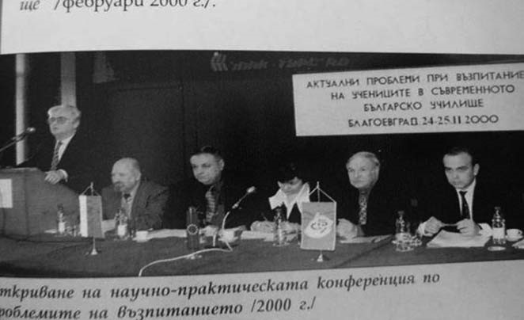

Още през първите ректорските години на Илия Гюдженов, Югозападният университет
започна да се тресе от големи скандали, свързани с купуване и продаване на
изпити, с прехвърляне от една в друга специалност, със записвания без полагане
на конкурсни изпити и какви ли не други срамни, но прикривани нарушения. Станаха
съвсем прозрачни имената на някои от приближените на ректора, но той се правеше,
че не се е случило нищо. Затова по-късно се предприеха строги мерки от
Министерството на образованието за прекъсване на обучението на студенти, при
които бяха нарушени академичните правила. Ректорът и този път се представяше за
невинен и стовари цялата вина върху други, един от който след това получи
незаслужени обиди и беше отстранен от Югозападния университет.

Винаги, когато научавах за новите скандали в университета, свързани с
нарушаването на нормите и правилата на академизма, изпитвах болка, която
преживявах болезнено, защото умората от усилията ми да запазя неговия авторитета
още не бе отминала.

През началото на учебната 2001 година не останах безразличен към решението на
ректорския съвет да се обучават в Югозападния университет 500 турски студенти,
които бяха поставили условието да имат и действаща джамия. Тогава си спомних за
някогашните постоянни пътувания на Николай Божков в Турция, където той
подготвяше там да създаде академична пирамида на университета. Сега тази негова
идея се подновяваше и подкрепяше от обкръжението на ректора. Обявих се против
нея, защото Пиринският край не е е най-подходящото място за обучение на 500
турски студенти.

Бях научен ръководител на национални и международни конференции, на които се
разглеждаха изключително актуални проблеми в образованието. За съжаление нито
ректорът, нито неговите заместници се интересуваха от това, което правех.
Техните „грижи“ бяха други.

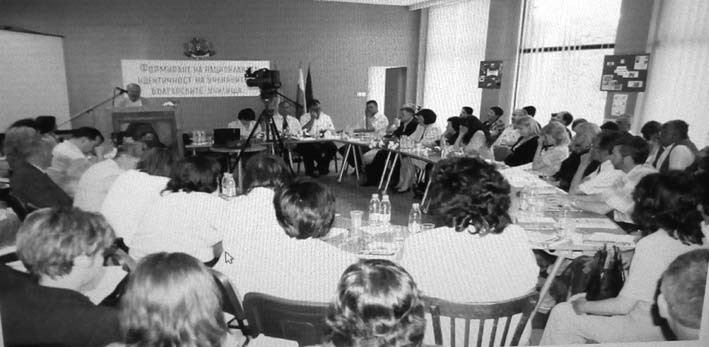

През 2005 г. бях научен ръководител на национална конференция на тема „Формир
ане на националната идентичност на учениците в българското училище“ с участието
на преподаватели от Югозападния, Софийския и Пловдивския университет,
ръководители в образователната система и учители от различните степени на
българското училище.

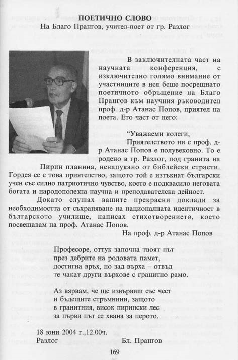

През 2006 година под мое научно ръководство се проведе друга национална
научно-практическа конференция в град Пловдив на тема „Съвременни проблеми пред
извънкласната и извънучилищната дейност“, в която участваха университетски
преподаватели, ръководители на окръжни съвети за народна просвета, учители и
много други спциалисти в системата на образованието. Тя предизвика специалното
внимание на Министерството на образованието, което след това отпусна 12 милиона
лева за организирането и провеждането на извънкласната и извънучилищната работа
в българските училища.

И след пенсионирането ми не преставах да бъда близо до моите колеги от Катедрата
по педагогика и да анализираме и осмисляме заедно актуалните проблеми в
педагогическата наука, детерминирани от промените, които ставаха в нашата
страна.

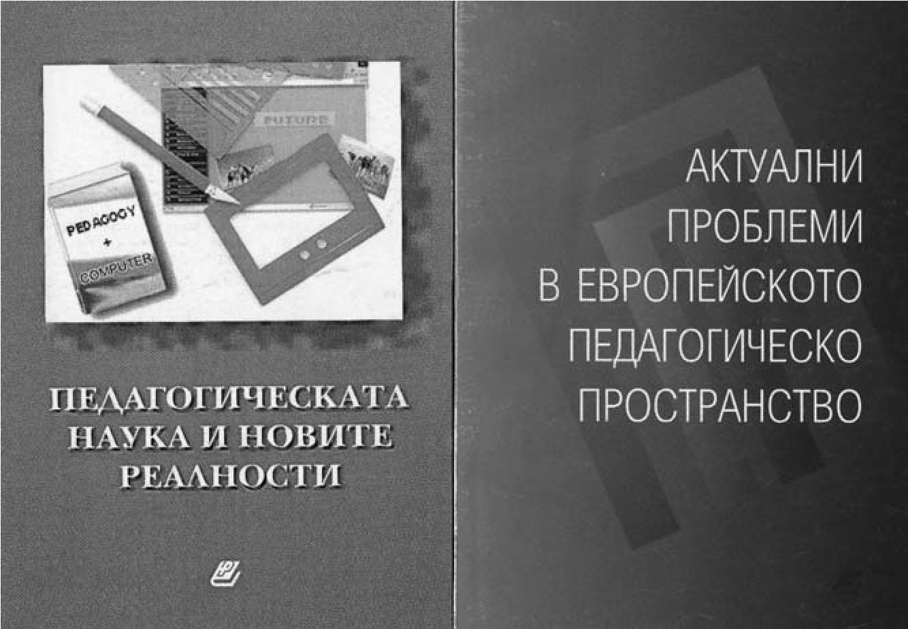

През 2002 и 2003 г. излязоха от печат под мое съставителство двата сборика
„Актуални проблеми в европейското педагогическо пространство“ и „Педагогическата
наука и новите реалности“, в които участваха със свои разработки всички колеги
от Катедрата по педагогика.

През това време напусналият по собствено желание катедрата Йордан Колев
отскачаше от катедра в катедра и си търсеше подходящо място, за да се обсъждат
„трудовете“ му там, където не беше неговото научно направление. Той започна от
Катедрата по предучилищна педагогика. След това, както вече беше подчертано, се
премести със специално поръчение, но незаконно в Катедрата по начална училищна
педагогика. Последва отново преместването му по негово преднамерено желание в
Катедрата по предучилищна педагогика, после пак прелетя в Катедрата по
педагогика, от която се отказа и отново се върна в Катедрата по предучилищна
педагогика. По едно време с проф. Петър Балкански, известен като агент Байкушев,
създадоха нова катедра, в която съвсем произволно бяха включени преподаватели от
различни специалности. И още веднъж се върна в Катедрата по педагогика, когато
вече се бях пенсионирал, но после пак отиде в Катедрата по предучилищна
педагогика при жена му, където е още. Такова гъвкаво премятане от катедра в
катедра, за да се решат по-лесно личните проблеми, не беше познато в
университета.

Необходимо е да се направи специално изследване за всички бивши партийни и
комсомолски секретари, както и за агентите на Държавна сигурност, нахълтали в
българските университети, за да се установи какви са техните родствени корени,
как са попаднали и израснали там, където не им е мястото, и какви са истинските
им приноси при получаване на техните научни степени и звания. Присъствието им в
академичната общност и през годините на посткомунизма е една от основните
причини за подронване на устоите на висшето образование и бягството на
талантливите студенти в чужбина.

*Сега, когато се разхождам тук често ме спират признателните мои колеги,бивши
студенти и граждани, за да ми припомнят какво съм направил за спасяването на
университета от онези, които рушеха авторитета му, а след това се представяха за
негови „строители“.Между надписите на двата университета беше един от кабинетите
ми като ръководител на катедра и зам.-ректор. От него прегръщах с поглед града,
сгушил се в пазвите на планината, и се радвах, че в него израства нашият
университет като огнище за наука, просвета и култура в Югозападна България*

Когато не стихваха атаките на партийните и комсомолските секретари срещу мен, не
беше лесно и на дъщеря ми доц. Снежана Попова. Тя беше тогава гл. асистент по
теория на възпитанието. Катедрата избра рецензентите за защита на докторската ѝ
дисертация на неизследваната до тогава тема „Формиране на половоролева
идентичност на децата от начална училищна възраст (педагогически аспекти)“. След
това обаче предложеният от катедрата рецензент проф. Стефан Чернев, който беше
един от най-известните спецалисти по теория на възпитанието, беше заменен от
тогавашния червен Специализиран научен съвет с бившия партиен секретар от
Биологичния факултет в Софийски университет биологът Александър Панайотов, който
направи отрицателна рецензия.

Блестящата защита на Снежана го прикова и разкри неговото истинско невежество по
отношение на темата на дисертацията. Той замълча и сякаш онемя, когато трябваше
да даде отговор на въпросите на дисертантката, разкриващи съвсем убедително
некомпетентността му в областта на педагогическата наука. Някои от неговите
приятели, които бяха написали рецензията му, се скриха. Снежана беше избрана за
кандидат на педагогическите науки от всички членове на научния съвет. За нея
гласуваха и онези, които бяха предварително уговаряни да гласуват „против“.

Председателят на Специализирния научен съвет проф. Димитър Павлов се обърна към
дъщеря ми и ѝ каза пред всички в залата:

– Колежке, честито! Досега сме нямали такава достойна, истинска защита на
докторска дисертация!

По-нататък обаче партийните и комсомолските секретари в Педагогическия факултет
продължиха да прилагат своя „класово-партиен подход“ и към нея. Направен бе
неуспешен опит и при конкурса ѝ за придобиване на научното звание доцент.
По-късно, когато поиска да ѝ бъде открита процедура за научното звание
„Професор“, доц. Траян Попокочев скри молбата ѝ. Затова пък след това
„несменяемият“ комсомолски секретар си уреди по скоростен начин да му бъде
открита процедура за професор, без да има издаден хабилитационен труд. Конкурсът
му обаче, както вече беше подчертано, се „закучи“ и се влачи и до днес заради
това, че и този път прегази академичните изисквания за даване на научно звание.

## Заключение

Зареден с идеите на прадядо ми Георги Зимбилев, известен възрожденски
просветител от първа величина, създател на първите новобългарски училища в
Източна Македония, цялата ми преподавателска дейност и длъжностите, които
изпълнявах като ръководител на катедра, зам.-декан, зам.-ректор, председател на
Научен съвет по педагогика и член на Висшата атестационна комисия бяха свързани
с развитие и обогатяване на просветните традиции в нашия край.

Кой ли не е идвал при мен? За какво ли не е търсил моята помощ? Това бяха
годините на истинското изграждане на съвременната структура на Югозападния
университет. Никога обаче не съм допускал, че тази моя всеотдайност ще бъде
заличена, или пък забравена напълно.

Колко много неоснователно създавани трудности на колегите от университета
трябваше да се преодоляват. В същото време пък бившата партийна и комсомолска
номенклатура се бетонираше и продължаваше да се самовъзпроизвежда с научни
степени и звания, които повечето от тях не заслужаваха. Появиха се и създатели
на академични пирамиди в университета, в които се раздаваха фалшиви професорски
звания, с които се накичиха немалко техни приятели у нас и в чужбина.

Защо се затриха от паметта на някои тези години, когато едни градяха, а други
рушаха авторитета на Югозападния университет? Ако ги нямаше онези, които даваха
всичко от себе си, той нямаше да оцелее.

Преди да почине, проф. Траян Лялев, някогашният декан на Правния факултет в
университета, ни спря на една от главните улици в града с един от моите колеги.
Отначало не го познах, беше се променил неузнаваемо.

Той се обърна към колегата, който беше с мен, и му каза:

&minus;Колега, не забравяйте! Ако проф. Попов не се беше преборил с славянофилите,
    които искаха да затрият Югозападния университет и да го превърнат в
    Славянски университет, както и ако не беше толкова упорит в Народното
    събрание за утвърждаване на статута му, в този град щеше да има само
    американски университет. Аз бях най-честият му посетител в кабинета. И съм
    жив свидетел на това, което той направи.

Вгледах се в почти грохналия вече мой колега, с когото някога съм имал тежки
разговори, свързани с някои проблеми във факултета, който ръководеше. Не исках
да повярвам, че това е той. Но чух едно признание, което разнежи моето уморено
вече сърце.

За първи път такива хубави думи, които не могат да бъдат забравени, чух и от
проф. Илия Конев, с когото бяхме добри приятели. Когато някои забравиха, че той
е кръстникът на университета, идваше често огорчен при мен. Веднъж донесе
папката, в която беше събрал някогашните писма, изпращани от него като ректор на
университета до министъра на образованието за признаване на Висшия педагогически
институт като университет. Остави я на бюрото ми и каза:

&minus;Аз търсех по-късия път, но ти намери по верния за утвърждаване статута на
    университета като разработи тези толкова убедителни мотиви и ги внесе в
    Народното събрание, което реши съдбата му.

Оказа се, че истинските университетски преподаватели, които не бяха малко, не
забравят истината за утвърждаването на някогашния Висш педагогически институт
като университет, а онези, които гонеха личните си интереси, я премълчават. И не
само че я премълчаха, но и преиначаваха, за да представят себе си като
„строители“ на Югозападния университет.

Всичко написано в тази книга е видяно и преживяно, потвърдено с конкретни
документални факти. Нямам възможност да разкажа за още много потресаващи истини
за онези, които рушаха авторитета на увиверситета. Все още не казвам всичко,
което зная и за моите хулници и клеветници, за онези, които вървяха пред мен и
по мен, за да възпират всяка моя крачка, която правех, без да се страхувам от
тях.

От споделеното в тази моя книга става съвсем видно, че за да оцелеят като
властници за цял живот, немалко от бившите изявени партийни и комсомолски
секретари в университета използваха същите средства, методи и форми, които се
прилагаха през годините на комунистическия режим срещу „враговете на народната
власт“.

В един кротък разговор с моите родители, които ми разказваха за жестоките
убийства от комунисти, майка ми с просълзени очи ми прошепна:

&minus;Сине, пази се! Те, комунистите, са жестоки. Някога първо разстрелваха
    най-свестните българи, а след това оскверняваха паметта им с лъжи и клевети
    за тях. Дядо ти, на когото носиш името, беше най-благордният кмет и войвода,
    а помниш колко лъжи и клевети скалъпиха за него след девети септември 1944
    година? Горкият! Наричаха го „фашист“.

Татко впери очи в майка и допълни:

&minus;А сега, Кипре, понеже се страхуват да убиват, както някога, фабрикуват
    сплетни, лъжи и клевети, които умъртвяват измъчените и изстрадалите като
    нас. Затова в България сега ги няма повечето от някогашните страдалци.

Майка ни погледна двамата и продължи:

&minus;Кръстьо, Насе, комунистите са като троскота по нивите, който задушава всичко
    около него. Щом не го изкорениш, няма да се ражда нищо друго.

Този червен троскот обхвана и моя университет и попречи да се сбъ-
дне мечтата ми да стане още по-красив храм на истинската наука, просвета и
култура. Глождиха го, а и още продлъжават да свиват снагата му онези, които бяха
отгледани със специални грижи от Българската комунистическа партия като нейни
верни синове и дъщери.

Майка и татко бяха моите първи учители в живота, затова до последно слушах
мъдрите им думи, които намираха тихо място в моята памет. Сега, когато често
разговарям със себе си, възкръсва всичко казано от тях, което дава отговор на
въпросите, които тревожат днешните страдалци.

Минаха вече повече от осемнадесет години, когато се разделих с моя любим
университет, но мислите и чувствата ми за него не ме напускат. Именно затова
сега реших да разкажа за него какво съм видял и преживял през тези години от моя
живот, когато у нас бившата комунистическа власт се превъплъщаваше в
посткомунистическа. Това превъплъщение се прояви и в развитието на Югозападния
университет „Неофит Рилски“. Въпреки посредствеността и разрушителната дейност в
него, както и в останалите български университети на бивши партийни и
комсомолски секретари и агенти на Държавна сигурност, които подронваха неговия
авторитетет, той ще продължава да се развива и укрепва като непоклатима крепост
и нестихващо огнище за просвета, наука и култура в Пиринския край на България.