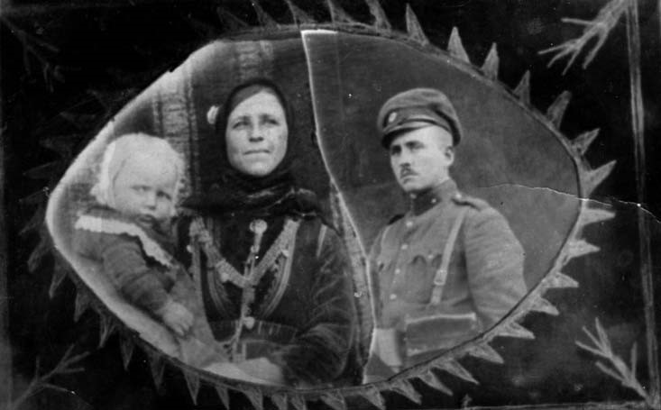
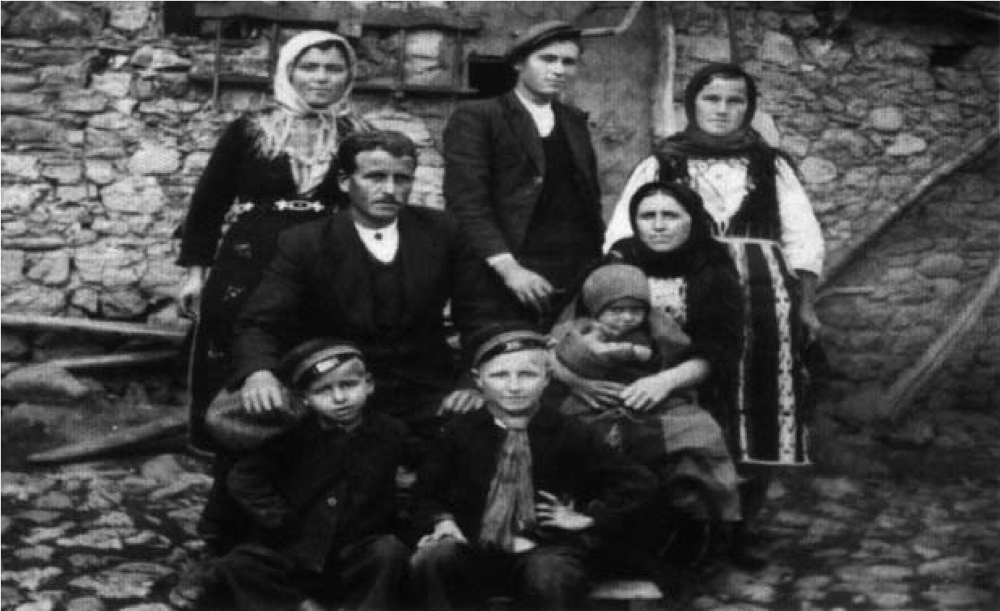

# 1. Нерадостно, но вълнуващо детство

На 3 юни 1934 година майка ми и баща ми свиват семейно гнездо. Цялото село се
стича, за да участва в сватбеното тържество и да поздрави деветнадесетгодишния
син на своя войвода и дългогодишен кмет в Либяхово. Идват и бившите четници на
Атанас Попов от околните села, заедно с техните семейства. Кумът на младоженците
Лазар Иванов Малаков също събира цялата си рода. В осиротялата Попова къща
сватбарите се надпреварвали да донесат кой каквото може, за да подпомогне
младоженците.

Майка ми и баща ми заживяват щастливо, въпреки големите трудности, които срещат.
На 1 април 1935 година баща ми постъпва в казармата, за да отбие редовната си
военна служба. Майка ми е бременна и на 22 май се раждам в Поповата къща, в
стаята на войводата. Лазар Малаков и жена му ми дават името на дядо. Радостта в
семейството ни е голяма, защото съм първото дете на родителите си. Баща ми е
получил три дни домашен отпуск, за да види своята рожба. Вечерта в нашата къща
се събира цялата рода. Баба Серафимка и дядо Велик, които са родители на майка
ми, го посрещат първи с думите:

– Кръстьо, възкръсна името на свато Атанас. Вярвай, че синът ти ще бъде достоен
да носи неговото име. Баща ти оживява в него.

Татко се насълзил като чул тези думи. Минали седем години от разстрела на баща
му, но тежката буца в гърдите му още стояла. Радостта от първата му рожба
стопила голяма част от горчивата скръб.

През времето, когато татко отбивал военната си служба, цялата грижа за мен пада
върху майка ми. Помагали ѝ двете лели Стоянка и Мехалина, които са били –
първата на 12, а втората – на 9 години. Чичо Петър едва смогвал да върши мъжката
работа, затова с нея често натоварвал и сестрите си. По-малката му сестра
Мехалина ходила с воловарчетата, а леля Стоянка наглеждала женската работа в
семейството.

>   *В прегръдките на майка, когато татко е в казармата*

Когато съм навършвал втората си година, баща ми се завърнал от казармата и
започнал да помага на майка при отглеждането ми. Лелите ми казваха, че винаги ме
държал в дясната си ръка и ме подмятал нависоко, за да прокуди отрано страха у
мен. Учил ме как да стоя изправен и да крача като строен войник, какъвто бил
той. Майка пък ме криела винаги в скута си и ме киприла с чисти и спретнати
дрешки, които сама ушивала. В цялата рода тя била известна като голяма
чисточница. Като такава я помня и аз от детските си години. Винаги у нас беше
много чисто и подредено.

По-късно, когато станах на пет години, започнах да ходя по нивите, заедно с
майка, татко и лелите Стоянка и Мехалина. Татко се гордееше с двете си сестри,
които бяха едни от най-гиздавите и работливите в селото.

Никога няма да изтрия от паметта си гласът на лелите, които бяха известни
песнопойки. Пееха и тогава, когато им беше много трудно. С песента прокуждаха
мъката си. Понякога забелязвах сълзи на очите им, които извираха от изстрадалите
им сърца като кръгли сирачета.

Сутрин рано, преди да се зазори, татко ни събуждаше. Подвикваше и на чичо Петър:
„Бате, хайде, ставайте, че зората скоро ще се пукне.“

>   *Петгодишен, бос, заедно с Магда Малева*

Докато ние се подготвяхме, татко беше натоварил кошовете на магарето и тръгвахме
да берем тютюна, за да изпреварим зазоряването. Лелите и татко подхващаха по
един ред и кършеха сръчно листата, които поставяха на купчинки през един ред. Аз
ги събирах и нареждах в кошовете. Мълчанието на нашата и съседските ниви се
прекъсваше с песента на лелите: „Море, съмни, съмни, боже. Не съмнува“. Когато
зазоряваше, лелите сменяха песента. А щом слънцето показваше първите си лъчи,
започваха друга, с която го молеха да не бърза, а да изчака, за да не увяхнат
набраните листа и да напълним кошовете с тютюн, тогава да покаже горещото си
лицe.

Нивите ни бяха далеко от селото. Тютюн садихме най-много на местностите Моянско
поляне и Кълниката. Докато стигнем до вкъщи с напълнените кошове, слънцето се
издигаше високо над Градище.

Когато порасна и братчето ми Стоян, двете лели се омъжиха. При ниженето на
тютюна останахме ние с майка и татко. Леля Стоянка хареса калеко Георги Малев, а
леля Мехалина – калеко Димитър Божков. Новите им домове са само на няколко
разкрача от нашата къща, затова идваха почти всяка вечер на гости у нас.

В моята памет от детските години възкръсват и дните по време на жътва на
местността Киселичето, която е близо до границата с Гърция. Там идваха да ни
помагат някои от роднините. Обикновено тук майка разрязваше за първи път
стареца, който татко правеше от най-хубавото свинско месо. Не знам дали на друго
място се прави такъв вкусен деликатес като либяховския червен старец. Поради
далечното разстояние от селото обикновено спяхме на нивата под дъба, където
обядвахме и вечеряхме. Никога няма да забравя надпреварата по надпяване между
жените от съседните ниви. И тук, в най-големите горещини, работата не спираше.
Песните огласяха върховете на Байрямка, оттам се спускаха към българските села,
останали под гръцко владение.

Вършитбата беше по плевните. На нашето вършило впрягахме двете крави, с които
подкарвахме вършилника – голям конусовиден камък, който мачкаше ръжта докато
сламата не стане удобна за храна на добитъка през зимата. След един-два враха
разпрягахме воловете и децата от съседните плевни тръгвахме да напасем добитъка
към Вълканче или Кириндол. През това време майка и татко изнасяха житото на
Поляната, където духаше по-често вятър, който прочистваше ръжта от плявата.

Обикновено през летните месеци домашният добитък го наглеждахме ние, децата. В
празничните дни се събирахме по няколко и подкарвахме воловете и кравите към
Качолеца, Горни лъки или Чиркейци. Майка ми правеше ядене, което поставяше в
засрук (дървен съд). На обяд се събирахме на едно място повече говедарчета.
Най-често децата от нашата махала пладнувахме на Качулеца, до Каралазьовата
нива, където си правихме голям гьол, в който се събираше водата от дерето. Там
се къпехме. Ние с моя сватил Стойко Божков, съседите Кръстьо Бродев и Димитър
Гахов бяхме неразделни. С тях вечер ходехме и на паша. Подкарвахме мулетата и
магаретата към местности, където те пасяха през нощта, а ние завити в черги или
козунаци спяхме под открито небе. Това бяха едни от най-хубавите нощи, които съм
запомнил. Когато падаше дъжд през нощта, се криехме под по-големи дървета.

Все още сънувам нашето лозе, където заедно с братчето ми Стоян прекарахме много
дни от детството ни. Дядо Атанас беше създал едно от най-хубавото лозе в нашето
село, оградено с какви ли не овощни дървета (ябълки, сливи, зарзали, круши и
какво ли не още). Още през 1923 година, когато бил избран за втори път за кмет
на селото, поканил трима агрономи от Неврокоп, с които огледал местностите Кирин
дол, Габаре, Жилепица, Борчика и Отровата, където след две година израснали
китни лозя, оградени с овощни дръвчета. На нашето лозе най-голямо дърво беше
черешата, която украсяваше цялата овощна градина. Щом зазрееше, заедно с брат ми
Стоян се редувахме да я пазим. Направихме си колибка под нея, от която с поглед
пазехме цялото лозе. До една от ябълките имаше тунел, в който се криехме.
Понякога се решавахме да му намерим края, но не успявахме, защото ставаше
страшно. В тъмнината се чуваха какви ли не звуци, които ни стряскаха. И така, не
можахме да узнаем колко дълъг беше този тунел и кой го е направил. Старите хора
казваха, че през годините на турското робство в него се укривали онези мъже от
нашето село, които не прощавали за злодеянията на турците.

През есента, когато узряваше гроздето, цялото село се изнасяше, за да прибере
богатата реколта. Най-оживено беше около нашето лозе, където бяха и лозята на
Малакови (дядо Лазар и дядо Илия), Пашовото, Мангушевото, Радевото, Биларевото,
Главчевото, а под тях Икономовото и Дерменовото. На отсрещния баир, с поглед към
Градище, бяха Чипиловото, Бродевото, Пахунчевото, Бекяровото, Влаховото,
Халембаковото и още много други лозя.

Набраното грозде пренасяхме с кошове, които натоварвахме на магарета и мулета и
пренасяхме по домовете, в които бяха подготвени големите бъчви, в които се
изсипваше и мачкаше, след което кипваше хубаво пенливо вино. Дядо беше направил
голяма бъчва, която заемаше почти цялото избено помещение. През пролетта бъчвата
се изпразваше, ние с братчето ми Стоян се криехме в нея. По-късно, когато
комунистите дойдоха на власт и лозята бяха изоставени, тя се превърна в
скривалище на по-малките ми братчета Велик, Китан и Серафим.

След есента в нашето село лягаше тежка зима, която създаваше големи трудности,
защото снегът затрупваше улиците и площада. Ние, децата от нашата махала,
упорито си пробивахме път до Поляната или тясната уличка до Гърневата плевня,
където си правехме пързалка. Малко бяха онези, които имаха купени шейни. Татко
ни направи такава от дъбови дъски, която с братчетата ми използвахме заедно.
Понякога носехме дървени и гумени обувки, с които се пързаляхме като скиори.

От детските ми години съм запомнил и зимните вечери в моето село, когато се
правеха седянките. Те бяха своеобразни нощни театрални представления главно с
действащи лица момичетата и момчетата. Обикновено бяха свързани с калапясването
на тютюна или с плетенето на рогозки от царевична шума, които се използваха за
постели в стаите или коридорите. Ергените се събираха на групички и гостуваха на
седенкарките.

Преди да отидат при тях, пееха хубави песни и подвикваха, когато тропаха на
портите, че идват при момичетата. Домакинките ги посрещаха като истински гости.
Гощаваха ги със специално направена плакета (баница) или с лешници и орехи.
Някои от ергените се застояваха до след полунощ, за да изпратят своите изгори.

Мъчително тежко, но незабравимо за цял живот беше моето детство. То спохожда
често сънищата ми и ме прави по-щастлив отколкото в сегашната мрачна
действителност, която прелива от нови мъки и страдания.

>   *Пред родната ми къща през 1944 година. Отпред са майка и татко, а в техните
>   скути сме с брат ми Стоян и малкото братче Велик. Отзад са двете ми лели
>   Стоянка и Мехалина, заедно с калеко Димитър Божков.*

