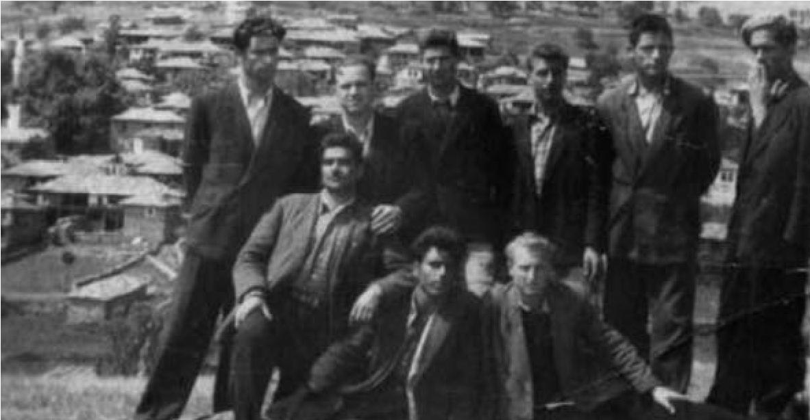
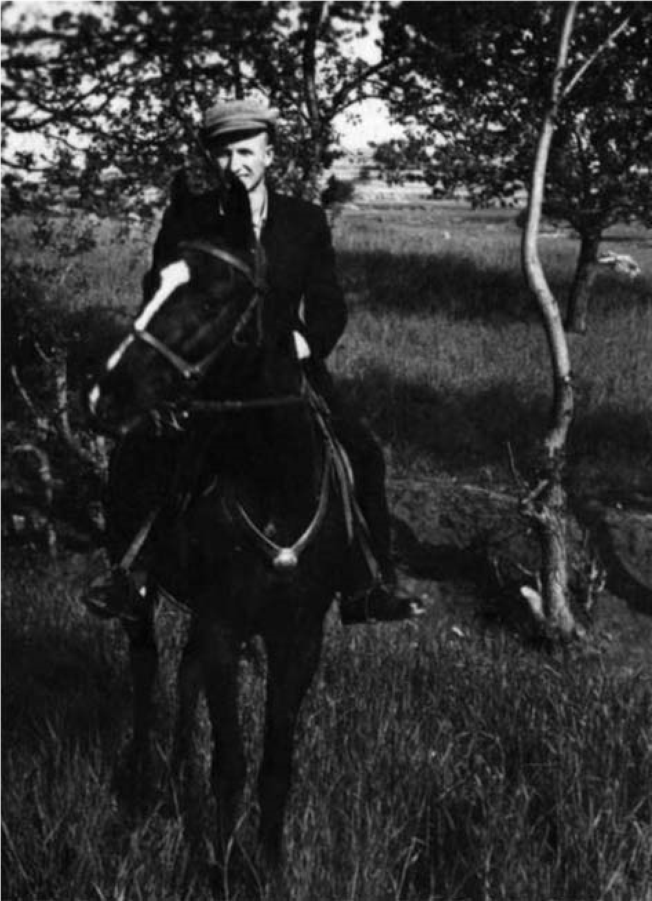
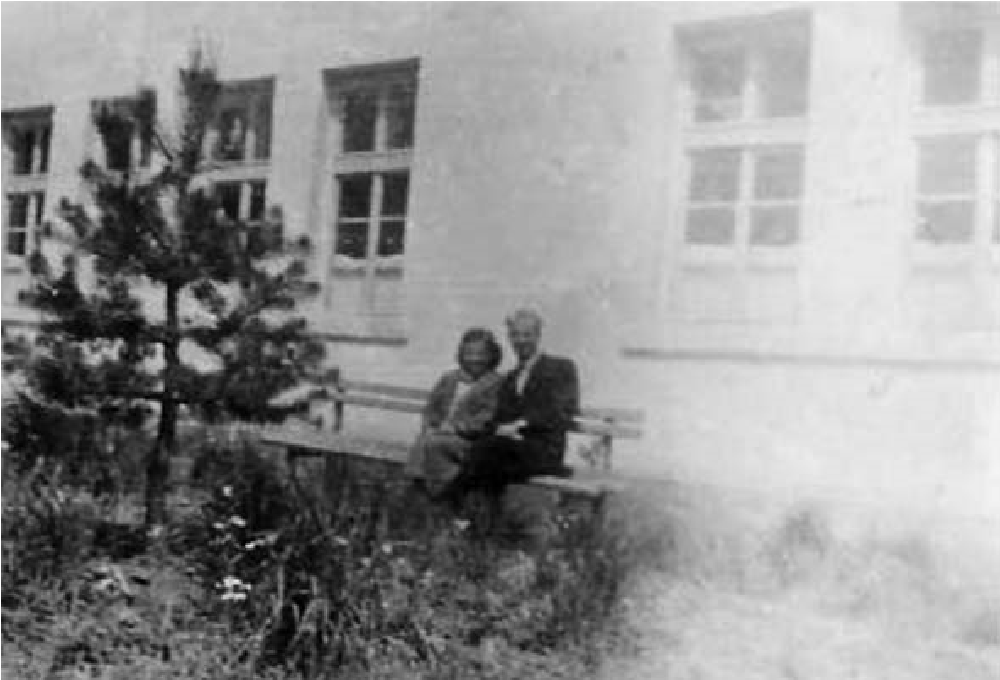

# 10. Учител в родопските села

Въпреки че учебната година беше почти на привършване, неочаквано за мен и
родителите ми на 5 май 1955 г. получих заповед за назначаването ми като
волнонаемен учител в родопското село Вълкосел. Майка ми стегна багажа в голяма
торба, в която имаше шарена черга за постеля, бельо, една чиния, лъжица и
вилица. Рейсът, който тръгна от Неврокоп, ме стовари в с. Абланица, а от там до
Вълкосел се изкачвах по тясна пътека. Пристигнах късно през нощта. Очакваха ме
директорът на училището Иван Панчев и колегата Иван Шиндов, с когото заживяхме
заедно в една от стаите на училището. На следващия ден при мен дойде учителското
семейство Гелемерови, Кипра и Петър, които са били прокудени тук в това далечно
родопско село като „врагове на народната власт“.

Бързо се сприятелих с колегите, които недоумяваха защо ме назначават в края на
учебната година. Знаеше само директорът на училището, който ми издаде документ,
с който вече можех да кандидатствам в полувисшия институт за прогимназиални
учители в Ст. Загора. Такава беше идеята на моя покровител Никола Пашов, който
не можа да се пребори със защитниците на „народната власт“, за да ми се разреши
да кандидатствам в Софийския университет.

Във Вълкосел за първи път се срещнах с изстрадалите родопски хора през годините
на робството, когато им била отнета само религията, а всичко останало си е
българско. Най-голямо впечатление в това село, сгушило се в пазвите на Родопите,
ми направиха чисто българските названия на местностите. Когато някой от колегите
искаше да отидем донякъде на разходка, не се притесняваше да каже:

&minus;Сега искам да се поразходим из местността Свети Георги, откъдето ще видиш и
    гръцките села.

>  *С някои от колегите от Вълкосел на излет до м. „ Свети Георги“/ първият,
>  седнал от дясно /.*

Това беше хубава местност, до която понякога водехме на разходка и учениците.
Село Вълкосел е едно от най-големите села в Западните Родопи и се намира в
т.нар. област Чеч.

Не ми беше лесно през първите дни във Вълкосел. Там има две джамии, едната в
Мишовата, а другата във Вълковата махала. Когато наставаха часовете за молитва,
двамата ходжи започваха да се надпяват. Слушах ги и си мислех за историята на
селото, когато османлиите са населили това хубаво, китно село с вярата за Аллах.
По улиците срещах възрастни мъже и жени, които отначало ме гледаха като
чужденец, но след това ме спираха и питаха:

&minus;А ти, даскале, откъде си ?

&minus;От Либяхово съм. Ей му най-високия баир, Пъзлак, под Алиботуш.

&minus;Значи ти си наше чедо, от нашия край. Добре дошел в нашето село!

Един ден бащата на мой ученик дойде в училище и ме покани на гости. Видя ми се
отворен човек. Вечерта ме чакаше пред джамията. Заедно с жена му ме посрещнаха
като скъп гост. След богатата вечеря, на която имаше и хубава баклава, домакинът
започна да ми разказва историята на селото. Изненадата ми бе голяма, когато го
слушах да разказва увлекателно за двете махали в селото, Мишовата и Вълковата.
Баба Айше се сгуши до нас и допълваше разказваното от сина си.

&minus;Даскале, помня разказа на прабаба ми, която беше на 101 години. В нашето
    село живеели двамата братя Вълко и Мишо, които си разделили двете махали по
    равно. Живеели мирно и спокойно. Имали си хубава черква, на която ходели да
    се молят и от двете махали. Но дошло другото време.

Като каза „другото време“, гласът на баба Айше пресекна, смигна с очи и ме
помоли да ме заведе в съседната стая. Станахме и тръгнахме само двамата. Тя спря
до шарен дървен сандък и ми каза:

&minus;Тук е заспало нашето минало.

Като вдигна капака на сандъка, видях шарени, китни женски дрехи, каквито пазеше
и майка ми.

Баба Айше навлажни очите си и прошепна:

&minus;Не знам на коя от нашите баби са, но са тяхна прикя.

Разглеждах извезените с тънки пръсти шарила по клашника, ихрама и дългите ризи.

&minus;Нови са, каза баба Айше, защото са носени само по големите празници в нашето
    село.

Гледах накитите в украсения дървен сандък и потънах в размисли, които никога
няма да забравя. Представях си баба Айше, облечена в тази премяна. Каква
хубавица може да изглежда с тях.

Когато се върнахме в гостната стая, разказът тръгна пак в посока към
миналото. Но този път го водеше бай Ибраим, синът на баба Айше. Той
разказваше за двамата братя Мишо и Вълко.

&minus;Не е лъжа, а истина, даскале, която ходжите в нашето село не искат да знаят.
    Когато чуждоземците дошли в селото, обградили и двете махали. Мишо и Вълко
    събрали най-смелите мъже и бранели селото. Напънът бил силен. Мишо бил
    заловен и хвърлен в пещ. Изгорели го жив. Писъци на жени и деца се чували от
    неговата махала. Чуждоземците потурчили всички. Вълко направил крепости пред
    своята махала и издържал още няколко години, но и той бил пленен и покорена
    цялата му махала. От тогава селото ни носи неговото име, даскале. Да знаеш!
    И на децата да казваш.

След тази вечер често излизах извън селото, за да оглеждам двете махали, които
са разделени от дълбоко дере. Сядах под сянката на голям дъб и се взирах далеко,
за да прегърна с поглед и четири планини – Родопите, Боздаг, Пирин и Алиботуш. В
тези часове се чувствах честит и потъвах в сладки размисли за моя роден край и
неговото минало.

Когато тръгнах от Вълкосел за конкурсния изпит в Ст. Загора, пътувах заедно с
няколко други кандидати, които носеха препоръки от околийския комитет на БКП в
Неврокоп. Това бяха „деца на партията“. За тях конкурсният изпит беше
формалност. След три дни окачиха резултатите от писмения изпит. Открих себе си
на едно от първите места. Техните имена ги нямаше, но след това, за мое
учудване, бяха заедно с нас на очните занятия.

Още не вярвах, че пътят ми към учителската професия е отворен. Не знам как е
протекъл разговорът между моя покровител НиколаПашов и Васил Урдев, но всичко се
преобърна неочаквано за мен.

След като приключи учебната година, на 20 август 1955 г. бях преназначен за
учител в граничното село Туховище, което се намира на два километра до границата
с Гърция. За голяма изненада след това получих и заповед за директор на
училището. Недоумявах, до вчера не ми даваха да продължа образованието, а сега
вече бях директор на училище. Не ми беше лесно, защото заварих разбит учителски
колектив, в който е имало скандали между обособилите се враждуващи групи.
Техните водачи бяха комунисти които се карали кой да води колектива. Помислих,
че някои очакваха да се проваля, за да останат доволни недоброжелателите ми. За
кратко време обаче животът в учителския колектив изцяло се промени. Събирахме се
често заедно с някои от колегите в съседните села Годешово и Слащен. Прекарвахме
празничните дни при взаимни гостувания.

Училищната сграда в село Туховище беше строена отдавна от местното население.
Знаех откъде най-много скърца, защото живеех в нея. Затова се реших на нещо,
което предишните директори не смееха да направят. Вместо да се извърши основен
ремонт, за какъвто ни бяха отпуснати средства, заедно с пълномощника на селото
се споразумяхме да се построи нова сграда. Преместихме учениците в
пълномощничеството, където превзехме всички стаи.

Когато майсторите събаряха грохналата стара сграда на училището, ги помолих да
пазят гроба на първия учител Никола Маринов, който се намираше в двора под голям
орех. Един ден заедно с учениците и учителите почистихме гроба и оттогава на
това място винаги се поставяха цветя.

След събарянето на старата училищна сграда се вдигна голям шум. Бях извикан при
Васил Урдев в околийския съвет, за да отговарям за решението ми да съборя
старата сграда на училището.Този път обаче Урдев ме посрещна не така, както
някога.

&minus;Ние не те приемахме за учител, а ти като директор се оказа по-смел и от нас.
    Защо събори училищната сграда ? – ме попита Урдев.

&minus;За да спася учениците и учителите от най-страшното, което ги грозеше всеки
    ден. Покривът се бе надвесил над главите им, а стените бяха разцепени,
    готови да се срутят. Аз живея в директорската стая и всяка вечер слушам
    скърцането на покрива и стените.

Като казах защо се реших да започне строителството на нова училищна сграда,
Урдев се вторачи в мен и каза:

&minus;Атанасе, ти наистина си роден само за учител. Не мога да си простя, че преди
    една година те посрещнах като враг в кабинета си. Инспекторът Пашов беше
    прав. Хубаво, че се застъпи така ревностно за теб. Чувам и други хубави
    неща. Няма ги кавгите във вашето училище, учениците идват редовно на учебни
    занятия. Похвалиха ми се от теб училищните инспектори Иван Керезиев и
    Костадин Папанов. Преди в Туховище имаше и неприбрани деца, а сега сами са
    се върнали, защото сте променили учебния процес, направили сте го
    привлекателен за тях. Този път не само Пашов, но и аз заставам зад теб. В
    градската библиотека прочетох хубави неща за Зимбилевия род, от който са ти
    корените. Прадядовците ти са били изтъкнати просветни дейци и революционери.
    Защо не ми каза за тях, когато те гледах с други очи, като наш враг ?

На този въпрос отговор не дадох, защото сърцето ме болеше, когато комунистите ме
наричаха „враг на народа“. В досието ми не забравяха да пишат, че съм „вражески
настроен“.

Този път Урдев стана от бюрото си и вежливо ме изпрати като не забрави да ми
каже, че ако срещна трудности, да му се обадя.

През април 1956 година и в далечното родопско село Туховище отекнаха новините,
свързани с проведения Априлски пленум на ЦК на БКП, на който по указание на
Никита Хрушчов партийният и държавен глава Вълко Червенков беше заменен с Тодор
Живков. Започна осъществяването на т.нар. Априлска линия на комунистическата
партия.

В Туховище получих закалката си не само като учител, но и като лич-
ност с обществено призвание. Тогава продължаваше тероризирането на местното
население. Спомням си, че една нощ бяха затворили в една от стаите на
пълномощничеството „непокорните“. Пазеше ги Офето (така наричаха един от
активистите на Отечествения фронт). Жената на един от затворените дойде и ме
помоли да помогна за освобождаването на мъжа ѝ, който бил болен.

Отидох при Офето и му казах да отвори вратата. Той не ме послуша и се закани, че
ще ме предаде на Сотир Сораджиев, който беше отговорникът от Държавна сигурност
за този район. Не се уплаших от заканата. Разбих вратата и освободих
непокорните, някои от които започнаха да ми целуват ръка.

На следващия ден Сораджията дойде в Туховище откъм Марулево и поръчал на
прислужника на училището Хасан да отида при него.Той обаче ме изпревари и дойде
в канцеларията ми. Още щом отвори вратата с треперящ глас ме попита:

&minus;Защо си направил това? Знаеш ли, че не само моята, но и твоята служба ще
    изгори.

&minus;Нека изгори службата ми, Сотире. Само хорицата да не изгорят живи. Защо ги
    карате насила да се наричат македонци. Така вие горите българските им
    корени, които някога турците не са успели да изгорят.

Тези думи промениха лицето на Сораджията. Той ме погледна, огледа се да не би
онези, които вървяха след него, да ни слушат, и тихо ми прошумоли:

&minus;Даскале, между нас да си остане. И аз мисля като тебе. Но какво да правя
    като такава е заповедта на моите началници. Вече разбирам, че тръгнахме през
    просото. А докъде ще стигнем, не знам.

След няколко години Сотир Сораджиев ми призна, че е трябвало да знае всичко за
мен, затова вербувал двама души, един от които мой колега, който беше член на
комунистическата партия. Но това, което съм му казал за македонизирането,
споделил с баща си, а той му отвърнал:

&minus;Не посягайте към това момче. Помня дядо му. Той помиряваше
    българомохамеданите. Някои от тях тръгнаха след него и създадоха български
    чети, а вие сега ги разчеквате. Старите хора от Абланица обичаха войводата
    Атанас Попов. Той идваше и в нашето село, за да да пази българщината, а вие
    сега преследвате внука му. Свали ръцете си от него, Сотире!

Когато тръгнах на очните ми занятия в учителския институт в Ст. Загора, оставих
колежката Божана Мудева да ме замества. Поръчах ѝ да не се включва в акцията за
македонизирането на мохамеданите в селото. Но хората от службите на Държавна
сигурност я изнудили да им помага. Отишли в къщата на ходжата, който живееше до
училището, и го заплашвали, че трябва да промени народността си, той не се
стърпял и посрещнал неканените гости със стар калъч, който пазел на потайно
място за отбрана. Божана се уплашила и побягнала. Отказала се да участвува в
поредното македонизиране на тези хора, които познават само българския език.
Запазили са едни от най-старите думи като „мисер“, „кликам“ и много други.
Тачеха ревностно и старите български обичаи.

Щом се върнах от очни занятия, Божана ми разказа всичко, което се беше случило.
Каза ми, че хората ме търсили, за да им помогна. Не скри, че капитан Илиев от
военното разузнаване, който беше в комендатурата на Гранични войски в с. Слащен,
я ухажвал и заплашвал, ако не помогне за „вразумяването“ на „помаците“, както
той наричаше тукашните хора. Тази дума я нямаше в моя речник, защото младите от
селото я приемаха като обидна и им причиняваше страдание. Мъничък на ръст,
разведчикът Илиев яздеше едър кон, от който гледаше високомерно и плашеше с
поглед всеки, който не прави това, което той искаше. Веднъж се опита и мене да
сплаши като ми намекна, че копие от моето досие има и при него. Не се страхувах
вече от лошите неща, които ми причиняваха такива като него, защото разбрах, че
те ще ме придружават докато комунистите са на власт.

След тази неприятна среща с капитан Илиев се гледахме винаги накриво. Един от
офицерите в граничното поделение, което се намираше на горния край на селото, ми
довери, че пийнал до козирката, „черният капитан“ се заканил да ми види
сметката. Не се страхувах, защото той имаше немалко врагове и сред колегите си,
на които беше причинил безброй неприятности. Обикновените хора в селото го
наричаха “плашилото“. Когато граничарите и техните помощници, все хора на
капитан Илиев, залавяха някой „диверсант“ (така наричаха онези, които се
решаваха да преминат границата и емигрират в Гърция), ги водеха завързани към
щаба в Слащен, където някои не оцеляваха. Други пък още на границата бяха
разстрелвани.

Една късна вечер се почука силно на външната врата на училището. Канцеларията ми
беше на втория етаж. Събудих се. Началникът на заставата майор Миндов, който бе
съпруг на една от колежките в нашето училище, ме помоли да им помогна. Няколко
семейства бяха натоварили багажа си и се запътили към границата. Решили да
емигрират.

&minus;Теб те обичат и ще те послушат . Ела с нас !

Нямало как граничарите да се справят с тези семейства, защото заплашвали да се
отбраняват, заедно с децата си. Когато стигнахме близо до Годешово, Миндов се
провикна:

&minus;Директорът на училището иска да ви каже нещо.

Миндов ме освети с газов фенер, за да се уверят, че съм дошъл заради тях.
Помолих ги да се върнат като обещах, че повече няма да ги тормозят за вярата и
имената, които носят. За моя радост те върнаха мулетата и магаретата и
сеструпаха около мен. С тях серазбирах много добре. Взаимно се уважавахме.

Учителският колектив в Туховище спечели уважението не само на учениците, но и на
местното население. Най-осезателно се почувства това, когато моите колеги
започнаха да свързват класноурочната си работа с извънучилищни дейности.
Условията за това бяха повече от благоприятни. Спомням си, че на едно от
заседанията на педагогическия колектив предложих да се проведат специални
родителски срещи, на които да се поиска помощта на майките, бащите, бабите и
дядовците за проучване особеностите на говора в селото, на неговите обичаи, на
топонимията му. Създаде се необикновен интерес към тази дейност. Дадоха се
предложения да се създаде специална консултантска група от по-будните познавачи
в тези области от живота на селото. Учителите планираха специални форми за
възпитание, в които учениците бяха основните организатори. Те се надпреварваха
при тяхното привлекателно реализиране.

Един ден в канцеларията ми влезе момиче, което се отличаваше от другите. То бе
по-едро, облечено като девойка, която е кандидатка за женитба. След нея влезе
баща ѝ, който беше един от ходжите в селото. Момичето започна да ми обяснява как
напуснала училището, защото не ѝ било интересно в него. Бащата продължи да се
извинява вместо дъщеря си. Помолиха ме да запиша Джамиле в класа, който беше
прекъснала. Увлякла се и помагала на някои от учениците в тяхната махала, които
проучвали обичаите и песните. Това беше последната ученичка, която не беше
прибрана в училище. Нейните съученици я наричаха „майката“ на класа не само
заради това, че беше по-голяма от тях, но повече заради усилията, с които
бързаше да навакса усвояването на учебното съдържание по всички дисциплини.
Джамиле започна да изпреварва другите и помагаше на изоставащите.

>   *Пред старата сграда на училището в Туховище с учениците от седми клас и
>   прислужника Асан*

Туховище е в пазвите на Родопите. То е далеко, много далеко от родното ми село
Илинден, което пък е полегнало под връх Пъзлак до Алиботуш. Но мислите ми бягаха
винаги към него. Там оставих момичето, което обичах още от ученическите си
години, дъщерята на шивача Илия Пашов. Тя беше учителка по математика. Още от
гимназията се отличаваше като най-добрата по тази учебна дисциплина.

Като подразбрал, че ухажвам дъщеря му, бащата на моята избраница ѝ подхвърлил:

– Мария, Наско е добро момче и има хубаво бъдеще, носи дарбите на дядовците си.
Комунистите не го обичат, но те няма да векуват. Омъжи се за него. Ще се радвам
много на брака ви.

Чичо Илия още не знаеше,че ние с дъщеря му вече бяхме решили да зарадваме него и
майка ми, която пък обичаше много бъдещата ми жена.

През есента на 1956 г. с учителката Мария Пашова създадохме нашето учителско
семейство. След женитбата ми пътувах често през почивните дни от Туховище до
Илинден. Прекосявах баирите през селата Слащен, Беслен, Теплен и Петрелик, за да
стигна до семейното ми огнище. Често пътуването беше много рисковано. Веднъж
едва не ме повлякоха буйните води на Места. Преминах я по две въжета, едното за
ръцете, а другото за краката. Друг път паднах от моста над р. Мътница при с.
Петрелик. Тичешком извървях десетина километра, защото бях мокър. Когато стигнах
в село, дрехите ми бяха вече изсъхнали.

В един зимен ден снегът, навалял през нощта, не ме спря, за да тръгна към
Туховище. Към местността Длъга Мара се разминах с глутница вълци. А през
пролетта между Беслен и Теплен пред нас с пощенския куриер се изпречи мечка,
която ни изгледа връждебно, но си тръгна по своя път. Близо до Беслен има
припек, през който минаваше пътеката за Теплен. През пролетта и лятото на нея се
излежаваха и препичаха какви ли не змии. Трябваше на пръсти да минавам, за да не
ги разсърдя. И с тях сякаш се сприятелихме, затова оцелявах ненападнат.

Често, когато трябваше да ходя на съвещания или конференции в околийския град,
пътят ми минаваше през с. Сатовча, от където шофьори на товарни камиони се
смиляваха и ни превозваха до Неврокоп. А на връщане от Сатовча граничарите,
които бяха довели своите офицери с коне, отстъпваха някой свободен кон и за мен.
С тях преминавахме покрай селата Жижево и Фъргово, изкачвахме по стръмните
пътеки на Погорник и след това по нанадолнището бързо пристигахме в Туховище.

>   *На път от Сатовча за Туховище*

Какво ли не видях и преживях през двете ми учителски години в с. Туховище.
Подлъгаха ме, че ще ме вземат в казармата. Напуснах училището за няколко дни, но
след това се оказа, че не ме искат да служа в „народната армия“. Върнах се
отново, но подадох молба да бъда преместен през следващата учебна година
по-близо до жена ми. От околийския народен съвет ме помолиха да остана още
една-две години. Похвалиха ме, че не само съм променил климата в учителския
колектив, но и съм подобрил учебния процес. Започна и изграждането на новото
училище в селото, което скоро щеше да издигне снага.

Когато научиха колегите ми, че ще се разделяме, ми подготвиха изпращане, на
което присъстваха и офицерите от граничното поделение, които осигуряваха хляба,
който бях уредил да купуваме от тях. Беше незабравима вечер. Някои ми посветиха
стихове, а други изпяха любимите ми песни, с които правехме вълнуващо нашето
ежедневие. На другата сутрин баща ми дойде с мулето на дядо Велик. Натоварихме
багажа ми и казахме сбогом на Туховище.

Събрахме се заедно с жена ми, но нямах още ново назначение. Последните две
години бяха неспокойни. След унгарските събития закриха учителския институт в
Ст. Загора и ни преместиха в Бургас, където завърших полувисшето си образование.

Като дипломиран прогимназиален учител по български език и литература очаквах да
ме назначат по-близо до жена ми, която продължаваше да учителства в родното ми
село Либяхово. Толкова много ми се искаше да уча децата в него, но
новоназначеният кмет Манол Джагълов, син на убиеца на вуйчо ми Борис, не даваше
и дума да се обели да бъда учител в родното ми село.

>   *Често пъти отивах да посрещна жена ми, която се връщаше от училище. Мечтаех
>   и аз да бъда нейн колега, но като „враг на народната власт“ можех само да
>   мечтая да бъда учител в родното ми село, където дедите и прадедите ми са
>   отдали всичко за него*

Така беше през годините на комунистическия режим. Потомците на видни български
фамили бяха недолюбвани в родните им села и градове. Повечето от нас ни наричаха
„фашисти“. Спомням си, че когато големият български артист Кръстьо Сарафов дойде
в родното си село, за да му се нарадва, комунистите не го посрещнаха като наша
национална гордост в театъра, защото бил „фашист“. А името на брат му Борис
Сарафов на техните митинги се споменаваше, заедно с името на дядо ми, като враг
на „народната власт“.

