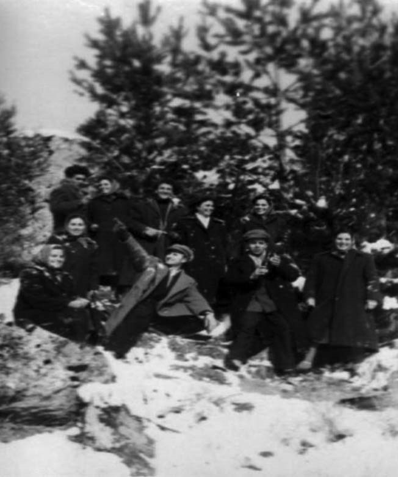

# 11. Учител в пиринското село Тешово

През учебната 1957/1958 година бях назначен за учител по български език и
литература в с. Тешово, което е полегнало между красивия връх Моторок на Пирин и
още по-красивия на Алиботуш – Гоцев връх. Не остана пътека в Родопския и
Пиринския край, която да не познавам.

Тешово беше голямо село, известно със своите революционни традиции. Тук доскоро
се беше укривал Дафков, последният въоръжен противник на „народната власт“ в
Пиринския край. И в това село хората бяха разделени на „наши“ и „чужди“. Затова
в него Държавна сигурност беше изпратила едни от най-страшните свои служители
Рашков и Маджиров, които плашеха враговете на „народната власт“с кръвясалите си
очи и мечешки лапи. Техният началник Костадин Кюлюмов от съседното село
Гайтаниново беше вече известен като убиец на немалко от онези, които първи
надигнаха глава срещу комунистическата власт.

Злодеят Кюлюмов се прослави като един от най-страшните убийци на „враговете на
народната власт „ в целия Неврокопския край. Той беше известен с това, че е
танцувал върху гробовете на разстреляните, за да се подравни пръстта.

Помня, когато Катя, наричана „Лудата“, дойде от Гайтаниниво в нашето село и
разказваше на всички как Кюлюмов разстрелял Борис Григоров и след това покрил
трупа му с камъни. Това научих и от сина му Григор, с когото бяхме приятели.
Костадин Кюлюмов участваше активно в преследването и разгромяването на горяните
в Пиринския край. Тук, в Тешово, научих подробности как е подготвил и извършил
убийството на Герасим Тодоров и десетки други „врагове“ на комунистическата
власт от горянското движение.

Никога няма да забравя, когато през една късна нощ Кюлюмов ме притисна в една от
тесните улици на Тешово и с кръвясали очи ми каза:

&minus;Ей, фашяга, спри да говориш против партията, защото като те хвана за гушата,
    ще си останеш тук и няма кой да те прибере.

Този път ми се размина, но след няколко дни на друга от тесните улици на Тешово,
близо до селската кръчма, пред мен се изпречи Рашков. Бях само слушал за него.
За първи път се срещнаха погледите ни. Изгледа ме заплашително и просъска:

&minus;Зная кой си, чий си. И внимавай. Отваряй си очите, когато решиш да правиш
    нещо. Ако не знаеш кой е Рашков, попитай потрошените от мен.

Гледах го и недоумявах за какво ме предупреждава този човек, който и той като
Кюлюмов беше наплашил хората от всички околни села. Отминах го и тръгнах към
Хрисимови, където се бях настанил на квартира.

Хазаинът ме покани у тях на вечера. Споделих с него кого съм срещнал, а той не
скри, че Кюлюмов, Рашков и Маджиров вече са разговарели с него и му поставили
задачата да ме следи къде ходя, с кого се събирам и какво правя. Хазаинът се
усмихна и сякаш искаше да ме успокои като ме увери, че „уше“ на двамата
побойници няма да стане.

След тези срещи с двамата червени екзакутори повече не излизах през вечерните
часове по тесните улици на Тешово. Вече и през деня не се откъсвах от колегите,
с които винаги излизах заедно.

След няколко дни директорът на училището Никола Пелтеков, който беше и партиен
секретар в селото, поиска да се видим „насаме“. Посрещна ме любезно в
директорската канцелария, почерпи ме с бонбони и попита дали ми харесва
учителския колектив. Не скрих, че колегите ме посрещнаха на тяхна гощавка и си
допаднахме много по време на разговорите. Бяха все добри учители, които обичаха
работата си и учениците. Най-бързо се сприятелихме с Аспарух Терзиев, жена му
Катерина и Тодор Богатинов, който беше директор на училището. Местните учители
започнаха да ме канят на гости. Като споделях с Пелтеков добрите си впечатления
от колегите, в един момент той протегна ръката си, опря се на рамото ми и каза,
че и те ме приели много радушно. Научил, че учениците бързо се привързали към
мен. Но след това ме погледна право в очите и допълни:

&minus;Само едно ме притеснява, колега Попов.

&minus;Какво ? – попитах директора.

&minus;Може би знаеш, че нас всички ни наблюдават, защото партията иска народната
    власт да бъде спокойна. Вчера при мене бяха хора от Държавна сигурност и ми
    казаха, че вашият кмет от Илинден ги информирал подробно за миналото на
    вашия род. Казал им, че си от фашистко семейство. И нещо друго. Ходил си на
    гости у Панайотови в нашето село. Може би не знаеш, но те бяха помагачите на
    бандата на Дафков.

Наистина бях на гости у Панайотови. Като научили, че съм назначен за учител в
тяхното село, някои от оцелелите все още съратници на дядо ми поискаха да се
видим. Те го знаеха като пунктовия войвода. Когато бях у Панайтови, един от
мъжете се разплака, прегърна ме и каза:

&minus;Господи, войводата е жив, щом му носи името това будно момче.

След като чух това, което ми рече директорът Никола Пелтеков, на свой ред се
обърнах към него и му казах:

&minus;Никой от моя род не е бил фашист. Всички са родолюбци. Такъв съм и аз.
    Такива искам да бъдат и учениците ми. Ако ме приемате като такъв, ще остана
    при вас. Ако смятате, че съм „фашист“, да се разделим още отсега.

Директорът Пелтеков стана, доближи се до мен и ме увери, че няма да позволи
хората от Държавна сигурност да ме тровят и да ме притесняват в учителската
ми работа.

Това беше първият и последен разговор насаме с Никола Пелтеков. И аз, и той го
забравихме, защото захласнати в учителската ни работа, нямахме време, нито пък
желание да го повторим.

Занизаха се незабравими дни, прекарани заедно с моите колеги от Тешово. Понякога
излизахме заедно на поход из дебрите на Пирин планина. В празнични дни на нашите
тържества често идваше старият учител Караджов. Винаги сядаше до мен и
разговаряхме като много близки колеги. На една от нашите срещи той ме прегърна и
каза :

&minus;Насе, от всички колеги най-много уважавам теб.

&minus;Защо ?

Побързах да го попитам.

&minus;Защото си от Попово коляно. Прадядо ти свещеник Стоян Зимбилев е бил
    най-добрият божи служител в Неврокопския край. Зная всичко за него. Проклет
    да е и на онзи свят Иван Куюмджиев, който го е разстрелял по време на
    молитва! В книжата на нашата църква на няколко места е вписано неговото име.
    Ти знаеш, че аз съм религиозен и се моля винаги в църквата за доброто на
    всички християни. Затова тукашните комунисти не ме обичат. А някои от тях,
    които са най-близки на безбожника Рашков, ме заплашват, че ще ме изселят. За
    дядо ти Атанас като пунктов войвода ми разказваха хубави, незабравими
    спомени неговите съратници от нашето село, които често се събират у
    Панайотови .

Ей, затова когато идвам в училището, където прекарах най-хубавите си години, се
отбивам при теб. Ти не ми се сърдиш, нали?

&minus;Учителю, колега! И аз затова те уважавам много. Защото не се страхуваш да
    браниш през тези тежки години божията вяра. Комунистите извършват в наши дни
    най-голямото престъпление срещу младото поколение. Направиха от повечето
    учители безбожници, които насаждат атеизма у децата.

Тези мои думи напълниха със сълзи очите на учителя Караджов, който ме хвана под
ръка и тръгнахме към Хрисимови, където бях на квартира.

>   *С колегите в Тешово под връх Моторок*
>   *(в средата, с протегната ръка към небето над Пирин)*

През първите дни на 1958 година, след създаването на ТКЗС в полските райони,
започна ускорено коопериране на земята и в планинските села. Почти всеки ден в
Тешово идваха някои от ръководителите на Околийския комитет на БКП, които
привикваха т.нар. „народни врагове“ да разговарят с тях и да ги заплашват да не
пречат за създаването на ТКЗС в тяхното село. Същите тези създатели на
„българските колхози“ виждах и в моето родно село Либяхово, когато през
почивните дни отивах там, за да видя едногодишния си син и майка му. Една вечер
разсилният на общината извика и баща ми да отиде при „големците“, които бяха
дошли от града. Татко ме погледна в очите и ми каза:

&minus;Насе, комунистите унищожиха скотовъдството, а сега искат да опустее и
    земеделието. А те, скотовъдството и земеделието в нашето село от памти века
    са неразделни, не могат да виреят едно без друго. Земята храни животните, а
    животните я торят, за да ражда богато.

Когато се върна вкъщи, баща ми каза, че били „привикани“ пак „опасните“, от
които комунистите се страхуваха. Предупредили ги, че ако пречат за създаването
на ТКЗС в нашето село, ще ги изселят. Заплашили баща ми, че могат да ни уволнят
заедно с жена ми като учители. Като чу това, майка се разплака и каза:

&minus;Тогава какво ще правим, Кръстьо? Ще ни вземат, и без да им я даваме, земята,
    и ще ни прокудят от родното село.

Татко казал на партийните „другари“, че това е лудост в планинските села да се
създава ТКЗС. Те го изгледали кръвнишки и му напомнили за недовършената от тях
работа с него на 10 септември 1944 година, когато беше жестоко пребит пак тук, в
общината, но долу, в мазето.

След около един месец, на 19 февруари 1958 г., точно в деня от обесването на
Васил Левски, в моето родно село на специално подготвено общоселско събрание,
при присъствието на партийни ръководители от Околийския комитет на БКП, се
създава ТКЗС, в което влизат 254 семейства. Извън него остават 20
семейства,наречени от комунистите „кулаци“ и „фашисти“. Нашето беше едно от тях,
но след непоносими заплахи баща ми и майка ми кандисаха и те да станат
„текезесари“.

Още от първите години създателите на ТКЗС изсякоха всички отдавна посадени
орехи, круши и сливи по полето и къра. Запустяха и лозята, които някога, когато
дядо ми е бил кмет на селото, са били засадени. Не се чуваха вече и някогашните
звънци на стадата и кавалите на овчарите. Отнети бяха големите стада от овце и
кози от техните стопани, както и всичкия работен добитък, волове, крави, коне,
мулета и магарета и прехвърлени в специално създадени животновъдни ферми.  

