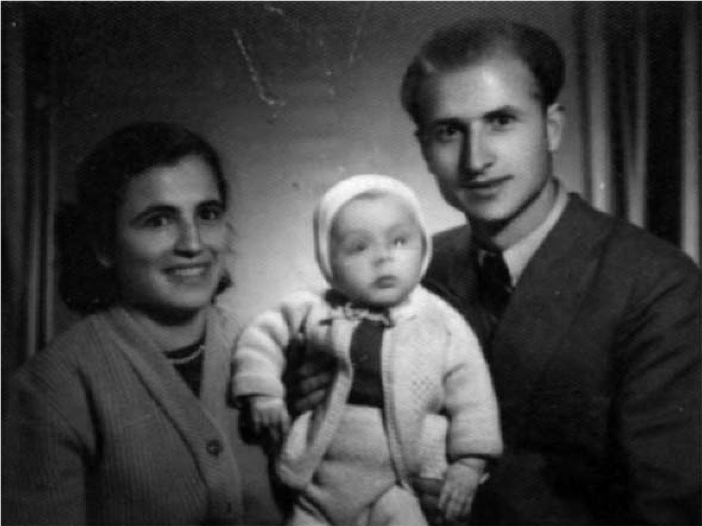
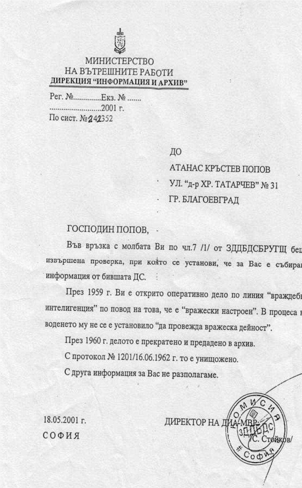

# 12. В Тешово като учител ми бе открито оператвно дело по линия „враждебна интелигенция“

След създаването на ТКЗС и в Тешово, няколко пъти жена ми, заедно с първородния
ми син Красимир, който беше само на една година, идваше в Тешово, където
прекарвахме някои от празниците в селото. Неусетно учебната година завърши.
Вместо да бъда вече преназначен като дипломиран учител, бях освободен и изпратен
в родопското село Годешово. Казаха ми, че преместването ми е било работа на
Кюлюмов и Рашков, които се страхували от моето присъствие в разбуненото от
Дафков село Тешово, в което настроението на много хора към „народната власт“
беше вече опасно.

>   *Когато бяхме тримата заедно, се чувствахме щастливи, но Държавна сигурност
>   стопяваше радостта ни, когато ни разделяше*

Трябваше пак да се върна близо до Туховище, но този път съвсем до самата
граница. Не приех назначението ми в Годешово. Вестих се там само да уведомя
директора, че не мога да оставя сама жена ми с малкия Красимир, когото обичахме
силно като първородно дете. Три месеца бях без работа. За 10 дни замествах
учителка в с. Баничан.

На 13 януари 1959 г. бях назначен отново в Тешово. И двамата с жена ми се
зарадвахме, че ще бъдем наблизо един до друг. Казаха ми, че мои колеги и
родители изпратили писмо до Окръжния отдел на Народна просвета, които поискали
връщането ми като учител в селото.

Не знаех обаче, че Държавна сигурност е планирала нещо друго, за да бъда
отдалечен още повече от жена ми. През времето, което прекарах отново в Тешово, е
била допълнително събирана за мен информация от Държавна сигурност и открито
оперативно дело по линия „враждебна интелигенция“ по повод на това, че съм бил
„вражески настроен“.

>   *Факсимиле на писмо, изпратено от Министерството на вътрешните работи по
>   сист. № 242352 от 2001 година*

