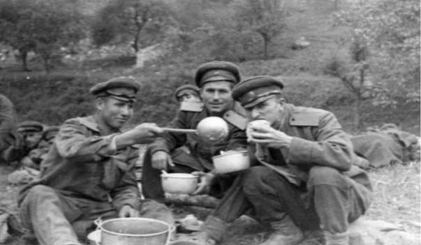
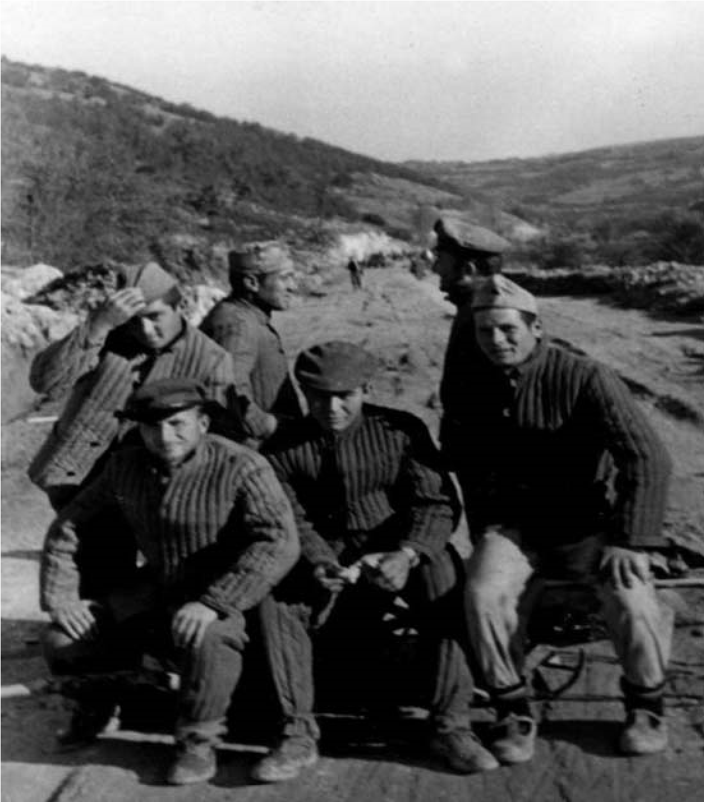

# 13. А ние бяхме в Люти дол

През 1959 година комунистите в България откриха най-зловещите лагери за
„враговете на народната власт“. Доносниците на Държавна сигурност се умножиха,
за да се открият всички онези, които бяха опасни за укрепването на политиката на
комунистическата партия при изграждането на социализма. Някои от тях си бяха
свършили работата и за мен. Все още не зная точно кои са изпълнили личното ми
дело с доноси за моята „вражеска“ дейност. Не бях отбил военната си служба.
Всяка година наборняците подготвяха своите празнични вечери преди заминаването
им в казармата. Включваха и мен, но повиквателна заповед не получавах.
Отсрочваха ме по неизвестни за мене причини. Стана ми ясно обаче, че комунистите
както се страхуваха от приемането ми в университет, още повече ги беше страх от
постъпването ми в тяхната „народна“ казарма. Бях опасен навсякъде за тях.

Един ден се реших да попитам заместник-началника на военното окръжие в Неврокоп
полковник Никола Донков защо не ме приемат поне в Трудова повинност, за да отбия
най-после военната си служба. Той ме изгледа подозрително и попита:

&minus;А ти не знаеш ли защо?

Каза ми да почакам и влезе в стаята, където бяха документите на донаборниците.
Когато излезе, погледът му беше мрачен.

&minus;Колега, защо не ми каза, че си внук на войводата Атанас Попов. Аз бях учител
    във вашето село и квартирувах у вас. Но не мога да ти помогна, защото си
    лошо белязан, заради дядо ти. Прочетох характеристиката. Пише, че си от
    фашистко семейство и отношението ти към народната власт е отрицателно. Не
    мога да те пратя нито във военно поделение, нито в Трудова повинност, защото
    си в друг, опасен списък. Вярвам, че това, което ти казвам, ще запазиш само
    за себе си.

&minus;Какво ще ни правите тези, които сме в „опасния“ списък? – попитах Донков.

&minus;И аз не зная, но опитай да ти направят нова характеристика от общината във
    вашето село. Макар че познавам добре Манол Джегълов, който е натопил не само
    теб. Но, ако има малко акъл, няма да те изпраща там, където не се знае какво
    може да се случи с теб.

Вечерта се прибрах в село и споделих с жена ми това, което ми каза полковник
Донков. Тя преживяваше понякога още по-болезнено от мен това, което ми
причиняваха комунистите. Без да зная, споделила с баща си това, което ѝ казах.
Дядо Илия отишъл при Манол и му рекъл право в очите:

&minus;А бре Маноле, ти искаш дъщеря ми да остане вдовица ли?

&minus;Защо, бай Илия – отвърнал Манол.

&minus;Какво си написал за моя зет? Как можа да го очерниш толкова много.

&minus;Не съм аз, бай Илия. Сигурно Витан е направил това – отговорил Манол.

Витан Кемилев беше партийният секретар на селото. При него и Манол често бяха
идвали Кюлюмов и Рашков от Държавна сигурност.

По настояване на жена ми отидох в общината, за да получа „новата“ характеристика
от Манол Джегълов. От същия, който беше подписал и предишната. Чаках повече от
два часа. Полуграмотният пълномощник на съвета чукаше на машината като първолак,
който срича и пише. Най-после се показа, подаде ми бял плик, който беше целият
покрит с червен восък и каза:

&minus;Написах най-хубавите думи за теб, даскале. Скрих, че си от фашистко
    семейство. Полковник Донков трябва да те изпрати във военно поделение, а не
    в Трудова повинност и на друго по-опасно място.

Не исках да повярвам на Манол, защото негови близки ми бяха казали, че ако се
наложи и на децата си да направи характеристика, и тях ще „наклепа“. Но и този
път послушах жена ми. Отидох при полковник Донков и му подадох писмото на Манол.
Той се учуди, че Манол е дал писмото в ръцете ми, за да му го донеса лично.

&minus;Почакай ! Ако тази характеристика е добра, ще „забравим“ другата. И ще мога
    да те спася.

Седнах пред кабинета на Донков. След около петнадесет минути той се показа и
втренчи очите си в моите.

&minus;Не го е срам. Това, което е написал Манол, е още по-страшно от това, което
    имаме. Не мога да ти помогна, но ще кажа нещо, което не бива да забравяш.
    След две седмици ще получиш повикателна заповед. Но не за армията или
    Трудова повинност, а за друго място, където няма да ти бъде лесно. За да
    оцелееш, ще трябва да мълчиш, а това, което ще видиш и преживееш, е само за
    мъжка издържливост.

Не се уплаших от това, което ми каза полковник Донков. Но недоумявах за неговото
състрадание към това, което ми предстоеше да преживея и откровеността в
разговора ни.

&minus;Не мога да забравя това, което научих за вашия род, когато бях учител във
    вашето училище. Та аз бях на квартира у вас. Живеех в стаята на войводата.
    Не разбирам откъде извира омразата на управниците към най-будните хора,
    каквито са били твоите дядовци. А сега и към теб. Пази се!

Не след две, както ми каза Донков, а след една седмица получих повиквателна
заповед, в която бе упоменато само мястото, където трябваше да се явя в град
Неврокоп. Когато напуснах Тешово, колегите недоумяваха, че ме викат да
отбивам „военната“ си служба по никое време, през месец април. Брат ми Стоян
дойде да пренесем багажа ми. Помогнаха ми колегите Аспарух Терзиев и Георги
Стоянов.

> *Така се премествах от село на село като учител. Колегите Георги Стоянов и
> Аспарух Терзиев, заедно с брат ми Стоян, натовариха багажа ми от с.Тешово,
> когато Държавна сигурност ме изпращаше в лагера в с. Люти Дол, Врачанско*

Директорът на училището Тодор Богатинов ме попита:

&minus;Къде те изпращат да служиш? Нали през пролетта не вземат набор в казармата.
    А тези за Трудова повинност ги вече прибраха преди един месец. Сигурно ще
    бъдеш в някои „специални“ части.

Само баща ми и брат ми Стоян знаеха какво ме очакваше. Те бяха мълчаливи, затова
се доверих на тях. На майка и жена ми казах, че отивам в казармата.

На 20 април 1959 година с камиони, покрити с брезентови платнища, ни извозиха от
Гоце Делчев до село Добринище. Там ни натовариха като подгонено стадо в
мотрисата, която беше стоварена на гарата. В специално подготвените купета ни
чакаха няколко офицери и цивилни, които ни оглеждаха подозрително. Офицерът в
нашето купе седна до мен и не се откъсна до пристигането ни на гара Мездра. След
като си пийна малко повечко, се разприказва „поверително“.

&minus;Учителю, не мога да разбера как си попаднал сред тази сган от фашистки
    копелета. Кой те насоли пред нашите хора?

&minus;Такива като теб, които и на мен казват, че съм“фашист“.

Офицерът се намръщи, погледна ме със свити очи и каза:

&minus;Аз съм друг човек, не съм от тези, които те изпращат на заколение. Докараха
    ме при вас след едно наказание, заради женска история. Сигурно няма да
    остана дълго, защото като ви гледам, не знам дали ще мога и аз да изтрая
    страданията, които ще изживеете.

Повярвах за наказанието на офицера, който започна да ми се изповядва, защото
беше висок, красив и сигурно е покорявал немалко женски сърца. Попитах го:

&minus;Защо наричаш „фашисти“ тези, с които и аз отивам на заколение?

&minus;Защото всички сте синчета или внуци на враговете на народната власт- беше
    неговият отговор.

&minus;Какви врагове са циганчетата и тези момчета, които наричаш помаци?

Двата въпроса, които зададох, учудиха офицера, който вече беше напълно превзет
от алкохола. За да ме увери, че е прав, започна да обяснява, че циганчетата и
помачетата са деца на непокорни на „народната власт“ цигани и вироглави помаци
от Родопския край. А другите като мен сме били потомци на осъдени от „Народния
съд“ и дейци на „фашистката“ организация ВМРО.

И аз бях от синовете и внуците на най-опасните врагове на комунизма в България.
“Народният съд“ осъди на смърт вече разстреляния от комунистите ми дядо
войводата Атанас Попов повече от двадесет години. Сега се страхуваха от баща ми,
който мина през ада на комунистическата вакханалия през 1944 година, но по чудо
оцеля.

На 21 април, сутринта, пристигнахме на гара Мездра. Натовариха ни на камиони,
които ни стовариха над село Люти дол от дясната страна на голяма клисура, от
която се виждаше само къс от небето. Тук бяха опънати брезентови палатки, в
които ни вкараха като животни. Още през нощта ни раздадоха по два ката дрехи.
Едните бях ужким войнишка лятна униформа, а другите – стари войнишки куртки,
шапки, шинели и панталони, едни – носени от войници през Балканската, а другите
– през Междусъюзническата или пък през Първата световна война. Казаха ни, че
лятната униформа е само за празнични дни, а другата за всеки ден. На моята
куртка личаха три дупки, направени от куршуми. Няколко съсирени петна от кръв от
годините се бяха така втвърдили, че не можах да ги измия или изтрия.

Цяла нощ никой не мигна. В палатките се чуваше шушукане. Питахме се един друг
какви сме: войници, трудоваци или лагеристи.

По всичко вече личеше, че не сме войници, дори и от най-мизерните поделения,
наричани „кечове“. Не бяхме и трудоваци, защото униформата ни не беше такава.

На път за Люти дол научих от офицера, който пътуваше заедно с нас, че наблизо е
село Скравена, където след няколко месеца откриха лагер, предназначен за жени,
обявени като опасни за народната власт. Когато се разделихме, той ми каза, че
тук ще правим нов път в родния край на Тодор Живков, от Мездра до Ботевград.

В една палатка бяхме шестима души. До мен беше Ангел Солаков, син на един от
четниците на дядо ми, а до него Атанас Панчелиев, брат на емигрирал младеж в
Гърция, за да намери лекарства против туберкулозата, която го измъчвала няколко
години. От другата страна на палатката бяха Димитър Тодоров от Копривлен, който
с погледа си плашеше защитниците на „народната власт“, Петър Калайджиев от
с.Лъки, син на осъден от „Народния съд“ полицай и разстрелян в град Неврокоп, и
Георги Къшев, син на „враг на текезесето“ в същото село.

В съседство до нашата палатка бяха момчетата от с.Тешово, все синове и внуци на
бунтари срещу „народната власт“ от четата на Дафков, наричана от комунистите
„михайловистка терористическа банда“, зверски унищожена през м. юни 1947 година.
В другите палатки бяха Стойчо Гугулев, Тодор Джамбазки (Чори), Костадин Гущанов
и други, все синове и внуци на „врагове на народната власт“ от Неврокоп. От
Горноджумайската група се познавах с Георги Делвински и Аргир Манасиев, потомци
на изтъкнати дейци на ВМРО. От такова потекло бяха и лагеристите от
Светиврачкия, Петричкия и Разложкия край.

Когато първата сутрин ни изведоха строени, не можахме да се познаем. Приличахме
на клошари, събрани на едно място, но въоръжени със строго зачислени кирки,
лопати, лостове и колички. Разделиха ни по отделения, на които определиха
обектите от пътя, който трябваше да построим. За отговорници на отделенията бяха
изпратени младши сержанти от специални части, които разпределяха обектите за
работа на всеки един поотделно и ни наблюдаваха внимателно. За всичко казано от
нас беше докладвано директно на заместник-командирите по политическата част, а
те на полковник Петков от Държавна сигурност. В нашата рота имаше три взвода с
няколко отделения. Ротният командир беше капитан Грозев, а на нашия взвод
капитан Тодоров. Най-жестокият от взводните командири беше капитан Йорданов. Не
знам кой ме беше наклепал пред него, но една вечер той дойде пиян до нашата
палатка и изкрещя, като се хвана за кобура на пистолета си:

&minus;Дайте ми тоя даскал да му светя маслото. Той е от много опасно фашистко
    семейство, което трябва да изтребим. Той ли ще ми казва кой и какъв съм аз?

Пияният офицер разтвори предната част на платнището на палатката, залюля се
и падна. Вътре беше тъмно. Бях сам. Още когато чух гласа му, метнах трите
одеяла върху мен. Той ококори пияните си очи и просъска:

&minus;Няма го, а! Ще го намеря. Ей сега ще го намеря.

И тръгна да ме търси другаде. После научих, че често се заканвал и на други като
мен в лагера. Не казах на никой за случилото се, защото разбрах, че всякога,
когато се напивал, капитанът издавал смъртни присъди, които обаче не
изпълняваше, защото не го обичаха и началниците му.

Още от първите дни разбрах, че трябва да не забравям както препоръката на
полковник Донков от военното окръжие в Неврокоп, така и думите на офицера, който
ни придружаваше до Люти дол:

&minus;Ако искаш да оцелееш, не трябва да си отваряш устата. Ще мълчиш и тогава,
    когато е нетърпимо да слушаш закани и ругатни.

А те, заканите и ругатните, бяха ежедневни. Най-много ги чувах от гейчето, така
наричахме младши сержант Георгиев, който за всичко донасяше на политическия
офицер. Винаги ми определяше трудни обекти за работа. Постоянно си бях на
скалата, от която трябваше да отронвам с лост и кирка по пет-шест кубика камъни,
които да извозвам на около петдесет метра. Колкото и да се мъчех да изпълня
нормата си, никога не успявах. Затова обикновено ме задържаха да довърша
работата си и през нощта. Често не получавах и храната за вечеря. А и през деня
понякога не посягах към канчето, което ми пълнеха почти всеки ден със свинска
супа. Един ден Стойчо Гугулев ми каза, че тлъстината в нея е от угоени прасета,
които са били хранени с човешки трупове. Не исках да повярвам, но това се
твърдеше и от други, които вече знаеха и за лагера в Ловеч, където изчезвали
безследно много от лагеристите.

Често пъти, когато понякога почивахме в неделни дни, което беше много рядко, се
усамотявах в палатката и размишлявах. Питах се що за социализъм строи нашият
народ, когато има толкова много невинни като нас в различни лагери. Не исках да
повярвам,че може да има такава демагогия в страната, която се твърдеше, че върви
към „сияйните върхове на комунизма“.

Когато в палатката ставаше тясно и шумно, излизах навън и се скривах в
храсталака над нея, за да опиша това, което преживявах. Написах няколко очерка и
есета, които обаче при проверката, която правеха при наше отсъствие, изчезнаха
безследно.

Един ден реших да опиша условията, при които работехме, и отношението към нас,
които бяха унизителни. Подготвих писмо, което се чудех на кого да предам, за да
го изпрати до мой близък приятел, който не само да знае къде съм, но и с молба
да направи нещо, за да се знае и извън страната какво е отношението на
комунистическата власт към потомците на обявените за нейни „врагове“. Намерих
удобен момент да проведа разговор с момиче от Люти дол, което минаваше покрай
нашия обект. Доверих му се и то взе писмото, което изпратило в Мездра. Приятелят
ми получил писмото почти разтворено, след което е бил постоянно под наблюдение.
А мене разпитваха двама офицери, които ме заплашваха, че ако се осмеля още
веднъж да описвам условията, при които работим, ще ми се случи най-страшното.
Взеха ми фотоапарата „Смяна“, който укривах, но с него бях вече направил немалко
снимки.

След този случай дните и нощите ми в Люти дол наистина станаха още по-черни. Не
се откъсвах от голямата скала, която се мъчех да разбивам малко по малко, за да
изкарвам определената ми норма. Понякога ме преместваха и на друг обект, който
трябваше да се довършва, но пак тук, в клисурата на Люти дол. Бях отслабнал
много. Почти не се хранех.

Една вечер отново останахме на обекта, за да довършим работата си. Нямах сили да
продължа. Другите ме гледаха жално, но не можеха да ми помогнат. Неочаквано до
мен се приближи капитан Тодоров, който отговаряше за нашето отделение. Той се
вестяваше само когато работата беше много напрегната. Направи ми впечатление, че
и той беше прерамчил торба. Това означаваше, че ще остане и през нощта при нас.
Капитанът ме хвана за рамото, погледна ме и каза:

&minus;Учителю, ти не си добре. Седни да си починеш малко.

При опита да седна, се залюлях и паднах. Капитан Тодоров ме прихвана, повдигна
ме и с миловиден глас тихо ми прошепна:

&minus;Съвземи се малко и след това ще те заведе в лагера, но гледай да не ни видят
    другите.

Недоумявах. Това беше първият от офицерите, който се смили над мен. Бях слушал,
че се различава от другите, поради което лагеристите го уважаваха. В най-удобния
момент капитан Тодоров ме подхвана за ръка и тръгнахме към лагера. На няколко
места сядах, за да си поема дъх. Нямах сили да продължа. Най-после се добрахме
до лагера. Беше тихо. Нямаше никой. Всички останаха на обекта през цялата нощ.
Когато доближихме моята палатка, се чу строгият глас на караула:

&minus;Стой, горе ръцете!

Капитанът се ядоса и му каза:

&minus;Свали пушката бе, хлапак. Не виждаш ли,че съм аз.

&minus;Но не сте сам, нали другарю капитан. Кой е с вас?

&minus;Това не е твоя работа с кого съм. Прибирай се! – ядоса се капитан Тодоров.

Караулът гузен се обърна с гръб към нас и изчезна. Двамата влязохме в палатката.
Капитанът ми помогна да легна. Събра одеялата и на другите и ме покри с тях.
Заприказва ме и поиска да узнае защо след като съм учител, са ме изпратили тук.
Когато се успокоих, разказах за моя произход и премеждията ми като учител по
родопските села. Той се намръщи и каза:

&minus;Няма ли да свършат тези безумия. Искам да захвърля тази униформа и да не
    гледам повече такива като теб. Вие тук сте изпратени нито като войници, нито
    като трудоваци. Не бива да ви лъжат. Тук сте лагеристи. Ти заслужаваш да ти
    кажа истината, но те моля не казвай на другите. Ще се опитам да те преместят
    в здравния пункт, където да помагаш на лекаря. Страхувам се за теб.

След този разговор капитан Тодоров отвори торбата си, извади една кутия рибена
консерва. Раздели хляба на две и едната половина остави на мен. Попита ме дали
имам вода. В торбата му имаше манерка с вода . Остави и нея.

&minus;Няма да ставаш от тук. Ще си почиваш докато се съвземеш. Утре ще намина да
    те видя, но сега, няма как, ще повикам караула да те наглежда.

Караулът дойде. Беше мой земляк от неврокопското село Садово. Само че бяхме от
два различни свята. Изпратили го на „отговорна“ служба, да пази децата и внуците
на „враговете“. Капитан Тодоров го предупреди да проверява състоянието ми.

Заспах и се събудих чак на следващия ден след обяд. Отворих консервената кутия,
оставена от капитана, и поставих няколко залъка в устата си. Никой от другите в
лагера не се прибра. Всички бяха още на обекта. Надвечер при мен отново дойде
капитан Тодоров, който беше разговарял със свой колега от щаба, за да бъда
преместен, но след направената справка в досието ми се оказало, че
предназначението било да бъда поставен на тежка физическа работа.

Въпреки хуманния жест на капитан Тодоров, службите на Държавна сигурност ме
оставиха да продължа да се боря със скалите, които разбивах, за да ми „дойде
акълът“ като „враг на народната власт“. С всеки изминал ден силите ми
намаляваха. Чувствах се изнемощял до крайност. Вече почти не се вестяваше на
обекта и капитан Тодоров. Взаимоотношенията ни с младши сержант Георгиев се
изостриха. Той си мислеше, че нарочно не изпълнявам нормата си, за да се забави
изпълнението на поставените му задачи за предсрочно завършване на обекта,
определен на нашето отделение. Не бях вече само аз от изоставащите, затова на
няколко пъти ме нарече „саботьор“. Заплаши ме, че ще си платя за „вражеската
дейност“.

През една вечер, след като отново ме оставиха да си изпълня нормата, до мен се
доближи „новият“, който беше зачислен в нашето отделение като отговорник за
компресора.

&minus;Даскале, внимавай ! Лошо са ти вдигнали мерника. Пази се!

Попитах го кой е и как попадна при нас. Както и откъде знае, че са ми вдигнали
„мерника“.

„Новият“ се огледа наоколо и след като се увери, че наблизо до нас няма никой,
каза:

&minus;Ако ти кажа всичко за мен, ще се уплашиш и няма да искаш да ме гледаш в
    очите.

Наистина очите му бяха страшни, а лицето скулесто. Имаше вид на човек, който е
преживял много страдания. По челото и гърдите му личаха позараснали дълбоки
рани. Гледах го направо в очите, не се уплаших, но поисках да узная повече за
него.

&minus;Казвам се Аксийски. Името ми подсказва какъв съм, нали?

&minus;Аксия значи сербез човек, който е остър в отношенията към другите – поясних
    съдържанието на думата.

&minus;Остър и несломим само в борбата ми към комунистите, които ме вкараха в
    политическия затвор в Пазарджик, където ми разклатиха здравето.

Сега, когато вече не съм човек като другите, ме докараха при вас.

&minus;Има ли и други като теб ? – попитах Аксийски.

&minus;Сигурно, но няма да ги познаете, защото те вече са преобразени. Има и
    такива, които не издържаха мъченията в затвора и станаха агенти на Държавна
    сигурност. Затова отваряй си очите на четири и по-хубаво е да си зашиеш
    устата. Иначе не се знае дали ще оцелееш. Не гледай мен. Аз вече не се
    страхувам от смъртта. На няколко пъти се срещах и разминавах с нея.

Като стана дума за Държавна сигурност, си спомних за онези, които вървяха след
мен и преди мен навсякъде в родопските и пирински села, където учителствах.
Познавах ги и се пазех от тях. Но тук все още не знаех кой от офицерите е от
тези служби. Аксийски сякаш прочете мислите ми.

&minus;Пази се от полковника, който минава понякога по пътеката над храсталаците,
    където е твоят обект. Ще го познаеш лесно, гледа като палач, който ако те
    привика, свършено е с теб.

&minus;Сетих се за кого става дума. Веднъж същият полковник седна на пътеката, за
    която говореше Аксийски, изгледа ме кръвнишки и ми се закани с клатене на
    глава. Но след това тръгна към групата, която работеше до мен. А там беше
    Стойчо Гугулев. Полковникът клекна над трапа, на няколко разкрача до него.

Да си призная, след срещата си с Аксийски бях като зашеметен. Не знаех вече с
кого да разговарям, на кого да се доверявам. Един от моите близки приятели ме
помоли да не вярвам и на Аксийски. Някои се пазеха от него. Имаха го за човек на
Държавна сигурност. Но все още си мисля, че той беше искрен с мен, защото това,
което ми каза за „палача“от Държавна сигурност в лагера, се оказа истина.

До скалата, която пробивах, имаше малка къщурка, която беше последната на горния
край на село Люти дол. В нея живееха мъж и жена, които често се отбиваха при мен
и изразяваха възмущението си от страданията, на които бяхме подлагани. Добротата
им извираше от погледа, с който ме прегръщаха. Един ден се реших да споделя с
леля Яна това, за което настояваше жена ми в едно от последните писма.
Разтревожена от разклатеното ми здраве, тя ми питаше не може ли да дойде да ме
види. Все още непознатата за мен жена възкликна:

&minus;Нека дойде, даскале, ще бъде у нас. Тук ще се срещате, без да разбере никой.

Така и стана. Жена ми пристигна без да разбере никой. През деня ме гледаше от
прозорчето на малката стая на леля Яна как се мъча, а вечер, останал, за да
довърша несвършената работа, се отбивах за един или два часа при нея. Това бяха
три дни, през които и жена ми се чувстваше като лагеристка в Люти дол. Последият
ден беше дошла и жената на Аксийски, с която преживяваха заедно видяното в
лагера на техните мъже.

>   *Жена ми,заедно с леля Яна пред вратата на тяхната ниска къща в Люти дол,
>   където беше приютена*

В навечерието на деветосептемврийския празник Аксийски дойде при мен и задъхан
ми каза:

&minus;Нямам време. Но не бива да ни виждат. Затова чуй какво ще ти кажа. Има
    донесение за теб, че настройваш другите против партията и властта. Казвал
    си, че времето на социализма си отива. Полковникът е бесен. Пази се от него.
    Не оставай сам на обекта. Гледай до теб да има и други. Днес сигурно ще те
    навести.

По всичко личеше, че Аксийски казва истината. Гледаше ме уплашен и побърза да се
скрие. Този ден продължихме да разбиваме голямата скала, която се ронеше, но
бавно. И пистолетите, които помагаха за разбиването ѝ, не вършеха голяма работа.

Същият ден, след обяд, лютидолската клисура се покри от тежки и мрачни облаци.
Загърмя и остри светкавици разцепваха малкия къс от небето. Зашуртя проливен
дъжд. Всички се юрнаха към запустялата воденица, която беше до близкото дере.
Останах сам на обекта. Чувах виковете:

&minus;Даскале, идвай бързо, ще се накиснеш до кости. Няма къде да изсушиш дрехите
    си.

Показваха се един по един от входа на воденицата най-близките ми приятели и ме
молеха да отида при тях. Но в ушите ми още бучаха думите на Аксийски, че днес
„спецът“ ще ме следи.

Бях вече мокър до кости, но не напусках обекта. По една време застудя и ченето
ми затрепери. Опитах се да запея. Гласът ми се кършеше накриво. Исках да се
уверя в това, което ми каза Аксийски. Мина почти половин час в очакване да се
покаже полковникът от Държавна сигурност. Когато се наканих да се подпра на
скалата, която бе продупчена от нашите удари с лостове, от крушата, която беше
до малката къщурка на леля Яна, той се показа. Не се боеше от дъжда, защото беше
покрит в чисто нова пелерина. Само лицето му се показваше, за да се уверя, че е
той. За малко дъждът поутихна. Отново чух викове от воденицата:

&minus;Даскале, защо не идваш? Кой ще те изсуши сега? Ти си жива вода. Ела, ще се
    разболееш!

Но когато един от приятелите ми зърна полковника, побърза да се скрие отново и
повече никой не ме повика. А той пое по пътеката над храсталаците и когато се
изпречи точно срещу мен, приклекна на един камък, втренчи мрачните си очи в
моите и ме попита:

-Кой те предупреди? Кажи! Защо не си при другите? Насъска ги да зарежат обекта,
а ти остана, нали? Скъпо ще ни платиш за всичко. Ще се видим отново, но на друго
място. Няма да ти се размине. И повече да не си посмял да пишеш на жена си колко
ти е тежко тук и как те унизяваме.

Той ме плашеше с поглед и думи, а аз го гледах без да му отговарям. Това го
вбесяваше. Изведнъж бурята отмина. От воденицата се показаха пет-шест от нашето
отделение, опазили се от дъжда и тръгнаха към мен. Като ги видя, полковникът
стана и си тръгна по своята пътека в храсталака, която му служеше като
наблюдателница за „враговете на народната власт“в лагера.

Вечерта, както след всеки дъждовен ден, отново бе накладен голям огън пред
палатките, на който си сушахме мокрите дрехи така, както са на телата ни.
Най-буйните отново запяха песента „Огин го гори Брезово“. Подхванахме я всички.
Някои пееха, но и плачеха, защото бяха мокри до костите като мен. Други се
провикваха от време на време, за да изразят гнева си. Чуваха се и псувни. Никой
от офицерите и караула не се доближаваше до нас. Не се знаеше какво може да се
случи. На следващия ден доносниците си бяха свършили работата. Един по един
„най-буйните“ бяхме привиквани и разпитвани за „водачите“. Отново е било
споменато името ми по повод „демонстрацията“ на обекта. И този път заканите
срещу мен отправи отново капитан Йорданов, който пак беше пиян, но това му дало
кураж да каже:

– Даскалът е под специално наблюдение. За него има заведено оперативно дело за
провеждане на вражеска дейност.

През нощта вдигнах висока температура. Нямаше на кого да се оплача. В лагера
имаше фелдшер, но и той се вестяваше от дъжд на вятър. Не го познавахме.
Мълчанието, търпението и тихото, безшумно стенене беше в такива случаи нашето
сигурно лекарство. Сульо, така наричахме Ангел Солаков, синът на дядовия четник
от нашето село, ме сграбчи с едрите си лапи и ми направи разтривка, която
възвърна силите ми.

>   *Пред скалата, която разбивах с лост или кирка, а след това натрошените
>   парчета от нея изсипвах с количката в близкото дере*

На разсъмване отново бяхме на обекта. Към обяд времето отново се намръщи. Този
път и аз се скрих във воденицата, но вече беше късно. От силното простудяване
през предишния ден отново вдигнах висока температура. Изведнъж се почувствах
много зле. След това не помня какво се бе случило. Бях изгубил съзнание. Няколко
души ме грабнали и полужив понесли към здравния пункт, който се намираше в Люти
дол. Дойдох на себе си в болницата в Мездра.

Когато медицинската сестра ми помагаше да се разсъблека, за да облека болничните
дрехи, ме гледаше уплашена.

&minus;Ти от кои си ? Сигурно си от Люти дол, нали ?

&minus;Да! – отговорих кратко.

&minus;Вярно ли е, че сте затворници? Били сте много опасни. Как и защо те докараха
    тук? Няма ли друга болница за вас? Къде да оставя сега тези дрехи, които са
    като на просяк? – продължи да ме отрупва с въпроси сестрата.

Лекарят, който се доближаваше до нас, дочу част от въпросите на сестрата.
Намръщи се и каза:

&minus;Заведи болния в стаята, която съм определил, и повече не го разпитвай, а си
    гледай работата!

Погледът на лекаря ме стопли. Постави ръката си върху челото ми и каза:

&minus;Не се страхувайте. Идвате съвсем навреме. Ще прекъснем заболяването.
    Обещавам ви да бъда до вас. Шофьорът ми каза, че сте учител. Знам защо сте в
    Люти дол. Но за това не казвайте на никого в болницата.

След тези думи лекарят стисна палци и с това даде знак да разбера, че ще се
грижи за мен. Бях предубеден, че не е от червените доктори. Настаниха ме в стая,
където имаше още двама болни. Сестрата, която дойде да ми постави инжекция, беше
друга. За разлика от онази, която ме отрупа с въпроси, тази беше любезна. Личеше
си, че беше човек на доктора.

На следващия ден единият от болните в нашата стая беше изписан. На неговото
легло настаниха друг, който не изглеждаше болен. Когато той излезе, за да
изпрати близките си, които го докараха, лекарят се показа на вратата, огледа се
и като видя, че другият болен беше заспал, приближи се до мен и ми прошепна:

&minus;От новия болен ще се пазиш. Няма да му казваш откъде те докараха и кой си,
    защото сигурно и той е изпращал такива като теб в лагери и черни роти.

Благодарих на доктора и го помолих да ми каже какво е заболяването ми.

&minus;Ще прекъснем пневмонията, но има и друго, което трябва да предотвратим.
    Строшили са ти тялото от тежка физическа работа.

Вратата се отвори и новият болен се похвали на доктора:

&minus;От окръжния комитет ми се обадиха да оздравявам бързо, защото имаме важни
    партийни дела. Казах им, че попаднах на най-добрия лекар. Похвалих те,
    докторе.

Вече стана ясно кой е моят съсед по болнично легло. Докторът беше прав. Трябваше
да мълча и да не казвам нищо за себе си. Но той още като се изтегна на леглото,
започна да ме разпитва. Престорих се, че не го чувам. Казах му, че не се
чувствам добре и ми е трудно да говоря. Затова пък той започна да се хвали кой
е, какви са заслугите му към партията и народната власт. Ама късмет! Стана ми
неприятно, че до мене лежеше един от тези, които бяха от нашите екзекутори.

&minus;Хей, момче ! Ти не можеш да говориш, но слушаш, нали? От мен, бай ти Христо,
    ще научиш как създавахме и укрепвахме народната власт във Врачанско.
    Разбрах, че не си от нашия край.

Съгласих се да науча за „приноса“ на врачанския партиен функционер за
укрепването на народната власт, въпреки че болките ми не стихваха. Ето
най-важните неща, които ми разказа през вечерните часове в продължение на три
дни представилия се за „бай Христо“, на когото не научих фамилията.

По нищо не личеше, че врачанският „строител на народната власт“ беше болен,
защото през първата вечер с въодушевление разказваше за ремсистките си години.
Още през 1943 година бил приет в РМС и по време на съпротивителната борба е бил
помагач на партизаните. Не скриваше обаче, че за да им занесе храна е бил
принуждаван да краде от по-богатите хора в някои от селата. Често заделял от
краденото и за себе си. А когато откраднатото е било повече, бохемствал заедно с
шумкарите. На някои от тях е уреждал и срещи с „леки“, но красиви жени. Понякога
и той е вкусвал от сладострастието им.

С най-пламенно чувство за гордост ятакът „бай Христо“ разказваше за участието си
при установяването на народната власт на 8 и 9 септември 1944 година, а и след
това.

&minus;Ще ти кажа,момче, точно какво правехме. Няма да се плашиш, нали? Партията
    нареждаше, а ние изпълнявахме. Още не беше готов законът за „Народния“ съд,
    затова по нареждане на Г. Димитров от Москва трябваше да се извърши негласна
    ликвидация на най-злостните „врагове на народа“. А те не бяха малко.
    Повечето ги изчистихме. Но останаха децата и внуците им, с които тепърва ще
    трябва да се справяме. Не зная дали си научил, но за голяма част от тях
    създадохме лагер, където ще им изстискаме здравето. Ако ти падне път от Люти
    дол до Скравена, ще ги видиш какви плашила са. Повечето са от Пиринския
    край. Тяхната майка македонска!

Сърцето ми кипна и подскочих. Ораторът на партията се сепна и каза:

&minus;Какво ти е, момче? Да повикам сестрата? Тя е мой човек. Дъщеря е на наш
    другар.

Тази вечер беше онази сестра, която ме посрещна и се уплаши от мен, защото с
окъсаните дрехи приличах наистина на плашило. Но тя разбра, че идвам от Люти
дол, затова отново помолих разказвача на „подвизите“ си да не ѝ звъни.

&minus;Не, не! Нищо ми няма. Разказвай по-нататък. Сигурно има още какво да ми
    кажеш.

Ятакът на партизаните се вдъхнови и продължи:

&minus;Аз участвах при изтребването на фашягите в селата Койнаре, Чомаковци, Еница,
    Лазарово, Бреница и Глава. Понякога не ги разстрелвахме, пестяхме патроните,
    затова използвахме топори и войнишки ножове. А в с. Долна Кремена ги зарихме
    направо живи в ямата за умрели животни. Пречукахме ги с колове.

Последната вечер не изтраях. Когато сатрапът започна да разказва, че при някои
от убийствата на нарочените жертви са присъствали и най-близките им, почти
изкрещях и се провикнах:

&minus;Как не се смилихте! Това е ужасно! Вие деца имате ли?

&minus;Не, момче, трябваше да ги изчистим, за да укрепим народната власт. Някои от
    тях оцеляха и докато ги има, ще ги преследваме един по един.

Покрих лицето си с одеялото, обърнах се на другата страна, за да не срещам очите
на убиеца. Той продължаваше да разказва за своя героизъм при прочистване на
„враговете на народната власт“. След това се похвали, че е приет като
димитровски набор в партията през 1947 година. Заемал е все ръководни длъжности.
Бил е секретар на РМС, а после и партиен секретар. Сега е член на ГК на БКП и
съветник.

Когато на следващата вечер екзекуторът на „враговете на народната власт“ поиска
пак да ни разказва, другият болен от трето легло не се стърпя и каза:

&minus;Спри, бе ! Ти не си човек, а изрод. Теб господ ще те накаже. Не съм мигнал
    от ужасиите, за които ни разказваш.

Двамата се сграбчиха. Врявата събуди болните от съседните стаи. Някои от тях
дойдоха и ги разтърваха. Дежурният лекар и сестрата се намесиха. Поискаха
болният от трето легло да се премести в друга стая. Тогава се обадих и аз.
Помолих ги да преместят и мен, но докторът ми каза, че засега съм неподвижен и
не бива да сменям леглото си. Няма как, преместиха касапина на „враговете на
народната власт“ в друга, самостоятелна стая. Въпреки това не заспах цяла нощ.
Сънувах го как убива хора.

След шест дни се съвзех и ми казаха,че ще бъда изписан от болницата. 
Докторът, който ме посрещна първия ден, ми издаде болничен лист с препоръка
за 20 дни домашен отпуск. Дойдоха двама от караула на лагера. Върнаха ме отново
в Люти дол. Не ми разрешиха домашен отпуск, а ме изпратиха направо на обекта.
Уплашиха се, че ако ме пуснат в родния ми край, ще избягам в Гърция.

>   *Макар и болен, често се усамотявах, за да довърша записките си за
>   преживянето в болницата в Мездра*

Занизаха се отново напрегнати дни, свързани с ускореното, предсрочно завършване
на пътя. Преместваха ни от обект на обект за извършване на довършителни работи.
Есента дойде със студени дни. Отначало заваляха дъждове. След това започна да
навява и сняг. А ние бяхме на палатки. Студът ни сковаваше най-много през
дългите нощи.

Една сутрин заваля силен дъжд, премесен с едри парцали от сняг. Беше студено,
много студено, затова не ни изведоха на обекта. Покрай нашата палатка мина
младеж, който ми се видя като познат. Той също се загледа в мен и се провикна:

&minus;Бай Атанасе, и ти ли си в нашата рота? Защо не се обаждаш? Научих за теб, но
    те търсих в другата рота?

Беше Цено Калчев от Северна България. Преди две години го заварих като
медицински фелдшер в моето село. Отскоро го изпратили при нас, защото заболелите
вече станали много. Заприказвахме се, но от горните палатки се мярна капитан
Йорданов. Цено се наведе и ми каза:

&minus;Този не бива да ни вижда двамата. Пази се от него! Вашият капитан

е друг човек, но не го виждам отдавна. Добрите не ги оставят тук. Бързо ги
изселват на друго място.

Ставаше дума за капитан Тодоров, на когото и ние загубихме дирите. А питахме
често за него, защото не беше като другите офицери. Всички казваха,че е от майка
роден и страдаше заедно с нас, когато работата ни беше непосилна. Понякога
хващаше кирката и помагаше, но се оглеждаше да не го видят неговите началници.

Цено ме попита как съм със здравето. Научил за случилото се на воденицата и
пребиваването ми в болницата в Мездра. И в другата рота научили за мен, но само
той знаел защо съм тук. Помоли ме, когато имам нужда, да се отбивам през
неговата палатка, която беше на височината, от която се гледаше целия лагер. Но
не скри, че обикновено при него отсядали офицерите не да се лекуват, а да ни
наблюдават по-лесно. От тях научил, че се говорело за закриване не само на
нашия, но и на другите лагери в страната. Чуждите радиостанции вдигнали голям
шум.

Слухът за закриването на нашия лагер, в който бяхме изпратени като деца и внуци
на „враговете на народната власт“, се разнесе навсякъде. Скритата радост ни
стопли, затова започнахме да броим дните до неизвестната дата за напускането на
клисурата на Люти дол, която беше превърната в затвор на открито. Някои
казваха,че месеците, които прекарахме тук, ще се признаят за отбиване на военна
служба. Но други пък чули от ротния командир, че ще ни разпръснат в страната по
различни трудови поделения, за да ни изстискат така, че да нямаме повече сили, с
които да плашим „народната власт“.

След две седмици, когато снегът вече беше покрил лагера и правехме пътеки, за да
отидем до обекта, една вечер командирът на ротата ни строи и каза, че поделение
95950 се разформирова. Това беше номерът на нашия лагер. С такива номера бяха
белязани и другите лагери в страната.

Някои ни лъжеха, че сме войници. Какви войници бяхме ние като тези, които ни
изпратиха в Люти дол, не ни дадоха пушки, а ни въоръжиха с кирки и лопати. И
защо не ни показаха поне веднъж като представители на Българската “народна“
армия, облечени с продупчените от куршуми и окървавени дрехи на истинските
войници от Балканската и Междусъюзническата война, а ни криеха в Лютидолската
клисура. Вече се знаеше както в бившите източноевропейски страни, така и в
западните, че в социалистическа България има специално създаден лагер, в който
децата и внуците на „враговете на народната власт“ изкупват „вината“на своите
деди и бащи. Такива лагери бяха създавани само в тогавашния Съветски съюз,
където изчезваха безследно децата на враговете на съветската власт.

>   *Ангел Солаков сипва в канчетата ми от тлъстата свинска супа, за която
>   казваха че е била приготвена от месо на прасета, които се хранили с човешки
>   трупове*

Не мога да подбера думи, с които да опиша преживяванията ни, когато на 21
ноември 1959 г. най-после наистина напуснахме лагера в Люти дол. Оставихме
недовършен пътя, който изграждахме по специалната поръчение на Тодор Живков.
Стигнахме само до село Скравена, където беше лагерът на „непокорните“ жени в
България. Те знаеха за нас, както и ние за тях, че имаме еднаква съдба. Но може
би тяхната беше по-жестока, защото там злодеите стреляха направо, а в Люти дол
ни взеха здравето на каменните кариери, които прокопавахме.

След няколко години пред Комитета за култура се срещнахме очи в очи с командира
на нашата рота в Люти дол майор Грозев.

Той се втренчи в мен и извика на глас:

&minus;Хей, даскале! Ти ли си? Ела да те почерпя и да ти кажа някои неща за Люти
    дол, които там не можах, защото и аз бях с вързани уста. Да знаеш, че на
    няколко пъти съм те спасявал от най-страшното.

Погледнах Грозев направо в очите. Някога той беше винаги намръщен, когато
неговите началници не бяха доволни от него. Приех поканата му да седнем в една
от сладкарниците, която беше наблизо.

>   *Последният ден на пътя, който правехме от Мездра до Скравена*

Майор Грозев си призна, че бил готов, под напора на Държавна сигурност, да бъда
„изцеден докрай“ с тежък, каторжен труд, но моят взводен командир капитан
Тодоров му казал:

&minus;Ще те прокълна, ако „умориш“ даскала. Той е хубав и умен човек.

И той бил подложен на небивал натиск от полковника на Държавна сигурност да бъда
„смазан“, но все се отлагала „гилотината“ над мен.

След това майор Грозев ми каза, че нашият лагер е бил закрит под големия натиск
на международното обществено мнение. Оказа се, че аз знаех повече от него за
предназначението на така наречения трудово-възпитателен лагер в Люти дол, който
беше създаден през същата 1959 година, когато беше открит и лагерът в Ловеч.
Комунистите искаха да ни изчистят чак до девето коляно. У нас се копираше
моделът на Сталин за трудово-възпитателните лагери. Сред нас имаше и затворници,
които доизлежаваха присъдата си в Люти дол.

