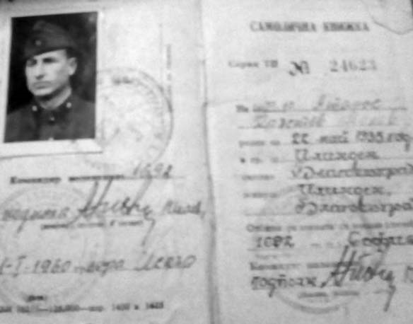

# 14. Трудовашки премеждия

След Люти дол ни разпределиха в различни поделения на Трудова повинност в цялата
страна, които бяха известни като най-трудните за оцеляване от тежката физическа
работа, която се извършваше в тях. Не искаха да сме на едно място, защото всички
заедно бяхме вече много по-опасни за „народната власт“. В тях прекарахме до 1962
година, когато беше закрит и последният комунистически лагер на смъртта в Ловеч.

Аз бях изпратен в поделение 1692, което се намираше на Гара Искър, близо до
гарата. Строиха ни в двора на поделението и започнаха да ни извикват един по
един. Разпределиха ни по различни обекти. На едни от тях се правеха пътни
съоръжения, на други се прокопаваха канали, а някои от обектите бяха „секретни“.

Когато се събра нашата група, при мен дойде старшина Наум Наумов. Вече се
знаеше,че той е с македонски корени, затова може би повече внимание обърна на
нас, които бяхме от Пиринския край. Даде ми знак да го доближа.

&minus;Ти си даскала, нали ?

&minus;Да! – отговорих на старшината.

&minus;Ще заминеш за село Курило, което е в началото на Искърското дефиле, но след
    това ще те изтегля в щаба на поделението. Тук ни трябва образовано момче,
    което да пише на машина. Видях, че твоята автобиография е написана на машина
    „Марица“. А и красиво пишеш, нали ? Старши лейтенант Ганчев от техническата
    служба отдавна търси машинописец. А и ние нямаме човек, който да ни чисти
    стаята и взема пощата.

Гледах старшина Наумов, който сигурно не беше научил още всичко за мен.

&minus;Но освен автобиографията, видяхте ли и характеристиката ми? Не си създавайте
    неприятности заради мен!

Отговорникът за групата от Курило извика, че тръгваме. Разделих се със
старшината, който ми каза :

&minus;Очаквам те! Ще изпратим човек да те вземе.

В Курило ни натъпкаха в едно помещение, където имаше нарове на два етажа. Бяхме
повече от четиридесет човека. Срещу нашата ниска сграда, която беше на брега на
Искър, се виждаше лудницата. Още от първия ден се чуха взаимни провиквания между
лудите и някои от нашите. Делеше ни само реката. Един от тези, с когото бяхме
заедно в Люти дол, се провикна:

&minus;И тук ме вредиха, пак до жени. В Скравена бяха „хулиганки“, ама не приличаха
    на такива, а тук са луди, но говорят свястно. Дали наистина са луди ?

&minus;Кой знае? Колкото ние сме „фашисти“, толкова и скравенченки бяха
    „хулиганки“, а курилченки „луди“ – отговорих на поставения въпрос на моя
    лютидолски състрадалец.

> Когато ми дадоха самоличната книжка като трудовак в Нови Искър беше вписано
> само името ми. След това старшина Наумов ме помоли да си добавя датата, годината
> на раждане и домашния ми адрес. Видял,че пиша красиво, поради което след това за
> малко време бях преместен в шаба на поделението,но бързо прокуден от службите на
> Държавна сигурност, които вървяха винаги по стъпките ми*

В Курило копаехме канали за напояване. Нормата ни и тук беше непоносима. Вечер
се връщахме съсипани от умора. Някои лягаха и си вземаха дрямка до вечерна
проверка, когато започваше гаврата с онези, които не си бяха изпълнили нормата
през деня. И тук имаше “слушалки“, които преиначаваха казаното на обекта. Затова
всеки се пазеше от онези, които се навъртаха около началниците.

В трудовото поделение беше тежко, много тежко, но не беше толкова убийствено
тежко като в Люти дол. Тук изпълнявах нормата си с помощта на някои приятели,
които преди да си тръгнат, минаваха покрай мен. Една вечер командирът на
поделението майор Павлов влезе в помещението и попита:

&minus;Кой е учителят Попов ?

Вместо аз да отговоря, приятелите ми се обадиха хорово:

&minus;Ето го на втория етаж. Нещо пише, както винаги, вместо да щурее като нас.

&minus;Учителю, ела при мен в канцеларията. Чакам те!

Пак някой те е насолил – ми каза един от тези, който ми помогна да си изкарам
нормата през деня.

Помислих си, че някоя „слушалка“ е видяла, когато ми помагаха. Канцеларията на
майор Павлов беше в самостоятелна сграда, сгушена между няколко тополи, на самия
бряг на река Искър. Когато почуках на вратата, майорът побърза да ме посрещне.

&minus;Нямаш време, долу те чака кола от щаба. Преместват те там. Прибери си багажа
    и ще пътуваме заедно.

Не исках да повярвам, че старшина Наумов е изпълнил македонската си дума. Влязох
в помещението, за да си взема довиждане с другите. Те вече бяха научили от
шофьора, който дойде да ме вземе, и беше посъбрал част от багажа ми. Стана ми
мъчно, вместо да се радвам, затова мълчаливо си стиснах ръка с всеки поотделно.
А на един от най-близките ми приятели от Люти дол казах:

&minus;Сигурно няма да е за дълго. Ще ме държат там, докато не ме подбере отново
    някой от Държавна сигурност .

&minus;Пази се, малко ли те мачкаха в Люти дол. Ние се уплашихме там за теб. Дано
    тук най-после бъдат по-милостиви към разклатеното ти здраве – ми каза
    приятелят и се разделихме.

В гара Искър, пред щаба на поделението, ме чакаше старшина Наум Наумов. Не зная
как е попаднал в Трудова повинност човек с такава благородна душа. Прегърна ме и
каза:

&minus;Не беше лесно, но успях да те изтегля при мен. Ще работим заедно.

На следващия ден бях запознат със задълженията ми, които се свеждаха до
следното: да чистя канцеларията, сутрин да паля печката, и най-важното – да
изпълнявам поръчките за писане на пишеща машина от техническия отдел, където
работеха повече цивилни мъже и жени. Отговорник беше старши лейтенант Ганчев,
строителен техник, който веднага ме отрупа с какви ли не отчети за строителните
обекти, които трябваше да препиша на пишеща машина.

Бяхме в една стая със старшина Наумов. Често си говорехме за Македония. Той за
Вардарска, а аз – за Пиринска. Вече знаеше за дедите ми. Когато бяхме съвсем
сами, ме разпитваше за жестокото убийство на поп Стоян и дядо ми войводата
Атанас Попов. Предупреди ме с друг да не обелвам нито дума за произхода ми.
Сподели, че се е погрижил да скрие новата характеристика, изпратена от общината,
в която отново било написано: „Отношението му към народната власт е отрицателно
и е вражески настроен“.

Лекарят в щаба на поделението беше старши лейтенант Митов. Един ден той ме
повика в кабинета си и ми каза:

&minus;Ти не идваш при мен, а трябва да се погрижиш повече за здравето си. В Люти
    дол си го разклатил немалко. Трябва да се лекуваш. Учителят трябва да бъде
    жизнерадостен пред децата.

&minus;Разчекнаха ме от работа, другарю старши лейтенант. Затова още не мога да се
    съвзема – отговорих без да се притеснявам.

&minus;Дано поне тук те оставят на мира. Ти не си за тежка работа. Пази левия си
    крак. Може би ще се наложи да те правим операция.

Бях трогнат от специалното внимание на старши лейтенант Митов към мен.
Неочаквано той сам ми призна,че е партиен секретар на служителите в щаба.
Погледнах го в очите. Бях вече свикнал по тях да разпознавам онези, които
минаваха за благодетели, а после правеха доноси. Докторът не беше от тях. Но,
интересно, не забрави да ме попита какво съм направил, та съм попаднал отначало
в черната рота, а сега в трудова повинност.

&minus;Имахме заседание на партийния комитет. Стана дума за теб. И при нас
    пристигат доноси, че имаш отрицателно отношение към народната власт. Говориш
    ли пред учениците против нея ?

&minus;Те сами разбират някои неща, другарю старши лейтенант – отговорих лаконично.
&minus;Какво ?

&minus;Ами това, че ги разделят на „наши“ и „чужди „.“Нашите“ са децата на вашите
    съпартийци, а „чуждите“ – на безпартийните.

&minus;Е, ако е така, и аз не съм съгласен да делим децата ни. Но, хайде да не
    говорим за тези неща, защото и стените имат уши.

Разбрах, че и старши лейтенант Митов не е от ортодоксалните комунисти, затова
може би бяха неразделни със старши лейтенант Ганчев и старшина Наумов.

Зимата на 1960 година дойде люта и ветровита. Вътрешно бях доволен, че не съм на
открит обект, където бяха другите. Но нощем често сънувах приятелите си, които
останаха в Курило. Мъчно ми беше за тях, затова често се събуждах след полунощ и
до сутринта не заспивах.

&minus;Какво става с теб ? – попита ме една сутрин старшина Наумов. Защо си толкова
    замислен през деня? Да не си болен?

&minus;Не съм болен, но мисля за тези, които работят на открито в тези мразовити
    дни. Не е човешко отношението към тях, другарю старшина. Защо не кажете на
    полковник Илиев да ги пусне в отпуск? Вън камъкът се пука, а те са хора.
    Познавам ги, всички са от лагера в Люти дол и са с разклатено здраве.

&minus;Знам, Атанасе, така е. Но и от него не зависи нищо. Знаеш, че и той не е лош
    човек. Над него има други, които не мислят като нас с теб. Вчера един от тях
    ме разпитваше. Разговорът ни беше труден. Изглежда,че твоите доносници са
    научили адреса му.

Сетихсе, че става дума за полковника от Държавна сигурност. Той вече знаеше
всичко за мен и беше попитал командира защо ме държат в щаба.

В началото на февруари в щаба станаха промени. Полковник Илиев беше преместен.
На негово място дойде полковник Георги Бучков, заедно със своя писар. Като ме
видя, той ме попита:

&minus;А ти какво правиш тук? Аз си идвам със свои хора. Имам си писар и куриер.
    Трима сте много.

Куриерът на поделението беше син на Стоян Караджов от ЦК на БКП. Вестяваше се от
дъжд на вятър. Куриерската му работа се вършеше повече от писаря, който също
беше дете на човек от висшите партийни етажи.

Една сутрин старшина Наумов подрани. Дойде при мен и ми каза:

&minus;Атанасе, едвам оцеля. Оставаш в щаба. Новият командир се оказа твой земляк.
    Той е от Разлог. Дръж се добре с него.

Полковник Бучков беше откровен. Не скри, че още когато го повикали в Главното
управление на Трудова повинност, му казали да ме „разкара“, защото не съм бил
„техен“ човек. Но не се бяха минали две седмици от разговора ни с него, една
сутрин телефонът прозвъня продължително. Този звук ми беше познат. Знаех, че
така звънят онези, които не ме оставяха на мира. Вдигнах слушалката. Познах
гласа на полковника от Държавна сигурност.

&minus;Ти ли си, бе ? Още ли си в щаба? – попита ме той.

В този момент полковник Бучков отваряше вратата. Подадох му слушалката и тръгнах
навън. Той ме спря и ми даде знак да почакам. Искаше и аз да чуя разговора.
Започна кавга по телефона. Командирът ме защитаваше. Уверяваше полковника от
Държавна сигурност, че съм „добро момче“.

&minus;Поемам цялата отговорност за него, другарю полковник. Нека да остане поне
    през зимата тук. Здравето му не е добро.

Сърцето ми вече биеше неспокойно. Чух всичко с ушите си. Нареждането бе веднага
да бъда „изхвърлен“ от щаба и изпратен отново в Курило.

Накрая на словесната кавга полковник Георги Бучков ме погледна с почервенели от
яд очи и каза:

&minus;Някой иска да те душмани! Не мога да те спася. Ако не изпълня заповедта,
    друг ще те изгони, защото сигурно и аз няма да бъда тук.

Вече бях почти изтръпнал. Помолих командира да не рискува заради мен. Той обаче
излезе ядосан от стаята, потърси старши лейтенант Митов. Какво си бяха казали не
разбрах, но след десетина минути целият коридор в щаба се изпълни от всички
служители. Шумно говореха:

&minus;Не го пускаме. Даскалът е част от нас. Без него работата ни ще спре.

Навън беше студено, много студено. Вятърът режеше като бръснач. Събрах набързо
багажа си и тръгнах към джипа, който ме чакаше на портала. Пред мен за раздяла
се наредиха всички служители. Някои от жените не скриваха сълзите си. Една от
счетоводителките, без да се страхува, се провикна:

&minus;Кой е този, на когото и сянката не познаваме? Той не е човек! Какво му е
    направил даскалът?

Да, наистина, това бе пак сянката на Държавна сигурност, която ме преследваше
навсякъде.

Шофьорът, който ме возеше, караше предпазливо колата, защото пътят до Курило
приличаше на заледена пързалка. Когато наближихме селото, настигнахме група
трудоваци, които бяха преметнали върху раменете си кирки, лостове и лопати.
Спряхме до тях, за да качим в колата колко може да събере. Но младши сержантът,
който беше сигурно „уше“ на тези, които ме връщаха при него, не разреши.

В Курило ме посрещна майор Павлов, който беше висок, красив мъж, който излъчваше
благородство. Представих му се и казах,че ме връщат отново на обекта при него.
Той не повярва. Помоли ме да отида в канцеларията му и да го почакам там докато
посрещне връщащите се от обекта трудоваци, за да приеме рапорта за извършената
от тях работа през деня.

Командирът се върна в канцеларията и започна да ме разпитва. Искаше да знае
причината за връщането ми на обекта. Потърсили го по спешност от щаба, но той
бил в селото. Очакваше пак да го потърсят. Казах му, че и аз не зная, но не
скрих, че полковник Бучков е разговарял с офицер от Главно управление на
строителни войски, който е от Държавна сигурност. Майор Павлов присви устни и ме
погледна плахо. Разбрах, че и с него ще се води такъв разговор, който бе
направен с полковник Бучков. Помоли ме да не знае друг за срещата ни, но ме
увери, че след време ще ме изпрати на по-лека работа.

&minus;Засега не мога да ти помогна. Нека почакаме този от Главното управление,
    който те изпраща при нас, да те забрави, макар че тези като него са
    злопаметни.

&minus;Не искам заради мен да имате неприятности. Затова от утре за вас ще бъда
    един от всички, които тук изпращате в най-страшния студ да копаят. Преживял
    съм и по-мъчителни дни в Люти дол – казах на майор Павлов.

В този момент телефонът иззвъня силно. Командирът отвори широко очи в
недоумение. През това време, толкова късно, никой не му бе звънял.

Вдигна слушалката, притаи дъх и изчака отсрещния глас.

&minus;Павлов, ти ли си ?

&minus;Аз съм, а вие кой сте?

&minus;Не ме ли позна ? – чу се строг глас.

Лицето на майор Павлов се смръщи, но събра кураж и отговори:

&minus;Днес ми е тежък ден, прощавайте, не можах да ви позная гласа. Заповядайте,
    другарю полковник.

&minus;Даскала от щаба дойде, нали?

&minus;Тъй вярно, другарю полковник.

&minus;Искам го на обекта. С по-голяма норма за деня, за да се кали на студа.
    Заповядвам! Чули ли?

Майор Павлов съвсем смрази погледа си. Погледна ме с изумени от възмущение очи.
Отсреща отново се чу наставническият глас:

&minus;Чу ли, Павлов?

&minus;Тъй вярно, другарю полковник!

Командирът стоеше като смразен. Сякаш вътре в кабинета му имаше по-голям студ от
външния, който беше подгонил и кучетата, които лаеха покрай брега на Искър.

И двамата стояхме прави. Гледахме се един в друг. Аз вече бях изтръпнал от гласа
на „черната сянка“ още на гара Искър, но майор Павлов сякаш онемя, когато чу
нейния глас.

&minus;И така, другарю майор. От утре тръгвам с другите. Няма как! Съдбата ни с тях
    е една и съща. Не приемам предложението ви да остана в канцеларията. Не си
    навличайте беля, заради мен. Лека нощ!

Напуснах канцеларията, в която майор Павлов остана сам. Когато затварях вратата,
чух да прошепва:

&minus;Боже, колко жестоки хора има! Защо ли стоя още при тях? Страданията на тези
    молепсани момчета са и мои страдания. До кога ли ще продължава този ад?

Тръгнах към спалното помещение, в което нетърпеливо и с нескрито любопитство ме
очакваше цялото отделение. Някои от тях не вярваха, че се връщам отново на
обекта. Доверих се на моите земляци от Неврокопския край. Казах им истината. Те
знаеха още от Люти дол за произхода ми и постоянното преследване на рода ни от
комунистическата власт. Един от тях се доближи до мене и прошумоли в ушите ми:

&minus;Даскале, болшевиките не прощават. Те сякаш са родени, за да бъдат
    злосторници за цял живот. Запомни от мен, че страхът им от теб е голям,
    затова ще те преследват завинаги. Ти си най-умен от всички ни, но приеми и
    не забравяй съвета ми. Отваряй си очите, когато разговаряш и с „нашите“,
    защото комунистите имат няколко доносници тук. Не виждаш ли, че някои от
    отделението не ходят на тежка работа. Така беше и в Люти дол, нали?

Вярно е, така беше и в Люти дол. И там имаше „ушета“, т.е.сътрудници на Държавна
сигурност, които подстрекаваха наивните да говорят срещу партията и народната
власт, след което бяха изпращани на най-тежкия обект за работа. Там ги знаех кои
са, но тук още не можех да ги разпозная, затова бях мълчалив.

Занизаха се тежки, непоносими дни и в Курило. И тук не смогвах да изпълнявам
трудовата си норма, особено през зимните дни. Когато се запролети, ни
изпращаха на групи по съседните села на Курило, където правехме напоителни
канали. Няколко дни оставах на обекта и през нощните часове, за да си
изкарам нормата. Един ден майор Павлов ме извика при него. Погледна ме и
съчувствено ми каза:

&minus;Този „дървен шоп“ – имаше предвид младши сержанта, който ни водеше на 
обекта – ще ти вземе здравето. Пази се от него!

Знаех какво искаше да ми каже командирът. И той се страхуваше от него. Говореше
се сред моите приятели, че „шопът“ бил „уше“ на Главното управление. Въпреки
това майор Павлов ме премести на обекта, където се строеше голямо водно
съоръжение. Там работата беше пак тежка, но все пак поносима. Тук работеха и
цивилни. Един от тях висеше по цял ден без работа. Предупредиха ме да се пазя от
него. По всичко личеше, че е ченге. Навсякъде ги имаше.

Скоро на обекта в Курило се появи строен, висок инженер, когото наричаха и него
„македонеца“. Една сутрин застана пред строя, заедно с командира. Не отместваше
погледа си от мен. Когато започна разпределянето за работа по обектите, той се
доближи и ми каза:

&minus;Даскале, много ти поздрави от старшина Наумов. От днес ще бъдеш с мен.
    Трябва ми човек, който да води точни бележки за проектирането на новите
    канали, които ще се строят. Нали сме македончета, трябва да се пазим!

Бях с „македонеца“ през месец август. Обикаляхме софийското поле. Разнасях
инструментите, с които той измерваше мястото, където трябваше се направят водни
съоръжения.

Към края на месец септември през 1960 г. отново здравето ми се разклати съвсем.
Чудех се от кое заболяване да се плаша най-много. Събраха се на едно място
онези, които получих в Люти дол и Курило. Не само сърцето, но и краката вече не
ме слушаха. С благословията на д-р Митов от щаба на поделението в гара Искър,
пред когото се застъпвали за мен македонските ми приятели, постъпих във военната
болница. Започна се операция на левия ми крак, а след това и възстановяване на
сърдечната ми дейност. Цели три месеца ме местеха от болница в болница.

Бях изгубил надежда, че ще оздравея. Зарадвах се, когато научих, че излязло
Разпореждане № 30 още през 1960 година на ГУТП, с което учителите трудоваци
могат да довършват остатъка от службата си само през летните месеци, за да могат
през останалото време да упражняват професията си.

