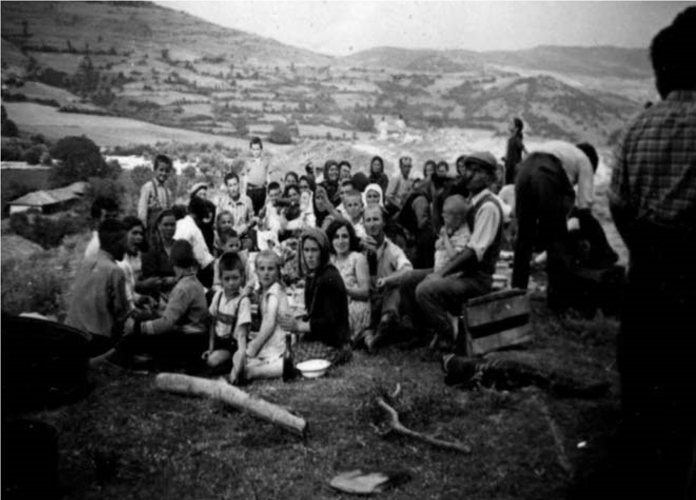
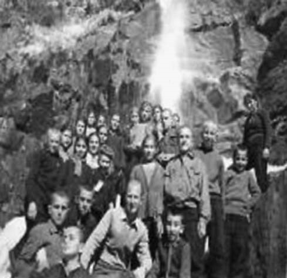

# 16. Отново в пазвите на Родопите

За една учебна година бях назначен за учител по български език и литература в
планинското село Ковачевица, което все още беше многолюдно. Само няколко
семейства се бяха преселили във Велинград. Харесаха ми калдаръмените улици и
къщите, съградени само от камък и покрити с тикли (каменни плочи). Всяка една от
ковачевските къщи си имаше свое лице. Хората от селото бяха много будни,
ученолюбиви. След училище винаги се отбивах в селското читалище „Светлина“ с
някои от моите колеги. А то имаше богат книжен фонд. В читалнята срещах много
читатели – и стари, и млади. Често там заварвах и моите ученици, които веднага
идваха при мен, за да ми кажат какво са прочели. Запомних Вангелия Мавродиева,
която беше най-добрата моя ученичка. Тя винаги държеше нова книга в ръцете си и
бързаше да се похвали, че е опознала някакъв нов свят.

Най-близки в учителския колектив бяхме със стария учител Ангел Джигрев, който ме
запозна с всички по-известни родове от селото. В старото училище кипеше богата и
разнообразна учебно-възпитателна дейност. Учениците ме обикнаха и често заедно с
тях опознавах забележителните местности на селото. Направихме няколко екскурзии
из страната, за които и сега си спомнят моите вече много пораснали ученици.

>   *Макар и прокуден от моето родно село, често се завръщах в него, за да се
>   видя с малкия ми син, жената и родителите ми. Тук съм на курбан, който се
>   правеше от махалата, която комунистите наричаха „фашистка“*

Само една, но незабравима беше учебната ми година в Ковачевица. В повечето
почивни дни прекосвах лещенските баири на път за родното ми село Либяхово,
където все още учителстваше жена ми. Понякога слизах по пряката пътека до така
наречените Градски бани, а от там през Заграде, Барото, покрай Мосомище, през
Копривлен и по нанагорнището до Кендик. Тук винаги спирах, както и през
ученическите ми години, за да прегърна с поглед родните баири. Най-много се
радвах на Бука, Пъзлак и Градище. В село пристигах след пет или шест часа
непрекъснато пътуване. Трудно ми беше при всяко идване при родителите, жена ми и
сина ми Красимир, но без тях не можех да се застоя в Ковачевица.

> *На път от Ковачевица за родното ми село С учениците под водопада в Ковачевица*

Ковачевица ми плени сърцето и мислите с будните, но много мирни хора, които не
знаеха що е умора. Както те, така и техните деца, моите ученици, бяха втъкали в
себе си хубостта на Родопите.

Директорът на училището Никола Копралев ме помоли да остана още една-две години
в училището. Взаимно се превързахме с колегите, повечето от които бяха местни. С
Ангел Джигрев през свободните часове бяхме неразделни. От него научих цялата
история на Ковачевица, която е откърмила толкова много просветни дейци и
войводи.

