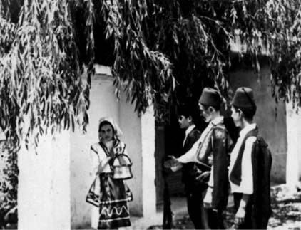
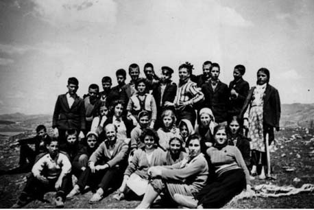

# 17. Учител в Дъбница

През следващата учебна година, най-после с помощта пак на окръжния инспектор
Никола Пашов, ни преместиха близо един до друг с жена ми – мен в Дъбница, а нея
в Гърмен. Зарадвахме се, защото селата бяха само на три километра едно от друго.
Намерихме квартира в Гърмен при дядо Илия Тошев, който имаше къща с голям двор в
центъра на селото.

Една цяла учебна година, всяка сутрин, рано, преди изгрев слънце, се отправях по
прекия път от Гърмен за Дъбница. Отначало пътувах пеша, но след това си купих
малък мотор“ Симсон“, с който ми беше по-лесно за отиване и връщане. Радвахме се
с жена ми,че след толкова години раздяла сме заедно със сина ни Красимир. Много
често при нас идваше дядо Илия, за да погали детето ни. Понякога го оставяхме
при него, за да му се радва, защото дядо Илия беше вече разпилял родата си и
живееше сам в голямата къща.

Селата Гърмен и Дъбница бяха самостоятелни общински центрове. Училищата им се
отличаваха с будни ученици и авторитетни учители. Директорът на училището в
Гърмен беше Крум Топалов, който имаше славата на човек, който не се подичинява
на управниците, защото се смяташе за „заслужил за народната власт“. Затова не
позволяваше други да командват в училището му. Знаеше за моето минало, което
оценяваше по-различно от другите комунисти. Смятаха го за „реформатор“ в
неговата партия. При няколко срещи ме уверяваше, че ако се съглася да се
преместя в Гърмен, никой няма да ми създава тези неприятности, които ме
съпровождаха навсякъде. Жена му се сближи с моята и много често са обсъждали
нашата орис.

Директорът на училището в Дъбница не даваше и дума да се продума за
преместването ми в Гърмен, за да бъдем заедно с жена ми. Предложиха ми да стане
обратното – тя да бъде назначена в дъбнишкото училище. На следващата учебна
година така и стана. Жена ми беше преместена за възпитателка в Дъбница.
Най-после след толкова години разделени се събрахме в едно училище.

>   *В класната стая с учениците, които никога няма да забрава, заради тяхното
>   ученолюбие и възпитание*

Аспарух Тиганчев беше известен като един от най-добрите директори на училище в
Неврокопския край. Беше красив, снажен и рядко интелигентен. Сближихме се много,
защото и семействата ни някога са били близки. Познавах баща му, дядо Георги,
който е бил един от съратниците на дядо ми. Често разговаряхме за неговото и
моето минало. Комунистите не го обичаха много, защото беше безпартиен. Но нямаше
друг, който да управлява така добре училищните дела в Дъбница. Окръжният
инспектор Никола Пашов беше и негов защитник. На няколко пъти общинският комитет
на БКП в Дъбница вземаше решение за подмяната му, но тогавашните просветни
ръководители Георги Стоянов и Никола Пашов осуетяваха изпълнението на решението.

Един ден при нас дойде малкото ми братче Китан, който беше силно привързан към
сина ми Красимир и дъщеря ми Снежана, която се роди в Дъбница. Тя беше само на
една година. Решихме брат ми да остане да се учи при нас. Така улеснихме майка и
татко, които едва смогваха да издържат другите ми братчета. Беше голяма радост
за цялото ми семейство След като завърши основното си образование, Китанчо
продължи да се учи в Неврокопската гимназия.

>   *Дъбница. С братчето ми Китан, синът ми Красимир и жена ми, която държи в
>   скута дъщеря ни Снежана, която е само на няколко месеца*

Още от първата година в Дъбница няколко учители по основните учебни дисциплини
създадохме здраво ядро, което бе в основата на богатата и разнообразна учебна и
възпитателна дейност с учениците. Всеки от нас беше един от водещите по своята
научна специалност в бившата Неврокопска околия. Моите ученици, немалка част от
тях турчета и българомохамеданчета, обикнаха дисциплините, които преподавах.
Създадох клуб „Млад литератор“, в който участвуваха 20 ученици, които имаха ярко
изразени творчески интереси към литературата. С това название издавахме и
вестник, в който се публикуваха най-добрите техни творби.

>   *Театрализация на „Изворът на Белоногата“ от П.Р.Славейков*

При обучението по български език и литература създадох неразривно единство
между класно-урочните, извънкласните и извъучилищните форми за обучение и
възпитание на учениците, което създаде изключително голям интерес и сред
моите колеги от училищата в Неврокопския край. На няколко пъти в Дъбница се
провеждаха семинари по тези проблеми, които бяха свързани и с подготвени от
моите ученици извънкласни и извънучилищни форми за възпитание. С особено
голям интерес бе посрещната театрализацията на поемата „Изворът на
Белоногата“ пред чешмата в селския парк. Ролята на Гергана изпълняваше
Офелия Гаджева, а на Везира – Рушан Талипов.

Повечето от моите ученици станаха и добри краснописци. Инспекторите по български
език и литература дойдоха няколко пъти да проучват опита ми, който беше
популяризиран в окръга. Един ден на посещение в нашето училище дойде и
инспекторката Иванка Тодорова от Министерството на просветата, която беше
известна като изключително строга и взискателна. Когато влезе в учителската
стая, бях останал само аз от учителите по български език и литература. Другите
мои колеги я бяха забелязали и се гмурнали по-рано в класните стаи, за да не
влезе при тях. Инспекторката Тодорова ме попита как се казвам. Представих се и я
поканих да ме посети на урок в седми клас.

&minus;За вас вече научих много хубави неща от училищния инспектор Борислав
    Владиков. Искам да посетя първо някои от другите твои колеги.

&minus;Те са вече в класните стаи. Неудобно е да влезем след тях – каза директорът
    Аспарух Тиганчев.

&minus;Добре ! -съгласи се Тодорова.

&minus;Когато влязохме в класната стая на седми „а“ клас, Тодорова първо огледа
    украсените стени и кътове, на които с красиви букви бяха извезани мисли на
    изтъкнати наши възрожденски поети. След това поздрави децата.

Урокът мина при активното участие на учениците, които не се притесняваха от
присъствието на гостите. Това даде повод на Тодорова да започне непринуден
разговор с тях, от който остана много доволна.

При влизане в кабинета на директора, за да направи анализ на изнесения от мен
урок, Тодорова ме попита:

&minus;Колега, кога си завършили университета?

Вместо аз, директорът даде отговор на този въпрос.

&minus;Той е прогимназиален учител. Няма все още висше образование.

&minus;А защо?

&minus;Попитайте колегата Попов. Но той сигурно няма да ви каже всичко. Не му
    разрешават да кандидатства в университета, защото е внук на известен войвода
    от нашия край. Пътят му и като прогимназиален учител е мъчително труден –
    каза директорът на инспекторката Тодорова.

Вместо да посети следващия колега, инспекторката остана да проучи подробно
причините за пречките, които ми създаваха управляващите да продължа
образованието си.

На следващия ден, когато Иванка Тодорова си тръгна за София, поиска да се видим.
Увери ме, че ще има специален разговор в окръжния отдел на „Народна просвета“ за
това повече да не ми се пречи да продължа образованието си. Имала среща с
инспекторите Борислав Владиков, Атанас Хаджиев и Никола Пашов, пред които
изразила впечатленията си от моето представяне в Дъбница. Единият от тях ѝ се
похвалил, че съм редовен лектор на семинарите с учителите по български език и
литература в окръга, които се провеждаха в град Банско. На последната сбирка
докладът ми „За творческо възприемане на художествената творба“ предизвика голям
интерес и у представителите от Министерството на народната просвета, които
настояваха да се разпространи във всички училища на страната.

През 1964 година за първи път не срещнах трудности при кандидатстването ми за
задочно обучение в Софийския университет, в който бях приет втори в списъка.
Отначало новоприетите студенти бяхме по-малко, но след това станахме много
повече. В нашия курс се появиха хора, които бяха записани като студенти с
някакви привилегии, които ползваха като щатни комсомолски секретари, деца на
активни борци против капитализма и партийни деятели. Измежду тях имаше и
офицери, които не скриваха оръжието, което носеха и по време на лекциите, на
които присъстваха от дъжд на вятър, а на изпити въобще не се явяваха заедно с
нас.

С неописуеми финансови затруднения следвах висшето си образование. Когато бях на
очни занятия, едва смогвах да заплащам леглото в хотелските стаи, където
отсядах. Често се отбивах при братовчед ми Тодор Мангушев, който беше миньор в
с. Бухово. В голямата таванска стая, където живееха с невястата Иванка и двете
им деца Борис и Иванка, се намираше място и за мен. Много често с батко не
заспивахме, защото започвахме тъжните разговори за убийството на баща му от
комунистите в селото.

Като учител в Дъбница станах очевидец на втория етап от възродителния процес в
родопския край, в който бяха включени и някои от учителите комунисти. Измежду
тях имаше турци, които обаче запазиха своите имена, а участваха в подмяна на
имената на българомохамеданите. Със сигурност двама от тях бяха доносници на
Държавна сигурност. Те създадоха разкола, който започна да се проявява в живота
на учителския колектив. За тях написах епиграмата: „На лицето им – захарнонежна
усмивка, леко потупват по рамо. Но пази се, това е преструвка, с която подкупват
те само“. По-късно трима от учителите по турски език се преселиха в Турция. Там
бяха проявили своя ярко изразен турски фанатизъм. Похвалили се, че въртели на
малкото си пръстче учителите “гяури“ в Дъбница и успели да ги разцепят на две
групички.

>   *Понякога батко ми Тодор Мангушев идваше заедно с мен да слуша някои лекции
>   на мои преподаватели в университета*

Наистина, за съжаление, двама от моите колеги се включиха в тяхната интригантска
игра, поради което първоначалното силно ядро от водещи учители вече го нямаше.
Тогава общинският комитет на БКП направи и кадрови рокади. Вината бе стоварена
върху директора Аспарух Тиганчев, който беше преместен в с. Блатска. На негово
място бе назначена потомка на известния комунистически род Папалезови, която
изпълняваше стриктно указанията на Общинския комитет на БКП за всичко, което
трябваше да става в учителския колектив. Оттогава започна да вехне спечелената
слава на дъбнишкото училище.

>   *И в Дъбница бях винаги заедно учениците*

На един от дъбнишките събори дойдоха и някои от близките на арестуваните и
разпитвани тук комунисти от нашето село, които са участвали в подготовката на
преврат срещу правителството през 1925 година. Заедно с тях беше и един от
агентите на Държавна сигурност, който пишеше доносите срещу мен като лагерист в
Люти дол, а след това и като трудовак в Курило. Той беше имал специална среща
със секретаря на общинския комитет на БКП Тома Спириев. Разказал му всичко за
моя род като „фашистки“. Оттогава първенците в селото ме гледаха като техен
„враг“. Разровили се в досието ми, представено от Държавна сигурност. Разбрах,
че тук ще ми бъде вече много трудно. След един разпит, на който бях подложен в
кабинета на секретаря на общинския кмет на БКП, взех решение да напусна Дъбница,
макар че бях силно привързан към учениците. А и те към мен. Споделих това с
инспектора Никола Пашов, който ми обеща да ми помогне да отида колкото се може
по-далеко от тези, които ме преследваха на всяка крачка.

Една вечер срещнах съседа ми Манол Джаджев, който беше председател на ТКЗС-то в
селото. Той имаше конфликт с общинския секретар на БКП и председателя на съвета,
не се погаждаше с тях. Попитах го дали може да ми осигури камион, с който да си
преместя багажа от селото. Той ме погледна учудено и каза:

– Ако и ти напуснеш училището, вече няма да имаме добри учители. Но е вярно и
това, че вече атмосферата в училището е непоносима с новия ви директор, която е
протеже на общинския комитет на партията, която вече не е моя. Затова не мога да
те посъветвам да останеш.

