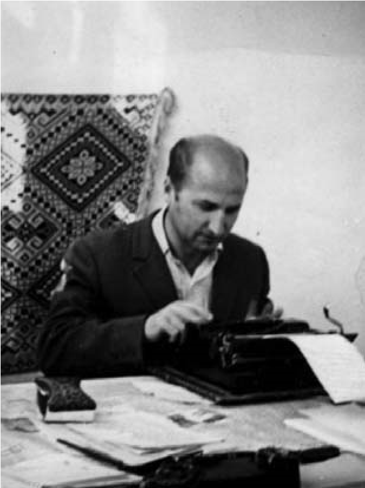
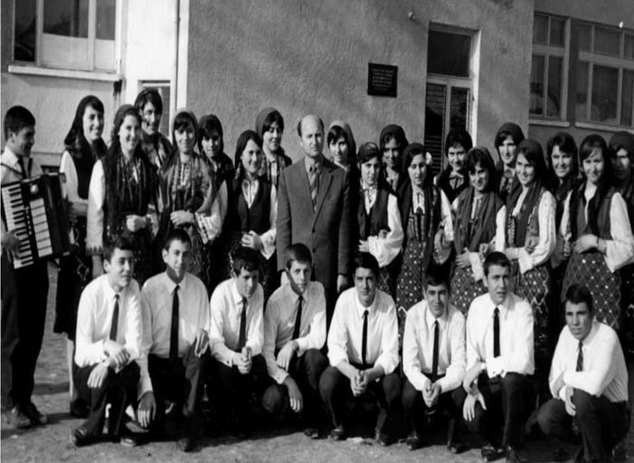

# 18. В Банско и Разлог

Напуснахме с жена ми Дъбница, заедно с двете ми деца Красимир и Снежана. От
Окръжния отдел на Народна просвета ми предложиха учителско място в Разлог или
Банско. Избрах града в пазвите на Тодорка и Вихрен. Настаних се в старата
възрожденска къща на Георги Бенин.

Когато седнахме да уговаряме наема, хазаинът и хазайката ме погледнаха и ми
казаха едновременно и двамата:

&minus;Пари не искаме. Стига ни това, че ще поддържате старата къща.

Тогава Банско беше тихо градче, което ме покори със своята хубост като
възрожденско огнище. Управата на града беше от инициативни родолюбци, които
приемаха т.нар. „приоданци“, т.е. придошлите в града, като свои. Искаха да имат
повече интелигентни хора. Още в самото начало към мен се отнасяха със специално
внимание, защото бързо се включих в културния живот, който беше свързан с
героичното възрожденско минало на тази крепост на българския дух. Не мога да
забравя хубавите предавания, които подготвяше Снежана Йопева като ръководител на
местната радоуредба. В тях нямаше политика, а народни песни, предания и разкази
за самобитния духовен живот на банскалии.

Банскалии тачеха своите богати народни традиции. Вечер по улиците на града се
чуваха хубавите мелодични песни на гласовити мъже. Някои от ръководителите ме
помолиха да остана в града, защото някои от Окръжния съвет на просветата им бяха
казали, че след като завърша висшето си образование, ще бъда преместен където си
поискам, защото като учител по български и литература вече бях оценяван като
един от най-добрите в окръга.

Един ден Никола Янчовичин ме спря пред сградата на общината и ми каза:

&minus;Даскале, харесва ли ти Банско?

&minus;Много – отговорих съвсем кратко.

&minus;Тогава не е лошо да си подбереш хубаво място и за къща, която да си направиш
    тук. Поразшетай се из града и кажи къде ти харесва най-много. Ще ти разрешим
    да си купиш хубав парцел. Ти заслужаш. В Банско трябва да има повече като
    теб, за да се пазят неговите просветни и културни традиции.

Вечерта споделих с жена ми предложението, което ми направи Янчовичин. Тя обаче
сви вежди и каза:

&minus;Тук ли искаш да останем?

&minus;Защо не?

&minus;Решавай, ти си глава на семейството. Това е твоя грижа.

&minus;Но двамата ще изберем мястото за къща, нали?

&minus;Хубаво – съгласи се жена ми.

Научих къде е най-романтичното място. Отидох на Йоневото блато, където се
простираха зелени ливади, но мястото вече беше включено в регулацията на града.
Опънах се на една от ливадите и се вгледах във върховете на Пирин. Наблизо чух
шепота на изворче. Станах и отидох до него. Пих от бистрата като сълза вода,
прегърнах с поглед Вихрен и Тодорка и си казах:

&minus;Тук ще бъде моят дом!

При мен дойде д-р Аврамов, който беше вече издигнал хубава къща и ме попита:

&minus;Учителю, харесва ли ти Банско? Защо не ми станеш съсед? Ако не знаеш, чуй
    какво ще ти кажа. Ние с теб сме от комитски родове. И моят баща е бил деец
    на Вътрешната македонска революционна организация. Аз зная всичко за твоя
    род. Дядо ти и баща ми са били добри приятели. Е, мене комунистите ме
    прокудиха от Горна Джумая като комитски син, а теб от Либяхово като внук на
    комита. Нека пък ние да заживеем като съседи в комитско Банско.

Думите на доктора бетонираха решението ми да бъда негов съсед. Уреждането на
документацията за закупуване на парцела продължи няколко месеца. Банскалии вече
ме имаха като истински техен съгражданин. Намерих много приятели, които ме
уверяваха, че в техния град повече няма да бъда преследван от Държавна
сигурност. И това беше така. Един ден техният отговорник от Държавна сигурност
Никола Йопев ме спря пред къщата на Никола Вапцаров.

&minus;Учителю, сигурно знаеш, че през нас минават всички справки за такива като
    теб. Но трябва да бъдеш спокоен. Моята жена те уважава много. Искам и ние
    взаимно да се уважаваме. Ние, банскалии, пазим децата и внуците на
    войводите. Не сме като онези, които им създават незаслужени страдания,
    каквито ти си преживял много.

Тези думи на служителя от Държавна сигурност ме стоплиха. Бях сигурен, че той
няма да ме преследва като Рашков. Когато се преместих в Банско, такъв разговор с
мен направиха Никола Янчовичин и Райна Балева. Те посрещнали с радост
назначаването ми в техния град, защото вече ме познаваха от семинарите с
учителите от окръга, които минаваха в Горския техникум. При тях отишъл и бай
Цани Глушков, за когото вече бях публикувал очерка „Ти имаш две сърце“, и им
казал:

&minus;На нашия град трябват такива като учителя Попов, които да разтварят
    страниците на нашето героично минало.

Тогава по мой сценарий се направи инсценировката, свързана с освобождаването на
Банско от четата на Яворов и българската армия.

Когато бях в Банско, завършвах висшето си образование в Софийския университет.
Нямах много свободно време, защото правех задълбочено научно изследване на
говора в родното ми село Илинден, където пребивавах често. Това беше темата на
дипломната ми работа, към която проявиха изключително голям интерес не само
научният ми ръководител проф. Стойко Стойков, но и неговите колеги академик
Владимир Георгиев, проф. Кирил Мирчев и проф. Петър Динеков.

>   *Бях денонощно над машината,когато разработвах дипломната ми работа за
>   говора на моето родно село Либяхово*

През 1968 година една вечер, преди да започне новата учебна година, връщайки се
от последния изпит в Университета в София, жена ми ме посрещна с новината, че и
двамата сме преместени в Разлог. Тя беше радостна, но тази новина отначало ме
притесни, защото банскалии очакваха нетърпеливо да се дипломирам, след което
искаха да бъда преместен в най-авторитетно им учебно заведение. Недоумявах как е
станало това без мое знание и съгласие. На следващия ден бях потърсен от
началника на отдел „Народна просвета“ в Благоевград, който ми каза, че в град
Разлог се открива елитно ново средно училище, за което се търсят авторитетни
учители, които да му поставят хубаво начало. Първият назначен учител бях аз,
заедно с бъдещият директор на училището Илия Чолев, известен със своите завидни
умения да подготвя хубаво начало на всяка нова работа, която е започвал. С това
той вече беше известен като директор на училище в град Неврокоп, а след това и
като директор на Комбината за хранителна промишленост в град Разлог.

Назначаването ми за учител в Разлог ядоса някои от ръководителите на Банско.
Райна Балева отишла веднага в Благоевград, за да възрази за неочакваното ми
преместване в Разлог. Когато се завърна, ме потърси и каза:

&minus;Язък, изпуснахме те! Началниците ми забраниха да правя официално възражение,
    защото, както ми казаха, нямало да ме огрее, каквото и да правя. Сгрешихме,
    трябваше още когато дойде в Банско да те назначим за директор на някое
    училище, независимо от това, че си безпартиен.

В Разлог бях посрещнат изключително любезно от Илия Чолев, директор на
новоткритото СПТУ по лесотехническа и целулозна промишленост, сега Професионална
гимназия по туризъм и хранителни технологии. На първата среща дойде и директорът
на комбината инж. Атанас Татарски, който е създател на Завода за дрожди в град
Разлог. Той ни прегърна с поглед и каза:

&minus;Радвам се, че в нашето училище директорът и първоназначеният учител са
    земляци, известни с новаторските си дела в своята благородна и отговорна
    професия. Пожелавам ви високи успехи, които да прославят новото училище.
    Търсете моята помощ. Ще ви я давам много щедро!

Когато се преместих в Разлог, и двамата с жена ми се привързахме към този град,
който е само на 5 километра от Банско, където остана мечтата ми да си направя
своя къща.

Учителските ми години в Разлог бяха изпълнени с ентусиазъм. Нашият техникум беше
настанен в сградата на гимназията. Отначало бяхме заедно с колегите от
гимназията в една учителска стая. Сприятелих се с много от тях. В почивните дни
излизахме заедно с двамата директори Рачев и Чолев из планината покрай Бачево.
Водеше ни колегата Попов, преподавател по история, който беше от същото село.
След разрастването на нашия колектив заживяхме сплотено както в педагогическата
работа, така и през свободните дни, които много често прекарвахме в м. Катарино,
или пък се изкачвахме до Даутов връх.

Учениците в техникума бяха будни, много будни. Голяма част от тях имаха
подчертан интерес към художествената самодейност. Създадох състав, който още от
първата година се прослави в града по време на традиционните тържества. В това
отношение директорът Илия Чолев ме подпомагаше и стимулираше учениците. В града
вече се признаваше, че учениците от техникума са несравними в своята богата и
разнообразна самодейност.

>   *Художественият състав, който създадох в професионалната гимназия в Разлог*

И в Разлог създадох голяма любов на учениците към учебната дисциплина, коята
преподавах. На повечето от тях литературата има стана любим учебен предмет.
Породиха се прекрасни взаимотношения между мен и тях. Много често някои от моите
ученици идваха в дома ми, където любезно ги посрещаше съпругата, която беше
учителка по математика. Понякога заедно с тях идваха и ученици от гимназията, в
която преподавател по български език и литература беше моят добър приятел поетът
Благо Прангов. Веднъж той ми каза:

– Приятелю, ти какво направи? Нашите и вашите ученици се побратимиха. И те си
създадоха добри приятелски взаимоотношения, каквито са нашите. Хубаво е, че
подражават и на нас.

Това побратимяване между учениците от двете училища стана още по-голямо след
като в продължение на няколко месеца преподавах и в гимназията. Замествах една
от колежките. Никога няма да забравя и будните ученици на колегите от
гимназията. Един от тях беше и сегашният д-р Велев. Директорите на двете учебни
заведения Рачев и Чолев спомогнаха много за добрата атмосфера в сградата, която
ползвахме заедно. А учителските колективи бяха като един.

Разлог е град, който е известен с ревнивото съхраняване на старите празници,
обреди и ритуали. А това богато поле на нашата душевност си остана един от
основните терени на моята научноизследователска дейност още като учител.
Участниците в самодейния колектив, който създадох, бяха моите най-добри
помощници в това отношение. С тях отбелязвахме с богати програми и онези
празници, които тогавашната комунистическа власт не тачеше, защото някои от тях
имаха ярко изразен религиозен характер. Нямаше празник в Разлог, на който
учениците от тогавашния техникум, а сега професионална гимназия, да не участват
със завидно подготвени рецитали и художествени програми.

Никога няма да забравя всеотдайността на директора Илия Чолев, който ръководеше
умело нашия сплотен учителски колектив и хубавия ред в цялостната му работа.
Само за една година се създаде богата материална база, която беше най-важното
условие за професионалната подготовка на учениците. Разбира се, неговият
помощник за постигане на всичко това беше Атанас Татарски, с когото бяха
неразделни. Оттогава се създаде и взаимната връзка и голямо уважение между мен и
двамата, с които запазихме нашите добри спомени.

Като учител в Разлог пак бях ухажван от училищните инспектори, които настояваха
за повече мои открити уроци, които да посещават колеги от различни училище в
окръга. Най-упорит в това отношение беше инспекторът Атанас Хаджиев, с когото
много често пътувахме заедно в окръга, за да проучваме и популяризираме опита и
на другите най-добри учители по български език и литература. Тези срещи бяха
изключително полезни за повишаване качеството на учебния процес.

Когато бях в Разлог, моят научен ръководител на дипломната ми работа проф.
Стойко Стойков на няколко пъти разговаряше с мен и ми предлагаше да стана негов
асистент в Софийския университет. По време на защитата проф. Владимир Георгиев,
проф.Кирил Мирчев и проф. Петър Динеков останаха удивени от изследването ми за
говора в родното ми село Либяхово. Те също ми казаха, че трябва да бъда готов за
вече откритото асистентско място при проф. Стойков. Беше ми неудобно да
кандидатствам, защото в Разлог бях посрещнат изключително любезно от директора
Илия Чолев и с голяма надежда да работим заедно за утвърждаването на новото
учебно заведение в този град. След това отново на няколко пъти бях подсещан от
научния ми ръководител да си подам документите за обявения конкурс. Не се реших
да направя тази стъпка и заради това, че при всяко подаване на документи се
правеше подробна справка за произхода ми. А нашето семейство беше вече молепсано
от комунистическата власт. Нямах сили повече да понасям нови незаслужени обиди и
страдания. Когато споделих с жена ми за отправената ми покана за асистент в
Софийския университет, тя не се съгласи. Беше ѝ вече натежало преместването ни
от едно на друго място. И тя се страхуваше, че Държавна сигурност пак ще тръгне
по стъпките ми. След няколко дни научих тъжната вест, че внезапно е починал моят
любим професор Стойко Стойков.

Всяка сутрин, преди да влезем в учителската стая, минавахме покрай канцеларията
на директора, който ни посрещаше с усмивка и не забравяше да ни пожелае
ползотворен ден. Така посрещаше той всеки учител и служител. С мъдрия му поглед
и благите думи ни зареждаше за ползотворна работа през учебния ден.

Една сутрин погледът на директора беше друг. Нещо го измъчваше и той се издаде:

&minus;Наско, ела да си поговорим в кабинета ми. Искам нещо да те попитам.

Бях сигурен, че Държавна сигурност не ме е забравила и е опънала ушите на
директора за съвсем явната негова закрила в цялостната ми дейност като учител.

Директорът се постара да скрие истината, но след това ми призна, че секретарят
Петър Бонков му показал цяла папка срещу мен, изпратена до него от районното
управление на Държавна сигурност. Той ме хвана за рамото и каза:

&minus;Едни работят със сърце, за да растат децата ни умни и спокойни, а други
    нямат сърца и разум и правят какво ли не, за да враждуваме помежду си.

И в Разлог беше изпратена от Държавна сигурност папката, в която на челно място
е било оперативното дело срещу мен като „вражески настроен“.

>   Погледнах директора в смутените му очи и казах:

&minus;Щом и тук Рашковци са решили да ми пречат на учителската работа, ще се
    разделим, за да си нямате неприятности с тях.

Директорът изпусна яда си и ми каза:

&minus;Това няма да стане. Тези ограничени хора този път ще си имат работа с мен.
    Имам сили да се преборя с тях. Освен това и от Градския комитет не приемат
    техните действия за разумни.

&minus;Не ми се сърдете, но сигурно не познавате тяхната жестокост и упоритост,
    когато преследват жертвите си – казах на директора.

Вечерта споделих с жена ми това, което научих от директора Илия Чолев. Тя
погледна децата и ми каза:

&minus;Горките, дали те някога ще научат колко проклети са тези, които винаги
    вървят по стъпките ни, за да ни измъчват.

Синът ми Красимир сякаш подразбра нещо и попита:

&minus;Тате, защо сте тъжни с майка?

А дъщеря ми Снежана се гушна в скута ѝ.

&minus;Няма нищо тъжно, сине. С майка ти говорим за къщата, която ще строим в
    Банско. Утре ще отидем да гасим вар и ще огледаме реката за хубав пясък.

Тези мои думи успокоиха децата и те легнаха да спят. А ние с жената продължихме
да умуваме как да се отървем от нашите вечни душмани, както ги нарече жена ми.

На следващия ден прочетох във вестник „Пиринско дело“, че в Благоевград се
открива Полувисш институт за подготовка на културно-просветни кадри. Имаше и
обява за преподаватели. Като поднесох вестника на жена ми, тя се усмихна и каза:

&minus;Този път те пускам да кандидатстваш. Дано в Благоевград нашите душмани не ни
    забележат.

Прочетох обявата, в която пишеше, че институтът подготвя кадри за народните
читалища като организатори на културно-просветната работа, ръководители на
самодейни колективи и библиотекари. Зарадвах се, защото още от ученик в моето
родно село читалището беше като мой втори дом. Там участвах и в театралните
представления, подготвени от моите учители. Обикновено на мен те даваха детските
роли, които според тях съм изпълнявал по-добре от самите тях.

След няколко дни споделих с директора, че съм подготвил документите да
кандидатствам в открития нов институт в Благоевград. Отначало той реагира остро,
като и този път не пощади с пиперливи думи хората от Държавна сигурност.
Уговорихме се, ако спечеля конкурса, да не ми пречи, а да ме освободи, въпреки
неговото уверение, че този път ще направи така, че моите душмани да мирясат.

Когато подготвях документите си, директорът ме повика в канцеларията си, подаде
ми подготвената от него характеристика и ми каза:

&minus;В нея съм написал това, което си направил за укрепване авторитета на нашето
    учебно заведение. Това е истината, а лъжите ги пишат само онези, които и аз
    никак не ги обичам.

Конкурсът в Благоевград мина успешно. От всички кандидати за обявеното място за
преподавател по Теория и методика на културно-просветната работа само аз бях
допуснат до втория кръг, на който се представих с отличен успех.

Когато колегите в Разлог научили, че ще ги напускам, започнаха да идват един по
един при мен. Питаха ме дали е вярно. Някои от тях бяха ходили при директора, за
да ме убеждава да си остана. Той беше казал за решението ми да напусна Разлог на
секретаря на ГК на БКП Петър Бонков И той се ядосал на онези, които без негово
знание се ровят в миналото на всеки „враг на народната власт“. Поиска да отида в
кабинета му, където беше и неговият заместник Никола Жегов. И двамата ме
уверяваха, че няма да позволят повече на никой да ми трови живота и работата.
Уверяваха ме още, че ще ми предоставят апартамент в новостроящия се блок до р.
Язо, близо до читалището.

След тази среща двамата партийни ръководители на Разлог бяха много любезни към
мен и не преставаха да ме убеждават, че няма да позволят на никого да се рови в
миналото на моя род. Една привечер Бонков ме срещна на площада в града и пред
придружаващите го ми каза:

&minus;Атанасе, де и аз да имам такъв род като твоя. Научих всичко за него. Гордей
    се, че си негов потомък. Остави ги нашите простаци от Държавна сигурност. Не
    им се ядосвай, когато пишат за теб, че си „вражески настроен“.

След това Бонков се откъсна от неговата група и сподели с мен, че като правел и
своя справка за моята „вражеска дейност“, разбрал, че повечето доноси срещу мен
идвали и от двама братя Кутреви от нашето село, които бяха „важни клечки“ в МВР.
Оказало се, че самият той имал далечна роднинска връзка с жената на техен чичо,
която обаче била според него добра жена. Тя пък имала роднински корени с прадядо
ми поп Стоян.

Преди да напусна Разлог, целият учителски колектив ми направи вълнуващо
изпращане на м. Предел, при Татарската чешма. Никога няма да забравя топлите
думи на тези, с които поставихме основите на Професионалната гимназия в Разлог.
Прегръщахме се и пълнехме очите си с чисти сълзи. Отрупаха ме със сувенири, а с
подарения от всички колеги хубав плат дядо Илия ми уши нов костюм, с който се
явих на първия учебен ден в Полувисшия институт за културно-просветни кадри в
Благоевград.

