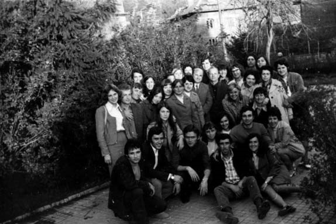

# 19. В Института за подготовка на културно-просветни кадри

Когато се преместихме в окръжния град, двете ми деца Красимир и Снежана, които
бяха ученици, се зарадваха много, макар че отначало цяла година живеехме на
квартира в горния край на града в една стая у семейство Стоицови, близо до река
Бистрица. След няколко месеца жена ми роди третото ми дете Николай. И тук ни
беше трудно, защото отначало цялото семейство издържах само аз, но в семейството
ни имаше много топлина, която ни правеше щастливи.

В Полувисшия институт имаше специалности за ръководители на културно-просветната
работа, театралната, музикалната и хореографската самодейност, както и по
библиотечното дело. Бях в Катедрата по културно-просветна дейност като старши
преподавател по основната дисциплина „Теория и методика на културно-просветната
работа“. Студентите в отделните специалности бяха все младежи и девойки, които
имаха изявено творческо отношение към проблемите на културата и просветата. С
тях се работеше прекрасно. Бях курсов ръководител на студентите от театралния
профил. Само за една година спомогнахме за разнообразяването и обогатяването на
културната дейност в Благоевград. Опитът ми като учител, свързан с провеждането
на театрализирани форми за възпитание с учениците, ми помогна. На сцената в
градското читалище, а много често и на сцената на градския театър, представяхме
пред гражданите рецитали, театрализирани тематични вечери и инсценировки,
свързани с важни събития от историята на България. Театрализираната тематична
вечер портрет „Аз не живея, аз горя“, посветена на Пейо Яворов, беше представена
няколко пъти заради изключително големия интерес на горноджумайци към великия
български поет и участник в македонските революционни борби.

>   *Със студентите от театралния профил в Полувисшия институт за
>   културно-просветни кадри в Благоевград отворихме нова страница в културния
>   живот на града. На снимката отляво е Пламена Гетова, известната българска
>   артистка, която беше моя студентка*

На 16.10.1971 година се проведе заседание на Катедрата по културно-просветна
работа за определяне на преподавател, който да бъде изпратен на специализация в
Института по културата в Санкт Петербург. Бях приятно изненадан от това, че
всички колеги предложиха мен, заради моята активна и задълбочена преподавателска
работа. Колегата Иван Кантуров, след като ме подкрепи, шеговито каза:

&minus;Вярвам, че колегата Попов може да „специализира“ по-добре своите руски
    колеги със своя натрупан опит в нашия институт.

    Партийният секретар го погледна със свити очи и почти просъска:

&minus;Никой не може да бъде по-добър от съветските колеги.

След дълго проучване чак през 1975 година бях изпратен за 10 месеца на
специализация в Петербургския институт по културата, заедно с колежката Росица
Йорданова от Варненския институт за подготовка на културно-просветни кадри. И
двамата бяхме безпартийни, но ни смятаха за най-добрите преподаватели, които ще
се представят достойно в чужбина.

