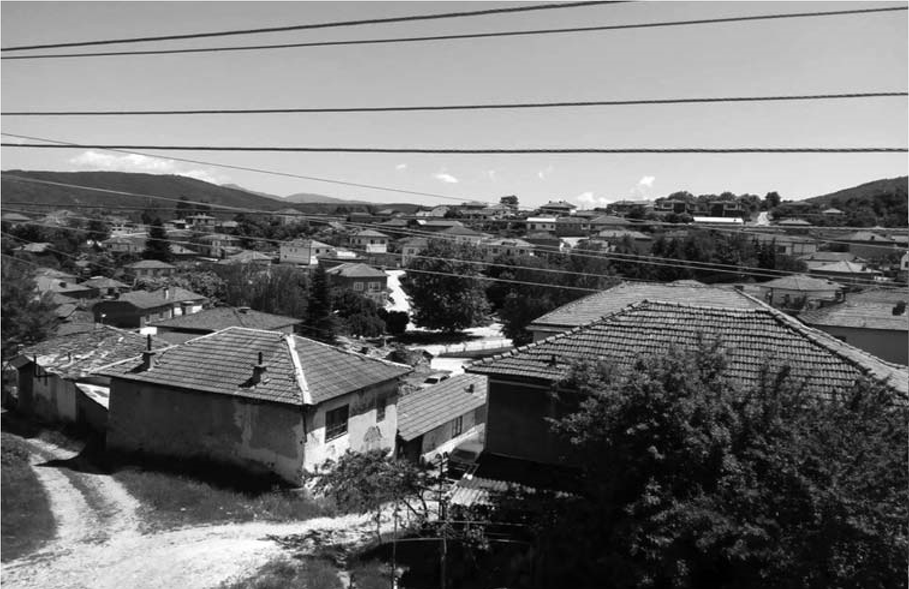

# 2. Моето родно село Либяхово

И днес, когато се завръщам в родното си село, възкръсват детските ми спомени,
които са пълни с неизмерима любов към хората, земята и къщите, които крият все
още в своите дувари толкова много неразкрити истини, радости, страдания и
стенания.

Ето как по време на пътуванията си по долината на река Места Васил Кънчов е
описал хубостите на моето родно село:

„Либяхово е разположено на един малък приток на р.Буровица (Мътница). Има
прекрасен вид от върха, гдето бях аз. Над него по върха се виждат обработени
ниви, а надолу – ливади“ – пише изследователят на Македония.

Когато Кънчов е посетил моето село, то е наброявало 300 български къщи, в които
живеели „разбудени“ български семейства. Нямало нито едно турско, помашко,
влашко или циганско семейство. През това време цели четиридесет години
коджабашия (кмет) на селото е прадядо ми Иван Зимбилев (Коджабашията). Още от
1870 година либяховци имат българско училище. Те стоят в редовете на първите
борци в борбата за национална и църковна независимост в Пиринския край.

Помня от детските си години моето родно село като едно от най-красивите в полите
на Пъзлак, Стъргач, Градище и Байрямка. Нямаше педя земя, незасята с нещо. В
селото имаше много стада (кози и овце), които се местеха от нива на нива.
Наторяваха къра, където растеше буйна ръж. А полето се тореше с гюбрето от едрия
рогат добитък. Така и най-високите места в селото се обработваха. Най-много
стадата се застояваха покрай Бука, на Байрямка, Киселичето, Качюлеца, Моянско
поляне, Горни лъки, Кириндол и Дойчова кория.

Пукнеше ли пролет, всичко позеленяваше. Чуваше се весела гълчава навсякъде,
понякога прекъсвана от кучешки лай. Девойките и младите булки се надпяваха по
нивите. Песните им достигаха до върховете, които заграждаха целия синор, после
се връщаха отново, за да полеят с мелодията си равнините на Вълканче, Долни лъки
и Кирин дол. Орачите подвикваха на воловете, а овчарите засвирваха с кавалите и
пискуните си, направени саморъчно от самите тях.

Беше истинска народна веселба, когато се работеше. Затова нямаше умора. Песните
и подвикванията изпълваха сърцата с радост и доволство. Работливите селяни се
надпреварваха по нивите. Когато слънцето се скриваше зад Пъзлак и започваше да
се смрачава, копачки и орачи се прибираха в селото. Песнопойките се надпяваха
докато се приберат по домовете си. Доволни бяха всички от извършената работа.
Децата подскачаха пред майките и бащите си, които ги хвалеха за хубавата им
работа на нивата.

Много често отделните родове се събираха заедно, за да се редуват при прашитба
на нивите, засети с тютюн и мисир (царевица). Най-често се събираха по време на
жетварските дни, вършитбата и вечерите по плевните, когато се ронеше царевицата.
Така бе по-весело, и на нивата, и пред трапезите, които се правеха под някоя
дебела сянка на старо дърво.

В дъждовните дни през пролетта и лятото река Мътница (някои я наричат Буровица),
която извира от югоизточните поли на Али ботуш, полудяваше, когато минаваше
покрай нашето село. Тя събираше десетки приточета от югоизточните върхари на
Пирин, Стъргач и Папазчаир. Минаваше лудо през нашите местности Песците,
Кириндол, Вълканче, Борчика, след което се скриваше укротена в Клисурата. Но
когато излизаше от нея, отново разстилаше снага през полето на Долни лъки.
Нейният път продължаваше през Долна клисура, покрай село Петрелик и Долна
Сингартия, след което се вливаше успокоена в река Места.

Много често Мътница беше страшна, много страшна. Тогава тя помиташе дългия
дървен мост, който мъжете от селото издигаха от Долния Бунар до нашата нива на
отсрещния бряг, откъдето започваше пътя за местността Вълканче.

Един от притоците на р. Мътница идваше от Пазлак. Минаваше през Горната махала
на нашето село, свиваше снагата си покрай площада и вече, заприличал на малка
река, се вливаше в Скока. Това е дерето, което събираше водите и от другите
краища на селото и се вливаше при местността Менгенето в Мътница.

Когато имаше проливни дъждове, хората от нашата махала се събираха на Поляната,
откъдето с поглед се прегръщат не само къщите на цялото село, но и околните
върхове, някои от които бяха разделени с голяма болка на „наши“ и „гръцки“. Само
по-силните мъже не се страхуваха и отиваха до Долния бунар, където укротяваха
буйните вълни на придошлата река. А тя беше страшна, много страшна, защото
носеше всичко, което бе разкъртила и го поднасеше на река Места, която го
събираше в своите широки скути и носеше на Бяло море.

Беше трепетно време, което е легнало здраво в моята памет. Сега спомените за
него ме спохождат в сънищата, които ме връщат десетки години назад.

Мисля си, че ако не възкръсне миналото, преживяно от нас време, няма ли да
опасност да опустошеят и душите на нашите деца и внуци. Те трябва да знаят за
нашето детство, за младостта ни, за радостите и мечтите ни, за да не увехне
родовата им памет. Сегашното и идните поколения на моето родно село ще бъдат с
по-богати мисли и чувства, ако запазят спомените, разказани или написани от нас.
С тази родолюбива задача се захванах, когато започнах да пиша тази книга.

Бях малък, много малък, но помня, а и в сънищата ми възкръсва преживяното. Не
само семейството, но и родът ни беше осиротял след злодейското убийство на дядо
ми и неочакваната смърт на чичо ми Стефан, свързана с тежкото му преживяване.
Той не е могъл да понесе страшната истина, че братът на жена му става убиец на
баща му. Това могат да го направят само изчадия, какъвто е бил Димитър
Панчелиев, син на секретаря на комунистическата партия в нашето село.

Тежко, много тежко беше на всички ни в голямото, осиротяло семейство. Заедно с
нас, в къщата ни бяха и двете ми лели Стоянка и Мехалина, които като деца
загубили майка, баща и брат. Живеехме заедно и с чичо Петър. Баща ми, макар и
по-малък от чичо, беше наставник на всички. Той носеше не само хубостта, но и
чертите на дядо. Когато ни беше много трудно, татко ни милваше с поглед, а чичо
прокуждаше мъката ни с песни, които запявахме всички по време на работа.
Най-много пеехме при низане на тютюна. Отпявахме се до полунощ. Често ни
припяваха и съседите от Бродевия, Божковия, Гаховия, Ковачевия, Малаковия,
Халембаковия и Мангушевия двор. Започнеше ли някой да пее, захващаше цялата
махала. А песните бяха от хубави по-хубави. Грабваха веднага сърцата и мислите
ни. Имаше и такива песни, които с текста и мелодията си пълнеха очите ни със
сълзи. Разказвашесе за македонските комити, които са прекършили своята младост в
борбата с османлии, или пък с предателите на народа.

Често ни гостуваха сватовците дядо Петър Малев и дядо Нашко Божков. Понякога
заедно с тях идваха и техните съпруги, баба Матина и баба Мария. Покрай нашето
огнище, в комитската стая, се събираха на раздумка баща ми и двамата негови
сватовци, които тачеха революционното дело на дядо ми като войвода и разказваха
с възторг за него. И те се гневяха от онези, които наричаха нашето семейство
„фашистко“. Макар че дядо Петър Малев беше един от основателите на партийната
група в селото, а дядо Нашко негов симпатизант, никога не чух между тях и баща
ми да има „престрелка“с думи. Разговаряха като хора с различни идеи така, както
в наше време не разговарят псевдополитиците. Понякога говореха открито против
партията, която беше объркала техните мисли и чувства. Наричаха някои от нейните
членове „касапи“ заради жестокостите им.

У нас много често идваха и децата на дядо Георги Зимбилев, който е бил
най-добрият помощник на дядо ми като войвода. Братя Зимбилеви – Димитър и
Атанас, бяха неразделни с баща ми. Обръщаха се винаги един към друг с думата
„брачед“ (братовчед). Когато имаше селски веселби, тримата бяха сред най-добрите
хороводци. Спомням си, на един от великденските празници цялото село се беше
стекло на Поляната. Под големия бряст бяха се събрали бабите и дядовците, до тях
невестите, а в средата на поляната кандидатките за женитба, заедно с онези,
които се учеха от тях. На детската поляна, близо до Пашовата къща, пък играеха
децата. Татко беше повел хорото, а до него братя Зимбилеви. Пееха и играеха
всички. Не знам дали другаде можеше да се види такава красива веселба.

Друго място, където се събираше цялото село, бе Ширината, площада на селото. И
тук хората бяха на три места. Най-голямо бе хорото на кандидатите и кандидатките
за женитба. На него се харесваха бъдещите младоженци. До Малаковата къща пък
беше „семейното хоро“, където се събираха младите семейства. Пред портата на
Захариевата къща виеха своето хоро най-малките, децата на селото.

Понякога, в обикновените делнични вечери, веселбите се правеха по махали. Тогава
се надпреварваха с песните си момичетата и момчетата от Жабарската, Даскаловата
и Пъзлаканската махала. Дочуваха се и песните, които звучаха по-тихо от
местността Свети Атанас. Там, под големите дъбики, се събираха младите от
Гюровия, Воденовия,Чипиловия, Калайджиевия и близки до тях други родове.

През летните неделни дни младежите и девойките се събираха извън селото.
Широкият път на местността Башлейка беше място за разходки най-вече на
влюбените. Там се събираха на групички всички младежи и девойки от селото, които
се надпяваха. Покрай пътя, скупени на групички по широките ливади, се провикваха
най-палавите ергени и задяваха влюбените.

Друго място извън селото, където се събираха младите, беше Вълковица. Там
разходките започваха от училището и стигаха до Варницата, където имаше чешма с
два чучура.

Най-големият празник на Либяхово беше на местността Свети Илия. Сутринта, след
изгрев слънце, цялото село се стичаше към голямата поляна на Вълканската кория.
По пътеките от Садово на големи групи прииждаха и гостите от другите села, които
идваха да празнуват заедно със своите роднини и съседи.

Отделните родове и фамилии застилаха чисти шарени черги, наслагваха се вкусни и
разнообразни гозби, насядваха семейство до семейство, род до род, цялото село на
едно място, а сред всички – и гостите, които бяха на особена почит. Сладко беше
яденето сред толкова хора, но още по-сладки бяха раздумките между тях.
Необятната гледка на цялото землище на родното село сграбчваше очите, за да
покаже хубостта си.

На този хубав празник момите и ергените захващаха първи веселбата, завиваха
дълго хоро, на което се хващаха и млади, и стари. Който не можеше да играе, се
червеше от срам. Веселяха се всички до насита. Разбира се, имаше и сергии,
състезания и какво ли не още. Много неща се промениха оттогава. Промениха се и
хората. Немалко от тях се разпиляха през т.нар. години на „народната власт“ по
далечни краища на страната, но в мислите им остана неугасващият плам за родното
село, заело най-топлите кътчета в сърцата им. Останалите в него комунисти
преместиха събора от Вълканската кория на ливадите до Гьолевия дъб, където бяха
създали тяхната партия. Така разпиляха и разделиха хората и селото.

Ех, мое незабравимо, изстрадало минало !

Няма да те залича от моята памет. Но искам за теб да знаят и внуците ми, затова
те възстановявам в спомените си.

Не мога да отмина и Георгьовденския празник, когато едни оставаха на веселбите в
селото, на Поляната и Ширината, но други ставаха рано, преди изгрев слънце, и
през Горни лъки тръгваха за Горна Сингартия, където е манастира „Свети Георги
Победоносец“. След участието си в ритуалите на манастирския двор, поемаха
обратно по пътя си към село, за да не изпуснат тукашните веселби.

Кой казва,че нашето минало е било черно? Мисля си, че в миналото имаше повече
радост в душите на хората и светлина в очите им. Нищо, че понякога работата беше
непосилна. Тя ги каляваше и сплотяваше. В нея се съхранявахаонези нравствени
добродетели, които понякога сега не можем да срещнем даже и в роднинските
взаимоотношения, които са наранени от новото време на непрокопсания
посткомунистически преход.

Децата в моето родно село бяхме научени от родителите си да подхващаме отрано
всяка работа, която трябваше да се върши в семейството. Още от малък баща ми ме
научи на всичко, което той също още като дете бе усвоил. Изпращаше ме да бера
дърва от местността Бука. Не се страхувах, въпреки че това беше гората до самата
граница, откъдето се вглеждах в съседните български села, останали вече под
гръцко владение. При копаене на тютюна се нареждахме всички деца, заедно с
майка. Тя ни наставляваше как да копаем и да пазим стъблата на тютюна от
нараняване. Надпреварвахме се. Братчето ми Китан винаги водеше баша. Той не се
изправяше докато не изкара реда.

През тези години семейството беше първото училище, в което научавахме
най-важните правила в живота. Родителите ни бяха строги, но добри учители, от
които научавахме всичко, което определяше нашето мислене и поведение.  

