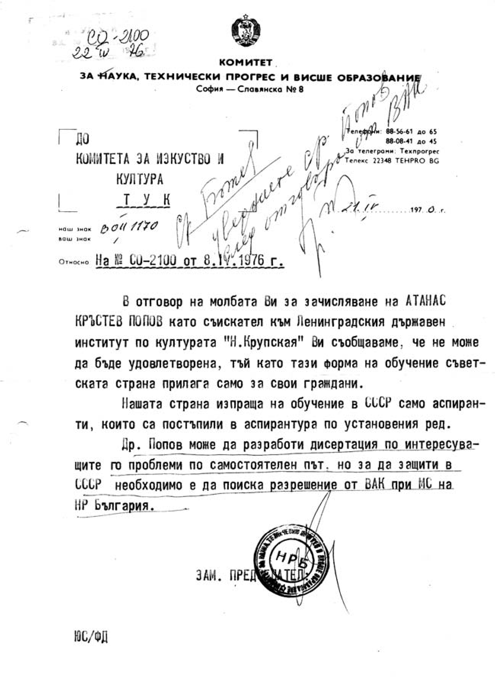

# 22. Неуспешно предложение да защитя кандидатската ми дисертация в Петербург

След конференцията ректорът на Института по култура проф. Е.Я. Зазерски,
придружаван от проф. Светлана Иконникова и проф. Димитрий Генкин, ме поканиха на
разговор, при който отново настоятелно ме помолиха да се съглася защитата на
кандидатската ми дисертация да бъде при тях, а не в България.

Светлана Иконникова ми каза направо:

– Атанасе, скоро бях в твоята страна и ми направи неприятно впечатление, че
вашите изкуствоведи са далеко от педагогиката. Но педагозите ви пък са отлъчили
тяхната наука от изкуството. Те са започнали да подготвят пионерски и дружинни
ръководители, но стоят далеко от всички процеси в областта на изкуството и
социалния живот, които имат ярко изразени възпитателни възможности.

Съгласих се, защото наистина у нас педагогическата подготовка на студентите в
тогавашния Софийски университет беше съвсем ограничена преди всичко в областта
на дидактиката и новите специалности за пионерски и комсомолски ръководители. В
едно от писмата, което получих от проф. Стефан Чернев, той също ме уверяваше, че
от педагогическия факултет няма да се намери рецензент на дисертацията ми,
защото тя изисква по-широки знания както в областта на изкуството, така и по
етнографските науки. През тези години силното политизиране на подготовката на
педагогическите кадри попречи да се обхване дейността в нашите читалища, която
има ярко изразен педагогически характер. Повечето от тогавашни педагози бяха
отписали нейните образователни и възпитателни аспекти. Именно този пропуск в
обекта и предмета на педагогическата наука ми даде основание да кандидатствам за
преподавател в Института за подготовка на културно-просветни кадри.

>   *Проф. д-р Димитрий Генкин, ръководител на Катедрата по културно-просветна
>   работа в Института по културата в Петербург*

През пролетта на 1976 година започнах усилена подготовка за кандидатския минимум
и завършване на дисертацията. Тези задачи бяха определени от ръководството на
Института по културата като основни в програмата ми. От 4 до 15 юни се явих на
изпити по философия, педагогика и културно-просветна работа, които взех с
отличен успех (вж. Удостоверение № 912 1 1976 г.) На 25 юни на обединено
заседание на катедрите по културно-просветна работа и масови представления бе
обсъдена кандидатската ми дисертация на тема „Мястото и ролята на
театрализираните форми при възпитанието“. Заседанието се ръководеше от проф.
А.Г.К.Соломоник. След моята концепция за изследването и основните резултати от
него бяха прочетени реценции от проф.А.И. Новиков, доц. Маргарита Кузмина и доц.
Володя Аксенов, които дадоха висока оценка на дисертацията ми. Научният ми
ръкодител проф. Д.М. Генкин подчерта, че дисертацията ми е оригинално научно
изследване, което има комплексен характер с ярко изразени научни приноси не само
в педагогическата наука, но и в областта на културата. След направените други
изказвания от участници в заседанието беше прието решение, в което е написано:
„Научната новост в изследването и актуалността на изследвания проблем;
репрезантивността на данните и добрата разработка на методиката, в резултат на
което е налице достоверност и обоснованост на направените изводи и практическото
значение на дисертацията за подобряване на възпитателната работа (вж. Протокол №
16 от 25 юни 1976 г.).

Направено бе предложение да бъда допуснат до защита на кандидатската дисертация.

По официален ред ръководството на Института по културата изпрати писмо до
Председателя на Комитета за изкуство и култура и директора на Института за
културно-просветни кадри в Благоевград, в което се прави висока оценка на
специализацията ми и предаването на моя богат личен опит като педагог, който бе
внимателно проучен и използван от моите руски колеги. „Считая, что программа
стажировки ст.преподавателя А.К.Попова полностью вьполнена, кафедри специално
отметили високий уровень ответственности А.К.Попова, показавшего себя опитни
културопросветчиком, ерудированним иследователем, хорошим организатором (вж.
Писмо № д 77 от 5 юли 1976 г.).

Още на 8 април 1976 г. зам.-председателят на Комитета за изкуство и култура
Любен Василев изпрати писмо до Президиума на Висшата атестационна комисия, в
което пише: „ Като имаме предвид, че в България няма научен съвет по тази
специалност (става дума за културно-просветната работа), а нуждата от
високоспециализирани преподавателски кадри и специалисти за културно-просветната
дейност и за институтите, които подготвят кадри е особено осезателна, Комитетът
за изкуство и култура Ви моли настоятелно да направите необходимото за
зачисляване на свободна аспирантура и защита на научната степен „кандидат на
педагогическите науки“ в Ленинградския държавен институт по културата“.

С писмо № А – 68 – 725 от 14 април 1976 г. председателят на Висшата атестационна
комисия акад. Л. Илиев дава следния отговор на молбата на зам.-председателя на
Комитета за изкуство и култура Любен Василев: „Съобщаваме Ви, че въпросите
относно зачисляването на български граждани за аспиранти в СССР са от
компетентността на Комитета за науката, технически прогрес и висше образование“.

Ето пък отговора на Комитета за науката, техническия прогрес и висше
образованието, даден на 21 април 1976 г.: „Др. Попов може да разработи
дисертация по интересуващите го проблеми по самостоятелен път, но за да защити,
е необходимо да поиска разрешение от ВАК при МС на НР България“.

От взаимно изключващите се отговори на двете институции става ясно, че те нe
решават този въпрос, защото тяхната дейност се ръководи и контролира от висшите
партийни органи, където са списъците на онези, които безприпятствено могат да
защитават дисертации, където си поискат.

Ректорът на Института по културата проф. Е.Я Зазерский изпрати писмо до
председателя на Висшата атестационна комисия в България, в което предлага
защитата на кандидатската ми дисертация да бъде направена в Специализирания
научен съвет, който функционира в института и има право да дава научната степен
кандидат на педагогическите науки по специалност 130005 „Културно-просветна
работа“ (вж. Писмо № Д 76/5 юли 1976 г.). Комунизираната Висша атестационна
комисия не отговори на молбата на ректора на Инсттута по културата в Петербург
проф. Е.Я. Зазерский. Основната причина за това е, че аз съм безпартиен и не съм
включен в списъка на превелигированите номенклатурни кадри на ЦК на БКП, които
се зачисляваха формално като дисертанти в бившия Съветски съюз и защитаваха „за
бог да прости“ кандидатски дисертации.

Бях повикан на разговор от ректора на Института по културата, който беше
възмутен от българските институции, които според него са разделили кадрите в
страната на „свои“ и „чужди“. На „чуждите“ като мен, които бяхме определени като
„неблагонадеждни“, не се даваше възможност да защитават кандидатски дисертации
извън страната.

Ректорът на Института по културата беше учуден от това, че аз спокойно за
пореден път посрещнах „специалното“ отношение на комунистическата власт в
България към мен като неин „враг“. Благодарих му за голямото внимание на всички
колеги от Института по културата, проявено към мен, и го помолих да не
задействат процедурата за защитата на кандидатската ми дисертация при тях. Това
мое решение го учуди и ми каза:

– Атанасе, това е сталински подход към кадрите, какъвто у нас вече не се
използва. Изглежда, че в България нищо не се е променило.

Тези думи на ректора Зазерский не ме изненадаха, защото ги бях слушал вече от
проф. Генкин и проф. Иконникова. Отново го помолих да не откриват процедура за
защита на дисертацията ми при тях. Казах му, че ще опитам в Софийския
университет, където някои от педагозите бяха далеч от тези истински
педагогически проблеми, но вярвах, че дисертацията ми не може да не грабне
вниманието им.

