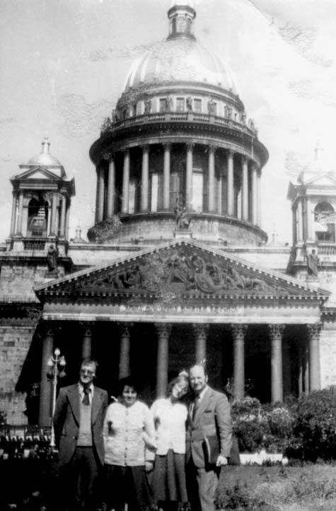
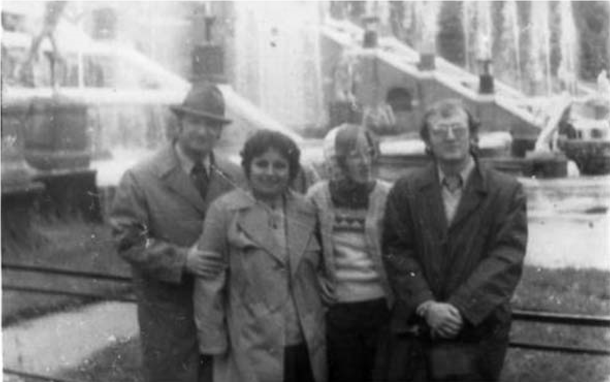

# 23. Семейството ми получи покана да гостува в Петербург

Преди да изляза от кабинета на проф. Зазерский, той ме погледна и като разбра,
че понасям спокойно поредната преграда пред научната ми кариера от българските
власти, ме попита дали са ми идвали тук на гости жената и децата. Усмихнах се и
му казах:

&minus;Какви гости мога да посрещам при това напрегнато ежедневие, което имах при
    Вас? Освен това, не бях сигурен, че семейството ми ще получи разрешение от
    българските власти да ми гостува.

Проф. Зазерескй ме хвана под ръка и ме заведе при секретарката му. Още от
вратата ѝ нареди:

&minus;Напиши покана от мое име до жената и децата на нашия прекрасен приятел от
    България!

Това беше за мен неочаквана приятна изненада. Секретарката записа трите имена на
жена ми и двете деца. След няколко дни научих, че те се зарадвали много и се
подготвели да пътуват за Петербург.

След като моите колеги от Института по култуарата разбраха, че българските
власти не разрешават на безпартийните да защитават дисертации дори и в
„братския“ ни „велик“ Съветски съюз, те започнаха да ме търсят непрекъснато, за
да изразят възмущението си от прилагания сталински класово-партиен подход в
България. Те не знаеха, че при всяка стъпка в жизнения ми и професионален път
техните български „братя“ изправяха бариера, която ми пречеше да вървя напред.
Да си призная, вътрешно бях удовлетворен, защото у нас вече имаше формирано
отрицателно отношение към партийните и комсомолски кадри, които получаваха „за
бог да прости“ научни степени и звания в Москва.

Мислите ми вече бяха в очакване на семейството ми, което за първи път щеше да
пътува извън България. В деня, когато жена ми, синът ми Красимир, който беше
студент, и дъщеря ми Снежана, ученичка в гимназията, пристигнаха с влака през
Москва в Петербург, един след друг ми се обаждаха по телефона най-добрите ми
приятели от Института по културата. Те настояваха да им гостуваме. Проф. Д.
Генкин, проф. Иконникова и доц. М. Кузмина ги изпревариха. Те бяха вече поръчали
места в ресторанта на хотела, в който бях настанен, за да посрещнат семейството
ми.

Вечерта на посрещането беше неизмеримо вълнуваща. Моите приятели обсипаха
семейството ми с цветя и подаръци. Започна непринуден разговор за хубава
България, а след това и за още непознатия за семейството ми Петербург. Проф.
Иконникова и Карина, съпругата на проф. Генкин, забелязаха, че дъщеря ми е
уморена от дългото пътуване, и я попитаха:

&minus;Снежана, ти искаш ли сладолед, за да те разведри?

Повикаха сервитьорката, но се оказа, че в ресторанта нямаше от сладоледа, който
те харесваха. Станаха двете и Светлана каза на Карина:

&minus;Ну сдавай, Снежана хочет марожоное!

За наше учудване те излязоха от ресторанта и след около 15 минути се върнаха с
разноцветен сладолед. Оттогава това обръщение към дъщеря ми стана парола между
нас и моите приятели, с която трябваше да преодоляваме всяка трудност, която
срещахме при решаването на някои проблеми.

Почти всеки ден някой от приятелите ми от Института по културата ми звъняха по
телефона и настояваха да им гостуваме със семейството ми. Вечер се връщахме
уморени от посещенията, които правехме на най-красивите и забележителни места в
Петербург, които вече познавах, защото много често в почивните дни по време на
специализацията ми моите приятели продължаваха да ме запознават с историческите
и културни забележителности на този град, който ме омайваше със своята красота.
В Ермитажа ходех най-често сам, защото беше до самата сграда на Института по
културата. На излизане се разхождах по брега на Нева, а преди да си тръгна,
минавах през Марсово поле с вечния огън. А след това покрай Зимния дворец, та
чак до Невский проспект, главната улица на града.

Все още пазя поканата, която получих за официалното откриване на фонтаните в
Петерховския дворец. Когато бях там, мислите ми потъваха в друго време. Любимо
място за разходка ми беше и Павловския парк. С часове разглеждах Екатерининския
дворец с неговата кехлибарена стая и ненагледния дворцов парк. Не забравях да се
разходя и покрай Петропавловската крепост, но най-чести бяха разходките ми
покрай златния купол на Исакиевската катедрала.

Къде ли не бях, какво ли не видях в Петербург? Преживях романтиката и на белите
нощи, но усетих и непоносимия студ на зимните вечери. Сега запознавах милото ми
семейство с всички тези забележителности на най-красивия град в Русия.

Професор Иконникова и съпругът ѝ Вадим дойдоха един ден в хотела и поискаха да
ни разходят из Петербург. След това обаче разбрахме, че целта им е била да им
гостуваме в хубавия дом на ул. „Московска“. Светлана се привърза много силно към
семейството ми. Назоваваше с неизмерима топлина малките имена на всички ни. Не
криеше, че за първи път е обикнала толкова силно приятелско семейство от
България. В дома ѝ ни разтвори всичко, за да покаже и нейното семейство, към
което и ние отвърнахме с голяма привързаност. Когато разглеждахме семейния албум
и филма, направен на сватбата им с Вадим, видяхме най-голямата красавица на
Петербург, която става и една от водещите учени не само в родния ѝ град, но и в
цяла Русия. При разходката ни из Петербург Светлана държеше здраво с двете си
ръце жена ми и дъщеря ми и не изпускаше да им покаже всичко, което още не знаеха
за красивия град.

>   *Пред Исакиевската катедрала със семейството ми*

Дните по време на гостуването на семейството ми в Петербург минаваха бързо и
неусетно, защото не остана забележително място, което да не бяхме видели заедно.
Там, където бях минал вече аз, минахме заедно с жена ми и децата, които се
завръщаха в хотела, изпълнили душите си с радост и доволство от видяното и
преживяното. Понякога съжалявахме, че не дойде в Петербург и малкият ми син
Николай, който беше на 5 години. Руските приятели ни уверяваха, че за него щеше
да се погрижат по-специално като му намерят връстници, с които да си създаде
трайни връзки и взаимоотношения.

Изпращането на семейството ми от Петербуг беше подготвено от семейство Генкини.
Вечерта беше неописуемо вълнуваща. Карина, съпругата на проф. Д.Генкин, показа
своите домакински способности да посреща и изпраща гости, както това са правили
някога в известния ѝ богат род в Петербург.

>   *Пред Ермитажа в Петербург*

>   *Пред фонтаните на Петерховския дворец*

По време на вечерята се чуваха старите руски наздравици и пожелания, на които
ние отговаряхме с български. Отново бяхме с двете семейства Генкини и
Иконникови, но сред нас бяха и едни от водещите преподаватели от Института по
култура. Никога няма да забравя шегите, разказвани с голямо майсторство от
режисьора Е.В. Вершковски.

Преди да си тръгнем от дома на Генкини, забелязахме, че синът им Павлик и моя
син Красимир ги няма. Отначало се притеснихме, но след това разбрахме, че Павлик
е поискал да покаже на сина ми истината за нощния живот по улиците на Петербург.

След като се върнах от специалзация в Петербург, предложих дисертацията ми в
Специализирания научен съвет по педагогика в Софийския университет. Оказа се, че
проф. Стефан Чернев беше прав, когато ми каза, че българските педагози са твърде
ограничени в своята научна област. Техните изследвания бяха насочени най-вече
към проблемите на възпитателната работа в четите „Чавдарче“, ДПО „Септемврийче“
и ДКМС. На тази тематика някои от тях защитиха дисертациите си. За тях нямаше
никаква преграда, защото имената им бяха в списъците на партийните и комсомолски
номенклатурни кадри, които утвърждаваха сталинската политика на Българската
комунистическа партия в педагогическата наука.

И така, у нас не се намериха рецензенти от педагозите за моята кандидатска
дисертация, в която се анализират възпитателните аспекти на тетрализирани форми,
широко използвани от нашия народ и през най-тежките години на турското
потисничество. Изключение в това отношение правеше проф. Жечо Атанасов, който
прояви голям интерес към дисертацията ми. Той оцени високо нейните научни
достойнства и недоумяваше защо не ми бе разрешено да я защитя в Института по
културата в Петербург. Като председател на Специализирания научен съвет предложи
за рецензенти директора на Института по културата при БАН проф. д-р Елит Николов
и доц. Вяра Михайлова от Философския институт.

