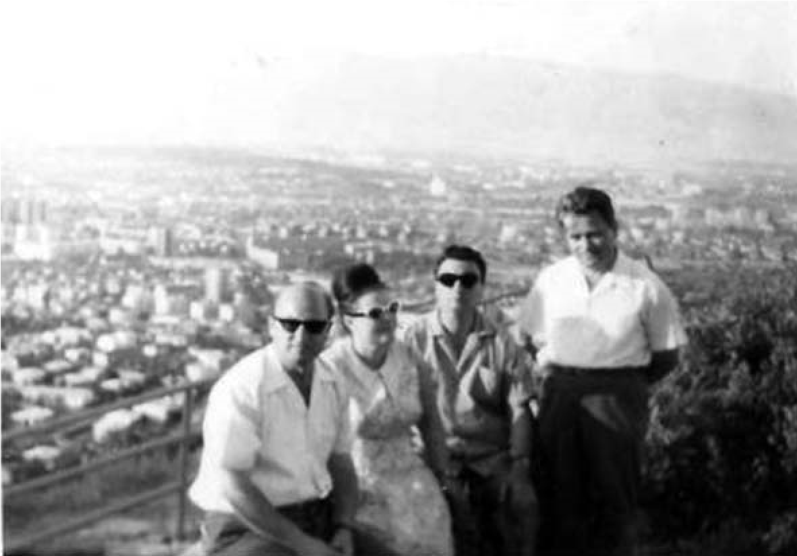

# 24. Наказанието ми за „подронване авторитета на партийното и държавно ръководство“, наложено преди защитата на кандидатската ми дисертация

През учебната 1977 година в Института за културно-просветни кадри в Благоевград
се очертаваха две основни групи преподаватели. Едните бяхме в областта на
професионалната подготовка на студентите, а другите бяха по идеологическите
дисциплини. Моите научни интереси бяха много близки с тези на колегите Любен
Лазаров, Златко Коцев и Иван Кантуров, с които се сближихме много. И понеже ние
бяхме безпартийни, партийното ръководство на института ни гледаше под око.
Правеше ни неприятно впечатление, че някои от преподавателите комунисти нямаха
подчертани професионални интереси в областта на културно-просветната работа.
Един от тях беше известно време секретар на партийната група и проявяваше съвсем
открито своята посредственост в преподавателската си работа. След моето
завръщане от Петербург и той замина на специалишзация, но поради слабото му
представяне се завърна далеч преди изтичане на определения срок. За него вече се
знаеше и говореше, че колегите от Института по културата в Петербург недоумявали
за непростимата му посредственост като преподавател по културно-просветна
работа.

На държавните изпити бяхме в една комисия с „прогонения специализант“. При
оценяването на студентите беше крайно субективен и нанасяше незаслужени обиди на
някои от студентите. Спомням си, че когато една от най-талантливите студентки в
института Пролет Николова, която беше поетеса, говореше за народните традиции в
областта на културата, той като партиен секретар ѝ постави въпрос за ролята на
Българската комунистическа партия при тяхното осъвременяване. Студентката ме
погледна и каза:

&minus;Мога ли да кажа това, което мисля? Но това няма да се хареса на вашия колега
    и се страхувам не само за себе си.

&minus;Кажи, кажи! – настояваше партийният секретар.

&minus;Добре! Ще кажа! Вашата партия, другарю партиен секретар, опошли някои от
    най-красивите културни традиции като ги политизира.

&minus;Стига! Двойка! Свободна си. Ще се явиш на поправителен!

&minus;Колега, как така, двойка? – попитах побеснелия от гняв партиен секретар.

Обърнах се към Пролет и ѝ казах:

&minus;Колежке, продължи да говориш по втория въпрос, но спокойно, без да се
    притесняваш.

Стана голям скандал. Партийният секретар, който е бил тракторист преди да
завърши висшето си образование, си нямаше хабер от проблемите на
културно-просветната работа, ме погледна заплашително и излезе.

На следващия ден ръководството на партийната организация е провело специално
заседание за обсъждане на моето поведение. Бях обвинен, че се опитвам „открито
да руша авторитета на други преподаватели и създавам конфликти, ръководейки се
от неправилни, крайно субективистични мнения и оценки“ и „пряко или косвено руша
и авторитета на партийното и държавно ръководство в Института“ и че всичко това
е в прониворечие с моите задължения в учебното заведение.

Предишният партиен секретар добавил и случаят, свързан с нарушаването, което съм
допуснал за неспазване указанията на партийното ръководстово по време на
преименуването на студентите българомохамедани. Наистина, тогава не спазих
партийното изискване да не се изпитват тези студенти, докато не си сменят
имената. Тогава при мен дойде студентът Асан Газиев от с. Абланица, който беше
член на партийната група, и ми каза:

&minus;Чудя ви се! Не се ли страхувате? Има решение на партийната организация
    докато не си сменим имената, да не ни изпитвате, а само вие не го спазвате.

Погледнах Газиев и му отговорих:

&minus;Не искам преподавателската ми работа да бъде зависима от вашите партийни
    решения. Колко пъти вече партията ви сменя или връща имената? Това съм го
    преживял, когато бях учител в Туховище и Дъбница.

Получих заповедта за наказание, която посрещнах с голяма изненада. Един от
колегите ме посъветва да не се заяждам с партийния секретар, защото мога и да
„изгоря като нищо“.

Цяла нощ не заспах. Четох няколко пъти заповедта за наказание и си казах:

&minus;Те, комунистите, навсякъде са от една и съща нечовешка порода. От тях
    спасение няма. Нищо, така ми е било писано. Но няма да им се предам.

Реших да подам молба за напускане на института, която изпратих до Комитета за
изкуство и култура. Колегата Любен Лазаров дойде при мен и ме помоли да си
оттегля молбата, защото ми предстоеше и защита на дисертацията, която бях
подготвил.

&minus;Наско, ще ти попречат. Ти да не мислиш, че издаването на тази заповед е
    случайно.

&minus;Не мога, Любе. Ти сам им яде попарата. Нали и ти не наведе гръб на Кръстьо
    Горанов, който ти попречи да защитиш дисертацията си?

Когато в Комитета за култура и изкуство получили молбата ми за напускане,
зам.-председателят Василев извикал началника на отделя Христо Бабиков и неговия
заместник Ботьо Ботев и им казал:

&minus;Е, тази няма да стане. Всеобщо е нашето признание, че старши преподавателят
    Атанас Попов е единственият от трите института, който се занимава с
    научно-изследователска дейност в областта на културно-просветната работа.
    Нито във Варненския, нито в Хасковския институт имаме такъв преподавател в
    тази област. Негов е и първият учебник по тази учебна дисциплина. Ако Попов
    напусне института, ще се надигнат и студентите. Неговите публикации в нашия
    методически кабинет се ползват като указания за работата в читалищата и
    другите културно-просветни учреждения. Без него ще пострада и работата ни в
    националния методически център. Не е случайно, че напоследък както
    Министерството на образованието, така също и Централният съвет на
    профсъюзите го използват за обучение на техните кадри. Ако уважим молбата
    му, те ще го привлекат веднага на работа при тях.

Един ден Ботев ми се обади по домашния телефон и ми предаде поздрави от всички в
техния отдел, към който се водеха полувисшите институти за културно-просветна
работа. Каза ми:

&minus;Утре идваме цяла комисия да проверим дали е вярно, че подронваш авторитета
    на партийното и държавно ръководство. Дори и да е така, нека това
    ръководство помисли за своя стил на работа, който и ние не харесваме.

Цялото партийно бюро се беше подготвило за тази среща с комисията от Комитет за
изкуство и култура. На мен ми каза последния час секретарката, че трябва да бъда
в института.

Членовете на партийното бюро бяха разпределили ролите и местата си, които
трябваше да заемат, за да посрещнат комисията. Предварително бяха направили опит
да настроят и безпартийните колеги срещу мен.

Разговорът започна неочаквано неприятно за партийното ръководство. Молбата ми за
напускане не е била приета и критиката не беше отправена към мен, а към онези,
които бяха скалъпили обвиненията срещу мен. Смела защита ми направиха и моите
колеги Любен Лазаров, Златко Коцев и Иван Кантуров. Бях приятно изненадан и от
колежката Росица Червилова, която не приемаше решението на нейното партийно
ръководство за наказанието ми. Колегата Йордан Йорданов също недоумяваше от
наложеното наказание срещу мен. Обвинителите замълчаха като разбраха, че
Комитетът за изкуство и култура застава твърдо зад мен. Група студенти бяха
научили за наказанието ми и изчакваха членовете на комисията, за да изразят
своето недоволството от нелепо издадената заповед.

Помолен настоятелно от членовете на комисията, не напуснах института. Така се
успокои и семейството ми. Започнах усилена подготовка за защитата на
дисертацията ми в Софийския университет.

През тези трудни дни при мен често идваха най-добрите ми приятели Любен Лазаров
и Златко Коцев, който е истинският създател на ансамбъл

„Пирин“. Тримата бяхме недолюбвани от партийното ръководство, но винаги търсени
от студентите, които не скриваха своята привързаност към нас. След юбилейното
честване, което с Любчо подготвихме на Златко, неговата жена Цветанка му
предложила да ни поразходи с колата му в Македония. Къде ли не ходихме, какво ли
не видяхме, но най-много се задържахме на Охридското езеро, където престояхме
няколко дни.

>   *В Скопие се качихме на високия хълм, от който с поглед прегръщахме града,
>   който още страдаше от страшното тогавашно земетресение*

Когато подадох документите в Специализирания научен съвет по педагогика в
Софийския университет за защита на кандидатската ми дисертация, не представих
характеристика от ръководството, защото не ми беше дадена такава. Някои от
колегите ме посъветваха да се помиря с директора и партийния секретар и да ги
помоля да не ми пречат, за да защитя кандидатската си дисертация. Те бяха
уверени, че без характеристика няма да се състои защитата. Не приех техният
съвет, защото забелязах голям интерес от известни български учени към
кандидатската ми дисертация и свързаните с нея мои публикации.

