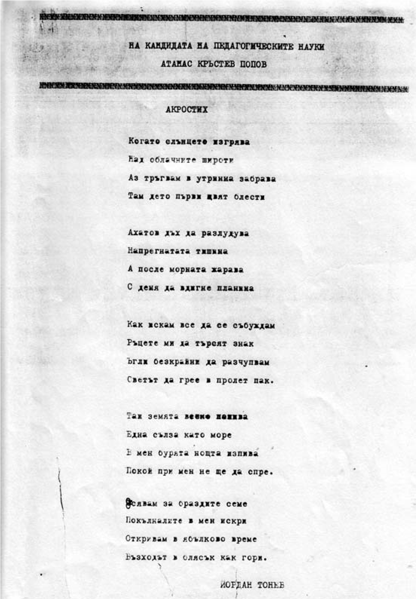
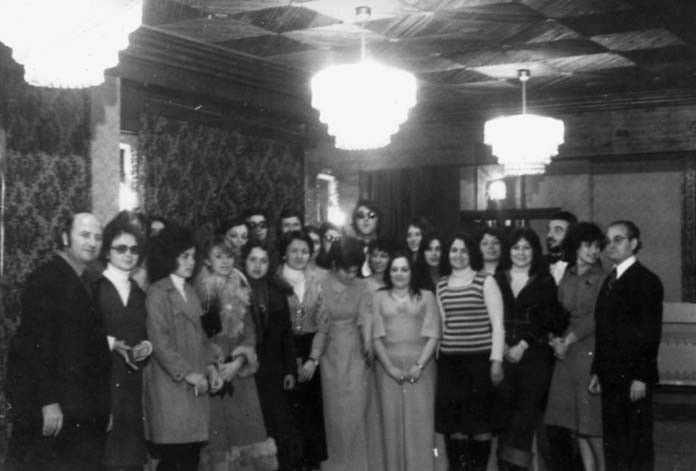

# 25. Защита на кандидатската ми дисертация

Датата вече беше определена от Научния съвет по педагогика и психология с
председател проф. д-р Жечо Атанасов. Темата „Мястото и ролята на
театрализираните форми за възпитанието“ предизвика голям интерес сред
педагозите, философите, психолозите, етнографите, социолозите и изкуствоведите
не само в университета, но и в някои от научните институти в Българската
академия на науките. Директорът на Етнографския институт академик Веселин
Хаджиниколов и проф. Стоян Генчев ме потърсиха по телефона в Благоевград, за да
ми кажат, че ще присъстват на защитата. Много често бях използван от тях като
лектор по проблемите на традиционната народна култура в цялата страна. Мои
публикации излизаха в тяхното списание „Българска етнография“. Студията ми
“Проблеми на приемствеността в традиционната празнично-обредната система“,
публикувана в списанието, беше изпратена от института в цялата страна за
използване от дейците на културата.

Един ден преди защитата проф. Жечо Атанасов поиска да се срещнем.

&minus;Атанасе, не открих сред документите характеристиката ти от института.
    Забравил си да я представиш.

&minus;Нямам характеристика, а имам заповед за наказание.

Разтворих чантата и подадох заповедта на професора, който се втренчи в нея. И
след като я прочете, на един дъх ми каза:

&minus;Как може преди защитата на дисертацията да бъдеш наказван? Това е безумие.
    Кой извърши това коварство? Този, който е издал тази заповед, е лош човек.
    Кой е той, какъв е? Сигурно е бивш партизанин или активен борец. Само такива
    могат сега да пречат на талантливите млади хора като теб.

&minus;Познахте, директорът е активен борец против капитализма, но истинският
    виновник е бивш тракторист, а сега партиен секретар на института.

&minus;Ясно, тези хора се страхуват от теб и искат да ти провалят бъдещето. Но това
    няма да стане. Аз ще те представя пред Научния съвет по написаното в
    автобиографията ти. Ти си почтен човек. Вярвам, че в нея си написал истината
    за себе си.

Преди да започне защитата, в заседателната зала дойдоха синът ми Красимир, брат
ми Стоян и колегата Любен Лазаров, които ми помогнаха да разположим по стените
схемите и таблиците, с които нагледно показваха най-важните мои научни тези.
Когато започнаха да идват членовете на Специализирания научен съвет и гостите,
които бяха от различни научни институти, Комитета за изкуство и култура,
Министерството на образованието, както и мои колеги, те не бързаха да седнат на
местата си, а започнаха да разглеждат с голям интерес нагледните средства, които
бяха подредени в голямата зала.

Моите рецензенти ст.н.с. Елит Николов, директор на Института по култура, и доц.
Вяра Михайлова дойдоха при мен. Проф. Жечо Атанасов им бе казал за наказанието
ми. Елит Николов стисна здраво ръката ми и каза:

&minus;Направил си блестяща кандидатска дисертация. Докажи чрез защитата си, че
    никой не може да попречи на пътя ти, който си поел в науката.

А доц. Вяра Михайлова прошепна на ухото ми:

&minus;Да си призная, трябваше много специализирана литература да прочета, за да
    рецензирам вярно и точно прекрасната ти кандидатска дисертация.

Казаното от двамата рецензенти за дисертацията ме вдъхнови по време на
встъпителното ми слово. През това време вратата на заседателната зала се
открехна и в нея влезе Борис Аврамов, който проявяваше голям интерес към моята
преподавателска и научно-изследователска работа. А малко след него се показа
гузен и директорът на Института за културно-просветни кадри Златко Василев,
който беше подписал заповедта за наказанието ми.

След прочетените рецензии започнаха изказванията на членовете на Специализирания
научен съвет, в които се подчертаваха научните приноси в нея. Педагозите
отбелязваха ефективното възпитателно въздействие на театрализираните форми.
Социолозите и психолозите оценяваха разглеждането им като социалнопсихологическо
явление, което се изследваше за първи път у нас. Изкуствоведите пък анализираха
значението на театрализираните форми като специфично синтетично изкуство, в
което органически се свързват и взаимно обогатяват художествените и
документалните изразни средства. Силно прозвучаха и изказванията, в които се
подчертаваха приносите ми за решаването на някои проблеми в етнографската наука.
Както рецензентите, така също и изказващите се определяха като най-голям научен
принос в дисертацията ми използуването на комплексно-интегративния подход при
изясняване същността и спецификата на театрализираните форми.

Когато обявиха резултата от избора, в залата се чуха възгласи, които ме накараха
да изтръпна от неописуемо вълнение. Единодушно бях избран за кандидат на
педагогическите наука, без нито една отрицателна или бяла бюлетина. Видях как
присъстващите поздравяваха и семейството ми, жена ми Мария, сина ми Красимир,
дъщеря ми Снежана и брат ми Стоян. Радостта ни беше неизмерима, защото тя беше
изстрадана.

Тогава имаше хубава традиция. След успешните избори в Специализирания научен
съвет да се канят присъстващите на почерпка. Дъщеря ми Снежана и синът ми
Красимир бяха разтворили вече големи шоколадови кутии. Рецензентът ми Елит
Николов покани от мое име всички присъстващи на вечеря в ресторант „Операта“,
където продължиха да се леят хубавите думи за дисертацията и преподавателската
ми работа. Поетът Йордан ЙордановТонев, вдъхновен от всички изказвания, които чу
за мен, и най-вече от преките му впечетления от работата ни като негов колега,
ми посвети акростих.

Това, което написа за мен поетът Йорданов, ми напомни за разговорите ми с някои
известни големи личности в областта на изкуството. Когато големият български
артист Боби Симеонов изпълняваше ролята на Аспарух в театрализираната тематична
вечер хроника „Българийо, бъди благословена“, осъществена по мой сценарий, след
нестихващите аплодисментите на публиката в Шумен дойде при мене и ми каза:

&minus;За първи път усетих такава спойка и взаимна обусловеност между документалния
    и художествения материал, който използвате във вашия сценарий. Те взаимно
    допълват и обогатяват своите възпитателни възможности. Разбрах, че това е
    една от най-важните теоретични тези в кандидатската ви дисертация, която сте
    защитили. Хубаво е, когато научните изследвания, каквото е вашето, отварят
    нов път в съответната научна област, но и спомагат за обогатяване на
    културния живот с нови средства и форми.

През тези години в страната се провеждаха национални тържества, свързани с
честване 1300 години от създаването на България. По моите сценарий „Ида от
древността“ и „Българийо, бъди благословена“ няколко други драматични театри,
освен Шуменския, също няколкократно представяха на сцените си театрализирани
представления, в които чрез внимателно подбран и органически свързан и
синхронизиран документален и художествен материал оживяваха страниците от нашата
история. Освен това, ръководители на големи ансамбли в страната започнаха да
използват театрализираните елементи в техните програми. Спомням си, че Кирил
Ралев, режисьор от Благоевград, поиска специална среща с мен. Заварих го с
разтворената ми книга „Театрализираните форми“, в която беше подчертал взаимното
влияние между художествения и документален материал. За спецификата на
драматургията на театрализираните форми за възпитание, която реазработих в една
от студиите ми, интересни разговори съм имал с ръководителя на ансамбъл „Пирин“
проф. Кирил Стефанов, който призна, че е заимствал някои от моите идеи за
театрализацията, застъпени в концертите на ансамбъла, който ръководеше. С видния
български учен-фолклорист, диригент и композитор Михаил Букурущлиев бяхме
няколко дни заедно в град Силистра, където и той подчерта значението на някои от
моите научни разработки за обогатяване на културната дейност.

Две седмици след защитата на кандидатската ми дисертация отидох във Висшата
атестационна комисия да си взема дипломата за придобитата научна степен.
Секретарката ме посрещна много любезно и каза, че няколко от членовете на
комисията се изказали много ласкаво за моята кандидатска дисертация, след което
всички гласували единодушно. Това според нея много рядко се случвало във Висшата
атестационна комисия. Когато тръгнах към вратата, на нея се показа академик
Илиев. Секретарката се обърна към него и му каза:

&minus;Това е Атанас Попов от Благоевград.

&minus;Хубаво, че се виждаме с теб, очи в очи. Искам да не ми се сърдиш, че не ти
    разрешихме да защитиш кандидатската си дисертация в Петербург. Вината не е
    наша, а на други. Ти знаеш къде се решават тези въпроси, нали?

&minus;Знам, но по-хубаво, че стана така, за да съпоставя оценките на дисертацията
    ми от руските колеги и нашите учени. Оказа се, че са еднакви, което ме
    радва.

Акад. Илиев протегна ръка и ми пожела успехи в по-нататъшната ми преподавателска
и научно-изследователска дейност.

Бях приятно изненадан, че непосредствено след защитата на кандидатската ми
дисертация зачестиха обажданията от Комитета за изкуство и култура и
Министерството за наука и висше образование. По разработена от мен програма
започна обучение на културно-просветните кадри в читалищата и другите домове на
културата, по която след изнесени от мен лекции и провежданите различни форми на
културно-просветна работа започваха творческите разговори. Немалко от окръжните
съвети за народна просвета пък настояваха упорито за обучение на учителите по
проблемите, свързани с извънкласните и извънучилищни форми за възпитание на
учениците. Дирекцията „Народна просвета“ в Благоевград издаде книгата ми
„Комплексни форми за възпитание на учениците“, която се преиздаваше и в други
окръзи на страната.

През тези години в областта на културата до голяма степен се преодоля ярко
изразеното преди това политизиране на културната дейност в страната. Именно
затова приех предложението от Комитета за култура да участвам като научен
ръководител на курсове за професионалната подготовка на дейците в системата на
културно-просветните учреждения. Нямаше окръг в страната, в който да не съм
обучавал тези кадри, с които разнообразихме дейността им. Мои най-добри
помощници бяха завършилите Института за културно-просветни кадри, които бяха
назначавани в домове на културата, библиотеки, музеи и галерии. Те не забравяха
моята препоръка като техен преподавател да не допускат политизиране на дейността
им. Много често някои от тях ми се оплакваха от вмешателството на партийни
ръководители в планирането на различните форми на културно-просветна дейност,
които те искаха да бъдат свързани със задачите на комунистическата партия.

През тези години се породи идеята за обединяване на полувсшите институти за
културно-просветни кадри с Библиотечния институт и други учебни заведения в
областта на изкуството за създаването на Университет по културата, в структурата
на който те да бъдат отделни факултети. Бях включен в работната комисия, която
уточняваше неговия статут. След това тази идея беше изоставена.

В Благоевград мирясаха моите врагове, които ми скалъпиха наказанието за
„подронване авторитета на партийното и държавно ръководство“. Студентите
забелязаха това и вече открито не приемаха наставленията на партийното
ръководство тяхната дейност да бъде съобразявана с „повелята“ на
комунистическата партия. Научните ми публикации, свързани с проучане и
използване на възпитателните аспекти на традиционната българска
празнично-обредна система у нас грабнаха вниманието на най-будните студенти.
Когато предложих създаването на спецкурс за тяхното запознаване със старите
празници, обреди и ритуали, някои от преподавателите комунисти се понамръщиха.
Един от тях стана и каза:

&minus;Това ми намирисва на връщане към миналото. Трябва да се изучават и
    утвърждават само социалистическите празници.

Не се стърпях и му казах:

&minus;Нищо ново не се създава на пусто място. Традиционната българска
    празнично-обредна система е опазила нашата национална идентичност и през
    най-тежките години.

Спецкурсът беше приет за обучение на студентите от специалността „Теория и
методика на културно-просветната работа“. В програмата включих проучване на
религиозните празници и анализиране на тяхното възпитателно въздействие. Когато
студентите научиха „под сурдинка“ от мен за посещението, което трябваше да
направим в едни от най-големите манастири и църкви в страната, се зарадваха
много. Тогава това беше забранено.

Така наречената „учебна“ екскурзия беше за 7 дни в градовете София, Плевен,
Горна Оряховица, Варна, Пловдив и Пазарджик.

От Благоевград тръгнахме за Рилския манастир, където „крадешком“ разгледахме две
от залите, едната за кръщаване на децата, а другата за венчаване на
младоженците. Когато започнахме разговор с игумена за най-важните християнски
празници, които са били отбелязвани в манастира преди девети септември 1944 г.,
при нас дойде офицер от милицията, който ни раздели, като каза:

&minus;Разкарайте се, забранено да се срещате тук!

На път за София студентите коментираха помежду си впечатленията си от светата
обител на Неофит Рилски. Питаха ме кога най-после ще отпадне забраната да
посещават църквите и манастирите, които са най-светите места на нашата
духовност. Така беше тогава. Всеки, който прекрачи прага на молитвените храмове,
вече беше на прицел от Държавна сигурност.

Бях се уговорил с мой приятел свещеник да ни посрещне близо до входа на църквата
„Света Неделя“. Когато я наближихме обаче, той вдигна ръка и ми даде знак да не
тръгваме към него. След това разбрах, че щял да стане голям скандал, ако бяхме
влезнали в нея. Тук охраната е била най-сигурна за тогавашната власт. Някои от
студентите ме попитаха защо тази църквасе охранява от толкова много милиционери,
които я бяхаоградили от всички страни. По-късно им разказах за атентата, който е
извършен в нея през 1925. Те ме слушаха онемели. Една от студентките не се
стърпя и просъска:

&minus;Проклети да са убийците !

Тръгнахме към храма „Александър Невски“, но моят приятел свещеник успя да ни
настигне и предупреди;

&minus;Не отивайте в храма „Александър Невски“. Там охраната е още по-голяма! Ще си
    навлечеш голяма беля.

Тръгнахме за Пловдив, откъдето направо се отправихме към Бачковския манастир,
който беше на „скришно място“. Тук уредих и преспиването на студентите, които
бяха настанени „потайно“. Преди това обаче отидохме на вечеря в близък
ресторант. Когато се върнахме в манастира, вратите му бяха затворени. Бяхме
закъснели. Студентите се притесниха. Някои от тях започнаха да тропат, но никой
не отваряше. Една от студентките се беше взряла през една от тесните дупки на
вратата и забелязала нова „Чайка“ в двора на манастира. Тогава това бяха
правителствените коли, с които се движеха само хората на Тодор Живков. Това
стресна студентите и започнаха да ме питат какво ще правим. Успокоих ги. Казах
им, че щом са дошли в манастира хора с такава кола, те няма да останат да
нощуват в него, а имат друга задача.

Така и стана. Когато вратите на манастира се разтвориха широко, се показа
лъскавата „Чайка“. Ние се скрихме до оградата на манастира. Баба Елена се показа
и тихо, много тихо се чу гласът ѝ:

&minus;Деца, влизайте бързо и се настанявайте! Хубаво, че не ви завариха тук
    големците, които понякога идват, за да ни проверяват.

Късно през нощта разгледахме всичко в манастира. Нямаше вече кой да ни види.
Баба Елена разказваше на студентите къде и как се правят религиозните празници и
обреди Те я отрупваха с въпроси, но тя беше много доволна, че за първи път от
толкова години вижда млади хора в манастира.

На следващия ден вече бяхме във Варна. Но този път тук разглеждахме новата
ритуална зала, в която се извършваха гражданските обреди. Вярно е, че тя беше
красиво подредена, но моите студентите я съпоставяха със залите в манастирите,
които посетихме, и ми казваха:

&minus;Тук не се вълнуваме, а в манастирите и църквите настръхвахме от трепетни
    вълнения.

Когато обсъждахме ритуала „Сключване на граждански брак“, студентите го
съпоставяха с християнския ритуал „Венчаване“, за който им разказвах
подробности, когато бяхме в специалната за него зала в Бачковския манастир.

По време на обсъждането при мен дойде един от инспекторите в Окръжния съвет
за култура във Варна. Той ме помоли да изляза навън, за да ми каже нещо, за
което другите не бива да знаят. Обадил се от Комитета за култура Ботьо Ботев
и му казал, че на връщане трябва да мина през София, заедно със студентите.
Там ме чакали за разговор, свързан с обиколката ни из страната.

>   *С участниците в спецкурса за традиционине празници и обреди в град Варна*

На следващия ден поведох студентите към една от залите на Комитета за култура,
която беше осигурена от инспектора Ботьо Ботев. Там ни чакаше заместник
председателят Любен Василев, който посрещна студентите с доволна усмивка. Той
беше класирал нашите студенти на първо място по отношение на тяхната
разнообразна новаторска културно-просветна дейност в читалищата и другите
културно-просветни институти в страната.

&minus;Как е колеги, доволни ли сте от учебната обиколка из страната?

Студентите вкупом отговориха:

&minus;Много, много !

&minus;Имате ли препоръки към Комитета за култура за подобряване на вашата
    професионална подготовка?

Една от най-будните студенти се обърна към мен и с погледа си сякаш искаше
разрешение да отговори. Дадох го с отправена усмивка към нея.

&minus;Искаме да се разтворят залостените врати на българските църкви и манастири,
    за да се влиза свободно в тях. Там нашият народ е формирал и запазил в
    най-трудните времена своята идентичност. Голяма роля в това отношение имат
    религиозните празници и обреди, които сега са забранени. Защо?

Този въпрос сепна Ботьо Ботев, който погледна към заместник-председателя.

&minus;Труден въпрос, с още по-труден отговор, на който за съжаление и аз не мога
    да отговаря, защото нямам това право.

Тези думи на Любен Василев поставиха началото на дискусията, която започна и
продължи повече от един час. Радвах се на моите студенти, които разкриваха
убедително възпитателното значение на българските молитвени храмове и
провежданите в тях християнски празници и обреди.

След срещата със студентите беше и моята лична среща с началниците ми. От тях
разбрах, че още от първите дни е имало до тях две донесения. Едното за
посещението ни в Рилския манастир, а другото за преспиването в Бачковския
манастир. Началникът на отдела за нашите институти ме помоли да предупредя
студентите като се върнат в Благоевград да не споделят с никого къде са били и
какво са разглеждали. Той вече познаваше някои от доносниците в нашия институт и
се страхуваше да не направят донесение до висшите партийни органи за създадения
от мен спецкурс, в който се отделяше специално внимание на нашата традиционна
празнично-обредна система, част от която са и религиозните празници и обреди.

В продължение на две години моите научни изследвания бяха свързани с
приемствеността в традиционната празнично-обредна система. Интересът към
публикуваните мои студии и статии беше изключително голям. В някои градове на
страната, след специално организираните научни конференции на тази тема от мен,
започнаха да се възстановяват старите празници. В тази за тогавашното време
„опасна“ културно-просветна дейност моите студенти бяха основните организатори.
Окръжният съвет за култура в Михайловград издаде книгата ми „Нашата традиционна
празнично-обредна система“, която се разпространяваше като „нелегална“
литература. Почти от цялата страна търсеха публикациите ми на тази тема.
Непрекъснато получавах покани за обучение на културно-просветните кадри. Намирах
време да кръстосвам във всички по-големи градове, където вече без страх се
възстановяваха красивите семейно-битови и календарни обреди и ритуали.

Запомнил съм като най-вълнуващи специално организираните научно-практически
конференции под мое ръководство във Варна, Бургас, Пловдив, Велико Търново,
Шумен, Видин, Русе, Габрово и други градове в страната. Един от тези спомени
обаче е неприятен, защото по-късно, след две години, когато вече бях
преподавател във Висшия педагогически институт, на конференцията в Плевен,
където почти всички участници спонтанно изразиха изключително подкрепата си за
възстановяването на традиционната българска празнично обредна система и съвсем
явно изразиха негативното си отношение към някои от така наречените
„социалистически празници“. Един от участниците в конференцията, вероятно
сътрудник на Държавна сигурност, беше информирал „светкавично“ Кръстьо Тричков и
новия председател на Комитета за култура и изкуство Георги Йорданов за някои
неща, казани от мен по адрес на Тодор Живков и неговия син Владимир.

На следващия ден бях потърсен от партийния секретар на института и заплашен, че
ще бъда уволнен. Не отидох при него. Беше под достойнството ми да отида в
кабината на този фалшив историк, който получи своята „научна“ степен и звание
„доцент“ за хвалебствията му към комунистическата партия и нейната борба срещу
„опозицията“. Бях готов да напусна института, но тогава се появиха първите
признаци на „перестройката“, които ме спасиха от уволнение.  

