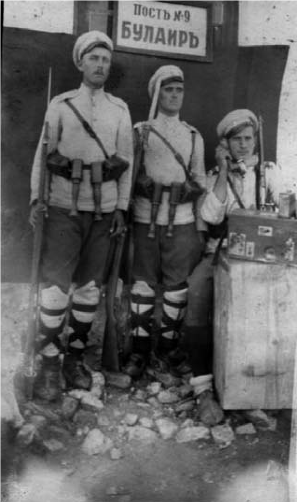

# 3. Събития, които имаха съдбоносно значение за нашия народ

Като в ден днешен съм запаметил и деня, когато в родното ми село Либяхово, в
началото на месец април 1941 година, дойде многобройна германска войскова част,
която бе разположена от десния бряг на река Мътница до Гърневите ливади и близо
до нашата нива на местността Пехците. Войниците бяха контактни с местното
население, много дисциплинирани и спазваха завиден ред в тяхното поведение.
Понякога ни забавляваха и подаряваха бонбони и шоколади. На конете поднасяха
сухари в специални торби. Някои от моите приятели си вземаха част от дажбата на
кротките животни. Често войниците идваха на Ширината в селото, където си
купуваха яйца от местното население.

Друга германска войскова част се бе разположила на местността Долни лъки, където
бе започнато бързо строителство на голям мост над река Мътница. Беше направено и
укрепване на шосето от с. Садово до границата, по което германските войски
трябваше да тръгнат за Гърция.

На 6 април 1941 година цялото училище и младежите от нашето село се стекоха до
Фердинандовото ханче на Моянче, от дясната страна на шосето за Драма. Всички
носеха цветя, набрани от околните баири. На първите редици бяха подредени
най-красивите ученици и младежи. Най-гиздавата селска девойка държеше в ръцете
си голям букет, предназначен за генерала, който се очакваше да води начело
германската войска в Гърция.

Първа на Моянче пристигна моторизираната част, пред която беше модерният джип на
генерала. Сред насъбралото се множество изригна мощно „ура“. Чуха се призиви:

– Браво, юнаци! Искаме си Беломорието! Там са нашите братя и сестри.

След силен оръдеен изстрел откъм местността Долни лъки германската войска тръгна
към границата с Гърция, която премина без никаква съпротива от гръцките
граничари.

След около две седмици от навлизането на германците в Драмска околия, на 20
април 1941 година части от войските на Втора българска армия тръгнаха в
Беломорието. Радостта на населението от Либяхово беше голяма, защото се
говореше, че бежанците, които бяха в Неврокопския край, ще се върнат към родните
си места.

Още на 22 февруари през 1941 година баща ми беше повикан като запасняк в
граничното поделение в Либяхово, заедно с дядо Илия Пашов, вуйчо ми Кръстьо
Мангушев, Тодор Самаров и други.

>   *Баща ми / първият отляво / като граничар на пост № 9 Булаир.*

След навлизането на германските войски във Вардарска Македония татко беше
преместен в Скопие, където престоя до 30 май 1941 година. През това време
мъжката работа в нашата къща поеха майка ми и двете лели Стоянка и Мехалина. Ние
с четиригодишното ми братче Стоян им помагахме.

Една година по-късно, на 26 юни 1942 година, баща ми отново беше повикан като
запасняк в областния град Ксанти, където престоя до 31 декември 1942 година.
Когато се завърна, се омъжи леля Стоянка. Макар и много бедни, татко и чичо
Петър направиха хубава сватба, на която се стече цялата рода.

