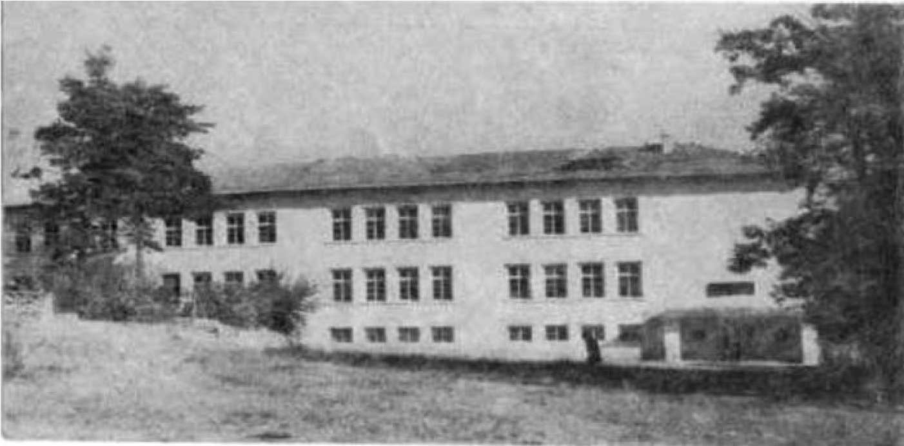
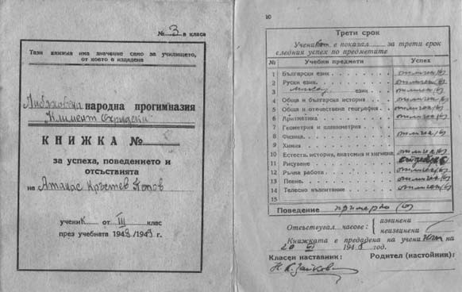

# 4. Първите ученически години

През учебната 1942-1943 година бях ученик в първо отделение. В училището ми беше
приятно и по-леко, защото учителите ме обичаха. Най-грижовен към мен беше
директорът Иван Икономов, който не скриваше голямата си привързаност към нашето
семейство. Често ме спираше и казваше:

&minus;Ти, Атанасе, трябва да бъдеш най-добрият ученик, защото от твоя род са
    най-будните хора от нашето село.

Тези думи на директора предадох на баща ми, който ми каза:

&minus;Вярно е. Прадядо ти поп Стоян и дядо ти Атанас са потомци на възрожденския
    Зимбилев род. Затова и двамата със Стоян трябва да сте будни и умни като
    тях.

Винаги, когато се връщах от училище, татко искаше да знае как съм се представил
в учебните часове, а вечер ме караше да му разказвам уроците, които съм
подготвил за следващия учебен ден. Майка се радваше, че разказвах увлекателно, а
братчето ми Стоян я гледаше кротко и я уверяваше, че и той ще бъде ученолюбив
като мен като стане ученик.

>   *Училището в родното ми село Либяхово, където завърших началното и основното
>   си образование*

>   *Това е ученическата ми книжка от трети прогимназиален клас. След това
>   продължих да уча в елитната Неврокопска гимназия, която също завърших с
>   отличен успех.*

На 24 май 1943 година имаше голям училищен празник, посветен на братята Кирил и
Методи. По вече утвърдена традиция в нашето училище на този ден учениците
показваха своите знания, след което получаваха удостоверение за успеха, който са
получили през учебната година. След като директорът на училището Иван Икономов
съобщи, че преминавам от първи за втори клас с отличен успех, излязох на
специално изградената и украсена с много цветя трибуна и рецитирах
стихотворението „Аз съм българче“. Бях почти оглушен от силните възторжени
викове на празнуващите родители и ученици. Това беше първото ми кръщение като
рецитатор. След това като такъв участвах във всички училищни и селски
празненства.

А когато в стройни редици тръгвахме към площада, за да участваме в общоселския
празник за освобождението на България от турско робство, учителката по пеене се
провикваше :

&minus;Наско, дай тон !

Цялото училище запяваше в един глас „Тих бял Дунав се вълнува“. Никога не мога
да забравя и стройните ни редици, когато цялото училище тръгваше на молебен за
здраве към селската църква „Света Богородица“. Обикновено това ставаше в съботен
ден. Най-отпред бяха първокласниците, а в последните редици – седмокласниците. С
нас бяха учителите, които ни научиха да знаем наизуст християнските молитви.
Винаги преди да започне първият учебен час, дежурният в класа казваше наизуст
молитвата „Отче наш“, а останалите я повтаряхме след него. Когато в църквата
влизаха всички ученици, имаше тишина и завиден ред, който се спазваше от всички.
Много често към сладкопойните гласове на църковния хор се включваха и нашите
гласове, а най-напредналитеученицичетяха някои от молитвите.

Преди големите църковни празници често майка ме водеше с нея, за да преспя и аз
в църквата. През нощта сякаш бях в небесен свят сред всички светии и ангели.
Всичките тези преживявания са втъкани дълбоко в моята памет, които пазя като
свидни за цял живот.

Още като ученик, през пролетната и лятната ваканция, татко често ни караше с
братчето ми Стоян да се учим да орем. Помня, че за първи път държах ралото
здраво на нивата ни в местността Каровча, която беше близо до село Везмен.

&minus;Това е наша българска земя. Трябва да я пазим като очите си – казваше татко.
    Тази нива е от прадедите ни, когато Беломорието е било наше.

Така татко ни предаваше първите уроци по историята на родния край. От нашата
нива на Каровча се гледаха селата Везмен, Вълково и Зърнево, в които отново се
върнаха някои от роднините ни. Няколко пъти бяхме на гости при тях.

Стотици са страниците от моите детски спомени. Не мога да разтворя всичките,
защото някои от тях напълват очите ми със сълзи.

През 1944 година 39-и неврокопски полк тръгна към Гърция. На 7 април в
местността Моянче посрещнахме войниците. Няколко деца отидохме рано сутринта на
Кутелчето, за да ги посрещнем първи. Там срещнах бай Велик Мангушев и бай Васил
Икономов. Като ме видя, бай Васил се провикна:

&minus;Хей, Насе, ела да те видим!

Бай Велик се стресна и го попита:

&minus;Това наш Наско ли е? Насе, ела тук, за да ми разкажеш как се учиш!

Бай Велик ме разпитваше как се представям в училище и дали съм прочел всички
книги, които ми даде от неговата голяма библиотека.

