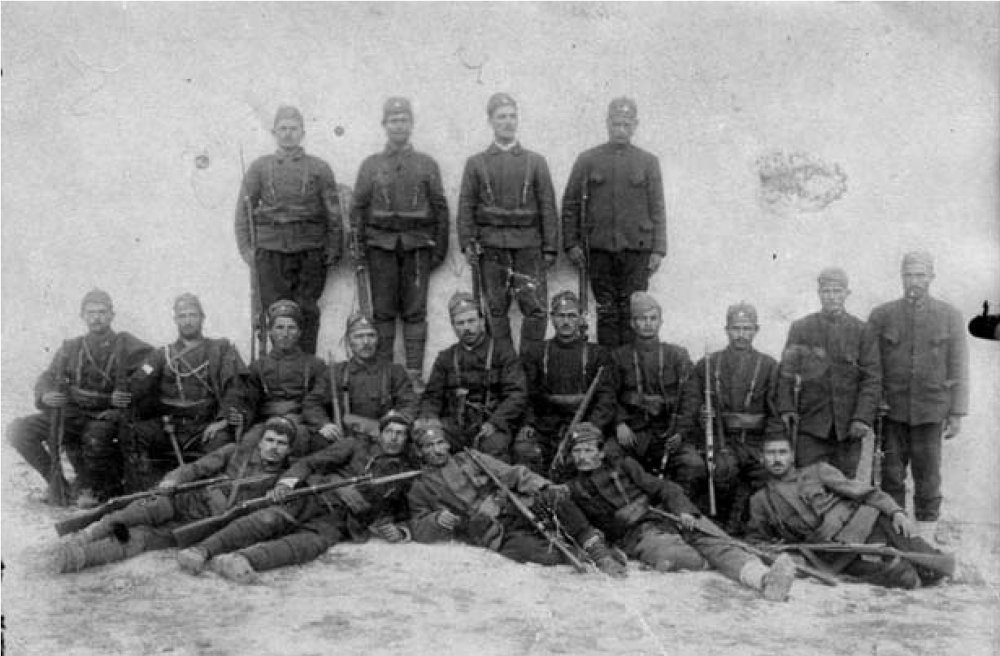

# 5. Деветосептемврийската вакханалия в родното ми село Либяхово

Бях деветгодишен, когато комунистите екзалтирано ликуваха на девети септември
1944 година. В Либяхово дойдоха няколко „шумкари“, които престояха в гората по
eдин или два дни и ги нарекоха „партизани“. Към тях се присъединиха техните
съидейници, децата и внуците на по-старите комунисти, санданисти и оранжеви
земеделци, които ги наставляваха какво да правят, с кого да се разправят.

А тя, разправата на комунистите в моето родно село Либяхово, започна с нашия
род, от бащина и майчина линия, с близките и съратниците на дядо ми като пунктов
неврокопски войвода на ВМРО. Нарекоха ни „фашисти“– всички, и родителите ни, и
нас, децата, които не бяхме чували дотогава тази дума.

Новата власт обяви дясното крило на най-патриотичната българска организация ВМРО
за „терористична фашистка организация“, а лявата – ВМРО (обединена) и
Македонската федеративна организация като „прогресивни“. Така се започна отново
братоубийствената борба. Някога тя бе започната от Яне Сандански, а сега от
неговите идейни последователи.

Някои представители на левицата в Пиринския край започнаха свирепа касапница
срещу изтъкнати дейци на ВМРО. Тяхната жестокост оправдаваха обикновено с т.нар.
Дъбнишки събития. Комунистите изсипаха купчина лъжи, скриха истината, че в това
село „са наказвани не просто комунисти и демократи, а уличените в сътрудничество
с чуждите завоеватели и потисници в поробена Македония и в прояви против
националноосвободителната борба на ВМРО“ (вж. Александров, Иван. За ново мислене
и нов подход по някои въпроси от българската история. С, 1988 г., с.70). Някои
от убитите в Дъбница са били включени и в терористични групи, ръководени в този
край от убиеца на Борис Сарафов и Иван Гарванов – Тодор Паница, който подготвял
подведените от него за терористични действия в Неврокопския край, както и за
посрещане на гръцките войски, с помощта на които трябвало да бъде свалено
правителството и унищожена Вътрешната македонска революционна организация.

В една от септемврийските вечери на 1944 година Главинчев и неговите червени
отряди мародерстваха в страната, а съидейниците му от моето село обградиха
къщата ни. Майка и татко бяха на плевнята, където нощувахме докато не приберем
царевицата. Беше към девет часа. Подготвях се да излизам, взех един пишник хляб,
който трябваше да занеса на плевнята. Там майка готвеше вечерята на огнището,
което направи татко. Когато излязох на потуна и пристъпих към стълбището, се чу
силен дрезгав мъжки глас, който приличаше на пиянски:

&minus;Кръстьо, предай се ! Отиде си вашето фашистко време. Сега ще ти видим
    сметката!

Заканата към татко ме стресна. Спомних си това, което ми беше казал, че ние с
комунистите сме от два различни свята. Сега те го търсеха, за да му видят
сметката. Уплаших се, но бързо реших, че трябва да предупредя татко за хората,
които обградиха къщата, че носят пушки и са от онези, които той наричаше
комуняги, оранжевци и санданисти. С тихи стъпки слязох по дървената стълба,
открехнах вратата откъм съседната Бродева къща и през тясната уличка между нея и
нашата къща останах невидим за онези, които блокираха къщата ни. Тичешком, с
привеждане се добрах до плевнята. Вместо татко, ме посрещна майка. Тя държаше в
ръцето си едногодишното ми братче Велик, а в полите си криеше шестгодишното ми
братче Стоян, който плачеше за татко. Разбрах, че него го няма. Майка ми каза,
че е отишъл на Моянско поляне, за да натовари набраната царевица. После
научих,че той е бил сигурен, че ще го арестуват, затова се беше скрил в една
чужда плевня, която се намираше по-далеч от селото.

След половин час хората, които обградиха къщата ни, блокираха и плевнята. Майка
им каза, че татко е на Моянско поляне. Тази местност е до самата граница, затова
те се уплашиха и се втурнаха да го търсят там. Помислиха, че е тръгнал да
премине границата.

На следващата нощ търсачите на татко отново блокираха плевнята. Той се показа
пред тях спокоен, с познатия му строг поглед, който плашеше комунистите.
Прегърна ни – майка,братчетата, и ни каза:

&minus;Пазете се. Не се страхувйте за мен. Комунистите са страхливци. Ние сме
    по-силни от тях.

Татко се обърна към мен:

&minus;Насе, носиш името на дядо си. А той беше силен войвода. И ти си силен, нали?
    Пази майка ти, Стоян и Велик!

Майка се разплака. Татко ни целуна и се разделихме. Трима от помагачите на
новата власт насочиха пушките си към него и го подкараха към общината, където
бяха и другите арестувани – все от нашия род. Единият от тези, които подкараха
баща ми, беше роднина на убиеца на дядо ми.

Същата нощ вече бяха прибрали всички от рода ни, които бяха опасни за
комунистите. Не се посрамиха от годините на дядо Велик, бащата на майка ми.
Горкият, него го бяха посинили от бой, без жалост. През 1933 година
червено-оранжеви терористи разстреляха сина му Борис на улицата.

Занизаха се кървавите септемврийски, а след това и октомврийски дни и нощина
1944 година. Комунистите и оранжевите земеделци ликуваха, мародерстваха,
разстрелваха, погребваха живи или полуживи техните „врагове“, родолюбците, елита
на България. Саморазправата на червените отряди в селата и по-малките градове
беше още по-жестока, защото местните джелати сами решаваха кого да затрият или
потрошат от бой. Те се отличаваха по препасаните червени ленти на ръкавите или
войнишките кепета с петолъчки. Носеха заредени пушки на раменете, препасани
пистолети на коланите, наточени войнишки ножове или пък малки топори. С цялото
това снаряжение тръгнаха настървени срещу „враговете на народната власт“.
Скандираха „Смърт на фашизма“, а приличаха досущ на отрядите на Хитлер.

Такива видях и джелатите в моето родно село, които разплакаха жените, децата и
старите хора в нашия род. Освен от нашата къща, писъци се носеха от Мангушеви,
Зимбилеви, Главчеви, Канчеви, Солакови, Калайджиеви и всички останали семейства,
в които е имало четници на дядо ми. Никой не знаеше каква е съдбата на
подкараните и затворени в общината. Не се чуваха писъци, защото това бяха
най-коравите мъже на селото. Побойниците ги вързали, за да не буйстват. Дядо
Ангел Главчев не издържа жестокостите на един от оранжевите побойници и издъхна.

Близките и роднините оплакваха живи арестуваните. Майка ми покриваше лицата ни с
братчето Стоян с престилката си, за да не гледаме сълзите, които като малко
ручейче се стичаха от очите ѝ. Освен за татко, тя ридаеше и за дядо Велик и
вуйчовците ми. Споменаваше с голяма тъга и името на вуйчо Борис, убит от
санданисти и комунисти още през 1933 година.

След две седмици от ареста на татко, в една тъмна, непрогледна нощ мои близки го
донесоха прекършен от бой. Роднини дадоха овчи кожи, с които майка го обвиваше,
за да утихнат болките му. Никога няма да забравя погледа на татко, отправен към
мен и братчето ми Стоян. Очите му бяха влажни, но не пусна нито една сълза.
Мъжествеността му остана несломена. С нея той покоряваше всички ни, но и плашеше
враговете си.

Все още не вярвахме, че всички затворени в общината, с изпотрошени ребра от бой,
бяха разпуснати, защото в селото вече се знаеше, че за тях е подготвен гроб до
границата, където трябваше да бъдат захвърлени мъртви или полуживи. После
научихме,че новоназначеният кмет от комунистите, баща на един от побойниците,
проявил състрадание. Като чул жестоките удари със сопи и прикладите на пушките
по телата на арестуваните, влязъл при тях. Просъскал със зъби и казал на
побойниците:

&minus;Стига вече, малко ли кръв проляхме досега в този род ?

Така масовият гроб до границата, предназначен за мъжете от нашия род, както и за
хората от четата на дядо, остана празен, но след това „защитниците на народната
власт“ го изпълниха с трупове на млади хора, които искаха да преминат границата,
но намираха смъртта си до нея. Наричаха ги „диверсанти“, а бяха смелчаги, които
не се покоряваха на комунистическата власт. Измежду тях имаше и млади хора от
другите източноевропейски страни, които като екскурзианти използваха страната
ни, за да се спасят от комунистическия гнет в тяхната страна. Едни от тях
успяваха да преминат границата, но други оставяха костите си на нея.

Баща ми, чичо ми и останалите роднини се разминаха със смъртта, но техните
побойници и агентите на току-що създадената Държавна сигурност продължаваха да
държат в обръч къщите ни през нощите, изпълнени със страдания и свити сърца.
Понякога идваха и през деня, за да тършуват. Продължаваха да измъчват баща ми,
от когото искаха да предаде пистолета, пушката и войводската униформа на дядо
ми.

Никак не бе случайно това, че когато агентите на Държавна сигурност претърсваха
нашата къща, първо се нахвърлиха върху семейния архив, за да заличат следите от
миналото. Помня, че един от тях каза на другите:

&minus;Късайте, но след това всичко прибирайте в чувалите!

&minus;Ще ги хвърлим в дерето, нали ? – попита друг.

&minus;Не, ще ги запалим. Нека всичко тяхно изгори, за да не ги намерят децата и
    внуците им.

Ограбиха цели папки с документация, книги, списания, вестници и много снимки, в
които бе историята на нашия възрожденски род. Гледах онемял. Запомних
изкривените лица на онези, които питаха и мен за войводската униформа на дядо.
Искаха да знаят къде е скривалището му и дали има в него оръжие. Най-голям мерак
имаха за револвера на войводата. Но не го намериха. Всичко, от което се
страхуваха, искаха да го открият и да го унищожат, за да няма следи от него. Но
не можаха да изтрият паметта ни, която е жива и помага, за да разкажем всичко
преживяно от нас на нашите деца и внуци.

Червените джелати горяха снимките и документите на дядо пред очите ми. Сякаш се
страхуваха да не възкръсне. В един от стенните шкафове, който забравиха
търсачите, намерих неоткрити от тях, подвързани в две големи папки, грижливо
подредени двата вестника „Македонско огнище“ и „Македонска трибуна“. Баща ми
беше казал, че в тях имало публикации за жестокото убийство и панахидите,
устроени в памет на дядо ми. При едно от следващите претърсвания комунистите
откриха и прибраха двете папки. Казаха, че с тях ще подпалват по-лесно печката
на партийния клуб, в който се четеше само „Работническо дело“. Един от търсачите
прибираше в джобовете си някои от сребърните вилици и лъжици, с които дядо
посрещал най-скъпите си гости. Друг извади войнишки нож и го заби близо до
лицетоот снимката на дядо. Таткоскочи, изви ръката на неканениягост. Ножът
падна, „убиецът“ на портрета на дядо се изплаши и побегна. След този случай той
повече не идваше в дома ни. И до днес портретът на дядо стои окачен на стената в
една от стаите на родната ми къща в Либяхово. Следата от ножа е запазена, за да
се знае за разправата на неговите врагове и след убийството му.

>   *Всички четници на дядо бяха арестувани и затворени в мазето на общината,
>   където бяха пребивани по най-жесток начин.*

Никога няма да забравя, че един ден, когато майка и татко ги нямаше, един от
претърсвачите на нашия дом нахълта и се гмурна в тоалетната, която беше
направена вътре в къщата, чиста, спретната и с постоянно поддържана хигиена в
нея. Като го видях, изпищях, а той ми запуши устата и просъска:

– Брей, фашистите имат и нужник като стая, в която сигурно крият още нещо. Сега
не намерих нищо, но някой ден пак ще дойда. Кажи, какво криете още там ?

Понякога сънувам мрачните нощи, когато по улиците на моето село се мяркаха
сенките на няколкото доносници на Държавна сигурност. Имаше ги във всяка махала.
Но най-много бяха в нашата, която те наричаха „фашистката“. Те слухтяха около
къщите на обявените от тях „врагове на народната власт“. В нашето село имаше и
един пратеник от КГБ, който минаваше за техен началник. Той стана известен с
побоищата над най-непослушните. Казваше се Евлоги. Най-много пострада от него
непокорният бай Стоян Пандев. Пречупи му краката, след което в селото тихомълком
се тананикаше тъжната песен „Руснакът Евлоги чупи ноги, пазете се, хора“.

Помня и идването на двама руски войници в нашето село, които се бяха напили до
козирката. Без капка срам те се разхождаха с разпасани панталони и търсеха
хубави жени, за да се гаврят с тях. Аз бях пред читалището. Покрай мен минаха
две от учителките, които се прибираха от училище. Като ги видяха,
„освободителите“ руснаци се втурнаха към тях. Учителките побягнаха и се скриха в
къщата, където живееха. Руснаците започнаха да тропат по външната порта на
Траповата къща. Жените от махалата се уплашиха. Залостиха и техните порти.
Вдигна се голяма врява. Събраха се мъже, които обаче не смееха да кажат нищо на
„братушките“. По едно време видях моят първи братовчед бай Велик Мангушев,
заедно с още един войник. Те бяха запасняци и настанени в училището. Бай Велик
прояви учудваща за всички смелост. Свали автомата от рамото си и го насочи към
двамата руснаци. Предупреди ги, че са арестувани. Заедно с другия войник ги
подкараха към общината, където бяха затворени в една от стаите, докато не дойдат
от град Неврокоп, за да ги приберат в руското поделение, което беше отседнало в
село Баничан.

През тези години комунистите залостиха входната врата на църквата „Света
Богородица“. Преследваха се и онези, които посещаваха гробовете на своите
близки. В моето село има две черковни камбани – голямата и малката, които си
пригласят, когато ги слушаме за църковни празници. Комунистите заглушиха малката
камбана, а поставиха червена боя върху голямата. Тя се използваше винаги, когато
имаше „тревога“. Всяка вечер, а понякга и през деня, камбаната забиваше силно и
стряскаше цялото село. Комунистите и оранжевите земеделци се събираха пред
общината на групи, въоръжени с пушки, които държаха по домовете си. След като
научаваха къде е била нарушена пак границата от диверсанти, побягваха да
унищожават „изменниците на родината“.

Една вечер, заедно с моя съсед Димитър Гахов, тръгнахме на паша. Аз – с нашето
магаре, а той – с техния кон. Преди да стигнем до м. Качолеца, чухме разтърсващи
нощната тишина картечни изстрели. Когато стигнахме до Пахунчевото дере,
затрещяха изстрели и зад нас. Бяха ни взели за диверсанти в непрогледната
тъмнина. Скрихме се в дерето, което беше обградено с храсталаци. Цяла нощ
укротявахме магарето и коня, за да не ни открият. На разсъмване видяхме, че
дерето беше оградено от десетина преследвачи на диверсанти. Като ни видяха,
закрещяха и казаха, че ще ни арестуват. Един от тях обаче разкандардиса другите
и получихме наказание шамаросване, което остави синини по лицата ни. Помолиха ни
да не казваме на никого за случилото се.

Още от първите години на тяхната власт комунистите в нашето село успяха да
разделят хората на „наши“ и „врагове“. Разделиха и нас, децата. Често някои от
моите съученици ме наричаха „фашист“. Те бяха едни от най-посредствените, но
надъхани от родителите си, които членуваха в комунистическата партия или
оранжевия земеделски съюз. Измисляха си „героични“ истории на бащите и дедите
им. Разделението в нашето село беше страшно. То доведе до появата не само на
широките размери на доносничеството, но и до угодничеството, т.е. до
заслоняването на някои до силните на деня, на които слугуваха.

Партийните ръководители и техните измекяри в селото направиха профилактика и на
песните, които се пееха по време на семейните празници и седенките. Когато на
сватбата на бай Атанас Зимбилев неговите роднини Димитър и Атанас Зимбилеви,
заедно с баща ми и някои други мъже от нашия род, запяха песента за Тодор
Александров „Я излез, Гюрге“, къщата на младоженците беше обградена от
ченгетата. Те бяха потърсили помощ и от граничната застава, от която дойдоха
десетина граничари с набучени на пушките ножове. Арестуваха сватбарите, които
пееха и възхваляваха прославения в борбата за свободата на Македония Тодор
Александров. Прогониха и останалите сватбари от Зимбилевата къща. Като видях
татко, когото подкарваха към общината, застанах пред него, за да видя дали са го
били. Той ме прегърна, целуна ме и ми каза:

– Насе, не се страхувай ! Ти знаеш,че ние сме по-силни от комунистите. Иди при
майка ти в къщи и я успокой. Да не се страхува, аз ще се върна.

В нашето село заглъхна и църковната камбана. Комунистите забраниха религиозните
празници. Най-болезнено бе преживяна забраната на традиционния родов празник,
посветен на Света Богородица. Изоставени бяха и общоселските събори на
местностите Св. Илия и Св. Атанас. Създаден бе нов празничен календар, в който
се отбелязваха само събития, свързани с кървавите деяния на комунистическата
партия.

Когато по време на червените митинги на селския площад с неистови крясъци се
възхваляваха измислените герои, известни със своите злодеяния, ние всички от
рода се събирахме в нашата къща и свивахме сърцата си от болка. Там, пред
набързо издигнатия паметник, с изписаните на него имена на убийците на прадядо
ми свещеник Стоян Зимбилев, на дядо ми войводата Атанас Попов и на вуйчо Борис
Мангушев, комунистите възхваляваха истинските убийци, а хулеха достойните за
уважение и признание, които отдадоха живота си за свободата на Македония. Те
крещяха най-много срещу дядо ми, който е възстановил село Либяхово след
изпепеляването му от гръцките войски през 1913 г. (вж. Възрожденските корени на
моя род, с.67-207).

През 1947 година започна ускорено македонизиране на населението в Пиринския
край. Спомням се, че баща ми преживя болезнено този процес, защото както
прадядовците му Иван, Георги и Атанас Зимбилеви, така и дядо му Стоян Зимбилев и
баща му Атанас Попов са били ревностни защитници на българската кауза.

В нашето село дойде македонски учител, който преподаваше по македонски език и
македонска история. Помня,че жена му беше много красива и предизвикателна.
Мъжете от селото я заглеждаха, а жените я одумваха като „лека“, затова не я
обичаха. А той, учителят по „македонски език“, проучваше по-будните ученици.
Често се отбиваше покрай мен, сядаше на моя чин и започваше да ме хвали, че съм
бил „най-личен“ ученик. Усещах, че искаше да ме „превземе“, за да обикна
„македонския език“. Но това не се получи. Един ден потропа на нашата порта. Баща
ми я отвори и като го видя, му каза:

&minus;Ти, даскале, ако още не си научил, да знаеш, че този дом е българска
    крепост, която никой няма да превземе, защото е изграждана от прадедите и
    дедите ми. Ти също си българин. Не знаеш ли това?

При тези думи учителят по „македонски език“почервеня, намръщи се и си отиде.

От този ден той не се отбиваше покрай моя чин. Поглеждаше ме криво и
заплашително.

В едно от междучасията видях „македонеца“, качил се на малка стълба, да сваля
портрета на Иван Вазов. На негово място искаше да постави лика на Йосиф Броз
Тито. Прислужникът бай Тодор Дерменов ме погледна тъжно и ме попита какво да
прави с портрета на югославския вожд.

Намигнах му и казах:

&minus;Бай Тошо, какво ви пречи Вазов?

Размърдах стълбата, учителят се обърна назад, залитна и падна върху портрета на
своя „вожд“. Стана голяма дандания. За да се отърва от заканите на „македонеца“,
се гмурнах в учителската стая, където ме скри моят учител Пандо Воденов, с
когото имахме роднинска връзка.

Като ученик в прогимназията разбрах, че моята известност сред приятелите ми като
вече пишещ стихове и най-добрите свободни съчинения започна да притеснява
съучениците ми от групата на „нашите“ на тогавашната власт. Някои от учителите
ми се радваха много, но един-двама, които бяха „ушета“ на тогавашната власт,
започнаха да създават конфронтация между мен и децата на „хората на властта“.
Хубаво беше, че в нашия клас такива нямаше много.

Един ден учителката по български език и литература, която ми беше класна
ръководителка, дойде у нас. Бях се усамотил в комитската стая и довършвах
портрета на свато ми Атанас Божков. Едното му око на снимката беше затворено.
Жена му, баба Мария, искаше да го отворя като другото. Рисувах с молив, нямахме
пари за боички. Майка отвори неочаквано вратата, посочи учителката, която беше
зад нея, и каза:

&minus;Имаме си хубава гостенка, посрещни я и целуни ръката ѝ!

Станах и ги посрещнах малко притеснен, защото никой още не знаеше, че освен че
пиша стихове, които учителката ме молеше да ги изпратя за публикуване, рисувах
портрети и пейзажи. Не бях съгласен, защото в тогавашните детски вестници
детското стихоплетство също беше политизирано. Пишеха се стихове, които
възхваляваха Георги Димитров и Йосиф Сталин. А моите стихове разкриваха мъката в
душата ми, която причиняваха комунистите.

&minus;Наско, ама ти си бил и художник! – Възкликна учителката и ме прегърна. Взе
    снимката и току-що завършения портрет на бял картон. Съпостави ги, обърна се
    към майка и каза:

&minus;Лельо Кипро, вече бях уверена, че Наско ще е бъдещ мой колега по литература,
    но сега виждам, че той е и художник.

&minus;Ела, ела да видиш и неговия автопортрет в другата стая – похвали се майка.

След този ден вече и другите учители знаеха, че съм и художник. А когато баба
Мария дойде да си вземе портрета на свато Нашко, прегърна го и дълго плака. И до
ден днешен той стои в една от стаите на Божковата къща.

Не станах нито поет, нито художник, но по-късно продължих пътя на моята учителка
по български език и литература. Генетически в мен е била кодирана лобовта ми към
учителската професия от прадядо ми Георги Иванов Зимбилев, който създава едни от
първите новобългарски училища в Източна Македония.

