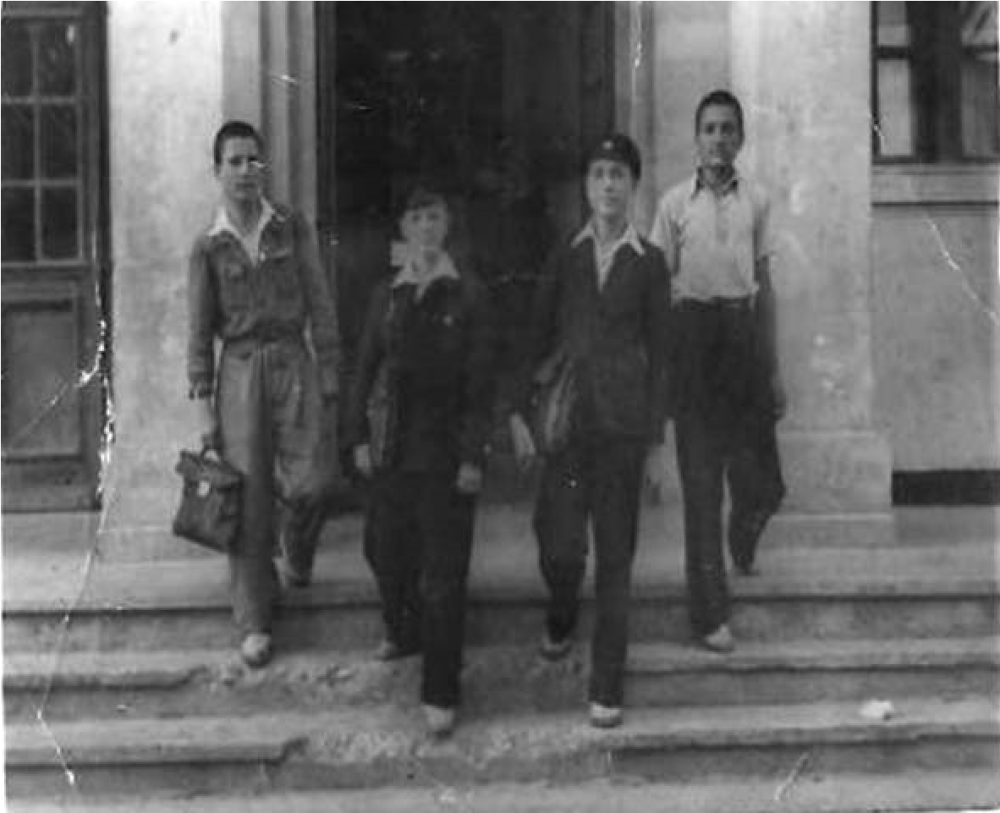
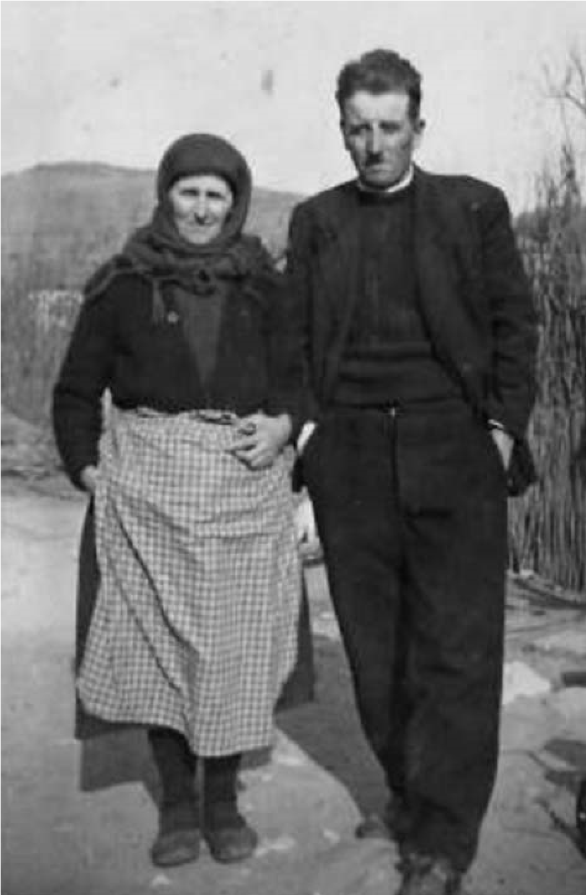
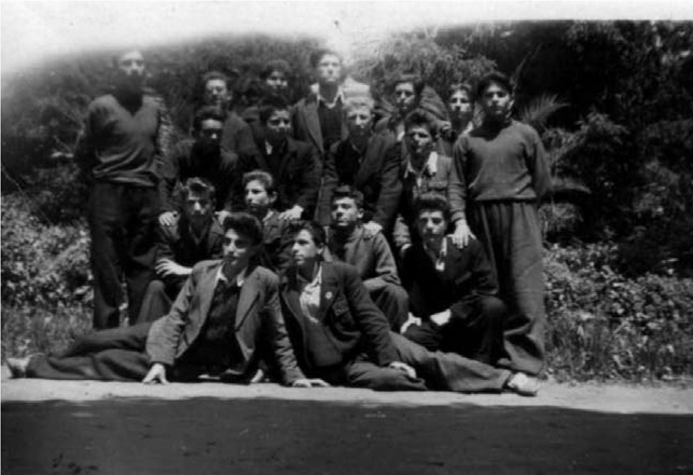
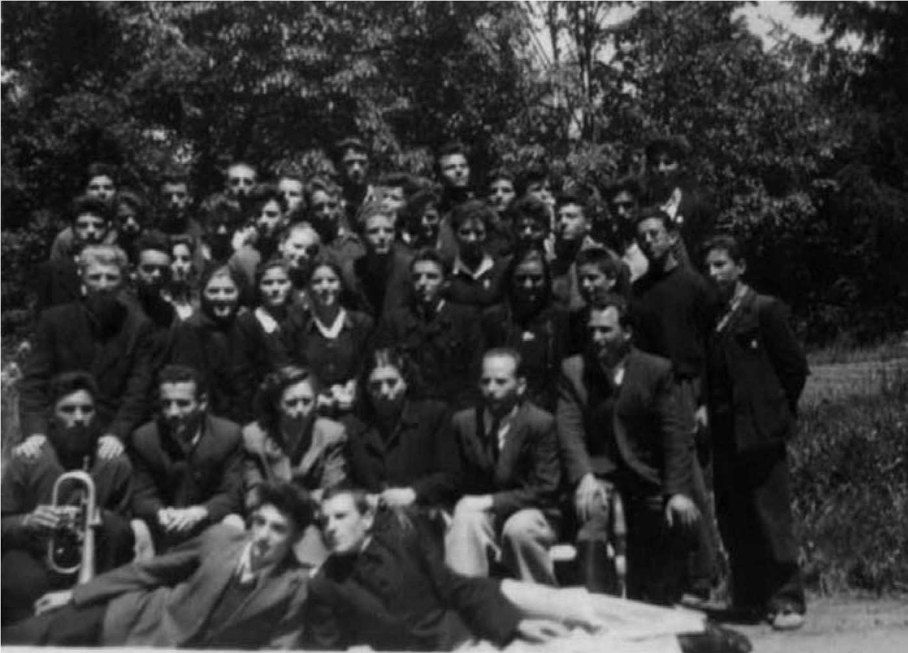

# 6. Ученик в Неврокопската гимназия

След като завърших основното си образование, баща ми ме записа с последните си
пари в Неврокопската гимназия. Там открих и други, които имаха моята съдба на
преследвани от комунистите. Събирахме се в Тиганчевия хан, за да изплачем мъката
си. Тук отсядаше в пазарните дни и дядо ми Велик, който ме зареждаше с по някой
лев, за да оцелея. Той беше преброил годините на комунизма и ме уверяваше, че
ние ще доживеем другото време, заради което синът му Борис, брат на майка ми,
беше прострелян на улицата от комунист и оранжев земеделец, които са били
известни като „кокошкари“и продавачи на краден едър добитък в Гърция. През
годините на „народната“ власт синът на един от убийците на вуйчо ми, който беше
полуграмотен, беше кмет в родното ми село Либяхово. Той скалъпваше
характеристиките на младежите, които искаха да продължат образованието си или
пък да отбиват военната служба. На всеки млад човек от
„неблагонадеждните“семейства, смятани за „врагове на народната власт“, намираше
големи кусури, затова характеристиките им завършваха със заключението
„Отношението му към народната власт е отрицателно.“

Като ученик в гимназията през първата учебна година бях на квартира заедно с моя
свато Стойко Божков, който беше вече известен като талантлив поет сред своите
съученици и учителите. Живеехме при баба Елена Левтерова в една стая. Тя спеше
на едното легло, а ние двамата – на другото. Така заплащахме половината наем.
Беше ни тежко и неудобно, но какво да се прави. И двете наши семейства бяха
бедни.

През тази учебна година започнаха масовите изселвания на т.нар. „народни
врагове“. Една вечер в квартирата ни дойде наш съсед, който искаше да излезем
навън, за да ми каже нещо много важно. Когато отидохме на улицата, той ме хвана
за рамото и с наведени очи ми прошепна, сякаш се страхуваше,че и на улицата
някой може да ни подслушва:

&minus; Изпраща ме баща ти, защото той не може да дойде. Комунистите от селото не го
    изпускат от погледа си. Каза ми да ти предам неприятна вест, която обаче не
    бива да те плаши много. Ще ви изселят от село, заедно с още три други
    семейства. Ти знаеш защо, нали? Прибери си багажа, за да си готов. Като
    дойдат родителите ти тук, ще минат да те вземат. Ти трябва да ги чакаш пред
    Тиганчевия хан.

Тежка буца ми задави гърлото. Стана ми мъчно за майка. Как ли ще понесе това тя
като е толкова болна? Цяла нощ не заспах. Бях мигнал за малко и през тези минути
сънувах, че двама милиционери ми връзват ръцете и ме подкарват към затвора,
който беше до Тиганчевия хан. Там бяха майка, татко и братчетата ми Стоян и
Велик. Когато отворих очи, тях ги нямаше. Скочих бързо от леглото, облякох се и
побягнах навън. Видях два камиона, в които имаше натоварени две семейства от
нашата махала, които изселваха в Северна България. Жените и децата плачеха.
Тръгнах към Тиганчевия хан, откъдето трябваше и аз да пътувам с родителите си
като изселник. Чаках цял ден, но никой не дойде. По едно време видях дядо Велик
Мангушев да пришпорва мулето си към мен.

&minus;Насе, чедо! Ела, дядовото, идвам само заради теб. Нося ти радостна вест.
    Няма да ви изселват. За вас се е застъпила майката на кмета Борис Гърнев.
    Като деца те с дядо ти Атанас са били побратими. Тя сплашила сина си, че ако
    изселят и семейството на нейния побратим, ще тръгне с него. Изселиха само
    Зимбилевите братя, Георги Клайджиев и Димитър Трапов. Димитър и Атанас
    Зимбилеви бяха деца на четника Георги Зимбилев, пръв братовчед на дядо ми,
    войводата Атанас Попов. Георги Калайджиев е бил негов помощник.А другият
    изселен беше бай Димитър Трапов, известен бакалин в селото. При него се
    събираха мъжете на раздумка и чаша ракия. Той беше добър човек, помагаше на
    всички, но не обичаше новите властници.

>	*Пред входа на гимназията в град Неврокоп (отпред, от лявата страна) между
>	Иван Малаков и Лазар Кимилев*

През следващата учебна година се преместих на квартира у Георги Вълчев, който
беше наскоро построил новата си къщичка. От нея се отваряше хубава гледка на
града. Съвсем наблизо беше Тиганчевия хан, на който отсядаха всички дошли от
нашето село през пазарните дни. Тук ми беше по-удобно да правя срещите си с дядо
Велик. Живеех заедно с Иван Малаков, син на моя кръстник Лазар Малаков, който
беше известен като един от най-кротките хора в нашето село. Такъв беше и Иван. С
него заживяхве заедно като истински братя.

Наемът за квартирата у хазаина ми Георги Вълчев се „изплащаше“ от татко с по два
чувала царевица, които натоварваше на магарето ни и ги даваше на хазаина всеки
месец. Когато хазайката разбираше, че нямаме храна, много често ни канеше на
вечеря, заедно с децата ѝ Димитър и Иван. Хазаинът изглеждаше строг, но беше
много добър човек.

Последната година бяхме заедно с брат ми Стоян на квартира у Стоил Бъчваров,
който е познавал лично дядо Атанас и често ми говореше за авторитета му като
неврокопски войвода. Веднъж ме повика, за да ми каже, че много приличам на дядо,
а братчето ми Стоят – на поп Стоян.

&minus;Аз бях от другото крило на ВМРО, но си останах привързан към Ст. Филипов и
    дядо ти Атанас, защото бяха почтени войводи. Не ми харесваха нашите
    санданисти, които прикриваха отначало големите пакости на Безим Яне, а след
    това на Тодор Паница и Иван Коемджиев. Те не бяха войводи, а разбойници,
    които поставиха началото на братоубийствата и в нашата околия. Та нали
    Коемджията разстреля не само прадядо ти поп Стоян по време на молитва, което
    може да извърши само един злодей, но преди това неговата банда разстреля и
    войводата Михаил Даев.

Слушах хазаина и запомних задълго всичко, което ми разказваше за дядо. Сближихме
се със сина му Георги, с когото запазихме добрите си взаимоотношения и до днес.
Една вечер Гошо влезе в нашата стая. Завари ни с брат ми Стоян, когато вечеряхме
с малко хляб и две ябълки, които ни беше дал дядо му Кръстьо.

&minus;Наско, това ли е вашата вечеря? Нямате ли друго за ядене!?

Братчето ми наведе глава и се изчерви. Аз се престраших и казах на Гошо, че от
два дни ядем само трахано с айрян, който вече приличаше на побеляла вода.
Очаквахме следващия ден да дойде татко и да ни донесе малко фасул.

Гошо сви вежди и излезе. След малко донесе една купичка с фасул, който беше
сготвила майка му.

Такъв беше нашият ученически живот в гимназията. Затова очаквахме нетърпеливо
всеки понеделник, когато идваше на пазар дядо Велик. С парите, които ни даваше,
можеше да си купим „купечки“ хляб и малко боза, която разреждахме, за да стигне
и на двамата с брат ми.

Много често, когато вече нямахме нищо за хапване, в съботния следобед поемахме
пеша към село. Тогава нямаше превозни средства до Либяхово. Поемахме по тесните
пътеки, които минаваха покрай Мосомище, Ляски, Копривлен и Садово. Най-трудно
беше изкачването на височината на м. Кендик. Обикновено тук правехме по няколко
почивки, след което се спускахме покрай Вълканската кория, за да стигнем до
реката, над която имаше голям дървен мост.

>   *Майка и татко винаги намираха сили в себе си, за да се грижат за нас с
>   много любов*

Родителите ни очакваха нетърпеливо. Майка приготвеше вечерята, а татко бързаше
да ни разпитва с брат ми Стоян как сме се представили през седмицата в училище.
Той искаше всичко да знае от нас. Оставаше доволен от това, което му разказвахме
за училищния ни живот и не забравяше да ни уверява, че един ден мъките ни ще
имат край.

Директорът на гимназията Иван Икономов никога не ме отминаваше, когато се
срещахме. Не забравяше да ме похвали за това, че съм много ученолюбив и скромен.
Веднъж ми каза, че ние сме повече от роднини, защото дядо ми Атанас и баща му
свещеник Атанас Икономов са били изключително близки приятели. От него научих,
че през 1926 година като кмет на селото дядо повикал баща му и заради неговата
богата музикална култура му предложил да кандидатства за овакантеното място на
свещеник Петков. След това двамата превръщат църквата „Света Богородица“ в
духовен храм, който спомага за обединяването на населението в Либяхово.

Моите съученици в Неврокопската гимназия ме познаваха като един от най-добрите
краснописци, затова често идваха да ги науча на красиво писане, което изискваше
и богата езикова култура. Както в прогимназията, така и в гимназията
литературата ми беше любим учебен предмет. Бях приятно изненадан, че известната
народна учителка по математика Спаска Фурнаджиева ме беше похвалила на директора
на гимназията. Поръчала по него да я потърся и да поговори с мен. Когато се
срещнахме, ме стисна здраво за ръката, задържа я, погледна ме в очите и ми каза:

– Атанасе, ти си възрожденско чедо, знаеш ли? Прадядо ти Георги Иванов Зимбилев
е бил учител на всички просветни дейци от Неврокопския и Драмския край. Радвам
се, че като негов правнук обичаш и ти науката. Така ще прославиш рода си, а след
теб децата и внуците ти ще продължат твоя път. Вярвам, че така ще бъде, защото
традициите в Зимбилевия род се предават от поколение на поколение.

>   *С моите съученици в градската градина*

След тази среща с моята любима учителка често си мислех за моя род, който
комунистите не обичаха. Мислите ми за родовата памет станаха по-дълбоки и
трайни, когато и учителката Елена Бояджиева винаги изпращаше поздрави на
баща ми. При всяка среща с нея все ми говореше за него. Казваше, че били
съученици през първата година в гимназията. Отличавал се като един от
най-добрите в класа, който покорявал съучениците си с благия си характер и
несломимия си борчески дух. Убийството на баща му обаче попречило да
продължи образованието си.

>   *Като ученик в 11 б клас, заедно с любимите учители и моите съученици в
>   навечерието на матурата, 14 май 1953 г.*

В Неврокопската гимназия бяхме разделени на две групи ученици. Едните бяха
привелигированите, синчета и щерки на комунистите и техните ортаци – оранжевите
земеделци, а другите бяхме деца на „враговете на народната власт“, потомци на
дейците на Вътрешната македонска революционна организация, осъдените от
„Народния съд“ и лежалите по затворите и лагерите на комунистическата власт. Още
от първата година станахме приятели с Костадин Гущанов, потомък на Крушевския
войвода Димитър Гущанов, който загива заедно с Гоце Делчев в с. Баница, Серско,
Асен Мълчанков от Огняново, потомък на Неврокопския войвода Стоян Мълчанков,
Кирил Малечков от с. Лъки, който пък е роднина на учителя

Тома Малечков, секретар на Иван Михайлов, прекарал 14 години в комунистически
затвори. Имах още няколко други приятели, потомци на македонски войводи.

Към другата група, известна като „червените“, бяха Димитър Пенков, Янка
Папалезова, Лиляна Гегова, Аспарух Папалезов, Костадин Гуцев и др. Те оглавяваха
комсомолската организация в гимназията и рядко се явяваха на учебни занятия.
Някои от преподавателите се страхуваха от тях, защото една от задачите им беше
да проверяват и тяхното минало. На това те бяха научени от известния в цялата
гимназия комсомолски ръководител Валентин Караманчев, който в името на своята
вярност към комунистическата партия бе решил да се откаже от баща си, поради
това, че бил „ религиозно настроен“.

Помня, че Пенков беше един от най-изостаналите ученици в нашата паралелка, но
как завърши гимнизията, не можах да разбера. След това обаче беше дълги години
председател на Общинския съвет в град Гоце Делчев. Янка Папалезова я наричаха
моите съученици „пройдоха“, която понякога съвсем не се вестяваше в класа. А
дали е завършила гимназията, това не можахме да разберем. Нейният роднина
Аспарух Папалезов беше наперен ученик, с голямо самочувствие за себе си като
„клонче“ от известния комунистически род Папалезови. Той не можа да се
дипломира, защото за учудване на всички нас учителят по история Витанов от с.
Делчево набра кураж и го скъса на изпита. Нямаше право да се явява на зрелостен
изпит. Но докато на нас, макар и дипломирани с висок успех, не ни разрешаваха да
продължим образованието си, „Папалеза“ беше заминал да се учи в Китай, макар и
недипломиран. След това като агент на Държавна сигурност става посланик в Китай
с агентурното име Мавър, където е бил до 1992 година.

В класа ни имаше и такива наши съученици, които не знаехме с кого са – с нас,
или с червените. Такъв се оказа Иван Куртев от с. Копривлен, който беше добър по
математика. По-късно обаче той сви семейно гнездо с Лиляна Гегова, която е от
известен комунистически род, една от най-активните в ученическия комитет на ДКМС
в гимназията. Спомням си, че на Куртевата порта в с. Копривлен имаше надпис
„Кулак, враг наш“, но след като Иван се ожени за Гегова, смени името си Куртев с
Димитров и „кулашкият син“ започна бързо да израства в кариерата си като
несменяем директор на няколко предприятия.

Такова беше червеното разделно време. Сегашното младо поколение не знае
подробности за него, когато разделението на „наши“ и „врагове“, както пише
Георги Марков в „Репортажи за България“, беше повод за подлагане на жестоко
изтезание на цял един народ, за разбиване и унищожаване на естествени човешки
връзки, за насъскване на „всеки срещувсеки“.

