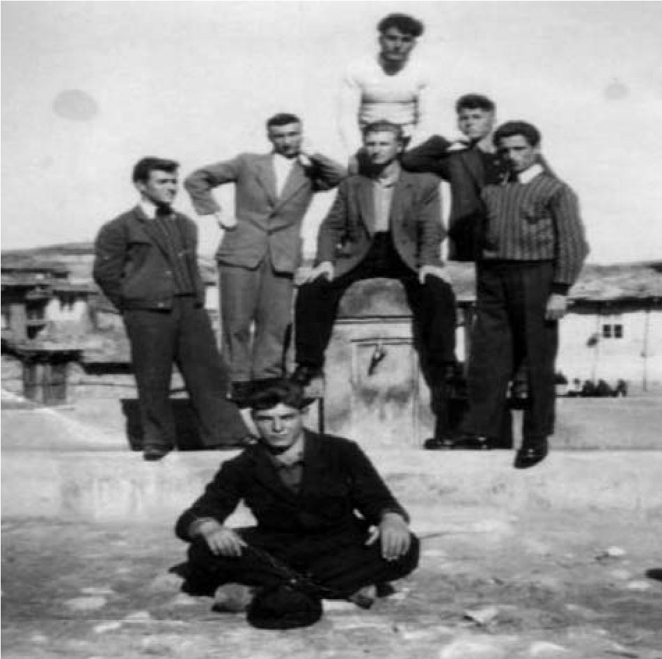

# 7. Първата голяма червена преграда в моя живот

Радвах се много, когато получих дипломата си за завършено средно образование с
отличен успех по петобалната система в елитната Неврокопска гимназия. Всички от
нашия род се гордееха с мен и настояваха да продължа образованието си. Майка ми
искаше да следвам медицина, а мене ме теглеше повече към учителската професия.
Корените ми бяха в нея. Зимбилевата къща винаги е била светилник на просвета. Не
исках този светилникът да угасне.

Исках повече от всичко да бъда студент. Нямах никакви съмнения в успеха на
кандидатстудентския изпит по литература, който се полагаше. Имаше и такива,
които ползваха привилегии, т.е. постъпваха в университета без да се явяват на
конкурсни изпити. Това бяха децата на партизаните, активните борци против
капитализма, партийните ръководители и сътрудниците на Държавна сигурност.

След като изпратих документите за кандидатстване в Софийския университет, които
първо минаваха през партийните комитети, очаквах с нетърпение отговора за
допускането ми на конкурсен изпит. Някои от моите съученици, които имаха нисък
успех в дипломите си, получиха много бързо писма, че са допуснати да продължат
образованието си. От всички, които бяха подали документи за кандидатстване, само
аз не получих отговор. Помислих, че писмото се бави по пощата, но след това
разбрах, че документите ми са задържани в общинския комитет на БКП в с.
Копривлен. Моите съученици, които не бяха молепсани като деца на „враговете на
народната власт“, заминаха да учат, а аз останах в село. Татко и майка ме
успокояваха. Отидох при Никола Гюров, тогавашен кмет на селото, за да го помоля
да ми помогне. Той ме изгледа гузно и каза :

&minus;Не мога да ти помогна. Ти не си „наш“. Партията не дава да получиш висше
    образование.

Тогава разбрах, че комунистите бяха вече разделили и децата на „наши“ и „чужди“.
Посъветваме ме да замина като строител в Димитровград. Там наистина заминаха
много млади хора на работа. Но аз исках да уча.

Попитах го защо не изпрати дъщеря си Николина да работи в Димитровград, която
вече беше записала да продължи образованието си. Тогава той се намръщи и ме
изгони от канцеларията си.

Все още майка мислеше, че сред управниците някой може да се смили над мен и да
ми разрешат да продължа образованието си. Послушах я да отида в Горна Джумая при
тогавашния първи секретар на БКП Кръстьо Тричков. Когато му казах откъде идвам и
кой съм, той ме изгледа от петите до главата и каза:

&minus;Знам, знам кой си! Твоят дядо е бил враг на комунистите. Ти не можеш да
    бъдеш друг. Затова вратата за нашите университети е вече затворена за такива
    като теб. Иди си и повече не се мяркай пред очите ми.

Тръшнах вратата така, че Тричков изкрещя:

&minus;Хей фашяга! По-кротко, за да не те изпратя там, където ще станеш кротък,
    много кротък.

По стълбището срещнах мой съученик, който бе ходил при секретаря по
идеологическите въпроси Съботин Генов. Каза ми, че той бил друг човек. Държал се
човешки с него. Реших и аз да отида при него. Наистина, погледът на заместника
на Кръстьо Тричкав поне не беше страшен. Здрависа се с мен и ме попита какво ме
води при него. Повторих това, което казах на Тричков. Не исках много. Желаех
само да продължа образованието си.

&minus;Това е хубаво, много хубаво. Кой ти пречи?

Оплаках се, че задържат документите ми в общинския комитет на БКП в Копривлен.
Генов взе слушалката и набра телефонния номер на партийния секретар Петър
Аврамов. Попита го пред мен :

&minus;Тук е Атанас Попов. Защо му задържате документите?

Дочух, че Петър Аврамов назова името на дядо ми. Нарече го „фашистки войвода“.
Съботин Генов ме изгледа, вдигна рамене и ме попита:

&minus;Какъв е бил дядо ти? Секретарят на партията в Копривлен го нарече „фашистки
    войвода“. Някои от нашите вече не знаят какво говорят. Аз не съм от вашия
    край и не ми харесват тези „кръщелни имена“, които се дават на македонските
    войводи. Но не мога да ти помогна, защото тези въпроси се решават от
    местните партийни ръководители. Надявам се някой ден да не бъде така. Който
    иска да учи, нека да учи, а не да му се пречи.

Съботин Генов протегна ръка за довиждане. Подадох му и аз моята, защото разбрах,
че този човек има в сърцето си човешка топлина, която може би ще изчезне, ако
продължава да е един от партийните ръководители. Но, ако я запази, сигурно ще
бъде един от „враговете“ с партиен билет.

През тези години мечтите бяха едно, а времето, в което живеехме – друго. Скриха
ми документите. Върху тях беше завинаги поставено клеймото „Неблагонадежден.
Отношението му към народната власт е отрицателно“.

Къде ли не ходих, за да изплача мъката си. За първи път разбрах, че според
комунистите ние сме от друг свят и не бива да имаме високо образование. Те
разделиха един цял народ на „свои“ и „чужди“. Цялото ми семейство беше
разтревожено. Моите учители недоумяваха, че останах в село. Един от тях ме
попита:

&minus;Насе, защо не отиде да се учиш в София? Ако баща ти няма пари, имаш толкова
    голяма рода, която няма да те остави гладен.

Не му казвах истината, че партийните ръководители не са съгласни да продължа
образованието си. Един от учителите обаче, за когото всички знаеха, че е уше на
Държавна сигурност, ми каза, че „кръвта вода не става“, затова ми нямат доверие.
Не се знаело какъв мога да стана, ако получа висше образование. Та аз не исках
тяхното доверие. Милеех само да продължа образованието си.

По-будните младежи от селото не ме оставиха сам. Сприятелих се с тях и
прекарвахме заедно есенните и зимни вечери. Ходехме по седенки. Към нашата група
се включиха и някои от учителките с техните приятелки в селото, които често
идваха да помагат на майка ми в къщи при калъпясването на тютюна. Никога няма да
забравя приятелските чувства към мен на учителката Любка Тимчева от град
Неврокоп. Тя не се страхуваше да изразява явно възмущението си от онези, които
ми попречиха да продължа образованието си. Смятаха ме като най-будното момче в
селото, но всички вече знаеха, че изкупвам „вината“ на дядо ми като македонски
войвода.

>   *С тези, които не ме оставяха сам. В средата, между тях съм на чешмата на
>   селския площад Ширината*

През тези години комунистите зомбираха младото поколение чрез създадената
организация ДКМС. В нашето село имаше две дружества. Някои от младежите се
надпреварваха да сервилничат пред комсомолските секретари. Гледах и се чудех на
тяхното тотално нравствено деформиране, което предизвика „народната власт“.
Когато един ден екзалтирана комсомолска група излизаше от читалището след
прожекцията на филма „Млада гвардия“, ми стана тъжно не само за младежите, но и
за девойките, които се държаха като „героините“ от филма. Прибрах се в къщи и
написах една от първите си статии, която изпратих във вестник „Пиринско дело“.
Заглавието беше „Непрокопсани младежи“. Описах екзалтираното поведение на
опиянените от героизма на младогвардейците, но не споменавах, че то е било
предизвикано и свързано с гледането на филма.

В деня, когато излезе публикацията ми, отидох в град Неврокоп. Бяхме събрали
пари, за да си купим най-после и ние като хората радиопарат. Вечерта се върнах в
къщи радостен. Слязох от магарето, свалих радиоапрата и се провикнах, за да ме
чуе татко. Той дойде да ме посрещне, но в погледа му не прочетох радост, а
някакъв гняв, който извираше от очите му. Втренчи се в мен и каза:

&minus;Аз ще кача радиоапарата горе, но теб те чакат в общината. Цял ден те търсят.
    Витан Кимилев и Кольо Кутрев са побеснели от статията ти. Ще дойда и аз. Не
    се плаши!

Когато наближих общината, видях на стълбите двамата, единият беше партиен, а
другият комсомолски секретар. Гледаха ме изпод вежди и ме вкараха в една от
стаите. Започнаха поредните заплахи, че няма да видя бял ден, докато нося този
акъл в главата си. Единият от тях просъска:

&minus;Не се сърди, че те наричаме „фашист“. Такива сте всички от вашия род, затова
    ще има да си патите.

Двамата крещяха неистово. През същото време татко ме чакаше вън в коридора. С
него бяха и двамата калековци Георги Малев и Димитър Божков. Когато в стаята
вече стана много напрегнато, на вратата се показа татко. Погледът му беше суров.
Тръгна към мен, хвана ме за ръката и каза на двамата:

&minus;Не измъчвайте повече сина ми. Малко ли ви е това, че не му давате да
    продължи образованието си?

Изведнъж моите „екзекутори“ се стреснаха и уплашено погледнаха татко. Те
познаваха неговата решителност да излезе и на двубой с тях.

Провикнаха се и двамата калековци:

&minus;Какво искате от наш Наско? Оставете го най-после на мира!

В стаята на общината останаха двамата „големци“ на селото, които сякаш онемяха,
но ми се заканиха с мракобесен поглед.

През следващата година отново не получих разрешение да продължа образованието
си. Наши близки от рода ме убеждаваха, че като дете на „фашисти“ (така наричаха
родителите ми) комунистите никога няма да ми разрешат да следвам във висше
учебно заведение. Някои от тях ме посъветваха да емигрирам в Гърция, а от там да
замина в Америка, за да продължа там образованието си. Това споделих с баща ми,
който, заедно с майка, преживяваше по-болезнено от мен отказа на комунистите да
се уча в университет. Той ме прегърна и каза:

&minus;Да не бързаме! Ще помислим мъдро заедно какво да правим.

Една нощ се затворих сам в комитската стая. Срещнах погледите на поп Стоян и
дядо Атанас. Те ме гледаха от портретите си, които украсяваха една от стените.
Сякаш бяха живи. Неусетно тежката дървена врата се отвори. Показа се татко,
снажен, красив като войводата. И мъдър като него. Седна при мен, прегърна ме и
попита :

&minus;Сине, Насе, защо си тъжен? Не бива! Тежко ще ни бъде на всички. Комунистите
    няма да ни оставят на мира, най-много теб, защото носиш името на дядо си. Но
    ти си силен като него, нали?

Татко се съгласи да емигрирам в Гърция. Увери ме, че най-лесно ще бъде да
премина границата през местността „Каровча“, до 5-и пост, където той е служил
като граничар и познава добре пътеките. Не допуснахме обаче, че майка е
подслушвала разговора ни и изведнъж вратата се отвори с трясък.

&minus;Кръстьо, Насе! Не бива да правите това! Комунистите ще запалят къщата! Ще
    изтрият всички ни!

Майка ме прегръщаше и трепереше. Стана ми жално за нея, затова ѝ обещах да я
послушам.

&minus;Няма, няма никъде да ходя! Ще си остана тук, до теб, до татко и братчетата
    ми.

Успокоявах майка и бършех сълзите ѝ.

На следващия ден, рано сутринта у дома дойде дядо Велик Мангушев, бащата на
майка ми. Показа ми незарасналите белези, получени от побоищата на комунистите,
и ме предупреди:

&minus;Те са жестоки хора. Ако избягаш, целият ни род ще изтрият. Само това и
    чакат. Опази Поповата къща, дядовото. Нашето време ще се върне. А за него
    трябват хора като теб. Вярвам, че ти ще ги победиш, защото носиш кръвта на
    най-силните от вашия род.

Така пропадна идеята за бягството ми в чужбина. Стана ми много тъжно, когато
майка каза, че трябва да мисля и за братчетата ми. Почувствах се виновен, че
наистина изпуснахме с баща ми да помислим за тяхната съдба след евентуалното ми
емигриране в Гърция. Стоян беше предпоследна година в Неврокопската гимназия, а
Велик, Китан и Серафим бяха още съвсем малки.

Взех твърдо решение да помагам на родителите си. Послушах майка и дядо
Велик. Те вече бяха обмислили всичко, зада ми вдъхнат някаква вяра, че все
пак ще продължа образованието си. Без да зная написали чернова на писмо до
Вълко Червенков, в което изразяваха голямото ми желание да се уча още. И
питаха в него защо местните партийни ръководители ми задържат документите.
Бяха ме и похвалили като един от най-добрите ученици в Неврокопската
гимназия. Скрили за будния ми дух, но написали, че съм скромно и добро
момче. Когато прочетох писмото, се обърнах към майка:

&minus;Майко, ние сме белязани като „врагове на „народната власт“. Не знам дали
    това писмо ще помогне.

Не възразих да изпратят писмото, заради напълнените очи на майка със сълзи,
които се стичаха по съсухреното ѝ лице. Съвсем наскоро прочетох подобно писмо,
изпратено от талантливия български артист и режисьор Любен Гройс до Вълко
Червенков, на когото баща му е бил разстрeлян от комунистите.  

