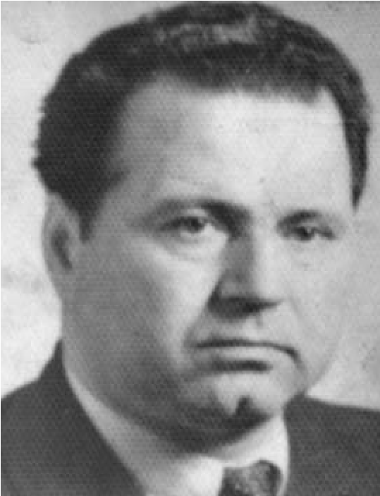

# 9. Моят покровител

В един празничен ден бях в с. Копривлен, където имаше преглед на самодейните
колективи. До мен се доближи мой приятел от самодейците и ми прошепна на ухото:

&minus;Наско, бях в пощата по работа. Казаха ми, че се обадил баща ти и поръчал
    веднага да си отидеш в село. Дошъл някой „големец“ за проверка по твоя
    случай.

Сърцето ми трепна. Прекръстих се скришом, за да ми върви на хубаво, и побягнах
към село. Извървях цели осем километра на бежешком.

Запъхтян ме посрещна майка и каза:

&minus;Сине, имал си късмет. Синът на дядо Георги Пашов е дошъл да проучи защо не
    ти дават нашите големци да се учиш. Вярвам, че той ще помогне, защото
    някога, преди да се заселят в Св. Врач, бяхме добри съседи. Дядо ти Атанас
    му помогна да се спаси от явна смърт.

Срещата ни с окръжния училищния инспектор Никола Пашов стана в шивалнята на чичо
Илия Пашов, брат на баща му. Когато отворих вратата на шивашкото ателие, гостът
стана от един стол и се отправи към мен.

&minus;Хей, войводо! Защо не препаса пищова на дядо ти, за да уплашиш тукашните
    управници. Не ти, а някои от тях са фашисти.

Слушах зашеметен думите на госта. Чичо Илия Пашов, на когото по-късно станах
зет, се усмихна, погледна ме с вечно благата си усмивка и допълни:

&minus;Насе, запомни тези думи от батьо ти Кольо. Нашите комунисти се страхуват от
    теб като внук на известен македонски войвода, който не само че създаде това
    хубаво село след опожаряването му от гръцките войници, но и помиряваше
    хората. Другите бяха убийци.

>  *Училищният окръжен инспектор Никола Пашов*

След като чух това, което каза училищният инспектор Никола Пашов и допълни
известният в цялото село със своето благородство, скромност и готовност да
помогне на всички шивач Илия Пашов, дойде и моят ред да кажа нещо. Погледнах
госта в големите му хубави очи, които ме покориха с техния блясък. Леката му
усмивка не слизаше от лицето, което издаваше душевната му красота. Тя ме
вдъхнови, за да бъда по-смел и откровен. Разказах му къде съм ходил и как са ме
посрещали. Навсякъде ме гледаха с други очи, не като неговите. Никола Пашов
постави ръката си върху рамото ми и каза:

&minus;Наско, ще се борим срещу невежеството и ще го победим. От сега нататък ще
    имаш друг път, но първо трябва да вразумя някои от тукашните управници.

Вечерта инспекторът Никола Пашов беше събрал партийния секретар на селото
учителя Георги Кираджиев и двамата комсомолски секретари. И тримата били
единодушни, че нямат нищо против да продължа образованието си. Всичко обаче
зависело от общинския комитет на БКП в Копривлен, където секретарят Петър
Аврамов решавал сам не само моята, но и съдбата на много други деца на
„враговете на народната власт“.

За всеки случай инспекторът запазил за себе си писменото съгласие на „малките
ръководители“ от Либяхово да не се задържат документите ми за кандидатстване в
университета. И въпреки това не бил сигурен, че общинският комитет на БКП ще се
съобрази с мнението на тримата от родното ми село. Затова замислил и друго да
направи през главата на вироглавите партийни ръководители, за което научих
по-късно.

След като отново не бях допуснат да кандидатствам във висше учебно заведение,
Никола Пашов ме посъветва да напиша молба до началника на отдел „Народна
просвета“ в Неврокоп Георги Бекяров за назначаването ми като волнонаемен учител.
Разговарял с него като с подчинен и му казал:

&minus;Като не му разрешават да кандидатства в университета, нека да му помогнем да
    бъде в полувисш институт, затова трябва да го назначим за волнонаемен
    учител. И без това има толкова много свободни учителски места в Родопите. Ти
    познаваш Наско, нали? Бил си негов учител в Либяхаво. А е и отличник на
    гимназията. При проверката, която направих, всички бяха единодушни, че е
    изключително ученолюбиво момче. Протегни му и ти своята учителска ръка.
    Твоят колега Георги Кираджиев вече направи това. Директорът на гимназията
    Иван Икономов пък е възмутен от партийния секретар в Копривлен Петър
    Аврамов. Каза ми, че иска да се срещне с теб. Според него непростим грях ще
    бъде като учители на Атанас да не му помогнете.

Георги Бекяров нямало как да не се съобрази с настояването на окръжния инспектор
Никола Пашов, а след това и на Иван Икономов, директор на Неврокопската
гимназия. И тримата решили да бъда назначен като волнонаемен учител в
с.Петрелик, което е до самата граница. Била издаденаи заповедта. Но, когато
назначаването трябвало да се съгласува и с Изпълнителния комтет на Околийския
народен съвет, отново всичко се закучило. Г. Бекяров проявява своята двойствена
роля. На въпроса, който му поставят: „Наше ли момче е?“, той свил вечно мрачните
си вежди и отговорил, че съм внук на войводата Атанас Попов. Това вбесило някои
от околийската управа. Заповедта била отменена

Минаха два месеца в очакване да получа заповедта за назначаване. Научих, че съм
назначен в Петрелик, но как да отида там като нямах черно на бяло. Не знаех за
отмяната на заповедта. Този път не аз, а баща ми замина на гурбет с майсторите в
Светиврачка околия. На мене се падна да изора някои от нивите с двете ни
изнемощели кравички и да ги посадя с ръж и пшеница. Преди това татко ме научи
как се хвърля семето „през крачка“. Последната нива, която засадих, беше на
местността Петрелицко. Този ден по пътеката, която водеше към с. Петрелик, се
показа Димитър Праматаров, инструктор към околийския комитет на БКП. Като ме
видя, се провикна:

&minus;Хей, даскале! Защо не си при децата, а си хванал ралото? Аз съм тръгнал към
    твоето училище, за да те поздравя, а те виждам тук.

Оказа се, че и той знаеше за назначаването ми като нередовен учител в
с.Петрелик, но не бе научил за отмяната на заповедта. Когато дойде при мен, му
казах :

&minus;Митко, разбрах, че не е лесно да се живее под ръководството на вашата
    партия. Душата ми вадят някои от твоите съпартийци, зарад името, което нося
    на дядо ми.

&minus;Наско, хубаво, че тук няма кой да ни подслушва. Но те моля друг път да не
    говориш против партията, защото някои донасят за твоите изказвания против
    нея.

Митко Праматаров беше друг човек. Той не приличаше на онези, които ме наричаха
„фашист“. Някога баща му беше приел съвета на дядо ми да се скрие, за да оцелее
след атентата в църквата „Св.Неделя“. Заедно с Илия Полянов се бяха спасили в
Гърция, след което се завърнали в село.

Минаваха месец след месец в очакване да бъда назначен в някое от другите
родопски села за нередовен учител. Изчезваше надеждата ми да придобия право като
волнонаемен учител да кандидатствам този път в полувисше учебно заведение. Майка
ми отново ме назори да отида да попитам някои от околийската управа.

Началникът на „Народна просвета“ Г. Бекяров ме посрещна със суров поглед и каза:

&minus;Не мога нищо да направя. Иди при ресорния секретар на Изпълнителния комитет
    на Околийския народен съвет Васил Урдев. Поговори с него. Той ще ти каже
    всичко.

И Урдев ме посрещна с крив поглед. Когато го попитах какво става с моя случай,
той стана, изправи се зад бюрото си и с креслив глас ми заяви:

&minus;Нашата партия има отношение към враговете на народната власт и няма да
    допусне децата им да ни изпреварват по образование. Ти си от комитско
    семейство, нали? Дядо ти е бил войвода от бандата на Тодор Александров. А
    носиш и неговото име. Няма да ти разрешим нито да кандидатстваш в
    университет, нито пък да те назначаваме за нередовен учител, за да използваш
    правото да кандидатстваш в полувисше учебно заведение.

Иди си и повече не се мяркай пред нас!

Сърцето ми се сви от гняв. В устата ми напираше отговора, който исках да дам на
този, който ме гонеше от кабинета си. Но в този миг вратата се отвори и на нея
се показа Никола Пашов. Сякаш господ го изпрати именно в този момент, когато
сърцето ми биеше неудържимо бързо. Той ми се усмихна, впери големите си очи в
моите и попита:

&minus;Наско, защо си тук? Не си ли на работа ?

Гледах го, но не му казах нищо, защото бях като онемял от думите на Васил Урдев.
Никола Пашов не знаеше за случилото се с мен. Никой не го беше уведомил, че
издадената заповед по негово настояване за назначаването ми в с.Петрелик е била
отменена.

Урдев се учуди от нежния поглед, с който продължаваше да ме гледа окръжният
училищен инспектор. Сякаш, за да оправдае себе си каза:

&minus;Изпълкомът отмени назначаването на Попов. Той произхожда от семейство, което
    е чуждо на народната власт.

Погледът на Пашов се отмести от мен и отправи към Урдев, когото попита:

&minus;Как можахте да направите тази глупост. Това момче е гордостта на неговото
    село. Засрамете се!

Пашов се доближи до мен, опря ръката си на рамото ми и каза на Урдев:

&minus;На моя отговорност той ще бъде назначен, въпреки вашето “партизанско“
    мислене. Нито дядо му, нито той и баща му са „фашисти“. Фашистите са други.
    Някои от тях сега дерибействат и не знаят какви ги вършат.

Урдев го гледаше и слушаше като изумен. Никога няма да забравя взаимните
погледи, които си отправиха. Това беше своеобразна престрелка с очи, която Пашов
прекъсна. Хвана дръжката на вратата, открехна я и ми каза тихо:

&minus;Остави ни двамата да си кажем всичко за теб. Отивай си спокоен. Ти си роден
    за учител и ще бъдеш такъв. Поздрави майка ти, баща ти и чичо Илия.

