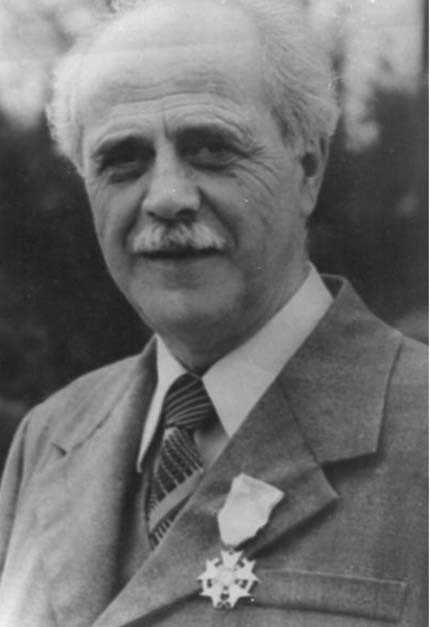

# 1. Моите покровители

Висшето учебно заведение в Благоевград премина през три етапа в своето досегашно
развитие. Първият е свързан с неговото създаване като филиал на Софийския
университет „Св. Климент Охридски“, вторият – с утвърждаването му като
самостоятелен Висш педагогически институт, и третият – с приемането на статут на
Югозападен университет „Неофит Рилски“.

През 1983 г. Висшият педагогически институт в Благоевград беше все още
единственият в страната, който подготвяше педагози за началното училище и
предучилищните заведения с висше образование. През следващата година такива
факултети бяха открити в София, Пловдив и Шумен.

Още през 1977 г. бях хоноруван асистент по Теория на естетическото възпитание
при професор Жечо Атанасов. Много бързо студентите се привързаха към мен, но и
аз към тях, защото бяха много будни. Семинарните упражнения се превърнаха в
разгорещени разговори и дискусии по проблемите в естетическото възпитание, които
бяха предизвикани от свързването им с комунистическите идеи, пронизали
съдържанието на почти всички научни дисциплини. Спомням си, че студентите
роптаеха много срещу някои преподаватели по идеологическите дисциплини, които
въобще не позволявали да се дискутира по време на техните лекции и семинарни
упражнения.

Когато през 1982 година кандидатствах за обявения конкурс по Теория на
възпитанието, вече като кандидат на педагогическите науки, партийното бюро и
кадровата комисия бяха отклонили документите ми, въпреки това, че бях включен от
няма и как в предложение до Съвета за висше образование да бъда допуснат до
конкурса заедно с директора на Полувисшия институт за културно-просветни кадри
Златко Василев и с Йордан Смилянов. Те не срещнаха никаква трудност, защото
единият беше активен борец против капитализма, а другият – партиен секретар. Но
пред мен отново се изпречи червената преграда.

Един от тогавашните преподаватели, член на кадровата комисия, ми каза с тревога
тази неприятна новина. Нямах препоръка от директора и партийния секретар на
Полувисшия институт за културно-просветни кадри. За мен остана заповед № 74/4
юли 1977 година, която ми стъкмиха за наказание поради „системно нарушаване на
авторитета на партийното и държавно ръководство“. Освен това при справката,
направена в Държавна сигурност, се установи, че още през 1959 година ми е
открито оперативно дело по линия „враждебна интелигенция“ по повод на това, че
съм „вражески настроен“. Братя Кутреви, които бяха на отговорни длъжности в
Окръжното управление на Министерството на вътрешните работи в Благоевград, също
вземат участие при отхвърляне на кандидатурата ми за обявения конкурс, като
убеждават председателя на кадровата комисия, че произхождам от „фашистко
семейство“. Така наричаха онези семейства, които бяха определяни от тогавашната
власт като нейни врагове.

Проф. Дечо Денев, ръководител на Катедрата по начална училищна педагогика, и
проф. Жечо Атанасов, като научили за това решение на партийното бюро, поискали
среща с ректора доцент Павел Драганов, след което бил даден ход на задържаните
мои документи. Една вечер ме помолиха да се срещнем в сладкарницата на „Ален
мак“. Проф. Атанасов се обърна към проф. Денев:

&minus;Аз черпя, защото искам да дам някои съвети на Атанас, които трябва да
    приеме.

&minus;А аз ще ги допълня, нали Жечо? – обади се проф. Денев.

Подразбрах, че двамата се бяха уговорили за нещо. Разговорът ни беше за това,
което са споделили и с ректора на института. Стана дума за автобиографията ми,
която са чели. Според тях тя трябва да се преработи, да не ми пречи повече в
научната кариера и в нея да се впишат някои неща, без които няма как да бъда
допуснат до конкурс и одобрен за редовен преподавател.

&minus;Атанасе, твоята автобиография е суха, щом в нея няма вписани неща, на които
    нашите партийни ръководители държат много и по тях вземат своите съдбоносни
    решения. Ти бил ли си чавдарче ? А след това пионерче и комсомолец?

&minus;Чавдарче не съм бил. Когато учих, през тези години такива чети нямаше.
    Вашата партия още не беше на власт. Бях пионерче, защото всички ни водеха
    такива. Не ни питаха дали искаме, или не. А когато бях в гимназията, пак
    всички ни записаха вкупом във вече преименувания Съюз на народната младеж
    като Димитровски.

&minus;Тогава защо не послъжеш малко, за да ти е по-лесно да вървиш по пътя, който
    си избрал? Помисли и за други благородни лъжи, които можеш да впишеш в
    автобиографията си. Така ще спасиш не само себе си, а и семейството си. И
    най-важното – ще продължиш просветното дело на твоите прадеди и деди.

Проф. Денев ме погледна и допълни:

&minus;Това трябва да го направиш. Не е толкова опасно. Страшното е другото, че
    произхождаш от семейството, което нашите са кръстили като „фашистко“.

Разбрах намека на моите съветници как мога да се отърва от враговете ми, които
ме преследваха на всяка крачка. Спомних си, че такъв съвет ми даваше и моят
спасител Никола Пашов, окръжен училищен инспектор. Именно затова приех
препоръките на проф. Жечо Атанасов и проф. Дечо Денев какво да излъжа в новата
ми автобиография. Никога не съм бил в дружинен съвет и член на комсомолско
ръководство, но в новата автобиография според двамата това трябва да се впише.
Тази вечер те уточниха и другите „благородни лъжи“, без които нямаше да бъда
техен колега.

И така, бях посъветван не само да хвърля пепел в очите на червените плъхове чрез
новата ми автобиография, но да се науча да цитирам в научните ми публикации и
партийните документи.

&minus;Знам, че ги презираш, но ще ги цитираш, защото иначе няма да пътуваш
    спокойно в научната си кариера – каза проф. Жечо Атанасов.

Цяла нощ не можах да заспя, когато съчинявах новата автобиография, в която
допълних и „благородната лъжа“, че родителите ми са едни от първите, които са
влезли в ТКЗС. Ако беше така, сигурно нямаше да ми бъде открито оперативно дело
от Държавна сигурност като „вражески настроен“ и „отношението му към народната
власт е отрицателно“. Както и, ако бях в дружинен съвет и комсомолски активист,
също нямаше да ми задържат документите в общинския комитет на БКП в село
Копривлен цели три години и да не ми се разреши да продължа образованието си в
Софийския университет.

Оказа се, че съветите на двамата професори бяха „благородни“, защото след това
трудностите, които срещах, не бяха толкова страшни, а преодолими с неимоверните
мои усилия.

Проф.Жечо Атанасов и проф.Дечо Денев познаваха моята научна продукция, която
представих при защитата на кандидатската ми дисертация. Често ми напомняха, че в
Специализирания научен съвет по педагогика и психология е нямало такава защита
на кандидатска дисертация, при която да е имало толкова много положителни
изказвания и представени отзиви, след което всички членове на Научния съвет да
гласуват единодушно за избирането ми за кандидат на педагогическите науки. Вече
имах издадени четири монографии, няколко студии и публикации, в които за първи
път правя опит да разширя обекта и предмета на педагогическата наука. И двамата
изтъкнати български учени бяха силно впечатлени и от това, че при защитата на
кандидатската ми дисертация присъстваха, освен членовете на Специализирания
научен съвет по педагогика и психология, и авторитетни учени от Българската
академия на науките, представители на Министерството на образованието и Комитета
за изкуство и култура.

По-късно научих, че офицерът от Държавна сигурност, който отговаряше за нашия
институт в Благоевград, и след като представих новата автобиография, настоявал
упорито да не бъда допуснат до конкурса заради наказанието ми през 1977 за
„подронване авторитетана партийното и държавно ръководство“ и оперативното дело
срещу мен по линия „вражеска интелигенция“, открито още през1959 година.

Преди да постъпя на работа във Висшия педагогически институт в Благоевград, бях
сигурен, че онези, които правеха кариерата си заради комсомолската и партийната
си активност, няма да ме оставят на мира. Винаги те се изпречваха пред мен, за
да спрат моето спокойно пътуване в живота.

Най-после, когато получих заповедта за назначаването, телефонът ми позвъня. Чух
гласът на проф.Дечо Денев :

&minus;Атанасе! Честито! Чакам те в моя кабинет.

След около половин час бях при професор Дечо Денев, който беше пак заедно с
проф. Жечо Атанасов. Двамата ме посрещнаха изключително любезно.

&minus;И този път се пребори и победи, с наша помощ, нали? – каза проф.

Атанасов.

Той ми стисна ръката и продължи:

&minus;Здрави корени имаш, Атанасе. Никога няма да забравя, че когато защитаваше
    кандидатската си дисертация, прозряхме таланта ти, който е онаследен от
    вашите възрожденски прадеди и деди. Именно затова аз премълчах наказанието
    ти за „подронване авторитета на партийното и държавно ръководство“.

В разговора ни с проф.Дечо Денев и проф.Жечо Атанасов стана дума и за другите
преподаватели в катедрата, някои от които според тях нямат необходимия опит в
образователната система. Това притесняваше проф. Дечо Денев, който каза:

&minus;Който не е носил учителски дневник, не може да бъде добър учен в нашата
    педагогическа наука. Това е най-добрият път, по който се върви към научна
    кариера.

След това разказа за своя богат учителски опит, въз основа на който е създал и
голяма част от научните си трудове. В това отношение подчерта и някои от моите
успехи в публикациите ми, които са тясно свързани с педагогическата ми практика.

>   *Проф. Дечо Денев*

Проф. Дечо Денев посочи бюрото, което беше пред него, и ми каза:

&minus;От днес твоето работно място ще бъде тук. Ще бъдем заедно, един до друг, за
    да си спомняме по-често за учителските години, които са закваската на нашата
    сегашна университетска преподавателска дейност.

Останах приятно изненадан, но не знаех как ще посрещнат това останалите
преподаватели от катедрата, които бяха в съседната стая. Проф. Жечо Атанасов се
оплака, че в Софийския университет през последните няколко години са нахълтали
повече „специалисти“ по работата в четите „Чавдарче“, ДПО „Септемврийче“ и
Димитровския комунистически младежки съюз, каквито имало най-много в научния
институт „Тодор Самодумов“. Според тези „специалисти“ възпитателната работа в
тези организации трябвало да бъде основна в българското училище, защото чрез нея
се реализирали комунистическите идеи в образователната система. Именно тази
тенденция, застъпена и в университета от комсомолски и партийни деятели,
стеснявала обекта и предмета на педагогическата наука. В това отношение проф.
Жечо Атанасов спомена името на доц. Людмил Станоев, гл. редактор на сп.
„Проблеми на комунистическотовъзпитание“, орган на ЦК на ДКМС, както и неговото
обкръжение, което съвсем ненужно политизирало подготовката на педагогическите
кадри.

>   Проф. Жечо Атанасов се обърна към мен и ми каза:

&minus;Атанасе, твоите публикации разчупват тези рамки. Обхващат и извънучилищната
    сфера на възпитателната работа, която има непреходен характер. Съвсем
    правилно анализираш особеностите на възпитателната работа в извънучилищните
    институции. Затова интересът към тях на моите колеги, които са истински
    педагози, е голям. Продължавай тази насока в твоята научна работа, защото тя
    е занемерена в педагогическата наука.

През 1983 година излезе от печат книгата ми „Комплексни форми за възпитание на
учениците“, която се посрещна с изключително голям интерес от учителите в
страната. Студентите я имаха като настолна при подготовката си за
педагогическата практика.

Един ден партийният секретар в института ме срещна по коридорите и ме попита:

&minus;Защо в книгата ти липсва определението „комунистическо“? Това какво означава
    ?

Погледнах го и му отговорих с насмешка:

&minus;Възпитанието няма кръщелно за това название. То има дълбоки и далечни корени
    в историята на нашия народ.

През тези години определението „комунистическо“ присъстваше и в названието по
учебника, по който студентите се подготвяха за изпит. Тогава и учебните
дисциплини по естетика и етика също бяха прекръстени като марксистко-ленинска
естетика и марксистко-ленинска етика. В тях, както и в тогавашния учебник по
теория на комунистическото възпитание, всичко беше пронизано и свързано с
партийната политика на Българската комунистическа партия за утвърждаване на
марксистко-ленинските идеи.

Това, което ми каза проф. Жечо Атанасов за достойнствата на моите издадени
книги, ми даде кураж. Той ме помоли да му изпратя в София книгата ми „Комплексни
форми за възпитание на учениците“.Няколко дни след това получих следното писмо :

„Случи се тъй, че като получих книгите Ви, бях на легло. Но това пък ми
осигуряваше доста време да се запозная по-подробно с тях. Хубаво е, че имате
свой собствен терен за изследователска дейност. Това Ви дава предимство над
много „педагози въобще“, които са „специалисти по всичко“, а не умеят да се
вглъбяват. Вашата позиция Ви дава несъмнено предимство. Можете да се занимавате
с много съпътстващи и дори с по-странични въпроси, но изяснената гледна точка и
определеността на изследователското търсене дават възможност да изяснявате
неизяснени страни на всеки разглеждан проблем. Това постигате особено сполучливо
в постановката за комплексните форми за възпитание на учениците.“

*С поздрав: Ж.Атанасов*

Когато получих писмото, към него хвърли поглед и Петър Петров. Поиска да го
прочете, след което каза:

&minus;Дай да го публикуваме в списание „Педагогика“. Нека всички педагози знаят за
    твоите оригинални изследвания в педагогическата наука.

Още тогава Петър Петров беше несменяем заместник главен редактор на
комунизираното списание „Педагогика“. Той беше „безпартиен“, но зет на активен
борец против капитализма. Не се съгласих да публикува писмото на проф. Атанасов,
защото бях уверен, че неговата оценка за труда ми щеше да породи нова завист,
която може да ми попречи.

Така и стана след това. Заредиха се немалко опити за възпиране на устрема ми в
научната и преподавателската работа. Тогава се попитах:

&minus;Що за педагози са онези, които са завършили само педагогическия факултет в
    Софийския университет ?

През последните години от тоталитарния режим някои от тях бяха подготвяни
наистина, както каза проф. Жечо Атанасов, за педагози въобще, т. е. специалисти
по нищо. Истинските педагози имат и друга научна специалност. Може би аз бях
единственият от педагозите, който имаше завършено първо филологическо
образование с допълнителна специалност „Педагогика“. Така беше дори и в
тогавашния Съветски съюз. А у нас голяма част от тях бяха бивши комсомолски
деятели, затова във факултета по педагогика в Софийския университет се
подготвяха повече кадри като дружинни ръководители и комсомолски организатори.

Веднъж, минавайки през Свети Врач, заедно с проф. Денев, съпругата му проф.
Петрова и моя син Красимир, се отбихме за малко през брат ми Стоян, който също
избра просветния път на нашия прадядо Георги Зимбилев. На път за Благоевград
професорът не скри възторга си от него и ми каза:

&minus;Атанасе, брат ти има благ поглед и мъдра душа. На кого прилича?

&minus;На този, на когото носи името. Прадядо ми Стоян, който е бил свещеник, е
    известен като най-обичания в моето село заради кротката му и благородна душа
    – отговорих на проф.Денев .

&minus;А ти на кого приличаш?

&minus;Казват, че и аз приличам на дядо ми, на когото нося името. Той е бил
    македонски войвода.

&minus;Ето откъде идва твоята революционна жилка. Но внимавай, защото на няколко
    пъти ме питаха от някои служби как се държиш. Разбрах, че не те гледат с
    хубаво око и се сърдят, че си преподавател в института.

