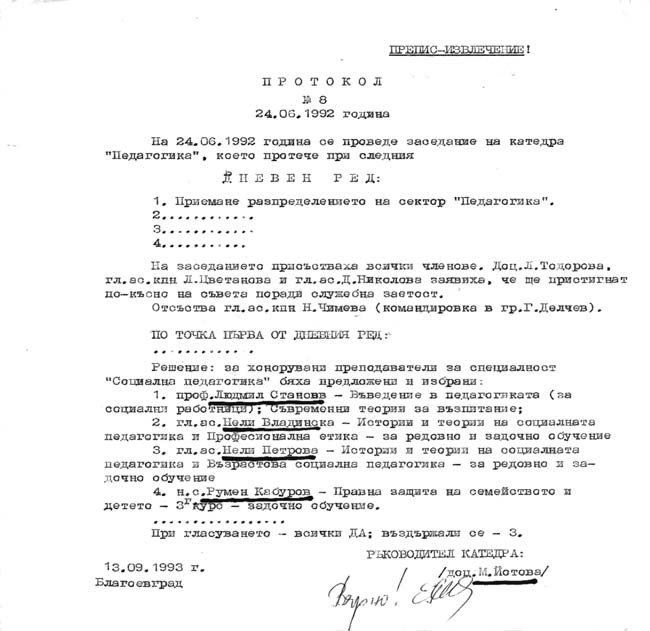
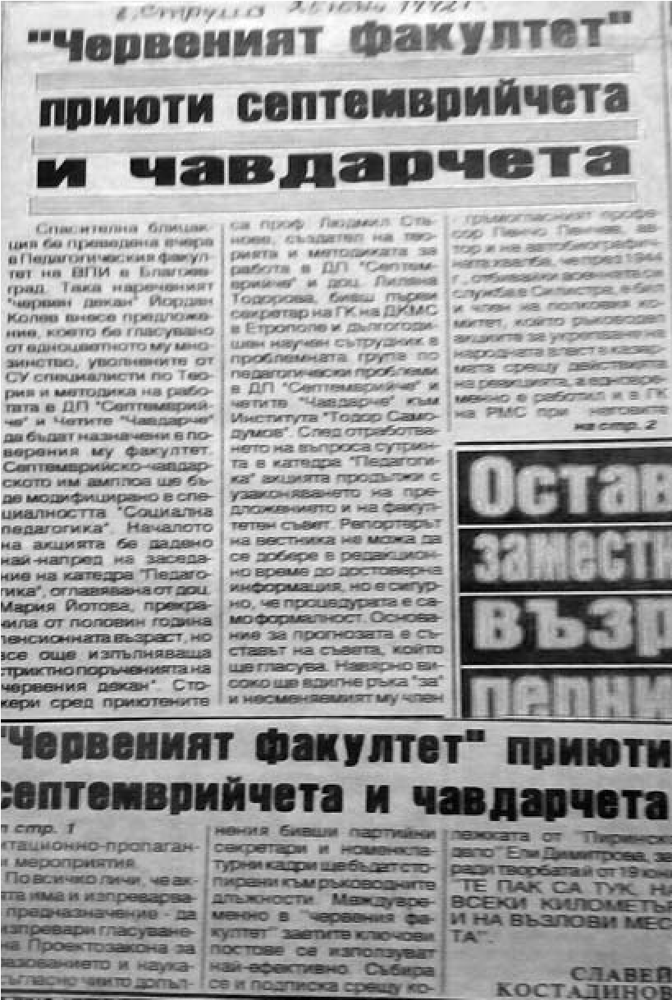
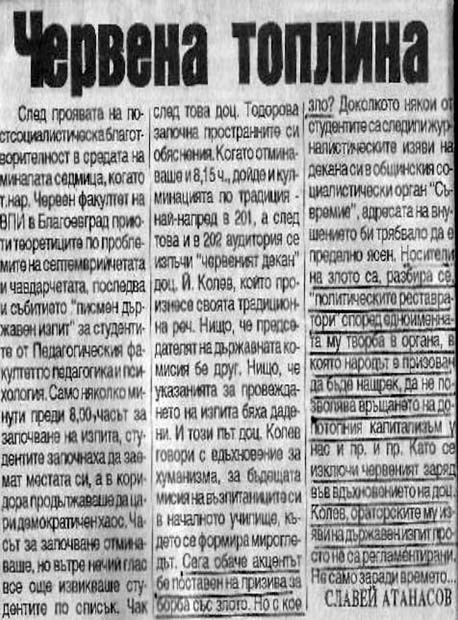

# 10. Нова червена топлина в Катедрата по педагогика

Когато Колев се върна отново като декан във факултета, в Катедрата по педагогика
се направи кадрова рокада, която започна с мен като нейн ръководител. Партийната
група издигна кандидатурата на доц. Мария Йотова, съпруга на активен борец
против капитализма. След това беше закрита и Лабораторията по теория на
възпитанието, която бях създал.

На няколко пъти Йордан Колев събираше и редакционата колегия във факултета, за
да отхвърлят и подготвения под мое ръководство първи нов учебник по теория на
възпитанието с участието на проф. Жечо Атанасов и Стефан Чернев. На някои от
тези заседания присъстваше и партийният секретар във факултета Кирил Костов, за
да подсили атаката срещу мен. Той беше най-настоятелен да не се отпечатва
учебникът. Такова беше специалното поръчение, което му постави Йордан Колев.

Въпреки усилията на вече известната като „червена група“ преподаватели в
педагогическия факултет да провали издаването на учебника, през 1992 година той
излезе от печат в София. В новия учебник по теория на възпитанието за първи път
беше преодоляно политизирането на проблемите на възпитанието от годините на
тоталитарния комунистически режим.

През преломната за повечето университети 1992 година, когато бяха закрити в
педагогическите факултети специалностите за подготовка на ръководители на четите
„Чавдарче“ и ДПО „Септемврийче“ комунистът Йордан Колев се погрижи за уволнените
преподаватели по тези дисциплини в Софийския университет и ги приюти в неговия
факултет, който беше известен като „червената крепост“ на Висшия педагогически
институт.

На 24.6.1992 г. в Катедрата по педагогика бяха избрани от партийната група за
хонорувани преподаватели доц. Людмил Станоев, главен редактор на списание
„Проблеми на комунистическото възпитание“, орган на ЦК на ДКМС, гл.ас. Нели
Владинска и гл. ас. Нели Петрова. И тримата бяха известни преподаватели по
теория и методика на ДПО „ Септемврийче“ и четите „Чавдарче“. За тях бяха
скалъпени набързо нови учебни дисциплини: съвременни теории за възпитанието;
въведение в подготовката на социални работници; история и теория на социалната
педагогика; възрастова социална педагогика.

Спомням си, че при мен идваха най-будните студенти, които роптаеха открито
против скоро назначените техни преподаватели по новите „чудновати“ дисциплини. И
те, както и наричаната от тях „Чавдарка“ доц. Лиляна Тодорова, прославяли по
време на лекциите си доскорошната тяхна любима дисциплина теория и методика на
работата в четите „Чавдарче“ и ДПО „Септемврийче“. На няколко пъти мои колеги от
Софийския университет се обаждаха и питаха дали наистина прокудените от техния
факултет „специалисти по всичко“ са приютени и съгряни с червена топлина от
известния като „червен декан“ Йордан Колев. В печата излязоха няколко публикации
за тяхното грижливо посрещане от него. А в града ни вече се знаеше, че
общинският съвет на БСП закриля грижливо пазарджишкото семейство Йордан и
Маргарита Колеви, на които родителите им имали големи заслуги към
партията-майка. Затова бяха специално обгрижвани в града, който носи името на
създателя на тяхната партия.

Червеният декан, както наричаха Йордан Колев, и неговата заместничка Лиляна
Тодорова бяха неразделни навсякъде, за да стреснат както преподавателите, така и
студентите, че тяхното комунистическо време не си е отишло. Напереният декан
обичаше да произнася пламенни слова пред студентите даже и тогава, когато
изнасяше лекции, или пък се провеждаха изпити.

Преди да започне държавният изпит със студентите в най-голямата 201 зала на
института зам.-деканката Лиляна Тодорова започна да плаши студентите, за да не
преписват. След това пред тях се изпъчи горд деканът Йордан Колев. И този път
той произнесе дълга реч. Започна да говори за хуманизма, за бъдещата мисия на
сегашните студенти като учители в началното училище, където се формира
мирогледът. Най-пламенни бяха думите му, когато започна да говори за борбата със
злото, за което често пишеше в местния вестник „Съвремие“. Студентите разбираха
намека, защото те вече бяха чели неговите публикации, в които определяше като
носители на злото реставраторите на „допотопния капитализъм“ у нас, който той
ненавиждаше.

> *В тази публикация е отразена речта на Йордан Колев преди започване на писмения
> държавен изпит на студентите от специалност „ Педагогика“, в която ги призовава
> да не се позволява връщането на „допотопния капитализъм“*

По-будните студенти от Факултета за начална училищна педагогика реагираха остро
срещу силно политизираните лекции на червените преподаватели. Някои от тях
предложиха да се четат паралелни лекции и студентите сами да избират
преподавателите, които да ги посещават. Тяхното предложение беше прието, но
когато се оказа, че студентите въобще не посещават лекиите на някои от червените
преподаватели, най-вече на доц. Тодорова, а идваха да слушат моите лекции, вече
познатите майстори на клеветите набързо скалъпиха пак компроматна публикация от
името на неподписали се студенти от втори курс Начална училищна педагогика,
която публикуваха във все още издавания червен институтски вестник с главен
редактор Никола Стоянов, бивш политически сътрудник на първия секретар на
окръжния комитет на БКП Лазар Причкапов.

Когато студентите прочели клеветническата публикация, изпратили протестно писмо
до ректора на университета, в което се бяха подписали.

Ето съдържанието на писмото.

> Господин Ректор,
> 
> Дълбоко сме огорчени от факта, че Вие допускате да се хулят и клеветят едни от
> най-добрите ни преподаватели по страниците на вестника, орган на Университета, а
> се укриват слабите, неспособните.
> 
> Материалът „Паралелни лекции, паралелни мърсотии“, който е публикуван във
> вестник „ Обектив“ на 17.04.1992 г., е пример за това. Това е клевета срещу
> уважавания от нас доц. Атанас Попов.
> 
> Ние, долуподписаните студенти от 2 курс Начална училищна педагогика, отхвърляме
> категорично написаното в него, като се защитаваме с подписите си и настояваме да
> се разобличи истинският автор на писмото.
> Благоевград, 14.05.1992 г.
> 
> Подписи : приложение – 5 листа с подписи от студентите по групи.

Студентите искаха да знаят истинския автор на анонимното писмо. Те не подозираха
обаче, че това бяха някои техни червени преподаватели, които изпращаха такива
анонимни писма къде ли не, за да разрушават авторитета ми, който съм изграждал с
много труд и всеотдайност.  

