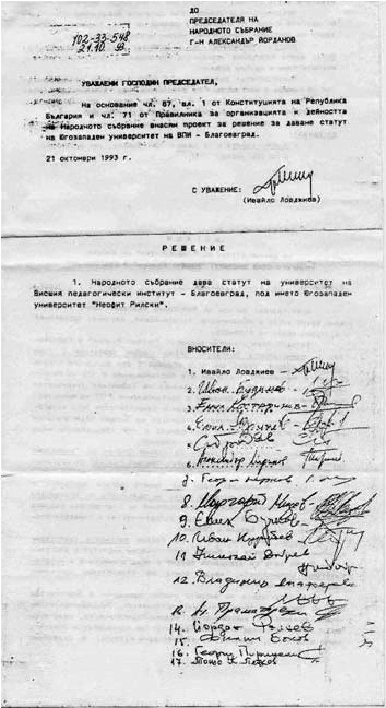

# 12. Къса памет за паметни години

Поради това, че третото начало в развитието на Висшия педагогически институт и
превръщането му в Югозападен университет „Неофит Рилски“ беше едно от
най-трудните, ще се позова на конкретни факти и доказателства. Смятам, че това
време не бива да се забравя никога от сегашните и бъдещите преподаватели и
студенти.

Със заповед № 30 от 26.08.1992 бях назначен за временно изпълняващ длъжността
зам.-ректор. Трябваше да отговарям за Отделението за следдипломна квалификация,
което се изцяло изостави и занемери от зам.-ректора Илия Гюдженов. Беше се
стигнало до там, че всеки, който пожелаеше, можеше да си открие курс за
квалификация и преквалификация на педагогическите кадри. Не бяха малко
нехабилитираните преподаватели, които ръководеха такива курсове в отделните
факултети.

Тежки, много тежки и разнообразни бяха и проблемите, свързани с цялостната
организация и провеждане на учебния процес. Доц Илия Гюдженов се беше отдал
изцяло най-вече на грижата за решаване на неговите лични проблеми в семейството.
Пазеше своеобразен неутралитет и по отношение на нестихващите скандали при
провеждане на заседанията на ректорските и академичните съвети, на които
присъстваха и лица като редактора на все още червения студентски вестник.

След назначаването ми за временно изпълняващ длъжността зам.– ректор бившите
партийни и комсомолски секретари в университета, които бяха създали организирана
атака срещу проф. Кирил Чимев, се уплашиха. Техният медиен глашатай Люба
Спириева, снаха на секретаря на ОК на БКП Тома Спириев, веднага публикува
материал във в. „Струма“, с който плашеше колегите, че след моето назначение за
зам.-ректор ще започне тяхното уволнение.

На първото заседание на Академичния съвет, на което присъствах като зам.-ректор,
се взе единодушно официално решение, според което освен за Отделението за
следдипломна квалификация ми бе възложено да отговарям и за:

&minus;създаването на новата академична структура на университета, свързана с
    откриването на нови факултети и специалности;

&minus;подготовката за приемане статута на университета в Народното събрание и
    свързаната с това цялостна дейност за неговото утвърждаване като научен и
    просветен център в Югозападна България.

Докато гузните виновници за създадения хаос в университета сипеха безброй хули и
клевети, много бързо започнах да преустройвам и ръководя дейността, която беше
тясно свързана с даване статут за университета.

Някои членове от ректорския съвет обаче продължаваха да се страхуват от онези,
които създаваха разкола в университета.

На един от ректорските съвети предложих да прекратим издаването на студентския
вестник, който беше трибуна, от която открито се воюваше както срещу проф. Илия
Конев, така също и срещу новия ректор проф. Кирил Чимев. Спомням си, че това мое
предложение стресна някои от членовете на ректорския съвет. Двама се въздържаха
при гласуването. Реших, че трябва да поговоря и с някои от ръководителите на
сандикатите в университета.

Първата ми среща беше с гл.ас. (сега професор) Антони Стоилов. За разлика от
другите, той се отличаваше с прозорливост по отношение на създадената тежка
обстановка в ректората. След тази среща колегата Стоилов застана твърдо в
подкрепа на ректорското ръководство за решаването на актуалните задачи, свързани
с цялостната дейност в университета. Най-активно беше неговото пряко участие при
подготовката за приемане статута на университета в Народното събрание.

За кратко време бе изцяло преустроена и дейността в Отделението за следипломна
квалификация. Тя бе съобразена с конкретните нужди за получаване на нови
специалности и преквалификация на педагогическите кадри. За ръководители на
отделните курсове бяха назначени водещи преподаватели в своите научни области.

Като видяха, че се извършиха немалко промени в цялостната дейност на
университета, много мои колеги, ръководители на катедри и факултети, започнаха
да идват при мен и да търсят помощта ми за какво ли не. Това понякога ме
уморяваше, но нямаше как, авторитетът на университета трябваше да се укрепва и
да се спаси от идеята на славянофилите да го превърнат в своя крепост.

След като видях, че моят колега доц. Гюдженов беше занемерил и дейността на
Отделението за работа със студентите от чужбина, предложих да бъде назначен за
негов ръководител гл.ас. Антони Стоилов, който бързо съумя да активизира
дейността му и преодолее допуснатите сериозни слабости. За първи път бяха приети
немалко студенти от Македония, с които се извършваше не само активна академична,
но и ползотворна възпитателна дейност.

В началото на новата 1992-1993 учебна година на няколко пъти посетих Народното
събрание и имах срещи с депутати от Съюза на демократичните сили. Два пъти бяхме
заедно с тогавашния областен управител Любен Пранджев и кметицата на Благоевград
Ели Масева. Най-чести бяха срещите ми с депутата от СДС д-р Ивайло Ловджиев, с
когото създадохме т.нар. синьо депутатско лоби в парламента в защита на
Югозападния университет. С нас беше и зам.-председателят на Народното събрание
Снежана Ботушарова, която ми оказваше голяма помощ при формирането на
положително отношение сред депутатите към нашия университет.

Моят добър приятел от Софийския университет проф. Йордан Венедиков прояви голям
интерес към съдбата на нашия университет, защото неговите родословни корени са
от Пиринския край. Прадедите му са от разложкото село Баня. С него споделих за
някои от опасностите, които заплашваха оцеляването на университета ни. Няколко
пъти бяхме заедно с проф. Венедиков при Председателя на Народното събрание
Стефан Савов, който ни увери, че парламентарната група на СДС ще подкрепи
единодушно нашето предложение за даване статут на университета ни. Такава
готовност имаше и проф. Елка Константинова, която по-късно стана един от
най-ревностните защитници на Югозападния университет. Специална среща поискаха с
мен и двамата депутати от ДПС Кадир Кадиров, зам.-председател на Народното
събрание, и Шерифе Мустафа, които ме уверяваха, че и тяхната парламентарна група
ще подкрепи статута на нашия университет.

За да се проучи отношението на всички депутатите към нашия университет, помолих
директора на НЦИОМ доц. д-р Асен Йосифов (сега професор) да направи специална
анкета сред тях. Резултатите от нея показаха пълна подкрепа за приемане статута
на Югозападния университет.

Почти една година представеният проект за решение за даване статут на
университет на Висшия педагогически институт не беше внесен за обсъждане в
Народното събрание. През това време социалистите в парламента все още упорито
настояваха да се създаде Славянски университет в Благоевград. Тази тяхна идея
беше опасна за оцеляването на Югозападния университет.

Поисках среща с новия председател на Народното събрание Александър Йорданов. С
него се уговорихме д-р Ивайло Ловджиев да внесе нов проект за даване статут
„Югозападен университет „Неофит Рилски“ на Висшия педагогически институт, който
след това лично занесох и се заведе с № 102-33-548 от 21 .10. 1993 г.

>   *Това е списъкът на депутатите, които първи подкрепиха предложението за
>   даване статут на Висшия педагогически институт в Благоевград като
>   университет*

И така, за първи път в залата на Народното събрание беше внесено нашето
предложение за гласуване статута на Югозападния университет. Все още нямаше нито
едно друго висше училища, което да се кандидатира за промяна на своя статут.

След това разбрах, че социалистите бяха поискали към нашето предложение за
даване статут на университета да се добави и на бързо скалъпения Варненски
свободен университет „Черноризец Храбър“. Това беше коварен ход на социалистите,
за да забавят приемането статута на нашия университет. Когато за това
предложение научиха някои от депутатите на СДС, те се обявиха решително против
т.нар. от тях „червен“ университет. При следващите мои посещения в парламента
при мен често идваше зам.-ректорът на Варненският свободен университет доц.
Павел Павлов, който упорито настояваше нашите университети да бъдат обсъждани
едновременно в залата на Народното събрание, въпреки че нямаше разработени
мотиви, каквито ние на няколко пъти представихме. Той беше включен за гласуване,
което не се приемаше от депутатите в СДС. След това този университет стана
препъни камък при утвърждаване статута на нашия университет, защото комунистите
искаха да го закрият и превърнат в с л а в я н с к и университет като руска
крепост в Бъгария, което като зам.-ректор не допуснах да се случи.

Още на първото заседание на Народното събрание след това всички, които взеха
участие при обсъждането, подкрепиха преобразуването на Висшия педагогически
институт в Югозападен университет „Неофит Рилски“. На два пъти се стигна до
гласуване. Преживявах с голямо вълнение тези заседания. Първия път, преди самото
гласуване, се поиска почивка от член на една от новите парламентарни групи. А
след това, когато бях сигурен, че предложението вече ще се гласува, и то
единодушно в наша полза, неочаквано проф. Марков от групата на т.нар.“мравки“ от
СДС предложи да се отсрочи гласуването. Наблюдавах гласуването от балкона над
заседателната зала. Забелязах недоволството на повечето депутати, но нямаше
какво да се направи. Такъв е бил редът, уточнен в правилника на парламента.
Заседанието се ръководеше от председателя на Народното събрание Александър
Йорданов, който отправи поглед към балкона, където бях седнал, вдигна рамене в
знак на недоумение от предложението на професора „мравка“.

Заедно с шофьора ми Димитър Димитров се върнахме чак след полунощ в Благоевград.
И след това първо разминаване за приемане на статут на университета ни не стихна
упоритата ми дейност, свързана с неговото приемане в Народното събрание, което
се затрудняваше от социалистите.

