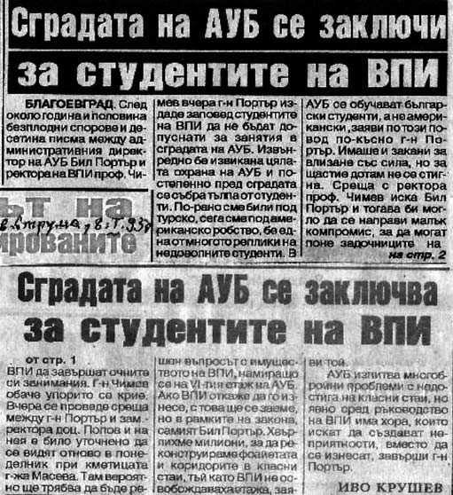

# 13. Първият сблъсък с Американския университет

Освен интригите на някои от „перестройчиците“, трудностите дойдоха и от друго
място. Въз основа на подписано споразумение на 5 септември 1990 година между ИК
на Общинския народен съвет, Висшия педагогически институт, представители на
политическите партии и Синдиката на българските учители учебен корпус №1 беше
предоставен за нуждите на Математическата и на Езиковата гимназия. Съгласно това
споразумение, на Висшия педагогически институт бяха представени двадесет зали от
втория и третия етаж в сградата на бившия партиен дом до построяването на
учебните блокове Б и В. След настаняването на Американския университет в същата
сграда бяха освободени половината от предоставените помещения на него. След това
последвали писма от ръководството на Американския университет да се освободят и
останалите помещения, т.е. Висшият педагогически институт да освободи изцяло
сградата на бившия партиен дом. За съжаление тогавашното ректорско ръководство
бе обещало от 1992 година да се освободи изцяло сградата, но все още блок В не
беше изграден. Президентът на Американския университет Левърти беше изпратил
няколко писма, с които искаше напускането на нашите студенти и преподаватели от
сградата. Най-настоятелни бяха Уайът Кутеманш и зам.-ректорът Бил Портър.
Последният беше изпратил предупредително писмо на 6.04.1992 година до тогавашния
зам.-ректор на ВПИ Илия Гюдженов като завеждащ учебната част, който обаче не
беше предприел никакви мерки за отхвърляне на това неоснователно искане.

През тези месеци т.нар. „перестройчици“ отново бяха засилили застрашително
своята дейност срещу тогавашното ректорско ръководство. Някои от членовете на
ректорския съвет се бяха скрили и не предприемаха нищо за преодоляването на
създадената тежка атмосфера във Висшия педагогически институт. Гледаха само да
останат незасегнати от ударите и запазят своите ръководни места. Един от тях
беше и доц. Илия Гюдженов, който се страхуваше да заеме страна в тази битка.

Заедно с проф. Чимев се чудехме с какво да се захванем по-напред, с утихване на
конфликтите в университета или пък с преодоляване на трудностите, които
създаваше и ръководството на Американския университет. За съжаление с писмо №
04-00-6 / 24 април 1992 г., изпратено до Министъра на финансите Иван Костов, се
обещаваше, че ако бъдат осигурени целево средства за изграждане на блок „В“,
институтът би могъл от следващата учебна година да освободи изцяло сградата,
която се ползваше заедно с Американския университет.

>   *Публикацията, която отразява срещата ми с г-н Портър, когато не бяха
>   допуснати нашите студенти до залите, в които провеждаха учебните им занятия*

През м. януари 1993 г. неочаквано служители от Американския университет
направиха опит да се самонастанят в залите и канцелариите на Педагогическия
факултет. Някои преподаватели бяха решили да протестират като нощуват в
сградата, което нямаше да реши проблема. Разбира се, това не бе начинът за
запазване на нашата учебна база. Неприятно впечатление направи това, че както
ректорът проф. Чимев, така и зам.-ректорът по учебната дейност доц. Илия
Гюдженов отново се скриха. Трябваше пак аз да укротя г-н Бил Портър,
административен директор на Американския университет. На срещата с него се
уговорихме да продължим преговорите в кабинета на кмета на града Илиана Масева
през следващия ден. При спешната ми среща с г-жа Масева двамата решихме да бъдем
неотстъпчиви по отношение напора на ръководството на Американския университет.
Поискахме и навременната намеса на Министерството на образованието,
благодарението на което беше избегната и своеобразна саморазправа между
преподаватели и студенти. Отстъпени бяха само някои зали на Американския
университет.

