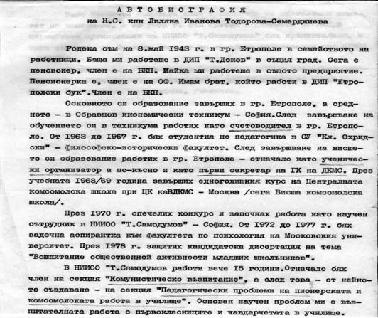
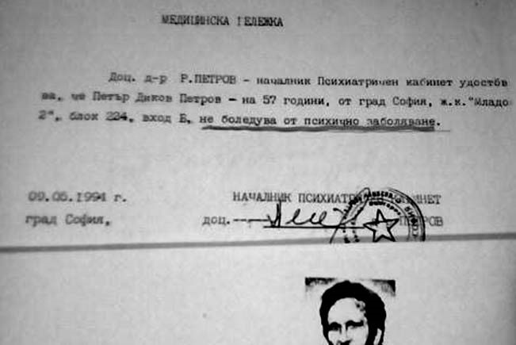

# 15.Компроматната война продължи по опорните точки в Указанието на ВС на БСП

Последните дни от своето деканство Йордан Колев пишеше и служебни писма до
различни вестници, с които молеше да се ускори публикуването на скалъпения
компромат от Петър Петров „Всемогъщият властелин и неговият покровител“ (вж.
Педагогически факултет, изх. № 12 от 03.02. 1993 г.). В писмо № 13.03.1993 г. е
написан шаблонен текст, който беше предназначен за няколко главни редактори на
централни и местни вестници. Писмото завършва така: „Уверяваме Ви, че познаваме
съдържанието на статията и го намираме за достоверно. Предварително благодарим!“
Следва подписът на декана.

Дясната ръка на Йордан Колев тогава беше зам.-деканът Лиляна Тодорова, която е
завършила техникум като Йордан Колев, но докато той е получил специалност като
електротехник, тя е била счетоводителка. И тя като него е завършила червения
педагогически факултет в Софийския университет. След това е и щатен ученически
комсомолски организатор. Тогава имаше такава длъжност, която беше равна на
комсомолски секретар. Счетоводителката обаче бързо израства по комсомолска линия
и става първи секретар на ГК на ДКМС в град Етрополе. За специални заслуги през
1968 година е изпратена на специален едногодишен курс в Централната школа при ЦК
на ВЛКМС в Москва, където по-късно защитава кандидатска дисертация на тема:
„Воспитание общественой активност млаших школников“, т.е. преведено на български
заглавието е „Възпитаване на обществена активност в четите „Чавдарче“. Оттогава
Тодорова получи прозвището „Чавдарката“. Като сътрудник в НИИОО „Тодор
Самодумов“ в секция „Комунистическо възпитание“ основен неин „научен“ проблем е
възпитателната работа с чавдарчетата в училище.

Преди да бъдат изпратени компроматите срещу мен и проф. Чимев, техният автор
Петър Петров поиска няколко пъти среща с нас и се заканваше, че ако не бъде
възстановен като преподавател, ще публикува скалъпения компромат в десетина
вестника. Един ден нахълтал в аудитория на Лесотехническия университет, където
проф. Кирил Чимев чел своята лекция. Показал му компромата и го заплашил като му
казал:

– Или ме връщаш отново като преподавател на половин щат, или утре ще четеш за
теб страшни неща в няколко вестника.

Професор Кирил Чимев го изгледал учуден и го изхвърлил от залата, което
изненадало студентите.

Колективно написаният компромат „Властелинът и неговият покровител“ беше
публикуван последователно в три вестника – „Струма“, „Югозападни вести“ и
„Учителско дело“.

Защо П. Петров вдигна с него шум до небесата? Въпреки че си имаше постоянна
месторабота във Факултета за детски и начални учители в Софийския университет,
той лъжеше, че е „уволнен“. Истината беше, че се скъса неговата голяма
печелбарска торба. Научихме, че шета на „гурбет“ и в Пловдив, и в Ст.Загора, и в
Русе, и къде ли не още. За него нашият университет беше финансова Мека. За
няколко часа пребиваване само в един ден от седмицата получаваше далеч по-голямо
възнаграждение от редовните преподаватели. Партийната група във Факултета по
педагогика го избираше за зам.-декан и ръководител на катедрата.

През учебната 1992-1993 година беше отказано на Петър Петров да бъде подписан
договор за съвместителство с него, заради оплаквания и на студенти, които
превозвал срещу високо заплащане от автогарата в София до Благоевград в
собствената си кола. Те го наричаха „професор таксиметров шофьор“. В столичния
вестник „Нов ден“ от 18 октомври 1992 г., бр. 40, излезе силно критична статия
„Професор таксиметров шофьор“. В него бе публикувано писмото на студента, който
възмутен пише :

„Когато пристигнахме в Благоевград, господинът, когото приехме за таксиметров
шофьор, ни взе по 25 лева. След няколко дни срещнахме същия този „таксиметров
шофьор“ в коридорите на университета. От обръщението на студентите към него
разбрахме, че това е проф. Петър Петров. Останахме смаяни. Не е ли обидно за
студентите такъв човек да ни бъде преподавател? Явно господин професорът не
държи на своя авторитет, нито и на авторитета на учебното заведение“.

Както вече беше подчертано, цели две-три години, стимулиран отпартийната група
във факултета, Петър Петров водеше дела срещу ръководството на университета,
които той загуби, поради което беше освободен от съставите на всички ръководни
органи – катедра, факултет и академичен съвет. Въпреки това, той продължаваше да
присъства на техните заседания и внасяше голям смут в работата им.

Когато една от колежките на заседание на Академичния съвет избухна от възмущение
и му каза, че той е психическо увреден, на следващото заседание пред всеки от
нас стоеше извадено от него удостоверение, че е психически здрав, подписано от
лекар с неговото фамилно име.

Освен отговора със заглавие„Клеветникът Петър Петров на гурбет в Благоевград“,
който аз дадох в посочените вестници по повод на клеветническата публикация,
излезе и публикация на журналист от в. „Пиринско дело“, в която се описваше
подробно организираната борба от бившите партийни ръководители във Висшия
педагогически институт срещу мен (вж. „Червена шайка прави безхаберничка
отличничка, за да наклепа доц. Попов“). Прекъсналата два пъти поради слаб успех
студентка, комсомолска деятелка, на която била дадена ролята на Мата Хари,
въобще не познавах. При направената справка в учебния отдел се оказа, че тя не е
била моя студентка и не е изпитвана от мен. Пазя препис от личното ѝ дело, от
което е видно, че средният ѝ успех по време на седемгодишното следване е под
среден 3. Молбата ѝ, за да запише в 5 курс условно, с два неположени изпита, е
подписана на 22.10.1991 от декана Йордан Колев. Така е даден началният тласък за
нейното скорошно дипломиране в академичната пирамида Инжинерно-педагогически
факултет, вместо във Факултета за начална училищна педагогика, където научен
ръководител ѝ става първият секретар на ВК на БКП проф. Димитър Стоилов, който ѝ
осигурява готов, чужд текст за дипломната работа. Не бяха малко и другите
студенти, които бяха известни като комсомолски дейци, дипломирани по този
скоростен начин с помощта на партийните ръководители в университета.

Вдъхновителят и съучастник в клеветническата кампания срещу мен Йордан Колев,
уплашен от започналото прилагане на закона „Панев“, само няколко дни преди
освобождаването му като декан на Педагогическия факултет, публикува статия във
в. „Дума“, орган на ЦС на БСП, в която се оплакваше, че законът го засяга и
изсипа отнова куп лъжи за „уволнявани преподаватели“, което не беше вярно (вж.в.
„Дума“, бр. № 44 / 23.02.1993 г). По-късно, на 9.03.1993 г. със заповед № 71-а
ректорът проф. Кирил Чимев върна доц. Йордан Колев в Катедрата по предучилища
педагогика, където беше спечелил конкурс и назначен, а след това е открита
неоснователно и процедурата му за доцент. Неговото оставане в Катедрата по
педагогика вече стана нетърпимо, но както някога при неправилното му прехвърляне
в нея, така и сега след връщането му не беше заемал работното си място и по
сведение на ръководителя на катедрата доц. Димитър Димитров не е изпълнявал
поставените му задачи.

Не знам дали всеки може да издържи на ударите от изпечени и минали през школите
на комунизма комсомолски и партийни секретари, каквито се сипеха срещу мен. Но
аз издържах, защото по-малко мислех за тях, отколкото за мисията ми да помогна
за укрепване на Югозападния университет. Е, вярно, че имах много неспокойни
мигове, но те се стопяваха в напрегнатата ми дейност.

