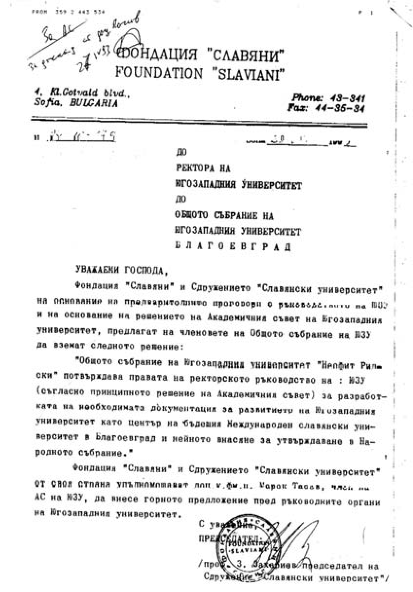

# 16. Потайната борба на фондация „Славяни“ за създаването на Славянски университет в Благоевград

През 1993 година започна упоритата борба за приемане най-после статута на
Югозападния университет. Когато започнах разработването на мотиви за
необходимостта от утвърждаването на статут на университета, научих, че преди
моето назначаване за зам.-ректор, с ръководството на университета е имало
няколко срещи и е разговаряно с проф. Захари Захариев, председател на
Федерацията за приятелство с народите на Русия и ОНД, на фондация „Славяни“ и
сдружението „Славянски университет“ и е било взето решение Академичният съвет да
предложи на Общото събрание Югозападният университет „Неофит Рилски“ да се
развие като Международен славянски университет. Както вече подчертах, когато
научих за това от проф. Чимев, когато настояваше да ме назначи за временно
изпълняващ длъжността зам.-ректор реших да приема предложението му, за да спася
университета от това нелепо решение.

Не исках да повярвам, че някои от моите колеги са прогнозирали такова развитие
на нашия университет в Югозападна България. В писмото, което бе изпратено от
председателя на сдружение „Славянски университет“ проф. З. Захариев до ректора
на университета и Общото събрание, се споменава, че „сдружението упълномощава
доц. Марек Тасев да внесе горното предложение пред ръководните органи на
Югозападния университет». Предварително уточнено е и решението, което е трябвало
да вземе Общото събрание на университета за разработване на необходимата
документация за развитието на Югозападния университет като Международен
славянски университет в Благоевград и нейното внасяне за утвърждаване в
Народното събрание.

Не се мина много време и проф. Захариев отново дойде в университета, за да
настоява взетото решение на Академичния съвет да се внесе в Общото събрание. Той
вече знаеше за моята остра реакция по отношение на неговото предложение. За
съжаление зам.-ректорът по учебната работа доц. Илия Гюдженов потайно подкрепяше
създаването на Славянски университет. Когато проф. Захариев отново се появи в
университетта, му казах повече да не се намесва в работата на ректорското
ръководство и да спре да решава съдбата на Югозападния университет. Той ме
изгледа намръщен и ми каза с тих глас, за да не го чуят другите:

– Знам, че Вие сте най-големият противник на нашата идея за преобразуването на
вашия университет в Славянския университет. Аз не вярвам, че ще успеете да
получите статут на университет в Народното събрание дори и да утвърдите нови
факултети. Предложението, което сте направили, няма да мине. Нашите депутати от
БСП си знаят работата, за да не стане това.

След като чух това от проф. Захариев, имах среща с проф. Илия Конев, когото
подготвяха за ректор на Славянския университет. Той беше тежко наранен от
„перестройчиците“ в нашия университет, които изсипваха срещу него грамади от
неоснователни клевети и лъжи, но не приемаше предложението и на неговия колега
проф. Захариев, защото вече беше известен като „кръстникът“ на Югозападния
университет, който направи много за неговото утвърждаване. След това обаче стана
първи ректор на Славянския университет в София, където се водеха схватки за
неговото управление и през 1999 г. беше закрит от Народното събрание.

> *Писмото на проф. З.Захариев, председател на Сдружение „Славянски университет“
> до ректора на Югозападния университет и неговото Общо събрание за развитието му
> като център на бъдещия Международен славянски университет*

Възложено ми бе от проф. Чимев да докладвам за моето становище пред Академичния
съвет. Когато се обявих категорично против вече взетото предишно решение и
обосновах моите доводи, членовете на Академичния съвет замълчаха. Никой не се
реши да ми възрази, защото се убедиха, че това опасно предложение на проф.
Захариев застрашаваше бъдещото развитие на университета. Но за него вече бяха
научили някои от депутатите в Народното събрание. Особено остра, съвсем
основателна, бе реакцията на парламентарната група от Съюза на демократичните
сили. Когато споделих със Стефан Савов за моя категоричен отказ като зам.-ректор
на направеното предложение от проф. Захариев и промяната, която постигнах в това
отношение на предишното решение на Академичния съвет, той се зарадва и ми обеща,
въпреки че не беше вече председ ател на Народното събрание след подадената от
него оставка, да преодолее създаденото недоволство на някои от сините депутати.
Оказа се обаче, че отделни депутати от парламентарната група на БСП, с активното
участие на преподаватели комунисти от нашия универстет, подкрепяха предложението
за утвърждаване статут на Славянския университет в нашия град на мястото на
Висшия педагогически институт. Тази надежда на инициаторите за създаването на
Славянски университет в Благоевград изгасна през 1994 г., когато набързо той
беше утвърден от Народното събрание със седалище в София. За негов ректор беше
избран отначало проф. д-р Илия Конев, а след него – проф. Захариев. Както вече
подчертах, след това този университет беше закрит. Такава щеше да бъде съдбата и
на Югозападния университет, ако не беше упоритата ми дейност, свързана с
неговото запазване и утвърждаване. Тази истина все още се укрива от онези, които
потайно мечтаеха за „славянска академична крепост“, която да съхранява руските
интереси в България.

След приемането на „Закона Панев“ борбата срещу новото ректорско ръководство
продължи. В нея се включи и народният представител Емил Костадинов от БСП. В
неговото питане до Министъра на образованието и науката Марко Тодоров се
намекваше даже за необходимостта от свикване на Общото събрание на университета,
както и за „подбора на научния и преподавателския състав“ (вж. в. Югозападен
университет „Много питащ депутат получи сконфузващ отговор“, бр.1, март, 1994
г.).

Който не е бил в люта битка с комунистите в Югозападния университет, той не знае
нищо за техния морал и неадекватното им поведение. Всеки ден, всеки час те
воюваха открито срещу новото ректорско ръководство. Най-жестока беше битката им
срещу мен.

Надигна се цялата студентска организация, която излезе със специална декларация
в защита на ректорското ръководство. Студентите не се страхуваха да разкрият
нестихващата борба на комунистите за „вечна власт“ в университета. Подготвяха
преврат по опорните точки, които им бяха дадени от ЦС на БСП. Като разбраха
това, надигнаха се и синдикатите в защита на новите ръководства в катедрите,
факултетите и ректората. И те излязоха с декларация в защита на ректорското
ръководство.

В тези трудни, много трудни дни за университета зад ректорското ръководство
застана и студентската организация, ръководена от най-будните студенти. Никога
няма да забравя помощта, която ни оказваха някои от нейните ръководители като
Стефан Иванов, студент от Историческия факултет, който се ползваше с
изключително голям авторитет сред преподавателите и студентите.

*Декларация от ръководството на студентската организация против клеветническата
кампания на организираната червена група в Югозападния университет*

*Студентът Стефан Иванов беше най-ревностният помощник на ректорското
ръководство при преодоляване на трудностите, които създаваха бившите партийни и
комсомолски ръководители за прилагането на „Закона Панев“ в Югозападния
университет „Неофит Рилски“*

