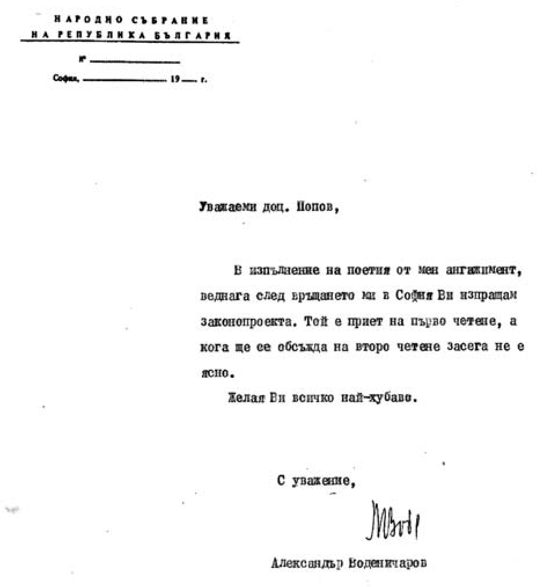

# 18. Истината с факти и документи

В интервюта, дадени от доц. Илия Гюдженов, ректор от 1999 до 2007 година, по
повод юбилейна годишнина на Югозападния университет „Неофит Рилски“, на въпроса
на журналистката Димитрина Асенова дали е било силно лобито, свързано с даване
статут на университета, той скри истината (вж.в. „Струма „, декември, 2006 г.,
с. 9 и „Университетски преглед“, бр. 2, 2006 г., с. 53). Съвсем ясно изпъкна
съзнателното подценяване на безспорния принос на конкретни лица – университетски
ръководители, преподаватели, депутати и държавници, които положиха големи усилия
за преобразуването на Висшия педагогически институт в университет.

За пореден път пролича самоизтъкването му като „строител“ на Югозападния
университет. Той беше вече забравил тези години, когато негова основна грижа
като зам.-ректор бе да се премества от един в друг държавен апартамент, за да се
добере в самия център на града, докато някои негови колеги от ректорското
ръководство ежедневно лобираха къде ли не за утвърждаване статута на Югозападния
университет.

Спомням си, че доц. Илия Гюдженов през една от тези по-далечни години, забравени
от него, ме помоли да се застъпя пред зам.-кмета Георги Пашов да разшири
апартамента си със съседна гарсониера, която е била свободна. Скри обаче, че
вече беше нахълтал в гарсониерата. Когато се срещнах със зам.-кмета, той ме
погледна учудено и ми каза:

– Нима не знаеш, че вашият колега ще бъде съден за това, което е извършил?

Помолих го да не се завежда дело. Така и стана. По-късно меракът на доц.
Гюдженов мина, когато се премести точно на пъпа в Благоевград в жилищния блок
„Лирата“.

И така, жалко, че някогашният мой колега доц. Гюдженов като някогашен
зам.-ректор е забравил, или пък не иска другите да знаят, как беше създаден
статутът на нашия университет. Затова сега ще му припомня истината за това
трудно време.

Първо. Не „покрай другите учебни заведения нашият университет получи статут“, а
другите заради него, т.е. покрай нашия други получиха прибързано през 1995
година незаслужено такъв. Именно затова тези университети са му по своеобразен
начин задължени, а не той на тях.

Второ. Цялостната работа, свързана с подготовката за даване статут на
университет на бившия Падагогически институт в Благоевграде, е най-ползотворната
в неговата история, защото е тясно свързана с разширяване и утвърждаване на
неговата съвременна структура.

>   През тези трудни години зам.-ректорът по учебната част доц. Илия Гюдженов се
>   криеше в някаква дълбока сянка, или пък се оплакваше от здровословни
>   проблеми, които след това обаче бързо изчезнаха.

Какво направих аз като зам.-ректор, който понякога изпълнявах задълженията и на
други мои колеги от ректорското ръководство? Неудобно е, но трябва да се даде
отговор на този въпрос, защото паметта на някои се оказа много къса.

Разработих в 6 страници основните мотиви за даване статут на университет на
Висшия педагогически институт, които за първи път дадох да прегледа гл. ас.
(сега професор) Антони Стоилов. След обсъждане и утвърждаването им от
ректорското ръководство ги предадох на 21 октомври 1993 г. на председателя на
Народното събрание Александър Йорданов, който внесе проект за решение за даване
статут на Югозападния университет. Предложението беше подкрепено и от 17 други
вносители от различни партии, повечето от които от Благоевградски окръг (Ивайло
Ловджиев, Иван Будимов, Емил Костадинов, Емил Юруков, Стефан Продев, Александър
Маринов, Георги Марков, Маргарит Мицев, Емил Бучков, Иван Куртев, Николай
Добрев, Владимир Джаферов, Александър Праматарски, Йордан Ройнев, Филип Боков,
Георги Пирински и Тошо Пейков).

>   *Д-р Ивайло Ловджиев е първият вносител на проекта в Народното събрание за
>   даване статут на университет на Висшия педагогически институт*

Нито веднъж някои от моите колеги от ректорското ръководство не пожелаха да
дойдат заедно с мен в Народното събрание, за да помогнат при подготовката за
даване статут на университета. Те предпочитаха да си наглеждат грижливо личните
дела. След назначаването на доц. Магдалена Глушкова за зам.-ректор тя прие
присърце задачите, които ѝ поставях за подготовката на юбилейния концерт в
София, на който присъстваха много депутати и посланици. Често с мен бяха гл.ас.
Антони Стоилов и студентът Стефан Иванов, които ми помагаха всеотдайно. Не мога
да отмина шофьорът Димитър Димитров, който е живият свидетел на моите постоянни
контакти с депутати и политици за утвърждаване статута на университета.

Заедно с д-р Ивайло Ловджиев създадохме т.нар. депутатско лоби в парламента в
защита на Югозападния университет. Голяма част от останалите депутати
подготвяхме за предстоящото активно участие при гласуването на предложението.

През тази година добра помощ в парламента ми оказваше доц. Александър
Воденичаров, който беше парламентарен секретар. Уговорихме се с него да следи
дневния ред на заседанията и да ме уведомява за всичко, което е свързано с
нашето предложение за утвърждаване на статута на университета.

>   *Уважаеми доц. Попов,*

>   *В изпълнение на поетия от мен ангажимент, веднага след връщането ми в София
>   Ви изпращам законопроекта. Той е приет на първо четене, кога ще се обсъжда
>   на второ четене засега не е ясно.*

>   *Желая Ви всичко най-хубаво.*

>   *С уважение:*

>   *Алексанадър Воденичаров*

За първи път в залата на Народното събрание беше внесено нашето предложение за
гласуване статута на Югозападния университет. Все още нямаше други висши
училища, кандидати за промяна на техния статут.

Още на първото заседание всички, които взеха участие при обсъжданетоq подкрепиха
преобразуването на Висшия педагогически институт в Югозападен университет
„Неофит Рилски“. На два пъти се стигна до гласуване. Преживявах с голямо
вълнение тези заседания. Първият път, преди самото гласуване, се поиска почивка
от член на една от новите парламентарни групи. А вторият път, когато бях
сигурен, че предложението вече ще се гласува, и то единодушно в наша полза,
неочаквано проф. Марков от групата на т.нар.“мравки“ от СДС предложи да се
отсрочи гласуването. Наблюдавах цялата зала, защото бях на един от балконите.
Забелязах недоволството на повечето депутати, но нямаше какво да се
направи.Такъв е бил редът, уточнен в правилника на парламента. Заедно с шофьора
ми Димитър Димитров се върнахме чак след полунощ в Благоевград.

По-нататъшните препятствия, свързани със забавяне гласуването в парламента за
даване статут на Югозападния университет, бяха свързани с разработените критерии
от Министъра на образованието Марко Тодоров за промяната в статута на висшите
училища. Основното изискване в тях беше осигуряването на необходимия брой
хабилитирани преподаватели (професори и доценти), които да са на постоянна
месторабота. Говореше се и за приемане на нов закон за висшето образование.

Усилената подготовка за даване статут на университет на Висшия педагогически
институт бе тясно свързано с:

&minus;привличане на хабилитирани преподаватели, което изискваше да се използват
    стимули (по-високи заплати, осигуряване на квартири и др.)

&minus;откриване на процедури за хабилитиране

&minus;обявяване на конкурси за докторанти

&minus;създаване на нови специалности и факултети, както и на по-тесни връзки с
    висши учебни заведения в чужбина и др.

На 19 май 1993 г. Академичният съвет, след проведено тайно гласуване, единодушно
ме избра за зам.-ректор. Дотогава бях временно изпълняващ длъжността. Никога
няма да забравя, че колегите от Академичния съвет ме подкрепяха ревностно във
всяка една стъпка, която правeх за приемане статута на Югозападния унивреситет и
утвърждаване на неговата нова структура.

