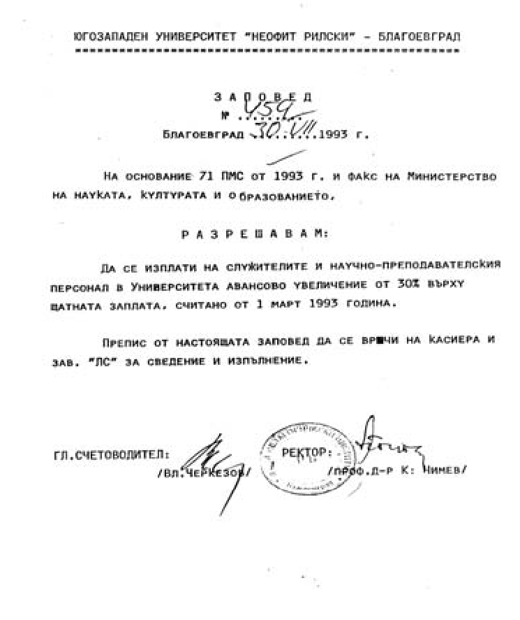

# 19. Първото повишаване на заплатите на преподавателите и служителите

През м. юни 1993 г. по моя инициатива се създаде организационен комитет, в който
бяха включени представители на сандикатите. Подготвихме проект за нови
индивидуални заплати, съобразени с нормативните документи. През това време
ректорът отново беше извън страната. Поканих лично министъра на социалните грижи
проф. Шопов и зам.-министъра Горан Банков, за да съгласуваме нашето решение. На
вечерята в ресторант „Ален мак“ те ми казаха, че проектът за новите индивидуални
заплати заслужава специално внимание, защото такава смела стъпка не беше
направил никой от другите университети, в които заплатите бяха чувствително
по-ниски. Тази т.нар от „смела стъпка“ от тях обаче ни беше необходима, за да
привлечем ярко изявени университетски преподаватели в нашия университет.

Няма да скрия, че през това време някои от моите колеги, дори и от ректорското
ръководство, бяха пощурели да правят някакъв бизнес или пък да печелят пари по
„потаен“ начин. Ако стане нужда ще разкажа и за всичко това. Захласнат в
упоритата борба за утвърждаване авторитета на университета и създаване на
условия за разрастване на неговата структура, не обърнах внимание на здравето
си, както и на нестихващата, програмирана атака срещу мен от бившите партийни и
комсомолски секретари и техните протежета.

При завръщането си от чужбина проф. Кирил Чимев също изрази опасение от
подготвеното увеличение на заплатите, но у мен такова нямаше, затова на 30 юли
1993 г. подписах вместо него заповед № 459 на основание 71 ПМС от 1993 г. и факс
на Министерството на науката, културата и образованието, с която се разрешаваше
да се изплати на служителите и на научнопреподавателския персонал в Университета
авансово увеличение от 30 % върху щатната заплата, считано от 1 март 1993 г.
Спомням си, че някои от колегите се страхуваха да получат новите си заплати.
Мислеха, че след време ще трябва да връщат увеличението. Същият ден подготвих и
подписах и другата заповед № 461/ 30 юли 1993 г., в която определих в срок до 20
август 1993 г. комисията за определяне на работната заплата, назначена със
заповед № 370 от 15 юни 1993 г., да подготви проект за нови индивидуални
заплати, съобразени със съответните нормативни документи.

През това време все още разчиствах авгиевите обори, които бяха създадени в
Отделението за повишаване квалификацията на кадрите. Издадох специална заповед,
с която прекратих произволно откриваните курсове за специализация и
преквалификация на педагогическите кадри към отделните центрове за
научноизследвателска и приложна дейност, без знанието и под контрола на
Отделението за повишаване на квалификацията на кадрите. Наредих издаваните
документи (уверения и свидетелства, дипломи и други) да се считат за
недействителни, ако не са регистрирани и получени от Отделението за повишаване
квалификацията на кадрите.

>   *И под тези изключително важни документи, свързани с повишаване заплатите на
>   преподавателите и служителите стоеше пак моят подпис*

Новината за повишените заплати в Благоевградския университет се разнесе бързо.
Не е тайна, че това решение стимулира изтъкнати български учени да се ориентират
към нашия университет, които бяха назначени на постоянна месторабота или по
съвместителство.

Въпреки създадената спокойна атмосфера за истинска академична дейност в
университета, все още онези, които бяха засегнати от „Закона Панев“ и вече не
бяха на ръководни места в университета, продължаваха да разнасят слухове, че за
развитието му има две верни посоки, едната да си остане само като педагогически
институт, а другата – да се развива като бъдещ Славянски университет. За да
разбия тези неверни прогнози, продължавах упорито да търся привърженици за
приемане статута на Югозападния университет и сред някои от ректорите на вече
утвърдените университети у нас. В това отношение ревностна подкрепа получих от
ректора на Софийския университет проф. Иван Лалов, който беше и председател на
Съвета на ректорите. Много често той ме канеше на техни тържества и намираше
повод да подчертава, че Югозападният университет изгражда оригинална академична
структура, от която трябва да се поучи и Софийският университет. С него вече бях
споделил идеята си за създаването и утвърждаването на Факултет по изкуствата,
какъвто нямаше в Софийския университет.

При едно от следващите ми посещения в Народното събрание разбрах, че
председателят на Комисията по образвание Димитър Сепетлиев не е бил съгласен да
се даде статут на нашия университет. При срещата ми с него той се държеше като
обиден, защото беше кандидатствал за професор във вече известната академична
пирамида Инжинерно-педагогически факултет, но по неизвестни причини молбата му
не е била уважена. Казах му, че личната обида не бива да бъде основание, за да
се отправят закани, явно декларирани срещу утвърждаване статута на университета.
Той обаче твърдеше, че има изключително неприятни впечатление от този факултет и
каза, че неговият декан Николай Божков е истински Остап Бендер.

&minus;Ако и другите ви факултети, колега Попов, са такива пирамиди, какъв
    университет ще правите от тях?

След това, което чух от Сепетлиев, замълчах. Защото той назоваваше самата истина
за т. нар. „Божков факултет“. Уверих го, че другите факултети вече са утвърдили
своя авторитет, а новите се изграждат успешно.

При този разговор с проф. Сепетлиев близо до нас беше шофоьорът ми Димитър
Димитров, който се обърна към мен и ме попита: – Какво да правя?

Бяхме се уговорили с него да отиде да вземе с колата проф. Йордан Венедиков, а
след това да мине през парламента и да си тръгнем за Благоевград. Но проф.
Сепетлиев разбра съвсем иначе въпроса на Митко, който наистина го гледаше
намръщен и заплашително като чу разговора ни.

&minus;Ако и в парламента кажа тези неща, които зная за Остап Бендер и други като
    него, сигурно ще проваля приемането на статута му. Но с вас се уговаряме, че
    ще пазя неутралитет, нали?

Нямаше как, приех уговорката с проф. Сепетлиев и му казах, че отсега нататък ще
разговарям със зам.-предсдетаеля на Комисията по образование проф. Захари
Райков, а той да пази неутралитет.

След няколко дни се срещнах в парламента с проф. д-р Захари Райков, с когото се
разбрахме да посети Югозападния университет, за да придобие преки впечатления от
него. Не се минаха повече от десет дни, когато той пристигна и разгледа цялата
материална база. Не познаваше нашия край, затова направихме обиколка в няколко
града, с които университетът бе създал прекрасни академични взаимоотношения. На
тръгване той не скри вълнението си от посещението и каза:

&minus;Колега Попов, вашият край е най-подходящото място за един от най-силните
    български университети. Аз ще бъда ваш ревностен защитник в тази национална
    кауза.

Така и стана. Димитър Сепетлиев повече не се обявяваше открито против статута на
нашия университет. С проф. Захари Райков станахме добри приятели и всякога,
когато ходех в Народното събрание, се срещахме с него, за да преодоляваме заедно
трудностите, които създаваха неприятелите на Югозападния университет. Той беше
широкоскроена личност и истински учен в неговата научна област.  

