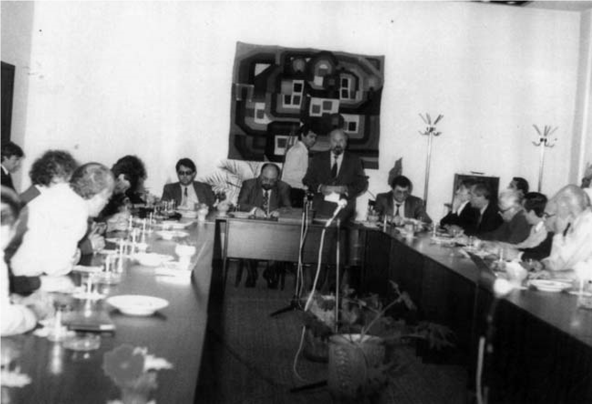

# 20. Председателят на Народното събрание Александър Йорданов в Благоевград

В началото на учебната 1993 – 1994 г. се срещнах с председателя на Народното
събрание Александър Йорданов. Разговорът ни беше продължителен. Настоявах за
по-бързото приемане статута на нашия университет. Предложих му да дойде в
Югозападния университет, за да се увери и той, че висшето ни училище отговаря на
всички изисквания за даване статут на университет. От друга страна вярвах, че
неговото посещение ще разсее слуховете, които разпространяваха все още
провържениците за създаване на Славянски университет в Благоевград.

За съжаление, в това напрегнато време, свързано с по-нататъшната съдба на нашия
университет, някои мои колеги от ректорското ръководство обичаха повече своите
„околосветски пътувания“. Те нямаха никакъв конкретен принос за развитието на
университета като научно и просветно средище в Югозападна България. След това
обаче, както вече подчертах, започнаха да си приписват съвсем неоснователно
някакви заслуги, каквито нямат.

На 30 септември Александър Йорданов пристигна в Югозападния университет заедно
със съветника си доц. Румен Кънчев. На срещата, която подготвих с него, беше с
разширения Академичен съвет при присъствието на гости, между които имаше и
депутати. Тук бяха и областният управител Любими Пранжев и кметицата на
Благоевград Елиана Масева.

Отначало запознах гостите с актуалната тема “Състояние и перспективи в
развитието на Югозападния университет“. За съжаление и този път отсъстваше проф.
Кирил Чимев, ректор на университета, когото преди това упорито умолявах да
отложи пътуването си в чужбина, което не беше от особена важност. Във всички
изказвания по време на тази среща с Александър Йорданов се подчертаваше
необходимостта от по-бързото приемане статута на университета. Председателят на
Народното събрание не скри, че преди идването си в Благоевград се е посъветвал
със зам.-председателя на Парламентарната комисия по образованието проф. Захари
Райков, с ректора на Софийския университет Иван Лалов и с министъра на
образованието Марко Тодоров. Това негово признание ме успокои, защото аз вече
бях направил срещите си с тях, на които разговаряхме надълго за нашата цялостна
готовност Висшият педагогически институт да получи официално статут на
университет.

След задълбочения ни разговор за статута на университета в залата на Академичня
съвет, Александър Йорданов се срещна и със студентите в зала „П. К. Яворов“,
пред които изнесе лекция за проблемите в образователната система.

>   *Посещението на Председателя на Народното събрание Александър Йорданов в
>   Югозападния университет*

Когато след посещението на проф. Захари Райков и на председателя на Народното
събрание Александър Йорданов изчезна наклажданото негативно отношение на някои
депутати към нашия университет, депутатът от БСП Емил Костадинов, който е от
Благоевград, изпрати писмено донесение до парламента и министъра на
образованието, в което пише, че „качествата на членовете на академичното
ръководство и недоверието към равнището на учебния процес, което имало сериозно
основание да се предполага, че моментното състояние на института можело да
минира неговото бъдеще“ (вж.в.“Струма“, 14 .12. 1993 г., с.2).

Не беше тайна кои бяха истинските автори на този донос на депутата от БСП. Някои
от неговите приятели съпартийци се страхуваха да не би педагогическият факултет,
в който имаше немалко бивши комсомолски и партийни дейци да остане в дълбока
сянка при моделирането на новата структура на университета. Точно в тези
напрегнати месеци за бъдещето развитие на университета не само този насъскан
депутат, но и специално натоварени журналисти във вестник „Струма“ хулеха
непрекъснато университета и неговото ръководство.

