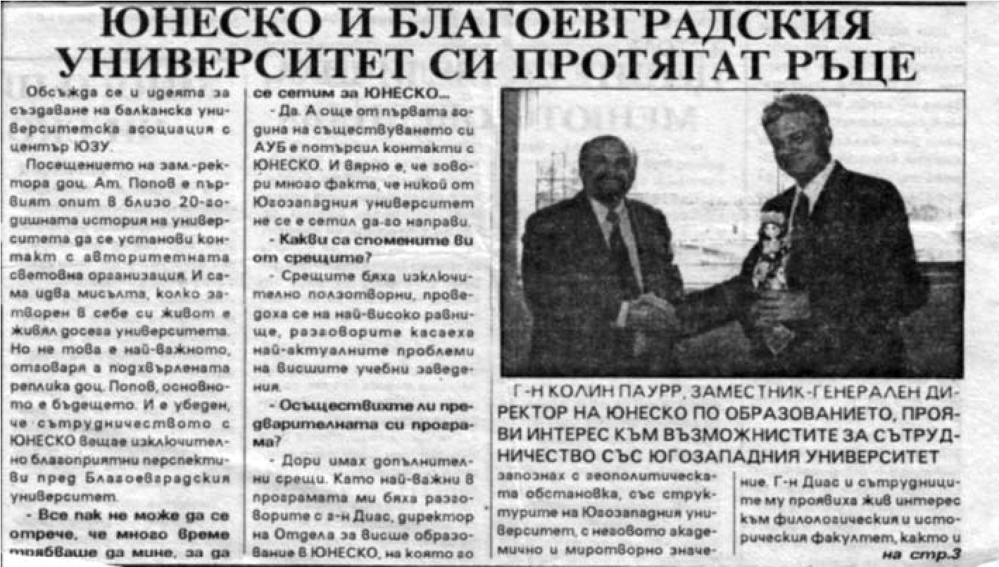

# 24. На посещение в ЮНЕСКО по покана на отдела за Висше образование

Особено ползотворна за укрепване авторитета на Югозападния университет се оказа
специалната покана, която получих от Отдела за висше образование на Юнеско за
десетдневна проучвателна визита.

По време на посещението ми в Париж през м.февруари 1994 г. имах прекрасната
възможност да се срещна и разговаряме обстойно за нашия университет с Колин
Пауър – зам.-генерален директор на Юнеско, Антонио Диас, директор на Отдела за
висше образвание, както и с неговите колеги от сектор „Образование“. По време на
срещите ни обсъждахме възможността за включване на Югозпадния университет в
мрежата на висшите учебни заведения, в които вече имаше създадени катедри „
Юнеско“, както и актулни въпроси, свързани с реформиране на учебните програми и
учебници, с подготовката на преподавателите, които да отговарят на новите
изисквания .

>   *Поканата, която получих от отдела за Висше образование на Юнеска за
>   десетдневна проучвателна визата*

Направи ми впечатление, че до моето идване в Юнеско името на нашия университет
не се срещаше никъде в справочните документи на световната организация. Истината
е, че в близо 20-годишната история на университета посещението ми бе първят опит
да се установи контакт с нея. Създаденият Американски университет в Благоевград
бе потърсил контакти веднага с Юнеско, затова много често по време на срещите ми
беше поставен въпросът какво е моето отношение към него. Тогава този университет
бе направил първите си стъпки, но специалистите от направление „Висше
образование“ вече знаеха всичко за все още нерешените проблеми в него.

Когато научиха от мен за геополитическото място, структурата и специалностите на
нашия университет, те го оценяваха като много значим за развитието на висшето
образование на Балканите, поради което отделиха специално внимание и грижи за
развитието му. Изключително голям интерес проявиха към филологическия,
историческия и новосъздаващия се факултет по изкуствата. Разбира се, с интерес
посрещнаха и информацията ми за другите факултети (природо-математическия,
икономическия и правния). Когато подчертавах, че в педагогическия факултет имаме
солидни традиции и е водещ в страната за подготовка на начални учители, А. Диас,
директор на направление „Висше образование“, прояви изключително голям интерес
към него. Той ми каза, че нашият опит в това отношение заслужава да бъде проучен
по-задълбочено от Юнеско и използван и в други европейски страни.

Много ползотворни бяха срещите ми с Д. Читоран, шеф на секцията за проекта
„Юнитуин“ и катедри Юнеско и неговите колеги Д. Беридж и И. Седлак. С тях
обсъдихме създаването на катедра Юнеско и в нашия университет. Не мина много
време след завръщането ми от Юнеско такава бе създадена, но вместо във факултета
по изкуствата, каквато бе уговорката ни в Париж, някои самоволно я откриха във
Факултета по философия, където не беше по предназначение (повече информация за
посещението ми в Юнеско вж.: в.“Югозападен университет“, Юнеско и
Благоевградския университет си протягат ръце, март 1994 г., с.1 и 3; в.
“Пиринско дело“, 18 февруари 1994 г., с.1 и 4; в. “Струма“: Доц Ат. Попов
поканен в Париж, Юнеско съдейства на ВПИ.1994 г.).

Голяма заслуга за ползотворното ми посещение в Юнеско и съставената програма,
свързана с осъществяването на десетдневната ми проучвателна визита в
щаб-квартирата на Организацията, имаше зам.-постоянният представител на Юнеско в
Париж Искра Пъневска.

*След срещата-разговор с Д. Читоран, Д. Берадж и И. Седлак .*

