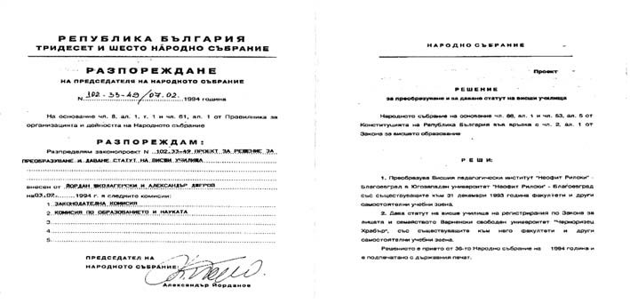

# 25. Още две трепетни очаквания за гласуване статута на Югозападния университет

Няколко дни след завръщането ми от Юнеско в Париж, отидох в Народното събрание,
за да ускоря внасянето на предложението за приемане статута на университета ни.
Отново бяха представени разработените мотиви, които се обсъждаха от депутатите.
Получих уверение от председателя на Народното събрание след 20 април да включи в
дневния ред гласуването на статута на Югозападния университет. Бях отново на
балкона над заседателната зала по време обсъждането. Вълнувах се много. Вярвах,
че този път ще се върна в Благоевград с хубава новина.

Когато започна гласуването, забелязах, че групата на социалистите беше оредяла.
Депутатите от СДС спазиха решението си да гласуват единодушно за предложението
Югозападният университет да получи своя статут. Само десет депутати от БСП
гласуваха за приемане на проекта. Бях дълбоко възмутен, когато измежду тях не
видях както депутата от Благоевград Емил Костадинов, така и някои други депутати
от неговата партия, които имат корени от Пиринския край. Вече стана съвсем ясно,
че те казваха едно пред мен, а правеха друго, което им бяха поръчали техните
съпартийци от Висшия педагогически институт, които бяха против утвърждаването му
като университет (вж. БСП провали проекта на ЮЗУ, поборникът Ем. Костадинов се
скри, СДС е единодушно „за“ – в-к „Струма“, 23.04.1994 г.).

Вече и на цялата общественост в Благоевград стана съвсем ясно кой е „за“ и кой е
„против“ утвърждаване статута на Югозападния университет. Направи ми
впечатление, че противниците на нашето предложение в Народното събрание се
радваха много на случилото се в парламента. Те вече бяха сигурни, че Висшият
педагогически институт ще възкръсне и неговите предишни партийни и комсомолски
ръководни кадри ще се върнат на бял кон.

След една седмица доц. Снежана Ботушарова, зам.-председател на Народното
събрание, ми се обади, че за 12 май е насрочено ново заседание на Народното
събрание, на което отново ще се обсъжда и гласува решение за даване статут на
нашия университет и на Варненския свободен университет. И този ден бях пак на
вече познатото мое място на балкона, над заседателната зала на Народното
събрание.

Заседанието на Народното събрание започна следобяд. За пореден път по т. първа
беше внесено постъпилото проекторешение от Александър Джеров и Йордан
Школагерски.

Депутатът от Благоевград д-р Ивайло Ловджиев поиска думата за изказване. Той
напомни, че е вносител на предложение, което се отнася само за Югозападния
университет и съвсем основателно настояваше да се гласува поотделно за двете
висши училища. Не беше тайна, както заяви д-р Ловджиев, че немалко депутати
изразяваха съмнение относно необходимостта тези две висши учебни заведения да се
поставят на една и съща плоскост. Социалистите искаха техният вече известен като
„червен“ университет да мине заедно с нашия. Много убедително прозвучаха
мотивите, които бях подготвил, прочетени от д-р Ловджиев, който каза:

– Подновявам моето процедурно предложение като предлагам двата университета да
бъдат гласувани поотделно.

Тези думи стреснаха депутатите от БСП, някои от които станаха и излязоха от
залата.

Тогава председателят на Народното събрание, в подкрепа на процедурното
предложение на д-р Ловджиев, каза, че двата университета трябва да бъдат
гласувани поотделно, тъй като не могат да се поставят на едно и също място един
хуманитарен с един чисто икономически ВУЗ.

Обиденият на Югозападния университет проф. Д. Сепетлиев побърза да вземе думата
и каза, че Комисията по образование е била притеснена от това, че след внесеното
искане от Югозападния университет напоследък имало голям натиск и от други висши
учебни заведения да променят своя статут. Сепетлиев не спомена обаче истината,
че нито едно от тях нямаше разработени мотиви както тези на нашия университет.
Той подчерта, че се подготвя нов Закон за висшето образование и чак след
приемането му могат да се обсъждат такива законопроекти, както днешния.

И така, да напомня пак на самозвания „строител“ на Югозападния университет доц.
Илия Гюдженов, че другите тръгнаха след нас, а ние не минахме „покрай тях“,
както заявяваше той. Така е, който не си е мръднал пръста в тази няколкогодишна
борба за утвърждаване статута на Югозападния университет, той не знае колко
трудна беше тя.

Проф. Д. Сепетлиев се обърна към Министъра на науката и образованието Марко
Тодоров, за да получи неговата подкрепа. Министърът изрази и мнението на Съвета
на ректорите, който този ден беше взел следното решение: “Съветът на ректорите
възразява срещу промяната на статута на съществуващите университети и висши
училища, както и срещу откриването на нови университети, което трябва да бъде
отложено до приемането на нова законова уредба за акредитация на висшите
училища“.

Това Решение на Съвета на ректорите е било подписано от всички ректори.
Министърът каза, че е подписано и от онези ректори, които имат искане в
Народното събрание за преименуване на университетите или приемане на техен
статут.

Тогава се запитах:

– Къде ли е бил нашият ректор проф. Чимев, когато се е обсъждал този въпрос в
Съвета на ректорите?

Министърът на образованието Марко Тодоров отклони разговорите по разглежданото
предложение за статута на нашия унверситет. Той каза, че ще внесе проект до края
на м. юни за окрупняване на висшите училища и промяна на тяхното наименование,
за да се подготвят и другите висши училища за такава промяна. Убеден бях, че
този министър също изпълняваше някакво указание на комунистите в парламента.
Тогава още не се знаеше, но след това цъфна новината, че е бил сътрудник на
Първо управление на Държавна сигурност с агентурното име „Базов“ и е имал
специално поставена задача за изпълнение на директивите на БСП в системата на
образованието.

След казаното от Марко Тодоров, ревностна защита на Югозападния университет
направи проф. Елка Константинова, която подчерта, че не бива да се отлага
приемане статута на Югозападния университет. Когато тя заподозря, че отлагането
на това гласуване има връзка с „измисления Славянски у ниверситет“, който също
беше внесъл своето предложение за утвърждаване в Народното събрание, проф.
Захари Захариев стана и произнесе своята „пламенна“ реч за голямата необходимост
от неговото утвърждаване.

Проф. Елка Константинова настояваше упорито да се премине към гласуване статута
на Югозападния университет, но за мое учудване депутатът от СДС Стоян Райчовски
предложи да се отложи разискването по тази точка от дневния ред на Народното
събрание. Бързо на това предложение възрази моят добър приятел депутатът Иван
Будимов от СДС, който предложи да се гласува по т. 1 предложенето за статута на
Югозападния университет, а по т. 2 за Свободния университет във Варна. Той
предложи на друго заседание да се обсъжда утвърждаването на други висши училища.

Предложението на Райчовски за прекратяване на обсъжданията по този въпрос до
представянето на проект от министър Марко Тодоров за нов Закон за висшето
образование не се прие, но след това депутатите от БСП като Мими Виткова, Румяна
Куртева и други, отклониха гласуването и заседанието на Народното събрание беше
отложено за следващия ден.

И през този мъчително труден за мен ден разбрах отново за големите „игри“, които
се правеха в българското Народно събрание. Техни майстори бяха червените
депутати и агентите на тяхната Държавна сигурност, някои от които бяха превзели
и Министерството на образованието и науката.

След това „отсрочено“ приемане статута на Югозападния университет, БСП започна
ускорено създаване на своите „червени университетски крепости“ в системата на
образованието. Кадрите им вече бяха подбрани. Оставаше само денят за тяхното
„вкупом“ утвърждаване след като превземе властта. Стана ясно, че Любен-Беровото
правителство беше тяхно от 1992 до 1994 г. с повечето „независими министри“,
стъкмени от Ахмед Доган.

След около половин месец, на 27 май 1994 г., заедно с доц.Славчо Щраков и
зам.-ректора Магдалена Глушкова, заминахме на научна конференция в град Орадея,
Румъния, свързана с международното сътрудничество между университетите. Първият
въпрос, който ми постави ректорът на университета в този град, беше дали вече
сме получили статут на университет. Казах му, че предстои ново гласуване, което
очакваме. След конференцията заедно с доц. Магдалена Глушкова отпътувахме във
Виена, където трябваше да доуточним с представители на нашето посолство
създаването на по-тесни връзки с някои от университетите в Австрия.

