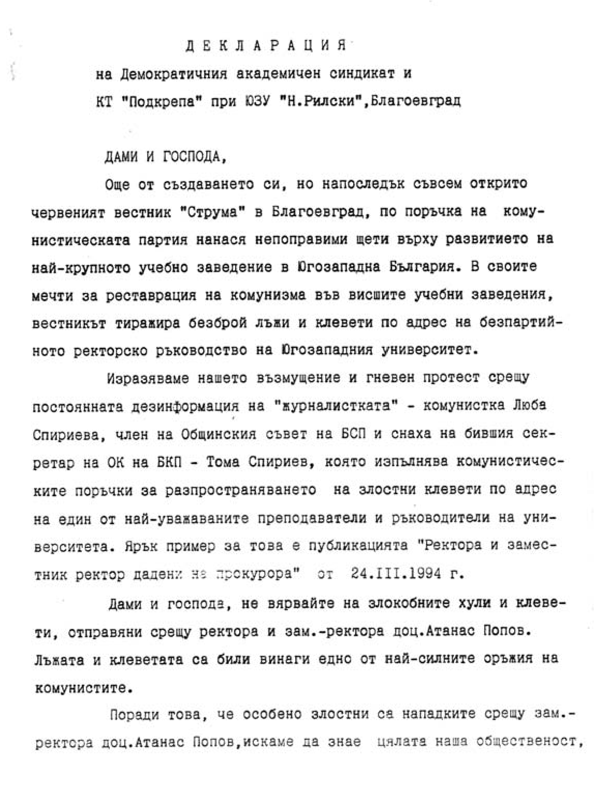

# 26. Нова червена атака

През тези напрегнати дни в моята работа бившите партийни и комсомолски секретари
в университета продължаваха атаката срещу мен. Следваха нови удари под кръста.
Измислеха се какви ли не скудоумни писания, които разгневиха студентите и
синдикатите в университета и отново излязоха в моя защита.

*Декларации на сандикатите в подкрепа на усилията ми за даване статут на
университета ни от Народното събрание и утвърждаване на неговата нова структура*

