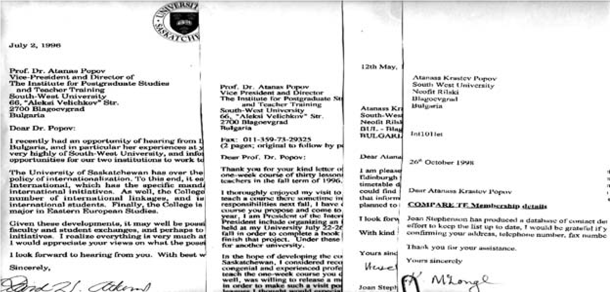
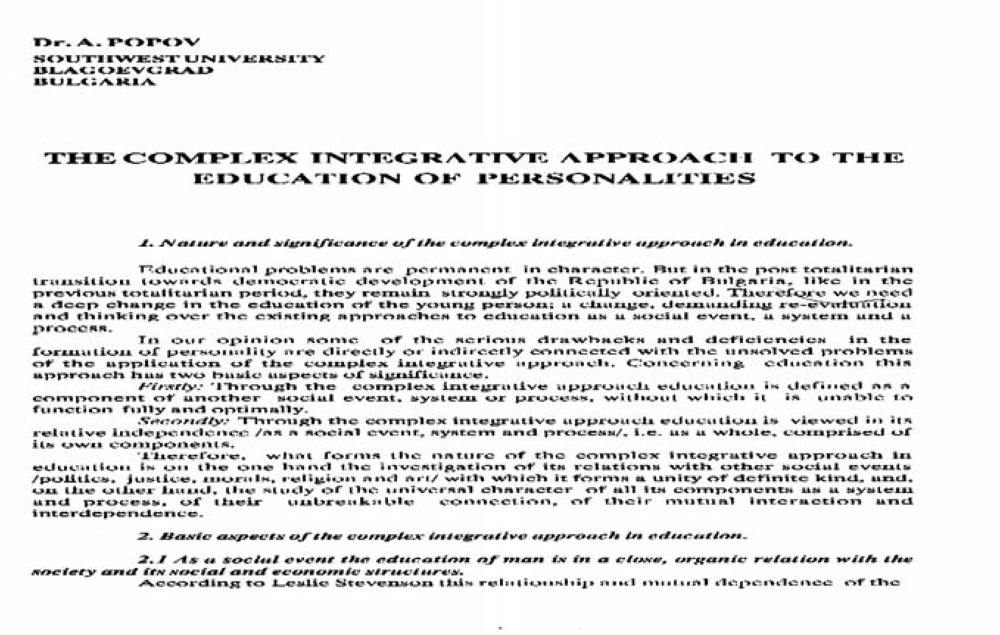

# 27. На международна конференция в Англия на тема: „Европейски перспективи в променяща се Европа“

След посещенето ми в Румъния намерих в кабинета ми около десет покани за участие
в международни научни конференции, които все още пазя в личния си архив. Реших
да приема поканата за международната конференция на тема „Европейски перспективи
в променяща се Европа“ в град Екситър, Великобритания.

В Екситър пристигнах на 27.06.1994 година. Бях приятно изненадан, че там ме
посрещна един от нобелистите, с когото се запознахме при посещението му в нашия
университет. И на него първият въпрос беше:

>   – Какво стана? Получихте ли статут на университета?

Още през първия ден в Екситър бях поканен от зам.-ректора на университета, за да
се запозная с неговата структура и специалностите, по които се подготвят
студентите. Бях удивен от това, което видях.

До учебните корпуси на университета бяха студентските общежития, а в централната
част, до ректората, се извисяваха Студентският дом на културата и Библиотеката,
където кипеше разнообразна научна и културна дейност. Наблизо се извисяваше и
черквата, от която излизаха преподаватели и студенти. Притворих очи и си
замечтах и нашият университет да има това, което поглъщах с погледа си.

На научната конференция имаше университетски преподаватели от всички европейски
страни, разпределени по секции. Преди да бъде обявен моят доклад, бях уведомен,
че към него проявяват интерес и участниците в конференцията от другите секции.
Попитаха ме дали ще се съглася да се изслуша и от тях. Тази изненада за мен беше
приятна, но и много задължаваща. Моята тема беше: „Комплексно-интегративният
подход при подготовката на педагогическите кадри“.

Разискванията по доклада бяха задълбочени и осмислени. Това беше проблемът,
който изследвах от няколко години въз основа на моя дълъг учителски и
преподавателски опит в нашия университет.

Проф. Теодор Зандер поиска препис от доклада и ми каза, че ще го изпрати веднага
в Брюксел, за да бъде публикуван в подготвения за печат сборник, който
представяше най-авангардните научни трудове на източноевропейските учени, въз
основа на които трябваше да се изгради нов модел за подготовка на
педагогическите кадри, залегнал при осъществяване реформите в Източна Европа.

По време на конференцията се сприятелих с много мои колеги, учени от цяла
Европа. Последният ден бях зарадван, че ръководството на Екситърския университет
е настоявало да остана още 3 дни, т.е. до 7 юли, за да се срещна с повече техни
преподаватели. Това бяха наистина незабравими дни, през които се запознах с
видни английски учени и най-добрите преподаватели от университета. Поканен бях
на специална вечеря от кмета на града, на която присъстваше елита на града и
ръководството на университета.

>   *Докладът ми, изнесен в Ексетър беше веднага изпратен и публикуван в
>   сборник, който се издава в Брюксел*

След посещението ми в Екситър бях включен в Британския съвет, осигуряващ
културно и образователно сътрудничество с другите страни. Получих десетки покани
за участие в международни конференции и семинари. Приятно бях изненадан, че
докладите ми бяха изпращани и в други секции на международните симпозиуми на
т.нар. Верига Compare – te, в която се обсъждаха актуалните проблеми в системата
на образованието.

>   *Това са малка част от поканите, които получавах за участие в международни
>   симпозиуми*

> *Писмо, което получих от Университета във Финландия, в което проф. Хану Рьоти
> пише: „Уважаеми проф. Попов, щастлив съм да Ви информирам, че съм изпратил вашия
> доклад на другите участници в сесията, посветена на училищната реформа“*

> *Ето и първата от десетте страници на доклада, който изнесох на международната
> конференция за комплексно-интегративния подход при подготовката на
> педагогическите кадри*

Едни от най-известните световни учени в областта на обществените науки както от
западните, така и от източните страни, проявиха изключително голям интерес към
научните ми разработки, свързани със същността и основните аспекти на
комплексно-интегративния подход във възпитанието. И когато някои от тях
настоятелно искаха да се срещаме по-често, „червената агитка“, поощрявана от
разработените опорни точки от ВС на БСП, продължаваше битката срещу мен.

На 28 юли 1994 г. беше отново внесено предложението за гласуване статута на
Югозападния унверситет от Александър Джеров. Той подчерта, че много пъти се
преминава към гласуване на това предложение, но по някакви технически или
процедурни причини се преписва в дневния ред. Той изрази отново становище, че
трябва да се гласува поотделно за всяко предложение. Отново се предлага за
гласуване само на двата университета. Това е първото решение, което се предлага.
Александър Маринов постави въпроса за отговорността за досегшните проваляния на
гласуването. Взаимно се обвиняват отделните парламентарни групи. Николай Христов
този път даде да се разбере, че сега отсъстващите от СДС ги няма заради това, че
след гласуването за Югозападния университет се подготвя и внасянето за
Славянския университет, с което те не са съгласни.  

