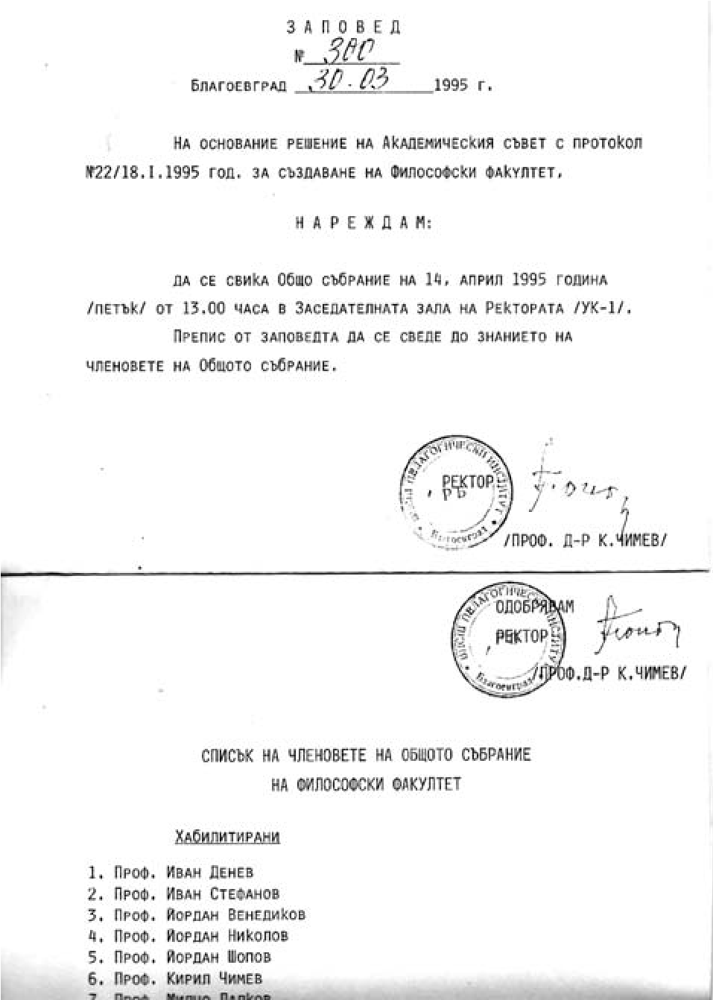

# 29. Хубаво начало и на Философския факултет

След утвърждаването на Факултета по изкуствата, като отговарящ от ректорското
ръководство за създаването на новата структура на Югозападния университет,
ускорих подготовката за създаване и на Философския факултет. Бях убеден, че без
него новата структура на Югозападния университет няма да бъде пълна. Този път
потърсих помощта на проф. Йордан Венедиков от Софийския университет, с когото
вече бяхме в много близки приятелски взаимоотношения. Както вече подчертах,
неговите родословни корени са от разложкото село Баня и произхожда от видно
възрожденски семейство. Той е син на проф. Петко Венедиков, внук на героя от
Преображенското въстание ген. Йордан Венедиков, потомък на Алеко Константинов.
Още от първите ни срещи с него взаимно споделяхме тезата, че най-важните фактори
за формирането на личността са семейството и наследствеността. Той често ми
казваше:

&minus;Атанасе, твоето прекрасно семейство, възрожденският ти род и наследеното от
    него са те направили издържлив на ударите от „червените“, които са все деца
    на онези, които слугуваха на комунистическия режим. И все пак, кажи ми, не
    се ли страхуваш от тях?

&minus;Данчо, страхът от тези хора изчезна още през детските ми години, когато
    арестуваха и пребиха от бой баща ми, който, обвит в овчи кожи, за да олекнат
    болките му, ми каза: „Насе, стискай зъби и набирай сили, когато те боли от
    техните удари! Комунистите ги е страх от нас, затова вървят по стъпките ни
    навсякъде“.

Кога ли не, къде ли не те вървяха по мен като побеснели псета и фабрикуваха лъжи
и клевети, някога за родата ми, а сега за мен. Това е тяхната храна, с която
водят своя скотски живот.

Когато подготовката за създаването на Философския факултет беше вече към своя
край, на 18.01.1995 година Академичният съвет взе решение за неговото
утвърждаване в структурата на Югозападния университет. На 30 март издадох
заповед за свикване на Общо събрание, което се проведе на 14 април 1995 г. в
заседателната зала на ректората.

Престоеше ни да осигурим необходимия брой от хабилитирани преподаватели. На
поканата ни се отзоваха изтъкнати български учени в областта на обществените
науки като проф. Ради Радев, проф. Иван Стефанов, проф. Йордан Венедиков, проф.
Иван Денев, проф. Славчо Вълчанов, ст.н.с. Петко Божиков, ст.н.с. Пепка
Бояджиева, доц. Витан Стефанов, доц. Александър Рангелов, доц. Валери Динев,
доц. Димитър Киров и др. Посочените университетски преподаватели бяха и членове
на първия Факултетен съвет, заедно с някои изтъкнати учени и от другите
факултети на университета. Един от тях беше и моят добър приятел проф. Милчо
Лалков. По настояване на колегите, за да бъдем по-близо до тях и да помагаме за
утвърждаването на факултета, бяхме избрани и двамата с проф. Кирил Чимев.

Отначало във Факултета по философия бяха открити специалностите „Теология и
философия“ и „Социология“, а от следващата година и специалност „ Политология“,
по които беше извършен прием на студенти.

Никога няма да забравя декана на Философския факултет проф. Иван Стефанов, който
с тиха стъпка често идваше в кабинета ми, за да споделя някои от проблемите,
които трябваше да решаваме заедно. Приятни спомени имам и за тогавашните
преподаватели проф. Александър Рангелов, доц. Лазар Копринаров, доц. Георги
Апостолов, доц. Мария Серафимова и други. Свой дял за укрепване на факултета има
проф. Витан Стефанов, който беше и негов декан. Още в самото начало той идваше
на срещите ни с проф. Йордан Венедиков и моя съученик от Неврокопската елитна
гимнзия проф. Петко Божиков, който се радваше на всичко, което постепенно
израстваше в нашия университет.

Помня първата международна научна конференция, която беше посветена на
православното богословие, организирана от Философския факултет. Беше в Рилския
манастир. Имаше много учени от други страни. Все още пазя моето встъпително
слово на конференцията, в което анализирах взаимната връзка и обусловеността
между православното християнство и възпитанието. След всеки доклад имаше оживени
разисквания, а след това незабравими разходки из Рилската обител.

Сега, когато срещна професор Борис Манов, декан на Философския факултет, винаги
възкръсват спомените ми за онези, с които го създадохме с немалко трудности.
Радвам се, че сегашното деканско ръководство създава истинска академична
атмосфера във факултета, която укрепва и авторитета на университета.  

