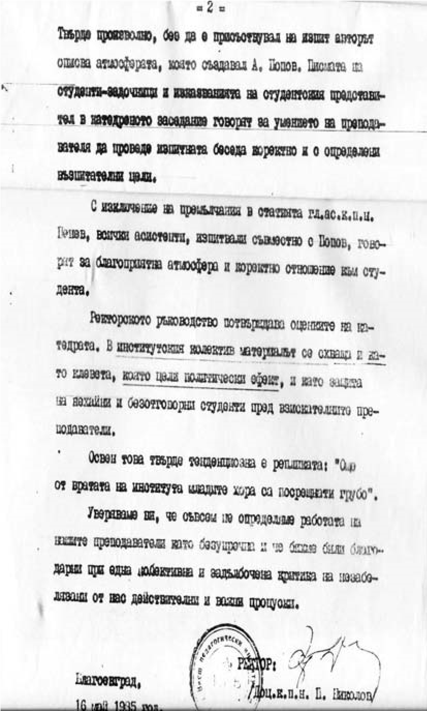

# 3. Първите удари под кръста

Когато в Катедрата по начална училищна педагогика бе открит конкурс за доцент по
теория на възпитанието, онези, които все още криеха своята завист към мен за
научното ми израстване, се чудеха как да възпрат избора ми. Неочаквано за всички
от катедрата и факултета излезе скроеният компромат „Първи срещи с
педагогиката“, публикуван на 26.04.1985 г. неслучайно във вестник, който беше
орган на ЦК на БКП. Намерен бе подходящ негов автор, който да изпълни поръчката
смело, без страх. Той произхождаше от ортодоксално комунистическо семейство. В
пасквила се твърдеше, че съм заплашвал студентите със страшния ден на изпита, че
конспектът, по който съм ги изпитвал, е бил различен от предварително
раздадения, че съм имал негативно отношение към онези студенти, които са деца на
партийни функционери.

Тези клевети бяха определени като чудатости в моята работа като преподавател. С
тази публикация злосторниците очакваха да бъде провалена кандидатурата ми за
доцент. Пасквилът се посрещна с недоумение от моите колеги във факултета. На
извънредно заседание на катедрата колегите отхвърлиха обвиненията от журналиста
срещу мен като неверни и тенденциозни твърдения (вж. протокол № 15 от 14.05.1985
г.).

– Защо точно сега, когато гл.ас. Попов е пред избор за доцент, излиза тази
нелепа публикация? Не е ли това преднамерена клевета срещу него?

Тези въпроси бяха поставени от няколко колеги, след което катедрата взе следното
решение:

„Катедрата по начална училищна училищна педагогика не приема оценката в
статията, характеризираща и окачествяваща работата на гл.ас. Попов като
преподавател. Проявите, които са посочени, не са характерни за него, не са негов
стил на работа“.

Факултетното и ректорското ръководство потвърдиха оценките на катедрата. В
специално изпратеното писмо от ректора до Председателя на Съвета за висше
образование пише:

„В институтския колектив материалът се схваща и като клевета, която цели п о л и
т и ч е с к и ефект“.

> *Писмото на ректора на Югозападния университет, изпратено до Председателя на
> Съвета за висше образование за публикацията срещу мен в орган на ЦК на БКП, с
> която се целеше да бъде прекъсната процедурата ми за доцент и уволнен като
> преподавател.*

Стана съвсем ясно защо именно преди избора ми за доцент клеветниците са
фабрикували пасквила. И този път се разминах със специално подготвен срещу мен
политически удар, какъвто получих и преди защитата на кандидатската ми
дисертация в Института за културно-просветни кадри.

По повод на публикуваната клевета срещу мен беше направена анкета със
студентите, резултатите от която ми бяха представени, за да се уверя, че те са
много доволни от моята преподавателска дейност. Когато заставах пред тях по
време на лекциите, те ме слушаха винаги с изключително голямо внимание. А по
време на почивките ме отрупваха с въпроси, свързани с възмущението им от
публикацията. От тях научих, че съпругът на една от колежките, който беше
журналист в местен червен вестник, често се явявал неканен при тях и ги
уверявал, че ще помогне на друг негов колега от централен вестник да се „удари“
съперникът на съпругата му, която беше моя колежка и е трябвало специално само
за нея да се открие процедура за доцент. В катедрата обаче се носеше слух, че е
обвинена в плагиатство, което след това се доказа и беше уволнена дисциплинарно
по предложение на ръководителя на катедрата доц. Мария Белова.

> *Това са част от отговорите на въпросите, поставени в анкетата към студентите,
> които подчертават спокойната атмосфера при изнасяне на лекциите и провеждането
> на изпита*

На 21 ноември 1985 г. бях избран с пълно мнозинство от Висшата атестационна
комисия за доцент по педагогика. Двамата с доц. Мария Белова (сега професор), тя
– като ръководител, аз – като зам.-ръководител, създадохме спокойна и творческа
атмосфера в катедрата. Като основна грижа имахме да се осигурят необходимите
академични условия за по-ускореното научно израстване на асистентите в
катедрата, някои от които бяха изостанали в своето развитие. Едни бяха зачислени
в аспирантура, а на други се ускори изборът им за кандидати на науките и
доценти. Бях заличил спомените за създаваните ми неприятности. Основната ми
грижа беше да укрепя авторитета на катедрата, която съвсем основателно се
определяше като „майка на института“, защото през нея минаха най-авторитетните
учени и от нея поетапно се създаваха новите специалности, които след това се
обособиха като самостоятелни факултети.

На 28 май 1986 г. от 17 часа в препълнената от колеги, студенти и гости от града
201 аудитория изнесох встъпителна лекция на тема: „Същност, специфика и
класификация на формите за възпитание“. Деканът на факултета доц. Георги Стоянов
произнесе вълнуващо слово, в което проследи жизнения ми и преподавателски път.
Казаното от него няма да забравя никога, защото бяха конкретизирани както
големите трудности, които срещнах в моя живот, така и успехите в научната и
преподавателската ми работа.

