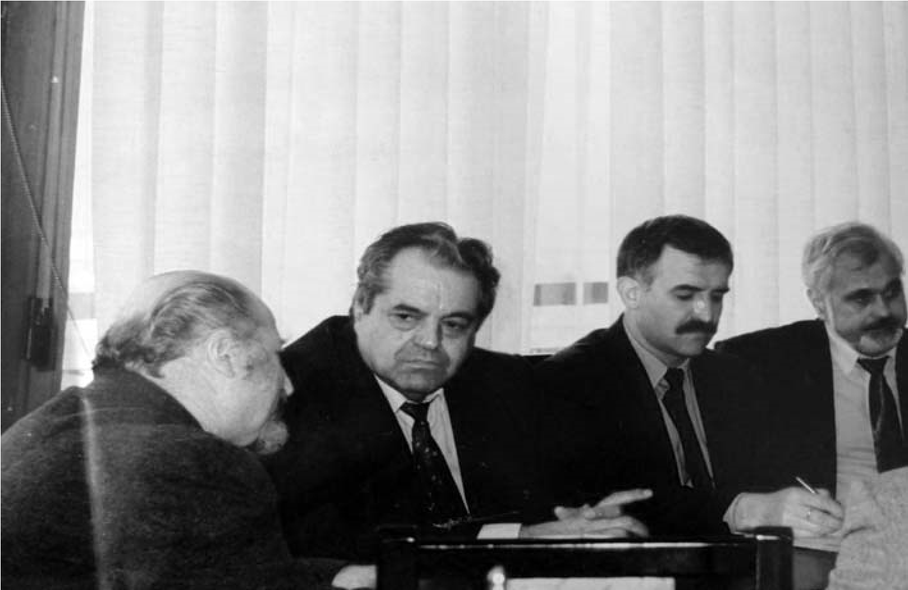

# 30. Университетът при правителството на Жан Виденов

На 25 януари 1995 г. бе съставено правителството на Жан Виденов. На следващия
ден ме пресрещна един от комунистите от университета, на когото баща му беше
известен като един от най-жестоките някогашни служители в Държавна сигурност. До
вчерашния ден той висеше в кабинета ми, за да се моли за какво ли не. Не крия,
че съм правил и компромиси за решаването на неговите вечни проблеми, свързани с
оплаквания от студентите от неприличното му поведение.

– Ха сега, де! Твоята свърши. Ще ти падне главата като на яре! Дойде нашето
време, а ние не обичаме враговете си – ми каза довчерашният червен подмазвач.

Гледах го и се чудех на скоростното премятане на отношението му към мен. С
изкривени погледи срещах и онези двама-трима, които водеха нестихващата война
срещу мен. И този път запазих самообладание. Отминавах ги и не променях нито за
миг темпото на напрегнатата ми работа, свързана с дейността ми като зам.-ректор.

Една от основните ми грижи си оставаше приемане статута на университета в
Народното събрание. Разбрах, че правителството на Жан Виденов набързо е стъкмило
съвсем нов списък за:

1. Създаване на нови висши училища.
2. Преобразуване в академии.
3. Преобразуване в университети.
4. Даване статут на висши училища.

В този нов „червен“ списък Югозападният университет го нямаше. Скалъпената от
министъра на образованието и науката проф. Илчо Димитров комисия беше подходила
съвсем субективно и землячески при съставянето на новия списък. И понеже
повечето нейни членове бяха само депутати от БСП, всеки един от тях бранеше
висшето училище в неговия роден край.

Възмутен от този подход при съставянето на новия списък, изпратих писмо до
председателя на Комисията по образование и наука в Народното събрание Юрий
Борисов. Разговарях и с някои членове на комисията. Едни вдигаха гузни рамене, а
други ми казваха, че е имало предложение първо да се гласува за висшите училища,
които са от Източна България, а след това за тези, които са от Югозападна. Тази
нова червена хитрост ме възмути. Зам.-председателят на комисия пък искаше да ме
увери, че основният мотив за отпадане на нашия университет от новия списък е бил
свързан с това, че сме нямали необходимия брой професори и доценти, което не
беше вярно.

Нито един от т. нар. „нови“ университети нямаше представени мотиви в Народното
събрание за необходимостта от даване на статут за такива, каквито имаше
Югозападният университет.

Коя беше истината, за да не бъде включен в списъка ?

Още от 1993 г., когато беше приложен Законът „Панев“ за лустрация, нашият
университет беше известен като „най-синият“ в страната. Комунистите имаха уплах
от него, защото и през 1995 година техните ръководни кадри бяха извън
ректорското, факултетните и катедрените ръководства. Другата причина беше
свързана с вече подчертаното намерение на депутатите от БСП той да бъде
преустроен като Славянски университет.

Реших да присъствам на последното заседание на комисията, което се проведе в
сградата на бившия партиен дом. Помолих да дойде с мен и проф. Кирил Чимев,
който ме гледаше с уплашени очи. Страхуваше се да не загуби ректорското си място
при предстоящите избори на новото ръководство в Югозападния университет. След
като представих за пореден път вече публикуваните от мен разработени мотиви за
даване статут на Югозападния университет, членовете на комисията започнаха да се
споглеждат гузно и тогава беше включен в т. нар. „Илчов“ списък и нашият
университет.

Бях неприятно изненадан от невярното твърдение на проф.Чимев, че и неговият
състудент и приятел проф. Сендов помогнал за включването ни в новия списък.
Никога той не е вземал отношение при решаването на този проблем. Как тогава той
допусна такава спънка, която трябваше да преодолея с толкова големи усилия?

Като председател на Народното събрание акад. Сендов отмина с безразличие
изчезването на нашия университет от първоначалия списък на БСП за даване на
неговия статут. Та нали още на 11 април 1995 г. отново изпратих мотивите за
даване на статут на нашия университет. Някогашното галениче на Тодор Живков,
наричащ себе си „първоосновател“ на Филиала на Софийския университет в
Благоевград, както винаги, така и този път послушно изпълняваше поставените му
задачи от БСП. Една от тях сега беше свързана с потайно замисленото създаване на
Славянския университет в Благоевград.

Помня, че един наш бивш студент от театралния профил на вече създадения Факултет
по изкуствата, както и Веселин Иванов, студент от бившия Институт за
културно-просветни кадри, ме намериха в една от парламентарните зали, за да
споделят и те с мен възмущението си от потайните игри на БСП, свързани с
изчезването на нашия университет от списъка за утвърждаване статута на вече
набелязаните „червени“ университети.

Най-после на 15 юни 1995 година в предложеното Решение за създа-

ване и преобразуване на висши училища от председателя на Комисията по
образование и наука Юрий Борисов беше вписан и нашия университет, но вече не на
първо място, което заемаше досега, а след Висшето техническо училище „Ангел
Кънчев“ в Русе и Висшия педагогически институт „Константин Преславски“ в град
Шумен. Няколко дни след това, на 21.07. 1995 г., „по комунистически“, вкупом
мина общото гласуване в Народното събрание списъка за създаването на нови
университети, академии и даване статут на висши училища, сред които беше и
Югозападният университет „Неофит Рилски“.

В наши дни, когато се говори за многото висши училища, университети и академии в
България и девалвираното в тях обучение и възпитание на студентите, не бива да
се забравя, че те се създадоха като червени крепости на Българската
социалистическа партия при правителството на Жан Виденов, с благословията и на
председателя на Народното събрание Благовест Сендов, известен и с т.нар.
„Сендовска система“ в образованието, според която учениците до пети клас не се
писмено оценяваха, т.е. обедняваха своята писмена култура. Освен това бяха
обединени част от изучаваните предмети в една дисциплина и се създаде истинска
каламбура в учебния процес, която се отрече от преподавателите като изключително
опасна за качеството на обучението и възпитанието на учениците.

„Най-значителна“ беше тогава ролята на министъра на образованието и науката
проф. Илчо Димитров при утвърждаването на тези сегашни своеобразни крепости на
незатихващия комунизъм. Като бивш член на ЦК на БКП и зав. отдел „Идеология и
агитация“, агент на Държавна сигурност, работил за 1-о ГУ, Илчо Димитров
изпълняваше „успешно“ новите си партийни задачи.

На една от срещата ми с него в университета той мълча, когато споменах за
спънките, които ни създаваха неговите съпартийци в развитието на нашия
университет. Погледна ме намръщен, когато му казах и за трудностите, които
срещаме от червеното правителство.

>   *Веднага след назначаването на проф. Илчо Димитров за министър на
>   образованието и науката пристигна в нашия университет. Искаше да прекъснем
>   прилагането*

>   *на „Закона Панев“, което не допуснах да се случи*  
>   

