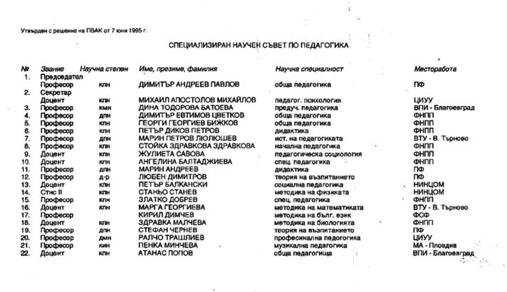

# 31. Пропиляна памет

Сега, когато прелиствам страниците на издадения през 2004 г. сборник „Началото“
от спомени за създаването на Югозападния университет „Неофит Рилски“, съставен
от онези, които се представят като негови „строители“, се учудвам на тяхното
самохвалство. Единствен проф. д-р Илия Конев не отминава някои от страшните
истини, с които е свързано подронването на авторитета на университета от някои
несменяеми предишни ръководители, протежирани лично от тогавашното партийно
ръководство.

Съвсем правдиво звучи написаното от проф. Магдалена Глушкова: „Жалко, че
академичната общност на ЮЗУ „ Неофит Рилски“ много малко знае за собствената си
история и за приноса на основните, т.е. най-важните личности – двигатели на
развитието на университета. Надяваме се някой ден историята да бъде написана и
от заслужилите личности – почетени, според заслугите им“.

Досега премълчавах самохвалството и на проф. Кирил Чимев за личния му принос за
утвърждаване статута на Югозападния университет. Но ще бъде грехота, ако отмина
истината, че когато трябваше конкретно да се решават някои от проблемите в това
отношение, той обичаше да пътешествува, за да опознае света. В интервю пред
Бетина Апостолова на поставения от нея въпрос:

&minus;Чии са заслугите за постигането на университетския статут?

Той отговаря:

&minus;Най-вече на преподавателите и строителите. Беше невъзможно да се изгради
    материалната база и университетската структура без тях. На последно място
    поставям хвърлената енергия от ръководството, което многократно и
    последователно преследваше тази цел (вж. Пиринско дело, 8.09.1995 г., проф.
    Чимев счита мисията си за изпълнена).

И таз добра! Според ректора „най-вече и строителите“ имали заслуга за постигане
на университетския статут. А може би и онези, които ръсеха комисиони и се
пазаряха с някои при строителството на новите корпуси, спортната зала, или пък
новата сграда на ректората.

Оказа се, че и паметта на проф. Чимев му изневеряваше, когато трябваше да се
казва истината. И той забрави, че приемането на статута на университета и
създаването на новата му структура са двете основни задачи, които ми бяха
поставени от Академичния съвет като зам.-ректор и изпълнявах с неимоверни
усилия. Много лесно е да се направи справка за това от решенията на Академичния
съвет, които са потънали в дълбока забрава.

И нещо друго забрави проф. Чимев. Когато дойде в къщи, за да ме моли да бъда
назначен служебно за негов заместник, бунтът срещу него беше опасен. Ако бях
отказал, той сигурно нямаше да бъде повече ректор. Този бунт се появи и след
това, когато попадна изцяло под влиянието на Николай Божков и някои други, които
подронваха безжалостно авторитета на Югозападния университет.

По време на организираните чествания, свързани с годишнините на Югозападния
университет, някои наистина заслужили личности за неговото развитие не бяха даже
и поканени да присъстват на тържествата. Никой не потърси първият вносител на
законопроекта за даване на статут на университет на Висшия педагогически
институт д-р Ивайло Ловджиев. Заедно с дежурните „партийни велможи“ на БКП като
„главни герои“ на тези тържества бяха онези, които се криеха, когато трябваше да
се преодоляват големите трудности. Сега някои от тях продължават да се
самоопределят като „строители“ на Югозападния университет и се кичат с какви ли
не „почетни“ звания и медали.

Правителството на Жан Виденов побърза да отмени „Закона Панев“, но не можа да
комунизира напълно всички университетски ръководства. Спомням си какво голямо
оживление имаше сред бившите партийни и комсомолски ръководители, когато дойде
правителството на Жан Виденов. Започна набързо отново прилагането на
класово-партийния подход при съставянето на специализираните научни съвети и
комисиите във ВАК.

Един ден в София се видяхме с проф. д-р Емил Митев, който беше член на
Президиума на ВАК и отговаряше за обществените науки. Попита ме дали съм получил
заповедта като избран член на Специализирания научен съвет по педагогика с
утвърдено решение на ПВАК от 7 юни 1995 г. Казах му, че за първи път слушам от
него тази новина за мен. Той се изненада и ми каза :

– Как може? Това е безумие! Кой е скрил решението на ВАК?

Той ме хвана под ръка и ме поведе към офиса му, извади утвърдения списък на
членовете на Специализирания съвет от ВАК и ми даде един екземпляр от него.
Наистина, аз съм в него като представител на ВПИ в Благоевград, но и така не
разбрах кой и защо с червения химикал ме беше задраскал и не бях канен на
заседанията на Специализирания научен съвет.

*От този списък беше зачеркнато името ми с червен химикал все още като „враг на
народната власт“. В него останаха повече имена на бивши партийни и комсомолски
секретари, агенти и служители на Държавна сигурност*  

