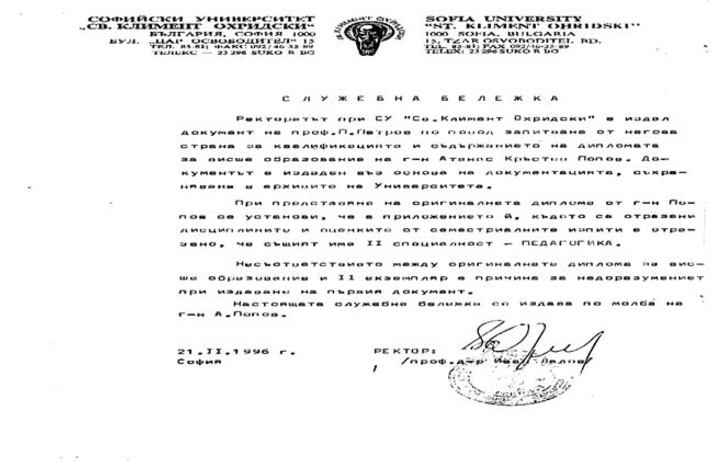

# 32. Нови атаки срещу мен от червените преди избора ми за професор**

След като беше открита процедурата ми за професор, Йордан Колев и Петър Петров
започнаха поредната фронтална атака срещу мен в стила на Държавна сигурност.
Този път техните скудоумни писания бяха свързани с поставената им задача да се
провали избирането ми за професор от Висшата атестационна комисия. Потърсиха и
подкрепление от активния борец против капитализма проф. Иван Марев, който беше
вече кръстен в едно от тогавашните списания като „умствено изостанал“. На него
беше поставена отговорната задача да публикува критичен материал за
хабилитационния ми труд „Комплексно-интергативният подход във възпитанието“ в
червеното списание „Педагогика“, на което главен редактор беше неговият приятел
Петър Петров. Хулниците си затвориха очите и не прочетоха рецензиите за труда ми
от такива известни учени като проф. д.п.н. Марин Андреев, проф. д.п.н. Петър
Николов, проф. д-р Трифон Трифонов, проф. д-р Стефан Чернев, проф. д-р Доно
Василев, проф. д-р Константин Костов, проф. д-р Влъчко Кунчев, проф. Теодор
Сандер и др.

Йордан Колев и Петър Петров разчитаха на партийната подкрепа за проваляне на
процедурата ми от тогавашния премиер Жан Виденов и на председателя на Президиума
на ВАК акад. Никола Попов, активен борец против капитализма. Именно затова
изпратиха до тях своите „възражения“, в които бяха включили всичките им
скудоумни предишни писания срещу мен.

Преди това част от тези донесения, които напомнят за доносите на агентите на
Държавна сигурност, бяха изпратени до председателя на Президиума на Висшата
атестационна комисия акад. Никола Попов и председателя на Специализирания научен
съвет по педагогика проф. д-р Димитър Павлов от името на измисления от тях
журналист Мирослав Петров. Ето писмото, изпратено до председателя на Президиума
на висшата атестационна комисия по повод на този фалшификат от зам. гл. редактор
на в-к „Струма“ Анелия Десподова, в което пише:

„В редакцията на в. Струма не работи лицето Мирослав Петров, предполагаме, че
някой от ЮЗУ – Благоевград си е позволил да праща писма от името на редакцията.“

*Петър Петров беше подвел служител от Софийски университет да му издадат
служебна бележка, че нямам придобита втора специалност „Педагогика“. След това
ректорът проф. Иван Лалов трябваше да оспори тази поредна лъжа*

По-късно такива фалшификати срещу мен бяха изпращани и до други вестници. Главен
редактор на в.„Солидарност“, орган на българската работническа социалистическа
партия, беше самообявилият се за „професор“ бивш криминален престъпник, минал
през затвора като такъв, Лилян Ганчев, на когото изстрадалата от него съпруга се
хвърлила от 13-ия етаж на жилищния им блок. Той изпълни партийното поръчение да
препише пасквилите, публикувани от основните мои хулници.

Боже мой! Никога не съм допускал, че и в научната общност може да има толкова
много лъжци и клеветници, които да нараняват до непоносима болка, да
дезинформират и деформират мислите, чувствата и поведението на онези, които не
ги познават. През целия ми живот те се изпречваха пред пътя ми всеки ден, всеки
час. Понякога се чудя как издържах. Наистина, възрожденските ми корени се
оказаха много здрави.

След като Комисията по обществени науки от ВАК избра официално докладчикът за
даване на научното ми звание професор, Йордан Колев и Петър Петров изпаднаха в
психически стрес. Отново сглобиха всички писано от тях срещу мен и изпратиха
поотделно свои дълги (около 25-30 – страници) писма не само до председателя на
Президиума на ВАК проф. Никола Попов, но и до техния любим премиер Жан Виденов.
Тогава проф. Георги Ангушев, член на ВАК, поиска среща с мен, на която ме
попита:

&minus;Колега Попов, защо не заведеш съдебно дело срещу тези клеветници, които са
    вече затрили човешкия си образ? Ние от Комисията по обществени науки сме
    всички възмутени от техните неадекватни действия.

&minus;Та те водят няколко дела за нищо срещу мен, които губят едно по едно. Сега
    надеждата им е с помощта на премиера Жан Виденов да не бъда избран за
    професор – отговорих на проф. Ангушев.

Проф. Ангушев продлъжи:

&minus;Аз и моите колеги сме възторгнати от твоята научна продукция, която има ярко
    изразен новаторски характер. Това са проблеми, които досега не са били
    изследвани въобще в областта на педагогическата наука. Като декан на
    Факултета по предучилищна и училищна педагогика в Софийския университет не
    познавам мой колега, който да се е докосвал до тях. Срамувам се от Петър
    Петров, на когото четох доноса срещу вас, че е преподавател в нашия
    факултет. Та той, неизвестно и за мен, се чудя как стана професор с един
    набързо скалъпен учебник по дидактика, който е издадена във вашия
    университет. Сега обикаля няколко университета, в които се представя за
    голям учен.

След тази среща с проф. Ангушев разбрах, че Президиумът на ВАК е разглеждал
доносите на моите клеветници, свързани с тяхното неистово желание да бъде
провалена цялостно процедурата ми за даване на научното звание „Професор“. На
това заседание обаче някои от членовете обсъждали повече неадекватните действия
на Колев и Петров, отколкото моите научни приноси, свързани със званието
„Професор“, които според тях били съвсем очевидни и безспорни. Един от членовете
на Президиума на ВАК избухнал, наругал моите клеветници и казал, че такива като
тях нямат място в университета и не заслужават научните степени и звания, които
са получили.

