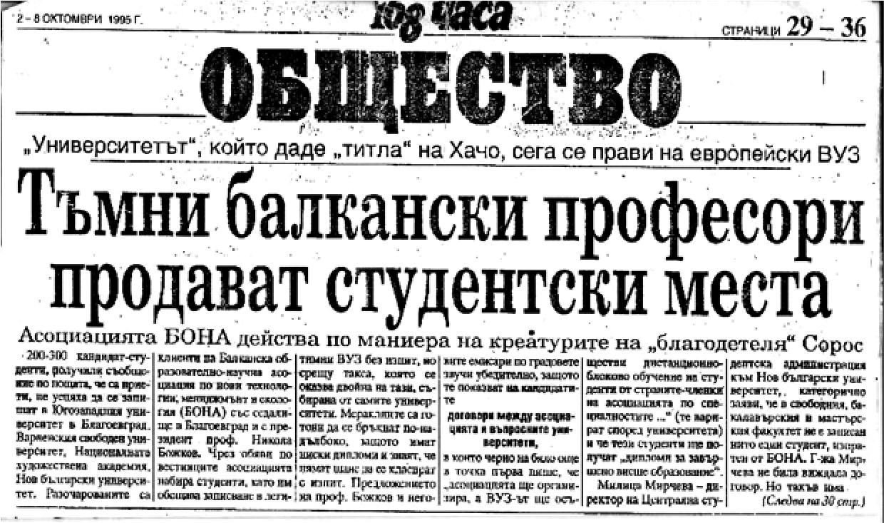

# 33. Преизбирането ми за зам.-ректор, ръководител на катедра и председател на Научния съвет по педагогика и психология в Югозападния университет

В началото на учебната 1995-1996 година правителството на Жан Виденов издаде
Закон за отмяна на Закона за временно въвеждане на някои допълнителни изисквания
към членовете на ръководствата на научните организации и ВАК с названието
„Закона Панев“.

Въз основа на този закон трябваше да се проведат нови избори на ректори, декани
на факултети и ръководители на катедри. През м. октомври 1995 г. на заседание на
Катедрата по педагогика бях избран отново единодушно от колегите за ръководител
на катедрата. След това на основание решение на ФС при Факултета по педагогика с
протокол №1 от 25 октомври 1995 г. ми беше издадена заповед за ръководител на
най-голямата катедра в Югозападния университет. Моите хулници се скриха гузни и
недоволни.

На 30 октомври 1995 година се проведе Общо събрание на Югозападния университет,
на което проф. Кирил Чимев беше преизбран за ректор. Предстоеше заседание на
Академичния съвет за избирането на зам.-ректори. Една от познатите „червени
групички“, в която имаше две- три пияндета, започна активна дейност, за да не
бъда преизбран за зам.-ректор. Вечно пътуващият в чужбина Николай Божков,
създател на немалко академични пирамиди, любимец на Тодор Живков и Сава
Гановски, беше обещал на червените властващи в Благоевград, че с помощта на
негови верни хора ще осуети избора ми за зам.-ректор.

Меракът на сборната група от бивши партийни и комсомолски секретари угасна,
когато разбраха, че на 8.11.1995 г. бях отново избран за зам.-ректор на
Югозападния университет.

На 22 февруари 1995 година излезе публикация във в. „Струма“ със заглавие
„Деканът на ИПФ Божков обвинен в крупни далавери от служители“. В нея се
твърдеше, че „над 2 милиона лева от платеното обучение профукал на ротативка
професорът във ВПИ-Благоевград Николай Божков, дето закон не го лови“. И още, че
„Божков ще влезе в аналите на ВПИ със страстта си към комара, белите костюми,
четенето на неразбираеми доклади и титуловане на професори“.

Обвиненията в тази публикация бяха много и тежки, за които тогава се говореше в
целия град. Често и мен спираха граждани, за да изразят възмущението си от
неговото постоянно посещение в покер клубовете, където прахосвал много пари с
незнаен произход.

В местни и централни вестници постоянно се появяваха остро написани критични
материали за неадекватните за академичната общност действия на известния и в
някои от съседните държави (Македония, Турция и Гърция) професор Николай Божков,
които подронваха авторитета на Югозападния университет (вж. Тъмни балкански
професори продават студентски места, в-к 168 часа, 2-8 октомври 1995 г.,с.29-30;
ЮЗУ на път да забърка България в международен скандал, в-к „ Струма, 31 юли 1996
г., с.6 ; Полицията разследва зам.-ректора Божков, в. Струма, 25-01.1995 г.,

с. 1 и др.). В някои от тези публикации се обвиняваше новоназначеният като първи
зам.-ректор в крупни далавери и присвоявания от платеното обучение, както и при
създаването на неговата Балканска научно-изследователска асоциация.

След създаването на новата структура на Югозападния университет очаквах, че
всички от ректорското ръководство ще насочим усилията си за утвърждаването му
като най-авторитетно научно, просветно и културно огнище в Югозападна България.
Но още от първите месеци след като проф. Кирил Чимев учудващо посочи проф.
Николай Божков като първи зам.-ректор разбрах, че това няма да стане.

Не само аз, а всички мои колеги знаеха кой е Николай Божков, но никой от тях, с
изключение на проф. Илия Конев, не се осмели да каже поне малка част от истината
за него. Напротив, той беше издигнат в култ като недосегаем от никого. Затова
правеше каквото си поиска. Някогашният т.нар. партиен и държавен контрол го
проверяваше като декан на Инженерно-педагогически факултет. Прочу се и като
пропиляващ много пари. Носеха се легенди за него и бившия партиен секретар
Димитър Стоилов като комарджиите на града. Не исках да повярвам за тази им
неадекватна дейност, но един ден дойдоха двама полицаи в кабинета ми, които ми
казаха, че търсят Божков, но не могат да го открият никъде. Казаха ми, че имали
нареждане да го заведат в полицята за някакъв разпит. Точно тогава предстоеше
гласуването в парламента за даване статут на университета. Помолих ги да не
споделят това с други, защото тази вест бързо щеше достигне и до депутатие в
Народното събрание. Поисках среща с Божков, на която той се кълнеше, че няма
пари и не е вярно, че кисне по цели нощи в игралните заведения.

Неизвестно си остана и изчезването на комбайна и скъпия струг, които се водеха
като имущество на факултета, който оглавяваше Николай Божков. По сигнал на доц.
Койчев вече имаше проверка от прокуратурата за „крупни далавери и присвоявания“,
за постоянните му командировки в чужбина, за „крупни присвоявания от платеното
обучение и при създадената от него Балканска научна образователна асоциация“ и
т.н.

Много от документите, които ми се носеха в кабинета от очевидците на онези,
които рушеха авторитета на университета, запазих. Все още не всичко от тях
споделям в тази книга, защото са опасни дори и за четене.

Моята изненада с назначаването на Божков за първи зам.-ректор не беше случайна.
Стана съвсем ясно, че Жан-Виденовото правителство не забравя своите някогашни
комсомолски кадри. Сега се отвориха още по-широко вратите за неговата чудновата
„академична дейност“. Нищо, че именно в това време се разпадаше създадения от
него Инженерно-педагогически факултет, който студентите напускаха или се
пренасочваха към други факултети.

И някои от централните вестници вече бяха публикували немалко материали за
академичните пирамиди на Николай Божков, с които стана известен в цялата страна
и в чужбина.

Първото нещо, което направи особено голямо впечатление на всички колеги от
университета, бе че новият зам.-ректор Николай Божков започна веднага своето
„околосветско пътуване“, при което продължи дейност си, свързана със създаването
на фалшиви академични структури. Този път обаче най-голямата му грижа беше
реализирането на не знам как, кога и къде подписан договор на Югозападния
университет и „Фитила“ за откриване на филиал в град Патра.

Силно притеснен от създаването на нови академични пирамиди в Югозападния
университет, поисках няколо пъти среща, както с проф. Кирил Чимев, така също и
със зам.-ректора по учебната работа доц. Илия Гюдженов. Направи ми неприятно
впечатление, че те отбягваха да се говори за тази дейност на Божков.

