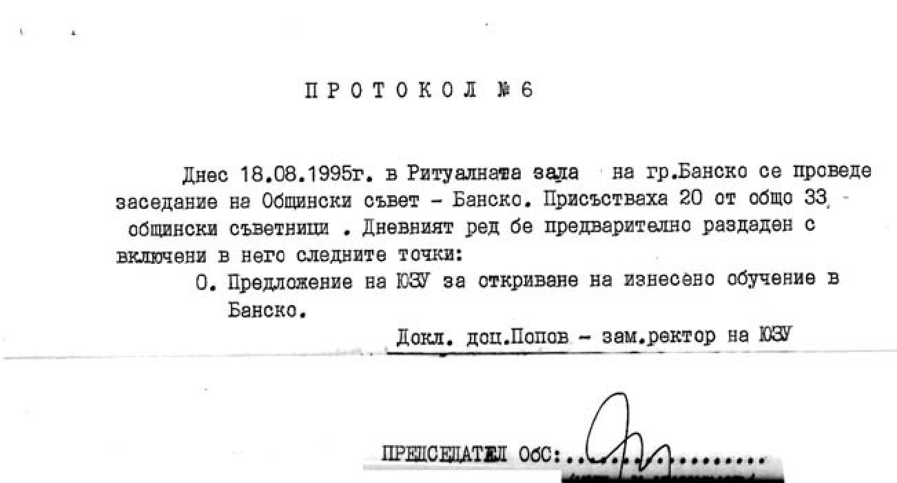
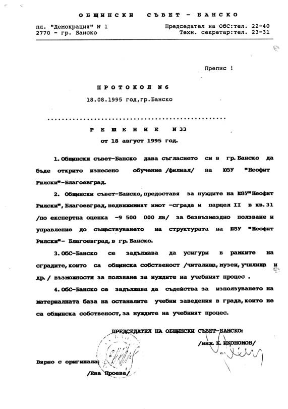

# 34. Направих хубаво предложение за изнесено обучение в Банско

След създаването на факултета по изкуствата, реших да се противопоставя на
неадекватните действия на Николай Божков за създаване на новите академични
пирамиди с предложението, което направих в Общинския съвет в град Банско за
изнесено обучение на студентите от художествените специалности в Югозападния
университет. Когато споделих това с проф. Кирил Чимев и доц. Илия Гюдженов, те
свиха вежди и ме попитаха дали знае за него Николай Божков. Бях учуден от това,
че Гюдженов беше вече предоставил някои от своите задължения по учебната работа
на Божков, който управляваше лично създадените от него академични пирамиди.

На 18 август 1995 г., след внесеното от мен предложение, Общинският съвет в град
Банско взе решение под № 33, според което дава съгласието си да бъде открито
изнесено обучение на ЮЗУ „Неофит Рилски“ в Благоевград. За нуждите на
университета се предостави недвижим имот – сграда и парцел по експертна оценка
за 9500000 лева за безвъзмездно ползване и управление до съществуването на
структурата на ЮЗУ „Неофит Рилски“. Освен това Общинският съвет се задължи да
осигури в рамките на сградите, които са собственост на общината (читалище,
музеи, училища и др.) възможности за ползване за нуждите на учебния процес. Пое
се и задължението да се съдейства за използването на материалната база на
останалите учебни заведения в града, които не са общинска собественост за
нуждите на учебния процес на студентите.

При предоставената богата материална база в Банско студентите от Факултета по
изкуствата имаха възможност да обогатят своята професионална поготовка в града,
който е огнище на просвета и художествена култура.

Това решение на Общинския съвет в Банско стресна създателя на пирамидите в
Югозападния университет Николай Божков. Той се свърза с номенклатурното
семейство Балеви и потайно действаха не за създаване на изнесено обучение на
студентите от Югозападния университет, а за създаване на колеж по туризъм. Това
беше през времето на правителството на Жан Виденов. Т.нар. Божков колеж по
туризъм беше новата пирамида, която след това се преместваше от град в град.

Докато по отношение на предложението за изнесено обучение на студентите от
художествените специалност в Банско проф. Чимев и зам.-ректора Гюдженов запазиха
гробно мълчание, след това, когато Божков създаде пирамидата в Патра, Гърция, те
се включиха активно за нейното утвърждаване, защото от нея имаше голяма
финансова изгода не за университета, а за онези, които я създадоха и подкрепяха.  

