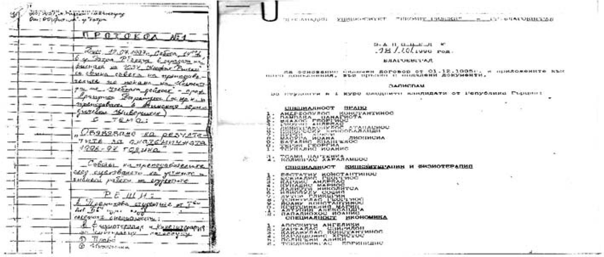
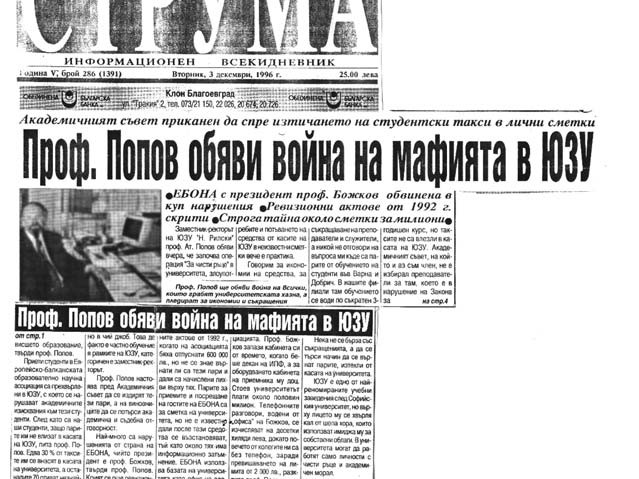
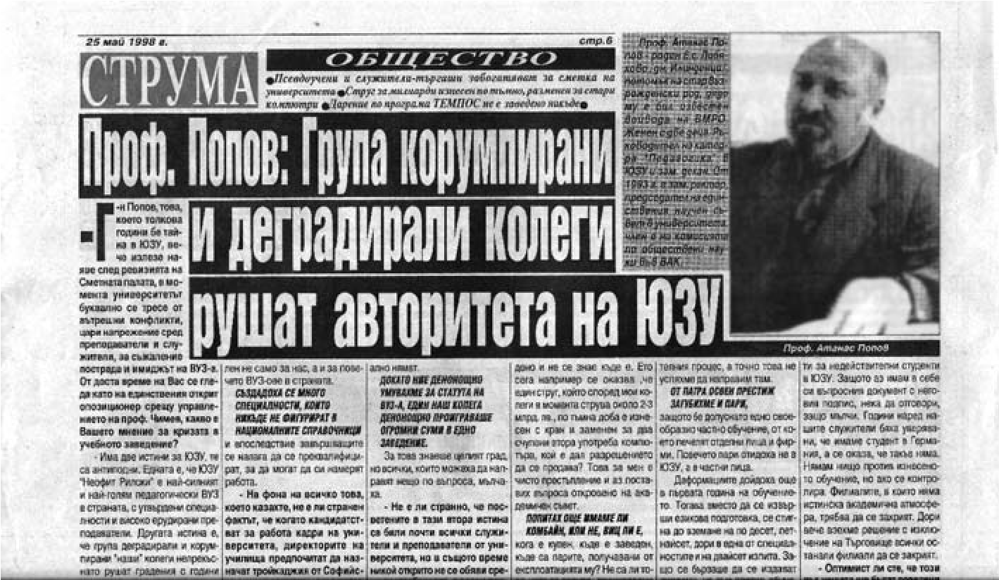
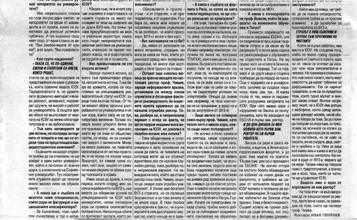

# 35. Новата академична пирамида в Патра

И така, на 18.10 1996 г. Николай Божков издава заповед, разбира се, не без
знанието и участието на проф. Чимев и доц. Гюдженов, за записване на студенти в
град Патра в първи курс по следните специалности: Право, Кинезитерапия и
физиотерапия, Икономика и Логотерапия.

Ето с какъв ръкописен протокол са обявени резултатите за „академичната“
1966-1997 година от обучението на тези студенти, които не знаеха български език.

Когато министърът на образованието при правителството на Стефан Софиянски проф.
Иван Лалов научи за всичко, което се върши от Николай Божков, нарече нашият
университет „пирамида“, която се разрушава.

Един ден проф. Йордан Венедиков ми се обади по телефона и ми каза, че министърът
на образованието проф. Иван Лалов ни се е заканил лошо и иска среща с
ръководството. Бях останал пак сам. Нямаше го нито ректора, нито неговия първи
земестник, а зам.-ректорът по учебната работа и този път беше неоткриваем.

Заминах по спешност в София. Пред Министерството на образованието ме очакваше
проф. Йордан Венедиков, близък приятел на проф. Иван Лалов, който искаше да ни
помогне и този път, за да не станем пак за смях с неспирното създаване на
академични пирамиди.

Проф. Иван Лалов ни посрещна в кабинета си ядосан. Никога не го бях виждал
такъв.

&minus;Проф. Попов, защо си пак сам? Къде са твоите колеги от ректорския съвет?

Опитах се да го успокоя, но той стана прав, обърна се към нас двамата с проф.
Венедиков и каза:

&minus;Ако не знаех колко много направихте вие двамата за приемане стату-

та на Югозападния университет, сигурно нямаше да уважа молбата ви да си премълча
за безобразията на онези, на които мястото не им е там.

Изключително голяма отговорност за всички нарушения, свързани със създаването на
т.нар. „пирамиди“ на Югозападния университет, носеше и доц. Илия Гюдженов, който
беше несменяем зам.-ректор по учебната дейност. Но той се правеше на „нито лук
ял, нито лук мирисал“. Всеизвестна обществена тайна, както пишеше един вестник,
беше личното му приятелство със студента Христо Иванов, наричан Ицо Кмета, който
осъществяваше нерагламентираните връзки студент-преподавател в нашия унивреситет
(вж. в-к Струма, Спецкомисия „Анти-Струма“ сформира най-корумпираният ВУЗ в
България, 13. 02.1998 г., с.1- 4). Не исках да повярвам, че това е истина докато
не се уверих с очите, че „слуховете“ бяха верни.

Един ден заварих т.нар. Ицо Кмета в кабинета на Гюдженов, който разговаряше по
неговия телефон. Под мищницата си държеше дебела папка със студентски книжки. Не
знам как ги бях погледнал, но и двамата изчезнаха гузни. Вън ги беше засякъл
журналист от в. Струма, който отрази поредната им среща.

Не друг, а доц. Гюдженов носеше лична отговорност като завеждащ учебната част за
хаоса в учебния процес, от който постоянно се оплакваха не само студентите, но и
техните родители. Неговите основни грижи през тези години обаче продължаваха да
бъдат свързани с преместванията му от едно в друго жилище.

При създаването на академичната пирамида в Патра, Министерството на
образованието, науката и технологиите чрез посланика на България направи
запитване до Министерството на националното образование и вероизповеденията в
Гърция, което даде отговор, че „този тип школи не подлежат към никоя от държавно
признатите степени на обучение в Гърция, издаваните от тях документи не подлежат
на приравняване и признаване от компетентните органи. В Гърция строго се спазва
изричното изискване при издаване и признаване на дипломи за завършено
университетско образование целията курс на обучение да бъде преминат в учебно
заведение със статут на университет. Ако обучението или част от него е преминато
в школа за свободно обучение е категорично в позицията си да „не признава
документа за образование, независимо, че той може да е издаден в крайна сметка
от утвърдено и признато учебно заведение“.

В този отговор на гръцкото Министерството на образованието и вероизповеданията
до Министерството на образованието, науката и технологиите в България се
подчертава съвсем ясно, че „получените по този начин документи за завършено
образование не се признават за имащи университетско образование. Техните
носители не могат да бъдат назначавани на длъжности в държавни учреждения, за
които се изисква висше образование.“

В това писмо отговор се казва категорично, че при съществуващото законодателство
и практика в Гърция „няма да бъдат признати издаваните от Югозападния
университет академични документи за образование“.

Този документ се укриваше от Николай Божков със знанието на ректора проф. Чимев
и зам.-ректора доц. Илия Гюдженов. Тримата имаха и други „дълбоки тайни“,
свързани с взаимоотношенията им с ръководителя на организацията „Фитила“, който
често ги канеше на богати трапези както в България, така и в Гърция.

*Създателите на академичната пирамида в Патра Николай Божков и Георгиус Фитилас
бяха винаги на маса, на която пресмятаха доходите си от пирамидата, която
създадоха*

Когато Фитилас разбра, че съм категорично против пирамидата, която създадоха с
Божков, поиска да се срещнем. По време на разговора ни той ми призна, че е бил
подведен от Николай Божков, който го излъгал, че всичко свързано със създаването
на изнесеното обучение в Патра е било съгласувано с Министерството на
образованието, науката и технологиите в България. След тази среща Фитилас
започна да се отдалечава от Божков, който обаче продължаваше да пребивава в
Патра и да води там разгулен живот.

Безспорно е, че през тези години зам.ректорът по учебната част доц. Илия
Гюдженов беше „тайнственият“ съучастник в чудноватите „академични“ прояви на
Николай Божков. Та нали това беше неговият ресор в дейността на Югозападния
университет. Той и Божков не дадоха отговор и на писмото под № 04-03-573 от
13.01.1997 г. на Министерството на образованието, науката и технологиите, в
което се твърди, че според становището на компетентните власти в Гърция
договорът, подписан между Образователната организация „Фитила“ и Югозападния
университет, е невалиден за гръцката страна. Освен това в същото писмо за
пореден път се подчертава, че „функциониращата в Търговище Академия за славянско
изкуство, която по неофициална, но достоверна информация е създадена от БОНА, и
Киевският държавен университет е създадена в нарушение на допълнителните
разпоредби на Закона за висшето образование“.

Не ми е позната поне една дейност на някогашния учител по ръчен труд Николай
Божков, която да не е била в нарушение на българския Закон за висшето
образование. Десетки са „професорите“, произведени от него в цялата страна, едни
от него като президент на асоциацията БОНА, а другите, получили благословията му
като „дежурен“ рецензент по всички научни дисциплини, защото беше „специалист по
всичко“, а не само по ръчен труд, т.е „всестранно развита личност“ като
някогашен комсомолски секретар.

Никога в моя труден живот не съм се страхувал да казвам истината за онези, които
живеят и работят непочтено, защото те са истинските виновници за човешките
страдания, каквито и аз съм преживявал, причинени от тях. Така съм възпитан в
моето известно със своите възрожденски традиции семейство.

Когато след приемане статута на Югозападния университет „Неофит Рилски“ трябваше
да се утвърждава неговият авторитет като истински духовен храм, някои започнаха
да подкопават онова, което други трудно изграждаха. Като член на Академичния
съвет и зам.-ректор не се страхувах да назовавам имената на тези „дребни душици“
с немалък риск да започне нова злостна атака срещу мен от тях. На едно от
заседанията на Академичния съвет през 1996 година станах и споменах поименно
виновниците за хаоса, който създаваха в цялостната дейност на университета (вж.
в. Струма, Проф.Попов обяви война на мафията в ЮЗУ, 1996 г., с. 1-4). Не ми беше
лесно да кажа пред очите на виновниците, че в университета трябва да работят
само личности с нравствени добродетели и академичен облик.

На това заседание на Академичния съвет назовах конкретно далаверите, които се
извършваха в създадените академични пирамиди. Поисках да си декларират доходите
онези, които бяха съучастници в тяхната дейност.

*Преживявах болезнено всичко онова, което рушеше авторитета на Югозападния
университет, защото положих големи, неизмерими усилия за утвърждаване на неговия
статут и съвременната му структура*  

