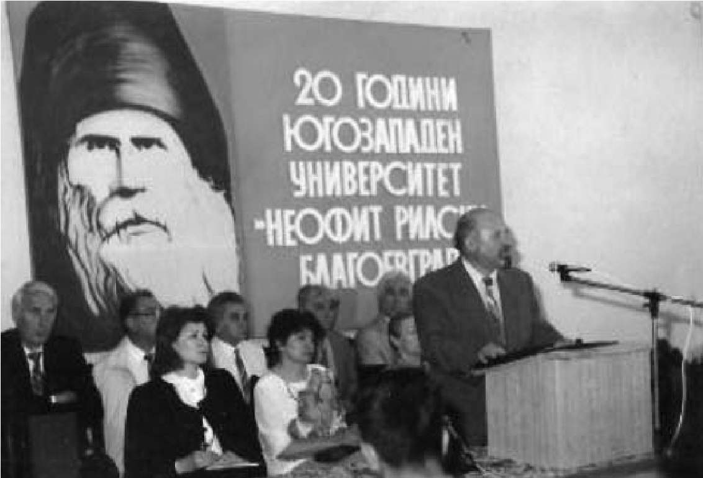

# 36. Моите хулници продължаваха да воюват срещу мен и със съдебни дела

И така, въпреки усилията на онези, които се радваха на правителството на Жан
Виденов и очакваха тоталното ми изолиране от доскорошните ръководни длъжности,
които заемах в университета, през 1995 година останах да бъда не само
зам.-ректор, председател на Научния съвет по педагогика, но бях и отново
преизбран за ръководител на Катедрата по педагогика. Неподкупните мои колеги от
университета оценяваха приноса ми за неговото развитие и ми дадоха своето
доверие да продължа дейността си като един от новоизбраните негови ръководители.

>   *Научната конференция във Факултета по педагогика по случай 20-та годишнина
>   на Югозападния университет „Неофит Рилски“*

В Катедрата по педагогика се възстанови изцяло спокойната атмосфера, която даде
възможност на колегите да ускорят своето научно израстване и развитие. В нея
обаче все още се мяркаше от време на време Йордан Колев, за да им напомня, че е
дошло неговото време, т.е. че „червените“ са отново на власт. Колегите от
катедрата и факултета не приемаха нестихващите негови действия срещу мен. Някои
от тях се спираха пред вратата, на която беше закачен седмичния му разпис за
зимния семестър през учебната 1996- 1997 г. В него беше записал:

„Понеделник – ден за катедрени съвети и за съдебни дела против Атанас Кръстев
Попов“.

Един колега от друг университет беше прочел закачения разпис. Дойде при мен и ме
попита :

&minus;Този Колев полудял ли е?

&minus;Защо? – попитах го аз.

Той ме погледна в очите и отговори:

&minus;Защото нормален човек, особено университетски преподавател, не би написал
    това, което чета.

Воденето на непрекъснати съдебни дела срещу мен с искове за много пари също беше
неадекватно действие от бившия секретар по идеологическите въпроси на ВК на БКП
Йордан Колев и т.нар. от студентите „професор таксиметров шофьор“ Петър Петров,
зет на активен борец против капитализма, за да ме психически затормозяват.

На едно от заседанията в съда се явиха и партийният секретар на Педагогическия
факултет, известен с прозвището „Киро Певеца“ и съпругата на Петър Петров. И тук
моите хулници ставаха за смях, защото искаха да превърнат съдебните заседания в
партийни, на които да бъда наказан като доскорошен враг на „народната власт“. За
тяхно дълбоко огорчение загубиха всички започнати съдебни дела срещу мен, от
които искаха да натрупат немалко пари.

Адвокатката на Йордан Колев беше социалистка. Един ден ме спря пред съда и ми
каза:

&minus;Професоре, сгреших, че се съгласих да бъда адвокат на Колев. Прощавай! Днес
    се отказах да го защитавам, защото обвиненията срещу вас са неоснователни.

Съдийката на едно от заседанията, което ръководеше, разгневена каза:

&minus;Вие митинг ли ще правите в съда?

След това се обърна към мен и ме попита:

&minus;Господин Попов, защо вие не заведете дело срещу двамата? От всичко, което
    прочетох е видно, че те имат за цел да ви съкрушат. Клеветниците са те, а не
    вие.

Йордан Колев скочи и изкрещя:

&minus;Снемам доверието си от вас. Ще искам друг съдия.

След това се оказа, че никой друг съдия не беше пожелал да поеме делото, което
водеха срещу мен двамата мои хулници.

Както в Катедрата по предучилищна педагогика, където беше върнат със заповед №
71 /09.03.1993 г. на Ректора на университета, така и в Катедрата по педагогика
Йордан Колев продължаваше да не участва редовно на заседанията. Опита се отново
да възстанови тягостна атмосфера, но не успя. Учудващо подаде молба до ректора
да бъде върнат отново в Катедрата по предучилищна педагогика, в която пише:

>   *„Уважаеми господин Ректор,*

>   *За да не смущавам творческия дух и добрия климат в катедрата по педагогика,
>   МОЛЯ ВИ да бъда преместен в катедрата по предучилищна педагогика към
>   факултета по психология и предучилищна педагогика.*

>   *Надявам се молбата ми да бъде удовлетворена.*

>   *2.10. 1996 г.*

>   *Благоевград*

> *С уважение : / подпис /*

Някои от колегите недоумяваха от написаното в молбата на Колев, но след това
разбраха, че той отново хитрува с цел да минат по-лесно по-нататъшните му
процедури за получаване на нови „научни“ степени и звания в Катедрата по
предучилищна педагогика, която нямаше това право, защото само Катедрата по
педагогика обслужваше дисциплината „История на педагогиката“.

Не помня за нито една от получените „научни“ степени, както и званията на Йордан
Колев да е била откривана процедури и да са правени обсъждания в Катедрата по
педагогика. Това е продължение на предишните закононарушения, извършвани в
Катедрата по предучилищна педагогика, свързани с откриване на процедура за
даване на научното му звание „Доцент“.

Един ден доц. Георги Стоянов, бивш декан на Педагогическия факултет, който
напусна катедрата след внедряването на Йордан Колев в нея, дойде при мен и ми
каза, че е написал всичко черно на бяло, свързано с „научната“ кариера на моя
хулник. Разтвори чантата и ми подаде това, което е саморъчно написано.

>   *„...* Фактите обаче не говорят в полза на г-н Колев.

1.  Йордан Колев е зачислен за аспирант на самостоятелна подготовка, въпреки
    отрицателна рецензия върху предложения материал за зачисляване (В архивите
    на катедрата и ФП да се види и направи справка с рецензията).

2.  Хабилитационният труд на Й. Колев също беше приет от катедрата в отсъствието
    и на двамата рецензенти (проф. Елка Петрова и ст.н.с. Димитър Дончев). Виж
    протокола от обсъждането. Това е сериозно закононарушение!

3.  Конкурсът за доцент на Йордан Колев беше обявен от друг факултет, а не от
    Факултета по начална педагогика, който водеше обучението по история на
    педагогиката и българското образование в педагогическия институт в
    Благоевград.

4.  Решението на Катедрата по теория и история на педагогиката при СУ „Св.
    Климент Охридски“, която обсъждаше тогава дисертационния труд на Й.Колев,
    беше, че трудът не е готов още за защита и аспирантът трябва да работи върху
    него за усъвършенстването му.За голяма изненада защитата беше обявена.
    Когато единият от рецензентите (проф. В. Бойчева) оповести, че рецензията ѝ
    е отрицателна, тя беше автоматично сменена с друг.

...Що се отнася до закона ЗНСНЗ и правилника, свързан с него, н я м а научна
степен и научно звание, присъдени на колегата Колев досега, при които да не е
извършвано сериозно закононарушение.

Ако се направи една строга и точна законова проверка от съответните научни и
юридически органи, тези звания и степени трябва да бъдат обявени за н е л е г и
т и м н и! А такава проверка е съвсем наложителна и възможна, тъй като всички
документи, свързани с посочените нарушения, се пазят в архивите на ВПИ (сега
ЮЗУ) в Благоевград, СУ „ Свети Клмент Охридски „ – Факултет по педагогика, и
решенията на СНС по педагогика.

В течение съм на горепосочените закононарушения, тъй като бях преподавател и
декан на ФП към ВПИ през горепосочения период в Благоевград.“

Наистина, всички научни степени и звания на някогашния асистент по предучилищна
педагогика Йордан Колев, а сега проф., доктор на педагогическите науки по
история на педагогиката и българското образование, са обсъждани и получавани
там, където не им е мястото. Тяхното родилно гнездо не беше Катедрата по
педагогика, която е „майка“ на научните дисциплини, по които преподава Йордан
Колев, а Катедрата по предучилищна педагогика, където е преподавател и жена му.
Там всичко ставаше по-лесно за получаването им. Това твърдя като дъбгогодишен
ръководител на Катедрата по педагогика в Педагогическия факултет на Югозападния
университет, където не е обсъждана нито една от научните степени, както и
званията на Йордан Колев. Никак не бяха случайни неговите чести премятания в
Катедрата по предучилищна педагогика, когато трябваше да се получават тези
звания и степени.

При едно от учудващото за някои доброволно напускане на Катедрата по педагогика
от Йордан Колев някои колеги се успокоиха, но не разбраха обаче, че това беше
неговият пореден хитър ход за по-спокойно получаване на последното му научно
звание пак в Катедрата „родилка“ на другите му научни степени и звания, която
беше в друг факултет.

След напускането на Йордан Колев от Катедрата по педагогика се създаде истинска
творческа атмосфера, която спомогна за ускореното научно израстване на
преподавателите. Само за по-малко от 2 години бяха избрани 2 професори, 5
доценти и 1 доктор на науките. Зачислихме на свободна аспирантура 4 асистенти, а
трима от тях бяха повишени. На хонорар и по съвместителство в катедрата бяха
привлечени някои от първите създатели на университета като проф.д-р Марин
Андреев, доц. Жулиета Савова, проф. Стефан Чернев, проф. Доньо Василев и др.
Нямаше друга катедра от бившите педагогически институти в страната с толкова
много хабилитирани преподаватели, което даде сериозно отражение на качеството
при подготовката на студентите. Това се признаваше и от другите университети, в
които имаше такива факултети. Оказвал съм конкретна помощ на всеки преподавател
при неговото научно израстване. Спомням си случаи, които никога няма да забравя.
Повечето от тях бяха свързани с преодоляване на нелеки трудности за получаване
на научни звания и степени.  

