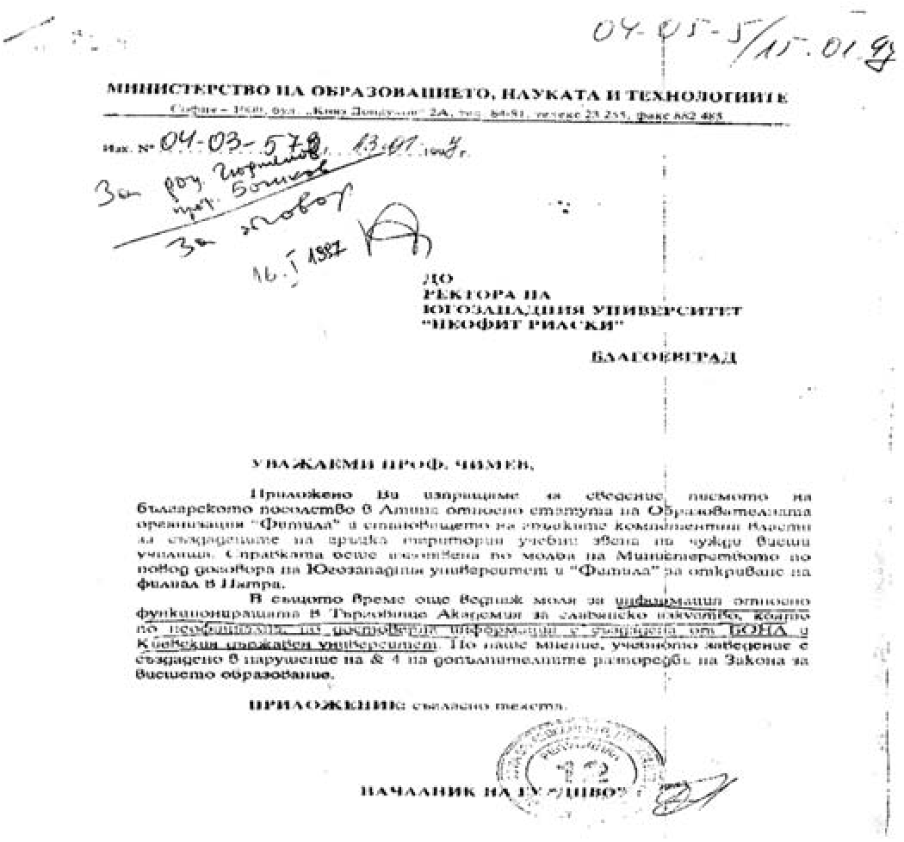
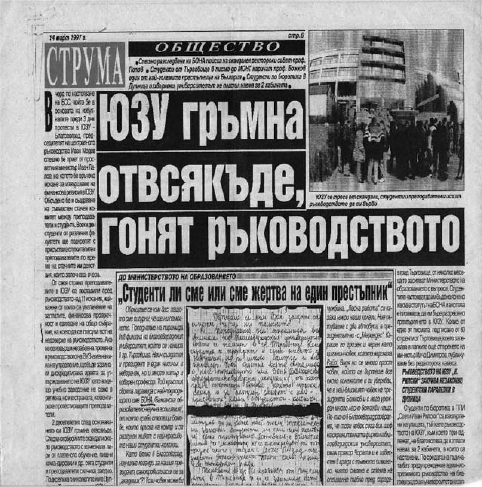

# 37. През 1997 г. напрежението в Югозападния университет продължаваше да расте

Безотговорното отношение на някои от моите колеги от ректорското ръководство към
истинските проблеми на университета продължаваше. Те бяха почти изоставили
преките си задължения и се захващаха с дейности, свързани с лични облаги. Т.нар.
от някои „околосветски пътешествия“ продължаваха. Инициаторът за тях пак беше
Николай Божков. Жалко, много жалко, че проф. Кирил Чимев се хвана на неговата
въдица. А потайният, своеобразен техен съдружник зам.-ректорът по учебната част
доц. Илия Гюдженов се правеше на нито „лук ял,нито лук мирисал“, когато в цялата
страна се носеше „славата“ им като създатели на академични пирамиди в страната и
чужбина. Получаваха се писма от Министерството на образованието, науката и
технологиите, на които отговор не се даваше.

С това писмо от Министерството на образованието се предупреждава ректорът на
университета проф. Кирил Чимев за неправилното откриване на филиала на
Югозападния университет в Патра, Гърция, където Николай Божков се „изсели“ за
една година. Водеше се в творчески отпуск, получаваше заплата от университета,
но парите от пирамидата бяха още по-тлъсти. В същото време продължаваше да
функционира другата пирамида на Божков в Търговище, която носеше гръмкото
название „Академия за славянско изкуство“, която беше създадена пак от другата
пирамида БОНА и Киевския държавен университет. В приложеното писмо от
Министерството на образованието се подчертава, че „учебното заведение е
създадено в нарушение на допълнителните разпоредби на Закона за висшето
образование“.

В средата на месец март 1997 г. Югозападният университет се тресеше вече от
тежки скандали. Повечето преподаватели и студенти поискаха оставка на
ректорското ръководство. Беше създаден стачен комитет, който обяви ефективни
действия от 13 .03. 1997 година. Моите колеги от ректорското ръководство, с
изключение на доц. Ангелина Манова, започнаха да не се вестяват на работа. Една
сутрин ректорът проф. Кирил Чимев дойде в кабинета ми уплашен. Започна да ме
убеждава, че трябва да поема ръководството на университета поради това, че срещу
мене нямаше никакви обвинения. Така щели да утихнат протестите, след което идва
лятото. А от новата учебна година щели да „мирясат“ протестиращите. Не се
съгласих. След около две седмици той отново ме помоли и ми каза, че имал
намерение да си подаде оставката. Това означаваше да се насрочи Общо събрание,
на което да се избере ново ректорско ръководство. Това мое предложение той не
приемаше, поиска само да го замествам поне за един месец. Предложих му да
назначи колегата Илия Гюдженов да го замества. Той ме погледна и каза:

– Ти добре го познаваш, нали? Той нищо не може да направи. Нали вечно се
оплаква, че е болен.

Спомних си, че когато доц. Гюдженов беше съвсем занемарил задълженията си като
завеждащ учебната дейност в университета, проф. Чимев имаше намерение да му
предложи да се оттегли от тази длъжност. Но тогава той пак се оплака, че не е
добре със здравето.

Като имах предвид вече създадената непоносима обстановка в университета, се
съгласих да замествам ректора за един месец. Имах предвид това, че ще се
постарая да спомогна за преодоляването на създалия се непоносим конфликт с
преподавателите, служителите и студентите.

На 5 май получих заповед № 3-98, издадена предварително от ректора още на
24.04.1997 г., според която трябваше да го замествам до 30 май 1997 г. На
следващия ден насрочих среща със създадения инициативен комитет от
преподаватели, служители и студенти. Разговорът ни протече спокойно. Обсъдихме
конкретно техните искания, които бяха съвсем основателни. Настояваше се за
цялостна проверка на всички известни вече закононарушения в университета, които
подронваха неговия авторитет. Подходих съвсем отговорно и се съгласих държавните
органи да се включат за разкриване на истината. Наложи се да проверя и вече
изпратените оплаквания до Министерството на образованието и науката,
Министерството на финансите, Окръжния прокурор и директора на РДВР в
Благоевград.

На няколко пъти създаденият инициативен комитет от протестиращите преподаватели,
служители и студенти идваше при мен. Бях удовлетворен от това, че напрежението в
университета изчезна, защото тяхното искане за необходимата проверка започна. За
моя изненада обаче на 14 май проф. Кирил Чимев прекрати заповедта за
заместването. Стана съвсем ясно, че онези, към които бяха отправени обвиненията,
се уплашиха от моя съвсем принципен подход за удовлетворяване исканията на
протестиращите. Този техен ход се оказа хитър, защото през двете седмици, когато
замествах ректора, в университета се възстанови нормалната учебно-научна
дейност, а след това предстоеше приключването на учебната година и стачните
действия бяха отложени.

