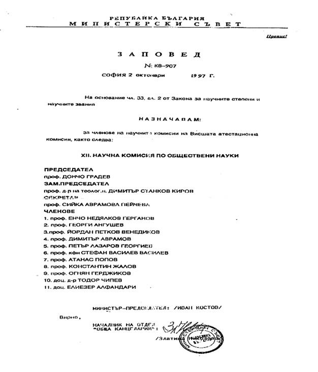
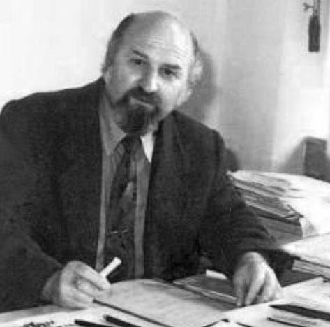
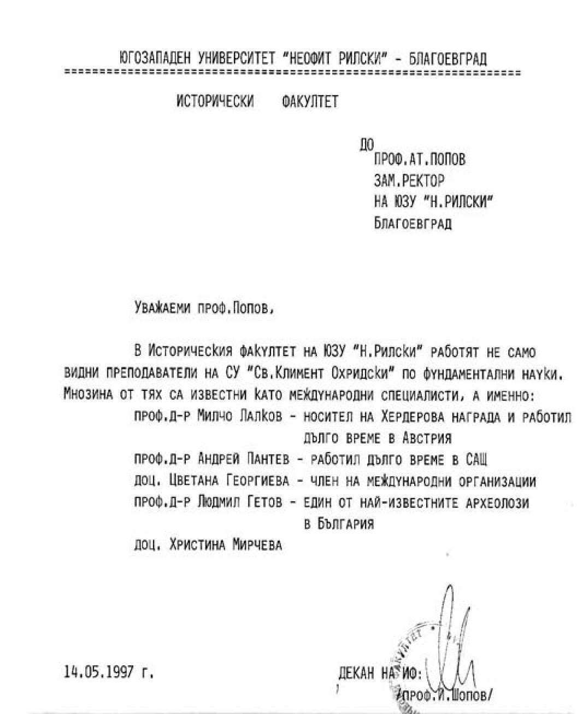
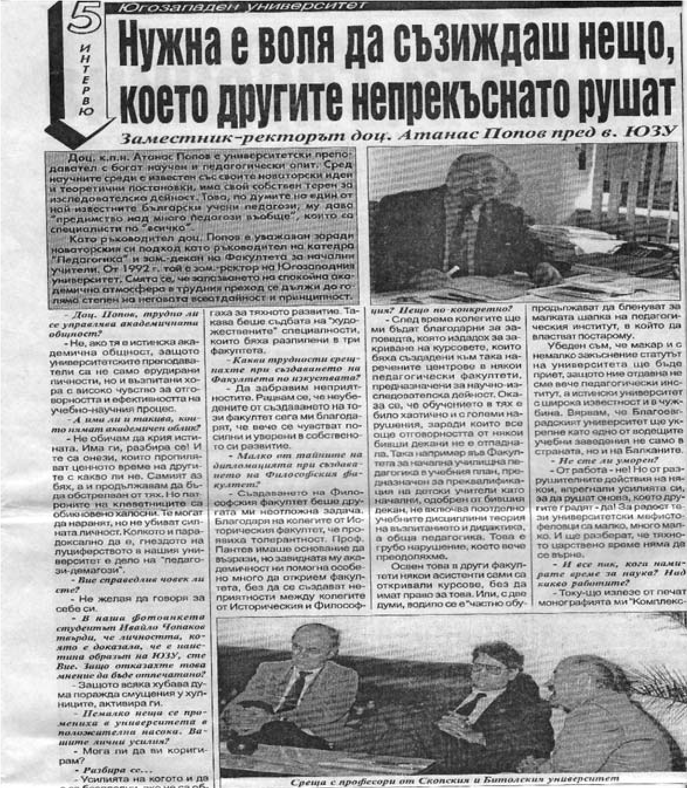

# 38. Въпреки големите трудности никога не се отклонявах от моята пътека

На 2 октомври 1997 година със заповед № КВ – 907 на министър – председателя на
Република България, на основание чл. 33 от Закона за научните степени и научните
звания, бях назначен за член на Научната комисия по обществени науки на Висшата
атестационна комисия.

За първи път в този висш орган бяха включени изтъкнати български учени, които
бяха потомци на родове, преследвани от комунистическата власт, като проф. Йордан
Венедиков, проф. Сийка Пенчева, проф. Енчо Герганов, доц. Тодор Чипев и други.

>   *Кабинетът ми като зам.-ректор беше достъпен за всеки, който искаше моята
>   помощ*

Понякога времето през деня не ми достигаше, за да изпълня всички задачи, които
имах като ръководител на катедрата, зам.-ректор, председател на Научния съвет по
педагогика и член на Комисията по обществени науки във ВАК. Именно затова често
превръщах вечерните часове в работни. Бях доволен обаче, защото не допусках
изоставане на пряката ми работа, свързана с големите академични отговорности. Не
ми оставаше време да мисля за продължаващите от време на време доноси и клевети
на моите дежурни хулници.

Всичко, което успях да направя с много усилия в продължение на немалко години в
Югозападния университет, се знаеше не само от моите добросъвестни колеги, но и
от цялата общественост в Благоевград. Именно затова в навечерието на
предстоящите избори за народни представители в Народното събрание през 1997
година беше издигната кандидатурата ми за депутат от Националния клуб за
демокрация, други политически организации, присъдружни на СДС, както и няколко
клубове на СДС (вж. Проф. Попов на предварителен вот в І мажоритарен район, в.
Струма, 14 март 1997 г. с.1 -2).

Както навсякъде, така и в политическите партии децата и внуците на партийни
секретари и активни борци против капитализма бяха научили уроците на своите
червени родственици как се спечелват избори. Така например решението на
Националния изпълнителен съвет на СДС за включването ми във вътрешния вот на
изборите беше умишлено прикривано и бе обявено едва един ден преди провеждането
на изборите.

В деня на изборите бяха констатирани от моите застъпници редица предумишлени
действия, най-важните от които бяха :

&minus;невключване в комисиите на секциите на представители на политическите
    организации, които издигнаха моята кандидатура;

&minus;в секциите се подаваше парола към избирателите за кого да гласуват;

&minus;пред входа на повечето секции, специално подготвени роднини на другите
    кандидати, най-вече на Илиян Попов, внук на активен борец против
    капитализма, агитираха идващите да не гласуват за мен, повечето от които
    бяха членове на бившата комунистическа партия;

&minus;при проверката на бюлетините с оказа, че в някои от тях имената са вписвани
    с един и същи почерк;

&minus;в една от комисиите са допълнително вписвани фиктивни гласоподаватели и т.н.

Извършените нарушения и манипулации по време на изборите не ме притесняваха
толкова, колкото това, което ставаше в университета. Той беше постоянно в моите
мисли, затова не отделях необходимото време за спечелването на избора ми за
народен представител, колкото за преодоляване на хаоса в университета. Въпреки
това за мен гласуваха 35 % от гражданите в Благоевград, предимно интелектуалци.
И по време на изборите борбата срещу мен се водеше пак от комунистите и техните
деца и внуци.

Когато през 1997 година някои от моите „колеги“ от ректорското ръководство се
бяха отдали отново на пътешествия по създадените пирамиди, ние с зам.-ректорката
доц. Ангелина Манова, зав. научно-изследователската дейност, продължавахме да
бъдем далеко от никнещите като гъби академични пирамиди.

В тези трудни години, за да не се разклаща академизмът в университета, често
имах срещи с някои от деканите в най-авторитетните факултети. Радвах се, когато
идваха в кабинета ми и споделяха моите идеи за укрепването на Югозападния
университет. Тези мои колеги бяха антиподи на създателите на академичните
пирамиди. Никога няма да забравя, че някои от тях постоянно ме информираха за
хубавите промени, които извършвахме заедно. Не забравяха да ме информират и за
привлечените нови авторитетни преподаватели, които в същност запазиха
Югозападния университет. Незабравими ще останат срещите ми за съдбата на
факултетите в университета с проф. Христо Арищиров, проф. Иван Стефанов, проф.
Йордан Шопов, доц. Антони Стоилов (сега професор), проф. Енчо Мутафов, доц.
Магдалена Глушкови (сега професор), доц. Александър Воденичаров (сега професор),
доц. Славчо Щраков и други.

>   *Такива справки за изтъкнати преподаватели получавах и от другите факултети
>   в университета*

Без да ги задължавам, посочените декани постоянно ме информираха за
новоизбраните преподаватели в техните факултети. Всъщност като зам.-ректор често
изпълнявах и функциите на онези мои колеги, които се бяха отдали изцяло на
„ползотворната“ за тях дейност в академичните пирамиди. През това време като
член на Комисията по обществени науки във ВАК спомогнах немалко за научното
израстване на някои преподаватели в университета. Имаше няколко неприятни
случаи, свързани опити да се попречи при научното израстване на някои колеги,
които успях да преодолея. Е, някои забравиха за това, но какво да се прави?
Важното е, че се постарах да помогна за увеличаване на хабилитираните
преподаватели в университета и получаването на заслужени научни степени и
звания.

Представящите се за „строители“ на Югозападния университет се срещаха със своите
посредници, за да скалъпят висше образование на някои, или пък да накичат други
с фалшиви професорски звания. Тогава те живееха ден за ден и разрушаваха това,
което другите изграждаха. Когато кабинетите им бяха затворени, гостите на
университета идваха винаги при мен, защото моят кабинет беше винаги отворен.

Спомням си, че колегата Пламен Граматиков от Природо-математическия факултет,
когото съм запомнил като енергичен и всеотдаен в своята преподавателска дейност
и връзките му с известни учени от чужбина, ме помоли да приема в кабинета си
колеги от Битолския университет. Разговорът ни беше свързан провеждането на
съвместна международна конференция в град Банско. Там събрахаме учени от цяла
Европа. На нея присъстваха и някои от министрите на образованието в тези страни.

Един ден приятелят ми проф. Милчо Лалков поиска с мен „разговор насаме“. Първо
ме попита защо не нося фамилното име Зимбилев.

&minus;Ти си правнук на създателя на първите новобългарски училища в Източна
    Македония Георги Иванов Зимбилев, който открива цяла просветна школа, през
    която са минали много дейци на възраждането от Неврокопско, Серско и
    Мелнишко.

След това Милчо ме хвана за рамото и продължи:

&minus;Зная всичко за твоя възрожденски род. И за трите жертви от него – прадядото
    Стоян, дядо ти Атанас и вуйчо ти Борис. Затова комунистите ги е страх от
    теб.

Когато се опитах да дам отговор на Милчо защо нашата фамилия от Зимбилева е
преименувана на Попова, той ме прекъсна и каза:

&minus;И това знам. След жестокото убийство на прадядо ти свещ. Стоян Зимбилев по
    време на молитва, в негова памет приемате новото фамилно име Попови.

След това разговорът ни с Милчо продължи за хубавите му идеи, свързани с
подговената от него международна конференция в историческия факултет.

Кой ли и за какво ли не е идвал при мен за наистина ползотворни разговори
тогава, когато университетът продължаваше да се тресе от безобразията на онези,
които го бяха почти забравили. Проф. Иван Стефанов, декан на Философския
факултет, и проф. Ради Радев леко чукаха на вратата и тихо влизаха в кабинета
ми. По това познавах, че са те. По-припрян беше проф. Христо Арищиров, декан на
Факултета по изкуствата, който беше пламнал от енергията, с която заедно с
неговия заместник Златко Павлов сплотяваха онези, които доскоро бяха разделени в
отделни факултети.

Стигна се до там, че през тези години кой каквато трудност срещаше, идваше при
мен, за да я споделя. Някои от другите мои колеги от Ректората нямаха време за
това. Те имаха своите постоянни грижи за решаване на личните си проблеми.Имаше и
немалко неприятни случаи, свързани с изглаждане на междуличностни отношения в
някои от факултетите.

За мен тези напрегнати години, когато истинските строители на Югозападния
университет не познаваха умората си, останаха незабравими. Забравиха ги само
онези, които имат къса памет и бяха се отдали на друга, а не на истинска
академична дейност.

