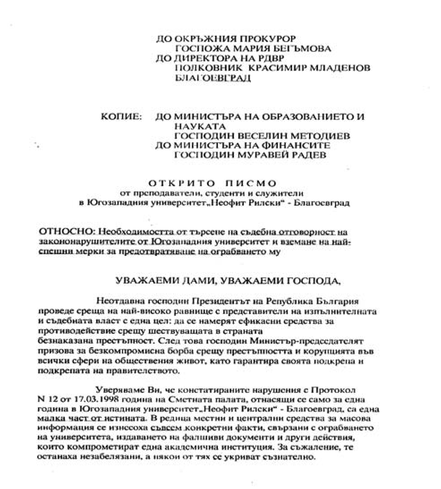
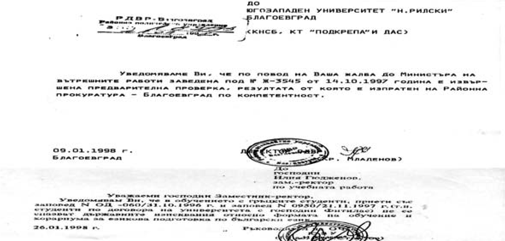

# 39. Започналата цялостна проверка на Сметната палата в Югозападния университет приключи на 17.03. 1998 г.

Въпреки опитите за прикриване на неприятните резултати от проверката на Смената
палата, те станаха известни. Констатираните тежки нарушения обаче бяха само за
една година, другите останаха в дълбока тайна. Това събра отново протестиращите
студенти, преподаватели и служители.

Недоволни от това, че и аз исках да се разкрие цялата истина за всички нарушения
в университета, които бяха извършени през последните няколко години и се знаеше
за тях в цялата страна, една „червена“ група от Академичния съвет беше
подготвила старателно свалянето ми като зам.-ректор. Те ме смятаха за конкурент
на проф. Чимев при евентуални избори за ново ректорско ръководство. Превратаджии
бяха замислили закриването на Института за повишаване на квалификацията, за
който отговарях като зам.-ректор. Искаха неговите функции да се прехвърлят към
факултетите, което щеше да внесе истински хаос при подготовката на тези кадри. А
на моите „врагове“ такъв хаос им беше много необходим.

Когато беше направено предложението за гласуване да се закрие Института за
повишаване на квалификацията, аз напуснах заседанието на Академичния съвет, за
да не попреча на инициаторите за свалянето ми. После се оказа, че с изключение
на тях всички останали членове на Академичния съвет отхвърлили направеното от
тях предложение, което посрещнали ужасени.

През м. април същата година Министърът на образованието и науката Веселин
Методиев изпрати комисия, която да проучва състоянието на университета въз
основа на констатациите, направени от Сметната палата. Ректорът и заместникът му
Илия Гюдженов бяха пак на „пътешествие“, за което не знаехме. Изненадващо се
появи Николай Божков, който беше посрещнат с възгласа „Вън разбойниците от
храма“.

През тези тежки години за Югозападния университет никога не напусках двете си
работни места – студентската аудитория, където изнасях редовно лекциите си, и
кабинета ми като зам.-ректор, където изпълнявах задълженията си като такъв.
Винаги бюрото ми беше отрупано с документи и писма, които очакваха отговор от
мен.

Тогава направих необходимото и за включването на Техническия колеж в структурата
на Югозападния университет. На няколко пъти имах срещи с ръководството на
колежа, с което обсъждахме всички проблеми от академичен, финансов и структурен
аспект. След това ръководството на колежа стана член на академичния съвет с
право да участва в общото събрание на университета (вж. Техническият колеж влиза
в състава на ЮЗУ, в. Струма, 7 април 1997 г.).

