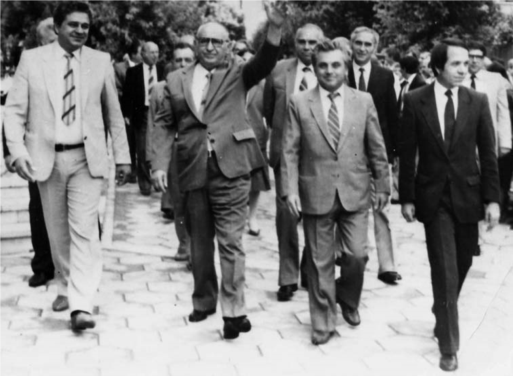

# 4. Тодор Живков на посещение във Висшия педагогически институт

През 1986 година, когато във Висшия педагогически институт вече се говореше
упорито за създаване на новата му структура по университетски образец, бяхме
изненадани от посещението на Тодор Живков, който беше заведен в новооткрития
Инжинерно-педагогически факултет, обявен за „образцов“.

>   *Тодор Живков, Лазар Причкапов, проф. Петър Николов и доц. Николай Божков на
>   излизане от Инжинерно-педагогическия факултет*

Главен „герой“ при това посещение беше доц. Николай Божков, който заблуди не
само нас, но и тогавашните партийни ръководители, че е създал модерен факултет,
с нови, непознати дотогава специалности. Тодор Живков заяви тогава, че не бива
да се напъваме да правим университет, а стига ни това да подготвяме само детски
и начални учители и специалисти в Инженерно-педагогическия факултет. Тези негови
думи се посрещнаха с огорчение от нас, които имахме в мислите си вече новата
структура на института. Същата година на студентския празник във Висшия
педагогически институт пристигна и Милко Балев, който отговаряше в Политбюро на
ЦК на БКП за науката и образованието. След словото му пред студентите в
спортната зала раздаде дипломите на новоизбраните хабилитирани преподаватели в
института.

До 10 ноември 1989 г. голям плакат, направен по тази снимка с Тодор Живков,
стоеше окачен пред входа на Инжинерно-педагогическия факултет, където
продължаваха да идват все „отбрани“ партийни и държавни ръководители.

След специално подготвеното посещение на Тодор Живков в Инжинерно-педагогическия
факултет, започна съвсем осезателно, скоростно израстване на Николай Божков като
„несравним новатор“ в развитието на Висшия педагогически институт. Той вече се
чувстваше като непоклатим, на когото бе разрешено всичко. Това, което
пожелаваше, го имаше. За кратко време сградата на неговия факултет беше
препълнена с модерни материално-технически средства, повечето от които си
останаха неизползвани, а след това изчезнаха безследно, поради което тогавашният
партиен и държавен контрол направи няколко проверки, които бяха обаче стопирани,
защото галеникът на академик Сава Гановски беше недосегаем.  

