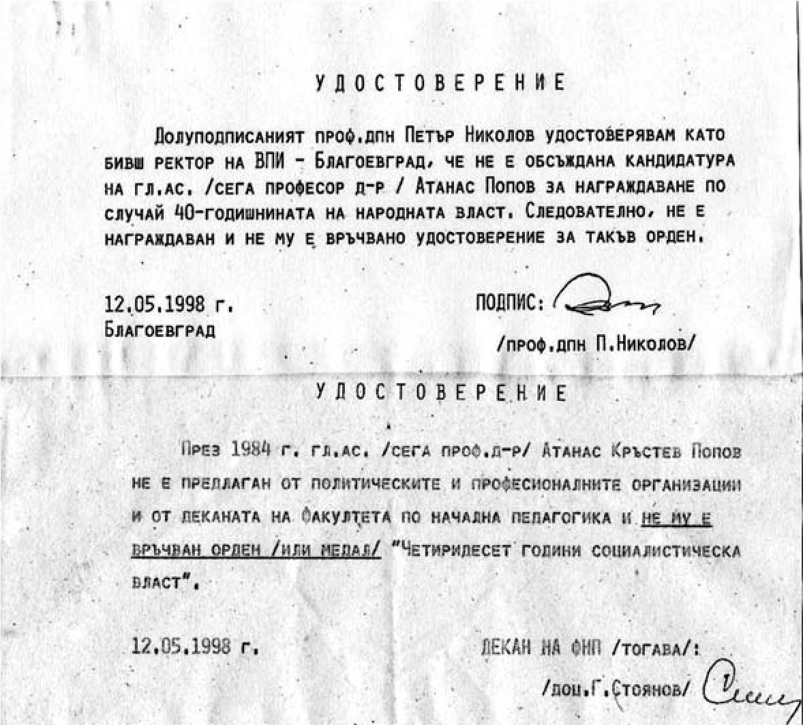

# 40. Неуморните хулници

Неприятностите, които се редуваха едни след други в работата на университета,
свиваха сърцето ми от болка, която ме измъчваше, защото знаех много повече неща
за хаоса, който създаваха онези, които се криеха, когато трябваше да се води
упорита борба за утвърждаване статута на университета, а когато воюваха срещу
мен като оцелял „враг на народната власт“ се събираха на тумби и бяха много
активни. Те спазваха стриктно специално разработваните указания от ВС на БСП, в
които бяха конкретизирани всички опорни точки за нестихваща борба срещу
„опасните“, които трябва да бъдат уморени от доноси и клевети.

>   *Указания на ВС на БСП към членовете и симпатизантите си за по-нататъшната
>   работа на общинските и местни партийни организации на БСП и клубовете*

Наедрялата червена група в университета все отбрани верни на „партията майка“
разпространяваше казаното от А.Луканов: „И когато губим, ние пак печелим“, което
много вдъхновяваше моите хулници.

Най-активираните „опорни точки“ в Указанието на ВС на БСП срещу мен бяха:

&minus;да се използват всички възможности за компроментиране

&minus;да се образуват съдебни дела срещу лицата, водили борба срещу БКП – да бъдат
    разпространявани слухове за тези лица в негативен порядък

&minus;да се направи всичко възможно за подронване на обществения им авторитет.

Йордан Колев продължаваше своята клеветническа битка срещу мен, съгласувана с
общинския съвет на БСП. Стигна се дотам, че ми беше фабрикувано фалшиво
удостоверение за награждаването ми с орден „40 години комунистическа власт“.

Силно възмутени от тази клевета бяха някогашният ректор на университета проф.
Петър Николов и деканът на Педагогиечския факултет доц. Георги Стоянов, които
със специално представени удостоверения отхвърлиха поредния фалшификат на автора
на скодоумните писания срещу мен.

Спомням си, че когато Педагогическият факултет се премести в бившата сграда на
Партийния дом в Благоевград, в кабинета ми като ръководител на катедрата
секретарката намери цели купища готови удостоверения, подписани и подпечатани,
но без вписани имена на наградените. Едно от тях е било заделено за мен, за да
бъда компроментиран.

И този път обаче не изостана от Йордан Колев и Петър Петров, който пък като
спохождаше редовно Русенския университет, беше дал обещание на асистента Пенев,
че ще го „уреди“ по-лесно за доцент, ако скалъпи някаква лъжа срещу мен, че съм
го тормозил като асистент при нас. Жертва на подстракателя на Пенев стана и друг
негов колега от същия университет, съфамилник на Петров, който пък е бил
уверяван, че по-лесно ще бъде „уреден“ да получи научна степен, ако напише
статия срещу мен, свързана с току-що издадена моя книга.

*Удостоверенията от ректора на университета проф.Петър Николов и декана на
Факултета по педагогика доц. Георги Стоянов, от които е видно, че не съм
награждаван по случай 40-годишнината на народната власт*

Който няма закалка от ужасите през годините на комунистическия режим, той
сигурно не може да издържи на такива удари като тези, които получавах аз през
повечето от годините на скроения посткомунизъм. Но след всеки удар срещу мен не
падах, а се изправях по-високо, за да набера повече сили и да разкрия истинския
образ на червените отрочета, които се страхуваха от възмездие.

