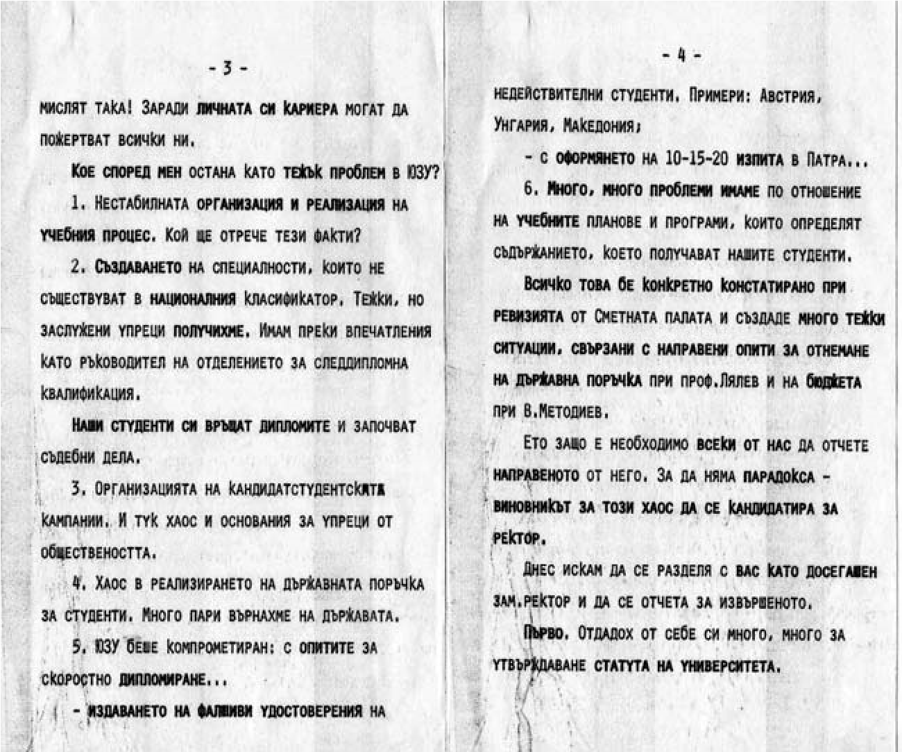

# 41. Ректорът Илия Гюдженов и неговото обкръжение

През учебната 1998 – 1999 година започна усилена подготовка по опорните точки на
Указанието на ВС на БСП за избор на нов ректор на Югозападния университет.
Според тях трябваше да бъде непременно комунист. Най-подходящ според опорните
точки в червеното указание се оказа Илия Гюдженов. Много по-рано от предстоящите
избори той вече се чувстваше като ректор и пред персонала на университета се
представяше като такъв. Няколко служителки идваха при мен, за да ми се оплакват,
че ги заплашвал с уволнение, ако не слушат.

Най-после дойде мечтаният ден от Илия Гюдженов. На 10.10.1999 година 201
аудитория на университета беше препълнена не само от членовете на Общото
събрание, но и от някои непознати „гости“. Другият кандидат за ректор беше
проф.Енчо Мутафов, от когото комунистите в университета се страхуваха, защото
беше известен като „седесар“.

Когато излязох на трибуната и направих моето изказване, подчертах необходимостта
да се преодолеят онези слабости, които подронваха авторитета на университета.
Между другото споменах и за явлението „посредничество“. Точно в този момент
вратата на зала 201 се отвори и се показа Ицо Кмета, посредникът, когото изгоних
от кабинета на Гюдженов. Понеже той беше известен в университета, цялата зала
гръмна. Не знаех, че в подготовката за ректор са взели учестие и такива като Ицо
Кмета, които след това се събраха пред входа на залата.

След моето изказване на трибуната побърза да застане един от „вътрешните“
посредници, който беше член на Общото събрание и заемаше важна длъжност в
администрацията на университета. Той започна да величае кандидатурата на
Гюдженов като най-подходяща и безспорна.

Не знам защо, но след избора на Гюдженов за ректор той дойде при мен гузен и ме
помоли да се видим в кабинета му. Страхуваше се да не излязат на бял свят
неприятните истини, които знаех за него. Предложи ми да приема някаква длъжност
в ректората. Отказах и продължих работата си като преподавател, ръководител на
Катедрата по педагогика и председател на Научния съвет по педагогика и
психология.

Новото ректорско ръководство, което беше стъкмено с помощта на ГК на БКП в
Благоевград, изработи специална стратегия за отстраняване от ръководни длъжности
във факултетите и катедрите на онези, които бяха белязани като „опасни“. Един от
тях бях и аз. Тази задача изпълни тогавашният председател на Контролния съвет в
университета, който през годините на тоталитарния режим беше един от
най-близките приятели на главния цензор в държавата Валентин Караманчев,
кандидат член на ЦК на БКП, директор на издателство „Народна младеж“, на
Партиздат, както и генерален директор на ДСО „Книгоиздаване“ и председател на
Държавно творческо и стопанско обединение „Българска книга и печат“. Този нов
кадровик в Югозападния университет изпрати писмо до декана на факултета да бъда
освободен като ръководител на Катедрата по педагогика поради това, че съм
наближавал годините за пенсиониране. Посрещнах спокойно това партийно нареждане.

За ръководител на Катедрата по педагогика беше избран доц. Димитър Димитров, с
когото бяхме в много добри колегиални взаимоотношения. Той прояви мъдрост,
каквато нямаха някои от другите, които се подготвяха от партийната група да
заемат тази длъжност. Получи се добра приемственост в работата на катедрата.
След това обаче той беше белязан от кадровиците във факултета като неподходящ за
по-нататъшно научно израстване и няколко пъти беше провалена кандидатулрата му
за научното звание „Професор“ от специално подбрани рецензенти.

Новият ректор на университета доц. Илия Гюдженов започна промените в
университета първо със закупуването на нова, луксозна лека кола. Старата „Лада“
на него не му прилягаше. В печата се сочеше сумата 36 хиледи лева. Не му
прилягаше и остарелия кабинет на предишните ректори. Искаше непременно да има
специална сграда за ректорат. Нагледа се на недовършената сграда, която беше по
план за Културен дом на студентите. Някога зам.министърът на финансите Горан
Банков по мое упорито настояване ни осигури 8 милиона лева за неговото
построяване, но и така след това не разбрах къде се прахосаха тези пари.

Новият ректор запази и предишния си просторен кабинет, където пък се настани
като ръководител на лаборатория по дидактика, психология и управление на висшето
образование. Та той не е нито дидактик, нито психолог или пък специалист по
управление на образованието.

Привика около себе си все подбрани съветници. Неразделен беше с бившия секретар
на вузовския комитет на БКП Никола Лазаров, заздрави връзките си и с неговия
заместник по идеологическите въпроси Йордан Колев. Взаимоотношенията на Илия
Гюдженов и Никола Лазаров останаха неразгадана тайна, но „академичната“ му
дружба с Йордан Колев беше съвсем явна и свързана със спазването на уговорката
за взаимна помощ „ти на мене, аз на тебе“. Става дума за тяхната взаимна
подкрепа. Гюдженов предложи Колев в състава на СНС по педагогика, а след това
същият пък му върна услугата при избирането на Гюдженов за професор с
осигуряването на подходящи рецензенти, каквито бяха Петър Петров и проф.

Марга Георгиева.

Ректорът посети специално няколко пъти Председателя на ВАК Георги Марков, за да
го убеди, че Колев трябва да стане „голям“ доктор. Тогава бях още член на
Комисията за обществени науки към ВАК, която три пъти отхвърляше избора на
Колев, но с благословията на Гюдженов мечтата му се сбъдна. Така е, комунистът
не забравя своя събрат, когато изпадне в нужда. След това Илия Гюдженов потърси
помощта и на създателя на академичните пирамиди Николай Божков, с когото
действаха заедно за тяхното укрепване, както и на Петър Балкански, бивш зав.
отдел ДПО „ Септемврийче“ и четите „ Чавдарче“ към ЦК на ДКМС, известен като
агент Байкушев. Те му помогнаха да разработи „знаменитото“ изследване
„Референтна рамка за организацията на образователния процес във висшето
училище“, с което получи научното звание „Професор“. За тази голяма услуга
Гюдженов прикри публикацията на Славей Костадинов от 21 април 2005 г. „Проф.
Балкански от Югозападния университет, обвинен в търговия с дипломни работи“, в
която черно на бяло се показват две едни и същи дипломни работи, на които научен
ръководител е Петър Балкански. Имаше оплаквания от студенти, че за всяка
подарена готова дипломна работа „научният ръководител“ е получавал тлъста сума
пари. Разбра се, че Гюдженов не беше забравил опита на онези, които правеха
скоростно научната си кариера.

Един месец след скандала за продажбата на дипломни работи от Петър Балкански,
Катедрата по педагогика и Факултетният съвет ме предложиха в Академичния съвет
за „почетен професор“. Цялата група от бивши партийни и комсомолски секретари се
вдигнала на крак, за да провали избора. С дяволски мимики и жестове Гюдженов
давал знак как да се гласува против. Не прочел обоснованото предложение от
катедрата, не обелил и нито дума за съвместната ни работа като зам.-ректори.
Тогавашният зам.-ректор Димитър Димитров разбира сговора на моите неприятели и
предлага да се отсрочи гласуването на следващото заседание. Но след това
калените от „партията-майка“ се подготвят още по-активно за провала на избора ми
за „почетен професор“. Някои от тях напомняли на новите членове на Академичния
съвет, които не ме познаваха, че съм приложил „Закона Панев „ за лустрирането им
през 1993 г.

Единственият предложен, но неизбран „почетен професор“ от Югозападния
университет, на който посветих цели 25 години, съм аз. Така е, когато червените
те захапят лошо. Горките, те не знаеха, че аз нямаше да приема тяхната червена
диплома за „почетен професор“, така както не приех и значката на университета,
когато научих, че тя ще се дава на коктейл, подготвен от една мутра, която имаше
близки взаимоотношения с някои от новото ръководство.

Не се мина много време и последва нов удар срещу мен. Бях създал дисциплината
„Етнопедагогика“, към която студентите проявявах небивал интерес. Но секретарят
по идеологическите въпроси във ВК на БКП Йордан Колев и отговорникът на
партийната група в Катедрата по педагогика Траян Попкочев отидоха при Гюдженов и
след това часовете по тази дисциплина бяха дадени на Йордан Колев. Тогава
двамата неразделни приятели бяха вече известни с „научното откритие“, че няма
термин „възпитание“, а само термин „образование“. Бях твърдо убеден, че Колев не
познаваше семантиката и на термина „етнопедагогика“. Като научили за това,
десетина студенти дойдоха в апартамента ми, за да изразят възмущението си. Цели
три месеца студентите не посещаваха лекции при Колев, който си нямаше хабер от
тази научна дисциплина. Тогава категорично реших, че трябва да се разделя с
бившите партийни и комсомолски секретари, които вече бяха превзели
педагогическия факултет.  

